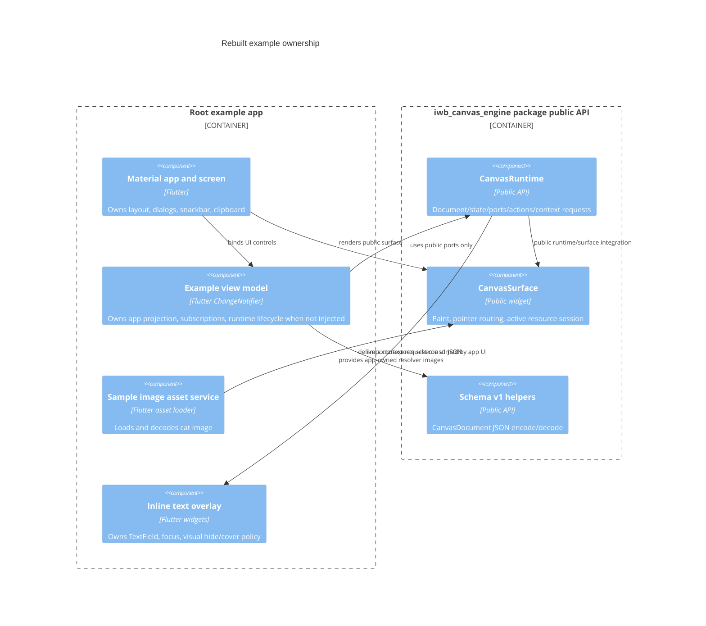
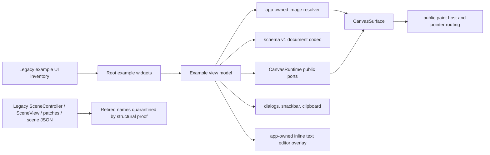
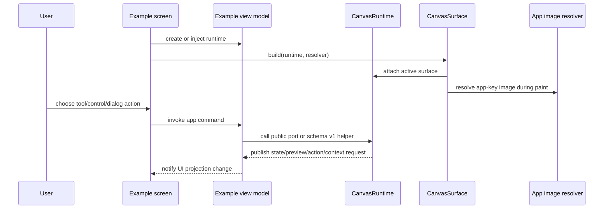
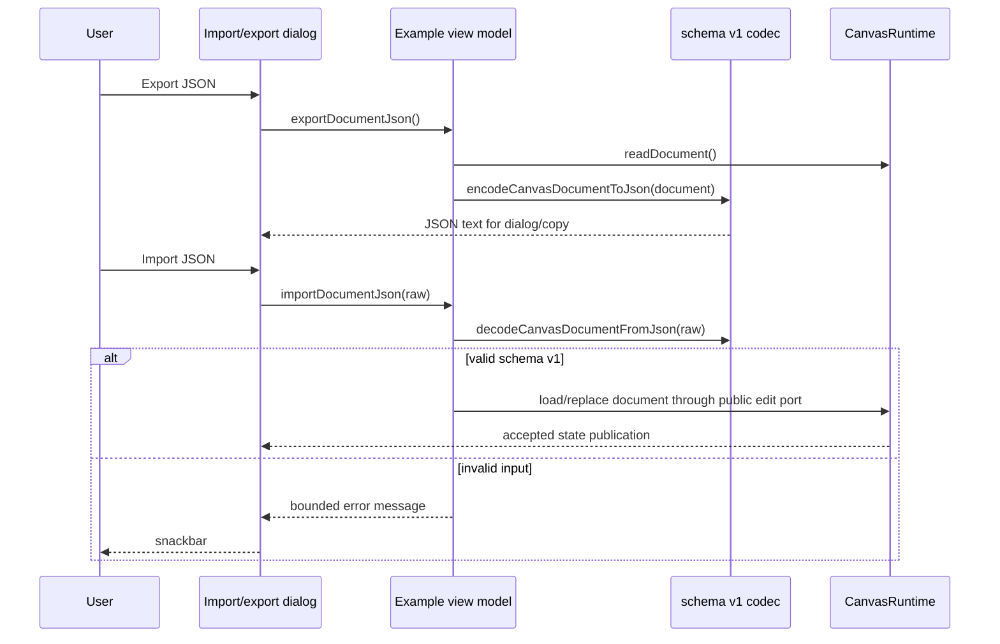

# Design: Legacy Example Full Parity Port

---
date: 2026-06-03
designer: Codex
commit: 14b9fb9a
branch: new-architecture
design_question: "Design the port of the old legacy example to the rebuilt engine while preserving the original functionality 100%."
---

## Disposition

READY_FOR_CONTRACT

## Product Outcome

Create a runnable rebuilt Flutter example that preserves the legacy example's
user-facing canvas workflows while proving the rebuilt engine is usable through
the public package API only.

The preserved outcome includes app startup, surface rendering, pointer
interaction, move/draw mode switching, pencil/marker/line/eraser tools, draw
colors, selection actions, camera controls, grid/background controls, sample cat
image insertion and rendering, JSON export/import workflow, clear canvas,
pending-line indicator, text options, inline text editing, dialogs, snackbars,
and lifecycle cleanup.

Non-goals:

- Do not reintroduce `SceneController`, `SceneView`, `NodeSpec`, `NodePatch`,
  `PatchField`, legacy codec shapes, or any legacy facade into the rebuilt
  public API.
- Do not place an application adapter abstraction inside the engine package.
- Do not make P14 depend on new engine feature behavior; the example may expose
  existing public capabilities, but missing engine behavior must be handled as a
  contract blocker, not patched through internals.
- Do not promise legacy exported JSON file compatibility. The preserved workflow
  is "export JSON, copy it, import JSON, show an error on invalid input" using
  rebuilt schema v1. Product explicitly does not require importing old
  `encodeSceneToJson` payloads.

## Target Contract Classification

- Profile: `BEHAVIOR_CHANGE`
- Obligations: `SEAM_MIGRATION`

This is user-visible because the rebuilt package currently has no non-legacy
root example, and the future implementation will add a runnable app. It is also
a seam migration because the legacy example's controller-facing app model must
be rewritten around the rebuilt public runtime/surface boundary.

## Research Inputs

- `docs/history/research/2026-06-03-example-full-parity-before-p14.md` - factual inventory
  of the legacy example, current public API, P14 constraints, missing root
  example, asset/pubspec requirements, and verification implications.

## Repository Evidence

`Evidence Consequence Link`: each fact below states the design decision,
boundary, execution unit, proof surface, or review consequence it supports.

- `docs/history/research/2026-06-03-example-full-parity-before-p14.md:13` - the legacy
  example starts a Material app, owns or accepts a controller, renders a scene,
  exposes controls, loads a cat image, imports/exports JSON, and owns inline
  text editor UI -> supports the parity inventory and future widget/app units.
- `docs/history/research/2026-06-03-example-full-parity-before-p14.md:15` - the rebuilt
  public API exposes `CanvasRuntime`, `CanvasSurface`, DTOs, ports, streams, and
  schema v1 helpers while intentionally not exporting legacy shapes -> supports
  rewriting around public API instead of copying controller-facing code.
- `docs/history/research/2026-06-03-example-full-parity-before-p14.md:17` - most user-facing
  behavior is portable, but blocking compatibility work includes asset/pubspec
  ownership, legacy JSON compatibility scope, and verification wiring -> supports
  sequencing asset/app/test decisions before implementation.
- `docs/history/research/2026-06-03-example-full-parity-before-p14.md:25` - legacy `main`
  owns startup and dependency injection -> supports keeping app startup as an
  example-owned responsibility.
- `docs/history/research/2026-06-03-example-full-parity-before-p14.md:26` - legacy sample
  image service loads package/local cat asset bytes and decodes a `ui.Image` ->
  supports app-owned asset service and resolver proof.
- `docs/history/research/2026-06-03-example-full-parity-before-p14.md:27` - legacy view
  model owns app state, controller operations, text/import/export, listeners, and
  disposal -> supports replacing it with a rebuilt app view model that owns
  `CanvasRuntime` lifecycle and subscriptions.
- `docs/history/research/2026-06-03-example-full-parity-before-p14.md:28` - legacy controls
  dock renders mode, tools, selection, grid, background, import/export, and clear
  controls -> supports carrying the dock UI forward with next-owned enum/port
  mappings.
- `docs/history/research/2026-06-03-example-full-parity-before-p14.md:29` - legacy screen
  composes surface, text options, dock, overlay, dialogs, snackbar, and lifecycle
  -> supports keeping Flutter UI composition outside engine code.
- `docs/history/research/2026-06-03-example-full-parity-before-p14.md:30` - legacy surface
  renders `SceneView` and overlays pending-line markers -> supports replacing
  the rendering child with `CanvasSurface` plus app-owned pending-line overlay
  derived from public preview state.
- `docs/history/research/2026-06-03-example-full-parity-before-p14.md:31` - legacy text
  overlay positions a transformed `TextField` with app-owned controller/focus
  -> supports app-owned inline editor policy after context request delivery.
- `docs/history/research/2026-06-03-example-full-parity-before-p14.md:32` - legacy text
  options panel exposes selected text style controls -> supports a future mapping
  from public selected text DTOs to `CanvasElementUpdate` edits.
- `docs/history/research/2026-06-03-example-full-parity-before-p14.md:34` - legacy example
  used `SceneController`, `SceneView`, `PatchField`, `NodeSpec`, text snapshots,
  and legacy codec helpers -> supports explicit retired-shape quarantine in the
  future contract.
- `docs/history/research/2026-06-03-example-full-parity-before-p14.md:36` - Flutter-only
  responsibilities were already separated in the legacy example -> supports
  preserving widget responsibilities while replacing only engine-facing model
  calls.
- `docs/history/research/2026-06-03-example-full-parity-before-p14.md:40` - every
  user-facing behavior found in `example/lib` was inventoried -> supports using
  that research note as the parity checklist source input.
- `docs/history/research/2026-06-03-example-full-parity-before-p14.md:57` - legacy inline
  editing hid the node by mutating visibility before editing -> supports changing
  hide policy because the rebuilt text request contract forbids mutating the
  target element as part of request-originated editing.
- `docs/history/research/2026-06-03-example-full-parity-before-p14.md:62` - legacy defaults
  came from `SceneDefaults`, while the rebuilt app must provide equivalent
  values through public document/background/grid/palette DTOs -> supports
  app-owned default document construction.
- `docs/history/research/2026-06-03-example-full-parity-before-p14.md:66` - the public barrel
  exports the rebuilt API facade files and registry-owned declarations ->
  supports a root-barrel-only import rule for example code.
- `docs/history/research/2026-06-03-example-full-parity-before-p14.md:68` - `CanvasRuntime`
  public read/observe/port surface includes document, state, edits, selection,
  tools, commands, camera, resources, preview, actions, context requests, ids,
  and dispose -> supports app view model ownership through `CanvasRuntime`.
- `docs/history/research/2026-06-03-example-full-parity-before-p14.md:70` - `CanvasSurface`
  accepts a runtime, resolver, styles, and `interactive` flag and owns surface
  attach/paint/pointer routing -> supports replacing `SceneView` with the public
  surface widget.
- `docs/history/research/2026-06-03-example-full-parity-before-p14.md:72` - runtime ports
  relevant to the example are public -> supports not adding any new public API
  unless implementation discovers a missing parity capability.
- `docs/history/research/2026-06-03-example-full-parity-before-p14.md:84` - current public
  limitations include banned legacy shapes, no public interaction request id
  generator, `CanvasFieldUpdate` instead of `PatchField`, app-owned resource IO,
  and request-originated text edit constraints -> supports compatibility mapping
  and proof obligations.
- `docs/history/research/2026-06-03-example-full-parity-before-p14.md:187` - current rebuilt
  package has no root `example/`, no rebuilt `image/cat.png`, no root flutter
  asset declaration, and no public legacy symbols/codecs -> supports adding a
  root example and avoiding legacy imports.
- `docs/history/research/2026-06-03-example-full-parity-before-p14.md:192` - public consumer
  access is rooted at `package:iwb_canvas_engine/iwb_canvas_engine.dart` and
  external proof must compile without `src/**`, legacy symbols, or internals ->
  supports enforcing public-only example imports.
- `docs/history/research/2026-06-03-example-full-parity-before-p14.md:194` - resource
  descriptors are committed document state while bytes/images and resolution are
  app-owned and surface-session-bound -> supports app-owned sample image service
  and `CanvasResourceResolver`.
- `docs/history/research/2026-06-03-example-full-parity-before-p14.md:195` - text editor UI
  is application-owned after context request delivery -> supports app-owned
  overlay/focus/lifetime.
- `docs/history/research/2026-06-03-example-full-parity-before-p14.md:196` - P14 is release
  proof and packaging, not a feature phase -> supports treating missing engine
  behavior as a blocker rather than expanding engine scope inside the example
  port.
- `docs/history/research/2026-06-03-example-full-parity-before-p14.md:200` - legacy JSON
  compatibility is an open question, and the rebuilt public API exposes schema
  v1 helpers -> supports selecting schema v1 workflow parity and rejecting
  implicit legacy payload compatibility.
- `docs/contracts/public_api_v1.md:88` - the root package exports exactly the
  names listed in `docs/_registry/public_api_v1.yaml` -> supports using public
  registered names only.
- `docs/contracts/public_api_v1.md:103` - legacy public symbols from the legacy
  package are not exported by the rebuilt package -> supports no legacy symbol
  dependencies in the example.
- `docs/contracts/public_api_v1.md:127` - external adapter proof imports only
  the public barrel -> supports root-barrel-only example import policy.
- `docs/contracts/public_api_v1.md:136` - external fixture must compile without
  `src/**`, legacy symbols, or internal runtime classes -> supports future
  structural proof for the example.
- `docs/contracts/public_api_v1.md:141` - behavioral integration is covered by
  focused runtime, interaction, and surface tests -> supports app tests plus
  focused public consumer proof instead of duplicating all engine internals.
- `docs/contracts/public_api_v1.md:2352` - application decides whether to show a
  context menu or text editor after a text target request -> supports app-owned
  text overlay selection.
- `docs/contracts/public_api_v1.md:2355` - app may visually cover or hide the
  text element in overlay UI but must not mutate the target element to hide it
  because that stales the request -> supports changing legacy hide-by-patch into
  overlay-only hiding.
- `docs/contracts/public_api_v1.md:2359` - app commits request-originated text
  changes through `CanvasCommandPort.commitTextEdit` -> supports command-port
  commit strategy.
- `docs/implementation/p14_benchmarks_diagrams_and_release_readiness.md:20` -
  P14 build scope includes no app adapters inside the engine package -> supports
  app-owned example code and no engine-side adapter abstractions.
- `docs/implementation/p14_benchmarks_diagrams_and_release_readiness.md:120` -
  P14 exit gate requires no legacy imports -> supports import guard proof.
- `docs/implementation/p14_benchmarks_diagrams_and_release_readiness.md:126` -
  P14 exit gate requires no app adapters in package -> supports avoiding names
  or abstractions such as app-engine adapter inside package source.
- `docs/implementation/p14_benchmarks_diagrams_and_release_readiness.md:137` -
  P14 must not introduce new feature behavior -> supports limiting the example
  to already public engine capabilities.
- `docs/verification/guardrails.md:169` - `api.integration_surface_complete`
  requires an external app-adapter compile fixture that imports only the public
  barrel and proves the public surface is enough while the adapter itself is not
  in package -> supports root-barrel-only compile proof.
- `docs/verification/guardrails.md:185` - `core.no_legacy_imports` forbids
  legacy package/runtime imports -> supports no `legacy/**` dependency.
- `docs/verification/guardrails.md:247` - integration surface proof compiles the
  fixture and checks only root barrel import, no `src/**`, no legacy symbols, and
  required operation families -> supports adding or extending public-consumer
  proof instead of relying on manual screenshots only.
- `docs/verification/release_gates.md:235` - final release gate requires
  `AppCanvasPort`, `LegacyEngineAdapter`, and `NextEngineAdapter` not be present
  in the engine package -> supports avoiding those abstractions in root package
  source.
- `docs/verification/tests.md:443` - external consumer behavior tests prove
  ordinary users can import the public barrel and execute public behavior ->
  supports using the consumer harness for package-boundary behavior.
- `docs/verification/tests.md:579` - public smoke test already proves external
  consumer decode/runtime/surface/interactions through the public API -> supports
  adding only example-specific gaps.
- `docs/verification/tests.md:600` - P13 smoke coverage includes public
  `CanvasSurface` pointer/resource bridge behavior -> supports relying on public
  surface semantics for example pointer and resource rendering.
- `docs/verification/tests.md:765` - P13 surface tests prove single active
  surface, resource-session lifecycle, pointer normalization, interactive false,
  and paint host behavior -> supports not reimplementing those policies in the
  example.
- `analysis_options.yaml:2` - analyzer excludes `legacy/**` but not `example/**`
  -> supports analyzing a root example with normal package analysis unless future
  contract chooses a nested Flutter example package with its own checks.
- `tool/guardrails/src/core_boundary_checks.dart:23` - core boundary checks
  analyze only `lib` -> supports adding explicit example import checks because
  existing production guardrails do not automatically scan example code.
- `lib/iwb_canvas_engine.dart:1` - root barrel exports public API facade files ->
  supports example import through `package:iwb_canvas_engine/iwb_canvas_engine.dart`.
- `lib/src/api/canvas_runtime.dart:26` - `CanvasRuntime` is the public runtime
  declaration -> supports replacing legacy controller ownership with runtime
  ownership.
- `lib/src/api/canvas_runtime.dart:39` - runtime exposes document, state, edits,
  selection, tools, commands, camera, resources, preview, actions, context
  requests, ids, and dispose -> supports future app view model API mapping.
- `lib/src/surface/canvas_surface_widget.dart:14` - `CanvasSurface` is the public
  surface widget -> supports replacing legacy scene rendering.
- `lib/src/surface/canvas_surface_widget.dart:108` - surface attach creates the
  active resource session through the runtime surface port -> supports passing
  the app resolver to `CanvasSurface` instead of making the app manage frame
  resource lifecycle.
- `lib/src/api/canvas_codec.dart:7` - public schema write version is v1 and read
  versions contain v1 -> supports schema v1 JSON import/export workflow.
- `lib/src/api/canvas_codec.dart:13` - public encode/decode helpers operate on
  `CanvasDocument` -> supports using rebuilt document JSON instead of legacy
  scene JSON.
- `test/api_contract/app_next_engine_adapter_compile_fixture_test.dart:20` - the
  app adapter fixture test checks import lines and rejects `/src/` and legacy
  symbols -> supports an analogous example import/retired-symbol proof.
- `test/smoke/public_incremental_smoke_test.dart:18` - external consumer smoke
  source imports Flutter and the public barrel -> supports future consumer test
  shape for example-level public behavior.
- `test/smoke/public_incremental_smoke_test.dart:920` - public consumer surface
  proof exercises `CanvasSurface` pointer and resource bridge -> supports using
  the public surface in the example.
- `pubspec.yaml:10` - rebuilt root package depends on Flutter and `path_drawing`
  and has no root `flutter.assets` section in the inspected lines -> supports
  future asset ownership work for the example.
- `legacy/iwb_canvas_engine/pubspec.yaml:40` - legacy package declares
  `image/cat.png` as a Flutter asset -> supports copying or relocating the cat
  asset for rebuilt example parity.
- `legacy/iwb_canvas_engine/example/pubspec.yaml:12` - legacy example depends on
  the package by path -> supports making the rebuilt example a public package
  consumer, not an internal source import.
- `legacy/iwb_canvas_engine/example/pubspec.yaml:14` - legacy example used
  `vector_math` only for overlay transform helpers -> supports either preserving
  the dependency in the example package or replacing it with Flutter `Matrix4`
  primitives if the future contract can keep overlay behavior identical.
- `legacy/iwb_canvas_engine/example/lib/ui/canvas_example/view_models/canvas_example_view_model.dart:17`
  - legacy view model creates `SceneController` when none is injected -> supports
  rebuilt view model creation of `CanvasRuntime` when none is injected.
- `legacy/iwb_canvas_engine/example/lib/ui/canvas_example/view_models/canvas_example_view_model.dart:127`
  - legacy export uses `encodeSceneToJson` -> supports mapping export to
  `encodeCanvasDocumentToJson`.
- `legacy/iwb_canvas_engine/example/lib/ui/canvas_example/view_models/canvas_example_view_model.dart:139`
  - legacy import uses `decodeSceneFromJson` and replaces the scene -> supports
  mapping import to `decodeCanvasDocumentFromJson` plus `runtime.edits.loadDocument`.
- `legacy/iwb_canvas_engine/example/lib/ui/canvas_example/view_models/canvas_example_view_model.dart:267`
  - legacy finish text edit patches text and restores visibility -> supports
  using `commitTextEdit` for request-originated content changes and app-only
  overlay hiding.
- `legacy/iwb_canvas_engine/example/lib/ui/canvas_example/view_models/canvas_example_view_model.dart:381`
  - legacy begin inline edit responds to engine text edit requests -> supports
  listening to `CanvasRuntime.contextActionRequests`.
- `legacy/iwb_canvas_engine/example/lib/ui/canvas_example/view_models/canvas_example_view_model.dart:392`
  - legacy begin edit mutates visibility to hide the node -> supports explicit
  rejection of that old mechanism under rebuilt text-request rules.
- `legacy/iwb_canvas_engine/example/lib/ui/canvas_example/widgets/canvas_example_screen.dart:80`
  - legacy screen composes surface, camera controls, text options, dock, and
  overlay -> supports preserving screen layout with rebuilt dependencies.
- `legacy/iwb_canvas_engine/example/lib/ui/canvas_example/widgets/canvas_example_screen.dart:243`
  - legacy export dialog shows JSON and copy action -> supports preserving dialog
  workflow.
- `legacy/iwb_canvas_engine/example/lib/ui/canvas_example/widgets/canvas_example_screen.dart:278`
  - legacy import dialog accepts JSON and reports errors through snackbar ->
  supports preserving import UX with schema v1 validation errors.
- `legacy/iwb_canvas_engine/example/lib/ui/canvas_example/widgets/canvas_controls_dock.dart:156`
  - legacy dock starts with mode toggle and scrollable tool/actions area ->
  supports carrying dock composition forward.
- `legacy/iwb_canvas_engine/example/lib/ui/canvas_example/widgets/canvas_controls_dock.dart:164`
  - legacy draw mode exposes pen, marker, line, and eraser -> supports mapping to
  `CanvasDrawTool` values.
- `legacy/iwb_canvas_engine/example/lib/ui/canvas_example/widgets/canvas_controls_dock.dart:237`
  - legacy dock exposes grid and system menus -> supports preserving these
  controls through public edit operations.
- `legacy/iwb_canvas_engine/example/lib/data/services/sample_image_asset_service.dart:16`
  - legacy image service tries package and local cat asset keys -> supports
  future asset key policy in root example.
- `legacy/iwb_canvas_engine/example/lib/ui/canvas_example/widgets/canvas_text_edit_overlay.dart:63`
  - legacy text overlay uses Flutter `TextField` with app-owned focus/controller
  -> supports preserving app-owned editor UI.

## Design Form Candidates

### Candidate A. Root public-consumer example app

- Form: add a root `example/` Flutter app/package that imports only
  `package:iwb_canvas_engine/iwb_canvas_engine.dart`, owns a rebuilt example view
  model around `CanvasRuntime`, renders `CanvasSurface`, and keeps all app UI,
  sample asset loading, text overlay, and dialogs app-owned.
- Why it could work: the rebuilt public API already exposes the runtime,
  document, surface, resource resolver, codec, tool, command, camera, selection,
  preview, action, and context-request concepts needed by the legacy example.
  It also aligns with Flutter package convention and makes the example runnable.
- Gate failures or risks: needs explicit verification because production
  guardrails scan `lib`, not `example`; needs root asset/pubspec ownership; must
  not introduce app adapter names forbidden by final release gates.

### Candidate B. Test-only external consumer fixture

- Form: keep the port under `test/api_contract/fixtures` or generated temporary
  consumer source and prove it compiles/behaves through public API, without a
  shipped root example.
- Why it could work: existing verification already uses external consumer
  fixtures and harnesses for public API proof.
- Gate failures or risks: fails the product outcome because users do not get a
  runnable example app; it preserves proof but not the legacy example's
  discoverable application surface.

### Candidate C. Engine-side adapter or legacy compatibility facade

- Form: add an adapter/facade inside package source that emulates
  `SceneController`/`SceneView` or maps legacy example code into the rebuilt
  engine.
- Why it could work: it would reduce immediate UI rewrite effort.
- Gate failures or risks: fails ownership and source-of-truth gates because app
  adaptation would live inside engine source; conflicts with the P14 "no app
  adapters inside the engine package" scope, final release gate wording, public
  legacy-symbol bans, and no-legacy-import exit gate.

### Candidate D. Root example with app-owned legacy JSON bridge

- Form: implement Candidate A plus an app-owned translator that imports old
  `encodeSceneToJson` payloads into rebuilt `CanvasDocument`.
- Why it could work: it could make old copied JSON payloads importable without
  changing engine public API.
- Gate failures or risks: the current research did not establish a complete
  legacy-scene-to-schema-v1 migration contract; it would add a durable
  compatibility concern whose owner, fixtures, and source of truth are not
  currently defined. It also risks making P14 introduce new feature behavior.
  This can become a separate design/contract if product explicitly requires
  old-file compatibility.

## Known Future Pressures

| Pressure | Evidence | How the selected form responds | Accepted cost or risk |
|---|---|---|---|
| P14 release gates reject legacy imports, legacy facade, and in-package app adapters. | `docs/implementation/p14_benchmarks_diagrams_and_release_readiness.md:120`, `docs/implementation/p14_benchmarks_diagrams_and_release_readiness.md:126`, `docs/verification/release_gates.md:235` | Root example imports only the public barrel and does not introduce adapter abstractions in `lib`. | Future contract must add structural checks for example code because existing core guardrails focus on `lib`. |
| The public surface is next-owned and bans legacy public shapes. | `docs/contracts/public_api_v1.md:103`, `docs/history/research/2026-06-03-example-full-parity-before-p14.md:34` | Replace legacy controller/spec/patch/codec names with `CanvasRuntime`, public DTOs, `CanvasFieldUpdate`, ports, and schema v1 helpers. | Widget code cannot be copied mechanically; the view model and model types must be rewritten. |
| P14 must not add new engine feature behavior. | `docs/implementation/p14_benchmarks_diagrams_and_release_readiness.md:137`, `docs/history/research/2026-06-03-example-full-parity-before-p14.md:196` | Example exposes existing public capabilities; any discovered missing engine capability blocks the contract instead of being bypassed through internals. | If a parity gap appears, implementation pauses for a separate engine contract. |
| Text editing request semantics changed from legacy hide-by-patch to app-owned overlay hiding. | `docs/contracts/public_api_v1.md:2355`, `legacy/iwb_canvas_engine/example/lib/ui/canvas_example/view_models/canvas_example_view_model.dart:392` | Preserve user-visible inline editing while hiding/covering through overlay UI and committing through `commitTextEdit`. | The implementation must adjust tests because exact legacy visibility mutation is intentionally not preserved. |
| Resource bytes and image resolution are app-owned and session-bound. | `docs/contracts/resources.md:53`, `docs/contracts/resources.md:67`, `docs/contracts/resources.md:112`, `docs/history/research/2026-06-03-example-full-parity-before-p14.md:194` | Keep `SampleImageAssetService` and resolver in example code; pass resolver into `CanvasSurface`. | The example must own asset declaration and image disposal policy without expecting engine IO. |
| Current verification proves public surface behavior but not complete example UI parity. | `docs/verification/tests.md:579`, `docs/history/research/2026-06-03-example-full-parity-before-p14.md:187` | Add focused example widget/view-model tests and public-import structural proof. | More tests are needed than the existing coarse smoke test; screenshots/manual run can supplement but not replace automated proof. |
| Legacy JSON payload compatibility is not required. | `docs/history/research/2026-06-03-example-full-parity-before-p14.md:200`, `lib/src/api/canvas_codec.dart:7`, `lib/src/api/canvas_codec.dart:13`, user decision on 2026-06-03 | Preserve the import/export workflow using schema v1 and reject legacy payload compatibility for this design. | Users with old copied JSON payloads cannot import them through this example unless a separate migration feature is later approved. |

## Selected Form

Select Candidate A: a root public-consumer example app with app-owned UI,
runtime lifecycle, asset loading, resolver, dialogs, and text editor overlay.

The rebuilt example must be treated as an ordinary package consumer. Its only
engine import is the public barrel. It creates or accepts a `CanvasRuntime`,
builds a default `CanvasDocument` with equivalent layers, palette, background,
grid, and camera defaults, renders `CanvasSurface`, listens to public state,
preview, action, and context-request surfaces, and maps controls to public edit,
selection, tool, command, camera, resource, and codec ports.

The design intentionally preserves user-facing functionality rather than legacy
implementation mechanisms. The most important intentional behavior difference is
inline text editing: the old example hid the text node by mutating visibility;
the rebuilt example must visually cover/hide it in overlay UI and commit through
`CanvasCommandPort.commitTextEdit`, because mutating the target element would
make the issued request stale under the rebuilt contract.

JSON parity is scoped to the workflow, not old payload compatibility. The future
example exports the current `CanvasDocument` with `encodeCanvasDocumentToJson`,
imports with `decodeCanvasDocumentFromJson` followed by a public load/replace
operation, pre-fills the import dialog from the last export, and shows a
snackbar on invalid input. Legacy `encodeSceneToJson` payload import is rejected
for this design.

## Decision Trace

Preserve `Decision Chain Of Custody`: source inputs and locked decisions must
map to the future contract field, execution unit, or proof surface that carries
them forward.

| Decision ID | Decision | Evidence | Contract handoff target |
|---|---|---|---|
| D1 | The rebuilt example is a root public-consumer Flutter example, not an engine-side adapter or test-only fixture. | `docs/history/research/2026-06-03-example-full-parity-before-p14.md:187`, `docs/implementation/p14_benchmarks_diagrams_and_release_readiness.md:20`, `docs/verification/release_gates.md:235` | `Boundaries.Owner`, `Boundaries.Entry`, `Unit 1` app/package setup, import proof |
| D2 | Example code imports only `package:iwb_canvas_engine/iwb_canvas_engine.dart` for engine access. | `docs/contracts/public_api_v1.md:127`, `docs/contracts/public_api_v1.md:136`, `test/api_contract/app_next_engine_adapter_compile_fixture_test.dart:20` | `Boundaries.Import Direction`, structural proof surface |
| D3 | Replace `SceneController` ownership with app-owned `CanvasRuntime` lifecycle and public ports. | `docs/history/research/2026-06-03-example-full-parity-before-p14.md:68`, `lib/src/api/canvas_runtime.dart:26`, `lib/src/api/canvas_runtime.dart:39` | `Unit 2` rebuilt view model, runtime lifecycle tests |
| D4 | Replace `SceneView` with public `CanvasSurface`; keep pending-line marker as app overlay derived from public preview state. | `docs/history/research/2026-06-03-example-full-parity-before-p14.md:30`, `lib/src/surface/canvas_surface_widget.dart:14`, `test/smoke/public_incremental_smoke_test.dart:920` | `Unit 3` surface/screen mapping, widget proof |
| D5 | Keep resource bytes, cat image loading, image disposal, and resolver implementation app-owned. | `docs/contracts/resources.md:53`, `docs/contracts/resources.md:112`, `legacy/iwb_canvas_engine/example/lib/data/services/sample_image_asset_service.dart:16` | `Unit 4` asset/resolver service, resource widget test |
| D6 | Preserve inline text editing through app overlay hiding and public `commitTextEdit`, not by mutating target visibility. | `docs/contracts/public_api_v1.md:2355`, `docs/contracts/public_api_v1.md:2359`, `legacy/iwb_canvas_engine/example/lib/ui/canvas_example/view_models/canvas_example_view_model.dart:392` | `Unit 5` text edit flow, stale-request regression test |
| D7 | Preserve JSON import/export workflow using schema v1 document JSON; old legacy scene JSON payload compatibility is not required. | `docs/history/research/2026-06-03-example-full-parity-before-p14.md:200`, `lib/src/api/canvas_codec.dart:7`, `lib/src/api/canvas_codec.dart:13`, user decision on 2026-06-03 | `Unit 6` import/export workflow, invalid JSON proof |
| D8 | Future verification must include app-specific widget/view-model parity tests and structural import/retired-symbol checks because existing core guardrails do not scan example code. | `tool/guardrails/src/core_boundary_checks.dart:23`, `docs/verification/tests.md:443`, `docs/history/research/2026-06-03-example-full-parity-before-p14.md:187` | `Verification Strategy`, `Unit 7` tests/guard proof |

## Outcome-Proof Fit

| Claim | Direct outcome | Proxy risk | Required proof surface or strategy |
|---|---|---|---|
| The rebuilt example preserves the legacy app workflows. | Widget/view-model tests exercise startup, controls, draw tools, selection, camera, grid/background, sample image, import/export, clear, pending line, text options, inline editing, dialogs, snackbars, and disposal through public API. | Merely compiling the app or running a screenshot would miss control callbacks, command effects, and error paths. | Example parity tests built from the research capability inventory, plus focused widget tests for UI callbacks and state projection. |
| The example is a public consumer only. | Static scan finds exactly the public barrel import for engine access and no `/src/`, `legacy/`, `SceneController`, `SceneView`, `NodeSpec`, `NodePatch`, or `PatchField` references in example source/tests. | `dart analyze` can pass while example code imports internals or retired names. | Structural import/retired-symbol test modeled after `app_next_engine_adapter_compile_fixture_test.dart`. |
| Runtime ownership moved correctly. | View model creates/disposes owned `CanvasRuntime`, does not dispose injected runtime, and exposes app state from public runtime state/document/preview/action streams. | Public smoke tests prove runtime exists but not example ownership lifecycle. | View-model lifecycle tests for owned/injected runtime, listener cancellation, and no effects after disposal. |
| Surface and resources are correctly app-owned/public. | `CanvasSurface` renders with an app `CanvasResourceResolver`; cat asset descriptor resolves to the decoded app-owned image; resolver replacement/disposal does not leak or dispose app images. | Paint host existence alone could pass without sample image parity. | Widget test with fake image service/resolver and resource descriptor, plus service tests for asset key fallback. |
| Inline editing preserves visible UX without violating rebuilt stale-request rules. | Double-tap/context request opens overlay, focus/controller are app-owned, overlay visually covers/hides target without element visibility mutation, changed text commits through `commitTextEdit`, dismiss/no-op paths are covered. | Testing direct text update only could miss stale request caused by element mutation. | Text overlay/view-model tests assert no visibility patch/load before commit and command-port result handling. |
| JSON workflow is preserved with rebuilt schema v1. | Export dialog contains schema v1 document JSON; copy works; import dialog pre-fills last export; valid schema v1 import replaces document; invalid input shows snackbar error. | Codec unit tests prove schema but not dialog workflow or last-export behavior. | Widget/view-model tests for export/import/copy/error paths using public codec helpers. |
| P14 constraints remain intact. | Guardrail runner/release-gate checks still see no legacy imports, no legacy facade, and no in-package app adapter names. | Example tests alone could pass while package source violates release constraints. | Existing P14 guardrails plus example structural scan and `dart analyze`/DCM scopes required by future contract. |

## Hard Gate Check

| Gate | Result | Evidence |
|---|---|---|
| Owner-Level Fix | pass | The app adaptation concern is owned by the root example, not patched into engine internals; P14 forbids app adapters in package (`docs/implementation/p14_benchmarks_diagrams_and_release_readiness.md:20`). |
| Ownership | pass | Runtime/surface behavior stays owned by public engine APIs (`lib/src/api/canvas_runtime.dart:39`, `lib/src/surface/canvas_surface_widget.dart:14`); UI, resolver, dialogs, and overlay are app-owned (`docs/history/research/2026-06-03-example-full-parity-before-p14.md:36`). |
| Source-Of-Truth Singularity | pass | Public API remains owned by `docs/contracts/public_api_v1.md` and registry (`docs/contracts/public_api_v1.md:88`); parity source input is the research inventory (`docs/history/research/2026-06-03-example-full-parity-before-p14.md:40`); future example code owns runnable behavior. |
| Boundary-Owned Policy | pass | Entry boundary is root example app; engine boundary is public barrel only (`docs/contracts/public_api_v1.md:127`); resource IO and text overlay policies are app-owned (`docs/contracts/resources.md:112`, `docs/contracts/public_api_v1.md:2352`). |
| Negative Proof And Fixture Quarantine | pass | Retired names and legacy imports are prohibited by future structural checks, not by fixture-only production names; existing fixture test pattern rejects `/src/` and legacy names (`test/api_contract/app_next_engine_adapter_compile_fixture_test.dart:20`). |
| Dependency direction | pass | Example depends on package public API; package `lib` does not depend on example. Root barrel exports public API (`lib/iwb_canvas_engine.dart:1`). |
| State/data | pass | Committed canvas data is `CanvasDocument`/runtime state; resource descriptors are committed document state; image bytes and resolver cache are app/session-owned; overlay editor state is transient app UI (`docs/contracts/resources.md:53`, `docs/contracts/resources.md:67`, `docs/contracts/public_api_v1.md:2355`). |
| Sequenced Migration And Retirement | pass | Successor path is `CanvasRuntime`/`CanvasSurface`/public DTOs; retired path is legacy `SceneController`/`SceneView`/legacy patch/spec/codec symbols; retirement gate is structural no-retired-symbol proof plus no legacy imports (`docs/history/research/2026-06-03-example-full-parity-before-p14.md:34`, `docs/verification/guardrails.md:185`). |
| Temporal Surface Closure | pass | Surface attach/session order remains inside `CanvasSurface`; text edit request order is request delivery -> app overlay -> command commit; app overlay must not mutate target before commit (`lib/src/surface/canvas_surface_widget.dart:108`, `docs/contracts/public_api_v1.md:2355`, `docs/contracts/public_api_v1.md:2359`). |
| All-Or-Nothing Failure Boundary | pass | Import decodes schema v1 before load/replace; invalid JSON projects an error snackbar with no document mutation; runtime load owns replacement semantics. Text commit uses command-port acceptance rather than manual partial mutation (`legacy/iwb_canvas_engine/example/lib/ui/canvas_example/widgets/canvas_example_screen.dart:278`, `lib/src/api/canvas_codec.dart:21`, `docs/contracts/public_api_v1.md:2359`). |
| Outcome-Proof Fit | pass | Claims map to direct widget/view-model/structural proof surfaces above; compile and screenshot proxies are explicitly insufficient. |
| Verification | pass | Future proof can use repository-established external consumer harness, smoke patterns, surface tests, and structural scans (`docs/verification/tests.md:443`, `docs/verification/tests.md:579`, `docs/verification/tests.md:765`). |
| Future pressure | pass | P14, public API bans, text edit semantics, resource ownership, and legacy JSON ambiguity are addressed in Known Future Pressures. |

## Lock-Required Facts

- Owner: root example application code owns the port; engine source owns only the
  already-public runtime/surface/DTO/port behavior it exposes.
- Owning layer/module/document family: future `example/` app/package for UI and
  app services; `lib/iwb_canvas_engine.dart` public API for engine access;
  verification docs/tests for proof updates.
- Seam: legacy `SceneController`/`SceneView` app integration is replaced by
  `CanvasRuntime`/`CanvasSurface` public integration.
- Dependency/import direction: `example/** -> package:iwb_canvas_engine/iwb_canvas_engine.dart`;
  no `example/** -> lib/src/**`; no `example/** -> legacy/**`; no `lib/** -> example/**`.
- State/data ownership: `CanvasRuntime` owns runtime state; `CanvasDocument`
  owns committed document data; app view model owns UI projection, subscriptions,
  last exported JSON, sample asset service, decoded app images, and editor
  controller/focus; `CanvasSurface` owns active surface/session lifecycle.
- Entry boundaries: Flutter app startup, example view model construction,
  `CanvasSurface` widget construction, import dialog raw text, asset bundle load,
  user pointer/tap/control callbacks.
- Exit boundaries: public runtime ports, schema v1 encode/decode helpers,
  app-owned resolver returning `ui.Image?`, dialogs/snackbars/clipboard, widget
  paint tree.
- File placement basis: runnable app files under root `example/`; app-specific
  tests under example test or repository test area chosen by future contract;
  no application adapter files under `lib/src` or public API.
- Execution order constraints: set up default document/runtime before surface;
  install resolver through `CanvasSurface`; decode JSON before load/replace;
  listen for context requests before opening overlay; commit text through command
  port before clearing consumed request UI state; dispose subscriptions and
  app-owned images before or with view model disposal.
- `Temporal Surface Closure` invariant, synchronous callback surfaces,
  guard/boundary owner, public observation order, and expected rejection/no-mutation signal:
  `CanvasSurface` owns attach/session/pointer routing order; app code owns
  control callbacks and text overlay lifetime; request-originated text editing
  order is request delivery, app overlay display, optional user edit, command
  commit, then overlay cleanup. Synchronous app callbacks must not mutate the
  target text element to hide it before commit; stale/unknown commit results are
  handled as no document mutation and user-visible cleanup/error according to
  future tests.
- `All-Or-Nothing Failure Boundary` irreversible point, fallible-before-irreversible work, later infallible/failure-contained/accepted work, failure projection, and proof surface:
  JSON decode/validation is fallible and occurs before runtime load; accepted
  runtime load/replace is the irreversible point; dialog/snackbar projection is
  failure-contained. Asset loading failure is contained to absent sample image or
  bounded UI state without engine mutation. Text commit irreversible point is the
  accepted command-port edit; overlay cleanup after accepted/no-op commit is app
  UI state only. Proof surfaces are import/export tests, asset service tests, and
  text commit tests.
- Rejected alternatives: test-only fixture because it is not a runnable example;
  engine-side adapter/facade because it violates P14/package boundaries; legacy
  JSON payload compatibility because product does not require it and current
  public API source of truth owns schema v1 only.
- Verification strategy: combine `dart analyze`, DCM checks, focused example
  tests, public consumer harness coverage when behavior crosses package
  boundary, structural import/retired-symbol scans for example code, and P14
  release guardrails when the port is tied to release closure.

## Diagram Need Assessment

| Design question | Needed? | Diagram kind | Reason |
|---|---:|---|---|
| Does the design change ownership, layer, package, or component boundaries? | yes | c4 | The design chooses root example app ownership and public package dependency instead of engine-side adapter ownership. |
| Does it change data flow, state ownership, cache ownership, resource movement, or lifecycle movement? | yes | data_flow | Legacy controller state moves to runtime/document/public ports, while asset bytes and overlay state stay app-owned. |
| Does it depend on call order, lifecycle order, sync/async ordering, failure ordering, or migration order? | yes | sequence | Import, surface attach/resource session, text request/commit, and disposal require ordered boundaries. |
| Does it introduce or alter observer/listener/callback delivery, guard windows, public-state publication, or reentrancy-sensitive ordering? | yes | sequence | Text edit request delivery and overlay callbacks must avoid target mutation before commit. |
| Does it introduce or alter modes, statuses, terminal states, sessions, or transition rules? | no | none | It consumes existing runtime modes, previews, and context request states rather than defining new state machines. |
| Does it create, replace, migrate, or retire a shared seam under `Sequenced Migration And Retirement`? | yes | c4/data_flow/sequence | The legacy controller/surface integration seam is retired in favor of public runtime/surface integration. |
| Does it change public API consumer flow, payload shape, or compatibility behavior? | yes | sequence/data_flow | The consumer flow changes from legacy scene JSON to public schema v1 document JSON while preserving the workflow. |
| Does it introduce or change analyzer, guardrail, or structural-recognition pipeline behavior? | yes | data_flow | Existing core guardrails do not scan example code, so future proof needs an explicit example import scan. |

## Provisional Diagrams







```mermaid
sequenceDiagram
  participant Runtime as CanvasRuntime
  participant VM as Example view model
  participant Overlay as App text overlay
  participant Commands as CanvasCommandPort

  Runtime-->>VM: CanvasContextActionRequested(text target)
  VM->>Overlay: open editor using immutable target snapshot
  Note over VM,Overlay: App may visually cover/hide target; it must not patch target visibility.
  Overlay-->>VM: dismiss(save, text)
  VM->>Commands: commitTextEdit(requestId, text)
  Commands-->>VM: accepted, no-op, stale, or unknown result
  VM->>Overlay: close and clear app editor state
```



## Source-Of-Truth Impact

`Source-Of-Truth Singularity`: durable meaning must have one owning source of
truth and a real human or machine consumer. Name cache/performance duplication
only when the invariant and proof strategy are explicit.

Future Change Contract must update or create only source-of-truth artifacts that
own stable behavior or executable proof:

- Root example app/package files own runnable example behavior.
- Future example tests or repository tests own parity behavior proof.
- Future structural scan/test owns example public-only import and retired-symbol
  proof if example code is not covered by existing guardrails.
- `docs/verification/tests.md` may need a targeted update only if the future
  contract adds a new named test/proof area.
- P14 plan/step documents must be updated only if this port is adopted as part
  of P14 completion, because P14 currently describes release proof and "no app
  adapters inside the engine package" constraints.

Do not create prose-only progress notes. Do not duplicate the research inventory
as a new doc; use tests and source code as the future executable source of
truth for the port.

## Verification Impact

Future Change Contract should require:

- `dart analyze` from repository root after Dart changes.
- `dcm analyze .` from repository root after Dart changes.
- `dcm calculate-metrics` scoped to changed production/test/tool/example owners.
- Focused tests for the rebuilt example view model, sample image asset service,
  controls dock callbacks, screen/dialog workflows, text options, inline text
  overlay, import/export, and lifecycle disposal.
- A structural import/retired-symbol test for example source if existing
  guardrails do not cover `example/**`.
- External consumer harness proof when example behavior is represented through a
  generated public-consumer test.
- P14 guardrails and release checks if the implementation is linked to P14
  readiness or release closure.

Architecture graph checks are not required merely for adding an example app
unless the future contract changes architecture-owned production seams,
architecture graph files, generated diagrams, or P14 closure state.

## Verification Strategy

Use direct behavioral proof for user-visible parity and structural proof for
architecture boundaries.

The future implementation should first build the public-only example skeleton
and structural import check, then migrate the view model and surface/resource
integration, then add the UI controls and dialogs, then close text editing and
JSON workflows. Each unit should add tests that exercise real public ports or
Flutter widgets. Compile-only or screenshot-only proof is insufficient because
the core risk is incorrect mapping from legacy controls to rebuilt public
runtime behavior.

The future contract should preserve a parity checklist derived from the research
capability inventory in local contract fields or test names, not as a new
non-authoritative repository artifact.

## Change Contract Handoff

- Required profile: `BEHAVIOR_CHANGE`
- Required obligations: `SEAM_MIGRATION`
- Decision IDs / Decision Trace rows to preserve: D1, D2, D3, D4, D5, D6, D7,
  D8.
- Evidence to cite: the research inventory, public API contract/export rules,
  P14 no-app-adapter/no-legacy constraints, resource contract, text editing
  contract, codec helpers, existing public consumer tests, and legacy example
  files cited above.
- Contract constraints or sequencing facts:
  - Start with root example/public-only import structure and asset ownership.
  - Replace controller-facing model code with `CanvasRuntime` and public ports.
  - Replace `SceneView` with `CanvasSurface` and derive pending-line overlay
    from public preview state.
  - Preserve app-owned resource loading/resolution and image disposal.
  - Preserve inline text editing through app overlay plus `commitTextEdit`,
    without pre-commit target visibility mutation.
  - Preserve import/export workflow through schema v1 document JSON; do not
    support old legacy scene JSON payloads.
  - Add structural proof because existing core guardrails scan `lib`, not
    necessarily root example code.
  - Stop if implementation discovers a required parity behavior that is not
    exposed by current public API; do not use internals or legacy code to bypass
    the gap.
- Required proof surfaces:
  - Example app/widget/view-model tests for every user-facing behavior class in
    the research inventory.
  - Asset service and resolver tests for sample cat image behavior.
  - Text edit request/overlay/commit tests, including stale/no-op handling and
    no pre-commit visibility mutation.
  - JSON export/import dialog/view-model tests for valid schema v1 and invalid
    input snackbar/error paths.
  - Structural scan for public barrel import only and no retired legacy symbols.
  - Required repository checks for changed Dart code and any P14-linked release
    checks.

## Open Decisions

- None for the selected architecture.

Product decision on 2026-06-03: legacy `encodeSceneToJson` payload
compatibility is not required for full example parity. The future contract must
not include old legacy JSON import support in this port.
