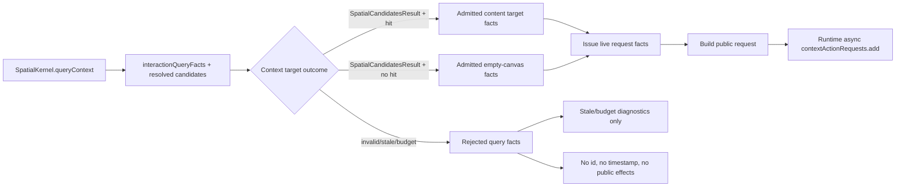
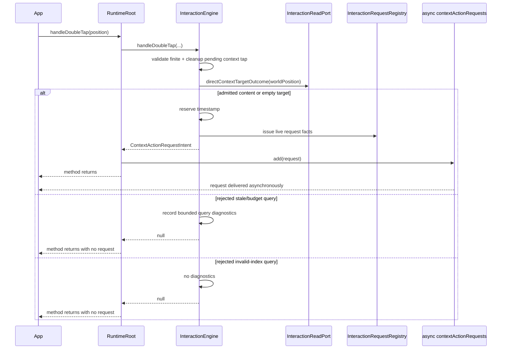
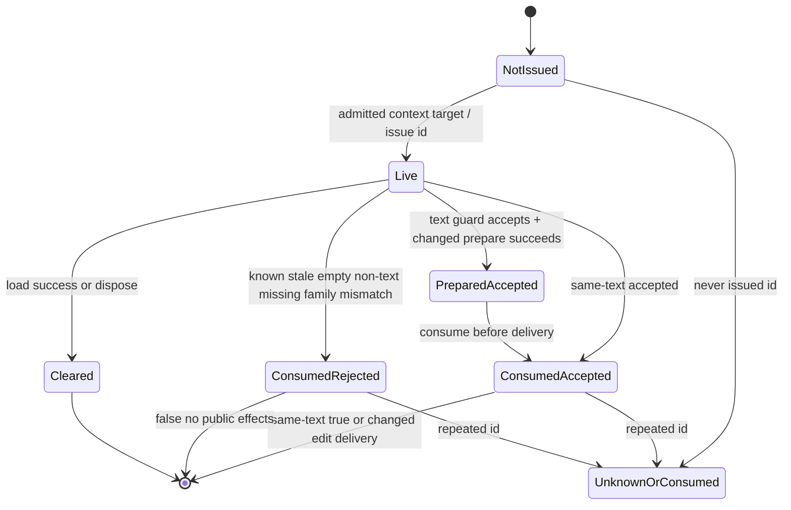
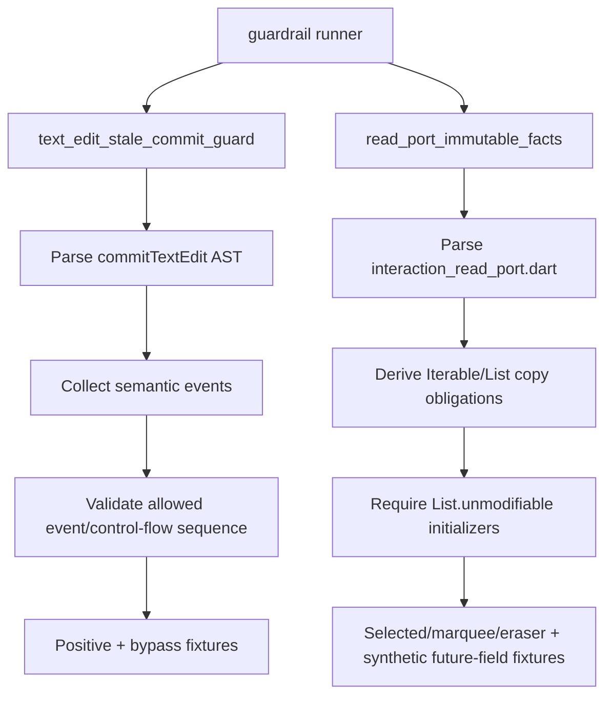

# Design: P12 Findings Closure

---
date: 2026-06-03
designer: Codex
commit: f1bc256a
branch: new-architecture
design_question: "Сделать максимально подробный architecture design, чтобы чисто и эффективно закрыть все оставшиеся post-P12 findings from `docs/history/research/2026-06-03-p12-findings-architecture-facts.md` as classes of defects."
---

## Disposition

READY_FOR_CONTRACT

## Product Outcome

P12 context actions and guarded text edits should behave predictably after implementation: failed spatial target resolution must not appear to users as an empty-canvas request, accepted context requests must have an explicit asynchronous delivery contract, old request ids must not accumulate forever, guardrails must catch structural bypasses instead of only lucky string shapes, eraser read facts must remain enforceably immutable, and repository documentation must no longer mix historical P10 behavior with current P12 behavior without phase context.

Non-goals:

- Do not add new public context target variants or expose spatial failure details through the public request API.
- Do not make the engine own context menu UI, editor overlay lifetime, IME, focus, accessibility, or text selection.
- Do not change public `CanvasInteractionRequestId`, `CanvasContextActionRequested`, `CanvasCommandPort.commitTextEdit`, or context target payload shapes.
- Do not replace the P12 interaction architecture with a runtime-level context/text session manager.
- Do not close the documentation drift with prose-only edits while guardrails and tests remain weaker than the implementation contracts.

## Target Contract Classification

- Profile: ANALYZER_RULE
- Obligations: BUG_FIX, SEAM_MIGRATION

`ANALYZER_RULE` is the required profile because closing the findings as classes requires rewriting two mandatory guardrail surfaces: text-edit stale commit sequencing and immutable read-fact recognition. `BUG_FIX` applies because context-target non-candidate spatial results currently become empty-canvas requests, registry facts are retained without a lifecycle bound, and verification docs contradict current P12 behavior. `SEAM_MIGRATION` applies because internal context target reads and request registry retirement must move from fact-only/retained-retired seams to admitted-or-rejected target outcomes and consumed request facts. No `PUBLIC_API_CHANGE` obligation is selected: public request and command shapes remain compatible, while internal behavior and documentation are corrected.

## Research Inputs

- `docs/history/research/2026-06-03-p12-findings-architecture-facts.md` - supplied factual map of post-P12 findings covering context target resolution, request issuance, request stream timing, registry lifecycle, text-edit guardrail enforcement, read-fact immutability enforcement, and verification/contract documentation drift.

## Repository Evidence

`Evidence Consequence Link`: each fact below states the decision, boundary, unit, proof surface, or review consequence it supports.

- `docs/history/research/2026-06-03-p12-findings-architecture-facts.md:13` - research states non-candidate spatial results can currently become `ContextTargetReadFacts.emptyCanvas` because target kind is selected from `hitFacts == null` -> supports fixing target admission at the interaction read boundary instead of patching registry target-kind mapping.
- `docs/history/research/2026-06-03-p12-findings-architecture-facts.md:15` - research states context requests use a default broadcast controller while action events use a synchronous broadcast controller, and tests flush the event loop -> supports making async context-request delivery an explicit temporal contract.
- `docs/history/research/2026-06-03-p12-findings-architecture-facts.md:17` - research states eraser read facts are behaviorally immutable but the structural guardrail still enumerates older fields -> supports a guardrail-recognition repair, not a production read-fact rewrite.
- `docs/contracts/spatial_kernel.md:109` - only `SpatialCandidatesResult` carries candidate handles -> supports a context-target admission gate that admits only candidate query results.
- `docs/contracts/spatial_kernel.md:110` - non-candidate typed spatial results include budget-exceeded, invalid-index, and stale-candidate results -> supports future negative tests for all three rejection statuses.
- `docs/contracts/spatial_kernel.md:111` - non-candidate typed results must not be projected as successful empty candidate sets by frame or interaction callers -> supports no public empty-canvas request on non-candidate context queries.
- `lib/src/runtime/runtime_interaction_read_mapping.dart:25` - `resolveInteractionCandidates` returns empty resolved candidates for every non-`SpatialCandidatesResult` -> supports moving success/failure classification out of the resolved-candidate list length.
- `lib/src/runtime/runtime_interaction_read_mapping.dart:48` - `interactionQueryHasCandidates` already identifies `SpatialCandidatesResult` -> supports reusing typed query status as the admission source of truth.
- `lib/src/runtime/runtime_interaction_read_mapping.dart:52` - spatial query results are mapped into `InteractionReadQueryFacts` -> supports carrying rejection facts without adding public payload fields.
- `lib/src/runtime/runtime_interaction_read_mapping.dart:62` - invalid-index spatial results map to `InteractionReadQueryFacts.invalidIndex` -> supports invalid-index no-request proof.
- `lib/src/runtime/runtime_interaction_read_mapping.dart:66` - stale-candidate spatial results map to `InteractionReadQueryFacts.staleIndex` -> supports stale-index no-request proof.
- `lib/src/runtime/runtime_interaction_read_mapping.dart:74` - budget-exceeded spatial results map to `InteractionReadQueryFacts.budgetExceeded` -> supports budget no-request proof and diagnostics proof.
- `lib/src/interaction/interaction_read_port.dart:150` - `InteractionReadQueryStatus` separates `candidates`, `invalidIndex`, `staleIndex`, and `budgetExceeded` -> supports a sealed internal context-target outcome that rejects non-candidate statuses.
- `lib/src/interaction/interaction_read_port.dart:271` - current context target kinds are only `contentElement` and `emptyCanvas` -> supports not adding a public-like failure target kind.
- `lib/src/interaction/interaction_read_port.dart:275` - `ContextTargetReadFacts` currently represents target facts rather than admission status -> supports introducing a separate internal outcome seam instead of overloading target facts.
- `lib/src/runtime/runtime_interaction_read_adapter.dart:318` - `_contextTargetFacts` owns atomic context target reads -> supports placing context target admission in the read adapter/read-port boundary.
- `lib/src/runtime/runtime_interaction_read_adapter.dart:320` - context target reads call `_spatial.queryContext` -> supports using spatial query status as fallible work before request issuance.
- `lib/src/runtime/runtime_interaction_read_adapter.dart:338` - null `hitFacts` currently returns `ContextTargetReadFacts.emptyCanvas` -> supports the bug-fix obligation for non-candidate/null-hit distinction.
- `lib/src/runtime/runtime_interaction_read_adapter.dart:346` - content-element facts include immutable snapshot, bounds, generation, revision, family, epoch, revision, and query facts -> supports preserving current public content payload shape after admission succeeds.
- `lib/src/frame/frame_spatial_paint_admission.dart:28` - frame has an explicit admission function for spatial paint -> supports using an analogous interaction-owned admission form rather than interpreting empty candidate lists ad hoc.
- `lib/src/frame/frame_spatial_paint_admission.dart:30` - frame admits only `SpatialCandidatesResult` -> supports the same candidate-only rule for context target reads.
- `lib/src/frame/frame_spatial_paint_admission.dart:32` - frame rejects budget-exceeded spatial results with a typed reason -> supports typed negative proof for context query budget rejection.
- `lib/src/frame/frame_spatial_paint_admission.dart:36` - frame rejects invalid-index spatial results with a typed reason -> supports typed negative proof for invalid-index context rejection.
- `lib/src/frame/frame_spatial_paint_admission.dart:40` - frame rejects stale-candidate spatial results with a typed reason -> supports typed negative proof for stale context rejection.
- `lib/src/interaction/interaction_engine.dart:244` - direct double tap enters the interaction engine -> supports preserving `InteractionEngine` as context request admission owner.
- `lib/src/interaction/interaction_engine.dart:249` - direct double tap rejects non-finite positions before request handling -> supports preserving finite input validation before cleanup, target read, timestamp reservation, and emission.
- `lib/src/interaction/interaction_engine.dart:252` - direct double tap clears pending context tap history before target resolution -> supports preserving cleanup order when the target read later rejects.
- `lib/src/interaction/interaction_engine.dart:255` - current direct double tap reserves timestamp before context target facts are read -> supports the seam migration to reserve timestamps only after target admission succeeds.
- `lib/src/interaction/interaction_engine.dart:257` - current direct double tap reads `directContextTargetFacts` before `_issueContextRequest` -> supports routing the new admitted/rejected outcome at the same owner boundary.
- `lib/src/interaction/interaction_engine.dart:667` - pointer-sample context recognition reads pending context tap state -> supports treating pointer two-tap recognition as the same admission owner, not a runtime stream-only patch.
- `lib/src/interaction/interaction_engine.dart:672` - second-tap matching compares pending tap and current facts -> supports making rejected second-tap facts clean up without issuing a request.
- `lib/src/interaction/interaction_engine.dart:720` - pending tap storage currently stores facts through `ContextActionRouter.pendingTap` -> supports storing pending tap only for admitted context target outcomes.
- `lib/src/interaction/interaction_engine.dart:1102` - `_issueContextRequest` owns registry issuance and request intent creation -> supports keeping registry writes after target admission, not inside the read adapter.
- `lib/src/interaction/interaction_engine.dart:1108` - registry issue currently accepts `ContextTargetReadFacts` directly -> supports changing the issue seam to admitted target facts only.
- `lib/src/interaction/context_action_router.dart:50` - router builds public `CanvasContextActionRequested` from admitted facts -> supports keeping public request construction unchanged after admission succeeds.
- `lib/src/interaction/context_action_router.dart:55` - router maps admitted facts to the public target -> supports avoiding public target construction for rejected target reads.
- `lib/src/interaction/interaction_request_registry.dart:75` - `InteractionRequestRegistry` owns issued request facts -> supports placing request retention and consumption policy in this class.
- `lib/src/interaction/interaction_request_registry.dart:77` - registry stores all request facts in `_facts` -> supports the retention bug-fix obligation.
- `lib/src/interaction/interaction_request_registry.dart:86` - registry target kind is derived from target facts kind -> supports preventing rejected queries from reaching this mapping at all.
- `lib/src/interaction/interaction_request_registry.dart:106` - `factsFor` exposes stored internal facts -> supports changing internal tests away from persistent retired-state inspection when the registry becomes consume/remove.
- `lib/src/interaction/interaction_request_registry.dart:121` - `retire` currently rewrites stored live facts -> supports migrating from retained retired facts to consumed request facts.
- `lib/src/interaction/interaction_request_registry.dart:126` - retirement stores `facts.retire()` back into the map -> supports removing permanent retired records as the root retention fix.
- `lib/src/interaction/interaction_engine.dart:111` - `textEditGuardDecision` is the interaction-owned guard decision boundary -> supports classifying live facts there, consuming rejected facts there, and leaving accepted changed-text consumption to runtime after successful prepare.
- `lib/src/interaction/interaction_engine.dart:114` - guard lookup currently uses live facts only -> supports unknown/already-consumed ids remaining pure no-ops.
- `lib/src/interaction/interaction_engine.dart:119` - non-content, non-text, or null-target requests are rejected before command mutation -> supports preserving stale/non-text guard behavior while changing retention mechanics.
- `lib/src/interaction/interaction_engine.dart:129` - current guard facts are retired when the current text target no longer matches -> supports preserving "known live rejected ids are consumed" semantics.
- `lib/src/interaction/interaction_engine.dart:153` - `_textGuardMatches` checks current facts against issued guard facts -> supports keeping stale detection at the interaction guard owner.
- `lib/src/runtime/runtime_root.dart:743` - `commitTextEdit` is the public command entrypoint -> supports keeping input validation and mutation delivery at runtime while guard consumption stays in interaction.
- `lib/src/runtime/runtime_root.dart:749` - runtime validates text edit command input before guard decision -> supports preserving input validation before request consumption and draft mutation.
- `lib/src/runtime/runtime_root.dart:751` - runtime reads the interaction guard decision before edit preparation -> supports text-edit guardrail sequence proof.
- `lib/src/runtime/runtime_root.dart:762` - changed text uses `EditKernel.prepareInteractionCommit` -> supports keeping document mutation at edit/runtime boundary.
- `lib/src/runtime/runtime_root.dart:779` - failed changed text prepare returns false before public delivery -> supports all-or-nothing text-edit proof.
- `lib/src/runtime/runtime_root.dart:782` - current accepted changed request retires before `_deliverEditCommitResult` -> supports preserving "not live by action delivery" with consume/remove semantics.
- `lib/src/runtime/runtime_root.dart:158` - committed actions use `StreamController.broadcast(sync: true)` -> supports documenting that action delivery and context request delivery intentionally differ.
- `lib/src/runtime/runtime_root.dart:160` - context requests use a default broadcast stream controller -> supports selecting asynchronous context request delivery as the compatibility-preserving timing contract.
- `lib/src/runtime/runtime_root.dart:231` - runtime exposes action and context request streams as public event streams -> supports public timing and closure tests.
- `lib/src/runtime/runtime_root.dart:930` - pointer admission can emit a context request after optional runtime-state publication -> supports temporal order proof for pointer requests.
- `lib/src/runtime/runtime_root.dart:943` - direct `handleDoubleTap` calls interaction engine and emits returned intent -> supports keeping runtime as delivery owner only.
- `lib/src/runtime/runtime_root.dart:967` - dispose owns stream closure -> supports context request delivery/close temporal tests.
- `lib/src/runtime/runtime_root.dart:979` - dispose runs interaction cleanup before closing streams -> supports registry/request cleanup at runtime lifecycle boundaries.
- `lib/src/runtime/runtime_root.dart:986` - dispose closes actions stream -> supports paired stream-close proof.
- `lib/src/runtime/runtime_root.dart:987` - dispose closes context request stream -> supports async request-before-done proof.
- `lib/src/runtime/runtime_root.dart:1103` - document load pipeline is runtime-owned -> supports clearing live request registry facts on successful document replacement.
- `lib/src/runtime/runtime_root.dart:1106` - load prepares interaction cleanup before document install -> supports placing registry cleanup in the same runtime lifecycle unit.
- `lib/src/runtime/runtime_root.dart:1111` - load increments epoch -> supports all pre-load request ids becoming non-current and removable without public compatibility loss.
- `lib/src/runtime/runtime_root.dart:1239` - `_emitContextRequest` adds the public request to the context request stream -> supports testing event queuing as the irreversible delivery point.
- `docs/contracts/operation_matrix.md:92` - context-action request delivery is stream-only with no document, selection, preview, spatial, projection, resource, repaint, or action effects -> supports no public state/action on rejected context target reads.
- `docs/contracts/operation_matrix.md:123` - emitted context request contains id, trigger, epoch, document revision, timestamp, positions, and content or empty target -> supports preserving public emitted request shape for admitted targets.
- `docs/contracts/operation_matrix.md:133` - `commitTextEdit` stale guards are id, epoch, target kind, generation, elementRevision, missing element, empty-canvas, non-text, and family mismatch -> supports not adding documentRevision or retained-retired facts as stale guards.
- `docs/contracts/operation_matrix.md:138` - known live rejected request ids retire privately while unknown or already-retired ids do nothing -> supports updating source truth to "consume/remove privately" with the same public no-op behavior.
- `docs/contracts/interaction_engine.md:273` - P12 emits exactly one context-action request for an accepted target -> supports interpreting non-candidate spatial results as not accepted targets.
- `docs/contracts/interaction_engine.md:279` - direct `handleDoubleTap` is host-recognized and validates finite position -> supports preserving direct entry behavior while changing target admission.
- `docs/contracts/interaction_engine.md:291` - pointer-sample recognition stores first tap and revalidates second tap -> supports applying the new context target outcome to both direct and pointer-sample routes.
- `docs/contracts/interaction_engine.md:304` - registry records generated id and guard facts -> supports maintaining live guard facts only for accepted issued requests.
- `docs/contracts/interaction_engine.md:310` - documentRevision is observation-only, not a stale guard -> supports avoiding a registry retention workaround based on document revision.
- `docs/contracts/interaction_engine.md:317` - registry is not an active text-input session and application owns UI -> supports no new session manager.
- `docs/contracts/interaction_engine.md:321` - request-originated text changes commit through `commitTextEdit` -> supports preserving command boundary.
- `docs/contracts/public_api_v1.md:1748` - public API docs still contain the P10 empty context request stream statement -> supports mandatory phase-context documentation repair.
- `docs/contracts/public_api_v1.md:2334` - public API docs also state P10 has no context-action request producer -> supports preserving historical P10 text only when clearly marked as historical phase behavior.
- `docs/contracts/public_api_v1.md:2338` - public API docs state P12 emits accepted context requests -> supports current P12 contract alignment.
- `docs/contracts/public_api_v1.md:2360` - documentRevision is observation-only and not a stale-rejection guard -> supports preserving text guard semantics during registry consumption migration.
- `docs/contracts/public_api_v1.md:2363` - engine does not store active text-input session -> supports not solving retention with app/editor session state.
- `docs/architecture/architecture_graph.yaml:711` - architecture graph says `contextActionRequests` is empty in P10, emits P12 requests, and closes on dispose -> supports graph/source-of-truth update only if the later contract changes timing or lifecycle wording.
- `docs/architecture/01_runtime_ownership.md:174` - runtime ownership docs identify `InteractionRequestRegistry` as interaction-owned guard-fact registry -> supports updating the owning architecture docs when registry semantics change from retained retired records to consumed live facts.
- `docs/architecture/02_package_boundaries.md:312` - package boundary docs say the registry stores guard facts and retired request status -> supports mandatory source-of-truth repair for consume/remove semantics.
- `docs/diagrams/seq_context_action_request.mmd:130` - sequence diagram routes text commits through registry facts -> supports future diagram update when registry consumption semantics change.
- `docs/diagrams/state_pending_context_action_request.mmd:159` - state diagram says retired and epoch-stale request ids cannot commit -> supports preserving no-commit behavior while revising storage semantics.
- `docs/verification/tests.md:662` - verification docs say P10 tool-port tests prove double tap remains P12 unsupported and stream empty -> supports repairing stale verification prose after P12 implementation.
- `docs/verification/tests.md:719` - verification docs also list P12 context-action request tests -> supports resolving the contradiction through phase-specific current-state wording.
- `docs/verification/tests.md:726` - context-action tests prove direct and pointer-sample issuance, target classification, request ids, guard facts, finite validation, and stream-only effects -> supports extending this test area with non-candidate no-request and async timing proof.
- `docs/verification/tests.md:736` - text-edit stale guard tests prove unknown/retired no-ops, stale/private retirement, unrelated documentRevision acceptance, single-use ids, and no raw text payload -> supports updating tests to prove consumed/removed single-use ids instead of permanent retired facts.
- `docs/verification/guardrails.md:159` - mandatory guardrail implementation/rewrite work must use `guardrail_design_patterns.md` -> supports selecting semantic sequence and derived AST recognition patterns.
- `docs/verification/guardrails.md:212` - `interaction.read_port_immutable_facts` is a mandatory guardrail -> supports mandatory pattern-map source-of-truth update for the immutable read-fact scanner rewrite.
- `docs/verification/guardrail_design_patterns.md:13` - guardrail pattern choice must come from invariant owner, not easy syntax -> supports rejecting marker-only text guardrail scans.
- `docs/verification/guardrail_design_patterns.md:25` - method/command statement-order guardrails should collect semantic events before sequence evaluation -> supports rewriting text-edit stale guardrail.
- `docs/verification/guardrail_design_patterns.md:30` - the guardrail runner stays a dispatcher while scanners and metadata live under `tool/guardrails/**` -> supports keeping enforcement in current runner paths.
- `docs/verification/guardrail_design_patterns.md:68` - `semantic_sequence` is the legacy-proven pattern for prelude/guard/route ordering -> supports the text-edit guardrail rewrite.
- Command-surface exception, `rg -n "interaction.read_port_immutable_facts" docs/verification/guardrail_design_patterns.md` returns no row while adjacent interaction pattern rows exist at `docs/verification/guardrail_design_patterns.md:121` through `docs/verification/guardrail_design_patterns.md:126` -> supports adding a mandatory pattern-map row instead of treating docs update as conditional.
- `tool/guardrails/src/guardrail_registry.dart:178` - `interaction.text_edit_stale_commit_guard` is a blocking/interaction guardrail with structural proof required -> supports `ANALYZER_RULE` profile and runner-backed proof.
- `tool/guardrails/src/guardrail_executor.dart:255` - executor maps the text-edit guardrail to focused behavior and guardrail tests -> supports preserving runner dispatch while strengthening scanner logic.
- `tool/guardrails/src/interaction_guardrail_checks.dart:165` - current text-edit guardrail reads runtime root source -> supports keeping the same owner path.
- `tool/guardrails/src/interaction_guardrail_checks.dart:197` - current scanner extracts the `commitTextEdit` body -> supports preserving method-owner scope but changing recognition semantics.
- `tool/guardrails/src/interaction_guardrail_checks.dart:516` - current `_TextEditGuardMarkers` records string positions -> supports replacing marker indexes with semantic event collection.
- `tool/guardrails/src/interaction_guardrail_checks.dart:576` - accepted-gate recognition is a string search for `guard.kind != TextEditGuardDecisionKind.accepted` -> supports bypass fixtures where the marker exists but rejected control flow still reaches prepare.
- `test/guardrails/interaction_guardrail_enforcement_test.dart:186` - current text-edit negative fixture replaces the guard read with a hardcoded accepted decision -> supports adding stronger bypass fixtures instead of deleting existing proof.
- `test/guardrails/interaction_guardrail_enforcement_test.dart:206` - current text-edit negative fixture hardcodes guard facts -> supports preserving positive/negative fixture coverage.
- `lib/src/interaction/interaction_read_port.dart:232` - `EraserReadRequest` accepts iterable corridor points -> supports immutable copied-field proof for eraser request input.
- `lib/src/interaction/interaction_read_port.dart:236` - eraser request stores corridor points with `List.unmodifiable` -> supports preserving current production behavior.
- `lib/src/interaction/interaction_read_port.dart:242` - `EraserReadFacts` accepts iterable corridor points and erased ids -> supports immutable copied-field proof for P12 facts.
- `lib/src/interaction/interaction_read_port.dart:252` - eraser facts store corridor points and erased ids with `List.unmodifiable` -> supports behavior already being correct while guardrail is incomplete.
- `test/interaction/fixtures/interaction_read_port_fixture.dart:203` - behavior test mutates caller-owned eraser corridor after read -> supports direct immutability proof.
- `test/interaction/fixtures/interaction_read_port_fixture.dart:217` - behavior test asserts exposed eraser lists throw on `clear()` -> supports keeping behavior proof and adding structural guardrail proof.
- `tool/guardrails/src/interaction_guardrail_checks.dart:284` - immutable facts guardrail parses interaction read port sources -> supports improving recognition at the existing guardrail owner.
- `tool/guardrails/src/interaction_guardrail_checks.dart:301` - scanner iterates `_readPortCopiedFields` -> supports replacing manual enumeration with a derived field obligation or a single guardrail-local manifest.
- `tool/guardrails/src/interaction_guardrail_checks.dart:484` - `_readPortCopiedFields` starts with older selected move fields -> supports the drift finding.
- `tool/guardrails/src/interaction_guardrail_checks.dart:495` - `_readPortCopiedFields` ends before P12 eraser fields -> supports the guardrail bug-fix obligation.
- `test/guardrails/interaction_guardrail_enforcement_test.dart:141` - current read-port negative fixture mutates only `selectedIds` -> supports adding eraser-specific and derived-field negative fixtures.
- `test/guardrails/interaction_guardrail_enforcement_test.dart:244` - positive guardrail proof accepts current production sources -> supports preserving positive fixture proof after scanner rewrite.
- `test/interaction/fixtures/context_action_request_fixture.dart:49` - direct content request test awaits `_flushEvents()` before observing the request -> supports async delivery as current tested behavior.
- `test/interaction/fixtures/context_action_request_fixture.dart:83` - direct empty request test also awaits flush -> supports keeping async timing stable for both target kinds.
- `test/interaction/fixtures/context_action_request_fixture.dart:138` - pointer-sample request test awaits flush -> supports applying async timing to both direct and pointer routes.
- `test/interaction/fixtures/context_action_request_fixture.dart:275` - `_flushEvents` is `Future<void>.delayed(Duration.zero)` -> supports explicit future proof for request delivery timing.
- `test/api/fixtures/tool_port_settings_fixture.dart:145` - public tool-port fixture calls `handleDoubleTap` -> supports public compatibility proof.
- `test/api/fixtures/tool_port_settings_fixture.dart:146` - public tool-port fixture awaits a zero-duration delay before expecting the request -> supports public async stream timing proof.
- `test/interaction/fixtures/text_edit_stale_commit_guard_fixture.dart:336` - current test inspects internal `requestFactsFor(...).retired` during action delivery -> supports mandatory test/source-truth migration when registry no longer retains retired records.
- `test/interaction/fixtures/eraser_context_action_routing_fixture.dart:208` - interaction routing test checks registry facts exist after context request issuance -> supports preserving live fact inspection before consumption.
- `docs/contracts/diagnostics.md:89` - interaction-observed query budget, stale candidate rejection, and related reliability events route through interaction diagnostics without state/action mutation or timestamp resolution -> supports bounded diagnostics for stale and budget context rejections, while invalid-index remains no-request/no-effects without diagnostics.
- `lib/src/interaction/interaction_engine.dart:1288` - `_recordQueryDiagnostics` already dispatches `InteractionReadQueryFacts` statuses -> supports reusing the existing diagnostics boundary for context target rejections.
- `lib/src/interaction/interaction_engine.dart:1302` - stale query facts record stale candidate diagnostics -> supports stale context target rejection observability.
- `lib/src/interaction/interaction_engine.dart:1320` - budget-exceeded query facts record interaction query budget diagnostics -> supports budget context target rejection observability.

## Design Form Candidates

### Candidate A. Owner-Owned P12 Closure With Internal Admission, Consumption, Async Delivery Contract, Strong Guardrails, And Source-Of-Truth Repair

- Form: Migrate context target reads from fact-only return values to an internal admitted-or-rejected outcome; issue registry entries only for admitted content/empty targets; keep context request delivery asynchronous and explicitly documented/tested; migrate registry state from retained retired facts to live facts consumed on rejected guard decisions, accepted no-ops, or successful changed-text preparation; rewrite text-edit and immutable read-fact guardrails at their tool owners; repair current P12 docs/diagrams/registries in the future contract.
- Why it could work: It fixes each finding at the owner that creates the class of defect: spatial admission at interaction read boundary, request lifecycle at registry, event timing at runtime stream boundary, command sequencing at guardrail semantic sequence, read-fact copying at read-port guardrail recognition, and stale phase wording at docs source-of-truth.
- Gate failures or risks: Requires coordinated internal seam migration and source-of-truth updates, but public API shapes remain stable and each change has direct proof surfaces. No hard-gate failure.

### Candidate B. Patch The Named Symptoms In Place

- Form: Add one `if (facts.query.status != candidates)` before `_issueContextRequest`, add eraser fields to `_readPortCopiedFields`, add one extra text guardrail fixture, and edit the stale P10 test paragraph.
- Why it could work: It is the smallest short-term implementation diff and would likely close the exact examples from the research.
- Gate failures or risks: Fails owner-level fix and future pressure. It leaves context target facts still able to represent rejected query results as targets, keeps registry retention unbounded, keeps text guardrail marker-based, and leaves future `Iterable` read-fact fields dependent on manual list updates.

### Candidate C. Add A Public "Unresolved Context Target" Variant And Synchronous Delivery

- Form: Add a third public/internal target kind for spatial failure, emit a context request for it, and change `_contextActionRequests` to `sync: true` to match action delivery.
- Why it could work: It would make spatial failure visible to application listeners and remove async flushes from tests.
- Gate failures or risks: Fails compatibility and boundary-owned policy. Public context targets are content-element or empty-canvas, spatial reliability failures are internal diagnostics, and synchronous delivery would introduce reentrancy pressure not required by current tests or docs.

### Candidate D. Split The Findings Into Independent Future Contracts

- Form: Write separate later contracts for target resolution, registry lifecycle, guardrails, and docs.
- Why it could work: Each future implementation would be smaller and independently reviewable.
- Gate failures or risks: Fails source-of-truth singularity and completion signal for this request. The findings are coupled by the same P12 context request/text-edit path; splitting them would let docs and guardrails pass while the production seam remains ambiguous, or production changes land without the enforcement that prevents recurrence.

## Known Future Pressures

| Pressure | Evidence | How the selected form responds | Accepted cost or risk |
|---|---|---|---|
| Future P13 Flutter surface will drive host-recognized double tap through public tool ports. | `docs/architecture/architecture_graph.yaml:711`, `test/api/fixtures/tool_port_settings_fixture.dart:145` | Keeps public `handleDoubleTap` and `contextActionRequests` shapes unchanged, while preventing rejected spatial queries from being surfaced as empty-canvas menu opportunities. | P13 widgets still need to tolerate async stream delivery; that behavior becomes documented instead of inferred from tests. |
| P12 context requests are app-owned UI triggers, not engine-owned sessions. | `docs/contracts/interaction_engine.md:317`, `docs/contracts/public_api_v1.md:2363` | Registry stores only live guard facts until first consumption and never stores UI/session lifetime. | Applications cannot ask the engine for an active editor session; they keep app-owned UI state. |
| Text-edit requests must be single-use without unbounded storage. | `docs/verification/tests.md:736`, `lib/src/interaction/interaction_request_registry.dart:77` | Consumed/removed facts preserve single-use semantics while closing permanent retired-fact retention. | Internal tests that inspected `.retired` must migrate to "not live / second commit no-op / no effects" proof. |
| Async context request delivery can be confused with committed action delivery. | `lib/src/runtime/runtime_root.dart:158`, `lib/src/runtime/runtime_root.dart:160`, `test/interaction/fixtures/context_action_request_fixture.dart:275` | Design locks context requests as async stream delivery and requires tests that assert request listener timing after flush, not during initiating runtime call. | Apps that assumed synchronous context callbacks must rely on documented stream delivery instead; current tests already use async flush. |
| Interaction diagnostics must stay bounded and internal. | `docs/contracts/diagnostics.md:89`, `lib/src/interaction/interaction_engine.dart:1288` | Stale-index and budget-exceeded rejected target reads record existing bounded query diagnostics; invalid-index rejected target reads emit no diagnostics. All rejected target reads emit no public request, timestamp, state, or action. | If product later wants public spatial failure events or invalid-index diagnostics, that is a separate behavior/design change. |
| New read-fact iterable fields will appear in later phases. | `tool/guardrails/src/interaction_guardrail_checks.dart:301`, `lib/src/interaction/interaction_read_port.dart:232`, `lib/src/interaction/interaction_read_port.dart:242` | Guardrail derives copied-field obligations from constructor/field shape where possible instead of relying only on a hand-maintained list. | More precise scanner work is required now; future read facts get cheaper enforcement. |
| Source-of-truth docs and generated indexes can drift after implementation. | `docs/verification/tests.md:662`, `docs/verification/tests.md:719`, `docs/indexes/by_guardrail.md:218` | Future contract must update owning docs/registries and generated indexes after production/guardrail changes. | Documentation work is not optional; docs checks and generated-doc sync become part of completion proof. |
| Existing diagrams encode retired/stale request wording. | `docs/diagrams/seq_context_action_request.mmd:130`, `docs/diagrams/state_pending_context_action_request.mmd:159` | Later source-of-truth update must revise diagrams to "consumed/unknown-or-consumed" storage while preserving public no-commit behavior. | Diagram update may trigger architecture/docs checks; design does not edit diagrams now. |

## Selected Form

Select Candidate A.

The future implementation must close post-P12 findings through six coordinated owner-owned changes:

1. **Context target admission outcome.** Replace the internal context target read seam with an admitted-or-rejected outcome. The admitted branch contains the existing `ContextTargetReadFacts` for `contentElement` or `emptyCanvas`. The rejected branch contains `InteractionReadQueryFacts` and a private rejection reason derived from `invalidIndex`, `staleIndex`, or `budgetExceeded`. `ContextTargetReadFacts.emptyCanvas` is allowed only when the spatial query is a `SpatialCandidatesResult` and no exact context hit is found. It is not allowed for non-candidate query results.
2. **Request issue after admission only.** `InteractionEngine` must call `_issueContextRequest` only with admitted target facts. Direct `handleDoubleTap` and pointer-sample second-tap routes must handle rejected target outcomes before request issuance, perform required cleanup already owned by the route, and return no `ContextActionRequestIntent`. Stale-index and budget-exceeded rejected target reads record existing bounded interaction query diagnostics; invalid-index rejected target reads record no diagnostics because the current diagnostics owner returns for `InteractionReadQueryStatus.invalidIndex`. Rejected target reads must not allocate a request id, must not store registry facts, must not construct a public target, must not reserve a runtime output timestamp, and must not emit public state, action, repaint, spatial, projection, resource, or document effects.
3. **Async context request delivery contract.** Keep `_contextActionRequests` as asynchronous broadcast delivery. The irreversible delivery point is `_contextActionRequests.add(intent.request)`, not listener execution. Public listener observation is allowed after a zero-duration event flush; listeners must not be invoked synchronously inside `handleDoubleTap` or pointer admission. Accepted queued context requests must be delivered before stream done for listeners that were subscribed at add time, including the dispose-after-add case; if the default controller implementation cannot prove that in tests, the future contract must add a tiny runtime-owned async delivery queue rather than changing to synchronous broadcast.
4. **Live request registry with consume/remove semantics.** `InteractionRequestRegistry` must store only live issued request facts. A guard decision that rejects a known live request consumes and removes that entry before returning false. A guard decision that accepts a current text request returns the accepted live facts without consuming them yet, because changed-text edit preparation can still fail before install. Same-text accepted commands consume before returning true. Changed-text accepted commands run validation and successful edit preparation first, then consume/remove the request, then deliver public state/action. If changed-text preparation fails before install, the request remains live and no public state/action is emitted. Unknown and already-consumed ids both project as `TextEditGuardDecisionKind.unknownOrRetired` and have no public or private effect. Successful document replacement and runtime disposal clear any remaining live request facts because all outstanding ids become unusable. Request id generation remains monotonic within a runtime instance and ids are never reused.
5. **Guardrail rewrites at tooling owner.** Rewrite `interaction.text_edit_stale_commit_guard` from string marker indexes to a semantic-event sequence over the parsed `commitTextEdit` method. The rule must prove validation before guard read, guard decision before target/current-text reads, accepted branch gates all prepare paths, no rejected/unknown branch can reach `_editKernel.prepareInteractionCommit`, guard facts feed the edit update/action intent, changed-text prepare succeeds before request consumption, and consumption happens before public delivery. Rewrite `interaction.read_port_immutable_facts` so copied-field obligations are derived from read-port constructor/field shape where possible and all P12 eraser iterable fields are covered by negative fixtures.
6. **Mandatory source-of-truth repair.** Future implementation must update source-of-truth docs, diagrams, registries, and generated indexes that currently mention P10 empty/unsupported context behavior as current behavior or describe registry retention as durable retired facts. Historical P10 behavior may remain only when clearly marked as historical phase context. Current P12 behavior must say accepted content/empty targets emit async stream requests; rejected non-candidate spatial queries emit no public request; stale-index and budget-exceeded rejected queries record bounded interaction diagnostics; invalid-index rejected queries do not.

This form intentionally avoids sync glue. There is one source of truth for context target success: spatial candidate admission at the interaction read boundary. There is one source of truth for request validity: live registry facts consumed by the interaction guard for rejected requests and by runtime after accepted no-op or successful changed-text preparation. There is one source of truth for command sequencing: the runtime method plus semantic guardrail proof. Documentation follows those owners rather than restating divergent policy.

## Decision Trace

Preserve `Decision Chain Of Custody`: source inputs and locked decisions must map to the future contract field, execution unit, or proof surface that carries them forward.

| Decision ID | Decision | Evidence | Contract handoff target |
|---|---|---|---|
| D1 | Non-candidate context spatial results are rejected internal outcomes, not empty-canvas targets. | `docs/contracts/spatial_kernel.md:109`, `docs/contracts/spatial_kernel.md:111`, `lib/src/runtime/runtime_interaction_read_adapter.dart:338` | `Boundaries.Owner`, `Boundaries.Entry`, Unit: context target admission, proof: invalid/stale/budget no-request tests |
| D2 | `ContextTargetReadFacts.emptyCanvas` is valid only after a candidate query succeeds and no topmost context hit is found. | `lib/src/runtime/runtime_interaction_read_mapping.dart:25`, `lib/src/interaction/interaction_read_port.dart:271`, `lib/src/runtime/runtime_interaction_read_adapter.dart:338` | Unit: read-port outcome migration, proof: valid empty-canvas candidate test distinct from non-candidate tests |
| D3 | `InteractionEngine` issues request ids only after target admission succeeds. | `lib/src/interaction/interaction_engine.dart:1102`, `lib/src/interaction/interaction_request_registry.dart:80`, `lib/src/interaction/context_action_router.dart:50` | `Execution order`, Unit: request issue route, proof: no registry id on rejected query |
| D4 | Direct rejected target reads do not reserve runtime timestamps. | `lib/src/interaction/interaction_engine.dart:255`, `docs/contracts/operation_matrix.md:92`, `docs/contracts/diagnostics.md:89` | `Temporal Surface Closure`, proof: rejected direct context read followed by accepted action/request has unchanged timestamp cursor expectation |
| D5 | Rejected stale-index and budget-exceeded target reads record bounded interaction query diagnostics; rejected invalid-index target reads do not record diagnostics; all rejected target reads emit no public request. | `docs/contracts/diagnostics.md:89`, `lib/src/interaction/interaction_engine.dart:1288`, `lib/src/interaction/interaction_engine.dart:1302`, `lib/src/interaction/interaction_engine.dart:1320` | Unit: diagnostics route, proof: stale/budget diagnostics fixture plus invalid-index no-diagnostics and no state/action/request assertions |
| D6 | Context request stream remains asynchronous broadcast delivery. | `lib/src/runtime/runtime_root.dart:160`, `test/interaction/fixtures/context_action_request_fixture.dart:275`, `test/api/fixtures/tool_port_settings_fixture.dart:146` | `Temporal Surface Closure`, docs update, proof: no sync listener call before method return; request observed after flush |
| D7 | Context request stream close preserves queued accepted requests for subscribed listeners before done. | `lib/src/runtime/runtime_root.dart:987`, `lib/src/runtime/runtime_root.dart:1239`, `docs/architecture/architecture_graph.yaml:711` | Runtime lifecycle proof surface: dispose-after-add request-before-done test |
| D8 | Registry stores live request facts only; rejected guard decisions consume immediately, same-text accepted commands consume before returning true, and changed-text accepted commands consume only after successful prepare and before delivery. | `lib/src/interaction/interaction_request_registry.dart:77`, `lib/src/interaction/interaction_request_registry.dart:121`, `lib/src/runtime/runtime_root.dart:762`, `lib/src/runtime/runtime_root.dart:782` | `Boundaries.Source of Truth`, Unit: registry lifecycle, proof: second commit no-op, failed-prepare keeps live facts, and no retained retired facts |
| D9 | Accepted changed text follows `guard accepted -> prepare succeeds -> consume/remove -> public state/action delivery`. | `lib/src/runtime/runtime_root.dart:762`, `lib/src/runtime/runtime_root.dart:779`, `lib/src/runtime/runtime_root.dart:782`, `test/interaction/fixtures/text_edit_stale_commit_guard_fixture.dart:336` | `Execution order`, semantic guardrail, proof: delivery order fixture updated to assert not-live before action and failed prepare does not consume |
| D10 | Load success and dispose clear remaining live request facts. | `lib/src/runtime/runtime_root.dart:1106`, `lib/src/runtime/runtime_root.dart:1111`, `lib/src/runtime/runtime_root.dart:979` | Runtime lifecycle unit, proof: old ids after load/dispose cannot retain guard facts |
| D11 | Text-edit guardrail uses semantic event sequence, not string marker positions. | `docs/verification/guardrail_design_patterns.md:25`, `docs/verification/guardrail_design_patterns.md:68`, `tool/guardrails/src/interaction_guardrail_checks.dart:516` | Profile `ANALYZER_RULE`, Unit: text guardrail scanner, proof: marker-present/rejected-branch-reaches-prepare negative fixture |
| D12 | Immutable read-fact guardrail derives copied-field obligations and covers eraser fields. | `tool/guardrails/src/interaction_guardrail_checks.dart:301`, `tool/guardrails/src/interaction_guardrail_checks.dart:484`, `lib/src/interaction/interaction_read_port.dart:232`, `lib/src/interaction/interaction_read_port.dart:242` | Profile `ANALYZER_RULE`, Unit: read-port immutable guardrail, proof: eraser corridor/ids mutable negative fixtures |
| D13 | Behavior tests remain the direct proof of read-fact immutability; guardrail prevents structural drift. | `test/interaction/fixtures/interaction_read_port_fixture.dart:203`, `test/interaction/fixtures/interaction_read_port_fixture.dart:217`, `test/guardrails/interaction_guardrail_enforcement_test.dart:244` | Verification strategy, proof: focused interaction read-port test plus guardrail tests |
| D14 | Source-of-truth docs must be repaired to current P12 behavior and consume/remove registry semantics. | `docs/verification/tests.md:662`, `docs/verification/tests.md:719`, `docs/architecture/02_package_boundaries.md:312`, `docs/diagrams/seq_context_action_request.mmd:130` | Source-of-truth docs unit, docs checks, generated-doc sync, diagram update assessment |
| D15 | Public API compatibility is preserved. | `docs/contracts/public_api_v1.md:2338`, `docs/contracts/public_api_v1.md:2342`, `docs/contracts/public_api_v1.md:2355` | `Compatibility`, proof: public API compile/typed action/context request tests; no public type additions |
| D16 | Pointer context target rejection is a state decision: a rejected first tap stores no pending context tap, and a rejected second tap clears existing pending tap through context cleanup without issuing a request. | `lib/src/interaction/interaction_engine.dart:667`, `lib/src/interaction/interaction_engine.dart:672`, `lib/src/interaction/interaction_engine.dart:715`, `lib/src/interaction/interaction_engine.dart:732` | `Boundaries.State`, route unit for pointer context recognition, proof: rejected first-tap no-pending-state test and rejected second-tap cleanup/no-request test |

## Outcome-Proof Fit

| Claim | Direct outcome | Proxy risk | Required proof surface or strategy |
|---|---|---|---|
| Non-candidate spatial context results no longer emit empty-canvas requests. | Given invalid-index, stale-index, or budget-exceeded context spatial query result, no request id is issued, no registry facts exist, no public request is delivered after flush, no timestamp is reserved, and no state/action/effect is emitted; stale and budget rejections record bounded diagnostics, invalid-index rejection records none. | A test that checks only target kind for normal empty canvas could pass while non-candidate results still produce empty-canvas requests. | Focused context target admission tests for all three non-candidate statuses with request list, registry, timestamp, no-effect assertions, stale/budget diagnostics assertions, and invalid-index no-diagnostics assertion. |
| Valid empty canvas still emits one empty-canvas request. | Given an admitted `SpatialCandidatesResult` with no topmost context hit, one public empty-canvas request is delivered after async flush with the same public payload shape as P12. | Treating all empty resolved candidates as failure would pass non-candidate tests but break background context menus. | Separate valid-candidate empty-canvas test that injects or creates admitted empty candidates and asserts request id/target. |
| Pointer-sample context recognition does not store or match rejected target outcomes. | A rejected first tap stores no pending context tap; a rejected second tap cleans pending state through context cleanup and emits no request. | Direct-only tests could pass while pointer route still stores failed target facts. | Interaction routing tests for rejected pending and rejected second-tap outcomes, including cleanup/no-effect assertions. |
| Context request delivery is asynchronous by contract. | A subscribed listener is not invoked before `handleDoubleTap`/pointer admission returns, then receives the accepted request after `Future<void>.delayed(Duration.zero)`. | Tests that only await flush cannot catch an accidental switch to sync delivery. | Timing test with a flag set after method return plus existing flush-based request assertions. |
| Accepted queued request survives immediate dispose for subscribed listeners. | If a listener is subscribed, accepted request add happens before close and the listener sees request before done after dispose. | A test that only checks stream closes could pass while the final queued request is dropped. | Runtime lifecycle test that calls accepted `handleDoubleTap`, immediately disposes, then awaits request and done order. |
| Registry does not retain consumed or stale request facts indefinitely. | After accepted no-op, successful accepted changed, stale rejected, and known non-text/empty rejected commands, `requestFactsFor(id)` or the future live-facts test seam returns null; repeated commit is unknown/already-consumed no-op with no public effects. A changed-text prepare failure leaves the request live because no accepted mutation was delivered. | Checking only `commitTextEdit` returns false on repeat could pass while retired facts still remain in the map forever, or while failed prepare incorrectly consumes a still-valid request. | Focused registry lifecycle tests through interaction engine and runtime text guard fixture, including live-fact absence after consumption, failed-prepare live retention, and load clear. |
| Consuming request facts does not weaken stale text guard behavior. | Empty-canvas, non-text, epoch-stale, generation-stale, elementRevision-stale, missing, family-mismatched, and retired/consumed ids still return false with no public state/action; unrelated documentRevision changes still allow current text commits. | A registry removal test could pass while one stale condition no longer consumes or rejects correctly. | Existing `text_edit_stale_commit_guard_test.dart` matrix updated to consume/remove semantics, plus no-effect assertions. |
| Accepted changed text consumes after successful prepare and before public delivery. | During action/state delivery, the request id is already not live; after the command returns, a second commit with the same id is false/no-effect; if prepare returns no publishable result, the request remains live and no public delivery occurs. | Proving only post-return no-op could miss reentrancy-sensitive ordering before action delivery, while consuming before prepare could lose a request on failed prepare. | Delivery-order fixture or semantic guardrail event sequence that observes successful prepare before consume and consume before `_deliverEditCommitResult`; runtime action listener may assert not-live rather than `.retired == true`; failed-prepare fixture asserts still-live request. |
| Text-edit guardrail catches marker-present control-flow bypasses. | A fixture containing the accepted-gate marker but allowing a rejected/unknown branch to reach `_editKernel.prepareInteractionCommit` is rejected by the runner. | Current marker-order scanner could pass because the right strings appear in the right order. | Analyzer/AST semantic-event tests for rejected branch reaching prepare, changed-text consume before successful prepare, delivery before consume, hardcoded facts, and preserved positive production source. |
| Immutable read-fact guardrail covers future iterable/list fields, not only listed old fields. | Removing `List.unmodifiable` from eraser request corridor, eraser facts corridor, or eraser erased ids is rejected, and a new matching iterable-to-list constructor field is either auto-derived or fails until explicitly handled. | Adding the three P12 field names to a manual list could still miss the next P13 field. | Derived AST scanner tests with eraser field mutations and a synthetic read-fact fixture for a new iterable/list copied field. |
| Documentation no longer contradicts current P12 behavior. | Docs checks pass after P10 statements are historical-only and P12 statements describe async accepted requests, rejected non-candidate no-request behavior, and consumed registry semantics. | Editing one paragraph could leave generated indexes, diagrams, or registry references stale. | `dart run docs/tool/sync_generated_docs.dart --check`, `dart run docs/tool/check_docs.dart`, semantic searches for stale P10/current P12 wording, and architecture graph checks if graph files change. |

## Hard Gate Check

| Gate | Result | Evidence |
|---|---|---|
| Owner-Level Fix | pass | The selected form fixes owners, not symptoms: context target admission at read-port/adapter owner (`lib/src/runtime/runtime_interaction_read_adapter.dart:318`), request lifecycle at registry (`lib/src/interaction/interaction_request_registry.dart:75`), delivery timing at runtime stream owner (`lib/src/runtime/runtime_root.dart:160`), guardrail recognition at tooling owner (`tool/guardrails/src/interaction_guardrail_checks.dart:165`), and docs drift at owning docs/diagrams (`docs/verification/tests.md:662`, `docs/verification/tests.md:719`). |
| Ownership | pass | `InteractionEngine` owns request admission (`lib/src/interaction/interaction_engine.dart:244`, `lib/src/interaction/interaction_engine.dart:1102`), `RuntimeRoot` owns stream lifecycle (`lib/src/runtime/runtime_root.dart:967`, `lib/src/runtime/runtime_root.dart:1239`), and `InteractionRequestRegistry` owns guard facts (`docs/architecture/01_runtime_ownership.md:174`). |
| Source-Of-Truth Singularity | pass | Spatial success remains `SpatialCandidatesResult` (`docs/contracts/spatial_kernel.md:109`), request validity is live registry facts consumed once, guardrail patterns remain in `docs/verification/guardrail_design_patterns.md:13`, and docs/diagrams are future updates rather than duplicate runtime policy. |
| Boundary-Owned Policy | pass | External/public input validation remains at runtime/tool entry (`lib/src/runtime/runtime_root.dart:743`, `lib/src/interaction/interaction_engine.dart:249`); spatial admission stays at interaction read boundary; public request payload construction stays in `ContextActionRouter` only after admission (`lib/src/interaction/context_action_router.dart:50`). |
| Negative Proof And Fixture Quarantine | pass | Negative proof uses focused tests, fake internal read ports, semantic guardrail fixtures, and synthetic guardrail source strings. Fixture-only spatial failures, marker-bypass code, and synthetic read-fact classes must not enter public APIs, production registries, durable docs, or generated indexes except as test fixtures. |
| Dependency direction | pass | Interaction may depend on public contracts and read-port facts; runtime composes interaction/spatial/edit and stream delivery (`lib/src/runtime/runtime_root.dart:150`, `lib/src/runtime/runtime_root.dart:174`); guardrail tools parse production sources but production does not import tooling. |
| State/data | pass | Context target outcomes are transient read results; live request facts are mutable private registry state until consumed; public request events are asynchronous stream events; no duplicated app editor/session state is introduced (`docs/contracts/public_api_v1.md:2363`). |
| Sequenced Migration And Retirement | pass | Successor seams are `ContextTargetReadOutcome` and consume/remove registry facts. Migration order: add outcome types and tests, migrate direct/pointer issue sites, migrate registry consume/remove and tests, rewrite guardrails, then repair docs/diagrams/registries. Retirement gate: no context route can issue from rejected query facts, no permanent retired facts remain, and all guardrail/docs checks pass. |
| Temporal Surface Closure | pass | Invariant: admitted context requests are queued asynchronously after admission; rejected target reads have no public delivery and no timestamp reservation; rejected/same-text request consumption happens before returning, while changed-text request consumption happens after successful prepare and before public text edit delivery. Synchronous callback surfaces are action stream listeners during edit delivery and context stream listeners after async flush. Guard owners are `RuntimeRoot` for delivery and `InteractionRequestRegistry`/`InteractionEngine` for request consumption. Public observation order is method return -> async context listener request, or command state/action delivery after request is no longer live. Reentrant/interleaved mutation attempts during commit delivery remain guarded by runtime mutation guards; context listeners run outside the initiating double-tap call. |
| All-Or-Nothing Failure Boundary | pass | Irreversible points are request id issuance, timestamp reservation, stream add, request consumption, edit commit install, and public delivery. Fallible work occurs before those points: spatial query admission before timestamp/id/stream; text validation and guard decision before edit prepare; changed-text edit prepare before request consumption; request consumption before public delivery. Later work is infallible or failure-contained: public request construction after admitted facts, stream add under non-disposed runtime, action delivery after accepted commit. Failure projection is no request/no timestamp/no effects for rejected context target, false/no effects with consumed request for rejected text edit, and false/no effects with still-live request for failed changed-text prepare. Proof surfaces are no-request tests, timestamp tests, registry not-live/live-after-failed-prepare tests, and semantic sequence guardrails. |
| Outcome-Proof Fit | pass | Every selected-form claim maps to direct outcomes: no emitted request for rejected spatial query, async listener timing, absent live registry facts after consumption, runner rejection of guardrail bypasses, and docs/generated checks for source truth. |
| Verification | pass | Future proof surfaces include focused interaction/runtime tests, diagnostics tests, guardrail runner tests, semantic source scans, docs checks, generated-doc sync, and architecture graph checks when graph/diagram files are changed. |
| Future pressure | pass | P13 public surface, app-owned editor UI, future read-fact fields, stream lifecycle, generated docs, and diagram drift are assessed and absorbed without public API churn or sync glue. |

## Lock-Required Facts

- Owner: primary owner is the P12 interaction request path: `InteractionEngine`, `RuntimeInteractionReadAdapter`, `InteractionRequestRegistry`, `ContextActionRouter`, and `RuntimeRoot` stream delivery. Guardrail owners are `tool/guardrails/src/interaction_guardrail_checks.dart`, runner registry/executor, and guardrail tests. Source-of-truth owners are the P12/public API/interaction/operation/verification docs, diagrams, registries, and generated indexes.
- Owning layer/module/document family: production internal changes under `lib/src/interaction/**` and `lib/src/runtime/**`; guardrail changes under `tool/guardrails/**` plus `test/guardrails/**`; behavior proof under `test/interaction/**`, `test/runtime/**`, `test/api/**`, and diagnostics tests for stale/budget query diagnostics plus invalid-index no-diagnostics; docs/source truth under `docs/**` and generated indexes when the future contract implements.
- Seam: introduce an internal `ContextTargetReadOutcome` or equivalently named admitted/rejected result under the interaction read-port owner. The admitted branch is the only input to `InteractionRequestRegistry.issueContextRequest` and `ContextActionRouter.requestIntent`. The rejected branch carries query facts/reason only to no-effect handling and to stale/budget diagnostics; invalid-index rejection remains diagnostics-silent.
- Dependency/import direction: runtime can compose interaction, spatial, edit, frame, diagnostics, and streams; interaction can consume read-port facts and public contract DTOs; geometry/spatial must not import interaction; production must not import guardrail/test helpers; docs/diagrams must describe implemented owners, not impose fixture-only names.
- State/data ownership: committed document/selection/spatial/projection state remains untouched by context request delivery; context target outcome is transient; request registry stores live guard facts only; consumed ids have no retained guard fact; app editor/menu state remains outside engine; stale/budget query diagnostics are bounded internal diagnostics and invalid-index context rejection stores no diagnostics.
- Entry boundaries: public `handleDoubleTap`, pointer-sample context recognition, `InteractionReadPort` context target reads, `commitTextEdit`, guardrail source scanners, docs generation/checking tools.
- Exit boundaries: public context request stream events for admitted targets, false/no-effect command results for rejected/unknown/consumed ids, edit commits for accepted changed text, guardrail violations, docs/generated output consistency.
- File placement basis: do not add a runtime-level context/text session file. Add small focused internal types near `interaction_read_port.dart` or a cohesive interaction read outcome module only if it owns admitted/rejected read outcome semantics. Keep registry lifecycle in `interaction_request_registry.dart`; keep stream timing in `runtime_root.dart`; keep guardrail scanner changes in `interaction_guardrail_checks.dart`.
- Execution order constraints: add failing focused tests first for non-candidate no-request and registry retention; introduce context read outcome; migrate direct and pointer context routes; migrate registry consume/remove and runtime text edit delivery proof; rewrite guardrails and negative fixtures; update source-of-truth docs/diagrams/registries; run code, guardrail, docs, and architecture checks triggered by changed files.
- `Temporal Surface Closure` invariant, synchronous callback surfaces, guard/boundary owner, public observation order, and expected rejection/no-mutation signal: context requests are accepted only after candidate-admitted target read and are delivered asynchronously through runtime stream; context listeners observe after method return/flush, not inside the initiating call; stale/budget rejected target reads record bounded diagnostics, invalid-index rejected target reads do not, and all rejected target reads have no public mutation/timestamp/request. Text-edit action listeners observe only after request id is no longer live. Runtime mutation guards remain the rejection signal for synchronous commit-delivery reentrancy; rejected context target reads are a no-request/no-effect signal.
- `All-Or-Nothing Failure Boundary` irreversible point, fallible-before-irreversible work, later infallible/failure-contained/accepted work, failure projection, and proof surface: context spatial query and target admission are fallible and happen before timestamp/id/stream add; once `_contextActionRequests.add` is called, request delivery is accepted and later close must deliver queued event before done for subscribed listeners. Text validation/guard decision and changed-text edit prepare happen before changed-text request consumption; consumption happens before public delivery. Failure projects as no request/no effects, false/no effects with consumed known-rejected request, or false/no effects with still-live request after failed changed-text prepare. Proof surfaces are rejected-query no-effect tests, async timing tests, dispose-after-add tests, registry live/not-live tests, and semantic guardrail sequence tests.
- Rejected alternatives: one-line query-status checks without an internal outcome seam, permanent retired-fact storage with only load/dispose clear, new public unresolved target payloads, synchronous context request stream delivery, runtime-owned editor session state, and docs-only cleanup without guardrail/test strengthening.
- Verification strategy: use direct outcome tests, not proxy-only tests. Add non-candidate context tests, valid empty-canvas control tests, pointer first/second rejected outcome tests, async timing tests, registry consume/remove tests, text guard behavior tests, semantic guardrail bypass fixtures, immutable read-fact scanner fixtures, docs checks, generated-doc sync, and architecture graph checks when source-of-truth graph/diagram files change.

## Diagram Need Assessment

| Design question | Needed? | Diagram kind | Reason |
|---|---:|---|---|
| Does the design change ownership, layer, package, or component boundaries? | yes | c4 | It preserves owners but changes internal seams between read adapter, interaction engine, registry, runtime stream, and guardrail tooling. |
| Does it change data flow, state ownership, cache ownership, resource movement, or lifecycle movement? | yes | data_flow | Context target results split into admitted/rejected flow; registry changes from retained retired map to live consume/remove facts. |
| Does it depend on call order, lifecycle order, sync/async ordering, failure ordering, or migration order? | yes | sequence | Correctness depends on spatial admission before timestamp/id/stream, consume before delivery, async listener timing, and load/dispose cleanup. |
| Does it introduce or alter observer/listener/callback delivery, guard windows, public-state publication, or reentrancy-sensitive ordering? | yes | sequence | Context request listeners become explicitly async; text edit action listeners must observe non-live request facts. |
| Does it introduce or alter modes, statuses, terminal states, sessions, or transition rules? | yes | state | Registry live/consumed states and context target admitted/rejected statuses change internal transition rules. |
| Does it create, replace, migrate, or retire a shared seam under `Sequenced Migration And Retirement`? | yes | c4/data_flow/sequence | It replaces fact-only context target reads and retained retired request facts with outcome admission and consume/remove seams. |
| Does it change public API consumer flow, payload shape, or compatibility behavior? | no | none | Public APIs and payload shapes remain stable; only erroneous/non-candidate request emission and timing documentation change. |
| Does it introduce or change analyzer, guardrail, or structural-recognition pipeline behavior? | yes | data_flow/sequence | Text guardrail moves to semantic events; immutable read facts move to derived copied-field recognition. |

## Provisional Diagrams

## Source-Of-Truth Impact

`Source-Of-Truth Singularity`: durable meaning must have one owning source of truth and a real human or machine consumer. The future Change Contract must update these sources when implementation changes land; this design does not edit them.

- `docs/contracts/spatial_kernel.md`: no semantic change expected; cite as source of candidate admission truth. Update only if the later contract needs interaction-specific wording cross-linking non-candidate no-request behavior.
- `docs/contracts/interaction_engine.md`: update P12 context-action section to state accepted targets require candidate-admitted spatial reads; rejected invalid/stale/budget queries emit no public request; stale and budget rejected queries record bounded interaction diagnostics; invalid-index rejected queries record none; registry facts are live and consumed/removed rather than permanently retired.
- `docs/contracts/operation_matrix.md`: update context-action and `commitTextEdit` rows from "retired request state" to "consumed request state" while preserving no public state/action effects for rejected or unknown/consumed ids.
- `docs/contracts/public_api_v1.md`: preserve historical P10 statements only as phase history and current P12 statements as accepted-request behavior; clarify async stream observation if public API docs own listener timing.
- `docs/architecture/01_runtime_ownership.md` and `docs/architecture/02_package_boundaries.md`: update registry wording from retained retired status to live guard facts consumed by guarded commands.
- `docs/diagrams/seq_context_action_request.mmd` and `docs/diagrams/state_pending_context_action_request.mmd`: update registry states and sequence notes to consume/remove semantics and add rejected context-target query branch if diagram scope includes it.
- `docs/verification/tests.md`: update stale P10 tool-port wording, add post-P12 tests for non-candidate no-request, async timing, registry consumption, and strengthened guardrail fixtures.
- `docs/verification/guardrails.md` and `docs/verification/guardrail_design_patterns.md`: mandatory update. The future contract must add or update the pattern-map/source-of-truth entry for `interaction.read_port_immutable_facts` before the immutable read-fact scanner rewrite, and must keep `interaction.text_edit_stale_commit_guard` aligned with the selected semantic-sequence proof if its existing pattern-map row becomes stale.
- `docs/_registry/sections.yaml` and generated indexes such as `docs/indexes/by_guardrail.md` and `docs/indexes/by_test_area.md`: update when test/guardrail inventory changes and regenerate through the docs tool.
- `docs/architecture/architecture_graph.yaml`: update only if the later implementation changes graph-owned wording about context request delivery, registry ownership, or diagram/phase closure.

## Verification Impact

Future verification must include:

- `test/interaction/context_action_request_test.dart` / fixture additions for invalid-index, stale-index, and budget-exceeded context target reads producing no request id, no public request after flush, no state/action/effects, and no timestamp reservation; stale-index and budget-exceeded cases must assert bounded diagnostics, while invalid-index must assert no diagnostics.
- A valid empty-canvas control test proving candidate-admitted no-hit still emits one empty-canvas request.
- Pointer-sample context routing tests proving rejected first tap stores no pending context tap and rejected second tap cleans without request.
- Runtime stream timing tests proving context request delivery is asynchronous and dispose-after-add delivers accepted queued request before stream done for subscribed listeners.
- `test/interaction/text_edit_stale_commit_guard_test.dart` updates proving consume/remove semantics for accepted no-op, successful accepted changed, stale rejected, unknown, and already-consumed ids; changed-text prepare failure must leave the request live and emit no public state/action.
- Delivery-order proof that accepted changed text request is no longer live before `_deliverEditCommitResult`/action listener observation.
- Guardrail tests in `test/guardrails/interaction_guardrail_enforcement_test.dart` for semantic sequence bypasses and eraser copied-field mutations.
- Positive guardrail tests proving production `commitTextEdit` and production `interaction_read_port.dart` pass after scanner rewrites.
- Source-of-truth proof that `docs/verification/guardrail_design_patterns.md` contains the selected pattern entry for `interaction.read_port_immutable_facts` before the executable guardrail rewrite is considered complete.
- Docs checks and generated-doc sync for all docs/registry/index updates.
- Architecture graph checks if graph, architecture-owned docs, generated graph views, or durable diagrams are changed.

## Verification Strategy

The future Change Contract should use a test-first order for the behavior defects, then update the guardrail scanners, then repair docs:

1. Add failing direct tests for non-candidate context target rejection and registry consume/remove lifecycle.
2. Add failing guardrail negative fixtures for text guard marker/control-flow bypass and eraser immutable copied fields.
3. Implement internal outcome and registry seam migration until focused tests pass.
4. Rewrite guardrails until runner-backed positive and negative tests pass.
5. Update docs/diagrams/registries and run docs checks.
6. Run code checks for changed Dart/tool scopes: `dart analyze`, `dcm analyze .`, focused `dcm calculate-metrics` for changed production/test/tool owners, focused tests, `dart run tool/guardrails/run.dart` for affected guardrails or suite, and docs/architecture checks when triggered by changed files.

Proxy-only proof is insufficient. For example, a passing docs check does not prove rejected spatial queries avoid request emission; a passing no-request test does not prove registry retention is bounded; a passing string-order scanner does not prove rejected text-edit branches cannot reach prepare.

## Change Contract Handoff

- Required profile: `ANALYZER_RULE`
- Required obligations: `BUG_FIX`, `SEAM_MIGRATION`
- Decision IDs / Decision Trace rows to preserve: D1 through D16.
- Evidence to cite: spatial candidate admission (`docs/contracts/spatial_kernel.md:109`, `docs/contracts/spatial_kernel.md:111`), current context target bug point (`lib/src/runtime/runtime_interaction_read_adapter.dart:338`), registry retention (`lib/src/interaction/interaction_request_registry.dart:77`, `lib/src/interaction/interaction_request_registry.dart:126`), async stream/test evidence (`lib/src/runtime/runtime_root.dart:160`, `test/interaction/fixtures/context_action_request_fixture.dart:275`), guardrail pattern/source evidence (`docs/verification/guardrail_design_patterns.md:25`, `tool/guardrails/src/interaction_guardrail_checks.dart:516`), and docs drift (`docs/verification/tests.md:662`, `docs/verification/tests.md:719`).
- Contract constraints or sequencing facts: outcome seam before issue-site migration; request id/timestamp only after target admission; stale/budget rejected target reads record diagnostics while invalid-index rejected target reads do not; changed-text registry consume/remove happens after successful prepare and before delivery; async stream timing preserved; guardrail scanner rewrite must include bypass fixtures; docs/diagrams/registries update after semantics are implemented; no public API shape change.
- Required proof surfaces: context no-request tests for all non-candidate query statuses, stale/budget diagnostics plus invalid-index no-diagnostics tests, valid empty-canvas control, pointer rejected outcome routing, async stream timing and dispose-after-add, registry consumption/no-retention including failed-prepare-live proof, text guard stale/no-op matrix, semantic guardrail bypass tests, immutable read-fact copied-field tests, mandatory guardrail pattern-map update proof, docs checks, generated-doc sync, and architecture graph checks if triggered.

## Open Decisions

None. The design is ready for future Change Contract authoring.
