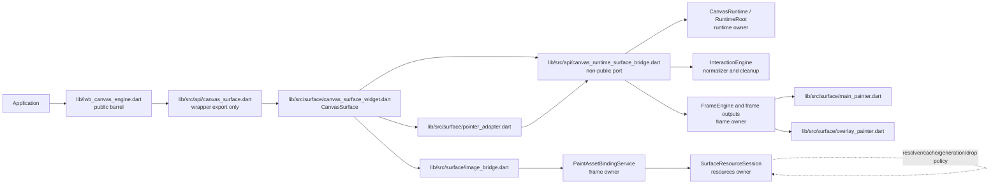
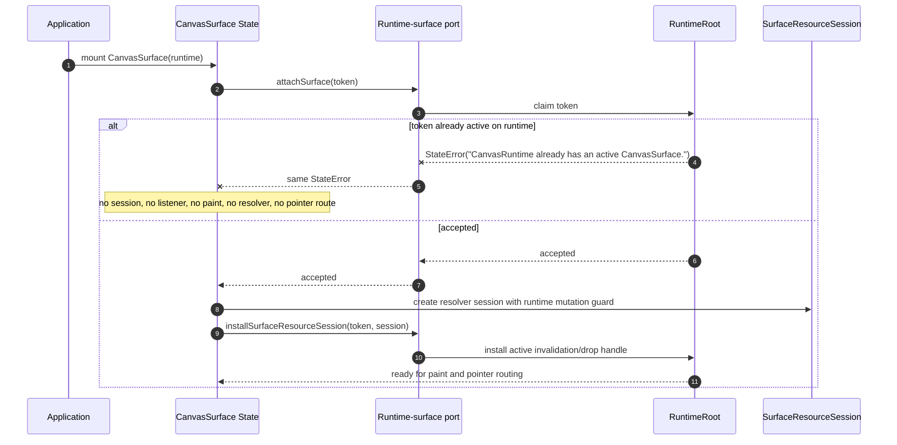
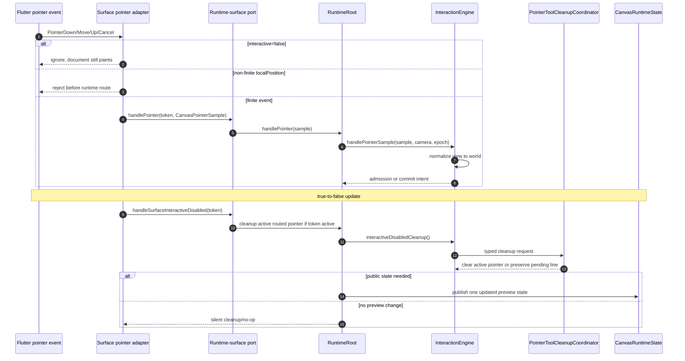
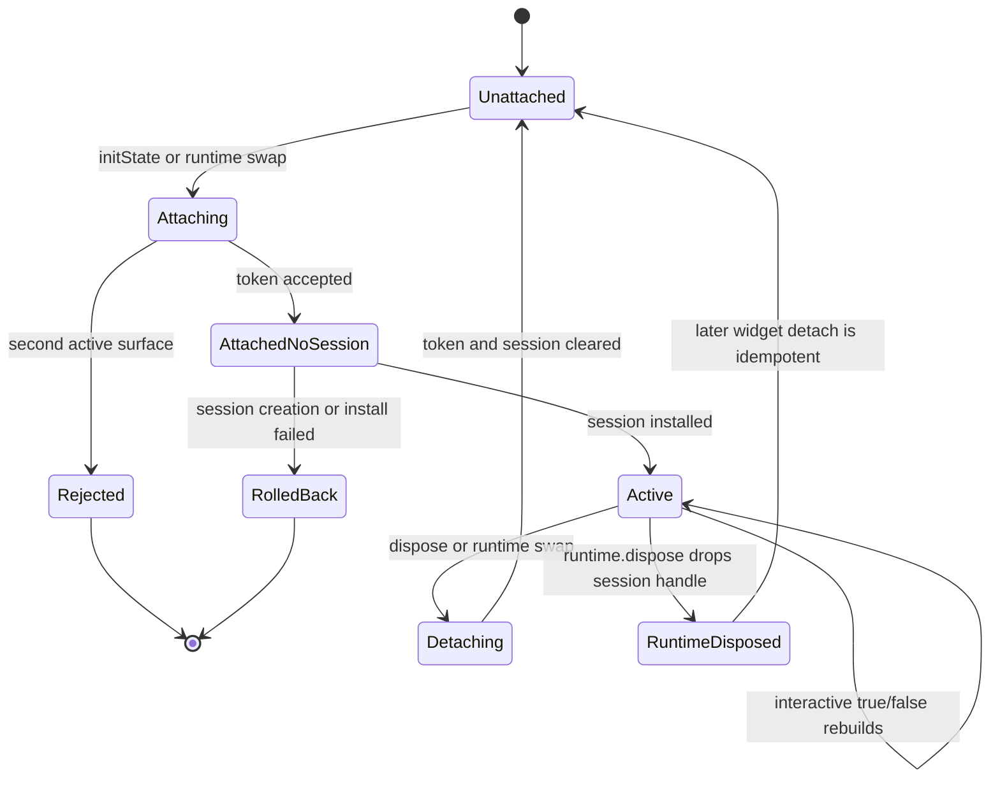

# Design: P13 Flutter Surface

---
date: 2026-06-03
designer: Codex
commit: 6f16dfb5
branch: new-architecture
design_question: "Create a maximally detailed design for docs/implementation/p13_flutter_surface.md that leaves no implementation choice, using docs/history/research/2026-06-03-p13-flutter-surface-research.md, including test/smoke/public_incremental_smoke_test.dart P13 expansion, and including closure of all research-listed problems as a future Unit 0."
---

## Disposition

READY_FOR_CONTRACT

## Product Outcome

P13 turns `CanvasSurface` from a passive public paint host into the public Flutter widget that can be mounted by applications, paint documents with app-owned synchronous image resolution, route Flutter pointer input into the already-proved runtime interaction behavior, and enforce one active surface per runtime. The widget remains an adapter: it does not own document data, store state, resource descriptors, resolver policy, interaction state, frame planning, cache policy, or application images.

Non-goals:

- Do not add multi-surface shared-runtime collaboration. One active `CanvasSurface` per `CanvasRuntime` is the v1 rule; apps that need simultaneous independent canvases use one runtime per surface.
- Do not make `CanvasSurface` a scene controller, document owner, resolver owner, interaction owner, or frame planner.
- Do not import or expose `RuntimeRoot`, store, selection, edit, interaction, or resource internals from the public API barrel.
- Do not satisfy P13 by expanding `lib/src/api/canvas_surface.dart` in place. The public API file becomes a wrapper export, and the production owner is `lib/src/surface/**`.
- Do not add a `lib/src/flutter_bridge/**` owner. That name is treated as obsolete drift and must be retired from guardrail references during Unit 0.
- Do not add async, file, network, asset-bundle, engine-owned, or auto-disposing image loading.
- Do not introduce ordinary-opacity `Canvas.saveLayer` behavior.

## Target Contract Classification

- Profile: BEHAVIOR_CHANGE
- Obligations: BUG_FIX, SEAM_MIGRATION, PUBLIC_API_CHANGE

The future Change Contract must be a behavior-change contract because P13 changes public `CanvasSurface` behavior: mounting now creates an active runtime attachment, the widget routes Flutter pointer events when interactive, it creates an active `SurfaceResourceSession`, it resolves image paint assets through the synchronous app resolver, and it enforces the single-active-surface rule. It also carries BUG_FIX pressure because the research found repository source-of-truth, graph, guardrail, and test-path drift that would make P13 unverifiable if left open. It carries SEAM_MIGRATION because current API-to-frame widget implementation must move behind the surface owner and a narrow runtime-surface bridge. It carries PUBLIC_API_CHANGE because the exported `CanvasSurface` behavior changes while the root public import and constructor shape stay source-compatible.

## Research Inputs

- `docs/history/research/2026-06-03-p13-flutter-surface-research.md` - factual repository map supplied by the user. It confirms existing runtime, frame, resource, and interaction seams, identifies the current passive API-owned `CanvasSurface`, and lists P13 source-of-truth drift in architecture graph closure, guardrail registration, `flutter_bridge` naming, missing focused tests, and public smoke-test expansion.

## Repository Evidence

`Evidence Consequence Link`: each fact below states the decision, boundary, unit, proof surface, or review consequence it supports.

- `docs/implementation/p13_flutter_surface.md:5` - P13 connects proved runtime, frame, resource, and interaction behavior to Flutter without giving the widget direct ownership of internals -> supports selecting an adapter design, not a new runtime owner.
- `docs/implementation/p13_flutter_surface.md:11` - P13 build scope starts with `CanvasSurface` -> supports declaring `CanvasSurface` under the surface owner.
- `docs/implementation/p13_flutter_surface.md:12` - single active attachment gate per `CanvasRuntime` is in scope -> supports a runtime-owned surface token gate.
- `docs/implementation/p13_flutter_surface.md:13` - pointer adapter is in scope -> supports adding a surface-owned Flutter pointer adapter.
- `docs/implementation/p13_flutter_surface.md:16` - synchronous app-owned resolver bridge is in scope -> supports a surface-owned resource session lifecycle that delegates resolver policy to resources.
- `docs/implementation/p13_flutter_surface.md:17` - `SurfaceResourceSession` attach, resolver swap, detach, dispose, and runtime swap wiring must go through `lib/src/resources/**` session owner -> supports creating and dropping `SurfaceResourceSession` without moving cache/resolver logic into the widget.
- `docs/implementation/p13_flutter_surface.md:20` - `interactive=false` pointer routing behavior is in scope -> supports surface-owned pointer listener admission.
- `docs/implementation/p13_flutter_surface.md:21` - active routed pointer cancel on `interactive=false` is in scope -> supports a synchronous cleanup call before the widget disables future routing.
- `docs/implementation/p13_flutter_surface.md:22` - pending line preservation when there is no active routed pointer is in scope -> supports delegating cleanup classification to existing interaction cleanup instead of clearing preview in the widget.
- `docs/implementation/p13_flutter_surface.md:23` - pointer adapter finite normalization before runtime routing is in scope -> supports rejecting non-finite Flutter pointer positions before calling the runtime port.
- `docs/implementation/p13_flutter_surface.md:24` - widget paint for empty and populated documents is in scope -> supports focused widget paint tests and public smoke coverage.
- `docs/implementation/p13_flutter_surface.md:25` - ordinary opacity uses primitive paint alpha -> supports preserving frame-owned paint alpha behavior.
- `docs/implementation/p13_flutter_surface.md:26` - ordinary opacity must not call `Canvas.saveLayer` in the hot paint path -> supports a guardrail and benchmark proof surface.
- `docs/implementation/p13_flutter_surface.md:32` - P13 depends on implemented P7 resource resolver boundary -> supports reusing `SurfaceResourceSession`, not creating a widget resolver cache.
- `docs/implementation/p13_flutter_surface.md:33` - P13 depends on P9 frame output and painter inputs -> supports consuming frame outputs, not rebuilding paint planning.
- `docs/implementation/p13_flutter_surface.md:34` - P13 depends on P10-P12 interaction machines and sealed preview variants -> supports routing pointer samples into `InteractionEngine`, not adding widget-owned interaction state.
- `docs/implementation/p13_flutter_surface.md:47` - donor `direct_flutter_pointer_routing` targets the CanvasSurface pointer adapter -> supports copying only pointer-routing shape, not legacy runtime structure.
- `docs/implementation/p13_flutter_surface.md:54` - forbidden donor structures avoid scene/controller/codec/store-controller legacy shapes -> supports negative guardrail proof against legacy facade imports.
- `docs/implementation/p13_flutter_surface.md:62` - P13 names durable diagrams to read or update -> supports future source-of-truth diagram sync after implementation, not during design.
- `docs/implementation/p13_flutter_surface.md:114` - P13 lists resource, surface, API, preview, load, and guardrail proof ids -> supports a combined verification matrix, not smoke-only proof.
- `docs/implementation/p13_flutter_surface.md:125` - `surface.pointer_samples_normalized_before_runtime` is a required guardrail id -> supports Unit 0 runner registration and a focused adapter test.
- `docs/implementation/p13_flutter_surface.md:126` - `surface.interactive_false_pending_line_preserved` is a required guardrail id -> supports Unit 0 runner registration and focused tests around cleanup ordering.
- `docs/implementation/p13_flutter_surface.md:127` - `resources.app_key_only` is required in the P13 proof list -> supports Unit 0 registry/executor parity for existing resource guardrails.
- `docs/implementation/p13_flutter_surface.md:128` - `resources.dirty_no_document_revision` is required in the P13 proof list -> supports Unit 0 registry/executor parity for dirty-resource proof.
- `docs/implementation/p13_flutter_surface.md:129` - `resources.mutation_inside_edit_only` is required in the P13 proof list -> supports Unit 0 registry/executor parity for descriptor mutation proof.
- `docs/implementation/p13_flutter_surface.md:137` - exit gate requires empty and populated surface paint -> supports widget paint tests for both states.
- `docs/implementation/p13_flutter_surface.md:138` - exit gate requires second active same-runtime surface failure and independent runtimes coexisting -> supports runtime token gate tests.
- `docs/implementation/p13_flutter_surface.md:140` - detach, dispose, and runtime swap remove only the listeners registered by that surface -> supports identity-token detach and no global listener cleanup.
- `docs/implementation/p13_flutter_surface.md:142` - successful attach creates `SurfaceResourceSession`, rejected attach creates no side effects, resolver swap starts a fresh generation, and detach/dispose/runtime swap drop the session -> supports attach ordering and all-or-nothing rollback.
- `docs/implementation/p13_flutter_surface.md:146` - surface observes `CanvasRuntime.state` and does not own public snapshots -> supports `ValueListenable` observation only.
- `docs/implementation/p13_flutter_surface.md:148` - selected-move preview routes to main painter while overlay variants remain overlay-only -> supports consuming sealed preview variants through frame capture.
- `docs/implementation/p13_flutter_surface.md:151` - `interactive=false` disables pointer routing -> supports omitting or disabling the Listener while still painting.
- `docs/implementation/p13_flutter_surface.md:152` - `interactive=false` cancels active pointer sessions but preserves non-active pending line state -> supports a temporal cleanup proof.
- `docs/implementation/p13_flutter_surface.md:153` - `interactive=false` must not mutate runtime mode, committed document, selection, or resources -> supports state-isolation tests.
- `docs/implementation/p13_flutter_surface.md:154` - resource resolver repaint must work -> supports main-paint resource session tests.
- `docs/implementation/p13_flutter_surface.md:155` - ordinary opacity uses primitive paint alpha -> supports preserving `RenderElementRecord.primitiveAlpha`.
- `docs/implementation/p13_flutter_surface.md:156` - ordinary opacity must not call `Canvas.saveLayer` -> supports existing frame ordinary opacity proof plus P13 paint-path guardrail.
- `docs/implementation/p13_flutter_surface.md:163` - widget must not become a second runtime owner -> supports the runtime-surface bridge and token gate.
- `docs/implementation/p13_flutter_surface.md:165` - multi-surface shared-runtime collaboration is intentionally unsupported -> supports failing fast for same-runtime second active surface.
- `docs/implementation/p13_flutter_surface.md:169` - pointer cancellation must be narrower than clearing all preview state -> supports delegating cleanup to `PointerToolCleanupCoordinator`.
- `docs/history/research/2026-06-03-p13-flutter-surface-research.md:13` - runtime, frame, resource, and interaction seams already exist -> supports extending owners instead of introducing replacements.
- `docs/history/research/2026-06-03-p13-flutter-surface-research.md:15` - current `CanvasSurface` is passive, API-owned, imports frame painters, and lacks pointer adapter, single-active gate, session wiring, and resolver-backed frame path -> supports Unit 0 migration from API-owned widget to surface-owned widget.
- `docs/history/research/2026-06-03-p13-flutter-surface-research.md:17` - architecture layout names `lib/src/surface/**`, no such directory exists, P13 guardrail ids are missing from runner registration, and P13 graph check fails -> supports the mandatory Unit 0 source-of-truth and guardrail closure.
- `docs/history/research/2026-06-03-p13-flutter-surface-research.md:199` - surface guardrail ids were not found in `guardrail_registry.dart` or `guardrail_executor.dart` -> supports making guardrail registration a first execution unit.
- `docs/history/research/2026-06-03-p13-flutter-surface-research.md:201` - resource proof ids are also absent from searched runner registry/executor files -> supports Unit 0 registry parity for resource ids already named by docs.
- `docs/history/research/2026-06-03-p13-flutter-surface-research.md:202` - no `PointerAdapter`, `GestureDetector`, `Listener`, `MouseRegion`, or `onPointer` use exists in current API widget -> supports adding a real Flutter pointer adapter.
- `docs/history/research/2026-06-03-p13-flutter-surface-research.md:203` - several P13-listed focused test files are absent -> supports creating the focused P13 test suite rather than relying on existing tests.
- `docs/history/research/2026-06-03-p13-flutter-surface-research.md:207` - current API facade contains passive widget implementation while architecture names surface owner -> supports moving the declaration to `lib/src/surface/**` and keeping API as wrapper.
- `docs/history/research/2026-06-03-p13-flutter-surface-research.md:209` - surface owner DAG is narrower than P13 implementation dependencies -> supports Unit 0 owner-DAG and boundary-rule updates for the selected narrow dependency set.
- `docs/history/research/2026-06-03-p13-flutter-surface-research.md:211` - `PointerSampleNormalizer` is the source of view-to-world normalization -> supports keeping world normalization in interaction, not the Flutter adapter.
- `docs/history/research/2026-06-03-p13-flutter-surface-research.md:215` - `flutter.surface` and `flutter.surface.drives_runtime_ports` are current P13 graph obligations -> supports requiring graph closure as a P13 completion signal.
- `docs/history/research/2026-06-03-p13-flutter-surface-research.md:221` - P10/P12 graph status drift exists but current P13 check reports only surface obligations -> supports keeping unrelated graph repair out of P13; if P13 graph checks start reporting those unrelated statuses, implementation must stop and report a repository contradiction instead of repairing them inside P13.
- `docs/history/research/2026-06-03-p13-flutter-surface-research.md:223` - `dcm check-dependencies lib` gave no file-level details in the free report -> supports treating it as an informational signal, not as a design blocker or metric-only refactor target.
- `docs/contracts/public_api_v1.md:505` - public contract declares `CanvasSurface extends StatefulWidget` -> supports preserving the public constructor and class name.
- `docs/contracts/public_api_v1.md:515` - `CanvasSurface.runtime` is a `CanvasRuntime` -> supports the narrow runtime-surface bridge target.
- `docs/contracts/public_api_v1.md:516` - `resourceResolver` is nullable and public -> supports surface-owned resolver replacement handling.
- `docs/contracts/public_api_v1.md:517` - `selectionStyle` is a public input -> supports capturing style into frame inputs.
- `docs/contracts/public_api_v1.md:518` - `gridStyle` is a public input -> supports capturing grid style into main frame inputs.
- `docs/contracts/public_api_v1.md:519` - `interactive` is public -> supports widget-owned pointer listener gating.
- `docs/contracts/public_api_v1.md:526` - one active `CanvasSurface` per runtime is the v1 rule -> supports runtime token gate.
- `docs/contracts/public_api_v1.md:531` - second active attach throws exact `StateError('CanvasRuntime already has an active CanvasSurface.')` before side effects -> supports attach-first ordering and exact error proof.
- `docs/contracts/public_api_v1.md:537` - `interactive=false` disables pointer routing on `CanvasSurface` only -> supports keeping runtime mode and document state unchanged.
- `docs/contracts/public_api_v1.md:540` - true-to-false interactive transition routes cancel cleanup for active pointer sessions -> supports synchronous cleanup during `didUpdateWidget`.
- `docs/contracts/public_api_v1.md:542` - non-owned pending preview state is preserved when interactive becomes false -> supports interaction-owned cleanup decision.
- `docs/contracts/public_api_v1.md:548` - toggling interactive true resumes routing only for subsequent pointer events -> supports no synthetic replay.
- `docs/contracts/public_api_v1.md:549` - `CanvasSurface` never mutates committed document directly -> supports no edit/store imports from surface.
- `docs/contracts/public_api_v1.md:550` - `CanvasSurface` routes pointer samples into `InteractionEngine` -> supports bridge call to runtime pointer port only.
- `docs/contracts/public_api_v1.md:552` - successful attach creates an empty `SurfaceResourceSession` before image asset paint -> supports session creation after accepted attach and before first frame build.
- `docs/contracts/public_api_v1.md:554` - rejected attach creates no session, resolver, cache, pointer, paint, or repaint-listener side effects -> supports no build/listener setup before the gate.
- `docs/contracts/public_api_v1.md:556` - resolver replacement refreshes session generation and prevents stale reuse -> supports `SurfaceResourceSession.replaceResolver`.
- `docs/contracts/public_api_v1.md:559` - detach, dispose, or runtime swap drops the session -> supports identity-token detach and runtime-dispose fallback.
- `docs/contracts/public_api_v1.md:560` - surface must not own or dispose app-provided images -> supports calling `SurfaceResourceSession.drop()` only, never disposing `ui.Image`.
- `docs/contracts/resources.md:53` - resource descriptors are committed document state and public declarations live in contracts/public -> supports no descriptor ownership in surface.
- `docs/contracts/resources.md:63` - runtime holds nullable active `ResourceSessionInvalidationSink` and invalidates it before dirty publication -> supports installing a session handle into runtime only after accepted attach.
- `docs/contracts/resources.md:65` - each active future `CanvasSurface` owns one `SurfaceResourceSession` under `lib/src/resources/**` -> supports surface lifecycle ownership of a resources-owned object.
- `docs/contracts/resources.md:89` - paint/resource resolution receives immutable descriptor snapshots through `FrameFactsPort` -> supports frame-owned descriptor reads, not surface reads.
- `docs/contracts/resources.md:97` - `PaintAssetBindingService` is the only frame collaborator that receives `SurfaceResourceSession` -> supports using an image bridge that delegates to this service.
- `docs/contracts/resources.md:104` - binding service calls `beginFrameResourcePass()` before resolving images -> supports not doing budget resets in the widget.
- `docs/contracts/resources.md:109` - empty session is created only after successful single-active attach -> supports Unit 1 attach order.
- `docs/contracts/resources.md:113` - resolver replacement increments generation and clears stale entries before next resolve -> supports resolver-swap tests.
- `docs/contracts/resources.md:118` - `ImageResolveCache` is session policy owned by resources, not frame/spatial or runtime-wide state -> supports no widget cache.
- `docs/contracts/resources.md:203` - appKey resource descriptors are mandatory v1 support -> supports resource smoke coverage using appKey.
- `docs/contracts/resources.md:207` - resource mutation remains inside `CanvasEdit` -> supports no surface resource mutation path.
- `docs/contracts/resources.md:208` - resolver calls are synchronous and app-owned -> supports no async resource bridge.
- `docs/contracts/resources.md:209` - resolver calls are bounded by `kMaxSyncResourceResolverCallsPerFrame = 128` -> supports using `SurfaceResourceSession`, not a new bridge cache.
- `docs/contracts/resources.md:210` - runtime mutation inside resolver throws `StateError` -> supports using runtime mutation guard in the session.
- `docs/contracts/resources.md:211` - no engine IO -> supports import guardrails for resource/session and surface.
- `docs/contracts/resources.md:214` - no remote/network loading -> supports negative guardrails.
- `docs/contracts/cache_policy.md:49` - `ImageResolveCache` key, invalidation, capacity, and eviction owner are fixed -> supports no alternate image cache.
- `docs/contracts/interaction_engine.md:128` - one active routed pointer per runtime -> supports a surface pointer adapter that does not admit concurrent sessions.
- `docs/contracts/interaction_engine.md:131` - raw pointer routing belongs to Flutter bridge -> supports surface-owned pointer adapter.
- `docs/contracts/interaction_engine.md:132` - `InteractionEngine` receives normalized `CanvasPointerSample` -> supports routing through runtime to existing interaction normalizer.
- `docs/contracts/interaction_engine.md:133` - public samples are normalized by `pointer_sample_normalizer.dart` -> supports not duplicating world normalization in surface.
- `docs/contracts/interaction_engine.md:141` - cleanup-capable machines return typed cleanup requests to `InteractionEngine`, only engine calls coordinator -> supports no widget cleanup policy.
- `docs/contracts/interaction_engine.md:151` - `InteractionEngine` commits only through `EditKernel` -> supports no surface mutation.
- `docs/contracts/interaction_engine.md:172` - `interactive=false` cancels only active routed pointer sessions and preserves non-owned pending line state -> supports focused cleanup tests.
- `docs/contracts/interaction_engine.md:244` - `InteractionEngine` is the only producer of public preview variants -> supports frame capture of runtime preview, not widget preview state.
- `docs/contracts/interaction_engine.md:258` - `CanvasSelectedMovePreview` is main scene only -> supports main-vs-overlay frame routing.
- `docs/contracts/frame_rendering.md:97` - selected move is captured for main-scene supplement only while other listed previews are overlay capture -> supports surface consuming both main and overlay frame outputs.
- `docs/contracts/frame_rendering.md:108` - main paint captures main frame once -> supports frame builder invocation exactly once per build pass.
- `docs/contracts/frame_rendering.md:109` - overlay paint captures overlay frame once -> supports separate overlay builder.
- `docs/contracts/frame_rendering.md:119` - painters do not live-read runtime -> supports `CustomPainter` consuming immutable output.
- `docs/contracts/frame_rendering.md:126` - `SurfaceResourceSession` is the only image resolution boundary in paint -> supports image bridge through `PaintAssetBindingService`.
- `docs/contracts/frame_rendering.md:139` - `FrameEngine` remains the frame-internal facade -> supports no surface frame-planning fork.
- `docs/contracts/frame_rendering.md:150` - `PaintAssetBindingService` owns descriptor-to-asset binding and must not own painter resolver calls -> supports image bridge boundary.
- `docs/contracts/frame_rendering.md:180` - opacity is applied through primitive paint alpha -> supports ordinary opacity behavior.
- `docs/contracts/frame_rendering.md:181` - ordinary opacity must not create offscreen layers in the hot path -> supports no `saveLayer` in surface painters.
- `docs/contracts/frame_rendering.md:182` - any future `saveLayer` effect must be explicit, budgeted, counted, and guarded by contract update -> supports future-pressure handling.
- `docs/architecture/02_package_boundaries.md:153` - target layout lists `surface/` under `lib/src` -> supports placing production surface files under `lib/src/surface/**`.
- `docs/architecture/02_package_boundaries.md:154` - target layout names `canvas_surface_widget.dart` -> supports this exact primary widget file.
- `docs/architecture/02_package_boundaries.md:155` - target layout names `pointer_adapter.dart` -> supports this exact pointer adapter file.
- `docs/architecture/02_package_boundaries.md:156` - target layout names `main_painter.dart` -> supports moving Flutter main `CustomPainter` adapter to surface owner.
- `docs/architecture/02_package_boundaries.md:157` - target layout names `overlay_painter.dart` -> supports moving Flutter overlay `CustomPainter` adapter to surface owner.
- `docs/architecture/02_package_boundaries.md:158` - target layout names `image_bridge.dart` -> supports a surface-owned adapter from session to frame asset binding.
- `docs/architecture/02_package_boundaries.md:184` - root public barrel exports only `src/api/**` -> supports keeping `lib/src/api/canvas_surface.dart` as the public export wrapper.
- `docs/architecture/02_package_boundaries.md:185` - API files are facade or wrapper-export files -> supports moving implementation out of API.
- `docs/architecture/02_package_boundaries.md:187` - implementation owners consume contract files instead of API facade as type libraries -> supports forbidding root barrel imports and allowing only the narrow non-public runtime-surface bridge.
- `docs/architecture/02_package_boundaries.md:248` - tests mirror production ownership folders, while cross-cutting tests stay separate -> supports migrating focused surface tests from `test/flutter_bridge/**` to `test/surface/**` and keeping smoke in `test/smoke/**`.
- `docs/architecture/02_package_boundaries.md:293` - `lib/src/surface/**` may not import legacy package -> supports negative import guardrails.
- `docs/architecture/architecture_graph.yaml:110` - architecture graph phase closure owner prefixes include `lib/src/surface/**` -> supports graph closure only when `CanvasSurface` declaration moves there.
- `docs/architecture/architecture_graph.yaml:482` - graph node `flutter.surface` is owner `surface`, introduced and required by P13, status `future`, actual declaration `CanvasSurface` -> supports P13 graph closure after declaration placement.
- `docs/architecture/architecture_graph.yaml:1009` - graph edge `flutter.surface.drives_runtime_ports` is required by P13 and targets `api.canvas_runtime` -> supports the surface-to-runtime bridge and graph proof.
- `docs/architecture/architecture_graph.yaml:1212` - graph forbids `flutter.surface` dependency on `api.public_surface` -> supports no root public barrel or facade-wrapper imports from surface.
- `tool/architecture_graph/src/phase_closure.dart:20` - phase closure maps owner `surface` to `lib/src/surface/` -> supports exact file placement.
- Command evidence exception: `dart run tool/architecture_graph/check.dart --phase P13` currently fails with `[flutter.surface] missing_required_node` and `[flutter.surface.drives_runtime_ports] missing_required_edge` -> supports making P13 graph closure a completion gate.
- `lib/src/api/canvas_surface.dart:13` - current `CanvasSurface` declaration lives in API -> supports migration.
- `lib/src/api/canvas_surface.dart:38` - current widget only handles interactive true-to-false cleanup -> supports replacing passive update-only behavior with a full lifecycle.
- `lib/src/api/canvas_surface.dart:49` - current widget observes runtime state -> supports preserving state observation.
- `lib/src/api/canvas_surface.dart:62` - current widget builds resource-free main frame -> supports adding asset-bound main frame path.
- `lib/src/api/canvas_surface.dart:75` - current widget returns `CustomPaint` with stable paint host key -> supports preserving the key for tests and smoke.
- `lib/src/api/canvas_runtime_frame_bridge.dart:3` - current bridge exposes `RuntimeRoot` by `Expando` -> supports replacing it with a narrow surface runtime port that does not expose `RuntimeRoot`.
- `lib/src/api/canvas_runtime.dart:31` - `CanvasRuntime` constructs `RuntimeRoot` -> supports API-owned bridge attachment at runtime construction.
- `lib/src/api/canvas_runtime.dart:52` - `dispose()` delegates to root and detaches bridge -> supports clearing the surface bridge on runtime dispose.
- `lib/src/runtime/runtime_root.dart:185` - runtime currently stores active resource session invalidation sink -> supports extending the runtime surface slot without introducing widget-owned dirty invalidation state.
- `lib/src/runtime/runtime_root.dart:279` - runtime exposes resource-free main frame builder -> supports adding a surface main frame builder with asset binding.
- `lib/src/runtime/runtime_root.dart:296` - runtime exposes resource-free overlay frame builder -> supports reusing overlay frame path.
- `lib/src/runtime/runtime_root.dart:330` - runtime attaches resource session invalidation sink -> supports token-guarding the active session install.
- `lib/src/runtime/runtime_root.dart:337` - runtime clears resource session invalidation sink by identity -> supports identity-safe detach.
- `lib/src/runtime/runtime_root.dart:818` - runtime handles surface interactive disable through interaction cleanup -> supports using runtime as cleanup boundary.
- `lib/src/runtime/runtime_root.dart:901` - runtime pointer input entrypoint delegates to interaction engine -> supports pointer adapter routing.
- `lib/src/runtime/runtime_root.dart:1022` - runtime implements resolver callback mutation guard -> supports constructing `SurfaceResourceSession` with runtime guard.
- `lib/src/runtime/runtime_root.dart:1036` - runtime rejects public mutations during resolver callbacks -> supports resource resolver reentrancy proof.
- `lib/src/runtime/runtime_root.dart:1219` - runtime invalidates active resource session before dirty publication -> supports session install proof.
- `lib/src/resources/surface_resource_session.dart:17` - `SurfaceResourceSession` implements session invalidation sink and owns resolver/cache/generation behavior -> supports using it as the only session object.
- `lib/src/resources/surface_resource_session.dart:35` - session resets per-frame resolver state before resolve pass -> supports no widget budget reset logic.
- `lib/src/resources/surface_resource_session.dart:143` - resolver calls run under mutation guard -> supports runtime reentrancy proof.
- `lib/src/resources/surface_resource_session.dart:167` - `replaceResolver` increments generation and clears cache/suppression -> supports resolver swap lifecycle.
- `lib/src/resources/surface_resource_session.dart:188` - `drop()` clears resolver/cache state without disposing app images -> supports detach/dispose/runtime-swap behavior.
- `lib/src/frame/frame_engine.dart:24` - `FrameAssetBindingBuilder` is the existing frame-owned closure seam for main-frame asset binding -> supports passing an image-bridge closure instead of widening the runtime-surface port to resource paint methods.
- `lib/src/frame/frame_engine.dart:80` - frame engine already has `buildMainFrameWithAssetBindings` -> supports using the existing frame-owned asset-binding hook.
- `lib/src/frame/frame_engine.dart:111` - asset binding is optional and produces empty bindings when omitted -> supports resource-free and resource-backed paths sharing the same frame plan.
- `lib/src/frame/paint_asset_binding_service.dart:23` - `PaintAssetBindingService.bind` takes captured frame, records, and `SurfaceResourceSession` -> supports surface image bridge.
- `lib/src/frame/paint_asset_binding_service.dart:28` - binding service begins frame resource pass -> supports resource budget proof.
- `lib/src/frame/main_frame_painter.dart:13` - current `MainFramePainter` is a Flutter `CustomPainter` over `MainFramePaintOutput` -> supports moving the Flutter painter adapter to surface while leaving frame output ownership in frame.
- `lib/src/frame/main_frame_painter.dart:16` - painter consumes immutable `MainFramePaintOutput` -> supports no live-runtime-read proof.
- `lib/src/frame/overlay_frame_painter.dart:9` - current overlay painter is a Flutter `CustomPainter` over `OverlayFramePaintOutput` -> supports moving the Flutter painter adapter to surface.
- `lib/src/frame/render_element_record.dart:149` - `requiresSaveLayer` is false -> supports ordinary opacity no-saveLayer proof.
- `lib/src/interaction/pointer_sample_normalizer.dart:45` - interaction normalizer converts public sample to normalized sample -> supports not duplicating world normalization.
- `lib/src/interaction/pointer_sample_normalizer.dart:53` - world position is view position plus camera offset -> supports pointer camera-offset focused tests.
- `lib/src/interaction/pointer_tool_cleanup_coordinator.dart:38` - interactive-disabled pending line preview is not changed when not owned by active session -> supports pending-line preservation.
- `lib/src/interaction/pointer_tool_cleanup_coordinator.dart:71` - interactive-disabled pending line disposition is preserved when not owned -> supports state-isolation proof.
- `test/smoke/public_incremental_smoke_test.dart:6` - smoke currently proves public consumer decode, read, selection, resource, edit, and load behavior -> supports append-only P13 smoke expansion.
- `test/smoke/public_incremental_smoke_test.dart:9` - smoke uses a temporary external package harness -> supports root-barrel package-boundary proof.
- `test/smoke/public_incremental_smoke_test.dart:22` - smoke source imports Flutter widgets/tests and root public barrel -> supports no internal imports in P13 smoke.
- `test/smoke/public_incremental_smoke_test.dart:41` - smoke already mounts `CanvasSurface` through public API -> supports extending that scenario to resource-backed and interactive paths.
- `test/smoke/public_incremental_smoke_test.dart:49` - smoke expects the stable paint host key -> supports preserving `ValueKey<String>('iwb_canvas_surface.paint_host')`.
- `test/smoke/public_incremental_smoke_test.dart:54` - current smoke expects resolver calls to be zero for a resource-free document -> supports adding a P13 image-resource scenario where calls become positive only when image records exist.
- `test/smoke/public_incremental_smoke_test.dart:809` - current smoke pumps `interactive=false` and verifies pending line preservation -> supports replacing direct-runtime pointer smoke with Flutter-event path for P13 while preserving append-only style.
- `test/smoke/public_incremental_smoke_test.dart:858` - current P12 smoke pumps an interactive surface before eraser/context workflow -> supports appending P13 surface-driven pointer workflow after P12.
- `test/smoke/public_incremental_smoke_test.dart:1049` - smoke helper `_surfaceHost` currently constructs `CanvasSurface` with runtime and interactive only -> supports extending helper with optional resolver and key-preserving host.
- `test/support/flutter_consumer_test_harness.dart:7` - smoke harness runs an external Flutter package -> supports P13 public package boundary proof.
- `docs/verification/tests.md:573` - public incremental smoke is the external Flutter consumer proof -> supports smoke expansion as mandatory P13 proof.
- `docs/verification/tests.md:597` - smoke must expand only by appending the next real public user step -> supports append-only P13 smoke additions.
- `docs/verification/tests.md:699` - existing P11 focused test proves `interactive=false` pending line preservation through public surface -> supports keeping focused behavior and extending from bridge naming to surface naming.
- `docs/verification/tests.md:706` - smoke already appends root-barrel draw coverage through public surface -> supports P13 appending Flutter-event routing, not replacing P11 checks.
- `docs/verification/tests.md:744` - P12 smoke appends eraser/context request public coverage -> supports P13 appending after P12.
- `docs/verification/guardrails.md:96` - surface pointer normalization guardrail is named in guardrail docs -> supports runner-backed registration.
- `docs/verification/guardrails.md:97` - interactive false pending line guardrail is named in guardrail docs -> supports runner-backed registration.
- `docs/verification/guardrails.md:244` - guardrail docs define surface finite-normalized sample proof -> supports positive and negative guardrail fixtures.
- `docs/verification/guardrails.md:245` - guardrail docs define interactive=false cleanup and state isolation proof -> supports focused guardrail test.
- `docs/verification/guardrail_design_patterns.md:151` - surface pointer guardrail proof form is semantic sequence plus behavioral seam test -> supports required proof shape.
- `docs/verification/guardrail_design_patterns.md:152` - interactive false guardrail proof form is semantic sequence plus behavioral seam test -> supports required proof shape.
- `tool/guardrails/src/owner_dag_import_checks.dart:623` - current surface owner DAG allows only contracts/public -> supports Unit 0 dependency-edge update for P13 surface imports.
- `tool/guardrails/src/owner_dag_import_checks.dart:624` - current surface owner DAG allows only contracts/internal -> supports Unit 0 adding exact allowed edges rather than broad import bypass.
- `tool/guardrails/src/core_boundary_checks.dart:687` - guardrail code already recognizes `lib/src/surface/*painter*` paths for resolver-ownership checks -> supports surface-owned Flutter painter files.
- `tool/guardrails/src/core_boundary_checks.dart:889` - current API-to-frame painter allowlist only exists for `lib/src/api/canvas_surface.dart` -> supports retiring that allowlist after surface migration.
- `tool/guardrails/src/interaction_guardrail_checks.dart:372` - interaction guardrail helper still names `lib/src/flutter_bridge/` -> supports Unit 0 replacing obsolete bridge naming with `lib/src/surface/`.
- `tool/guardrails/src/guardrail_executor.dart:130` - unknown guardrail ids exit with 64 -> supports registering P13 guardrail ids before relying on them.
- `test/guardrails/import_boundaries_test.dart:341` - boundary tests already check frame and surface painter code cannot own typed `CanvasResourceResolver` -> supports preserving resolver ownership in session, not painters.
- `test/guardrails/import_boundaries_test.dart:375` - boundary test currently allows `lib/src/surface/canvas_surface.dart` to own resolver reference -> supports widget-level public resolver input while preventing painter resolver ownership.
- Command evidence exception: `find lib/src -maxdepth 2 -type d | sort` currently has no `lib/src/surface` -> supports Unit 0 owner directory creation and graph closure.
- Command evidence exception: `find test/flutter_bridge -maxdepth 3 -type f | sort` currently shows only three wrappers/fixtures -> supports creating/migrating the full P13 focused test suite.

## Design Form Candidates

### Candidate A. Surface owner with narrow runtime-surface bridge

- Form: Declare `CanvasSurface` in `lib/src/surface/canvas_surface_widget.dart`; keep `lib/src/api/canvas_surface.dart` as a public wrapper export; replace the root-returning frame bridge with a narrow non-public runtime-surface bridge; let the surface owner handle Flutter lifecycle, pointer adapter, image bridge, and Flutter `CustomPainter` adapters; let runtime, interaction, frame, and resources keep their current ownership.
- Why it could work: It matches the P13 graph owner, package layout, public API compatibility, and existing runtime/resource/frame/interaction seams. It makes all fallible attach work happen before resolver/session side effects. It lets focused tests prove each boundary directly.
- Gate failures or risks: Requires Unit 0 owner-DAG, graph, docs, guardrail, and test-path cleanup. The runtime-surface bridge must be narrow enough not to become a second public API or a backdoor to `RuntimeRoot`.

### Candidate B. Expand current `lib/src/api/canvas_surface.dart` in place

- Form: Keep `CanvasSurface` implementation under API and add pointer routing, resource session lifecycle, and resolver-backed paint there.
- Why it could work: It is the smallest text edit because the current passive widget already observes runtime state and builds `CustomPaint`.
- Gate failures or risks: Fails Ownership because the graph owner is `surface`, not API. Fails Source-Of-Truth Singularity because API would own implementation while architecture says API files are wrapper exports. Fails dependency direction because it would continue the temporary API-to-frame painter allowlist. Fails graph closure because `flutter.surface` expects actual declaration under `lib/src/surface/**`. Rejected.

### Candidate C. Move widget to surface but import `RuntimeRoot` directly

- Form: Put `CanvasSurface` under `lib/src/surface/**` but keep `canvasRuntimeFrameRootForSurface` returning `RuntimeRoot` and let the widget call root methods.
- Why it could work: It closes the graph node path while preserving most current calls.
- Gate failures or risks: Fails Boundary-Owned Policy because the surface sees runtime internals instead of a port. Fails future pressure because every new root method becomes callable from UI code. Fails negative proof because tests could pass while the surface has direct interaction/resource/store access. Rejected.

### Candidate D. Move all frame paint planning and painters into surface

- Form: Treat surface as owner of main/overlay painting and migrate frame builders, paint records, caches, and asset binding under `lib/src/surface/**`.
- Why it could work: It would make all Flutter paint code visibly surface-owned.
- Gate failures or risks: Fails Owner-Level Fix because P9 already made frame the owner of capture, planning, caches, selected-move supplement staging, and opacity policy. It would create duplicate source-of-truth pressure for frame cache policy and tests. Rejected.

## Known Future Pressures

| Pressure | Evidence | How the selected form responds | Accepted cost or risk |
|---|---|---|---|
| Future multi-surface shared-runtime collaboration | `docs/implementation/p13_flutter_surface.md:165` says same-runtime collaboration is intentionally unsupported in v1 | Runtime token gate rejects the second active surface and keeps independent runtimes independent | Future collaboration needs a new contract for per-surface/user state; P13 does not add sync glue |
| Existing architecture graph expects `flutter.surface` under `lib/src/surface/**` | `docs/architecture/architecture_graph.yaml:482`; `tool/architecture_graph/src/phase_closure.dart:20` | `CanvasSurface` declaration moves to `lib/src/surface/canvas_surface_widget.dart` | Requires Unit 0 docs/tool alignment and final graph check |
| API facade must remain the public import path | `docs/architecture/02_package_boundaries.md:184`; `lib/iwb_canvas_engine.dart:16` | API file re-exports the surface widget and public styles, without owning implementation | Wrapper export must be kept small and tested by API facade guardrails |
| Surface must drive runtime ports without importing public surface facade | `docs/architecture/architecture_graph.yaml:1009`; `docs/architecture/architecture_graph.yaml:1212` | Add a narrow non-public `canvas_runtime_surface_bridge.dart` that returns a surface port, never the root barrel or `RuntimeRoot` | Unit 0 must encode this exact exception in owner-DAG checks without reopening generic API imports |
| Resource resolver must stay synchronous, app-owned, bounded, and no-dispose | `docs/contracts/resources.md:208`; `docs/contracts/resources.md:209`; `docs/contracts/resources.md:214`; `docs/contracts/public_api_v1.md:560` | Surface creates `SurfaceResourceSession`; resources owner keeps resolver/cache/generation/drop policy; frame binding service does descriptor-to-asset binding | Surface widget now owns lifecycle ordering and must prove no session side effects on rejected attach |
| `interactive=false` cleanup is temporal and state-sensitive | `docs/contracts/interaction_engine.md:172`; `docs/implementation/p13_flutter_surface.md:169` | Surface only triggers runtime cleanup on true-to-false or runtime-swap/dispose routes; interaction cleanup decides active-session cancellation vs pending-line preservation | Focused tests must cover active session, no active session, pending line, runtime swap, and state isolation |
| P13 guardrail ids are documented but not runner-backed | `docs/history/research/2026-06-03-p13-flutter-surface-research.md:199`; `tool/guardrails/src/guardrail_executor.dart:130` | Unit 0 registers and routes guardrails before behavior units rely on them | Adds upfront tooling work but prevents false release confidence |
| `test/flutter_bridge/**` naming conflicts with surface owner | `docs/architecture/02_package_boundaries.md:248`; `docs/history/research/2026-06-03-p13-flutter-surface-research.md:203` | Future contract migrates focused surface tests to `test/surface/**` and updates docs/verification ids to `test.surface.*` | Existing wrappers may need rename-only churn; smoke remains under `test/smoke/**` |
| Ordinary opacity and future saveLayer effects | `docs/contracts/frame_rendering.md:180`; `docs/contracts/frame_rendering.md:182` | Surface painters preserve primitive-alpha rendering and do not add saveLayer; any future saveLayer effect requires a separate contract update | P13 must run frame paint proof and benchmark/probe guardrails when changed |
| Hidden `dcm check-dependencies` report | `docs/history/research/2026-06-03-p13-flutter-surface-research.md:223` | Current design does not make file-level decisions from unavailable details; future contract treats disclosed file-level dependency output as Unit 0 blocker if the environment provides it | No metric-only refactor is allowed solely to satisfy an undisclosed paid report |

## Selected Form

The selected form is Candidate A: a surface-owned public widget implementation with a narrow runtime-surface bridge and strict owner preservation.

### Locked Production Shape

The future implementation must create this shape:

- `lib/src/surface/canvas_surface_widget.dart`
  - Primary declaration: `final class CanvasSurface extends StatefulWidget`.
  - Owns public constructor forwarding, widget lifecycle, active attachment lifecycle, build/layout, `interactive` routing switch, stable paint host key, and child composition.
  - Must not import `RuntimeRoot`, store, edit, selection, interaction internals, resource internals other than `SurfaceResourceSession`, or legacy package paths.
- `lib/src/surface/pointer_adapter.dart`
  - Primary declaration: `final class CanvasSurfacePointerAdapter`.
  - Owns Flutter `PointerEvent` to public `CanvasPointerSample` conversion.
  - Rejects non-finite `localPosition` before runtime routing.
  - Routes only down/move/up/cancel phases.
  - Does not convert view to world. `PointerSampleNormalizer` remains the source of truth for world normalization.
- `lib/src/surface/image_bridge.dart`
  - Primary responsibility: bind a `SurfaceResourceSession` to `FrameEngine` asset-binding through `PaintAssetBindingService`.
  - Primary declaration: `final class CanvasSurfaceImageBridge`.
  - Imports `PaintAssetBindingService`, `FrameAssetBindingBuilder`, and concrete `SurfaceResourceSession`.
  - Exposes `FrameAssetBindingBuilder bindAssets(SurfaceResourceSession session)`.
  - The returned closure is passed to the runtime-surface port when building the main frame.
  - Must not store or type-own `CanvasResourceResolver`; only the widget and session constructor see the resolver.
- `lib/src/surface/main_painter.dart`
  - Primary declaration: `MainFramePainter`.
  - Consumes `MainFramePaintOutput`.
  - Delegates record painting to existing frame-owned primitive helper functions; it must not copy frame record-painting logic into surface.
  - Must not own typed `CanvasResourceResolver`, call `Canvas.saveLayer` for ordinary opacity, or live-read runtime.
- `lib/src/surface/overlay_painter.dart`
  - Primary declaration: `OverlayFramePainter`.
  - Consumes `OverlayFramePaintOutput`.
  - Must not own typed resolver, call `Canvas.saveLayer` for ordinary opacity, or live-read runtime.
- `lib/src/api/canvas_surface.dart`
  - Becomes wrapper-export only.
  - Exports `../contracts/public/canvas_surface_styles.dart`.
  - Exports `../surface/canvas_surface_widget.dart` showing `CanvasSurface`.
  - Must not import frame painters, resources, runtime root, or Flutter implementation helpers beyond what wrapper export syntax requires.
- `lib/src/api/canvas_runtime_surface_bridge.dart`
  - Replaces the direct root-returning surface bridge.
  - Is not exported from the public barrel.
  - Stores an `Expando` from `CanvasRuntime` to a narrow surface port.
  - Returns a surface port, never `RuntimeRoot`.
  - Is the only surface route to runtime internals.
- `lib/src/api/canvas_runtime_frame_bridge.dart`
  - Must be retired from production surface usage and replaced by `canvas_runtime_surface_bridge.dart`.
  - Tests must prove no `canvasRuntimeFrameRootForSurface` style root-returning bridge remains used by `CanvasSurface`.
- `lib/src/contracts/internal/surface_resource_session_lifecycle.dart`
  - Add this small internal contract so runtime can drop active sessions on runtime disposal without depending on the concrete resources implementation in public surface code.
  - Primary declaration: `abstract interface class SurfaceResourceSessionLifecycle`.
  - Shape is locked: it extends `ResourceSessionInvalidationSink` and adds only `void drop();`.
  - It must not expose `beginFrameResourcePass`, `resolveImage`, `replaceResolver`, `CanvasResourceResolver`, `ResourceImageResolveRequest`, or `ResourceImageResolveResult`.
  - `SurfaceResourceSession` implements it.
  - It imports only internal/public contracts, not implementation owners.

### Narrow Runtime-Surface Port

The bridge port must expose only these responsibilities. It must be implemented as a final class wrapping `RuntimeRoot`; the surface must not see `RuntimeRoot`.

Required surface port operations:

- `ValueListenable<CanvasRuntimeState> get state`
  - Used only for widget rebuild scheduling and public state observation.
- `void attachSurface(Object token)`
  - Fallible.
  - Throws exactly `StateError('CanvasRuntime already has an active CanvasSurface.')` when a different token is active.
  - Must run before session construction, listener registration, frame build, pointer routing, or resolver attachment.
- `void installSurfaceResourceSession(Object token, SurfaceResourceSessionLifecycle session)`
  - Requires the token currently active.
  - Installs session as active invalidation sink.
  - If it fails after `attachSurface`, the surface must roll back by dropping the new session and detaching the token.
- `void detachSurface(Object token)`
  - Clears only the active token and active session installed by the identical token.
  - Drops the active session exactly through `SurfaceResourceSessionLifecycle.drop()` or through an idempotent local fallback if runtime has already disposed.
  - Does not clear or mutate another active surface.
- `void handleSurfaceInteractiveDisabled(Object token)`
  - No-ops if token is not the active surface token.
  - Delegates to interaction cleanup when token is active.
  - Publishes runtime state only if interaction cleanup says public state is needed.
- `void handlePointer(Object token, CanvasPointerSample sample)`
  - No-ops if token is stale, so stale widget callbacks during teardown cannot clear or mutate another active surface.
  - Delegates to runtime pointer handling for active token.
- `MainFramePaintOutput buildSurfaceMainFrame(Object token, {required Rect viewportWorldBounds, required double devicePixelRatio, required CanvasSelectionStyle selectionStyle, required CanvasGridStyle gridStyle, required FrameAssetBindingBuilder bindAssets})`
  - Requires active token.
  - Captures main frame once.
  - Uses `FrameEngine.buildMainFrameWithAssetBindings`.
  - Passes `bindAssets` through to frame-owned `FrameEngine.buildMainFrameWithAssetBindings`.
  - The runtime-surface port must not import `SurfaceResourceSession`.
- `OverlayFramePaintOutput buildSurfaceOverlayFrame(Object token, {required Rect viewportWorldBounds, required double devicePixelRatio, required CanvasSelectionStyle selectionStyle, required CanvasGridStyle gridStyle})`
  - Requires active token.
  - Captures overlay frame once.
  - Does not receive or use resource resolver/session.
- `ResolverMutationGuard get resolverMutationGuard`
  - Exposes only the internal guard contract needed to construct `SurfaceResourceSession`.

Forbidden port operations:

- No store reads.
- No edit methods.
- No selection mutation.
- No resource descriptor mutation.
- No interaction engine object exposure.
- No `RuntimeRoot` getter.
- No frame cache mutation controls.
- No public root barrel imports.

### Surface Attachment Lifecycle

The future implementation must use this order:

1. `initState`
   - Create a unique private `Object` token for the `State` instance.
   - Resolve the runtime-surface port for `widget.runtime`.
   - Call `port.attachSurface(token)`.
   - Only after attach acceptance, create `SurfaceResourceSession(resolver: widget.resourceResolver, mutationGuard: port.resolverMutationGuard)`.
   - Install the session through the port.
   - Store active runtime identity, port, token, and session in the widget state.
2. Attach rejection
   - If `attachSurface` throws, do not create a session, do not register any listener, do not build frame output, do not route pointers, and let the exact `StateError` escape.
   - If session creation or install throws after attach acceptance, call `session.drop()` when present, then detach the token, then rethrow. This is the rollback path.
3. `didUpdateWidget`
   - If only `resourceResolver` changes and runtime identity is unchanged, call `SurfaceResourceSession.replaceResolver(newResolver)` on the surface-owned concrete session.
   - If `interactive` changes from true to false and runtime identity is unchanged, call `port.handleSurfaceInteractiveDisabled(token)` before the next build can admit more events.
   - If runtime identity changes, first run old-runtime cleanup:
     - if old `interactive` was true, call `oldPort.handleSurfaceInteractiveDisabled(token)` to cancel any active routed pointer owned by the old surface;
     - call `oldPort.detachSurface(token)`;
     - drop local session fallback if runtime already disposed or bridge lookup fails.
   - After old detach, attach the new runtime using the same attach order as `initState`.
   - If new attach rejects, do not reattach old runtime. The widget update has already relinquished the old runtime; preserving old attachment would create hidden sync state.
4. `dispose`
   - If current `interactive` is true, call `port.handleSurfaceInteractiveDisabled(token)` before detach.
   - Call `port.detachSurface(token)`.
   - If bridge lookup fails because runtime dispose detached it first, call the local session's idempotent `drop()` exactly once from the surface state.
   - Do not dispose app-owned `ui.Image`.
5. Runtime `dispose()`
   - Runtime must clear the active surface token and drop the active session handle if one is installed.
   - Later surface detach must be idempotent and must not throw only because runtime already disposed or bridge was detached.

### Pointer Adapter Semantics

The pointer adapter is surface-owned and must be implemented as a Flutter `Listener`, not a gesture recognizer, because P13 donor input is direct pointer routing and the interaction engine already owns gesture decisions.

Required routing:

- When `interactive == false`, no Flutter pointer event may call the runtime port.
- When `interactive == true`, route:
  - `PointerDownEvent` -> `CanvasPointerLifecyclePhase.down`
  - `PointerMoveEvent` -> `CanvasPointerLifecyclePhase.move`
  - `PointerUpEvent` -> `CanvasPointerLifecyclePhase.up`
  - `PointerCancelEvent` -> `CanvasPointerLifecyclePhase.cancel`
- Use `event.pointer` as `pointerId`.
- Use `event.localPosition` as view-space `position`.
- Use `event.kind` as pointer kind.
- Use `event.timeStamp.inMilliseconds` as `timestampMs` only when non-negative. If Flutter ever gives a negative timestamp, omit it instead of normalizing to zero.
- Reject non-finite positions before constructing `CanvasPointerSample` or calling the runtime port.
- Do not transform by camera offset in the surface. `PointerSampleNormalizer` adds camera offset inside interaction.
- Do not synthesize missing up/cancel events on rebuild. The only synthetic cleanup route is `handleSurfaceInteractiveDisabled(token)` on true-to-false, runtime swap, or dispose.

### Paint And Resource Semantics

The surface build path must be:

1. Observe `port.state` through `ValueListenableBuilder`.
2. Use `LayoutBuilder` to derive `paintSize`.
3. Use `Offset.zero & paintSize` as the viewport rectangle passed to the runtime-surface port.
4. Use `MediaQuery.maybeOf(context)?.devicePixelRatio ?? 1.0`.
5. Build main frame by calling `CanvasSurfaceImageBridge.bindAssets(activeSession)` and passing the returned `FrameAssetBindingBuilder` to `port.buildSurfaceMainFrame`.
6. Build overlay frame without resource session.
7. Return a `CustomPaint` with key `const ValueKey<String>('iwb_canvas_surface.paint_host')`.
8. Use surface-owned `MainFramePainter` and `OverlayFramePainter`.
9. Wrap the paint host in the pointer adapter only when `interactive == true`, while preserving paint host identity and layout for `interactive == false`.

Resource-specific rules:

- Empty documents and documents without image records do not call resolver.
- Documents with image records call the app resolver synchronously through `SurfaceResourceSession`.
- Resolver swap uses `replaceResolver`; it does not create a second active session for the same surface.
- Dirty resource invalidation from runtime reaches only the installed active session.
- Detach/dispose/runtime swap drops the session and clears cache without disposing app images.
- Rejected attach creates no session object and no resolver calls.

### Source-Of-Truth Closure Unit 0

The future Change Contract must start with Unit 0 before behavior implementation. Unit 0 is not optional and must close every research-listed mismatch that would otherwise leave P13 unverifiable.

Unit 0 required work:

1. Source layout and naming closure
   - Create or prepare `lib/src/surface/**` as the production owner.
   - Retire `lib/src/flutter_bridge/**` naming from guardrail path checks and future fixtures. No production code may use that directory.
   - Move focused surface tests to `test/surface/**` and update docs/verification ids from `test.flutter_bridge.*` to `test.surface.*`. Existing `test/flutter_bridge/**` wrappers must not remain as duplicate proof surfaces.
2. API wrapper closure
   - Convert `lib/src/api/canvas_surface.dart` into wrapper export only.
   - Remove the current API-to-frame painter allowlist for `canvas_surface.dart` after no production API widget imports frame painters.
3. Runtime bridge closure
   - Replace or retire `canvas_runtime_frame_bridge.dart` so production surface code cannot obtain `RuntimeRoot`.
   - Add the narrow runtime-surface bridge and port.
   - Update `CanvasRuntime` bridge attach/detach wiring.
4. Guardrail registry and executor closure
   - Register and route `surface.pointer_samples_normalized_before_runtime`.
   - Register and route `surface.interactive_false_pending_line_preserved`.
   - Register and route or otherwise mechanically prove `resources.app_key_only`.
   - Register and route or otherwise mechanically prove `resources.dirty_no_document_revision`.
   - Register and route or otherwise mechanically prove `resources.mutation_inside_edit_only`.
   - A docs-only listing is not sufficient; unknown ids must not be accepted as proof.
5. Boundary tooling closure
   - Update owner DAG allowed edges for the exact selected surface dependency set: contracts/public, contracts/internal, the non-public runtime-surface bridge, frame paint output/binding/painter helper APIs, and concrete `SurfaceResourceSession`.
   - Forbid surface imports of store, edit, selection, interaction internals, `RuntimeRoot`, legacy package paths, root public barrel, and `lib/src/flutter_bridge/**`.
   - Preserve the resolver ownership rule: surface widget may receive `CanvasResourceResolver`, but surface painters may not own typed resolver references.
6. Architecture graph closure
   - Keep `flutter.surface` mapped to `lib/src/surface/**`.
   - Ensure the actual `CanvasSurface` declaration is under that owner.
   - Ensure the actual `flutter.surface.drives_runtime_ports` edge observes delegation to `CanvasRuntime` through the narrow bridge.
   - Run `dart run tool/architecture_graph/check.dart --phase P13` after the behavior units and require it to pass.
   - Do not repair unrelated P10/P12 graph-status drift in P13. If the P13 graph check exposes those statuses as current violations after P13 changes, stop implementation and report the repository contradiction.
7. Focused test inventory closure
   - Create or migrate the full focused P13 suite:
     - `test/surface/interactive_false_pointer_routing_test.dart`
     - `test/surface/interactive_false_active_session_cancel_test.dart`
     - `test/surface/interactive_false_pending_line_preserved_test.dart`
     - `test/surface/interactive_false_state_isolation_test.dart`
     - `test/surface/single_active_surface_test.dart`
     - `test/surface/surface_resource_session_lifecycle_test.dart`
     - `test/surface/pointer_adapter_finite_normalization_test.dart`
     - `test/surface/widget_paint_test.dart`
     - `test/surface/surface_camera_frame_output_test.dart`
   - Existing resource and frame tests remain under their owners.
8. Hidden DCM dependency signal closure
   - Run the repository-required DCM checks. Do not make metric-only or hidden-report refactors from `dcm check-dependencies lib` when the free report still lacks file-level identities.
   - If a future environment prints file-level dependency violations, treat them as Unit 0 blockers and fix at owner level before behavior work.

## Decision Trace

Preserve `Decision Chain Of Custody`: source inputs and locked decisions must map to the future contract field, execution unit, or proof surface that carries them forward.

| Decision ID | Decision | Evidence | Contract handoff target |
|---|---|---|---|
| D1 | `CanvasSurface` declaration moves to `lib/src/surface/canvas_surface_widget.dart`; API becomes wrapper export only | `docs/architecture/02_package_boundaries.md:153`; `docs/architecture/02_package_boundaries.md:184`; `lib/src/api/canvas_surface.dart:13`; `docs/history/research/2026-06-03-p13-flutter-surface-research.md:207` | `Boundaries.Owner`; Unit 0 API wrapper closure; architecture graph proof |
| D2 | Surface must use a narrow runtime-surface bridge, not `RuntimeRoot` | `docs/implementation/p13_flutter_surface.md:163`; `docs/architecture/architecture_graph.yaml:1009`; `lib/src/api/canvas_runtime_frame_bridge.dart:15`; `docs/history/research/2026-06-03-p13-flutter-surface-research.md:15` | `Boundaries.Seam`; Unit 0 runtime bridge closure; guardrail proof |
| D3 | Single-active attach gate is runtime-token owned and fallible before session/listener/paint/resolver side effects | `docs/contracts/public_api_v1.md:526`; `docs/contracts/public_api_v1.md:531`; `docs/diagrams/seq_single_active_surface.mmd:13`; `docs/diagrams/seq_single_active_surface.mmd:20` | Unit 1 attach gate; `test/surface/single_active_surface_test.dart` |
| D4 | `SurfaceResourceSession` is created only after accepted attach and remains the only resolver/cache/generation owner; runtime sees only `SurfaceResourceSessionLifecycle` for invalidation/drop | `docs/contracts/resources.md:65`; `docs/contracts/resources.md:109`; `lib/src/resources/surface_resource_session.dart:17`; `docs/contracts/cache_policy.md:49` | Unit 2 resource session lifecycle; `test/surface/surface_resource_session_lifecycle_test.dart` |
| D5 | Main frame uses existing `FrameEngine.buildMainFrameWithAssetBindings`; `CanvasSurfaceImageBridge` supplies a `FrameAssetBindingBuilder` closure that calls `PaintAssetBindingService` with the concrete `SurfaceResourceSession`; overlay frame remains resource-free | `lib/src/frame/frame_engine.dart:80`; `lib/src/frame/paint_asset_binding_service.dart:23`; `docs/contracts/resources.md:97`; `docs/contracts/frame_rendering.md:150` | Unit 3 paint/image bridge; frame/resource focused tests |
| D6 | Flutter `CustomPainter` adapters move to surface owner but continue to consume immutable frame outputs | `docs/architecture/02_package_boundaries.md:156`; `docs/architecture/02_package_boundaries.md:157`; `lib/src/frame/main_frame_painter.dart:16`; `docs/contracts/frame_rendering.md:119` | Unit 3 painter migration; no-live-runtime-read tests |
| D7 | Pointer adapter only converts finite Flutter pointer events to public samples; world normalization stays in interaction | `docs/contracts/interaction_engine.md:131`; `docs/contracts/interaction_engine.md:133`; `lib/src/interaction/pointer_sample_normalizer.dart:45`; `docs/implementation/p13_flutter_surface.md:23` | Unit 4 pointer adapter; `surface.pointer_samples_normalized_before_runtime`; pointer adapter tests |
| D8 | `interactive=false` triggers runtime cleanup only for active route while preserving non-owned pending line state | `docs/contracts/interaction_engine.md:172`; `docs/contracts/public_api_v1.md:540`; `lib/src/interaction/pointer_tool_cleanup_coordinator.dart:71`; `docs/implementation/p13_flutter_surface.md:169` | Unit 5 interactive false behavior; guardrail and focused tests |
| D9 | Public smoke test must append P13 external consumer behavior using Flutter events and resource-backed surface paint through root barrel only | `docs/verification/tests.md:573`; `docs/verification/tests.md:597`; `test/support/flutter_consumer_test_harness.dart:7`; `test/smoke/public_incremental_smoke_test.dart:22` | Unit 6 smoke extension; `test/smoke/public_incremental_smoke_test.dart` |
| D10 | Unit 0 closes guardrail, docs, graph, test-path, and obsolete `flutter_bridge` drift before behavior implementation | `docs/history/research/2026-06-03-p13-flutter-surface-research.md:17`; `docs/history/research/2026-06-03-p13-flutter-surface-research.md:199`; `docs/history/research/2026-06-03-p13-flutter-surface-research.md:203`; `tool/guardrails/src/guardrail_executor.dart:130` | Unit 0; source-of-truth updates; guardrail registry/executor proof |
| D11 | Ordinary opacity and no-saveLayer policy remains frame/surface paint proof, not a widget choice | `docs/contracts/frame_rendering.md:180`; `docs/contracts/frame_rendering.md:182`; `lib/src/frame/render_element_record.dart:149`; `docs/implementation/p13_flutter_surface.md:156` | Unit 3 painter proof; frame paint tests and benchmark/probe guard |
| D12 | Hidden DCM dependency output is informational unless file-level evidence is available | `docs/history/research/2026-06-03-p13-flutter-surface-research.md:223` | Unit 0 verification notes; do not implement metric-only hidden-report changes |

## Outcome-Proof Fit

| Claim | Direct outcome | Proxy risk | Required proof surface or strategy |
|---|---|---|---|
| Surface owner is the real implementation owner | `CanvasSurface` declaration is under `lib/src/surface/**`, API file is wrapper-only, P13 graph sees `flutter.surface` implemented | Passing widget tests while class remains in API | `dart run tool/architecture_graph/check.dart --phase P13`; semantic test that API file has no frame/resource/runtime-root imports |
| Second active same-runtime surface fails before side effects | Pumping or mounting a second active surface with same runtime throws exact `StateError` and resolver/session/listener/pointer side effects stay zero | A test that only catches an error after resolver already ran | `test/surface/single_active_surface_test.dart` with counters for session creation, resolver calls, and old active surface continuity |
| Independent runtimes can host independent surfaces | Two active surfaces with different runtimes mount and paint in the same tree | Only testing serial mount/detach | Same focused test mounts two runtimes simultaneously |
| Resource session lifecycle is correct | Accepted attach creates one session; rejected attach creates none; resolver swap increments generation; detach/dispose/runtime swap drop cache without image disposal | Only checking resolver call count | `test/surface/surface_resource_session_lifecycle_test.dart` plus resource session tests for no-dispose and generation reset |
| Resource dirty repaint invalidates active session before public dirty state | Dirty resource call evicts target/all session cache and publishes only resourceVisual revision | Only observing repaint or state revision | Existing resource dirty session invalidation tests plus P13 surface session wiring test |
| Pointer adapter rejects non-finite before runtime | Non-finite down/move creates no runtime pointer call, preview, state tick, repaint, edit, or action | Constructing public `CanvasPointerSample` directly, which bypasses Flutter adapter | `test/surface/pointer_adapter_finite_normalization_test.dart` using Flutter pointer events and a runtime/port spy seam |
| Pointer adapter preserves camera-aware world normalization | A Flutter event at local position plus camera offset produces committed/preview world facts through interaction normalizer | Only checking a pointer event reached runtime | Focused pointer adapter test with runtime camera offset and public preview/action outcome |
| `interactive=false` disables routing | Flutter pointer events while false produce no pointer route, preview, document, selection, resource, mode, or action changes | Only verifying `Listener` absent | `test/surface/interactive_false_pointer_routing_test.dart` and state-isolation test |
| `interactive=false` cancels active routed pointer | Active Flutter pointer session clears active preview/session and publishes only the expected preview state when needed | Only testing direct runtime `tools.handlePointer` | `test/surface/interactive_false_active_session_cancel_test.dart` using WidgetTester pointer gestures |
| `interactive=false` preserves non-active pending line | Pending line first tap remains after false update when no active routed pointer owns it | Only checking preview type before update | `test/surface/interactive_false_pending_line_preserved_test.dart` with revision and document/selection/resource invariants |
| Main paint resolves image assets through session | Image record main frame calls resolver through `SurfaceResourceSession`, not painter or frame resolver ownership | Only checking `CustomPaint` exists | Surface widget paint test with image resource and resolver spy; guardrail preventing resolver type in painters/frame |
| Painters do not live-read runtime | Custom painters can be inspected as immutable-output consumers and do not import runtime/api/store | Passing visual smoke only | `test/frame/no_live_runtime_read_in_painters_test.dart` adjusted to surface painter paths and import boundary tests |
| Ordinary opacity does not use hot-path saveLayer | Ordinary opacity output paints via primitive alpha and no surface painter calls saveLayer | Only checking `RenderElementRecord.requiresSaveLayer == false` | Existing frame ordinary opacity test plus source/semantic guard over surface painter files |
| Public smoke proves external package usability | External temp Flutter package imports root barrel only and exercises P13 surface behavior using WidgetTester pointer events and resolver-backed paint | Focused internal tests pass while public exports or package boundaries break | Append-only `test/smoke/public_incremental_smoke_test.dart` P13 scenario through `runFlutterConsumerTest` |
| Guardrail ids are real | Required P13 guardrail ids are registered and routed; unknown id exits no longer applies | Docs list ids but executor returns unknown | Guardrail registry/executor tests and blocking suite selection |

## Hard Gate Check

| Gate | Result | Evidence |
|---|---|---|
| Owner-Level Fix | pass | Selected form moves widget implementation to surface owner and keeps runtime/frame/resources/interaction ownership intact. Evidence: `docs/architecture/02_package_boundaries.md:153`; `docs/history/research/2026-06-03-p13-flutter-surface-research.md:207`. |
| Ownership | pass | Surface owns Flutter adapter/lifecycle, runtime owns token gate and public state, resources own session policy, frame owns capture/planning, interaction owns cleanup. Evidence: `docs/implementation/p13_flutter_surface.md:5`; `docs/contracts/resources.md:65`; `docs/contracts/frame_rendering.md:139`; `docs/contracts/interaction_engine.md:141`. |
| Source-Of-Truth Singularity | pass | No duplicate resolver cache, preview state, document state, or frame plan is introduced. Existing source owners remain. Evidence: `docs/contracts/cache_policy.md:49`; `docs/contracts/interaction_engine.md:244`; `docs/contracts/frame_rendering.md:139`. |
| Boundary-Owned Policy | pass | Flutter event validation is surface-owned, world normalization interaction-owned, session policy resources-owned, frame asset binding frame-owned, runtime mutation guard runtime-owned. Evidence: `docs/contracts/interaction_engine.md:131`; `lib/src/interaction/pointer_sample_normalizer.dart:45`; `lib/src/resources/surface_resource_session.dart:143`; `lib/src/frame/paint_asset_binding_service.dart:23`. |
| Negative Proof And Fixture Quarantine | pass | Negative proof uses focused tests and guardrail fixtures under test/tool surfaces; no fixture-only names enter production docs or public APIs. Evidence: `docs/verification/guardrail_design_patterns.md:151`; `docs/verification/guardrail_design_patterns.md:152`; `tool/guardrails/src/guardrail_executor.dart:130`. |
| Dependency direction | pass | Selected form requires Unit 0 exact owner-DAG updates and forbids root barrel, RuntimeRoot, store/edit/selection/interaction internals from surface. Evidence: `docs/architecture/02_package_boundaries.md:184`; `docs/architecture/architecture_graph.yaml:1212`; `tool/guardrails/src/owner_dag_import_checks.dart:623`. |
| State/data | pass | Committed document, resource descriptors, preview, active pointer session, frame caches, and resolver cache each keep one owner. Evidence: `docs/contracts/resources.md:53`; `docs/contracts/interaction_engine.md:244`; `docs/contracts/cache_policy.md:49`; `docs/contracts/frame_rendering.md:139`. |
| Sequenced Migration And Retirement | pass | Unit 0 retires API-owned widget implementation, direct root-returning bridge, obsolete `flutter_bridge` naming, and temporary API-to-frame allowlist before behavior units rely on the new owner. Evidence: `lib/src/api/canvas_runtime_frame_bridge.dart:15`; `tool/guardrails/src/core_boundary_checks.dart:889`; `docs/history/research/2026-06-03-p13-flutter-surface-research.md:17`. |
| Temporal Surface Closure | pass | Design locks true-to-false cleanup, runtime swap cleanup, dispose cleanup, token identity no-op, public observation order, and no synthetic replay. Evidence: `docs/contracts/public_api_v1.md:540`; `docs/contracts/interaction_engine.md:172`; `docs/diagrams/state_pointer_session.mmd:46`; `docs/diagrams/seq_dispose_during_gesture.mmd:77`. |
| All-Or-Nothing Failure Boundary | pass | Fallible attach precedes session/listener/paint/resolver side effects; post-attach install failure rolls back token and drops session; rejected second attach leaves existing active surface untouched. Evidence: `docs/contracts/public_api_v1.md:531`; `docs/contracts/resources.md:109`; `docs/diagrams/seq_single_active_surface.mmd:20`. |
| Outcome-Proof Fit | pass | Each claim maps to direct proof surfaces in focused tests, graph checks, guardrails, or public smoke; no smoke-only proxy is accepted for focused invariants. Evidence: `docs/verification/tests.md:573`; `docs/verification/guardrails.md:244`; `docs/verification/guardrails.md:245`. |
| Verification | pass | Future checks include Dart/DCM, focused surface/resource/frame tests, smoke, guardrails, docs checks, and architecture graph P13 checks. Evidence: `docs/implementation/p13_flutter_surface.md:112`; `docs/verification/tests.md:312`; AGENTS verification rules. |
| Future pressure | pass | Multi-surface collaboration, saveLayer effects, hidden DCM dependency output, and graph/source drift are explicitly absorbed or deferred. Evidence: `docs/implementation/p13_flutter_surface.md:165`; `docs/contracts/frame_rendering.md:182`; `docs/history/research/2026-06-03-p13-flutter-surface-research.md:223`. |

## Lock-Required Facts

- Owner: `lib/src/surface/**` owns Flutter widget, pointer adapter, image bridge, and Flutter `CustomPainter` adapter classes.
- Owning layer/module/document family: Surface owner under architecture rebuild mode; public API wrapper stays under `lib/src/api/**`; behavior source of truth remains P13 plus public API/resource/interaction/frame/cache contracts.
- Seam: Non-public runtime-surface bridge from `CanvasRuntime` to a narrow surface port. It replaces the direct root-returning frame bridge for production surface usage.
- Dependency/import direction:
  - Surface may import Flutter widget/rendering primitives needed for widget and painters.
  - Surface may import contracts/public and contracts/internal.
  - Surface may import the non-public runtime-surface bridge and `CanvasRuntime` type only for the required public runtime field/port path.
  - Surface may import frame paint output/binding/helper APIs, including `FrameAssetBindingBuilder`, needed to consume immutable frame outputs.
  - Surface may import concrete `SurfaceResourceSession` for widget-owned lifecycle and image bridge closure construction.
  - Surface must not import `RuntimeRoot`, store, edit, selection, interaction internals, root public barrel, legacy package paths, or `lib/src/flutter_bridge/**`.
- State/data ownership:
  - Committed document and descriptors: store/edit/runtime existing owners.
  - Public runtime state: `CanvasRuntime.state`/runtime root.
  - Active surface token: runtime surface slot, keyed by surface `State` token.
  - Active surface session object: one concrete `SurfaceResourceSession` per active surface, resources-owned policy, surface-managed lifecycle, runtime-installed `SurfaceResourceSessionLifecycle` invalidation/drop handle, and image bridge concrete paint-session input.
  - Pointer adapter transient Flutter event mapping: surface.
  - Pointer session/preview/cleanup: interaction.
  - Main/overlay frame outputs and caches: frame.
  - App-owned images: application, never engine-disposed.
- Entry boundaries:
  - Flutter widget mount/update/dispose.
  - Flutter pointer events through surface pointer adapter.
  - Public `resourceResolver` property and resolver replacement.
  - `CanvasRuntime.state` updates.
  - Public resource dirty calls through runtime resource port.
- Exit boundaries:
  - `CanvasRuntime` pointer port through runtime-surface bridge.
  - `FrameEngine` main/overlay frame builders through runtime-surface port.
  - `PaintAssetBindingService` through `CanvasSurfaceImageBridge.bindAssets(activeSession)`.
  - `SurfaceResourceSession` resolver/cache/drop methods.
  - `CustomPaint` host and public widget tree.
- File placement basis:
  - Primary widget: `lib/src/surface/canvas_surface_widget.dart`.
  - API wrapper: `lib/src/api/canvas_surface.dart`.
  - Bridge: `lib/src/api/canvas_runtime_surface_bridge.dart`.
  - Pointer adapter: `lib/src/surface/pointer_adapter.dart`.
  - Image bridge: `lib/src/surface/image_bridge.dart`.
  - Painters: `lib/src/surface/main_painter.dart`, `lib/src/surface/overlay_painter.dart`.
  - Focused tests: `test/surface/**`.
  - Public smoke remains `test/smoke/public_incremental_smoke_test.dart`.
- Execution order constraints:
  - Unit 0 source-of-truth/tooling closure first.
  - Unit 1 API wrapper, surface owner files, runtime bridge, and token attach gate.
  - Unit 2 resource session lifecycle and resolver swap/drop.
  - Unit 3 paint/image bridge and painter migration.
  - Unit 4 pointer adapter routing.
  - Unit 5 interactive false cleanup/state isolation.
  - Unit 6 public smoke append and final graph/docs/guardrail verification.
- `Temporal Surface Closure` invariant, synchronous callback surfaces, guard/boundary owner, public observation order, and expected rejection/no-mutation signal:
  - Invariant: only the currently active surface token can route pointer events, install/drop session state, trigger interactive-disabled cleanup, or clear its runtime attachment.
  - Synchronous callback surfaces: Flutter pointer callbacks, `didUpdateWidget`, `dispose`, `ValueListenable` rebuild, synchronous resolver callback, runtime dirty invalidation, runtime dispose.
  - Guard owner: runtime-surface port checks token identity; interaction owns cleanup classification; runtime mutation guard rejects resolver reentrancy.
  - Public observation order: pointer cleanup updates preview/session before `CanvasRuntimeState` publication; resource dirty invalidates session before resourceVisual state publication; accepted edit/interaction commits continue to publish state before action events as existing runtime rules require.
  - Expected rejection/no-mutation signal: second active attach throws exact `StateError`; non-finite pointer event is ignored before runtime; stale token detach/routing no-ops; resolver reentrant mutation throws `StateError`; interactive false no active route is public-state silent unless cleanup changes preview.
- `All-Or-Nothing Failure Boundary` irreversible point, fallible-before-irreversible work, later infallible/failure-contained/accepted work, failure projection, and proof surface:
  - Irreversible point: accepted `attachSurface(token)` that marks runtime active for that token.
  - Fallible before irreversible: second-active check, runtime disposed check, bridge lookup.
  - Fallible after irreversible: session creation/install. If this fails, surface drops the session if created, detaches the token, and rethrows.
  - Later work: widget build, frame capture, resolver callback, and pointer routing happen only after active token/session setup; their failures do not leave a second active surface or stale resolver attachment.
  - Failure projection: exact second-active StateError, no side effects on rejected attach, no resolver calls, no session creation, no listener leaks, existing active surface remains active.
  - Proof surface: `test/surface/single_active_surface_test.dart`, `test/surface/surface_resource_session_lifecycle_test.dart`, guardrail import tests, and P13 graph check.
- Rejected alternatives:
  - Expand API widget in place.
  - Surface imports `RuntimeRoot` directly.
  - Move frame planning/caches into surface.
  - Add `lib/src/flutter_bridge/**`.
  - Keep missing guardrail ids as docs-only proof.
- Verification strategy:
  - Focused behavior tests for each direct outcome.
  - Guardrails for source/dependency/semantic invariants.
  - Public smoke for external root-barrel flow.
  - Architecture graph P13 check.
  - Docs generated/check tools for source-of-truth updates.
  - Dart/DCM and focused tests according to repository rules.

## Diagram Need Assessment

| Design question | Needed? | Diagram kind | Reason |
|---|---:|---|---|
| Does the design change ownership, layer, package, or component boundaries? | yes | c4 | It moves implementation from API to surface and adds a runtime-surface bridge. |
| Does it change data flow, state ownership, cache ownership, resource movement, or lifecycle movement? | yes | data_flow | It wires `SurfaceResourceSession` lifecycle and image asset binding through surface/runtime/frame/resources. |
| Does it depend on call order, lifecycle order, sync/async ordering, failure ordering, or migration order? | yes | sequence | Attach rejection, session creation, resolver swap, detach, runtime swap, and interactive cleanup are order-sensitive. |
| Does it introduce or alter observer/listener/callback delivery, guard windows, public-state publication, or reentrancy-sensitive ordering? | yes | sequence | Pointer callbacks, resolver callbacks, dirty invalidation, and interactive false cleanup have public observation constraints. |
| Does it introduce or alter modes, statuses, terminal states, sessions, or transition rules? | yes | state | Active surface token/session states are introduced. |
| Does it create, replace, migrate, or retire a shared seam under `Sequenced Migration And Retirement`? | yes | c4/data_flow/sequence | The direct root-returning frame bridge and API-owned widget implementation are retired. |
| Does it change public API consumer flow, payload shape, or compatibility behavior? | yes | sequence/data_flow | Public `CanvasSurface` behavior changes while constructor shape remains compatible. |
| Does it introduce or change analyzer, guardrail, or structural-recognition pipeline behavior? | yes | data_flow | Unit 0 registers and routes P13 guardrail ids and updates owner-DAG paths. |

## Provisional Diagrams

### Ownership Boundary

### Attach And Session Ordering

### Pointer And Interactive False Ordering

### Active Surface State

## Source-Of-Truth Impact

`Source-Of-Truth Singularity`: durable meaning must have one owning source of truth and a real human or machine consumer. P13 implementation will require source-of-truth updates, but this design workflow edits none of them.

Future Change Contract must update:

- `docs/implementation/p13_flutter_surface.md`
  - Rename focused test paths/ids from `test/flutter_bridge` to `test/surface`.
  - Preserve the public smoke proof and guardrail ids.
  - Record the narrow runtime-surface bridge if the implementation changes the bridge shape.
- `docs/contracts/public_api_v1.md`
  - Keep constructor shape compatible.
  - Clarify that API wrapper exports the surface-owned implementation.
  - `docs/contracts/resources.md`
  - Clarify `SurfaceResourceSessionLifecycle` for runtime invalidation/disposal/drop.
  - Preserve concrete `SurfaceResourceSession` ownership under resources and active surface lifecycle under surface/runtime token.
  - `docs/contracts/frame_rendering.md`
  - Clarify that Flutter `CustomPainter` adapters are surface-owned consumers of frame-owned outputs.
  - Preserve frame ownership of capture/planning/cache/asset binding and the concrete `SurfaceResourceSession` input to `PaintAssetBindingService`.
- `docs/contracts/interaction_engine.md`
  - No behavior rewrite is expected; replace any remaining "Flutter bridge" wording with "surface pointer adapter" where the docs describe raw Flutter routing ownership.
- `docs/contracts/cache_policy.md`
  - No cache row shape change expected; ensure P13 tests cite the existing `ImageResolveCache` row.
- `docs/architecture/02_package_boundaries.md`
  - Confirm surface files and allowed imports.
  - Remove obsolete `flutter_bridge` naming where it is no longer a target.
- `docs/architecture/architecture_graph.yaml`
  - Close `flutter.surface` and `flutter.surface.drives_runtime_ports` when actual implementation exists.
  - Do not change unrelated P10/P12 statuses. If current P13 graph checks require such a change, stop and report the contradiction before continuing.
- `docs/verification/tests.md`, `docs/verification/guardrails.md`, `docs/verification/release_gates.md`, and generated docs
  - Register new/migrated `test.surface.*` ids and P13 guardrail proof.
  - Preserve `test/smoke/public_incremental_smoke_test.dart` as cross-cutting external package proof.
- `tool/guardrails/**`
  - Update registry, executor, owner-DAG, boundary rules, fixtures, and blocking suite where required.
- Durable diagrams listed in `docs/implementation/p13_flutter_surface.md`
  - Update after implementation if actual bridge/file naming differs from existing diagrams. Do not treat `.design/` diagrams as durable replacements.

## Verification Impact

Future Change Contract should use these proof surfaces:

- Focused surface tests:
  - `test/surface/single_active_surface_test.dart`
  - `test/surface/surface_resource_session_lifecycle_test.dart`
  - `test/surface/pointer_adapter_finite_normalization_test.dart`
  - `test/surface/interactive_false_pointer_routing_test.dart`
  - `test/surface/interactive_false_active_session_cancel_test.dart`
  - `test/surface/interactive_false_pending_line_preserved_test.dart`
  - `test/surface/interactive_false_state_isolation_test.dart`
  - `test/surface/widget_paint_test.dart`
  - `test/surface/surface_camera_frame_output_test.dart`
- Existing resource tests:
  - `test/resources/sync_image_resolver_test.dart`
  - `test/resources/app_owned_image_not_disposed_test.dart`
  - resolver budget, resolver swap, dirty session invalidation, and reentrancy tests already under resources.
- Existing or migrated frame tests:
  - ordinary opacity/no-saveLayer proof;
  - no-live-runtime-read in painters;
  - paint asset binding service;
  - main/overlay capture and selected-move preview routing.
- Public API/contract tests:
  - public exports complete;
  - API facade wrapper does not export internal declarations;
  - preview sealed union public readability.
- Public smoke:
  - `test/smoke/public_incremental_smoke_test.dart` append-only P13 external package scenario.
- Guardrails:
  - `surface.pointer_samples_normalized_before_runtime`
  - `surface.interactive_false_pending_line_preserved`
  - `resources.app_key_only`
  - `resources.dirty_no_document_revision`
  - `resources.mutation_inside_edit_only`
  - resolver boundary, frame committed facts, no-saveLayer/paint candidate guard where available.
- Architecture checks:
  - `dart run tool/architecture_graph/check.dart --phase P13`
  - `dart run tool/architecture_graph/generate_views.dart --phase P13 --check`
- Documentation checks for docs changes:
  - `dart run docs/tool/sync_generated_docs.dart --check`
  - `dart run docs/tool/check_docs.dart`
- Code checks:
  - `dart analyze`
  - `dcm analyze .`
  - `dcm calculate-metrics` for changed production/test/tool owners.

## Verification Strategy

The future proof strategy must be layered:

1. Unit 0 proves source-of-truth and tooling alignment before behavior work.
   - Unknown guardrail ids must fail before Unit 0 and pass after Unit 0 registration.
   - Obsolete `flutter_bridge` path checks must not remain the only surface guard.
   - API wrapper and owner-DAG checks must fail on the old API-owned widget shape.
2. Unit 1 proves attach all-or-nothing.
   - Same-runtime second active surface throws exact `StateError`.
   - Rejected attach has no session creation, resolver call, pointer route, paint build, or listener side effects.
   - Independent runtimes coexist.
3. Unit 2 proves resource session lifecycle.
   - Accepted attach creates exactly one session.
   - Resolver replacement starts a fresh generation.
   - Detach/dispose/runtime swap drop session/cache and do not dispose app images.
   - Resource dirty invalidates installed active session before public state.
4. Unit 3 proves paint integration.
   - Empty and populated documents paint.
   - Image documents resolve through session and frame asset binding.
   - Selected move main preview and overlay variants route to correct painters.
   - Ordinary opacity remains primitive-alpha, no saveLayer.
5. Unit 4 proves pointer adapter.
   - Flutter events route to runtime only when interactive.
   - Non-finite inputs are rejected before runtime.
   - Camera offset world normalization is observed through interaction outcomes.
6. Unit 5 proves interactive false.
   - Active sessions cancel.
   - Non-active pending line is preserved.
   - Mode/document/selection/resources do not mutate.
   - Runtime swap cleans old runtime without clearing the new runtime or another surface.
7. Unit 6 proves external consumer flow.
   - Smoke test imports root barrel only.
   - Smoke uses real `CanvasSurface` Flutter pointer events, not direct `runtime.tools.handlePointer`, for P13-specific routing.
   - Smoke uses an image resource document and public resolver to prove resolver-backed paint through the public widget.
   - Smoke remains append-only and coarse; focused tests own detailed failure diagnostics.

### Required Public Smoke Expansion

`test/smoke/public_incremental_smoke_test.dart` must be extended, not rewritten.

Append a new P13 smoke scenario after the current P12 eraser/context scenario:

- Test name: `public consumer uses CanvasSurface pointer and resource bridge`.
- Must run through `runFlutterConsumerTest` and import only:
  - `dart:ui` as needed for resolver return type;
  - Flutter widgets/test packages;
  - `package:iwb_canvas_engine/iwb_canvas_engine.dart`.
- Must not import `package:iwb_canvas_engine/src/...`.
- Must pump a `CanvasSurface` with the stable paint host key.
- Must create a runtime with a document containing:
  - at least one appKey `CanvasImageResource`;
  - at least one `CanvasImageElement` referencing that resource;
  - at least one ordinary selectable shape for pointer interactions.
- Must use a public `CanvasResourceResolver` spy that returns `null`; focused resource tests own app-owned image no-dispose proof.
- Must assert:
  - the resolver is not called for resource-free paint in the existing scenario;
  - in the new P13 image-resource scenario, the resolver is called through surface paint;
  - replacing `resourceResolver` and pumping causes the new resolver to be used instead of stale results;
  - null resolver results produce bounded public behavior without throwing.
- Must set draw mode/style through public runtime APIs, then use `WidgetTester` Flutter pointer gestures on the `CanvasSurface` paint host rather than direct `runtime.tools.handlePointer`.
- Must assert that the Flutter gesture creates the expected public preview/action/document outcome.
- Must pump `interactive=false`, send a Flutter pointer gesture, and assert no pointer route changes document, preview, actions, selection, mode, or resources.
- Must exercise pending-line preservation through Flutter pointer events where practical:
  - first tap creates `CanvasPendingLineStartPreview`;
  - pump the same surface with `interactive=false`;
  - assert pending line preview remains and no document/action mutation occurs.
- Must not include the same-runtime second active surface rejection in smoke. That direct proof belongs in `test/surface/single_active_surface_test.dart`; smoke asserts the normal one-surface public path.

## Change Contract Handoff

- Required profile: BEHAVIOR_CHANGE
- Required obligations: BUG_FIX, SEAM_MIGRATION, PUBLIC_API_CHANGE
- Decision IDs / Decision Trace rows to preserve: D1 through D12.
- Evidence to cite:
  - P13 implementation contract lines `docs/implementation/p13_flutter_surface.md:5`, `:11`, `:12`, `:17`, `:23`, `:125`, `:126`, `:137`, `:142`, `:151`, `:156`.
  - Public surface contract lines `docs/contracts/public_api_v1.md:505`, `:526`, `:531`, `:537`, `:540`, `:552`, `:559`.
  - Resource contract lines `docs/contracts/resources.md:63`, `:65`, `:97`, `:109`, `:208`, `:214`.
  - Interaction contract lines `docs/contracts/interaction_engine.md:131`, `:133`, `:172`, `:244`.
  - Frame contract lines `docs/contracts/frame_rendering.md:97`, `:108`, `:119`, `:126`, `:180`, `:182`.
  - Architecture package/graph lines `docs/architecture/02_package_boundaries.md:153`, `:184`, `:248`, `docs/architecture/architecture_graph.yaml:482`, `:1009`, `:1212`.
  - Research lines `docs/history/research/2026-06-03-p13-flutter-surface-research.md:15`, `:17`, `:199`, `:203`, `:207`, `:209`, `:215`, `:223`.
  - Current code lines `lib/src/api/canvas_surface.dart:13`, `:62`, `:75`, `lib/src/api/canvas_runtime_frame_bridge.dart:15`, `lib/src/runtime/runtime_root.dart:185`, `:330`, `:818`, `:901`, `lib/src/resources/surface_resource_session.dart:17`, `:167`, `:188`, `lib/src/frame/frame_engine.dart:24`, `lib/src/frame/frame_engine.dart:80`, `lib/src/frame/paint_asset_binding_service.dart:23`, `lib/src/interaction/pointer_sample_normalizer.dart:45`.
- Contract constraints or sequencing facts:
  - Unit 0 must close docs/tooling/guardrail/source-of-truth drift before behavior units.
  - No production code may leave `CanvasSurface` implementation in API.
  - No production surface code may obtain `RuntimeRoot`.
  - Attach must precede session creation, listener registration, frame build, resolver calls, and pointer routing.
  - Resolver swap uses one active session generation reset, not a second active session.
  - Pointer adapter rejects non-finite before runtime and delegates world normalization to interaction.
  - `interactive=false` cleanup must be token-guarded and state-isolated.
  - Public smoke is append-only and P13-specific interactions must use Flutter events.
- Required proof surfaces:
  - Focused `test/surface/**` suite.
  - `test/smoke/public_incremental_smoke_test.dart`.
  - Guardrail registry/executor tests and blocking suite.
  - Architecture graph P13 checks.
  - Docs checks for source-of-truth updates.
  - Dart/DCM checks and focused owner metrics.

## Open Decisions

None. The future Change Contract should not choose between architecture forms. It should only plan the execution units and proof order for the selected form above.
