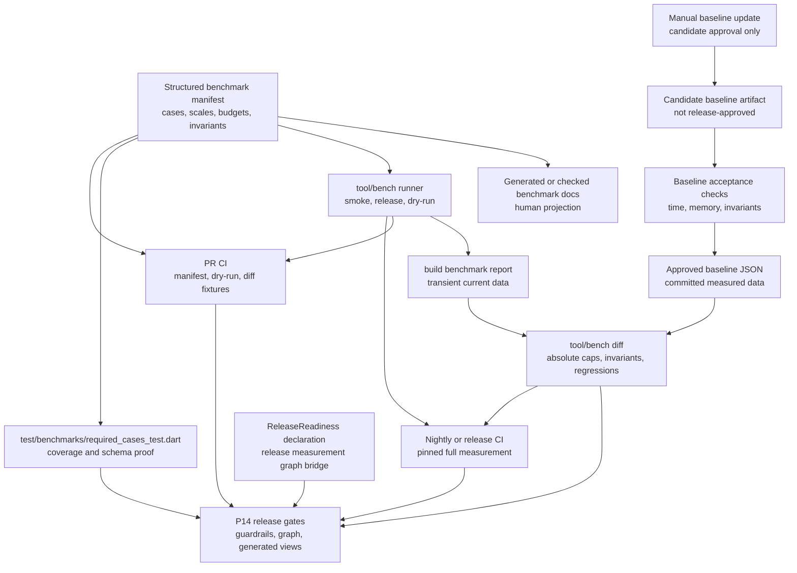
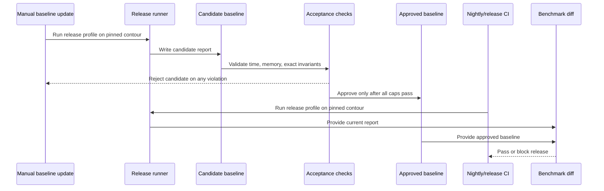
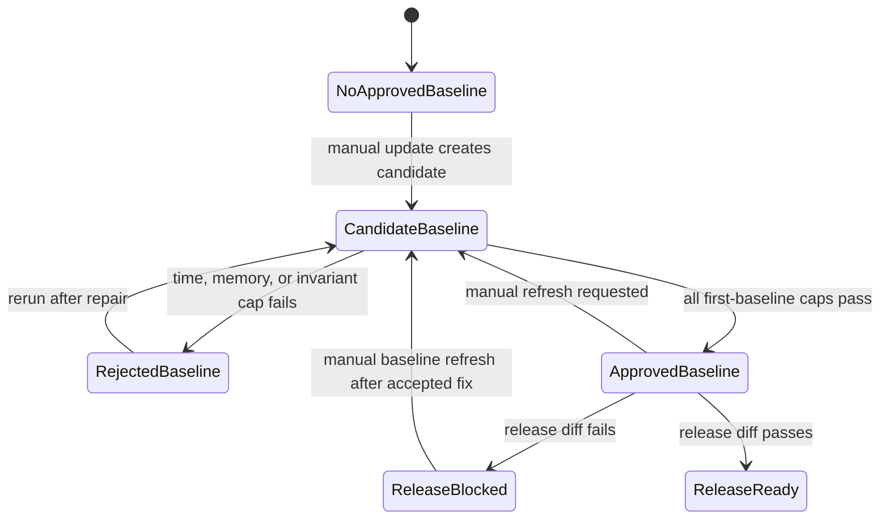

# Design: P14 Release Readiness Benchmarks

---
date: 2026-06-05
designer: Codex
commit: 6703886f
branch: new-architecture
design_question: "Design P14 release-readiness benchmark architecture with concrete benchmark cases, numeric gates, external calibration, and repository-backed justification."
---

## Disposition

READY_FOR_CONTRACT

## Product Outcome

P14 release readiness gets an executable benchmark and release-measurement
contract instead of prose-only performance intent. A release cannot be marked
ready unless the current package runs every required benchmark case, compares
the result against approved baselines, enforces concrete time/allocation/count
gates, keeps generated release graph views aligned, and preserves the existing
"no new feature behavior in P14" boundary.

Non-goals: do not add runtime feature behavior, public API, app adapters, legacy
facades, or production benchmark-only hooks. Do not treat a first generated
baseline as release proof unless it also passes the absolute and invariant
gates below.

## Target Contract Classification

- Profile: ANALYZER_RULE
- Obligations: SEAM_MIGRATION

`ANALYZER_RULE` fits because the future work is a release-gating benchmark rule
engine, runner, structural required-cases proof, and architecture graph closure
surface. `SEAM_MIGRATION` applies because legacy benchmark donor tooling must be
adapted into the rebuilt package's current `tool/bench/**` and
`test/benchmarks/**` proof seam instead of being invoked in place.

## Research Inputs

- `docs/history/research/2026-06-05-p14-release-readiness-state.md` - confirms P14 scope,
  missing current-package benchmark proof, existing guardrail/release graph
  surfaces, and legacy donor benchmark policy.
- External calibration source, retrieved 2026-06-05:
  <https://docs.flutter.dev/perf/best-practices> - Flutter documents a 16 ms
  total 60 Hz latency target, an 8 ms build plus 8 ms render split, and an 8 ms
  total target for 120 Hz smoothness.
- External calibration source, retrieved 2026-06-05:
  <https://docs.flutter.dev/perf/metrics> - Flutter recommends monitoring
  average, percentile, and worst frame timing statistics.
- External calibration source, retrieved 2026-06-05:
  <https://pub.dev/packages/benchmark_harness> - Dart's official benchmark
  harness uses a 2 second timing loop by default and warns that comparisons are
  meaningful only for the same benchmark on the same machine and OS.
- External calibration source, retrieved 2026-06-05:
  <https://google.github.io/benchmark/user_guide.html> - repeated benchmark runs
  report mean and standard deviation, JSON output carries run context, and dry
  runs are used to verify benchmark executability.
- External calibration source, retrieved 2026-06-05:
  <https://web.dev/articles/rail> - user-centric guidance targets visible
  response inside 100 ms, input processing inside 50 ms, and animation frame
  production around a 10 ms app budget.
- User CI constraint, supplied 2026-06-05: CI must not run DCM because DCM will
  not work in that environment.

External sources calibrate numeric bands only. Repository files remain the
source of truth for which cases are required, where proof belongs, and what P14
is allowed to change.

## Repository Evidence

`Evidence Consequence Link`: each fact below states the decision, boundary, unit,
proof surface, or review consequence it supports.

- `docs/implementation/p14_benchmarks_diagrams_and_release_readiness.md:5` -
  P14 closes implementation by proving guardrails, diagrams, benchmarks, donor
  use, phase alignment, and final release gates match target architecture ->
  supports making benchmark/release proof executable and release-blocking.
- `docs/implementation/p14_benchmarks_diagrams_and_release_readiness.md:14` -
  P14 build scope includes benchmark baselines -> supports committed approved
  baseline artifacts as future execution scope.
- `docs/implementation/p14_benchmarks_diagrams_and_release_readiness.md:15` -
  P14 build scope includes a benchmark diff tool -> supports current-package
  runner and diff tooling as owned implementation scope.
- `docs/implementation/p14_benchmarks_diagrams_and_release_readiness.md:24` -
  P14 depends on P0-P13 implementation phases being complete and green ->
  supports rejecting benchmark-driven feature work in P14.
- `docs/implementation/p14_benchmarks_diagrams_and_release_readiness.md:101` -
  P14 satisfies benchmark policy and required cases from section 24 -> supports
  using the benchmark section as the semantic source input.
- `docs/implementation/p14_benchmarks_diagrams_and_release_readiness.md:107` -
  P14 names `test/benchmarks/required_cases_test.dart` as benchmark proof ->
  supports required-cases test placement.
- `docs/implementation/p14_benchmarks_diagrams_and_release_readiness.md:119` -
  P14 exit gate includes benchmarks passing -> supports blocking diff failures.
- `docs/implementation/p14_benchmarks_diagrams_and_release_readiness.md:137` -
  P14 must not introduce new feature behavior -> supports excluding public API,
  runtime features, app adapters, and benchmark-only production hooks.
- `docs/verification/benchmarks.md:29` - benchmark policy requires no
  unapproved legacy regression, own baselines for new-only paths, avg/P95/max
  hot input gates, candidate-bounded paint paths, and RSS/allocation budgets ->
  supports the selected metric families and baseline/diff rule.
- `docs/verification/benchmarks.md:37` - required benchmark cases table begins ->
  supports keeping every listed case as a required release proof case.
- `docs/verification/benchmarks.md:41` - edit benchmark cases include
  `edit.add_element`, `edit.update_visual`, and `edit.update_transform` at
  1k/10k/50k/100k nodes -> supports incremental edit budget coverage.
- `docs/verification/benchmarks.md:44` - selected move and camera edit cases are
  required -> supports hot interaction/camera budget coverage.
- `docs/verification/benchmarks.md:47` - selected move preview benchmark is
  required -> supports preview latency gates.
- `docs/verification/benchmarks.md:54` - main/overlay frame capture cases are
  required -> supports frame-budget absolute caps.
- `docs/verification/benchmarks.md:57` - resource resolver and dirty cases are
  required -> supports resolver call budget and repaint count proof.
- `docs/verification/benchmarks.md:61` - projection, codec, load, spatial,
  runtime dispose, and disabled diagnostics cases are required through line 68
  -> supports cross-owner P0-P13 release benchmark coverage.
- `docs/_registry/sections.yaml:1205` - section 24 is the registered benchmark
  section -> supports keeping benchmark semantics in repository source-of-truth
  documentation/registry, not in chat.
- `docs/_registry/sections.yaml:1223` - section 24 registers
  `test.benchmarks.required_cases` -> supports future registry-to-test
  consistency proof.
- `docs/_registry/sections.yaml:1226` - the benchmark section says not to assume
  no unapproved legacy feature path regression -> supports explicit legacy
  equivalence comparison where a donor-equivalent path exists.
- `docs/verification/release_gates.md:170` - release is blocked unless all
  listed statements are true -> supports release-blocking benchmark status.
- `docs/verification/release_gates.md:172` - selected-phase architecture graph
  closure command is part of release gates -> supports P14 graph closure in the
  future contract.
- `docs/verification/release_gates.md:228` - release gates require all required
  diagrams to exist and match owners -> supports generated view closure when
  release measurement is touched.
- `docs/verification/release_gates.md:231` - full guardrail runner must be green
  -> supports wiring benchmark readiness into the existing release proof flow
  rather than a separate ad hoc checklist.
- `docs/verification/release_gates.md:234` - benchmark gates must pass ->
  supports diff failure as a release blocker.
- `docs/verification/release_gates.md:235` - app adapter names must not be
  present in the engine package -> supports excluding app adapters from the P14
  benchmark design.
- `.github/workflows/root_package.yml:3` - the current root package workflow runs
  on pull requests and selected branch pushes -> supports separating PR-safe
  benchmark machinery checks from heavier release measurements.
- `.github/workflows/root_package.yml:25` - the current root package workflow
  runs `dart analyze` -> supports adding benchmark manifest/dry-run checks to
  the existing CI quality lane rather than inventing a disconnected local-only
  process.
- `.github/workflows/root_package.yml:28` - the current root package workflow
  runs the guardrail runner -> supports making future benchmark CI wiring part
  of repository-owned release proof.
- `AGENTS.md:47` - repository-local code-change verification includes
  `dart analyze` -> supports keeping analyzer checks in local/CI verification.
- `AGENTS.md:48` - repository-local code-change verification includes
  `dcm analyze .` -> supports treating DCM as a local code-change verification
  requirement that must not be promoted into CI when the CI environment cannot
  run it.
- `test/guardrails/root_ci_target_test.dart:9` - the root CI target test verifies
  repository-owned package checks -> supports adding test coverage for future CI
  benchmark steps.
- `test/guardrails/root_ci_target_test.dart:40` - the root CI target test rejects
  bypass conditions such as `continue-on-error` and job-level `if` -> supports
  requiring benchmark release gates to fail closed in CI.
- `test/guardrails/root_ci_target_test.dart:50` - the root CI target test requires
  full guardrail runner selection without per-id bypass -> supports keeping
  benchmark CI routing centralized and non-bypassable.
- `docs/verification/guardrails.md:110` - guardrails are blocking architecture
  and release rules -> supports treating benchmark gate failures as release
  blockers.
- `docs/verification/guardrails.md:114` - `dart run tool/guardrails/run.dart` is
  the primary project-owned entrypoint -> supports integrating final release
  proof with current guardrail tooling.
- `docs/verification/guardrails.md:120` - a run without arguments executes the
  full blocking guardrail suite -> supports not relying on developers to remember
  individual release proof commands.
- `docs/verification/guardrails.md:157` - runner metadata under
  `tool/guardrails/**` owns executable ids, suite membership, and dispatch ->
  supports keeping guardrail dispatch metadata in tooling while benchmark case
  policy remains in benchmark source of truth.
- `docs/verification/guardrails.md:248` - disabled diagnostics no-allocation
  proof currently covers schema/codec success paths and defers pointer/paint
  hot-path proof until those owners exist -> supports making P14 benchmark
  `diagnostics.disabled_pointer` the owner-observable pointer hot-path proof.
- `docs/verification/tests.md:269` - required tests list
  `test/benchmarks/required_cases_test.dart` -> supports future test placement.
- `docs/verification/tests.md:463` - diagnostics disabled no-allocation current
  test covers only schema/codec subset -> supports P14 benchmark coverage rather
  than overclaiming the existing diagnostics test.
- `docs/architecture/02_package_boundaries.md:178` - target test layout includes
  `test/benchmarks/` -> supports benchmark tests as a cross-cutting proof area.
- `docs/architecture/02_package_boundaries.md:182` - target tool layout includes
  `tool/bench/` -> supports current-package benchmark runner/diff placement.
- `docs/architecture/02_package_boundaries.md:248` - app-adapter compile
  fixtures model external app code and may import only the root public barrel ->
  supports keeping app-consumer proof separate from benchmark tooling.
- `docs/architecture/02_package_boundaries.md:255` - cross-cutting proof areas
  include `test/benchmarks/**` outside production-owner mirrors -> supports
  required-cases tests not belonging to one production owner.
- `docs/tool/check_docs.dart:6` - runtime architecture constraints belong in
  structured registries, generated docs, analyzer/lint rules, Dart tests, or
  benchmarks -> supports a structured benchmark registry/manifest instead of
  free-form Markdown parsing.
- `legacy/iwb_canvas_engine/tool/bench/load_profile_policy.dart:1` - legacy
  benchmark donor required metrics include avg/min/max time and RSS deltas ->
  supports adapting donor metric validation rather than inventing a blank
  runner.
- `legacy/iwb_canvas_engine/tool/bench/load_profile_policy.dart:145` - legacy
  smoke profile allowed 35 percent `avgUs` regression -> supports using 35
  percent only as a bootstrap legacy-equivalence ceiling, not as the whole P14
  release policy.
- `legacy/iwb_canvas_engine/tool/bench/load_profile_policy.dart:170` - legacy
  full profile allowed 35 percent `avgUs` regression -> supports keeping
  equivalent legacy path comparison available in full release profile.
- `legacy/iwb_canvas_engine/tool/bench/run_load_profiles.dart:15` - legacy runner
  invokes a test process and captures result lines -> supports adapting the
  runner shape into the current package.
- `legacy/iwb_canvas_engine/tool/bench/run_load_profiles.dart:64` - legacy runner
  validates collected benchmark cases -> supports a required-cases contract test.
- `legacy/iwb_canvas_engine/tool/bench/run_load_profiles.dart:101` - legacy
  runner writes JSON reports -> supports JSON baseline/current report artifacts.
- `legacy/iwb_canvas_engine/tool/bench/diff_load_profiles.dart:12` - legacy diff
  reads baseline/current JSON -> supports current diff tool input shape.
- `legacy/iwb_canvas_engine/tool/bench/diff_load_profiles.dart:82` - legacy diff
  rejects runtime metadata mismatch -> supports same-machine/profile/runtime
  contour checks.
- `legacy/iwb_canvas_engine/tool/bench/diff_load_profiles.dart:137` - legacy diff
  checks missing required cases -> supports exact required inventory closure.
- `legacy/iwb_canvas_engine/tool/bench/diff_load_profiles.dart:167` - legacy diff
  reports metric regressions -> supports release-blocking diff failures.
- `docs/architecture/architecture_graph.yaml:85` - P14 is declared in the graph
  -> supports selected-phase graph checks.
- `docs/architecture/architecture_graph.yaml:87` - P14 status is `measurement`
  -> supports modeling release readiness as measurement/release scope rather
  than runtime production ownership.
- `docs/architecture/architecture_graph.yaml:498` - graph node
  `release.measurement` exists -> supports a graph-checkable release readiness
  bridge.
- `docs/architecture/architecture_graph.yaml:501` - `release.measurement` owner
  is `release` -> supports a tool/docs release owner, not a production owner.
- `docs/architecture/architecture_graph.yaml:520` - the node expects
  declaration `ReleaseReadiness` -> supports future graph-checkable declaration.
- `tool/architecture_graph/src/phase_closure.dart:21` - release owner path
  prefixes include `tool/` and `docs/verification/` -> supports putting the
  `ReleaseReadiness` declaration under release tooling once graph coverage
  includes that tool path.
- `tool/architecture_graph/src/actual_graph.dart:1212` - actual graph extraction
  expands only configured covered Dart paths -> supports making graph coverage
  updates mandatory when the future contract adds a tool-owned release
  declaration.
- `tool/architecture_graph/src/phase_closure.dart:161` - required/future/
  measurement statuses are required when their phase is active -> supports P14
  measurement closure as a blocking gate.
- `tool/architecture_graph/src/phase_closure.dart:212` - missing required nodes
  become phase closure violations -> supports treating missing
  `ReleaseReadiness` as a blocker.
- `docs/history/research/2026-06-05-p14-release-readiness-state.md:30` - current package does
  not contain `test/benchmarks/required_cases_test.dart` -> supports future work
  to create the benchmark proof.
- `docs/history/research/2026-06-05-p14-release-readiness-state.md:31` - benchmark runner,
  diff tool, and baseline JSON files found in research are under legacy donor
  path -> supports seam migration into current package.
- `docs/history/research/2026-06-05-p14-release-readiness-state.md:41` - observed P14 graph
  check failed with missing `release.measurement` -> supports mandatory graph
  closure work.
- `docs/history/research/2026-06-05-p14-release-readiness-state.md:43` - observed P14
  generated view check reported all five generated graph views stale -> supports
  generated view update/check in the future contract.
- `docs/history/research/2026-06-05-p14-release-readiness-state.md:391` - search did not find
  current-package `test/benchmarks/` or `tool/bench/` -> supports current-package
  benchmark seam creation.

## Design Form Candidates

### Candidate A. Documentation-Only Numeric Benchmark Policy

- Form: update benchmark documentation later with a table of budgets and keep
  release readiness as manual review.
- Why it could work: it is low cost and keeps all numbers visible to humans.
- Gate failures or risks: fails Owner-Level Fix and Verification because P14
  already requires benchmark baselines, a diff tool, and a required benchmark
  test. Release gates can still pass locally by omission if no executable tool
  consumes the numbers.

### Candidate B. Port Legacy Benchmark Runner As-Is

- Form: copy/adapt legacy `tool/bench/run_load_profiles.dart`,
  `diff_load_profiles.dart`, and policy with the legacy 35 percent `avgUs` gate.
- Why it could work: it reuses donor structure, JSON report/diff mechanics, case
  validation, runtime metadata comparison, and existing 35 percent donor gate.
- Gate failures or risks: legacy policy measures debug/runtime donor profiles,
  gates only `avgUs` by 35 percent, lacks required P14 avg/P95/max hot-path
  gates, lacks current package required cases, and cannot prove new-only paths
  or exact count invariants from section 24.

### Candidate C. Structured Benchmark Registry Plus Current-Package Runner And Diff

- Form: create a current-package benchmark seam where a structured benchmark
  manifest owns cases, scales, budget class, required metrics, exact count
  invariants, and profile membership; `tool/bench/**` reads that manifest to run
  and diff reports; `test/benchmarks/required_cases_test.dart` proves every
  section 24 case is covered; approved baseline JSON stores measured values but
  not case definitions; `ReleaseReadiness` becomes a graph-checkable release
  tool declaration.
- Why it could work: it gives benchmarks a single machine-readable source of
  truth with real human and machine consumers, keeps runner/diff in existing
  `tool/bench/` ownership, preserves P14 as measurement/release scope, and lets
  release gates fail on exact missing cases, metrics, invariants, metadata
  mismatch, baseline regression, and absolute budget violations.
- Gate failures or risks: it is more work than a direct donor copy and requires
  a future docs/checker update so the Markdown benchmark table cannot drift from
  the structured manifest.

### Candidate D. Runtime-Embedded Performance Counters And Public Hooks

- Form: add runtime or public API counters specifically for benchmarks and make
  benchmark tests read them directly.
- Why it could work: direct production counters can reduce benchmark harness
  glue for some cases.
- Gate failures or risks: violates the P14 no-feature boundary and risks public
  API churn or production benchmark-only state. Existing tests and guards already
  expose owner-observable facts for many cases; any missing proof seam should be
  an internal contract-named test seam in the owning package area, not a public
  benchmark API.

## Known Future Pressures

| Pressure | Evidence | How the selected form responds | Accepted cost or risk |
|---|---|---|---|
| P14 must close benchmarks without adding feature behavior | `docs/implementation/p14_benchmarks_diagrams_and_release_readiness.md:24`; `docs/implementation/p14_benchmarks_diagrams_and_release_readiness.md:137` | Benchmarks use existing P0-P13 public/internal test seams and production-observable facts; missing feature capability blocks or rephases work instead of adding feature behavior in P14 | Some benchmark cases may need owner-local test support, but not public API or runtime feature semantics |
| Existing benchmark policy is prose-only and current package lacks benchmark files | `docs/history/research/2026-06-05-p14-release-readiness-state.md:30`; `docs/history/research/2026-06-05-p14-release-readiness-state.md:391` | Structured manifest plus runner/diff makes the cases executable and diffable | Future contract must create a new authoritative manifest and generated/checkable docs projection |
| Legacy donor gate is useful but too weak for P14 | `legacy/iwb_canvas_engine/tool/bench/load_profile_policy.dart:145`; `legacy/iwb_canvas_engine/tool/bench/load_profile_policy.dart:170`; `docs/verification/benchmarks.md:29` | Keep 35 percent avg legacy-equivalence ceiling only for bootstrap donor comparison; use stricter current-baseline release gates after the first approved baseline | First P14 contract must classify equivalent vs new-only paths carefully |
| Flutter frame budgets are tighter on 120 Hz devices | External Flutter calibration source; `docs/verification/benchmarks.md:32`; `docs/verification/benchmarks.md:54` | Hot input and frame budget classes use 2 ms, 4 ms, 8 ms, and 16 ms absolute caps so the engine does not consume the whole app frame | Some heavy bulk paths use separate bulk budgets because they are not per-frame paths |
| CI and local machines produce noisy timings | External Dart benchmark_harness calibration source; `legacy/iwb_canvas_engine/tool/bench/diff_load_profiles.dart:82` | Diff compares same case/profile/runtime metadata, records machine/runtime context, and requires repeated samples; incompatible runtime contour fails rather than comparing | Cross-machine baseline comparison remains unsupported unless future CI pins runner metadata |
| PR CI must stay fast and deterministic while release CI must prove real performance | `.github/workflows/root_package.yml:3`; `.github/workflows/root_package.yml:25`; `.github/workflows/root_package.yml:28`; `test/guardrails/root_ci_target_test.dart:40`; `docs/verification/release_gates.md:234` | PR CI runs manifest/schema/dry-run/diff-fixture checks only; nightly or release CI runs full release measurements on a pinned runner; baseline update is a separate manual workflow that cannot auto-approve its own output | A future contract must touch CI workflow/test surfaces, but avoids noisy timing failures on ordinary PRs |
| CI cannot depend on DCM availability | User CI constraint supplied 2026-06-05; `AGENTS.md:48`; `.github/workflows/root_package.yml:25`; `.github/workflows/root_package.yml:28` | No future CI lane may run `dcm analyze` or `dcm calculate-metrics`; DCM remains local verification when available, while CI uses `dart analyze`, tests, guardrails, docs checks, graph checks, and benchmark tooling | CI will not catch DCM-only findings; local implementation/review must still report DCM when run outside CI |
| Release measurement graph node currently cannot close | `docs/history/research/2026-06-05-p14-release-readiness-state.md:41`; `docs/architecture/architecture_graph.yaml:520`; `tool/architecture_graph/src/actual_graph.dart:1212` | Future contract must add a graph-checkable `ReleaseReadiness` declaration under release tooling and update graph coverage so extraction sees it | Touching architecture graph coverage requires generated view updates and graph tests |
| Generated graph views are stale for P14 | `docs/history/research/2026-06-05-p14-release-readiness-state.md:43`; `docs/verification/release_gates.md:228` | P14 contract includes generated view regeneration/check after the release measurement bridge exists | Generated docs diff can be large but is mechanically checked |
| Example parity work may still be pending around P14 | `PLAN.md:74`; `docs/verification/release_gates.md:235` | Benchmark/release readiness remains package-level; it does not introduce app adapters and does not wait on example behavior unless a future contract claims example release closure | P14 readiness cannot be claimed for example parity unless that future step is separately complete |

## Selected Form

Choose Candidate C: structured benchmark registry plus current-package runner
and diff.

The benchmark manifest becomes the single source of truth for case ids, scales,
metric contracts, budget classes, exact count invariants, and profile
membership. Future docs are generated from or checked against the manifest so
the human benchmark table cannot drift from the machine-consumed rule set.
Approved baseline JSON stores measured values and run context only; it is not
allowed to define cases, thresholds, or required invariants.

The runner and diff live under `tool/bench/**` because package boundaries already
reserve that tool area. Required-cases proof lives under
`test/benchmarks/required_cases_test.dart` because section 24 and tests docs
already name that path. Release graph closure is satisfied by a small
tool-owned `ReleaseReadiness` declaration after graph coverage includes the
release tooling path; this keeps P14 as release measurement scope instead of a
runtime production owner.

### Numeric Benchmark Policy

Future implementation must encode these budget classes in the structured
manifest and must map every required section 24 case to one class. All times are
microseconds.

| Budget class | Blocking absolute caps | Regression caps after first approved baseline | Applies to |
|---|---|---|---|
| `hot_input` | avg <= 500, P95 <= 2000, max <= 4000 | avg/P95 <= +15 percent, max <= +30 percent | drag/preview/dispose/camera hot paths that run during interaction frames |
| `incremental_edit` | avg <= 1000, P95 <= 4000, max <= 8000 | avg/P95 <= +15 percent, max <= +30 percent | committed single-operation edits expected to scale by touched/candidate work, not total scene clone |
| `frame_capture` | avg <= 4000, P95 <= 8000, max <= 16000 | avg/P95 <= +15 percent, max <= +30 percent | main, overlay, and candidate paint capture paths |
| `query_read` | avg <= 500, P95 <= 2000, max <= 4000 | avg/P95 <= +15 percent, max <= +30 percent | point query, cache-hit projection read, resolver cache-hit read |
| `resource_budgeted` | avg <= 1000, P95 <= 4000, max <= 8000; cold sync resolver calls <= 128 | avg/P95 <= +15 percent, max <= +30 percent; resolver/repaint counts exact or bounded by manifest | resource resolve, dirty, and mark-all-dirty cases |
| `bulk_io` | 1k P95 <= 100000, 10k P95 <= 500000, 50k P95 <= 1000000, 100k P95 <= 2000000; failure mutation count = 0 | avg/P95 <= +15 percent, max <= +30 percent | load document and codec cases that are not per-frame hot paths |
| `exact_invariant` | required count equals manifest value, including 0 where specified | no positive drift allowed unless manifest is intentionally changed | no diagnostic records, no action events, no resolver calls, no ordinary plan invalidation, no partial erase, no saveLayer/offscreen layer |
| `allocation_budget` | zero-allocation cases must allocate 0 records/bytes; non-zero cases must pass the first-baseline memory caps below before any baseline can be approved | allocation/RSS <= +10 percent or <= baseline + 64 KiB allocation / +1 MiB RSS, whichever is larger, unless the manifest marks an exact zero invariant | allocation bytes and RSS delta metrics |

First-baseline memory caps:

| Memory scope | First approved baseline cap | Applies to |
|---|---|---|
| `zero_allocation` | allocation records = 0, allocation bytes = 0, RSS delta = 0 where RSS is part of the case output | `diagnostics.disabled_pointer` and any manifest case that claims a disabled hot path makes no diagnostic/allocation record |
| `hot_or_query` | allocation bytes <= 64 KiB and RSS delta <= 1 MiB per measured operation | `hot_input` and `query_read` cases that run inside interaction or frame-adjacent paths |
| `incremental_owner_update` | allocation bytes <= 256 KiB + 512 bytes per touched id/candidate/selected id reported by the case; RSS delta <= 2 MiB | `incremental_edit`, touched spatial update, and selection/camera edit cases with bounded touched work |
| `frame_or_resource` | allocation bytes <= 512 KiB + 128 bytes per paint candidate/resource/resolver call reported by the case; RSS delta <= 4 MiB | frame capture, paint candidates, resource resolve, and resource dirty cases |
| `bulk_document_1k_10k_50k_100k` | allocation bytes <= 8/24/120/240 MiB and RSS delta <= 16/32/160/320 MiB for 1k/10k/50k/100k document-scale inputs | `load_document.success`, `load_document.failure`, and document-scale projection reads when the operation materializes document-shaped data |
| `codec_fixture_bulk` | allocation bytes <= max(4 MiB, 4x encoded input bytes) and RSS delta <= max(16 MiB, 2x encoded input bytes) | `codec.decode_v1` fixtures whose work scales by fixture byte size instead of node count |

Bootstrap baseline rule:

- Equivalent legacy feature paths must pass the legacy donor `avgUs` ceiling of
  current <= legacy * 1.35 while also passing the absolute caps and exact
  invariants above.
- New-only feature paths receive their own approved baseline only after passing
  the absolute caps, first-baseline memory caps, and exact invariants above.
- A first baseline that merely records the current state without passing the
  time caps, memory caps, and exact invariant caps is not release-ready; it must
  be marked rejected or advisory.

Run profiles:

- `smoke`: smallest required scale per case, dense special cases preserved, one
  warmup, three measured repetitions, minimum 500 ms measured time per operation
  or at least 100 samples, JSON report only. It is for developer feedback and
  required-cases executability.
- `release`: all required scales from section 24, one warmup, five measured
  repetitions, minimum 2000 ms measured time per operation where the operation
  is microbenchmarkable, JSON report plus diff against approved baseline. It is
  release-blocking.
- `dry_run`: one iteration and one repetition of every manifest case/scale,
  validates setup, output shape, metrics, and exact invariant names without
  making timing claims.

CI policy:

- PR CI must prove benchmark machinery, not timing performance. It runs manifest
  schema checks, required-cases coverage, runner `dry_run`, deterministic diff
  fixture tests, docs projection checks, and the existing root guardrail/analyze
  lane. These checks are required to fail closed: no `continue-on-error`, no
  path that skips benchmark machinery after benchmark files exist, and root CI
  structure is protected by an updated root CI target test. PR CI must not run
  DCM commands.
- Nightly or release CI runs the full `release` profile on a pinned runner
  contour, records runtime/machine metadata, diffs against the approved baseline,
  and blocks release on time, memory, exact-invariant, metadata, graph, generated
  view, or guardrail failures. Nightly and release CI must not run DCM commands.
- Baseline update is a separate manual workflow or manually invoked command. It
  may write a candidate baseline artifact only after the first-baseline time,
  memory, and invariant caps pass; ordinary PR and release workflows must never
  rewrite approved baselines. Baseline update CI must not run DCM commands.

Required case mapping:

| Case pattern | Budget classes |
|---|---|
| `edit.add_element`, `edit.update_visual`, `edit.update_transform`, `edit.add_line` | `incremental_edit`, `allocation_budget` |
| `edit.move_selection`, `edit.set_camera_offset` | `hot_input`, `incremental_edit`, exact count invariants from section 24 |
| `input.selected_move_preview`, `input.marquee_preview`, `input.draw_preview`, `input.line_preview`, `input.eraser_preview` | `hot_input`, exact repaint/candidate/check-count invariants |
| `frame.selected_move_preview_cached_ordinary_plan` | `frame_capture`, `query_read`, exact plan hit/supplement/no-previewDelta invariants |
| `input.eraser_budget_exceeded` | `frame_capture`, `exact_invariant` for budget exceeded and partial erase count = 0 |
| `frame.main_capture`, `frame.overlay_capture`, `frame.paint_candidates` | `frame_capture`, `allocation_budget`, exact saveLayer/offscreen-layer invariants |
| `resources.resolve_sync`, `resources.resolve_sync_cold_budget`, `resources.mark_dirty`, `resources.mark_all_dirty` | `resource_budgeted`, exact resolver/repaint/cache invalidation counts |
| `projection.read_document`, `spatial.query_point`, `spatial.touched_update` | `query_read` for hot/cache-hit operations, `incremental_edit` for touched update, exact fallback/tile/rebuilt counts |
| `codec.decode_v1`, `load_document.success`, `load_document.failure` | `bulk_io`, `allocation_budget`, exact error payload or committed mutation count invariants |
| `runtime.dispose_during_gesture`, `diagnostics.disabled_pointer` | `hot_input`, `exact_invariant`, zero allocation where required |

## Decision Trace

Preserve `Decision Chain Of Custody`: source inputs and locked decisions must
map to the future contract field, execution unit, or proof surface that carries
them forward.

| Decision ID | Decision | Evidence | Contract handoff target |
|---|---|---|---|
| D1 | Benchmark cases, scales, budget classes, metric keys, exact invariants, and profile membership are owned by a structured benchmark manifest, with docs generated from or checked against it | `docs/tool/check_docs.dart:6`; `docs/verification/benchmarks.md:37`; `docs/_registry/sections.yaml:1223` | `Boundaries.Source of Truth`; source-of-truth docs/registry unit; required-cases proof |
| D2 | Current-package runner/diff lives under `tool/bench/**`; legacy tooling is adapted, not invoked in place | `docs/architecture/02_package_boundaries.md:182`; `docs/history/research/2026-06-05-p14-release-readiness-state.md:31`; `legacy/iwb_canvas_engine/tool/bench/run_load_profiles.dart:15` | `Boundaries.Owner`; `Unit` for runner/diff seam migration |
| D3 | Required benchmark proof lives under `test/benchmarks/required_cases_test.dart` and verifies manifest coverage, output schema, dry-run executability, required metrics, and required exact invariant names | `docs/implementation/p14_benchmarks_diagrams_and_release_readiness.md:107`; `docs/verification/tests.md:269`; `docs/architecture/02_package_boundaries.md:255` | `Unit` for required-cases proof; proof surface |
| D4 | Numeric gates are two-layered: time caps, first-baseline memory caps, and exact invariants for first-baseline acceptance; current-baseline regression gates for later release diffs | `docs/verification/benchmarks.md:29`; `legacy/iwb_canvas_engine/tool/bench/load_profile_policy.dart:145`; external Flutter/Dart calibration sources | `Verification Strategy`; diff tool unit; baseline acceptance proof |
| D5 | Legacy 35 percent `avgUs` is only a bootstrap equivalent-path ceiling; normal approved-baseline regression caps are +15 percent avg/P95, +30 percent max, and +10 percent allocation/RSS | `legacy/iwb_canvas_engine/tool/bench/load_profile_policy.dart:145`; `legacy/iwb_canvas_engine/tool/bench/load_profile_policy.dart:170`; `docs/verification/benchmarks.md:29` | diff policy fields; equivalent-path classification proof |
| D6 | `ReleaseReadiness` is a graph-checkable release tooling declaration, not public API or runtime production code | `docs/architecture/architecture_graph.yaml:498`; `docs/architecture/architecture_graph.yaml:501`; `docs/architecture/architecture_graph.yaml:520`; `tool/architecture_graph/src/phase_closure.dart:21` | architecture graph/source-of-truth update unit; P14 graph proof |
| D7 | P14 benchmark work must not add feature behavior, public API, app adapters, or benchmark-only production hooks | `docs/implementation/p14_benchmarks_diagrams_and_release_readiness.md:137`; `docs/verification/release_gates.md:235`; `docs/architecture/02_package_boundaries.md:248` | `Scope.Excluded`; public API compatibility proof; structural scans |
| D8 | Baseline updates are explicit write operations; release checks read baselines and fail on violations, never silently rewriting approved baselines | `legacy/iwb_canvas_engine/tool/bench/diff_load_profiles.dart:12`; `legacy/iwb_canvas_engine/tool/bench/diff_load_profiles.dart:167`; `docs/verification/release_gates.md:234` | all-or-nothing boundary; runner/diff unit; proof surface |
| D9 | P14 graph and generated views must be checked after the release measurement bridge and graph coverage updates | `docs/history/research/2026-06-05-p14-release-readiness-state.md:41`; `docs/history/research/2026-06-05-p14-release-readiness-state.md:43`; `docs/verification/release_gates.md:228` | architecture graph proof surfaces; generated view check |
| D10 | CI is split by purpose and excludes DCM: PR CI proves benchmark machinery deterministically, nightly/release CI proves measured performance on a pinned runner, and baseline update is manual and fail-closed | `.github/workflows/root_package.yml:3`; `.github/workflows/root_package.yml:28`; `test/guardrails/root_ci_target_test.dart:40`; `docs/verification/release_gates.md:234`; user CI constraint supplied 2026-06-05 | CI workflow unit; root CI structural proof; release benchmark workflow proof |

## Outcome-Proof Fit

| Claim | Direct outcome | Proxy risk | Required proof surface or strategy |
|---|---|---|---|
| Every required benchmark case is executable | Dry-run and release profiles enumerate every manifest case/scale and produce valid metric/invariant records | A Markdown table or hand-maintained list could include cases that the runner never executes | `test/benchmarks/required_cases_test.dart` plus runner dry-run JSON validation |
| Benchmark numbers are concrete release gates, not advisory text | Diff exits non-zero when absolute caps, exact invariants, baseline regression caps, or runtime metadata compatibility fail | A generated report could contain numbers while release still succeeds | focused diff tool tests and `dart run tool/bench/diff.dart ...` release proof |
| First baseline cannot bless bad current performance | Baseline creation fails or marks rejected when time caps, first-baseline memory caps, or exact invariants fail | Committing a JSON baseline alone could freeze a slow or memory-heavy implementation as "approved" | baseline acceptance test with failing fixture reports for time, memory, and exact-invariant violations |
| Current-baseline regression is caught after bootstrap | Same case/profile/runtime contour compares current report to approved baseline and reports exact failing metric | Comparing across machines or profiles could produce false failures or false greens | metadata mismatch tests and diff fixture tests |
| Hot paths leave frame budget headroom | `hot_input`, `query_read`, and `frame_capture` caps fail before operations consume a 60 Hz frame or the full 120 Hz target | Average-only checks could hide long P95/max stalls | release profile avg/P95/max metrics and percentile fixture tests |
| Count invariants remain exact | Manifest-defined exact invariants fail on any unexpected positive count or missing count | Timing could pass while saveLayer, partial erase, resolver call, mutation, repaint, or diagnostic record behavior regresses | exact-invariant metric validation tests and owner-specific focused tests |
| P14 remains release measurement scope | `ReleaseReadiness` closes graph node from release tooling and production/public API structural scans stay clean | A production class or public API addition named for release readiness could close graph while changing runtime architecture | P14 graph check, public export tests, no-app-adapter/no-legacy scans |
| Docs and machine policy do not drift | Benchmark docs/table are generated from or checked against the structured manifest | Runner policy and docs could disagree silently | docs sync/check unit plus semantic manifest-vs-doc test |
| CI catches the right class of failure at the right cost | PR CI fails when benchmark machinery, manifest, docs projection, dry-run, or diff logic breaks; nightly/release CI fails when measured performance regresses; no CI lane invokes DCM | Full noisy timing on every PR could create false failures, PR-only dry-run could let release performance regress, and DCM in CI could fail for environment reasons unrelated to product readiness | root workflow tests for PR machinery, pinned nightly/release benchmark workflow, manual baseline-update proof, and CI structural tests rejecting DCM commands |

## Hard Gate Check

| Gate | Result | Evidence |
|---|---|---|
| Owner-Level Fix | pass | Selected form fixes the missing shared benchmark/release proof seam, not one downstream call site (`docs/implementation/p14_benchmarks_diagrams_and_release_readiness.md:14`, `docs/history/research/2026-06-05-p14-release-readiness-state.md:30`). |
| Ownership | pass | Benchmark manifest owns cases/policy; `tool/bench/**` owns runner/diff; `test/benchmarks/**` owns proof; release graph owns `ReleaseReadiness` (`docs/architecture/02_package_boundaries.md:178`, `docs/architecture/02_package_boundaries.md:182`, `docs/architecture/architecture_graph.yaml:501`). |
| Source-Of-Truth Singularity | pass | Structured manifest is the policy source; docs are generated/checked projections; baseline JSON stores measured values only; diff reads but does not define policy (`docs/tool/check_docs.dart:6`, `legacy/iwb_canvas_engine/tool/bench/diff_load_profiles.dart:12`). |
| Boundary-Owned Policy | pass | Numeric gates and exact invariants live at the benchmark manifest/diff boundary; runtime owners expose only existing owner-observable behavior or contract-named test seams (`docs/verification/benchmarks.md:29`, `docs/implementation/p14_benchmarks_diagrams_and_release_readiness.md:137`). |
| Negative Proof And Fixture Quarantine | pass | Negative proof uses test/diff fixtures under `test/benchmarks/**` and `tool/bench/**`; fixture-only case ids or fake metrics must not enter production public API or durable runtime schemas (`docs/architecture/02_package_boundaries.md:255`, `docs/verification/release_gates.md:235`). |
| Dependency direction | pass | Production `lib/**` does not depend on `tool/**`; benchmark tooling observes package behavior and reports JSON (`docs/architecture/02_package_boundaries.md:274`, `legacy/iwb_canvas_engine/tool/bench/run_load_profiles.dart:15`). |
| State/data | pass | Committed state: benchmark manifest and approved baselines. Derived state: generated docs/table and generated graph views. Cached/transient state: current benchmark report and diff report. Mutable state: explicit baseline update command only. |
| Sequenced Migration And Retirement | pass | Successor seam is current `tool/bench/**` plus `test/benchmarks/**`; legacy donor is source input only. Consumer order: manifest, runner, report schema, diff, required-cases tests, docs/checks, release graph, guardrail/release commands. Retirement gate: P14 release proof no longer calls legacy benchmark paths. |
| Temporal Surface Closure | not applicable | The design does not introduce runtime callbacks, observer delivery, public-state publication, or reentrant mutation windows. Benchmark runner sequencing is CLI-local and has no runtime mutation surface. |
| All-Or-Nothing Failure Boundary | pass | Irreversible point is approving/writing baseline or accepting release. Fallible benchmark execution, metadata comparison, invariant validation, and diff happen before approval. Later report writes are failure-contained generated artifacts. Failure projection is non-zero diff/baseline command plus JSON failure report. |
| Outcome-Proof Fit | pass | Outcome-Proof Fit table maps direct outcomes to proof surfaces and avoids relying on proxy-only Markdown or average-only metrics. |
| Verification | pass | Future proof can be executable through focused tests, diff fixtures, dry-run runner checks, docs checks, CI workflow structural tests that reject DCM commands, guardrail runner, P14 graph check, generated view check, and pinned nightly/release benchmark workflow. |
| Future pressure | pass | Known pressures for frame budgets, CI noise, graph closure, generated views, legacy donor migration, and no-feature P14 boundary are explicitly addressed. |

## Lock-Required Facts

- Owner: release benchmark readiness.
- Owning layer/module/document family: structured benchmark manifest under docs
  registry/source-of-truth area; `tool/bench/**` runner/diff; `test/benchmarks/**`
  proof; architecture graph release measurement node.
- Seam: manifest -> runner -> current report -> approved baseline -> diff report
  -> release gate; graph seam is `ReleaseReadiness` under release tooling plus
  selected-phase graph closure.
- Dependency/import direction: production code does not import benchmark tooling;
  benchmark tooling may import public/internal test support only through normal
  test/tool boundaries; docs/check tools read structured source-of-truth inputs.
- State/data ownership: committed manifest and approved baselines are repo data;
  generated docs and graph views are derived; current/diff reports under `build/`
  are transient; baseline writes require an explicit command.
- Entry boundaries: `dart run tool/bench/run.dart --profile=smoke|release|dry-run`;
  `dart run tool/bench/diff.dart --profile=release --baseline=... --current=...`;
  `test/benchmarks/required_cases_test.dart`; PR CI benchmark machinery checks;
  nightly/release benchmark workflow; manual baseline-update workflow; P14
  release/graph commands.
- Exit boundaries: JSON benchmark report, JSON diff report, non-zero exit on
  violation, docs/generated-view diff, P14 graph closure result.
- File placement basis: `docs/architecture/02_package_boundaries.md:178` for
  `test/benchmarks/**`, `docs/architecture/02_package_boundaries.md:182` for
  `tool/bench/**`, `docs/tool/check_docs.dart:6` for structured docs/registry
  ownership.
- Execution order constraints: manifest first, runner schema second, benchmark
  cases third, diff/baseline fourth, docs/check projection fifth, graph release
  bridge sixth, release/guardrail wiring last.
- `Temporal Surface Closure` invariant, synchronous callback surfaces, guard/boundary owner, public observation order, and expected rejection/no-mutation signal:
  not applicable to runtime behavior. CLI sequencing is manifest/read/report/diff
  only; no public runtime mutation window is introduced.
- `All-Or-Nothing Failure Boundary` irreversible point, fallible-before-irreversible work, later infallible/failure-contained/accepted work, failure projection, and proof surface:
  baseline approval and release acceptance are irreversible points. Benchmark
  execution, output validation, metadata comparison, exact invariant validation,
  time cap validation, first-baseline memory cap validation,
  legacy-equivalence comparison, and baseline regression comparison all run
  before that point. Report writes are failure-contained.
  Failure projection is non-zero command exit plus JSON failure report; proof is
  diff fixture tests and release command checks.
- Rejected alternatives: documentation-only numbers; direct legacy runner copy;
  public/runtime benchmark hooks.
- Verification strategy: focused tool tests for manifest/report/diff; required
  cases test; dry-run and release profile smoke; docs sync/check; guardrail full
  suite; PR CI workflow structural tests that reject DCM commands; pinned
  nightly/release benchmark workflow; architecture graph P14 check and generated
  view check.

## Diagram Need Assessment

| Design question | Needed? | Diagram kind | Reason |
|---|---:|---|---|
| Does the design change ownership, layer, package, or component boundaries? | yes | data_flow | The design adds a benchmark source-of-truth owner, runner/diff owner, proof owner, and release graph bridge. |
| Does it change data flow, state ownership, cache ownership, resource movement, or lifecycle movement? | yes | data_flow | The manifest, generated docs, baseline, current report, and diff report have different ownership and mutability. |
| Does it depend on call order, lifecycle order, sync/async ordering, failure ordering, or migration order? | yes | sequence | Baseline approval and release acceptance must happen only after fallible measurement/diff checks. A sequence diagram below records that order. |
| Does it introduce or alter observer/listener/callback delivery, guard windows, public-state publication, or reentrancy-sensitive ordering? | no | none | No runtime callback/public-state behavior changes are introduced. |
| Does it introduce or alter modes, statuses, terminal states, sessions, or transition rules? | yes | state | Benchmark profiles and baseline acceptance states affect release readiness; a state diagram below records candidate, rejected, approved, blocked, and ready states. |
| Does it create, replace, migrate, or retire a shared seam under `Sequenced Migration And Retirement`? | yes | data_flow | Legacy benchmark donor seam is replaced by current-package benchmark tooling. |
| Does it change public API consumer flow, payload shape, or compatibility behavior? | no | none | Public API is explicitly excluded. |
| Does it introduce or change analyzer, guardrail, or structural-recognition pipeline behavior? | yes | data_flow | The release benchmark rule engine and graph closure surfaces are structural release proof. |

## Provisional Diagrams

## Source-Of-Truth Impact

`Source-Of-Truth Singularity`: durable meaning must have one owning source of
truth and a real human or machine consumer. Name cache/performance duplication
only when the invariant and proof strategy are explicit.

Future Change Contract must update or create these source-of-truth surfaces:

- Structured benchmark manifest under the docs/registry/source-of-truth family.
  It owns benchmark case ids, scales, metrics, exact invariants, budget classes,
  profile membership, and equivalent-legacy classification. It has machine
  consumers (`tool/bench/**`, required-cases tests, docs checks) and human
  projection (`docs/verification/benchmarks.md`).
- `docs/verification/benchmarks.md` must become generated from or structurally
  checked against the manifest. It must not remain an independent copy of case
  or threshold truth.
- `docs/_registry/sections.yaml` may need to point section 24 to the manifest or
  generated/check path if the existing registry shape cannot express benchmark
  cases directly.
- `tool/bench/**` owns runner/diff implementation and report schema.
- Approved baseline JSON files own measured reference values and run context
  only. They do not define cases, thresholds, or invariants.
- `docs/architecture/architecture_graph.yaml` must be updated if graph coverage
  currently excludes the tool path needed for `ReleaseReadiness`; generated graph
  views must be regenerated for P14.
- `docs/verification/release_gates.md` and guardrail/release runner docs may need
  a source-of-truth update only to route the benchmark gate through the final
  proof command. They must not duplicate the numeric budget table.
- `.github/workflows/root_package.yml` and its structural tests must be updated
  when benchmark machinery joins PR CI. A future nightly/release benchmark
  workflow must name the pinned runner/runtime contour and must not duplicate
  manifest policy.

## Verification Impact

Future Change Contract should use these proof surfaces:

- Manifest schema tests: valid case ids, profile memberships, required metrics,
  exact invariant declarations, budget class mapping, equivalent-legacy flags,
  and no duplicate case/scale entries.
- Required-cases test at `test/benchmarks/required_cases_test.dart`: every case
  listed in section 24 or the manifest is executable in dry-run, emits required
  metrics, and emits named invariants.
- Runner tests: dry-run validates setup without timing claims; smoke/release
  profile selection uses the manifest; runtime contour metadata is recorded.
- Diff tests: failures for missing cases, missing metrics, metadata mismatch,
  time cap violation, first-baseline memory cap violation, exact invariant
  violation, bootstrap legacy ceiling violation, baseline regression violation,
  and rejected first baseline.
- Documentation checks: benchmark docs projection matches manifest; generated
  docs sync is clean.
- Release checks: `dart run tool/guardrails/run.dart`, benchmark release diff,
  `dart run tool/architecture_graph/check.dart --phase P14`, and
  `dart run tool/architecture_graph/generate_views.dart --phase P14 --check`.
- CI checks: PR CI runs manifest/schema, required-cases dry-run, deterministic
  diff fixture tests, docs projection checks, analyze, and guardrails; nightly or
  release CI runs full release measurements and benchmark diff on a pinned runner;
  manual baseline-update workflow cannot auto-approve or auto-commit approved
  baseline files. CI workflow structural tests must reject `dcm analyze` and
  `dcm calculate-metrics` commands in CI workflows.
- Compatibility scans: no public API export changes, no legacy imports, no
  `AppCanvasPort`, `LegacyEngineAdapter`, or `NextEngineAdapter` in package
  source.

## Verification Strategy

The future contract should sequence proof from cheap structural checks to
expensive release measurement:

1. Prove manifest schema and source-of-truth projection first.
2. Prove runner dry-run coverage without timing claims.
3. Prove diff behavior using deterministic fixture JSON.
4. Wire PR CI to run only deterministic benchmark machinery checks.
5. Run smoke profile for local sanity.
6. Generate or validate release baseline through the manual baseline-update path
   on the pinned release runtime contour.
7. Run release profile and diff against approved baseline in nightly or release
   CI only.
8. Run guardrail and P14 architecture graph/generated-view checks.

Timing proof must never compare different benchmark names, profiles, runtime
modes, operating systems, SDK/runtime versions, or machine contours without an
explicit future contract changing the policy. Metadata mismatch fails before any
numeric comparison.

CI proof must keep two lanes separate. The PR lane proves that benchmark policy,
runner wiring, report shape, docs projection, and diff behavior are intact. The
nightly/release lane proves measured performance. The baseline-update lane is
manual and cannot be the same job that approves release readiness. No CI lane
may run DCM; DCM remains local verification outside CI when available.

## Change Contract Handoff

- Required profile: ANALYZER_RULE
- Required obligations: SEAM_MIGRATION
- Decision IDs / Decision Trace rows to preserve: D1 through D10.
- Evidence to cite:
  - `docs/implementation/p14_benchmarks_diagrams_and_release_readiness.md:14`
  - `docs/implementation/p14_benchmarks_diagrams_and_release_readiness.md:15`
  - `docs/implementation/p14_benchmarks_diagrams_and_release_readiness.md:107`
  - `docs/implementation/p14_benchmarks_diagrams_and_release_readiness.md:137`
  - `docs/verification/benchmarks.md:29`
  - `docs/verification/benchmarks.md:37`
  - `docs/verification/release_gates.md:234`
  - `.github/workflows/root_package.yml:3`
  - `.github/workflows/root_package.yml:28`
  - `test/guardrails/root_ci_target_test.dart:40`
  - `AGENTS.md:48`
  - `docs/tool/check_docs.dart:6`
  - `docs/architecture/02_package_boundaries.md:178`
  - `docs/architecture/02_package_boundaries.md:182`
  - `docs/architecture/architecture_graph.yaml:520`
  - `tool/architecture_graph/src/actual_graph.dart:1212`
  - `legacy/iwb_canvas_engine/tool/bench/load_profile_policy.dart:145`
  - `docs/history/research/2026-06-05-p14-release-readiness-state.md:30`
  - `docs/history/research/2026-06-05-p14-release-readiness-state.md:41`
- Contract constraints or sequencing facts:
  - Do not implement production feature behavior or public API changes.
  - Do not invoke legacy benchmark tooling as release proof; adapt the donor
    shape into current `tool/bench/**`.
  - Add structured benchmark source of truth before runner/diff logic.
  - Add deterministic diff fixture tests before trusting measured benchmark
    output.
  - Add PR CI benchmark machinery checks before adding nightly/release measured
    performance gates.
  - Add or update CI structural tests so benchmark checks cannot be bypassed with
    `continue-on-error`, per-path skips, silent baseline rewrites, or DCM
    commands.
  - Keep baseline update manual and separate from ordinary PR and release
    workflows.
  - Add `ReleaseReadiness` graph bridge and graph coverage repair before
    claiming P14 graph closure.
  - Release checks must read approved baselines and fail on violations; they must
    not rewrite baselines.
- Required proof surfaces:
  - manifest schema tests;
  - required-cases dry-run/executability test;
  - runner/diff fixture tests;
  - PR CI benchmark machinery checks and root CI structural tests that reject DCM
    commands;
  - pinned nightly/release benchmark workflow;
  - manual baseline-update workflow proof;
  - smoke and release benchmark commands;
  - docs sync/check;
  - guardrail full suite;
  - P14 architecture graph check and generated graph view check;
  - public API/no-legacy/no-app-adapter structural scans.

## Open Decisions

None. The numeric policy, source-of-truth owner, benchmark seam, baseline
boundary, graph bridge, CI lane split, verification strategy, and no-feature P14
boundary are locked for future Change Contract authoring.
