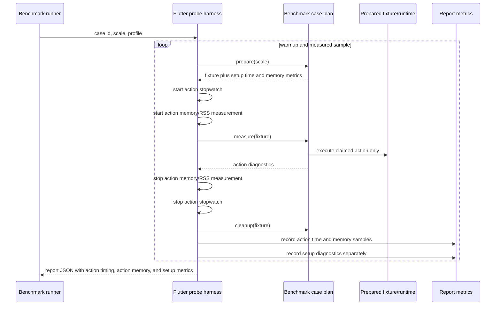

# Design: P14 Benchmark Measurement Boundary

---
date: 2026-06-06
designer: Codex
commit: bcd75e7d
branch: new-architecture
design_question: "Redesign the release benchmark architecture so release benchmarks measure the engine action claimed by each case, rather than mixing large-document setup, runtime construction, cache warmup, and teardown into hot-path timing."
---

## Disposition

READY_FOR_CONTRACT

## Product Outcome

Release benchmark numbers will become interpretable performance evidence. Hot
edit, input, query, and frame cases will report the cost of the user-visible
engine action they name, while document construction, runtime construction,
cache/session setup, setup memory/RSS, and cleanup are reported separately.
Bulk lifecycle cases that intentionally measure materialization, load, codec, or
teardown work remain allowed, but they must say so in the manifest.

Non-goals: do not lower thresholds to make the current report pass; do not hide
engine costs by excluding them from all reports; do not add production
benchmark-only hooks or public engine API. The redesign changes benchmark
tooling, manifest policy, report schema, and tests only.

## Target Contract Classification

- Profile: ANALYZER_RULE
- Obligations: BUG_FIX, SEAM_MIGRATION

`ANALYZER_RULE` fits because the future work adds manifest schema enforcement,
required-case structural proof, report/diff interpretation rules, and probe
boundary checks. `BUG_FIX` applies because current action timing claims include
setup and teardown work. `SEAM_MIGRATION` applies because the current one-shot
probe operation seam must be replaced with an explicit prepare, measure, cleanup
case lifecycle seam.

## Research Inputs

- `docs/history/research/2026-06-06-pixel6-release-benchmark-hotspots.md` - factual map of
  current Pixel 6 release report rows, probe timing scope, setup paths, and
  remaining engine hotspots.
- `docs/history/designs/2026-06-05-p14-release-readiness-benchmarks.md` - prior P14 release
  benchmark design whose manifest, runner, diff, CI, and docs ownership remains
  useful but whose measurement boundary is underspecified.
- `plan/step_55_p14_release_readiness_benchmarks.md` - existing completed step
  contract that locked manifest, runner, diff, CI, graph, and docs placement but
  did not lock per-case measurement boundaries.

No fresh `research-codebase` pass was needed. The supplied hotspot research plus
direct inspection of current manifest, probe, runner, diff, docs, and contract
surfaces was sufficient to close the architecture decision.

## Repository Evidence

`Evidence Consequence Link`: each fact below states the decision, boundary, unit,
proof surface, or review consequence it supports.

- `docs/history/research/2026-06-06-pixel6-release-benchmark-hotspots.md:35` - the saved
  research states that current `avg_us`, `p95_us`, and `max_us` wrap complete
  `_runOperation` execution, including setup and dispose -> supports treating
  the current probe seam as the root cause, not a threshold problem.
- `docs/history/research/2026-06-06-pixel6-release-benchmark-hotspots.md:48` - repeated
  facts include synthetic document generation, `RuntimeRoot` construction,
  initial spatial rebuild, edit full-document projection/copy, load validation,
  and spatial/frame candidate-budget paths -> supports separate action, setup,
  lifecycle, and diagnostic classifications.
- `docs/history/research/2026-06-06-pixel6-release-benchmark-hotspots.md:604` - open
  questions say the existing research has not run alternate probes to separate
  setup cost from steady-state cost -> supports designing the boundary before
  making new numeric claims.
- `test/benchmarks/benchmark_probe_flutter.dart:64` - `_runProbe` performs
  warmups by calling `_measureOperation` before measured samples -> future
  warmup must exercise the same action-only boundary as measured samples.
- `test/benchmarks/benchmark_probe_flutter.dart:73` - measured samples are also
  produced by `_measureOperation` -> the shared sample seam is the correct owner
  for action/setup timing separation.
- `test/benchmarks/benchmark_probe_flutter.dart:82` - top-level timing metrics
  are added from the collected sample list -> future `avg_us`, `p95_us`, and
  `max_us` must be computed from action samples only.
- `test/benchmarks/benchmark_probe_flutter.dart:131` - `_measureOperation`
  starts RSS and stopwatch measurement before awaiting `_runOperation` -> the
  current stopwatch and RSS baseline begin before any case-specific setup inside
  `_runOperation`.
- `test/benchmarks/benchmark_probe_flutter.dart:134` - `_runOperation` returns
  metrics while still under the sample stopwatch -> current case metrics and
  action timing are coupled at the wrong boundary.
- `test/benchmarks/benchmark_probe_flutter.dart:136` - RSS delta is computed
  after `_runOperation` completes -> current `rss_delta_bytes` includes setup,
  action, and cleanup work when a case builds and disposes fixtures inside
  `_runOperation`.
- `test/benchmarks/benchmark_probe_flutter.dart:150` - `_runOperation` is one
  switch over case ids -> the successor seam should be one manifest-owned case
  registry, not scattered local stopwatches.
- `test/benchmarks/benchmark_probe_flutter.dart:197` - `edit.add_element`
  constructs `_runtime(scaleId)` inside the current operation body -> edit setup
  is currently included in action timing.
- `test/benchmarks/benchmark_probe_flutter.dart:209` - `edit.update_visual`
  constructs `_runtime(scaleId)` inside the current operation body -> one-element
  visual update timing currently includes large-document runtime setup.
- `test/benchmarks/benchmark_probe_flutter.dart:257` - `edit.set_camera_offset`
  constructs `_runtime(scaleId)` before setting a camera offset -> a local view
  update currently reports large-document setup as hot-path timing.
- `test/benchmarks/benchmark_probe_flutter.dart:448` - `projection.read_document`
  constructs `_runtime(scaleId)` before timing first read and cache hit -> the
  projection split metrics are narrower than top-level timing.
- `test/benchmarks/benchmark_probe_flutter.dart:466` - `frame.paint_candidates`
  constructs `_runtime(scaleId)` before reading projection and building a frame
  -> frame candidate timing currently includes runtime construction.
- `test/benchmarks/benchmark_probe_flutter.dart:494` - `resources.resolve_sync`
  constructs runtime, image, resolver, and session before resolver/cache passes
  -> resource case setup must be excluded from action timing and action memory.
- `test/benchmarks/benchmark_probe_flutter.dart:650` - `load_document.success`
  constructs an empty runtime and then calls `loadDocument(_document(scaleId))`
  -> this case can remain lifecycle/bulk measurement because loading the
  document is the named operation.
- `test/benchmarks/benchmark_probe_flutter.dart:666` - `spatial.query_point`
  constructs `_runtime(scaleId)` before running `queryHit` -> ordinary spatial
  query timing currently includes fixture/runtime setup.
- `test/benchmarks/benchmark_probe_flutter.dart:734` -
  `runtime.dispose_during_gesture` constructs a runtime, starts a gesture, and
  disposes it -> active gesture setup must be excluded so the action is dispose
  during an active gesture.
- `test/benchmarks/benchmark_probe_flutter.dart:743` -
  `diagnostics.disabled_pointer` constructs a runtime and resets diagnostics
  counters before routing the disabled pointer -> zero allocation must apply to
  the disabled-pointer action boundary, not runtime setup.
- `test/benchmarks/benchmark_probe_flutter.dart:761` - `_document(scaleId)`
  creates the synthetic document and layer element list by scale -> document
  fixture construction must be setup unless the case id names document creation,
  codec, or load.
- `test/benchmarks/benchmark_probe_flutter.dart:784` - `_runtime(scaleId)`
  constructs `RuntimeRoot(initialDocument: _document(scaleId))` -> runtime setup
  combines document fixture creation and runtime construction.
- `test/benchmarks/benchmark_probe_flutter.dart:924` - scale ids map `100k` to
  100000 and `dense_50k` to 50000 -> fixture shape and scale meaning must be
  manifest-owned so dense stress cannot hide behind an ordinary query label.
- `tool/bench/src/benchmark_case_adapters.dart:33` - `runBenchmarkAdapter`
  invokes the probe per manifest case and scale -> the adapter is the process
  boundary that must decode explicit action and setup samples.
- `tool/bench/src/benchmark_case_adapters.dart:83` - the adapter currently
  decodes `elapsedUsSamples` from probe JSON -> report schema migration must
  rename or reinterpret samples as action samples explicitly.
- `tool/bench/src/benchmark_runner.dart:97` - runner validation currently treats
  required metrics and invariants as the all-or-nothing per-case boundary ->
  measurement-boundary validation belongs in the same runner/report path.
- `tool/bench/src/benchmark_runner.dart:112` - `_runCase` copies adapter metrics
  after required metric validation -> setup metrics can be accepted as diagnostic
  fields without becoming hot-path gate inputs.
- `tool/bench/src/benchmark_diff.dart:1086` - regression metrics are currently
  selected by metric keys including `avg_us`, `p95_us`, `max_us`,
  `allocation_bytes`, and `rss_delta_bytes` -> diff must use action metrics for
  hot-path timing and separate setup metrics from those gates.
- `tool/bench/src/benchmark_diff.dart:1102` - absolute time cap metrics are
  inferred from time budget classes -> boundary class and budget class must agree
  so setup-only or lifecycle timing cannot be compared as hot action timing.
- `docs/_registry/benchmarks.yaml:1` - the benchmark manifest has an explicit
  manifest version -> measurement-boundary semantics require a manifest version
  bump.
- `docs/_registry/benchmarks.yaml:2` - the benchmark tool schema version is
  stored in the manifest -> report schema changes require a tool schema version
  bump and old-report rejection.
- `docs/_registry/benchmarks.yaml:115` - case rows currently include id,
  classification, budget classes, memory scope, docs label, required metrics,
  exact invariants, and scales, but no measurement boundary -> the manifest must
  grow a boundary field instead of relying on case-id conventions.
- `docs/_registry/benchmarks.yaml:343` - `projection.read_document` currently
  requires `first_read_us` and `cache_hit_us` but not top-level action timing as
  a declared boundary -> projection must explicitly define its action total and
  split metrics.
- `docs/_registry/benchmarks.yaml:389` - `spatial.query_point` currently has
  normal 1k/10k/50k/100k scales with no fixture-shape declaration -> ordinary
  query and dense stress must be separable in the manifest.
- `docs/verification/benchmarks.md:31` - documentation states the manifest is the
  structured source of truth for cases, scales, metrics, numeric budget classes,
  invariants, and profile membership -> measurement boundary must join that same
  source of truth.
- `docs/verification/benchmarks.md:36` - docs include a benchmark manifest
  fingerprint -> adding boundary fields to the manifest projection makes docs
  drift mechanically visible.
- `docs/tool/check_docs.dart:26` - docs checking owns the benchmark policy source
  note text -> the docs projection text must be updated when the manifest owns
  measurement boundary semantics.
- `docs/tool/check_docs.dart:232` - docs fingerprint projection serializes the
  complete manifest policy used by docs checks -> measurement boundary and
  fixture shape must be included in this projection.
- `tool/bench/src/benchmark_manifest.dart:106` - `BenchmarkCase` currently has
  no field for measured scope, fixture setup, teardown, or fixture shape ->
  manifest parsing must be extended before implementation can enforce the new
  boundary.
- `tool/bench/src/benchmark_manifest.dart:303` - case parsing validates the row
  schema in one owner -> boundary validation belongs in this parser, not in
  ad hoc probe code.
- `test/benchmarks/required_cases_test.dart:13` - required-case proof currently
  runs `dry_run` over every manifest case/scale with required metrics -> this is
  the right suite to fail if a required case lacks explicit boundary data.
- `test/benchmarks/benchmark_manifest_test.dart:92` - manifest tests lock
  per-case policy inventory from the design -> they must lock boundary policy
  and fixture-shape policy after redesign.
- `plan/step_55_p14_release_readiness_benchmarks.md:25` - existing contract
  decision D1 made the manifest owner of cases, scales, budget classes, metric
  keys, invariants, and profile membership -> future contract must repair D1 to
  include measurement boundary as manifest-owned policy.
- `plan/step_55_p14_release_readiness_benchmarks.md:127` - Unit 1 was benchmark
  manifest and docs source of truth -> the repair starts at the source of truth
  before probe code changes.
- `plan/step_55_p14_release_readiness_benchmarks.md:149` - Unit 2 was runner,
  profiles, and required-case dry-run proof -> the probe seam migration belongs
  after manifest schema repair.
- `build/bench/current/pixel6_release.json:1723` - generated Pixel 6 report row
  for `projection.read_document/100k` exists under the current schema -> current
  reports are evidence of the bug but must not remain comparable after schema
  migration.
- `build/bench/current/pixel6_release.json:1736` - generated report shows
  `first_read_us: 94542` and `cache_hit_us: 1` for `projection.read_document/100k`
  -> split metrics reveal action subcosts that top-level timing currently hides.
- `build/bench/current/pixel6_release.json:1740` - same generated row reports
  `avg_us: 1184379` -> top-level timing is not the projection split action and
  supports rejecting old report semantics.
- `build/bench/current/pixel6_release.json:2099` - generated
  `spatial.query_point/100k` row reports four query tiles and fallback count 4097
  -> dense fallback behavior needs a named stress fixture, not an ordinary query
  interpretation.

## Design Form Candidates

### Candidate A. Lower Or Reclassify Existing Numeric Caps

- Form: keep the current `_runOperation` stopwatch and adjust budgets or
  classifications so the current large numbers are no longer failing.
- Why it could work: it is cheap and avoids report schema churn.
- Gate failures or risks: fails Owner-Level Fix and Outcome-Proof Fit. The
  numbers would still mix setup, action, and teardown, so a green release report
  would not prove hot-path engine performance.

### Candidate B. Patch Slow Cases With Local Inner Stopwatches

- Form: keep `_runOperation`, but add manual stopwatches inside selected slow
  cases and let diff use the inner metrics for those cases.
- Why it could work: projection already records `first_read_us` and
  `cache_hit_us`, so the pattern exists locally.
- Gate failures or risks: fails Source-Of-Truth Singularity and Boundary-Owned
  Policy. Each case would decide timing semantics locally, docs and manifest
  would still not own the boundary, and required-case tests could not fail
  uniformly when a new hot case measures setup as action.

### Candidate C. Manifest-Owned Case Lifecycle With Action And Setup Metrics

- Form: extend the benchmark manifest case schema with explicit
  `measurement_boundary` and `fixture_shape` policy; migrate the probe from
  one-shot `_runOperation` to prepare, measure, cleanup case plans; compute
  top-level `avg_us`, `p95_us`, and `max_us` only from action samples; emit setup
  samples/metrics separately; and teach runner, diff, docs checks, and
  required-cases tests to enforce the boundary.
- Why it could work: it fixes the shared owner cause, makes boundary semantics
  machine-readable, gives docs and diff one source of truth, preserves release
  benchmark gating, and still records setup and lifecycle costs as diagnostics
  or lifecycle cases.
- Gate failures or risks: requires a report schema bump, manifest version bump,
  old baseline invalidation, and a broader migration than a local probe patch.

### Candidate D. Split Every Existing Case Into Setup And Action Case IDs

- Form: keep the current probe shape but add separate `*.setup` and `*.action`
  cases for every benchmark and gate only the action cases.
- Why it could work: setup/action separation becomes visible in case names.
- Gate failures or risks: creates duplicate case inventory, increases manifest
  churn, and risks docs/report drift. It also leaves lifecycle ordering
  unenforced because the probe can still time the wrong body for each case id.

## Known Future Pressures

| Pressure | Evidence | How the selected form responds | Accepted cost or risk |
|---|---|---|---|
| P14 manifest is already the source of truth for benchmark policy | `docs/verification/benchmarks.md:31`; `plan/step_55_p14_release_readiness_benchmarks.md:25` | Adds measurement boundary and fixture shape to the same manifest owner instead of a second policy file | Manifest schema and docs fingerprint must change together |
| Current Pixel 6 reports are semantically stale after boundary repair | `docs/_registry/benchmarks.yaml:2`; `build/bench/current/pixel6_release.json:1740` | Bumps tool schema and manifest version, and rejects old reports/baselines for action-timing comparisons | Manual Pixel 6 comparisons must be regenerated after implementation |
| Hot paths need release gates without setup contamination | `test/benchmarks/benchmark_probe_flutter.dart:131`; `test/benchmarks/benchmark_probe_flutter.dart:136`; `docs/history/research/2026-06-06-pixel6-release-benchmark-hotspots.md:35` | Top-level timing and primary memory/RSS for action-only cases come only from measured action samples | Initial reports may still show real action or action-allocation hotspots after setup is removed |
| Setup and lifecycle costs still matter | `docs/history/research/2026-06-06-pixel6-release-benchmark-hotspots.md:48`; `test/benchmarks/benchmark_probe_flutter.dart:650` | Setup timing and setup memory/RSS remain in reports; bulk/lifecycle cases can opt into lifecycle timing and lifecycle memory gates when the case id names lifecycle work | Diff gates must distinguish action failures from setup diagnostics |
| Projection has both cold materialization and cache-hit behavior | `test/benchmarks/benchmark_probe_flutter.dart:448`; `build/bench/current/pixel6_release.json:1736` | `projection.read_document` gets a split boundary: action total after prepared runtime plus `first_read_us` and `cache_hit_us` diagnostics | The contract must decide exact metric names, but not the owner or boundary |
| Dense spatial fixtures are useful but should not masquerade as ordinary queries | `docs/_registry/benchmarks.yaml:389`; `build/bench/current/pixel6_release.json:2099` | Manifest requires fixture shape. Ordinary `spatial.query_point` uses normal spread fixtures; dense fallback becomes a named dense stress case | Existing spatial baselines become non-comparable and must be regenerated |
| Required-case proof must catch missing boundary semantics, not just missing metrics | `test/benchmarks/required_cases_test.dart:13`; `test/benchmarks/benchmark_manifest_test.dart:92` | Required-case and manifest tests fail on any case without boundary policy and any hot/edit/query/frame case whose timed scope is not action-only | Tests need new fake/sentinel cases for harness boundary proof |
| Benchmark docs are a checked human projection, not independent policy | `docs/tool/check_docs.dart:232`; `docs/verification/benchmarks.md:36` | Docs projection includes boundary labels from manifest and cannot define separate policy prose | Human docs table grows a column or generated detail block |

## Selected Form

Choose Candidate C: manifest-owned case lifecycle with action and setup metrics.

The benchmark manifest remains the source of truth, but each case row must
declare a `measurement_boundary` object and a `fixture_shape`. The future
contract should use exact enum-like values, not free-form prose. The design
locks the following shape:

- `measurement_boundary.timed_scope`: `action_only`, `lifecycle`, or
  `projection_split`.
- `measurement_boundary.setup_scope`: `none`, `per_run_prepared_fixture`, or
  `per_sample_prepared_fixture`.
- `measurement_boundary.teardown_scope`: `excluded` or `measured_lifecycle`.
- `measurement_boundary.primary_timing`: `action`, `lifecycle`, or
  `projection_action_total`.
- `measurement_boundary.primary_memory`: `action`, `lifecycle`, or `none`.
- `measurement_boundary.setup_metrics`: a list of setup metric keys to emit
  when setup is non-trivial, starting with `setup_us`.
- `measurement_boundary.setup_memory_metrics`: a list of setup memory metric keys
  to emit when setup allocates or changes RSS, starting with
  `setup_allocation_bytes` and `setup_rss_delta_bytes`.
- `fixture_shape`: `normal_spread`, `dense_stress`, `resource_set`,
  `active_preview`, `invalid_document`, `codec_fixture`, `hot_pointer`, or
  another manifest-validated value introduced by a future contract.

For `action_only` cases, top-level `avg_us`, `p95_us`, `max_us`,
`allocation_bytes`, and `rss_delta_bytes` are computed from the measured action
boundary only. The new report schema keeps `allocation_bytes` and
`rss_delta_bytes` as the primary gate metric names to avoid duplicating diff
policy, but their versioned meaning becomes action-only for action cases. Setup
and cleanup are outside those primary samples. The report must expose setup
timing and setup memory separately, for example `setup_us`,
`setup_allocation_bytes`, `setup_rss_delta_bytes`, `setupUsSamples`, or
equivalent schema-versioned fields. Those setup fields do not feed hot-path
time, allocation, or RSS gates unless the manifest declares an explicit setup or
lifecycle gate.

For `lifecycle` cases, top-level timing may include setup-like work only when
that lifecycle is the named operation. The same rule applies to primary memory:
`allocation_bytes` and `rss_delta_bytes` may be lifecycle-scoped only when the
manifest declares `primary_memory: lifecycle`. Fixture construction that only
feeds the lifecycle action still stays in setup metrics unless the case id names
that construction as the operation.

For `projection_split`, `projection.read_document` prepares a runtime before the
action stopwatch starts, then measures the read-document action after setup. It
must report top-level action timing for the complete read-document action
boundary and must also report `first_read_us` and `cache_hit_us` split metrics.
Runtime construction is never part of top-level projection timing.

Hot/edit/query/frame cases must use either a prebuilt runtime or a per-sample
prepared fixture before action timing starts. Mutating cases such as edits use
`per_sample_prepared_fixture` so each measured action sees the same starting
document without reusing mutated state. Read-only query/frame/cache-hit cases may
use `per_run_prepared_fixture` when the fixture is immutable or explicitly reset.

Case family boundaries are locked as follows. The future Change Contract can
choose exact field spelling, but it must preserve these architecture decisions:

| Case family | Timed scope | Fixture/setup scope | Primary memory scope | Fixture shape | Notes |
|---|---|---|---|---|---|
| `edit.add_element`, `edit.update_visual`, `edit.update_transform`, `edit.add_line`, `edit.move_selection`, `edit.set_camera_offset` | `action_only` | `per_sample_prepared_fixture` | `action` | `normal_spread` | Runtime/document setup is excluded. Edit projection, draft copy, materialize, commit, delivery, and touched spatial update remain inside action when the edit operation performs them. |
| `input.selected_move_preview`, `input.marquee_preview`, `input.draw_preview`, `input.line_preview`, `input.eraser_preview`, `input.eraser_budget_exceeded` | `action_only` | `per_sample_prepared_fixture` | `action` | `normal_spread` or `dense_stress` for the budget-exceeded stress case | Runtime, tool mode, and starting pointer/session setup are excluded unless the case id names them. The measured action is the pointer/update path claimed by the case. |
| `frame.selected_move_preview_cached_ordinary_plan`, `frame.main_capture`, `frame.overlay_capture`, `frame.paint_candidates` | `action_only` | `per_run_prepared_fixture` when immutable, otherwise `per_sample_prepared_fixture` | `action` | `normal_spread` or `active_preview` | Runtime, projection warmup, preview/session setup, and reusable planner setup are excluded. Capture/planning work performed by the frame action remains measured. |
| `resources.resolve_sync`, `resources.resolve_sync_cold_budget`, `resources.mark_dirty`, `resources.mark_all_dirty` | `action_only` | `per_sample_prepared_fixture` | `action` | `resource_set` | Runtime, resource document, image object, resolver, session, cache-fill, and invalidation-sink setup are excluded unless the case id names them. The measured action is the resolver/cache/budget/dirty path claimed by the case. |
| `projection.read_document` | `projection_split` | `per_sample_prepared_fixture` | `action` | `normal_spread` | Runtime construction is excluded. Top-level metrics cover projection read action; `first_read_us` and `cache_hit_us` remain required split diagnostics. |
| `codec.decode_v1` | `lifecycle` | `per_run_prepared_fixture` | `lifecycle` | `codec_fixture` | Encoded input fixture preparation is setup. Decode, validation, and document materialization are lifecycle work because the case id names codec decode. |
| `load_document.success`, `load_document.failure` | `lifecycle` | `per_sample_prepared_fixture` | `lifecycle` | `normal_spread` or `invalid_document` | Empty runtime and input document construction are setup. Load validation, store replacement or failure admission, selection/camera revision updates, and spatial rebuild caused by load are lifecycle work. |
| `spatial.query_point` | `action_only` | `per_run_prepared_fixture` | `action` | `normal_spread` | Runtime and spatial index rebuild are setup. The measured action is the point query against a normal-spread prepared index. |
| Dense spatial stress case, for example `spatial.query_point_dense_stress` | `action_only` | `per_run_prepared_fixture` | `action` | `dense_stress` | Dense fallback remains measured and visible, but only through a stress-named case or stress fixture shape. |
| `spatial.touched_update` | `action_only` | `per_sample_prepared_fixture` | `action` | `normal_spread` | Runtime setup is excluded. The measured action includes the transform/update and touched spatial delivery required by the case. |
| `runtime.dispose_during_gesture` | `action_only` | `per_sample_prepared_fixture` | `action` | `active_preview` | Runtime and active gesture setup are excluded. The measured action is dispose while a gesture/preview is active, plus the cleanup it must perform. |
| `diagnostics.disabled_pointer` | `action_only` | `per_sample_prepared_fixture` | `action` | `hot_pointer` | Runtime setup and diagnostics counter reset are excluded. Zero allocation claims apply to the disabled-pointer action boundary only. |

Spatial cases must stop using scale alone as a fixture-shape signal. Ordinary
`spatial.query_point` measures a normal-spread query fixture. Dense fallback
behavior belongs to a separate dense stress case, for example
`spatial.query_point_dense_stress`, with `fixture_shape: dense_stress` and
diagnostic fallback metrics. Dense fallback remains visible, but it no longer
sets expectations for ordinary point-query performance.

The probe architecture changes from:

```text
sample stopwatch -> _runOperation(caseId, scaleId) -> setup/action/cleanup
```

to:

```text
prepare fixture -> action stopwatch -> measure action -> stop -> cleanup
```

Warmup uses the same prepare, measure, cleanup boundary as measured samples, but
warmup action samples are not recorded. Prepare failures fail the case before
timing claims. Cleanup runs in `finally`; cleanup failure fails the case instead
of producing a successful report with partial metrics.

The redesign does not hide engine problems:

- `EditKernel` and `DraftDocument` full projection/draft/materialize cost stays
  inside edit action timing because that is currently part of the edit operation
  after runtime setup.
- `DocumentProjectionCache` full materialization is visible in
  `projection.read_document` first-read split metrics and in edit action timing
  when edits still require full projection.
- `RuntimeRoot` initial spatial rebuild is excluded from hot action timing but
  remains visible as setup timing and may be promoted to a lifecycle benchmark
  case if release wants a gated startup/open-document cost.
- `TileIndex` dense fallback is visible through a named dense stress fixture,
  not by contaminating ordinary `spatial.query_point` interpretation.

## Decision Trace

Preserve `Decision Chain Of Custody`: source inputs and locked decisions must
map to the future contract field, execution unit, or proof surface that carries
them forward.

| Decision ID | Decision | Evidence | Contract handoff target |
|---|---|---|---|
| D1 | Measurement boundary is manifest-owned policy. Every benchmark case must declare timed scope, setup scope, teardown scope, primary timing, primary memory, setup timing/memory metrics, and fixture shape. | `docs/verification/benchmarks.md:31`; `tool/bench/src/benchmark_manifest.dart:106`; `docs/_registry/benchmarks.yaml:115` | `Boundaries.Source of Truth`; manifest schema unit; docs projection proof |
| D2 | Top-level `avg_us`, `p95_us`, `max_us`, `allocation_bytes`, and `rss_delta_bytes` mean primary boundary metrics for the manifest scope: action-scoped for `action_only` and `projection_split`, lifecycle-scoped only for lifecycle cases. | `test/benchmarks/benchmark_probe_flutter.dart:82`; `test/benchmarks/benchmark_probe_flutter.dart:131`; `test/benchmarks/benchmark_probe_flutter.dart:136`; `tool/bench/src/benchmark_diff.dart:1086`; `docs/history/research/2026-06-06-pixel6-release-benchmark-hotspots.md:35` | probe lifecycle unit; report schema unit; diff policy proof |
| D3 | Probe case execution must migrate to prepare, measure, cleanup plans, with warmup using the same measured-action boundary. | `test/benchmarks/benchmark_probe_flutter.dart:64`; `test/benchmarks/benchmark_probe_flutter.dart:73`; `test/benchmarks/benchmark_probe_flutter.dart:150` | probe seam migration unit; harness fake-case tests |
| D4 | Hot/edit/input/query/frame/resource/runtime-diagnostic cases must use prebuilt or per-sample prepared fixtures before action timing and action memory/RSS measurement starts. Mutating actions use per-sample fixtures. | `test/benchmarks/benchmark_probe_flutter.dart:197`; `test/benchmarks/benchmark_probe_flutter.dart:257`; `test/benchmarks/benchmark_probe_flutter.dart:466`; `test/benchmarks/benchmark_probe_flutter.dart:666` | case migration unit; required-cases boundary proof |
| D5 | Bulk load and codec cases may keep lifecycle timing only because the named operation is lifecycle/materialization work. | `test/benchmarks/benchmark_probe_flutter.dart:640`; `test/benchmarks/benchmark_probe_flutter.dart:650`; `docs/_registry/benchmarks.yaml:355`; `docs/_registry/benchmarks.yaml:365` | manifest boundary rows for `codec.decode_v1` and `load_document.*`; diff policy |
| D6 | `projection.read_document` must separate runtime setup from action timing and report first-read/cache-hit split metrics. | `test/benchmarks/benchmark_probe_flutter.dart:448`; `build/bench/current/pixel6_release.json:1736`; `build/bench/current/pixel6_release.json:1740` | projection case unit; report metric requirements; diff fixtures |
| D7 | Dense spatial fallback must be a named dense stress fixture, while ordinary `spatial.query_point` uses a normal-spread fixture. | `docs/_registry/benchmarks.yaml:389`; `test/benchmarks/benchmark_probe_flutter.dart:924`; `build/bench/current/pixel6_release.json:2099` | manifest fixture-shape unit; spatial case migration; required-cases tests |
| D8 | Setup time, allocation, and RSS metrics are diagnostic for hot/action paths and must not feed hot action gates; lifecycle cases can gate lifecycle timing and lifecycle memory separately. | `tool/bench/src/benchmark_diff.dart:1086`; `tool/bench/src/benchmark_diff.dart:1102`; `docs/history/research/2026-06-06-pixel6-release-benchmark-hotspots.md:48` | diff policy unit; report schema unit; baseline migration proof |
| D9 | Existing reports and baselines using old timing semantics must be rejected by schema or manifest version mismatch. | `docs/_registry/benchmarks.yaml:1`; `docs/_registry/benchmarks.yaml:2`; `build/bench/current/pixel6_release.json:1723` | compatibility/migration field; baseline invalidation proof |
| D10 | Required-case proof must fail missing boundary policy and fail any hot/edit/input/query/frame/resource/runtime-diagnostic case whose manifest or probe path measures setup time, setup allocation, or setup RSS as action. | `test/benchmarks/required_cases_test.dart:13`; `test/benchmarks/benchmark_manifest_test.dart:92`; `tool/bench/src/benchmark_runner.dart:97` | required-cases unit; manifest tests; fake/sentinel harness tests |
| D11 | Current case-family boundary decisions are locked by the selected-form table, including resource, runtime dispose, and disabled diagnostics cases. | `docs/_registry/benchmarks.yaml:303`; `docs/_registry/benchmarks.yaml:414`; `docs/_registry/benchmarks.yaml:425`; `test/benchmarks/benchmark_probe_flutter.dart:494`; `test/benchmarks/benchmark_probe_flutter.dart:734`; `test/benchmarks/benchmark_probe_flutter.dart:743` | manifest row updates; real-case migration unit; required-cases boundary proof |

## Outcome-Proof Fit

| Claim | Direct outcome | Proxy risk | Required proof surface or strategy |
|---|---|---|---|
| Top-level hot timing excludes setup | A fake action-only case with deliberately slow setup reports `setup_us` separately while `avg_us`, `p95_us`, and `max_us` match only action samples | Merely seeing a `setup_us` field could pass while `avg_us` still includes setup | Probe lifecycle unit test with injected fake case plan and sentinel setup/action timings |
| Top-level action memory excludes setup memory | A fake action-only case with deliberately allocating setup reports `setup_allocation_bytes` and/or `setup_rss_delta_bytes` separately while `allocation_bytes` and `rss_delta_bytes` match only action memory | Diff could pass timing proof while memory gates still compare full setup plus action RSS | Probe lifecycle unit test with injected fake setup allocation/RSS and action allocation/RSS sentinels; diff fixture proving hot gates read primary action memory only |
| Every real case declares measurement semantics | Manifest parser rejects any case without `measurement_boundary` and `fixture_shape` | Docs prose could describe boundaries while runner ignores them | `benchmark_manifest_test.dart` schema failures plus per-case policy fingerprint updates |
| Hot/edit/input/query/frame/resource/runtime-diagnostic cases cannot opt into lifecycle timing or lifecycle memory by accident | Required-case tests reject manifest rows with those ids or budget classes unless timed and memory scopes are `action_only` or `projection_split` where explicitly allowed | A case could still be present and emit metrics while measuring setup time/RSS/allocation | Required-case boundary test over manifest classes and case plan registry metadata |
| Warmup exercises the same action boundary | Warmup path calls prepare, measure, cleanup with action stopwatch placement identical to measured samples, but does not record warmup samples | A warmup-only setup could prime caches that measured action never performs | Harness fake-case event-order test records prepare/measure/cleanup events for warmup and measured samples |
| Projection timing is interpretable | `projection.read_document` top-level action samples exclude runtime construction and metrics include `first_read_us` and `cache_hit_us` | Keeping only split metrics could still leave `avg_us` as full setup timing | Projection case test asserts runtime setup is outside action sample and split metrics are required |
| Dense spatial stress is visible but not ordinary query policy | Manifest has a separate dense stress case or dense fixture shape, and ordinary `spatial.query_point` rows use `normal_spread` | Fallback counts on ordinary query could be accepted as expected behavior | Manifest/required-case tests reject `spatial.query_point` with dense fixture shape and require dense stress naming |
| Setup costs are not hidden | Reports include setup timing, setup allocation, and setup RSS for non-trivial prepared fixtures, and lifecycle cases remain gateable where lifecycle is the operation | Excluding setup from hot gates could make release appear fast while startup/load/setup memory is terrible | Report schema tests require setup diagnostics; diff tests prove hot gates ignore setup while lifecycle gates still compare lifecycle timing and memory |
| Current case families are not left to contract rediscovery | Manifest rows for edit, input, frame, resources, projection, codec, load, spatial, runtime dispose, and disabled diagnostics match the selected-form case-family table | The contract author could choose resource/diagnostic/lifecycle boundaries inconsistently | Required-case boundary tests and per-case manifest policy fingerprints for every current family |
| Old reports are not compared under new semantics | Diff rejects old tool schema or manifest version before numeric comparison | Old Pixel 6 reports could appear to regress or improve after semantics changed | Diff fixture with old schema/current report is rejected before metric comparison |

## Hard Gate Check

| Gate | Result | Evidence |
|---|---|---|
| Owner-Level Fix | pass | Selected form fixes the shared probe/report/manifest boundary (`test/benchmarks/benchmark_probe_flutter.dart:131`, `tool/bench/src/benchmark_manifest.dart:303`), not one slow row. |
| Ownership | pass | Manifest owns boundary policy; probe owns prepare/measure/cleanup timing; runner/report own validation; diff owns gate interpretation (`docs/verification/benchmarks.md:31`, `tool/bench/src/benchmark_runner.dart:97`, `tool/bench/src/benchmark_diff.dart:1086`). |
| Source-Of-Truth Singularity | pass | Boundary and fixture shape live in `docs/_registry/benchmarks.yaml`; docs projection and fingerprint check derive from the manifest (`docs/tool/check_docs.dart:232`, `docs/verification/benchmarks.md:36`). |
| Boundary-Owned Policy | pass | Timing semantics are validated at manifest/probe/report boundaries; runtime owners are measured but do not define benchmark policy (`tool/bench/src/benchmark_manifest.dart:303`, `test/benchmarks/benchmark_probe_flutter.dart:73`). |
| Negative Proof And Fixture Quarantine | pass | Boundary bypass proof uses test-owned fake case plans and diff fixtures; fixture-only fake ids do not enter production source, public API, or real manifest rows. |
| Dependency direction | pass | Future changes stay in docs registry, `tool/bench/**`, and `test/benchmarks/**`; production `lib/**` remains measured code, not benchmark policy owner. |
| State/data | pass | Committed state: manifest schema/version and approved baselines. Derived state: docs projection and reports. Transient state: prepared fixtures, setup samples, action samples, current reports. Mutable state: per-sample fixtures disposed after cleanup. |
| Sequenced Migration And Retirement | pass | Successor seam is prepare, measure, cleanup case plans. Consumer order: manifest schema -> parser/tests -> probe lifecycle -> case migration -> report schema -> diff/baseline compatibility -> docs projection -> required-cases proof. Retirement gate: no top-level timing path wraps legacy `_runOperation` setup/action/cleanup. |
| Temporal Surface Closure | pass | Invariant: each sample completes prepare before the action stopwatch starts, stops action timing before cleanup begins, always runs cleanup in `finally`, and records warmup through the same boundary without adding warmup samples. Guard owner is the probe harness. Public observation order is report JSON only after complete samples. Expected rejection signal is case failure with no successful report when prepare, action, cleanup, or boundary validation fails. |
| All-Or-Nothing Failure Boundary | pass | Irreversible point is emitting a successful report row or accepting a baseline. Fallible prepare/action/cleanup, boundary validation, schema validation, and version checks happen before report/baseline acceptance. Failure projection is non-zero command/test failure and no successful release comparison. |
| Outcome-Proof Fit | pass | Outcome-Proof Fit table requires fake-case timing and memory proof, manifest parser failures, required-case boundary checks, projection split tests, dense fixture tests, setup diagnostic report checks, all-family policy fingerprints, and old-schema diff rejection. |
| Verification | pass | Future proof can be built from manifest tests, required-case dry-run/boundary tests, fake harness tests, probe case tests, report schema tests, diff fixtures, docs projection checks, and focused benchmark commands. |
| Future pressure | pass | Known pressures for old baselines, hot-path gating, setup visibility, projection split behavior, dense spatial stress, and docs source-of-truth drift are explicitly handled. |

## Lock-Required Facts

- Owner: P14 release benchmark measurement boundary.
- Owning layer/module/document family: `docs/_registry/benchmarks.yaml`,
  `tool/bench/**`, `test/benchmarks/**`, and the checked human projection in
  `docs/verification/benchmarks.md`.
- Seam: manifest case row -> benchmark case plan registry -> prepare fixture ->
  measure action -> cleanup -> report schema -> diff/baseline gate.
- Dependency/import direction: benchmark tooling and tests may observe package
  behavior; production `lib/**` must not import or expose benchmark policy.
- State/data ownership: manifest and approved baselines are committed data;
  reports and diff outputs are generated/transient; prepared fixtures are
  runtime/test state; setup timing, setup allocation, and setup RSS are
  diagnostic report data unless a lifecycle/setup gate explicitly consumes them.
- Entry boundaries: `dart run tool/bench/run.dart`, probe process invocation,
  manifest parser, `test/benchmarks/required_cases_test.dart`, diff/baseline
  commands, docs checks.
- Exit boundaries: report JSON with action timing, action memory/RSS, setup
  timing, setup memory/RSS, diff JSON/text failures, docs projection
  fingerprint, required-case test failures.
- File placement basis: schema and diff logic stay in `tool/bench/src/**`;
  Flutter case plans and fixtures stay under `test/benchmarks/**`; durable docs
  policy stays in `docs/_registry/benchmarks.yaml` and its checked projection.
- Execution order constraints: update manifest schema and tests first; migrate
  probe lifecycle before updating real baselines; reject old schema reports
  before any numeric comparison; then refresh docs projection and generated
  current/manual reports.
- `Temporal Surface Closure` invariant, synchronous callback surfaces,
  guard/boundary owner, public observation order, and expected
  rejection/no-mutation signal: no production callback surface changes. Probe
  harness owns prepare/action/cleanup order; all case callbacks are benchmark
  local. Reports are emitted only after complete samples. Boundary violation,
  prepare failure, action failure, cleanup failure, old schema, or missing
  boundary emits command/test failure, not a successful report.
- `All-Or-Nothing Failure Boundary` irreversible point,
  fallible-before-irreversible work, later infallible/failure-contained/accepted
  work, failure projection, and proof surface: report row/baseline acceptance is
  irreversible. Fallible prepare/action/cleanup/schema/boundary/diff work occurs
  first. Report writing is accepted only after validation. Failure projection is
  non-zero command/test result and rejected report/baseline. Proof surfaces are
  fake harness tests, report schema tests, and diff compatibility fixtures.
- Rejected alternatives: threshold-only repair; local inner stopwatches without
  manifest policy; splitting every case into setup/action ids while preserving
  the one-shot probe seam.
- Verification strategy: parser/schema tests, required-case boundary tests,
  fake prepare/measure/cleanup harness tests, migrated real case dry-run tests,
  report schema/diff fixtures, docs projection checks, and focused smoke/release
  benchmark commands after implementation.

## Diagram Need Assessment

| Design question | Needed? | Diagram kind | Reason |
|---|---:|---|---|
| Does the design change ownership, layer, package, or component boundaries? | yes | c4 | Ownership shifts measurement boundary policy into manifest and probe/report seams, but prose plus Decision Trace is enough; no durable C4 diagram is needed now. |
| Does it change data flow, state ownership, cache ownership, resource movement, or lifecycle movement? | yes | data_flow | The report data flow changes from elapsed samples to action/setup samples; the sequence diagram below is clearer for the same question. |
| Does it depend on call order, lifecycle order, sync/async ordering, failure ordering, or migration order? | yes | sequence | Prepare, measure, cleanup ordering is the core design decision and needs a provisional sequence diagram. |
| Does it introduce or alter observer/listener/callback delivery, guard windows, public-state publication, or reentrancy-sensitive ordering? | no | none | Production runtime observer/callback/public-state order is unchanged; only benchmark harness order changes. |
| Does it introduce or alter modes, statuses, terminal states, sessions, or transition rules? | no | none | No durable engine modes or terminal states are added. |
| Does it create, replace, migrate, or retire a shared seam under `Sequenced Migration And Retirement`? | yes | sequence | The one-shot `_runOperation` seam is retired by the prepare/measure/cleanup seam. |
| Does it change public API consumer flow, payload shape, or compatibility behavior? | yes | data_flow | It changes benchmark report payload shape, not engine public API. Versioned report schema migration is captured in prose and handoff. |
| Does it introduce or change analyzer, guardrail, or structural-recognition pipeline behavior? | yes | data_flow | Manifest/required-case structural recognition changes, but sequence plus verification strategy is sufficient for design stage. |

## Provisional Diagrams



## Source-Of-Truth Impact

`Source-Of-Truth Singularity`: durable meaning must have one owning source of
truth and a real human or machine consumer.

A later Change Contract must update:

- `docs/_registry/benchmarks.yaml`: add manifest-owned `measurement_boundary`
  and `fixture_shape` fields, bump manifest version, and classify every case.
- `tool/bench/src/benchmark_manifest.dart`: parse and validate boundary/fixture
  schema in the existing case parser owner.
- `tool/bench/src/benchmark_report.dart`: serialize explicit action/setup
  timing and memory samples or summaries and bump tool schema.
- `tool/bench/src/benchmark_case_adapters.dart`: decode the new probe payload
  and reject old or ambiguous sample fields.
- `tool/bench/src/benchmark_runner.dart`: validate required boundary fields and
  ensure report rows carry action/setup timing and memory semantics.
- `tool/bench/src/benchmark_diff.dart`: compare action timing and action
  allocation/RSS for hot gates, lifecycle timing and lifecycle allocation/RSS
  for lifecycle cases, and setup metrics only through explicit diagnostic,
  setup, or lifecycle policy.
- `docs/tool/check_docs.dart`: include boundary and fixture policy in the
  manifest projection/fingerprint.
- `docs/verification/benchmarks.md`: remain a checked projection from the
  manifest and show boundary labels without independent policy.
- `plan/step_55_p14_release_readiness_benchmarks.md` or its follow-up contract:
  repair the existing D1/Unit 1/Unit 2 assumptions so boundary policy is not
  rediscovered during implementation.
- Existing benchmark reports and baselines: reject or regenerate old-schema
  action timing comparisons after schema and manifest version bumps.

Do not update durable diagrams during this design workflow. If implementation
needs a durable diagram later, it should be added through the future Change
Contract as source-of-truth docs scope.

## Verification Impact

Future proof surfaces:

- Manifest schema tests reject missing `measurement_boundary`, missing
  `fixture_shape`, unknown enum values, dense fixture under ordinary
  `spatial.query_point`, hot/edit/input/query/frame/resource/runtime-diagnostic
  lifecycle timing or lifecycle memory unless explicitly allowed, and stale
  per-case policy fingerprints.
- Required-case tests run all manifest case/scales and fail when any case lacks
  boundary metadata, required action timing, setup diagnostics required by its
  setup scope, required action memory semantics, or exact invariants.
- Probe harness tests use fake case plans with slow setup and fast action to
  prove `avg_us`, `p95_us`, and `max_us` exclude setup.
- Probe harness tests use fake case plans with setup allocation/RSS and separate
  action allocation/RSS to prove `allocation_bytes` and `rss_delta_bytes` exclude
  setup for action-scoped cases.
- Warmup/event-order tests prove warmup and measured samples use the same
  prepare, measure, cleanup ordering.
- Real case tests prove edit, camera, frame, spatial, input, projection, load,
  codec, resource, runtime, and diagnostic cases map to the intended time and
  memory boundary class from the selected-form table.
- Projection tests prove `projection.read_document` reports action timing plus
  `first_read_us` and `cache_hit_us` after runtime setup.
- Spatial fixture tests prove ordinary query uses `normal_spread` and dense
  fallback uses a named dense stress case/fixture shape.
- Report schema tests reject old probe payloads and old report schema versions.
- Diff tests prove hot action gates ignore setup timing/memory metrics, lifecycle
  cases gate lifecycle timing/memory, and old schema/baseline comparisons fail
  before numeric comparison.
- Docs checks prove `docs/verification/benchmarks.md` is still a projection of
  `docs/_registry/benchmarks.yaml` after boundary fields are added.

## Verification Strategy

The future contract should be sequenced so enforcement exists before real case
migration claims success:

1. Extend manifest schema, fingerprint projection, and manifest tests.
2. Introduce the probe lifecycle interface and fake harness tests proving setup
   exclusion from action timing, action allocation, and action RSS.
3. Migrate real Flutter probe cases to prepare, measure, cleanup plans.
4. Update report schema, adapter decoding, runner validation, and required-case
   tests.
5. Update diff/baseline compatibility so old reports are rejected and hot gates
   read action timing and action memory metrics only.
6. Regenerate docs projection and rerun docs checks.
7. Refresh smoke/release reports only after schema and boundary migration is
   complete.

For implementation verification, run focused benchmark tests, docs checks for
docs/registry changes, Dart/DCM checks required by repository policy for Dart
changes, and benchmark smoke/release commands only after the harness can emit
new-schema reports.

## Change Contract Handoff

- Required profile: ANALYZER_RULE
- Required obligations: BUG_FIX, SEAM_MIGRATION
- Decision IDs / Decision Trace rows to preserve: D1 through D11.
- Evidence to cite: saved hotspot research lines 35-53 and 604-615; current
  probe lines 64-82, 131-150, 197-285, 448-489, 650-680, 761-789, and 924-938;
  manifest lines 1-2, 115-120, 343-354, and 389-401; manifest parser lines
  106-125 and 303-356; runner lines 97-157; diff lines 1086-1124; docs
  projection lines 31-36 and docs checker lines 232-294; Step 55 contract lines
  25-28, 127-143, and 149-165.
- Contract constraints or sequencing facts: source-of-truth schema first;
  harness lifecycle proof for time and memory before real case claims;
  schema/version rejection before new baseline comparison; docs projection after
  manifest changes; no production benchmark-only hooks; no threshold-only
  repair; no setup time, setup allocation, or setup RSS may feed hot action
  gates unless the manifest declares a setup/lifecycle gate.
- Required proof surfaces: manifest schema tests, required-case boundary tests,
  fake harness setup/action timing and memory tests, warmup event-order tests,
  real case migration tests, all-family boundary policy fingerprints, projection
  split tests, spatial dense fixture tests, report schema tests, diff
  compatibility/gating tests, docs checks, focused smoke/release benchmark
  commands after implementation.

## Open Decisions

None. The future Change Contract must choose exact field names consistent with
this design, but it must not re-decide the owner, boundary model, action memory
semantics, setup memory diagnostics, case-family classifications, dense fixture
separation, old-schema incompatibility posture, or required proof surfaces.
