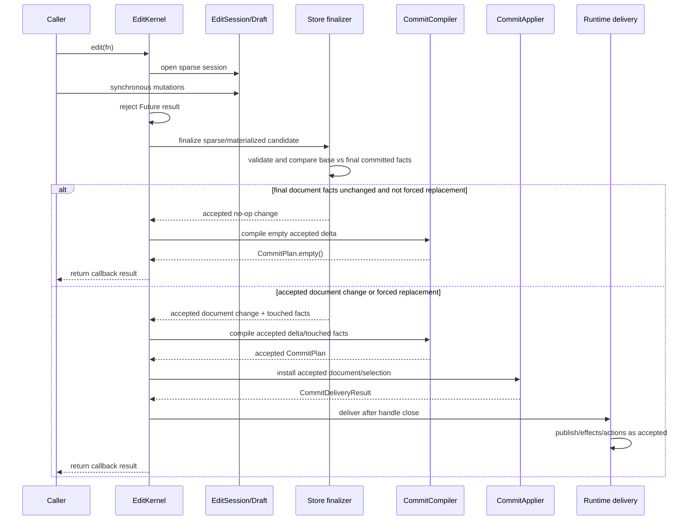
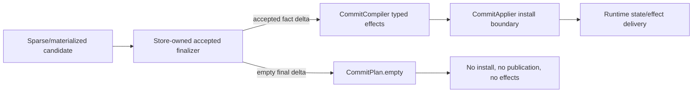

# Design: Net No-Op Edit Commit

---
date: 2026-06-11
designer: Codex
commit: 9989ba10
branch: new-architecture
design_question: "Design a clean architecture fix for EDIT-002: net-no-op edit commits can advance revisions and publish effects without a final document fact change."
---

## Disposition

READY_FOR_CONTRACT

## Product Outcome

Edits whose final committed document facts match the original committed facts
are accepted as no-op edits: they do not advance document revisions, invalidate
caches, publish public state, deliver typed effects, or notify commit observers.
This closes compensating edit sequences such as background A -> B -> A, palette
A -> B -> A, and add temporary element -> remove temporary element.

Non-goals:

- Do not make `CanvasEdit.replaceDraftDocument` equality-sensitive; equivalent
  replacement remains an explicit document replacement.
- Do not add a broad full-document projection diff to every sparse edit.
- Do not add sync glue between sparse, materialized, store, and compiler state.
- Do not edit docs, tests, source, registries, or benchmarks during this design
  phase.

## Target Contract Classification

- Profile: BEHAVIOR_CHANGE
- Obligations: BUG_FIX, SEAM_MIGRATION, PUBLIC_API_CHANGE

`PUBLIC_API_CHANGE` is included because a caller observing current runtime state
notifications or revision counters will see fewer public updates for
compensating edit callbacks. The intended public contract already says no-op
edits are silent, so the compatibility posture is to break the buggy observable
behavior without a migration layer.

## Research Inputs

- `docs/history/research/2026-06-11-net-no-op-edit-commit.md` - describes EDIT-002, current
  operation-journal accumulation, runtime delivery consequences, missing
  compensating-mutation coverage, and relevant no-op contracts.
- Direct repository evidence below is used for benchmark/performance facts,
  no-projection hot path guardrails, and benchmark setup using
  `replaceDraftDocument`.

## Repository Evidence

`Evidence Consequence Link`: each fact below states the decision, boundary,
unit, proof surface, or review consequence it supports.

- `docs/history/research/2026-06-11-net-no-op-edit-commit.md:18` - EDIT-002 is a P2/R2
  issue where an edit callback can restore document facts inside one commit
  while the current delta follows intermediate operations -> supports the
  `BUG_FIX` obligation and root-cause selection.
- `docs/history/research/2026-06-11-net-no-op-edit-commit.md:20` - current materialized,
  sparse, and store routes accumulate deltas from journals or intermediate
  mutation application -> supports rejecting one-call-site patches.
- `docs/history/research/2026-06-11-net-no-op-edit-commit.md:22` - runtime delivery uses the
  resulting revision delta to install, publish state, and deliver effects ->
  supports changing plan ordering before delivery, not only store install.
- `docs/history/research/2026-06-11-net-no-op-edit-commit.md:72` - searched tests do not
  cover successful compensating mutation sequences -> supports adding direct
  regression proof for A -> B -> A and add/remove sequences.
- `docs/architecture/01_runtime_ownership.md:57` - `DocumentStoreKernel` owns
  committed document state, revisions, resource descriptors, and projection
  cache -> supports placing final fact acceptance and revision truth at the
  store boundary.
- `docs/architecture/01_runtime_ownership.md:60` - `EditKernel` owns
  synchronous edit sessions, draft, touched sets, and cross-owner
  commit/rollback coordination -> supports keeping callback/session ordering in
  edit while delegating committed fact truth to store.
- `lib/src/store/committed_document.dart:8` - `CommittedDocument` keeps
  committed document facts and derived variants together so row snapshots do
  not become competing truth -> supports comparing final facts against the
  committed store aggregate, not a public projection.
- `lib/src/edit/edit_kernel.dart:83` - `EditKernel.edit` currently reads
  `session.commitPlan` before accepted sparse/materialized document selection
  -> supports moving plan compilation after accepted finalization.
- `lib/src/edit/edit_kernel.dart:121` - `prepareInteractionCommit` also reads
  `session.commitPlan` before accepted sparse/materialized document selection
  -> supports migrating both public edit and interaction commit routes.
- `lib/src/edit/edit_kernel.dart:177` - `_acceptedDocumentFor` currently
  prepares sparse commit only after plan construction -> supports replacing the
  route handoff with an accepted finalization seam.
- `lib/src/edit/commit_plan.dart:56` - `CommitPlan.hasChanges` follows
  `revisionDelta.hasChanges` or selection effect -> supports making the
  accepted final delta, not provisional session delta, the only document-change
  signal seen by the applier.
- `lib/src/edit/commit_compiler.dart:12` - `CommitCompiler.compile` consumes
  `StoreRevisionDelta` and `TouchedSet` -> supports keeping typed invalidation
  compilation in `CommitCompiler` while changing the inputs to accepted facts.
- `lib/src/edit/commit_compiler.dart:57` - ordinary effects are derived from
  revision delta and touched set -> supports recomputing those inputs from
  accepted final facts before effects exist.
- `lib/src/edit/commit_applier.dart:79` - an empty plan returns no publication
  -> supports using `CommitPlan.empty()` as the terminal accepted no-op signal.
- `lib/src/edit/commit_applier.dart:88` - accepted documents install only when
  plan revision delta has changes -> supports preventing store install for
  accepted net-no-op edits.
- `lib/src/runtime/runtime_root.dart:216` - runtime wires `EditKernel` to
  `_store.prepareSparseCommit`, `_applyEditCommit`, and delivery -> supports
  preserving the runtime/edit/store boundary shape while migrating accepted
  finalization.
- `lib/src/runtime/runtime_root.dart:1638` - runtime delivers spatial/resource
  effects and publishes state from `CommitDeliveryResult` -> supports requiring
  empty accepted no-op delivery, not only unchanged store rows.
- `lib/src/store/document_store_kernel.dart:340` - `prepareSparseCommit` is the
  sparse store preparation entry point -> supports using this owner or its
  successor as the sparse final fact boundary.
- `lib/src/store/document_store_kernel.dart:341` - current sparse preparation
  validates a provided revision delta and advances current revisions before all
  mutations are applied -> supports retiring caller-provided revision delta as
  accepted truth.
- `lib/src/store/document_store_kernel.dart:344` - `didMutateFacts` starts as a
  running intermediate-mutation flag -> supports replacing intermediate-change
  acceptance with final base-vs-final comparison.
- `lib/src/store/document_store_kernel.dart:394` - prepared sparse result keeps
  `nextDocument` and provided `revisionDelta` when any intermediate mutation
  changed facts -> supports the selected design's accepted-final-delta seam.
- `lib/src/store/sparse_store_commit.dart:9` - `StoreSparseCommit` currently
  carries both mutations and `revisionDelta` -> supports the `SEAM_MIGRATION`
  obligation to remove or demote provisional delta from sparse commit truth.
- `lib/src/edit/draft_document.dart:61` - `DraftDocument` stores an accumulated
  `_revisionDelta` -> supports migrating materialized route away from
  accumulated draft delta as accepted truth.
- `lib/src/edit/draft_document.dart:64` - materialized `didChange` is
  `_revisionDelta.hasChanges` -> supports final materialized fact comparison
  before commit acceptance.
- `lib/src/edit/draft_document.dart:96` - materialized `addElement` mutates
  draft state and touches/marks structural at lines 104-106 -> supports
  compensating add/remove regression proof for materialized route.
- `lib/src/edit/draft_document.dart:167` - materialized `removeElement` touches
  removed id and marks structural at lines 172-180 -> supports the same
  compensating proof.
- `lib/src/edit/draft_document.dart:222` - materialized background setter
  compares against current draft value, not original base -> supports final
  base-vs-final comparison for A -> B -> A.
- `lib/src/edit/edit_session.dart:323` - sparse backing owns facts, journal,
  mutations, touched set, and revision delta through lines 323-329 -> supports
  keeping sparse overlay as candidate state but not accepted truth.
- `lib/src/edit/edit_session.dart:386` - sparse session compiles a plan from
  `_revisionDelta` and `_touchedSet` before store acceptance -> supports moving
  compile after finalization.
- `lib/src/edit/edit_session.dart:406` - sparse commit returns `_mutations` and
  `_revisionDelta` -> supports replacing this payload with mutation-only or
  provisional-hint semantics.
- `docs/contracts/edit_kernel.md:88` - ordinary public edit, command, and
  interaction commit routes open sparse edit sessions and compile without
  building public `CanvasDocument` projection -> supports preserving sparse hot
  path and no eager projection.
- `docs/contracts/edit_kernel.md:198` - sparse and materialized routes must use
  `CommitCompiler` as typed taxonomy owner and produce the same operation
  matrix effects -> supports a shared accepted-change input to `CommitCompiler`.
- `docs/contracts/edit_kernel.md:214` - no-op field updates produce no document,
  revision, spatial, projection, resource, repaint, selection, event, or public
  publication effects -> supports accepted no-op semantics.
- `docs/contracts/edit_kernel.md:260` - accepted edits publish exactly one
  public snapshot and no-op edits do not publish a new snapshot -> supports the
  public behavior target.
- `docs/contracts/operation_matrix.md:89` - operation matrix has a `no-op edit`
  row with no touched state, revisions, spatial, projection, repaint, or events
  -> supports adding compensating no-op coverage to the operation matrix proof.
- `docs/contracts/operation_matrix.md:217` - successful no-op paths publish no
  public snapshot and produce no spatial, projection, resource, repaint, or
  event effects unless explicitly named -> supports empty accepted delivery.
- `docs/contracts/operation_matrix.md:263` - `replaceDraftDocument` has its own
  operation detail owner -> supports isolating replacement from ordinary
  net-no-op collapse.
- `docs/contracts/operation_matrix.md:290` - replacing with an equivalent
  document is still a document replacement and publishes replacement effects ->
  supports preserving forced replacement behavior.
- `docs/contracts/cache_policy.md:38` - `DocumentProjectionCache` hot path is
  not allowed in edit commit -> supports store-table scoped comparison instead
  of full public projection diff.
- `docs/contracts/cache_policy.md:55` - accepted sparse edits must not call
  `readDocument` or build projection cache during callback open, sparse
  preparation/install, selection-only interaction commit, or no-op routing ->
  supports the performance hard gate.
- `test/store/fixtures/no_projection_hot_path_fixture.dart:61` - sparse add,
  update, and no-op leave projection build count at zero until explicit
  `readDocument` -> supports future performance regression proof.
- `test/store/fixtures/no_projection_hot_path_fixture.dart:91` - ordinary public
  edit route does not build projection before explicit read -> supports
  no-projection verification for public edit route after migration.
- `test/guardrails/edit_sparse_routes_no_eager_projection_guardrail_test.dart:9`
  - AST guardrail protects ordinary edit and interaction routes from eager
  projection -> supports future guardrail updates or preservation.
- `test/guardrails/edit_sparse_routes_no_eager_projection_guardrail_test.dart:22`
  - guarded routes must not eagerly create `DraftDocument` -> supports avoiding
  materialized fallback for sparse net-no-op detection.
- `test/guardrails/edit_sparse_routes_no_eager_projection_guardrail_test.dart:28`
  - guarded routes must not call `_readDocument` before accepting sparse commits
  -> supports rejecting public projection equality checks in `EditKernel`.
- `tool/guardrails/src/guardrail_executor.dart:230` - `projection.only_explicit_read_paths`
  includes no-projection hot path, store projection, and sparse-route guardrail
  tests -> supports using existing guardrails as mandatory proof.
- `docs/_registry/benchmarks.yaml:188` - `edit.add_element` uses action-only,
  per-sample prepared fixture, incremental edit budget, allocation budget, and
  1k/10k/50k/100k scales -> supports benchmark performance pressure on edit
  action overhead.
- `docs/_registry/benchmarks.yaml:209` - `edit.update_visual` is an action-only
  incremental edit benchmark with touched-count metric -> supports preserving
  exact touched behavior and overhead budget.
- `docs/_registry/benchmarks.yaml:230` - `edit.update_transform` is an
  action-only incremental edit benchmark with spatial touched pages and
  allocation metrics -> supports preserving sparse scoped invalidation.
- `docs/_registry/benchmarks.yaml:272` - `edit.set_camera_offset` has an exact
  invariant that ordinary paint-plan invalidations stay zero -> supports
  avoiding broad invalidation as part of finalization.
- `docs/_registry/benchmarks.yaml:294` - `edit.add_line` is an action-only
  incremental edit benchmark -> supports measuring add-style edit overhead.
- `test/benchmarks/benchmark_probe_flutter.dart:1251` - edit benchmark probe
  dispatches six edit cases -> supports future benchmark diff coverage.
- `test/benchmarks/benchmark_probe_flutter.dart:1864` - edit benchmark actions
  use public/runtime edit APIs -> supports performance relevance to this fix.
- `test/benchmarks/benchmark_probe_flutter.dart:2282` - benchmark runtime setup
  installs documents through `replaceDraftDocument` -> supports preserving
  replacement semantics and not collapsing equivalent replacements.
- `docs/verification/benchmarks.md:62` - `docs/_registry/benchmarks.yaml` is the
  source of truth for benchmark cases and metrics -> supports no benchmark
  registry edits unless a future contract intentionally adds a case.
- `docs/verification/benchmarks.md:111` - no GitHub release benchmark gate is
  currently claimed -> supports treating benchmark comparison as local/manual
  verification unless future contract changes the registry.

## Design Form Candidates

### Candidate A. Store-only final equality after sparse prepare

- Form: keep existing session plan compilation, but make
  `DocumentStoreKernel.prepareSparseCommit` return an empty prepared commit when
  `nextDocument` matches `_document`.
- Why it could work: fixes one concrete sparse install route and is small.
- Gate failures or risks: fails Owner-Level Fix and Temporal Surface Closure.
  `CommitPlan` and effects are already compiled from provisional session delta
  before sparse preparation (`lib/src/edit/edit_kernel.dart:83`,
  `lib/src/edit/edit_session.dart:386`), so delivery can still publish stale
  effects. It also does not address materialized fallback.

### Candidate B. Sparse journal canonicalization

- Form: collapse setter A -> B -> A, add/remove pairs, and resource/table
  compensation in `_SparseEditBacking` before commit.
- Why it could work: avoids some false deltas early and can be fast for simple
  setter and add/remove sequences.
- Gate failures or risks: fails Source-Of-Truth Singularity and Future
  Pressure. It duplicates committed fact semantics in sparse overlay code,
  misses materialized route unless repeated there, and grows a second source of
  truth for every future mutation family.

### Candidate C. Full public document projection diff before commit

- Form: materialize both base and final `CanvasDocument` projections and compare
  them before delivery.
- Why it could work: easy to reason about at the public DTO level.
- Gate failures or risks: fails Boundary-Owned Policy and performance gates.
  Existing contracts and guardrails forbid building public projection during
  ordinary edit/sparse commit routing (`docs/contracts/cache_policy.md:55`,
  `test/guardrails/edit_sparse_routes_no_eager_projection_guardrail_test.dart:28`).
  It would make small edits scale with document size and distort incremental
  edit benchmarks.

### Candidate D. Accepted commit finalization seam before plan compilation

- Form: introduce a shared accepted-document-change finalization boundary.
  Edit sessions produce candidate sparse/materialized changes; the store-owned
  finalizer validates and compares final committed facts against the base
  committed aggregate; then `CommitCompiler` compiles from the accepted final
  delta and accepted touched facts. Empty accepted final deltas become
  `CommitPlan.empty()` before install or delivery.
- Why it could work: moves commit truth to the committed-fact owner, preserves
  `CommitCompiler` as effect taxonomy owner, closes sparse and materialized
  routes, and keeps no-op publication/projection behavior consistent.
- Gate failures or risks: requires a seam migration because `StoreSparseCommit`
  and `DraftDocument` currently expose accumulated `StoreRevisionDelta`.

## Known Future Pressures

| Pressure | Evidence | How the selected form responds | Accepted cost or risk |
|---|---|---|---|
| Incremental edit benchmarks measure action time and allocation across 1k/10k/50k/100k scenes. | `docs/_registry/benchmarks.yaml:188`, `docs/_registry/benchmarks.yaml:230`, `test/benchmarks/benchmark_probe_flutter.dart:1864` | Requires sparse route final comparison over committed store rows/families touched by the candidate, not public projection or full-document DTO diff. | Some constant/scoped finalization overhead is accepted; O(document) final diff on ordinary sparse edits is rejected. |
| Projection must be built only on explicit read/materialization paths. | `docs/contracts/cache_policy.md:55`, `test/store/fixtures/no_projection_hot_path_fixture.dart:91`, `test/guardrails/edit_sparse_routes_no_eager_projection_guardrail_test.dart:28` | Locks `readDocument`, eager `DraftDocument`, and public projection diff out of sparse acceptance and no-op routing. | The finalizer must use store tables and committed row snapshots, which may require adding small internal comparison utilities. |
| `replaceDraftDocument` is used for benchmark setup and has forced replacement semantics. | `test/benchmarks/benchmark_probe_flutter.dart:2282`, `docs/contracts/operation_matrix.md:290` | Treats replacement intent as explicit forced replacement, not equality-sensitive ordinary net-no-op. | Materialized route must carry an intent bit or distinct payload so ordinary materialized edits can collapse while replacement cannot. |
| Exact invalidation is required; global invalidation is allowed only for replacement. | `docs/contracts/edit_kernel.md:191`, `docs/verification/guardrails.md:206` | Finalizer returns accepted changed fact families and row changes; `CommitCompiler` still maps them to exact effects. | More detailed accepted-change data may be needed than a boolean final equality result. |
| Future mutation families should not require sparse canonicalizer duplication. | `docs/architecture/01_runtime_ownership.md:57`, `lib/src/store/committed_document.dart:8` | Centralizes final fact comparison in store-owned committed fact model; sparse/materialized sessions remain candidate builders. | Store finalizer grows as the committed fact model grows, but that is the owning layer. |

## Selected Form

Select Candidate D: an accepted commit finalization seam before plan
compilation.

The selected form changes the commit pipeline from:

```text
edit callback -> provisional session delta/touched set -> CommitPlan/effects
-> store preparation/install -> runtime delivery
```

to:

```text
edit callback -> sparse/materialized candidate -> store-owned accepted fact
finalization -> CommitCompiler from accepted delta/touched facts -> install
and delivery only when the accepted plan has changes
```

`DocumentStoreKernel` or a store-owned collaborator becomes the source of truth
for whether final committed facts changed. It validates sparse/materialized
candidates against the current committed aggregate, computes the final
base-vs-final fact delta, advances revisions only for accepted changed families,
and emits an accepted document-change descriptor. It must return an empty
accepted change when final facts match the base and the intent is not forced
replacement.

`EditKernel` remains the synchronous callback and transaction coordinator. It
opens sparse sessions, rejects nested/asynchronous callbacks, asks the store
finalizer for the accepted document change, then asks `CommitCompiler` to build
effects from accepted data. `CommitCompiler` remains the typed invalidation and
field-effect taxonomy owner. `CommitApplier` remains the all-or-nothing install
and selection/public delivery boundary.

`StoreSparseCommit.revisionDelta` and `DraftDocument.revisionDelta` cease to be
accepted commit truth. During migration they may exist only as private
provisional hints for early route pruning or validation; any future contract
must remove, rename, or quarantine them so no downstream owner can treat
operation-journal deltas as accepted fact deltas.

The accepted-change descriptor must distinguish:

- ordinary sparse candidate;
- ordinary materialized candidate after `readDraftDocument` promotion;
- forced materialized replacement after `replaceDraftDocument`.

Only forced replacement keeps replacement effects when the final document is
equivalent to the base document.

## Decision Trace

Preserve `Decision Chain Of Custody`: source inputs and locked decisions must
map to the future contract field, execution unit, or proof surface that carries
them forward.

| Decision ID | Decision | Evidence | Contract handoff target |
|---|---|---|---|
| D1 | Accepted document fact truth is store-owned and derived from base-vs-final committed facts, not from provisional operation journals. | `docs/architecture/01_runtime_ownership.md:57`; `lib/src/store/committed_document.dart:8`; `lib/src/store/document_store_kernel.dart:344` | `Boundaries.Owner`, `Boundaries.Source of Truth`, store finalizer execution unit |
| D2 | `EditKernel` must compile `CommitPlan` only after accepted finalization, so no-op final deltas become empty plans before install/delivery. | `lib/src/edit/edit_kernel.dart:83`; `lib/src/edit/edit_kernel.dart:121`; `lib/src/edit/commit_plan.dart:56`; `lib/src/edit/commit_applier.dart:79` | `Execution Order`, edit route migration unit, temporal proof |
| D3 | `CommitCompiler` remains the typed effect taxonomy owner; its inputs change from provisional session deltas to accepted deltas/touched facts. | `docs/contracts/edit_kernel.md:198`; `lib/src/edit/commit_compiler.dart:12`; `lib/src/edit/commit_compiler.dart:57` | `Boundaries.Owner`, compiler adaptation unit, exact invalidation proof |
| D4 | Sparse no-op detection must not build public `CanvasDocument` projection or eagerly materialize `DraftDocument`. | `docs/contracts/cache_policy.md:55`; `test/store/fixtures/no_projection_hot_path_fixture.dart:91`; `test/guardrails/edit_sparse_routes_no_eager_projection_guardrail_test.dart:22`; `test/guardrails/edit_sparse_routes_no_eager_projection_guardrail_test.dart:28` | `Performance/Boundary Constraints`, no-projection guardrail proof |
| D5 | `replaceDraftDocument` equivalent-document replacement remains forced replacement and is not collapsed by net-no-op detection. | `docs/contracts/operation_matrix.md:290`; `test/benchmarks/benchmark_probe_flutter.dart:2282` | `Compatibility`, materialized intent unit, replacement regression proof |
| D6 | `StoreSparseCommit.revisionDelta` and `DraftDocument.revisionDelta` must be migrated away from accepted truth. | `lib/src/store/sparse_store_commit.dart:9`; `lib/src/edit/draft_document.dart:61`; `lib/src/edit/edit_session.dart:406` | `SEAM_MIGRATION`, API/seam retirement gate |
| D7 | Future source-of-truth updates are mandatory for edit commit ordering and operation-matrix no-op coverage. | `docs/contracts/edit_kernel.md:88`; `docs/contracts/operation_matrix.md:89`; `docs/contracts/operation_matrix.md:217` | `Source-Of-Truth Updates`, docs execution unit, docs checks |
| D8 | Performance verification must use existing edit action benchmarks and no-projection tests; benchmark registry changes are optional unless adding a new case. | `docs/_registry/benchmarks.yaml:188`; `docs/_registry/benchmarks.yaml:230`; `docs/verification/benchmarks.md:62`; `docs/verification/benchmarks.md:111` | `Verification Strategy`, benchmark proof surface |

## Outcome-Proof Fit

| Claim | Direct outcome | Proxy risk | Required proof surface or strategy |
|---|---|---|---|
| Compensating edits are accepted no-ops. | A callback that performs A -> B -> A returns with unchanged document revisions, no state notification, no delivery effects, no observer call, and unchanged projection build count. | Checking only final document shape could pass while revisions/effects still publish. | Focused runtime/edit matrix tests for background, palette, camera, add/remove, resource where applicable, with listener/effect/revision assertions. |
| Store finalizer owns document-change truth. | Sparse and materialized routes receive accepted deltas from the store-owned finalizer; provisional session deltas cannot reach `CommitApplier` as accepted truth. | Renaming fields while still passing provisional delta into `CommitPlan` would keep the bug. | Structural test or semantic search proving plan compilation uses accepted finalizer output and `StoreSparseCommit.revisionDelta` is removed/quarantined. |
| Sparse finalization preserves hot path behavior. | Ordinary sparse edit/no-op routes do not call `readDocument`, eagerly construct `DraftDocument`, or increment projection build count. | Benchmark timing alone could miss a projection build hidden by cache state. | Existing no-projection fixture and sparse route AST guardrail, extended if finalizer introduces new paths. |
| Exact invalidation is preserved. | Mutating edits still produce the operation-matrix effects for their accepted final fact changes; net-no-op edits produce none. | A broad global invalidation could hide missing exact touched facts in functional tests. | `edit.operation_matrix_complete`, exact touched invalidation tests, and no-global-invalidation guardrail. |
| Forced replacement remains replacement. | `replaceDraftDocument` with an equivalent document advances replacement/epoch effects as documented and benchmark setup remains semantically unchanged. | A final equality check could accidentally suppress replacement setup while ordinary tests still pass. | Operation-matrix replacement regression test with equivalent replacement and benchmark fixture smoke route. |
| Public behavior change is intentional and documented. | Runtime observers see fewer updates only for accepted final no-op edits, matching no-op contract. | Treating this as internal only could leave docs ambiguous for consumers. | Edit contract and operation matrix source-of-truth updates plus docs checks. |

## Hard Gate Check

| Gate | Result | Evidence |
|---|---|---|
| Owner-Level Fix | pass | The selected form moves accepted document-change truth to the store owner (`docs/architecture/01_runtime_ownership.md:57`) and changes edit ordering before plan/effects (`lib/src/edit/edit_kernel.dart:83`), rather than patching one setter or one sparse call site. |
| Ownership | pass | Store owns committed document/revision facts (`docs/architecture/01_runtime_ownership.md:57`), Edit owns session/rollback coordination (`docs/architecture/01_runtime_ownership.md:60`), and CommitCompiler owns effect taxonomy (`docs/contracts/edit_kernel.md:198`). |
| Source-Of-Truth Singularity | pass | Final accepted delta has one source: store-owned committed fact comparison. Provisional sparse/draft deltas are retired or quarantined (`lib/src/store/sparse_store_commit.dart:9`, `lib/src/edit/draft_document.dart:61`). |
| Boundary-Owned Policy | pass | Validation and final fact comparison occur before irreversible install at the store preparation boundary (`lib/src/store/document_store_kernel.dart:340`); public projection is not used (`docs/contracts/cache_policy.md:55`). |
| Negative Proof And Fixture Quarantine | pass | Negative proof uses real public edit/store routes and future contract-named tests; no fixture-only names or schema values need to enter production sources or registries. Existing proof seams are edit matrix/runtime/no-projection tests (`docs/verification/tests.md:331`, `test/store/fixtures/no_projection_hot_path_fixture.dart:61`). |
| Dependency direction | pass | Runtime already depends on EditKernel and store callbacks (`lib/src/runtime/runtime_root.dart:216`); selected form does not require store importing runtime, frame, surface, or selection owners. |
| State/data | pass | Committed and derived document facts remain in `CommittedDocument`/store (`lib/src/store/committed_document.dart:8`); session overlay remains transient in edit (`lib/src/edit/edit_session.dart:323`); public projection cache remains explicit-read only (`docs/contracts/cache_policy.md:55`). |
| Sequenced Migration And Retirement | pass | Successor seam is accepted finalization before plan compilation. Retired truth is `StoreSparseCommit.revisionDelta`/`DraftDocument.revisionDelta` as accepted commit truth. Consumer order: store finalizer, edit routes, compiler inputs, applier delivery, tests/docs. Retirement gate: no code path can build `CommitPlan` for document changes from provisional session deltas. |
| Temporal Surface Closure | pass | Temporal invariant: callback completes synchronously, then accepted finalization happens, then plan compilation, then install/selection, then public delivery after the edit handle is closed. Synchronous callback surfaces are edit callback and interaction `augmentPlan`; delivery surfaces are state listeners, commit-effect observer, action emission. Guard owner remains `EditKernel`; accepted no-op signal is no install, no state publication, no effects. |
| All-Or-Nothing Failure Boundary | pass | Irreversible point remains store/selection install in `CommitApplier`; fallible work is validation, accepted finalization, plan compilation, and selection preparation before install. Later runtime delivery is accepted-result consumption; no-op failure projection is unchanged state/effects. |
| Outcome-Proof Fit | pass | Each selected-form claim maps to direct listener/revision/effect/projection/benchmark outcomes above rather than relying only on final document shape. |
| Verification | pass | Existing proof surfaces cover operation matrix, no-projection, guardrails, docs checks, and benchmarks; missing compensating tests are named as required future proof (`docs/history/research/2026-06-11-net-no-op-edit-commit.md:72`). |
| Future pressure | pass | Benchmark, projection, replacement, exact-invalidation, and future mutation-family pressures are assessed and constrained in Known Future Pressures. |

## Lock-Required Facts

- Owner: `DocumentStoreKernel` or a store-owned finalizer owns final document
  fact acceptance and accepted revision delta.
- Owning layer/module/document family: store for committed fact comparison;
  edit for synchronous session/rollback coordination; `CommitCompiler` for typed
  invalidation/effect taxonomy; operation matrix/edit contract for durable
  behavior.
- Seam: accepted commit finalization seam before `CommitPlan` compilation.
- Dependency/import direction: edit may call store finalizer and compiler;
  store must not depend on runtime/frame/surface/selection; compiler must not
  depend on concrete frame/runtime owners.
- State/data ownership: committed facts and revisions are store-owned;
  sparse/materialized session state is transient candidate state; projection
  cache is store-owned and explicit-read only; selection is not document state.
- Entry boundaries: `EditKernel.edit`, `EditKernel.prepareInteractionCommit`,
  and materialized fallback after `readDraftDocument`/`replaceDraftDocument`.
- Exit boundaries: `CommitApplier.apply`, store install, selection install,
  `RuntimeRoot._deliverEditCommitResult`, state listeners, effect observer, and
  action emission.
- File placement basis: accepted finalization belongs in store/edit internal
  seams, not public API, frame, runtime delivery, or benchmark code.
- Execution order constraints: callback -> reject Future -> finalizer -> compile
  accepted plan -> optional interaction augmentation only for accepted non-empty
  plan -> prepare selection -> install document -> install selection -> close
  handle -> deliver runtime effects/state/actions.
- `Temporal Surface Closure` invariant, synchronous callback surfaces,
  guard/boundary owner, public observation order, and expected
  rejection/no-mutation signal: `EditKernel` owns open-session guard and
  synchronous callback rejection; callback and interaction `augmentPlan` are the
  synchronous mutation/planning callbacks; public observation starts only after
  handle close and runtime delivery; accepted net-no-op returns the callback
  result without install, state publication, action emission, effect observer
  delivery, or projection build.
- `All-Or-Nothing Failure Boundary` irreversible point, fallible-before-irreversible work, later infallible/failure-contained/accepted work, failure projection, and proof surface: irreversible point is document/selection install; sparse/materialized validation, final comparison, accepted delta derivation, and selection preparation are before it; runtime delivery consumes an accepted result after install; failures before install leave committed document, selection, revisions, effects, actions, projection cache, and state listeners unchanged; proof through rollback tests and compensating no-op tests.
- Rejected alternatives: store-only final equality after old plan compilation;
  sparse journal canonicalization; full public projection diff.
- Verification strategy: focused compensating no-op tests, route-order
  structural proof, no-projection guardrails, operation matrix regression,
  replacement exception regression, docs checks, and targeted benchmark diff.

## Diagram Need Assessment

| Design question | Needed? | Diagram kind | Reason |
|---|---:|---|---|
| Does the design change ownership, layer, package, or component boundaries? | yes | c4 | The selected form introduces a store-owned accepted finalization seam between edit sessions and commit compilation. |
| Does it change data flow, state ownership, cache ownership, resource movement, or lifecycle movement? | yes | data_flow | Candidate session data becomes accepted store finalizer output before compiler effects. |
| Does it depend on call order, lifecycle order, sync/async ordering, failure ordering, or migration order? | yes | sequence | Correctness depends on finalization before plan compilation and install/delivery. |
| Does it introduce or alter observer/listener/callback delivery, guard windows, public-state publication, or reentrancy-sensitive ordering? | yes | sequence | Net-no-op must suppress state listeners and effect observer after callback closure. |
| Does it introduce or alter modes, statuses, terminal states, sessions, or transition rules? | no | none | It changes commit acceptance ordering, not runtime modes or session states. |
| Does it create, replace, migrate, or retire a shared seam under `Sequenced Migration And Retirement`? | yes | c4/data_flow/sequence | Provisional revision-delta truth is retired in favor of accepted finalization. |
| Does it change public API consumer flow, payload shape, or compatibility behavior? | yes | sequence | Public observers see no state/effect publication for compensating no-op edits. |
| Does it introduce or change analyzer, guardrail, or structural-recognition pipeline behavior? | yes | data_flow | Existing no-projection and route-order guardrails may need to recognize the new finalizer seam. |

## Provisional Diagrams





## Source-Of-Truth Impact

`Source-Of-Truth Singularity`: durable meaning must have one owning source of
truth and a real human or machine consumer. Cache/performance duplication is
allowed only when the invariant and proof strategy are explicit.

A later Change Contract must update these source-of-truth artifacts when
implementing the design:

- `docs/contracts/edit_kernel.md`: update the commit sequence and prose so
  accepted finalization precedes `CommitCompiler` plan/effect construction.
- `docs/contracts/operation_matrix.md`: add or clarify compensating no-op edit
  behavior while preserving `replaceDraftDocument` equivalent replacement as a
  forced replacement row.
- `docs/verification/tests.md` and `docs/verification/guardrails.md`: update
  verification mappings if new compensating no-op tests or structural
  guardrails are added.
- `docs/_registry/benchmarks.yaml`: no mandatory change. Add a new benchmark
  case only if the future contract intentionally makes compensating no-op
  performance a tracked benchmark source of truth; if changed, generated docs
  must be synced.

No durable `docs/diagrams/*.mmd` diagram is required by this design. The
sequence diagrams above are provisional design explanation only.

## Verification Impact

Future proof surfaces should include:

- Focused edit/runtime tests for background A -> B -> A, palette A -> B -> A,
  camera A -> B -> A, add element -> remove same element, and resource
  compensation when supported by existing public routes.
- Materialized fallback tests where `readDraftDocument` promotes a session and
  ordinary mutations compensate back to the base document.
- Replacement exception test proving `replaceDraftDocument` with an equivalent
  document remains a replacement.
- Store sparse tests proving final no-op prepared commits have empty revision
  deltas, no admitted ids, and do not advance projection/document revisions.
- Runtime state/effect observer tests proving accepted net-no-op emits no
  public state, no action intents, no spatial/resource/projection/repaint
  effects, and no commit-effect observer payload.
- Structural/semantic proof that `CommitPlan` for document edits is compiled
  from accepted finalizer output, not `session.revisionDelta`.
- Existing `projection.only_explicit_read_paths` guardrail and no-projection
  hot-path tests, updated if new finalizer names require recognition.
- Existing operation matrix, exact touched invalidation, rollback, and typed
  effects tests.
- Focused benchmark diff for edit cases from `docs/_registry/benchmarks.yaml`
  (`edit.add_element`, `edit.update_visual`, `edit.update_transform`,
  `edit.set_camera_offset`, `edit.add_line`) when implementation changes action
  overhead. No GitHub release benchmark gate is claimed today.

## Verification Strategy

Use a test-first or characterization-first implementation sequence:

1. Add failing compensating no-op tests through public edit/runtime seams and
   sparse store seams.
2. Add or update structural guardrails before migrating the seam so provisional
   deltas cannot remain accepted truth unnoticed.
3. Migrate sparse and materialized finalization to store-owned accepted
   base-vs-final committed fact comparison.
4. Move `CommitCompiler` invocation after accepted finalization.
5. Preserve forced replacement and explicit projection materialization
   exceptions.
6. Run Dart/DCM checks, focused tests, guardrails, docs checks for changed
   source-of-truth docs, and targeted benchmark diff where practical.

The key direct proof is not only "final document equals base"; it is "final
document equals base and every public/internal delivery surface remains
unchanged."

## Change Contract Handoff

- Required profile: BEHAVIOR_CHANGE
- Required obligations: BUG_FIX, SEAM_MIGRATION, PUBLIC_API_CHANGE
- Decision IDs / Decision Trace rows to preserve: D1, D2, D3, D4, D5, D6, D7,
  D8
- Evidence to cite:
  - `docs/history/research/2026-06-11-net-no-op-edit-commit.md:18`
  - `docs/history/research/2026-06-11-net-no-op-edit-commit.md:20`
  - `docs/history/research/2026-06-11-net-no-op-edit-commit.md:22`
  - `docs/history/research/2026-06-11-net-no-op-edit-commit.md:72`
  - `docs/architecture/01_runtime_ownership.md:57`
  - `docs/architecture/01_runtime_ownership.md:60`
  - `lib/src/store/committed_document.dart:8`
  - `lib/src/edit/edit_kernel.dart:83`
  - `lib/src/edit/edit_kernel.dart:121`
  - `lib/src/edit/edit_session.dart:386`
  - `lib/src/store/document_store_kernel.dart:340`
  - `lib/src/store/document_store_kernel.dart:394`
  - `lib/src/store/sparse_store_commit.dart:9`
  - `lib/src/edit/draft_document.dart:61`
  - `docs/contracts/edit_kernel.md:198`
  - `docs/contracts/edit_kernel.md:260`
  - `docs/contracts/operation_matrix.md:89`
  - `docs/contracts/operation_matrix.md:290`
  - `docs/contracts/cache_policy.md:55`
  - `test/guardrails/edit_sparse_routes_no_eager_projection_guardrail_test.dart:9`
  - `docs/_registry/benchmarks.yaml:188`
  - `docs/verification/benchmarks.md:62`
- Contract constraints or sequencing facts:
  - Add failing compensating no-op proof before changing the seam.
  - Introduce the accepted finalization output before retiring provisional
    `revisionDelta` truth.
  - Migrate `EditKernel.edit` and `prepareInteractionCommit` together.
  - Compile `CommitPlan` only from accepted finalizer output.
  - Preserve `replaceDraftDocument` forced replacement semantics.
  - Do not build public projection or eagerly materialize draft on sparse route.
  - Update edit contract and operation matrix source-of-truth docs in the same
    implementation change that changes semantics.
  - Treat benchmark registry changes as optional and deliberate; do not add
    benchmark cases as proof-only artifacts without source-of-truth ownership.
- Required proof surfaces:
  - public/runtime compensating no-op tests;
  - sparse store compensating no-op tests;
  - materialized fallback compensating no-op tests;
  - replacement exception regression;
  - route-order structural guardrail or semantic search;
  - no-projection hot-path and sparse-route guardrail tests;
  - operation matrix and exact invalidation tests;
  - docs checks for source-of-truth updates;
  - targeted benchmark diff or manual benchmark note when implementation affects
    incremental edit action paths.

## Open Decisions

None. The design is ready for Change Contract authoring.
