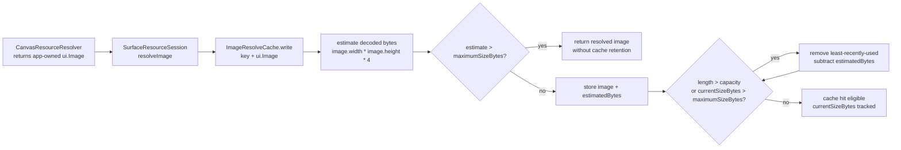

# Design: Resource Image Cache Memory Accounting

---
date: 2026-06-14
designer: Codex
commit: 7b9f6939
branch: new-architecture
design_question: "Design the optimal fix for RESOURCE-001: ImageResolveCache currently accounts only for entry count, not retained image memory."
---

## Disposition

READY_FOR_CONTRACT

## Product Outcome

The resolved image cache should stop retaining too many heavy app-provided images at once while preserving the current resolver lifecycle, cache key semantics, and app-owned image contract. The selected default byte cap is 64 MiB per active `SurfaceResourceSession`, alongside the existing 1024-entry cap. The user-visible behavior is more predictable memory pressure during image-heavy canvas sessions; the engine still returns resolved images for the current paint request and still never disposes app-owned `ui.Image` instances.

Non-goals: no public API change, no engine image loading/decoding, no app-provided cache-weight contract, no migration of resource descriptors, and no move of resolver/cache ownership out of the resources layer.

## Target Contract Classification

- Profile: BEHAVIOR_CHANGE
- Obligations: BUG_FIX

## Research Inputs

- `docs/history/research/2026-06-14-resource-image-cache-memory-accounting.md` - confirms current `ImageResolveCache` entry-only capacity, descriptor `byteLength` flow, app-owned image lifecycle, current tests, and absence of byte-capacity logic in `lib/src/resources/**`.
- External reference used only for calibration: Flutter `ImageCache` API documentation, accessed 2026-06-14, describes an LRU cache bounded by image count and 100 MB. Repository evidence and the product decision in this design select a more conservative per-session default.

## Repository Evidence

`Evidence Consequence Link`: each fact below states the decision, boundary,
unit, proof surface, or review consequence it supports.

- `lib/src/resources/resource_cache.dart:5` - current default capacity is `1024` resolved resource images -> supports retaining the existing entry-count guard as one of two cache limits.
- `lib/src/resources/resource_cache.dart:7` - cache key is `resolverGeneration`, `resourceId`, and `resourceRevision` -> supports preserving cache identity and not adding size to the key.
- `lib/src/resources/resource_cache.dart:18` - current cache stores `ui.Image` values directly -> supports moving retained-size accounting into the cache owner.
- `lib/src/resources/resource_cache.dart:22` - cache `read` takes no descriptor metadata -> supports keeping reads as key-only LRU promotion with no byte metadata dependency.
- `lib/src/resources/resource_cache.dart:42` - cache `write` receives the resolved `ui.Image` -> supports computing decoded-size estimate at the cache admission boundary.
- `lib/src/resources/resource_cache.dart:56` - current eviction loop compares only `_entries.length` with `_capacity` -> supports the bug-fix target: dual entry-count and byte-count eviction.
- `lib/src/resources/surface_resource_session.dart:25` - `SurfaceResourceSession` owns one `ImageResolveCache` instance -> supports keeping cache policy inside the session-owned resource path.
- `lib/src/resources/surface_resource_session.dart:85` - session cache reads use resolver generation, resource id, and resource revision -> supports preserving existing cache lookup semantics.
- `lib/src/resources/surface_resource_session.dart:155` - session writes resolver results into the cache after resolver callback returns -> supports keeping resolver callbacks and cache admission as separate steps.
- `lib/src/resources/resource_resolver_adapter.dart:15` - resolver request receives descriptor `byteLength` -> supports comparing descriptor-byte and decoded-image candidates.
- `lib/src/resources/resource_resolver_adapter.dart:30` - resolver-facing `CanvasImageResource` receives descriptor `byteLength` -> supports treating descriptor bytes as resolver metadata, not necessarily retained decoded memory.
- `lib/src/frame/paint_asset_binding_service.dart:71` - frame descriptor `byteLength` is copied into resolver requests -> supports avoiding a second memory source of truth from frame descriptor facts.
- `lib/src/contracts/public/canvas_resource.dart:17` - public resource descriptor has optional `byteLength` -> supports rejecting descriptor-only accounting because the field is optional and descriptor-owned.
- `lib/src/frame/main_frame_record_painter.dart:58` - frame painter already reads `image.width` and `image.height` from `ui.Image` -> supports decoded-dimension access as an available local property of resolved images.
- `docs/contracts/resources.md:67` - each active surface creates one concrete `SurfaceResourceSession` under `lib/src/resources/**` -> supports per-session byte accounting rather than runtime-wide accounting.
- `docs/contracts/resources.md:92` - paint/resource resolution receives immutable descriptor snapshots and `resourceRevision` through `FrameFactsPort` -> supports keeping descriptor facts upstream and cache admission downstream.
- `docs/contracts/resources.md:95` - resource module owns session policy through narrow contract inputs and must not read/mutate runtime or store -> supports placing the fix in `ImageResolveCache`, not frame, store, or runtime.
- `docs/contracts/resources.md:105` - `PaintAssetBindingService` is the only frame collaborator that receives `SurfaceResourceSession` -> supports proving the cache through the resource/session seam instead of painter behavior.
- `docs/contracts/resources.md:117` - `CanvasSurface` creates an empty `SurfaceResourceSession` only after successful attach -> supports keeping the new byte counter session-local.
- `docs/contracts/resources.md:120` - detach, dispose, runtime swap, and runtime disposal call `drop()` and clear cache without disposing app-owned images -> supports no-dispose behavior under byte eviction.
- `docs/contracts/resources.md:128` - `ImageResolveCache` is `SurfaceResourceSession` policy owned by resources, not frame/spatial or runtime-wide state -> supports owner-level fix in the cache owner.
- `docs/contracts/resources.md:136` - current contract row states `1024 entries per active session` and LRU -> supports mandatory source-of-truth update to add byte cap, byte eviction, and byte probe.
- `docs/contracts/cache_policy.md:45` - cache policy ledger repeats `ImageResolveCache` key, owner, capacity, and eviction -> supports mandatory ledger update in the future Change Contract.
- `docs/contracts/cache_policy.md:53` - hot cache misses must be bounded by candidate count, not total scene size -> supports preserving synchronous O(evicted entries) cache work at write time and no full-scene scanning.
- `docs/contracts/cache_policy.md:54` - hot caches must declare capacity, eviction, key components, invalidation owner, and metric/probe -> supports adding `currentSizeBytes`/byte-capacity as resource-cache proof surface and docs row.
- `docs/contracts/public_api_v1.md:529` - one active `CanvasSurface` per runtime is supported -> supports one cache byte budget per active runtime surface.
- `docs/contracts/public_api_v1.md:530` - multiple `CanvasSurface` widgets may be active with different runtimes -> supports documenting that the byte cap is per active session, not process-global.
- `docs/contracts/public_api_v1.md:567` - surface `resourceResolver` is app-owned and synchronous -> supports keeping cache admission after the synchronous resolver return.
- `docs/contracts/public_api_v1.md:578` - `CanvasSurface` does not own or dispose app-provided images -> supports byte eviction by dropping cache references only.
- `docs/contracts/public_api_v1.md:1984` - `resourceResolver` is synchronous in v1 -> supports a synchronous size-estimate-and-evict path with no async image inspection.
- `docs/contracts/public_api_v1.md:1985` - returned `ui.Image` objects are app-owned -> supports not adding engine-owned disposal or ownership transfer.
- `docs/contracts/public_api_v1.md:1986` - engine never disposes app-provided `ui.Image` instances -> supports preserving no-dispose tests.
- `docs/contracts/public_api_v1.md:1988` - resolved image references live only inside active `SurfaceResourceSession` -> supports resource-session-local memory accounting as the complete engine retention boundary.
- `docs/contracts/frame_rendering.md:179` - `PaintAssetBindingService` is the only target frame collaborator that receives `SurfaceResourceSession` -> supports keeping frame/painter contracts unchanged.
- `docs/contracts/frame_rendering.md:182` - binding starts frame resource pass before image resolution so resolver budgets and suppression belong to the current frame -> supports not changing resolver budget ordering.
- `docs/diagrams/dfd_resource_resolution.mmd:54` - resource-resolution diagram models `SurfaceResourceSession` as the cache/resolver owner -> supports future diagram update for byte admission inside this owner.
- `docs/diagrams/dfd_resource_resolution.mmd:95` - current data flow labels cache lookup and bounded update -> supports adding byte-aware bounded update to the same flow.
- `docs/diagrams/dfd_resource_resolution.mmd:103` - current data flow stores resolved image by resolver generation, resource id, and revision -> supports keeping identity stable while changing admission policy.
- `docs/diagrams/dfd_resource_resolution.mmd:118` - invalidation events target `ImageResolveCache` -> supports ensuring target/all invalidation also decrements/reset byte accounting.
- `docs/diagrams/seq_resource_resolution.mmd:88` - current sequence stores every returned `ui.Image` in cache -> supports mandatory sequence-diagram update for oversized-image no-retention and byte-admission order.
- `docs/diagrams/state_resource_resolution.mmd:70` - current state note says admission is keyed strictly by resolver generation, resource id, and resource revision -> supports future state-diagram text update that separates key identity from byte admission.
- `docs/verification/tests.md:950` - existing verification proves target dirty evicts the target cache entry -> supports extending resource tests without weakening invalidation semantics.
- `docs/verification/tests.md:955` - existing verification proves mark-all dirty clears active session `ImageResolveCache` -> supports adding byte-counter reset expectations.
- `test/resources/fixtures/surface_session_cache_lifecycle_fixture.dart:111` - existing fixture proves LRU entry-count behavior -> supports preserving entry-count LRU behavior while adding byte LRU cases.
- `test/resources/fixtures/app_owned_image_not_disposed_fixture.dart:24` - no-dispose fixture already exercises eviction beyond capacity -> supports extending or preserving no-dispose proof under byte eviction.
- `test/resources/resource_resolver_adapter_shape_test.dart:31` - adapter shape test expects request `byteLength` field -> supports leaving resolver request shape intact and not redefining the field as cache memory.
- `tool/guardrails/src/frame_cache_guardrail_checks.dart:229` - existing hot-cache guardrail production source set is `lib/src/frame` -> supports not relying on that guardrail for resource-cache byte accounting.
- `tool/guardrails/src/guardrail_executor.dart:408` - `cache.hot_caches_have_capacity_eviction` currently maps to frame cache tests -> supports using focused resource tests/docs updates rather than pretending current guardrail covers resources.

## Design Form Candidates

### Candidate A. Byte-aware `ImageResolveCache` using decoded `ui.Image` dimensions

- Form: extend the existing `ImageResolveCache` owner with `maximumSizeBytes`, `currentSizeBytes`, and per-entry `estimatedBytes = image.width * image.height * 4`; keep `capacity` as `maximumSize`/entry limit.
- Why it could work: the cache write boundary already receives the resolved `ui.Image` (`lib/src/resources/resource_cache.dart:42`), resolved image references live only in the active session (`docs/contracts/public_api_v1.md:1988`), and width/height are local `ui.Image` properties already used by frame painting (`lib/src/frame/main_frame_record_painter.dart:58`).
- Gate failures or risks: decoded bytes are still an estimate of retained image pressure, not a precise GPU/native allocation. The design scopes the claim to decoded RGBA-equivalent cache weight and proves the cache no longer holds more than the configured estimate.

### Candidate B. Use descriptor `byteLength` as the cache weight

- Form: pass `ResourceImageResolveRequest.byteLength` or `CanvasImageResource.byteLength` to cache write and evict by descriptor byte total.
- Why it could work: descriptor `byteLength` already flows through public resource descriptors, frame facts, and resolver requests (`lib/src/contracts/public/canvas_resource.dart:17`, `lib/src/frame/paint_asset_binding_service.dart:71`, `lib/src/resources/resource_resolver_adapter.dart:15`).
- Gate failures or risks: descriptor `byteLength` is optional and descriptor-owned, while the retained object is a decoded `ui.Image`. It would create a second source of truth for cache pressure and could pass tests with small encoded assets that decode to large images.

### Candidate C. Add public or metadata-provided cache weight

- Form: extend public resource/API metadata or resolver contract so applications provide cache weight.
- Why it could work: applications own image lifecycle and may know custom memory cost.
- Gate failures or risks: it creates a public API/compatibility change for an internal cache policy, creates sync glue between app metadata and decoded images, and leaves correctness dependent on app-provided estimates.

### Candidate D. Replace `ImageResolveCache` with Flutter `ImageCache`

- Form: delegate resolved image retention to Flutter's image cache machinery.
- Why it could work: Flutter's cache is already entry- and byte-bounded.
- Gate failures or risks: repository resource resolution is app-owned and synchronous, the engine does not own loading/decoding, and resolved references live inside `SurfaceResourceSession` only (`docs/contracts/public_api_v1.md:1984`, `docs/contracts/public_api_v1.md:1988`). Flutter `ImageCache` is keyed around image providers/completers, not this resolver-generation/resource-revision identity.

## Known Future Pressures

| Pressure | Evidence | How the selected form responds | Accepted cost or risk |
|---|---|---|---|
| Multiple active surfaces can exist when each uses a different runtime. | `docs/contracts/public_api_v1.md:530` | Keeps `maximumSizeBytes` per active `SurfaceResourceSession`, matching the existing per-session entry cap, and selects 64 MiB rather than Flutter's 100 MB global baseline because this cache is per session. | Total process retention can be `active sessions * 64 MiB`; this is existing per-session ownership pressure, not solved with a process-global cache. |
| App-owned image lifecycle forbids engine disposal. | `docs/contracts/public_api_v1.md:1985`; `docs/contracts/public_api_v1.md:1986` | Byte eviction drops cache references only and keeps no-dispose tests. | Eviction cannot guarantee the app releases memory; it guarantees only that the engine session no longer retains the reference. |
| Descriptor `byteLength` exists and can be mistaken for memory size. | `lib/src/contracts/public/canvas_resource.dart:17`; `lib/src/resources/resource_resolver_adapter.dart:15` | Explicitly rejects descriptor-byte accounting and records decoded-image estimate as cache-local derived data. | Future docs must explain that descriptor bytes remain source metadata, not decoded cache weight. |
| Current docs and diagrams say entry-only capacity. | `docs/contracts/resources.md:136`; `docs/contracts/cache_policy.md:45`; `docs/diagrams/state_resource_resolution.mmd:70` | Requires future source-of-truth updates in the same Change Contract as code. | Documentation-only drift is a risk if implementation lands without docs checks; handoff makes docs checks mandatory. |
| Existing frame cache guardrail does not scan resource cache code. | `tool/guardrails/src/frame_cache_guardrail_checks.dart:229`; `tool/guardrails/src/guardrail_executor.dart:408` | Uses focused resource cache tests and cache policy docs as proof; does not claim existing frame guardrail enforces resource bytes. | A future structural guardrail can be added later if this becomes repeated drift; it is not required for this single owner-local bug fix. |

## Selected Form

Choose Candidate A: keep `ImageResolveCache` as the single owner and make it a dual-limit LRU cache with both entry capacity and decoded-byte capacity.

The cache stores an internal entry record containing the app-owned `ui.Image` reference and a cache-local `estimatedBytes` value. `estimatedBytes` is computed synchronously at cache admission as `image.width * image.height * 4`, representing a decoded RGBA-equivalent cache weight. The value is derived data owned by the cache, not a public resource descriptor fact and not a new source of truth for resource identity.

The future implementation should add an internal constant next to the existing entry cap:

```dart
const int kMaxResolvedResourceImageBytesPerSession = 64 * 1024 * 1024;
```

The 64 MiB default is intentionally below Flutter's 100 MB global image-cache baseline because repository ownership is per active session. With `width * height * 4`, 64 MiB admits one 4096x4096 RGBA-equivalent image, four 2048x2048 images, or sixteen 1024x1024 images before LRU pressure. That keeps the common canvas/image-board case useful while capping the engine's retained app-image references more conservatively than a global framework cache.

`ImageResolveCache` should accept `maximumSizeBytes` in its constructor for focused tests, preserve the existing entry `capacity`, expose `currentSizeBytes` as an internal probe, and retain `length`. Writes remove any existing entry for the same key before admission, compute the new image estimate, skip cache storage when the single image estimate exceeds `maximumSizeBytes`, and otherwise insert the entry and evict least-recently-used entries until both limits pass. Reads still promote recency without changing total bytes. Target invalidation subtracts removed entry sizes, and `clear()` resets bytes to zero.

Oversized images still return as `ResolvedResourceImage` for the current resolve result; they are simply not retained by `ImageResolveCache`. This preserves current paint behavior for a resolver hit while preventing one oversized image from forcing the cache to exceed its byte budget.

## Decision Trace

Preserve `Decision Chain Of Custody`: source inputs and locked decisions must
map to the future contract field, execution unit, or proof surface that carries
them forward.

| Decision ID | Decision | Evidence | Contract handoff target |
|---|---|---|---|
| D1 | `ImageResolveCache` remains the owner of resolved-image retention and byte accounting. | `docs/contracts/resources.md:128`; `lib/src/resources/surface_resource_session.dart:25` | `Boundaries.Owner`; production unit for `lib/src/resources/resource_cache.dart` |
| D2 | Cache identity stays `resolverGeneration + resourceId + resourceRevision`; size is admission metadata, not part of the key. | `lib/src/resources/resource_cache.dart:7`; `docs/contracts/resources.md:136` | `Boundaries.Source of Truth`; cache-key regression proof |
| D3 | Use decoded `ui.Image` dimension estimate, `width * height * 4`, rather than descriptor `byteLength`. | `lib/src/resources/resource_cache.dart:42`; `lib/src/resources/resource_resolver_adapter.dart:15`; `lib/src/frame/main_frame_record_painter.dart:58` | cache admission unit; tests proving descriptor byteLength does not drive eviction |
| D4 | Enforce dual limits: existing 1024 entry cap plus `kMaxResolvedResourceImageBytesPerSession = 64 * 1024 * 1024`. | `lib/src/resources/resource_cache.dart:5`; `lib/src/resources/resource_cache.dart:56`; `docs/contracts/cache_policy.md:54`; product decision in this design workflow, 2026-06-14, selecting the lead-engineer recommendation | constants/source-of-truth docs; byte and entry LRU tests |
| D5 | Oversized single images are not retained, but still return for the current resolve result. | `docs/contracts/public_api_v1.md:1985`; `docs/contracts/public_api_v1.md:1988`; `lib/src/resources/surface_resource_session.dart:155` | cache write behavior unit; oversized-image no-retention test |
| D6 | Byte eviction never disposes app-owned images and only removes cache references. | `docs/contracts/public_api_v1.md:1986`; `docs/contracts/resources.md:120`; `test/resources/fixtures/app_owned_image_not_disposed_fixture.dart:24` | lifecycle/no-dispose proof surface |
| D7 | Source-of-truth docs and resource-resolution diagrams must change with implementation. | `docs/contracts/resources.md:136`; `docs/contracts/cache_policy.md:45`; `docs/diagrams/dfd_resource_resolution.mmd:95`; `docs/diagrams/seq_resource_resolution.mmd:88`; `docs/diagrams/state_resource_resolution.mmd:70` | `SOURCE_OF_TRUTH_DOCS` portion of future behavior contract; docs checks |

## Outcome-Proof Fit

| Claim | Direct outcome | Proxy risk | Required proof surface or strategy |
|---|---|---|---|
| Cache is byte-aware, not entry-only. | After writes, retained entries have total `currentSizeBytes <= maximumSizeBytes` unless no entry is retained for an oversized image. | Checking only `length <= capacity` would pass the old behavior. | Focused `ImageResolveCache` test with small byte cap and different image dimensions; assert hits/misses and `currentSizeBytes`. |
| Existing entry LRU behavior is preserved. | Adding the 1025th small image evicts the least-recently-used entry while a recently read entry remains cached. | Byte-only tests could pass while entry cap regresses. | Preserve existing `surface_session_cache_lifecycle` proof and add/keep direct entry-limit test. |
| Descriptor `byteLength` is not the decoded memory source of truth. | Two resources with misleading descriptor byte lengths are cached/evicted according to decoded image dimensions. | Verifying `byteLength` is still passed to resolver would not prove cache accounting. | Test cache admission directly from images; optional session fixture with high `byteLength`/small decoded image and low `byteLength`/larger decoded image if cache injection is introduced. |
| Oversized images are not retained but current resolve still succeeds. | First resolve returns `ResolvedResourceImage`; immediate second resolve for same key calls resolver again because oversized image was not cached. | Checking only that resolver returned an image would miss retention. | Resource/session or direct cache test with `maximumSizeBytes` below image estimate; assert no cache hit on second read/resolve. |
| Byte eviction preserves app-owned lifecycle. | Evicted, invalidated, cleared, dropped, and disposed images are not disposed by the engine. | Checking cache miss after eviction does not prove no-dispose. | Extend existing no-dispose fixture to include byte eviction, or add a focused byte-eviction no-dispose fixture. |
| Byte counters stay consistent across replace, invalidate, read promotion, and clear. | Replacing same key subtracts old size; target invalidation subtracts matching entries; `clear` resets to zero; reads do not change total. | Only final cache length could pass with stale byte counters. | Direct cache unit tests asserting `currentSizeBytes` after replace, invalidateResource, read, and clear. |
| Source-of-truth docs match implemented policy. | Resource/cache policy docs and resource-resolution diagrams describe entry+byte cap and oversize no-retention. | Code tests could pass while docs still promise entry-only behavior. | Documentation checks after docs/diagram updates: `dart run docs/tool/sync_generated_docs.dart --check` and `dart run docs/tool/check_docs.dart`. |

## Hard Gate Check

| Gate | Result | Evidence |
|---|---|---|
| Owner-Level Fix | pass | The weakness is the shared cache owner comparing only `_entries.length` to `_capacity` (`lib/src/resources/resource_cache.dart:56`), so the selected form changes `ImageResolveCache`, not one paint call site. |
| Ownership | pass | `ImageResolveCache` is `SurfaceResourceSession` policy owned by resources (`docs/contracts/resources.md:128`), and `SurfaceResourceSession` owns one cache instance (`lib/src/resources/surface_resource_session.dart:25`). |
| Source-Of-Truth Singularity | pass | Resource identity remains resolver generation/id/revision (`lib/src/resources/resource_cache.dart:7`); decoded byte estimate is cache-local derived data, not descriptor truth. |
| Boundary-Owned Policy | pass | The cache admission boundary already receives `ui.Image` (`lib/src/resources/resource_cache.dart:42`), so size estimation and eviction stay at the owning cache boundary. |
| Negative Proof And Fixture Quarantine | pass | Future negative/oversize proof can use direct resource-cache tests and Flutter test fixtures under `test/resources/**`, without adding fixture-only data to docs, public API, schema, or production sources. Existing fixture pattern is `test/resources/fixtures/surface_resource_session_test_support.dart:83`. |
| Dependency direction | pass | The fix stays in `lib/src/resources/**`; resource module owns session policy through narrow inputs and must not read/mutate runtime/store (`docs/contracts/resources.md:95`). |
| State/data | pass | Committed descriptor `byteLength` remains descriptor state (`lib/src/contracts/public/canvas_resource.dart:17`); cached decoded byte estimate is transient cache state inside `ImageResolveCache`; app image lifecycle remains app-owned (`docs/contracts/public_api_v1.md:1985`). |
| Sequenced Migration And Retirement | not applicable | No shared seam is replaced or retired; constructor configurability remains internal to `ImageResolveCache`, and `SurfaceResourceSession` keeps the same role (`docs/contracts/resources.md:128`). |
| Temporal Surface Closure | pass | Resolver callbacks remain synchronous (`docs/contracts/public_api_v1.md:1984`) and guarded before cache write (`lib/src/resources/surface_resource_session.dart:144`); byte estimation happens after callback return and introduces no new callback, listener, public publication, or mutation window. Expected reentrant mutation signal remains the existing resolver mutation guard behavior. |
| All-Or-Nothing Failure Boundary | pass | The irreversible cache write is in-memory map mutation (`lib/src/resources/resource_cache.dart:53`); the selected form computes estimated bytes before insertion, removes same-key stale entry before oversize rejection, and keeps all later eviction work synchronous/in-memory with no external failure projection. |
| Outcome-Proof Fit | pass | Outcome-proof rows name direct retained-byte, hit/miss, no-dispose, and docs-drift outcomes instead of relying on proxy length or resolver-call signals alone. |
| Verification | pass | Existing resource tests cover entry LRU and no-dispose (`test/resources/fixtures/surface_session_cache_lifecycle_fixture.dart:111`; `test/resources/fixtures/app_owned_image_not_disposed_fixture.dart:24`), and focused cache tests can cover byte counters, oversize no-retention, replacement, invalidation, and clear. |
| Future pressure | pass | Multiple active runtimes, app-owned lifecycle, descriptor byte confusion, docs drift, and guardrail scope are assessed in Known Future Pressures. |

## Lock-Required Facts

- Owner: `ImageResolveCache` owns resolved-image retention, decoded-byte estimate, byte counter, entry counter, and LRU eviction.
- Owning layer/module/document family: production owner under `lib/src/resources/**`; normative docs under `docs/contracts/resources.md` and `docs/contracts/cache_policy.md`; resource-resolution diagrams under `docs/diagrams/*resource_resolution*.mmd`.
- Seam: `SurfaceResourceSession.resolveImage` remains the session seam; `ImageResolveCache.write` remains the admission seam.
- Dependency/import direction: resource cache may use `dart:ui` and public id contracts as it does now (`lib/src/resources/resource_cache.dart:1`, `lib/src/resources/resource_cache.dart:3`); no imports from frame, surface, runtime, store, or Flutter widget layers.
- State/data ownership: descriptor `byteLength` remains public/committed descriptor metadata; decoded byte estimate is cache-local derived state; `ui.Image` lifecycle remains app-owned; cache reference retention remains session-local.
- Entry boundaries: resolver result enters cache through `ImageResolveCache.write` after `SurfaceResourceSession` receives a non-null image from the synchronous resolver.
- Exit boundaries: `ImageResolveCache.read` returns app-owned `ui.Image?`; `invalidateResource`, `clear`, resolver replacement, reset, drop, and dispose remove references and update byte accounting without disposal.
- File placement basis: modify `lib/src/resources/resource_cache.dart` for policy; touch `lib/src/resources/surface_resource_session.dart` only if constructor/test configurability is required; tests under `test/resources/**`; docs under resource/cache policy docs and resource-resolution diagrams.
- Execution order constraints: compute estimate before insert; remove same-key stale entry before oversize decision; reject storage for single oversized images; insert otherwise; evict LRU until both entry and byte limits pass; update byte total on every removal path.
- `Temporal Surface Closure` invariant, synchronous callback surfaces, guard/boundary owner, public observation order, and expected rejection/no-mutation signal: resolver callback remains the only app callback in the resolve window and is still owned by `ResolverMutationGuard`; byte estimation occurs after callback return; no public state publication occurs from cache write; reentrant public runtime mutation from resolver continues to be rejected by the existing guard.
- `All-Or-Nothing Failure Boundary` irreversible point, fallible-before-irreversible work, later infallible/failure-contained/accepted work, failure projection, and proof surface: estimate calculation is before map insertion; map mutations and integer updates are synchronous in-memory work; no new external failure projection; proof is byte-counter consistency tests across write/replace/invalidate/clear.
- Rejected alternatives: descriptor `byteLength` accounting; app-provided/public cache weight; replacing with Flutter `ImageCache`.
- Verification strategy: focused resource-cache tests for byte cap, oversize no-retention, entry cap preservation, replacement/invalidation/clear counter consistency, and no-dispose; docs checks for source-of-truth updates; Dart/DCM checks for changed Dart scopes.

## Diagram Need Assessment

| Design question | Needed? | Diagram kind | Reason |
|---|---:|---|---|
| Does the design change ownership, layer, package, or component boundaries? | no | none | The owner remains `ImageResolveCache` under `SurfaceResourceSession`; no new owner boundary is introduced. |
| Does it change data flow, state ownership, cache ownership, resource movement, or lifecycle movement? | yes | data_flow | It changes cache admission state from image-only entries to image plus decoded-byte estimate and byte-total eviction. |
| Does it depend on call order, lifecycle order, sync/async ordering, failure ordering, or migration order? | yes | sequence | The local cache admission order matters: remove same-key entry, estimate bytes, reject oversized storage, then insert and evict until both limits pass. |
| Does it introduce or alter observer/listener/callback delivery, guard windows, public-state publication, or reentrancy-sensitive ordering? | no | none | Resolver callback and mutation guard behavior remain unchanged. |
| Does it introduce or alter modes, statuses, terminal states, sessions, or transition rules? | no | none | Existing session states and drop/clear lifecycle remain unchanged. |
| Does it create, replace, migrate, or retire a shared seam under `Sequenced Migration And Retirement`? | no | none | No shared seam is retired; `ImageResolveCache.write` remains the owner-local admission seam. |
| Does it change public API consumer flow, payload shape, or compatibility behavior? | no | none | No public API or resolver payload shape changes. |
| Does it introduce or change analyzer, guardrail, or structural-recognition pipeline behavior? | no | none | The selected proof uses resource tests and docs checks, not a new analyzer/guardrail pipeline. |

## Provisional Diagrams



```mermaid
sequenceDiagram
  participant Session as SurfaceResourceSession
  participant Cache as ImageResolveCache
  participant Entries as Cache entries

  Session->>Cache: write(key, ui.Image)
  Cache->>Entries: remove existing key, subtract old bytes
  Cache->>Cache: estimate image.width * image.height * 4
  alt estimate exceeds maximumSizeBytes
    Cache-->>Session: do not retain; current resolve still returns image
  else estimate fits
    Cache->>Entries: insert image + estimatedBytes
    loop while length or bytes exceed limits
      Cache->>Entries: remove least-recently-used entry
    end
    Cache-->>Session: retained for future cache hit
  end
```

## Source-Of-Truth Impact

`Source-Of-Truth Singularity`: durable cache policy meaning remains owned by the cache policy/resource contracts; derived byte accounting is cache-local state with tests as mechanical proof.

Future Change Contract must update:

- `docs/contracts/resources.md` `ImageResolveCache` row and prose to state entry cap plus decoded-byte cap, oversize no-retention, and byte probe.
- `docs/contracts/cache_policy.md` cache ledger row and hot-cache policy wording to include byte capacity/probe for `ImageResolveCache`.
- `docs/diagrams/dfd_resource_resolution.mmd` to show decoded-byte admission and byte-bounded update inside `SurfaceResourceSession`.
- `docs/diagrams/seq_resource_resolution.mmd` to show byte-admission order and the oversized-image branch that returns the current resolved image without retaining it.
- `docs/diagrams/state_resource_resolution.mmd` to distinguish key identity from byte admission.
- `docs/verification/tests.md` to list byte-cap, oversized-image, counter-consistency, and no-dispose proof.
- Generated docs/indexes if docs tooling reports stale generated output.

No public API docs should describe a new app-facing cache setting unless a later product decision intentionally adds one.

## Verification Impact

Future Change Contract should use:

- Direct `ImageResolveCache` resource tests with configurable `maximumSizeBytes` to prove byte LRU, entry LRU preservation, oversize no-retention, same-key replacement, read promotion, target invalidation, and clear byte reset.
- Flutter-backed fixture images with controlled dimensions under `test/resources/fixtures/**`; fixture-only image dimensions must remain in tests only.
- Existing session lifecycle/no-dispose tests, extended if needed to include byte eviction.
- Existing target/all dirty tests to ensure byte accounting resets on invalidation without changing dirty public-state behavior.
- Documentation checks after docs/diagram updates: `dart run docs/tool/sync_generated_docs.dart --check` and `dart run docs/tool/check_docs.dart`.
- Dart checks after production/test code changes: `dart analyze`, `dcm analyze .`, and focused `dcm calculate-metrics` for changed production/test scopes.

## Verification Strategy

The proof strategy should target owner-observable cache outcomes rather than proxies:

1. Unit-test `ImageResolveCache` directly with small byte limits and generated images of known dimensions.
2. Assert `currentSizeBytes`, `length`, hit/miss behavior, and resolver-call behavior where session integration is involved.
3. Keep no-dispose proof in Flutter fixture tests because `ui.Image.debugDisposed` is the direct lifecycle outcome.
4. Run docs checks when source-of-truth docs/diagrams are updated.
5. Use DCM metrics as review signals only; do not split cohesive cache logic solely for thresholds.

## Change Contract Handoff

- Required profile: BEHAVIOR_CHANGE
- Required obligations: BUG_FIX
- Decision IDs / Decision Trace rows to preserve: D1-D7
- Evidence to cite: `lib/src/resources/resource_cache.dart:5`, `lib/src/resources/resource_cache.dart:7`, `lib/src/resources/resource_cache.dart:42`, `lib/src/resources/resource_cache.dart:56`, `docs/contracts/resources.md:128`, `docs/contracts/resources.md:136`, `docs/contracts/cache_policy.md:45`, `docs/contracts/public_api_v1.md:1985`, `docs/contracts/public_api_v1.md:1986`, `docs/diagrams/seq_resource_resolution.mmd:88`, `docs/history/research/2026-06-14-resource-image-cache-memory-accounting.md`
- Contract constraints or sequencing facts: implement cache owner first; preserve entry key; add byte counter and 64 MiB per-session cap; prove direct cache behavior; then update docs/diagrams/verification notes in the same change; do not add public API or dispose images.
- Required proof surfaces: direct resource cache tests; session/no-dispose fixture; existing dirty invalidation tests if touched; docs checks; `dart analyze`; `dcm analyze .`; focused DCM metrics for changed resource/test scopes.

## Open Decisions

None.
