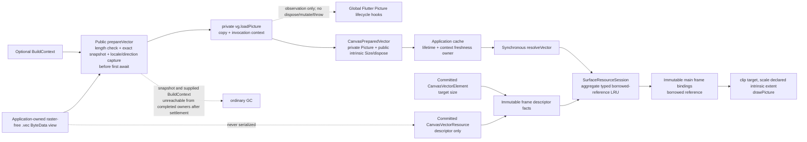

# Design: Prepared Vector Element And Resource

## Source Inputs

- Prior Design: none.
- Research: `docs/history/research/2026-08-07-full-svg-node-resource-surface.md` is repository-local factual input describing the closed element/resource/frame/schema surfaces at commit `985208d8`; every affected current owner, registered semantic projection, and direct proof consumer named below was re-inspected at design baseline `5816c2f8b73629c0291c1f3471a77ee4b282ff86` before selection.
- PLAN: none.
- Accepted ADRs: ADR-0001 owns contracts-led dependency direction; ADR-0004 owns the one Schema v1 reader and distinct codec-local/store sinks; ADR-0005 owns surface-session resource resolution and assigns mutable numeric cache policy to `docs/contracts/cache_policy.md`; ADR-0006 owns geometry/spatial reliability; ADR-0007 owns immutable frame capture/binding/paint; ADR-0008 owns selection/interaction/frame separation; ADR-0011 owns the narrow surface lifecycle adapter and retained output; ADR-0013 owns semantic documentation, registries, generated projections, graph closure, and external proof. Their current semantic owners, not the ADR prose, remain implementation authority.
- Other: Product decisions accepted on 2026-08-08 require one `CanvasVectorElement` with `resourceId`, `size`, optional `naturalSize`, and inherited common fields; one `CanvasVectorResource` with the existing base descriptor fields and `appKey` source; descriptor-only engine JSON with no `.vec` bytes; vector support in background and content locations; `vg.loadPicture` preparation from caller-supplied `ByteData`; a synchronous `resolveVector` frame callback; an engine-defined `CanvasPreparedVector` containing `ui.Picture` and intrinsic `Size`; application ownership, caching, stale-result disposal, and idempotent disposal; a session-local borrowed-reference cache keyed by resolver generation, resource id, and resource revision that never disposes the Picture; synchronous release of every engine borrow before owner disposal; intrinsic-to-element scaling and `drawPicture` painting without `ui.Image` conversion. The input ownership decision accepted later on 2026-08-08 requires `prepareVector` to check `ByteData.lengthInBytes <= 32 MiB`, then synchronously copy only the supplied view range before its first `await`; `vg.loadPicture` consumes that copy, the source may be mutated or released immediately after the call returns, and the copy is retained in neither `CanvasPreparedVector` nor any cache after preparation settles. The lifecycle-hook decision accepted on 2026-08-08 permits global Flutter Picture lifecycle hooks only as observers: a hook that receives a Picture created during preparation must return normally and must not dispose or mutate it. Such interference is unsupported. Under that non-interference condition, raw Picture is unavailable through the engine's supported public API and `CanvasPreparedVector` is the sole liveness owner. The relationship-error decision accepted later on 2026-08-08 keeps public `missingResourceReference` for an absent id and adds one family-neutral public `resourceKindMismatch` for an existing descriptor of the wrong kind, both at the referencing element path. The input-scope decision accepted on 2026-08-09 supports only precompiled raster-free `.vec` content: the application will not supply SVG/`.vec` containing embedded PNG/JPEG or other raster-image commands. Embedded-raster input is outside the supported contract, and the engine must not fork or patch `vector_graphics`, intercept process-global Flutter errors, or add a duplicate parser/recognizer merely to detect it. Mandatory material behavior and ownership are fixed by those decisions. Private identifiers, file count, row/helper decomposition, cache implementation details below the locked key/lifecycle, and verification fixture organization remain open.
  The public-equality decision accepted on 2026-08-09 requires `CanvasPreparedVector` to use default identity equality: every successful preparation is a distinct lifecycle owner, distinct wrappers compare unequal even when their public intrinsic sizes match, and `==`/`hashCode` never depend on intrinsic size or mutable live/disposed state. Changing to value equality later remains a public API behavior change.
- External evidence: Official `vector_graphics` 1.2.3 and `vector_graphics_codec` 1.1.13 sources were inspected on 2026-08-08 and re-inspected on 2026-08-09. `vg.loadPicture(BytesLoader, BuildContext?, ...)` returns `Future<PictureInfo>`; `PictureInfo` carries `picture` and `size`; the runtime adapter calls `decodeVectorGraphics`; and the codec processes one caller-provided buffer through a non-recursive tag loop. `vector_graphics` captures effective `Locale` and `TextDirection` synchronously from the optional context or `PlatformDispatcher` before loader continuation (`vector_graphics` 1.2.3 `lib/src/vector_graphics.dart:679-700`), then calls `loader.loadBytes(context)`; actual invocation-time rendering and post-settlement context non-retention therefore require direct evidence rather than inference from caller cache keys. The advertised `vg.loadPicture(onError:)` callback is not wired to embedded-raster decode failures in the inspected implementation: the codec invokes `onImage` without forwarding that callback (`vector_graphics_codec` 1.1.13 `lib/vector_graphics_codec.dart:1001-1007`), the listener's image method shadows the stored callback with a separate nullable parameter (`vector_graphics` 1.2.3 `lib/src/listener.dart:761-813`), and an asynchronous image failure can be reported through process-global `FlutterError` while the Future completes with omitted raster content. The same listener catches synchronous codec failures and wraps them as private `VectorGraphicsDecodeException` (`listener.dart:56-58`, `:133-138`, `:897-910`), while a later asynchronous selected-upstream step may complete the returned Future with another error; the engine therefore cannot reliably reconstruct a system-versus-input subtype from upstream error objects. Variable-length tables, command tags, and ids are inline in the caller buffer, and the runtime performs no external-reference lookup, but it exposes no stable decoded-command limit and some semantic/ordering checks are debug-only assertions. Release-mode rejection is directly established only for inputs such as a too-short/wrong-magic/unsupported-version header, an unknown top-level tag, or a truncated field access that throws. Local Flutter SDK inspection also establishes that `PictureRecorder.endRecording()` invokes public global `Picture.onCreate` with the new Picture before returning it, while `Picture.debugDisposed` is assertion-only; the engine therefore cannot prevent or reliably detect a hook that destroys a Picture during preparation. The selected admission policy validates a package-owned 32 MiB per-call ByteData-view limit, snapshots the exact admitted view before the first await, maps error completion of the selected upstream Future to the engine failure taxonomy without claiming a lost upstream system/input distinction, accepts supported raster-free in-limit streams that the release upstream decoder accepts when intrinsic size is valid, and explicitly does not claim exhaustive binary validity, a hostile-content sandbox, an exact decoded-memory bound, embedded-raster support, or resilience to mutating/throwing global Picture lifecycle hooks. No supported public upstream seam can atomically recognize the unsupported raster commands, so the design relies on the explicit caller input contract instead of a fork, global error interception, or duplicate parser. The package result remains behind the engine-owned public result.
- Authority precondition: `architecture/decisions/README.md` currently says the next identifier is already-used `ADR-0001` while its catalog contains ADR-0001 through ADR-0015. The design does not edit that owner. The future contract must resolve the contradiction atomically by correcting the next identifier to ADR-0016, creating ADR-0016 with its catalog and concern entries, and advancing the next identifier to ADR-0017 in the same implementation change.

## Target Contract Classification

Profile: BEHAVIOR_CHANGE

Obligations: `PUBLIC_API_CHANGE`, `SEAM_MIGRATION`, `SEQUENCED_MIGRATION_AND_RETIREMENT`, `NEGATIVE_PROOF_AND_FIXTURE_QUARANTINE`, `TEMPORAL_SURFACE_CLOSURE`, `ALL_OR_NOTHING_FAILURE_BOUNDARY`, `SOURCE_OF_TRUTH_SINGULARITY`

ADR Impact: create

## Repository Evidence

- `lib/src/contracts/public/canvas_element.dart:12` / public element vocabulary: `CanvasElementKind` is the closed current element-kind owner -> add the vector kind at this owner and migrate every exhaustive consumer.
- `lib/src/contracts/public/canvas_element.dart:18` / common element contract: transform, opacity, hit padding, flags, revision, and metadata are owned once by `CanvasElement` -> the vector element inherits rather than copies common semantics.
- `lib/src/contracts/public/canvas_element.dart:57` / sized resource-backed precedent: the image element already owns `resourceId`, `size`, and optional `naturalSize` with boundary validation -> use the same sized-node value semantics while keeping vector rendering distinct.
- `lib/src/contracts/public/canvas_resource.dart:12` / public resource descriptor: `CanvasResource` owns id, source, content hash, byte length, and metadata -> the vector subtype adds no duplicate source or byte payload.
- `lib/src/contracts/public/canvas_resource.dart:47` / current resource variant: only `CanvasImageResource` exists and only it adds MIME type -> the vector subtype remains a separate typed descriptor with no image MIME-field heuristic.
- `lib/src/contracts/public/canvas_resource.dart:98` / resolver contract: the application resolver is currently a synchronous image callback -> add a synchronous vector callback and keep asynchronous preparation outside this frame seam.
- `lib/src/store/family_tables.dart:69` / committed element rows: six typed family maps own committed family-specific state -> vector needs a peer committed family row, not metadata or an image-family overload.
- `lib/src/store/family_tables.dart:78` / resource-reference owner: reference lookup currently examines only image rows -> the owning lookup must cover image and vector rows for removal and final document validation.
- `lib/src/contracts/internal/frame_facts_port.dart:44` / placement facts: one location enum distinguishes background from content -> vector uses the existing order/location path rather than a parallel background renderer.
- `lib/src/contracts/internal/frame_facts_port.dart:46` / immutable frame facts: common and family-specific facts are captured behind the dependency-low frame port -> vector facts and typed resource-descriptor kind cross this same boundary.
- `lib/src/contracts/internal/frame_facts_port.dart:134` / frame resource descriptor: current descriptor facts are image-shaped through nullable MIME type and have no resource kind -> binding needs a typed resource variant so image/vector matching is not inferred from nullable fields.
- `lib/src/codec/schema_v1_encoder.dart:62` / schema resource writer: the codec exhaustively writes only image descriptors and never owns external bytes -> add a vector descriptor branch with no byte-payload field.
- `lib/src/codec/schema_v1_encoder.dart:90` / schema element writer: the codec exhaustively writes all element families -> vector is a canonical Schema v1 family with common fields plus resource id, size, and optional natural size.
- `lib/src/codec/schema_v1_reader.dart:552` / schema resource reader: resource admission is currently image-only at one canonical reader boundary -> extend that boundary with typed vector import facts while preserving unknown-kind rejection.
- `lib/src/codec/schema_v1_reader.dart:694` / schema element reader: both background and layer elements use the same element reader -> one vector wire branch covers both placements.
- `lib/src/codec/schema_v1_reader.dart:1515` / element discriminator reader: wire-to-kind mapping is closed and rejects unknown kinds -> add only the `vector` discriminator without weakening rejection.
- `lib/src/frame/render_element_record.dart:12` / duplicated frame discriminator: `RenderElementFamily` manually repeats every current `CanvasElementKind`; `RenderElementRecord` stores both that family at `:143` and the already-sealed family-specific `RenderElementRow` at `:151`, with an exact kind-to-family mapping at `:180` -> retire the enum, stored field, mapping, and copied constructor values instead of adding a seventh mirrored branch; the sealed render row remains the frame-owned payload variant.
- `lib/src/frame/render_element_record.dart:126` / immutable painter input: record transform, opacity, bounds, resource id, and sealed family row are captured before paint -> add a vector render row carrying resource id, size, and optional natural size, and let resolved vector assets enter only through immutable frame asset bindings.
- `lib/src/frame/selection_decoration_planner.dart:168` / selection-chrome policy consumer: single-element stroke placement currently switches on the duplicate `RenderElementFamily` at `:228`; image/rect box rows use `outsideBox`, while path/text/stroke/line rows use `boundsOutline` -> migrate the policy to the sealed render row and classify vector as sized-box `outsideBox` without another family enum.
- `lib/src/frame/paint_asset_binding_service.dart:20` / asset-binding owner: frame code resolves unique record resources after records and immutable descriptor facts are known -> this remains the only resolver/session entry from frame.
- `lib/src/frame/main_frame_record_painter.dart:23` / record painter: family painting is one exhaustive switch and image uses `drawImageRect` -> add a vector branch that applies local scaling and calls `drawPicture`, not the image branch.
- `lib/src/frame/ordinary_paint_planner.dart:168` / background/content paint admission: ordinary planning already admits both committed placement kinds -> vector support requires no second planner or background-specific family.
- `lib/src/geometry/geometry_policy.dart:154` / bounds owner: sized box bounds are already derived from committed `size` -> vector bounds, selection, and spatial admission use element size without resolver or intrinsic-size reads.
- `lib/src/geometry/hit_test_policy.dart:103` / exact hit owner: image, rect, and text use the box-hit branch -> vector uses the same sized-box interaction policy rather than replaying Picture geometry.
- `lib/src/resources/surface_resource_session.dart:16` / session policy owner: cache, resolver generation, budget, suppression, and resolver outcomes intentionally remain coordinated in one owner -> borrowed vector-reference policy belongs here.
- `lib/src/resources/surface_resource_session.dart:46` / synchronous resolution: current frame resolution is synchronous and returns a resolved asset or bounded placeholder -> vector lookup remains synchronous and has no pending state or completion repaint.
- `lib/src/resources/surface_resource_session.dart:183` / resolver replacement: generation replacement synchronously clears session cache state -> vector borrowed references must clear in the same call before it returns.
- `lib/src/resources/resource_cache.dart:8` / internal cache identity: resolver generation, resource id, and resource revision key each entry, while the cached value is not part of identity and target invalidation at `:85` removes every matching entry for only the requested resource id -> one prepared wrapper may be borrowed through multiple resource ids/sessions, so target release cannot authorize disposal of its other publications; the engine clears its internal keys while the application aggregates only its own resource-id/attached-surface publications.
- `lib/src/contracts/internal/resource_session_invalidation_sink.dart:3` / internal invalidation seam: the current image-named methods are the runtime-to-session invalidation port -> replace the image-only naming with resource-generic operations that clear both asset families and frame-output borrows.
- `lib/src/surface/canvas_surface_widget.dart:73` / resolver replacement route: active surface replacement calls the session synchronously -> resolver replacement can close borrowed references before the old owner disposes them.
- `lib/src/surface/canvas_surface_widget.dart:164` / detach route: surface detach drops the active session and clears surface frame output -> preserve a single synchronous release boundary for session-cache and retained-frame borrows.
- `lib/src/surface/surface_frame_output_cache.dart:83` / retained output owner: the surface cache retains main/overlay frame outputs until clear or replacement -> vector release must include this owner, not merely the session cache.
- `docs/contracts/resources.md:50` / current semantic owner: committed store, runtime resource orchestration, resource session, and public resolver ownership are assigned here -> future implementation must update this contract rather than leaving vector lifecycle only in code.
- `docs/contracts/resources.md:91` / resource/frame boundary: immutable descriptor facts and `PaintAssetBindingService` isolate resolver access from planning and painters -> vector keeps the same dependency direction.
- `docs/contracts/resources.md:150` / accepted-delivery failure policy: resource-session invalidation is post-acceptance work whose failure is contained and cannot rethrow, roll back, or block an accepted edit/load/dirty result; runtime drops a failed target before publication continues -> vector reference retirement must be non-fallible, precede any fallible notification, and preserve this compatibility rather than inventing a new post-install failure.
- `docs/contracts/resources.md:228` / v1 resource boundary: resolver calls are synchronous and `docs/contracts/resources.md:239` forbids engine IO/file/network/asset loading -> `prepareVector(ByteData)` is caller-fed decoding before attachment, not engine resource IO.
- `docs/contracts/validation_limits.md:25` / package validation boundary: current v1 inputs require explicit package-owned limits -> preparation must reject oversized vector bytes before invoking the upstream decoder.
- `docs/contracts/frame_rendering.md:209` / opacity and layer policy: `docs/contracts/frame_rendering.md:212`-`:216` require any future `saveLayer` effect to be record-explicit and contract-guarded -> vector group opacity must replace the stale retired-metric wording with a directly observable per-record layer budget.
- `docs/contracts/codec_boundary.md:68` / codec-local explicit decode owner: non-exported Schema v1 decode helpers materialize public DTOs in a decoder-owned sink and perform their own relationship validation -> wrong-kind rejection must close this sink independently of runtime/store load without adding those helpers to the public barrel.
- `lib/src/contracts/public/canvas_errors.dart:4` / public data-failure vocabulary: the closed error-code set already owns `missingResourceReference`, and current relationship validation reports that code at `image.resourceId`, but the first typed resource family introduces a distinct observable state in which the id exists with the wrong descriptor kind -> retain `missingResourceReference` only for an absent id and add one family-neutral `resourceKindMismatch` code for an existing wrong-kind descriptor, both at the referencing element path (`image.resourceId` or `vector.resourceId`).
- `docs/contracts/cache_policy.md:43` / numeric cache policy owner: ADR-0005 assigns current cache key, capacity, eviction, and probes here while `docs/contracts/resources.md:125` currently repeats them -> replace the ledger row with aggregate image/vector policy and remove the numeric duplicate from the resource lifecycle contract.
- `docs/contracts/operation_matrix.md:36` / resource-operation owner: `markResourceDirty` and `markAllResourcesDirty` currently describe target/all delivery and rollback only through the active session cache, while `docs/contracts/resources.md:150` owns post-acceptance failure containment -> update the matrix so non-fallible synchronous retirement of matching session/output references precedes notification/publication, target release remains scoped to the requested resource id in the addressed session, accepted outcomes still publish when later notification fails, and rejected/no-op operations leave both owners unchanged.
- `docs/contracts/public_api_v1.md:565` / public surface lifecycle: the surface resolver is app-owned and synchronous -> vector extends that same attachment contract after preparation.
- `docs/contracts/schema_v1.md:67` / wire compatibility: unknown element kinds are rejected, while the canonical resource reader independently rejects an unknown resource kind at `lib/src/codec/schema_v1_reader.dart:566` -> adding known vector kinds preserves both rejections while older readers remain unable to read vector documents.
- `docs/_registry/public_api_v1.yaml:1` / intentional public-name mirror: the registry is a machine-readable exported-name inventory while semantic signatures remain contract-owned -> add vector public names and preserve exact export parity.
- `tool/guardrails/src/public_api_checks.dart:14` / mirror verifier: the public export check compares effective exports with the registry in both directions -> this direct verifier remains the registry-parity owner and must consume the updated inventory.
- `test/contracts/internal_seam_shape_test.dart:270` / existing structural proof consumer: the guardrail currently locks the exact image-named invalidation method list -> delete that private method inventory and retain only stable dependency/narrow-boundary assertions; retirement-name absence is one-time migration evidence, not a permanent private-token contract.
- `test/resources/resource_resolver_adapter_shape_test.dart:14` / existing private-form mirror: the guardrail copies exact image-only request/result names, fields, and constructor text -> delete those shape assertions and retain the stable resource-owned dependency boundary; image/vector request/result behavior belongs to direct session outcomes rather than this source mirror.
- `tool/guardrails/src/guardrail_executor.dart:319` / existing boundary proof registration: both shape tests are consumers of `resources.resolver_boundary_owned_by_surface_session` -> keep that guardrail centered on the stable ownership/import boundary, not either the old or replacement adapter's private inventory.
- `tool/guardrails/src/guardrail_executor.dart:333` / second registration of the adapter shape test: `resources.app_key_only` currently also credits `resource_resolver_adapter_shape_test.dart` for the image/appKey request form that this design removes -> delete only that stale proof-path entry while retaining `test/api_contract/public_readable_union_variants_test.dart` as the direct external appKey behavior proof.
- `test/api_contract/public_readable_union_variants_test.dart:28` / stable appKey oracle: an external root-barrel consumer constructs and pattern-reads `CanvasResourceSource.appKey` -> this behavior already owns the appKey-only proof after the private adapter inventory is removed.
- `docs/architecture/02_package_boundaries.md:178` / dependency direction: stable public declarations live in contracts/public and API files export or implement public entry points -> keep `CanvasPreparedVector` and resolver types contract-owned while the `vg.loadPicture` helper implementation stays behind the API boundary.
- `docs/contracts/public_api_v1.md:208` / public equality owner: lifecycle-owning public objects use default identity equality, and `:237` requires every future public type to select a policy before implementation -> classify `CanvasPreparedVector` as identity-equality before adding it and verify behavior without reading mutable liveness.
- `architecture/decisions/ADR-0005-surface-owned-resource-resolution.md:38` / retained resource decision: descriptors remain committed while resolver identity and resolved-asset cache state remain per active surface -> vector extends, rather than relocates, this ownership.
- `architecture/decisions/ADR-0007-immutable-frame-planning-and-caches.md:44` / retained frame decision: painters consume completed immutable outputs and never read live resolver or runtime state -> borrowed prepared vectors must be bound before paint.
- `lib/src/interaction/interaction_read_port.dart:315` / duplicated interaction discriminator: `InteractionElementFamily` manually repeats every current `CanvasElementKind`; `ContextTargetReadFacts` already carries `elementKind` at `:346` beside duplicate `family` at `:351`, and `TextCommitGuardReadFacts` repeats `family` at `:391` beside `targetKind` -> remove both duplicate family values and use `CanvasElementKind` as the sole context-target/stale-guard discriminator.
- `lib/src/runtime/runtime_interaction_read_mapping.dart:100` / exhaustive interaction mapping: one switch maps `CanvasElementKind` to the duplicate family and another at `lib/src/runtime/runtime_interaction_read_mapping.dart:120` reconstructs public element snapshots -> retire the first mapping and add vector snapshot construction to the second.
- `docs/contracts/interaction_engine.md:374` / context-action owner: content targets carry immutable public element snapshots, and `docs/contracts/interaction_engine.md:381`-`:393` own request stale guards -> content vectors follow that route while text commits continue checking `CanvasElementKind.text`.
- `test/store/schema_v1_store_import_test.dart:32` / store private-shape mirror: image-only negative assertions would become false or preserve a copied private inventory -> scope them to stable store ownership outcomes.
- `test/codec/schema_v1_import_emitter_test.dart:96` / codec private-shape mirror: the exact `_resourceForDescriptor` return-type assertion would become false or preserve a copied private inventory -> replace it with stable reader/emitter behavior.
- `test/frame/fixtures/frame_record_painter_boundary_fixture.dart:76` / frame one-family negative mirror: an exact `resolveImage` token ban does not express the typed resource boundary -> replace it with stable import/type/owner evidence and direct image/vector behavior.
- `test/surface/fixtures/no_live_runtime_read_in_painters_fixture.dart:96` / painter one-family negative mirror: an exact `resolveImage` token ban would wrongly reject or fail to cover the vector route -> preserve the no-live-runtime-read boundary without a family token inventory.
- `test/surface/fixtures/surface_resource_session_lifecycle_fixture.dart:407` / lifecycle one-family mirror: image-only cache/session assertions do not close aggregate image/vector borrowing -> migrate the fixture only where it serves direct lifecycle outcomes.
- `docs/_registry/sections.yaml:201` / registered owner/proof relationships: resource, interaction, frame, cache, guardrail, and test section entries own navigation from semantic owners to diagrams and evidence -> update the exact affected section ids listed in Source-Of-Truth Impact rather than leaving registry work to rediscovery.
- `docs/tool/check_docs.dart:1` / structural-check boundary: documentation checks intentionally do not parse semantic Markdown or Mermaid wording -> semantic contract/diagram transitions require direct content review in addition to structural registry/generated checks.
- `docs/contracts/diagnostics.md:77` / codec diagnostics route: schema decode/validation and encode DTO rejection record the existing `CanvasDataException` through the codec bridge -> vector schema/kind/reference failures use this existing boundary route, not a node-owned writer.
- `docs/contracts/diagnostics.md:81` / interaction diagnostics route: reliability events are recorded by `InteractionEngine` from bounded query/request facts -> a content vector participates only when it triggers an existing interaction reliability event; element kind does not create a new diagnostic family.
- `docs/contracts/diagnostics.md:83` / resource diagnostics boundary: resource-session budget/protection and paint-budget paths are explicitly not `DiagnosticsHub` writes -> preparation, resolver, placeholder, cache, and vector paint outcomes add no resource/frame diagnostic writer without a separate approved route.

## Design Form Candidates

### Candidate A — explicit preparation plus engine-owned prepared value and synchronous borrowed resolution

Add a public asynchronous `prepareVector(ByteData, {BuildContext? context})` helper for precompiled raster-free `.vec` that checks the view length, snapshots the exact admitted view before its first await, captures invocation-time effective locale/text direction, retains no context after Future settlement, uses `vg.loadPicture` only over that snapshot, converts the package result into app-owned `CanvasPreparedVector`, and completes before surface attachment. Only the helper can create the engine-defined prepared value. Add synchronous `resolveVector(CanvasVectorResource)` returning it. Keep a bounded session cache of borrowed references under resolver-generation/resource/revision identity, include retained frame outputs in synchronous release, and render with intrinsic scaling plus `drawPicture`. Embedded-raster commands are unsupported; this form adds no dependency fork, process-global Flutter error interception, or duplicate parser/recognizer.

Material obligations unique to this form are the public preparation/result API, explicit app/engine borrow lifecycle, borrowed-reference cache and release sequence, and a direct `vector_graphics` runtime dependency hidden from public signatures. Each is independently required by the accepted product decisions. The application already owns resolver publication, so it tracks only the resource ids and attached surfaces/runtimes through which it returns the same wrapper and waits for their target or aggregate release; the engine owns and clears its generation/revision keys, while a reverse wrapper-to-key index would duplicate application publication truth without strengthening disposal safety. Public disposed-state inspection, production injection seams created only for tests, a permanent recognizer for retired private identifiers, and a success-result taxonomy for release are deliberately absent because internal liveness admission, real upstream/public witnesses, a non-fallible target-resource no-borrow postcondition plus application-owned aggregate publication release, direct two-family/two-owner behavior, and one-time migration inspection preserve the accepted outcomes with fewer durable obligations. This form preserves the synchronous frame and immutable painter boundaries.

### Candidate B — asynchronous vector resolver with pending session state

Make `resolveVector` return a future, paint a pending placeholder, deduplicate in-flight work in `SurfaceResourceSession`, discard stale completions, and schedule completion repaints.

This form can decode lazily, but it adds pending state, completion callbacks, generation races, repaint scheduling, and asynchronous resolver reentrancy semantics to the frame lifecycle. The user explicitly rejected this material form on 2026-08-08; it is not an implementation option for the future contract.

### Candidate C — expose `vector_graphics.PictureInfo` directly

Prepare before attachment and keep resolution synchronous as in Candidate A, but return `PictureInfo` directly from the helper and resolver.

This removes the engine-owned result declaration, but makes the public API and lifecycle contract depend on a third-party type, leaves idempotent disposal outside engine semantics, and exposes upstream naming/version changes to package consumers. The user explicitly rejected third-party public-type leakage and selected an engine-owned value on 2026-08-08.

### Candidate D — publicly construct prepared values from arbitrary Pictures

Keep Candidate A's helper and synchronous resolver, but add a public `CanvasPreparedVector(picture:, intrinsicSize:)` constructor that adopts any caller-created Picture.

This form is not required by the accepted engine-type/application-instance ownership decision: the application can own, cache, resolve, and dispose the instance returned by `prepareVector` without manufacturing one. It would add a second creation boundary, arbitrary-Picture liveness and extent preconditions, ownership-transfer failure semantics, and constructor-only proof. Candidate A therefore keeps prepared construction package-private and lets the public helper be the single creation boundary.

Candidate A is the only form that preserves every accepted product decision without adding a second creation path. Candidate B changes the rejected temporal model; Candidate C changes the rejected public ownership boundary; Candidate D adds unsupported public surface and ownership policy. A no-session-cache variant would remove an obligation but contradicts the accepted requirement that the active session retain borrowed references under the stated identity and release them synchronously. A borrowed-input variant would avoid one copy but contradicts the accepted immediate-mutation/release guarantee. A `vector_graphics` fork, global Flutter error interceptor, or duplicate `.vec` recognizer would add dependency ownership, process-global side effects, or a second parser only to support content the application explicitly excludes; the raster-free contract strictly dominates those forms for the accepted product. Variants that publish `isDisposed`, add test-only production injection, permanently recognize retired private names, or distinguish successful `released` from `alreadyUnowned` are strictly dominated by Candidate A: the same idempotence, admission, cleanup, retirement, and no-borrow postconditions are directly observable without those obligations or downstream branching. Reusing `missingResourceReference` for an existing wrong-kind descriptor is not a dominating simplification: vector introduces that distinct real state now, its recovery differs from an absent id, and collapsing it would make the public code semantically false and force consumers to infer from message text. One family-neutral `resourceKindMismatch` closes that state without per-family codes or a second validation subsystem. The selected form therefore passes Solution Proportionality without speculative subsystems.

## Selected Form

Select Candidate A as one vertical vector family through the existing public-contract, store, codec, geometry, frame, resource-session, surface, and documentation owners.

The public model adds `CanvasElementKind.vector`, `CanvasVectorElement`, `CanvasVectorElementUpdate`, `CanvasVectorResource`, `CanvasPreparedVector`, `prepareVector`, and synchronous `CanvasResourceResolver.resolveVector`. `CanvasVectorElement` has exactly the accepted resource id, validated size, optional validated natural size, and inherited common fields. `CanvasVectorResource` adds no fields beyond the resource base. `CanvasPreparedVector` has no public generative or factory constructor; only successful `prepareVector` may create it. The returned value is application-owned and privately contains the decoded Picture while publicly exposing only validated intrinsic size and idempotent `dispose()`; disposed state is package-internal lifecycle state, not public API. Raw `ui.Picture` access is absent from the engine's supported public surface. Global Flutter Picture lifecycle hooks are external Flutter surfaces and are supported only for observation; they must return normally and must not dispose or mutate Pictures created during preparation. Subject to that explicit non-interference precondition, the application cannot dispose the native Picture behind the wrapper's liveness state except through `CanvasPreparedVector.dispose()`. A narrow non-exported engine-access seam retrieves the live Picture only for resource binding/paint after session validity admission; it does not transfer ownership or become a second supported liveness source. The Picture coordinate contract is origin `(0, 0)` with the upstream intrinsic size as its declared source extent; painter-owned target clipping prevents vector commands from escaping the element box. `prepareVector` is the canonical and sole public `.vec` creation path and the only engine helper that uses `vector_graphics`. Its supported input is a precompiled raster-free `.vec`; embedded-raster commands are outside the contract and are neither recognized nor repaired by the engine.

`CanvasPreparedVector` uses default identity equality. Each successful preparation produces a distinct lifecycle owner that compares equal only to itself, even when another wrapper was prepared from equivalent bytes and exposes the same intrinsic size. Its public fields and mutable live/disposed state do not participate in `==` or `hashCode`; changing to value equality later is a public API behavior change.

`prepareVector` is asynchronous but is not part of frame resolution. On synchronous entry it reads `ByteData.lengthInBytes` and rejects a value above `32 * 1024 * 1024` with `CanvasDataException(code: fieldMaxLength, path: 'vector.bytes')` before snapshot allocation or upstream invocation. For an admitted value it copies exactly `offsetInBytes .. offsetInBytes + lengthInBytes` into independent contiguous storage before the first `await`; prefix/suffix bytes from the underlying buffer are excluded. It calls `vg.loadPicture` during that synchronous invocation so upstream fixes the effective locale and text direction from the optional context or platform defaults before its loader continuation; the internal bytes loader ignores the context passed to `loadBytes` and returns only the independent copy. The source buffer has no borrow lifetime: immediately after `prepareVector` returns its Future, the caller may mutate it or stop retaining it without affecting decode. Unmounting or changing the supplied context after return cannot change the already captured locale/direction, although the upstream Future may transiently hold call state until settlement. Neither the context nor the function-scoped snapshot is stored in `CanvasPreparedVector`, the application-facing resolver value, the session borrow cache, or a frame output, and neither has a strong reference from an engine or completed-upstream owner after preparation settles; ordinary GC may reclaim them without a collection-timing guarantee.

After awaited decode, `prepareVector` validates the returned intrinsic size with the existing finite/positive/maximum size policy at `vector.intrinsicSize` and returns `CanvasPreparedVector`. It performs no file, asset-bundle, network, external-reference, or recursive source lookup. Any error completion from the awaited selected-upstream Future—including the named too-short/wrong-magic/unsupported-version header, unknown top-level tag, and truncated-field witnesses—maps to `CanvasDataException(code: invalidVectorData, path: 'vector.bytes')` without exposing the upstream object and publishes no prepared value. This is an explicit boundary classification of the selected Future channel, not a reconstructed Dart system/input distinction; the engine makes no identity/stack-preservation promise for arbitrary failures originating inside upstream. Failures before upstream invocation or after successful upstream return are not assigned a new stable public taxonomy by this feature. Supported raster-free in-limit streams otherwise accepted by upstream release mode are not independently revalidated by the engine. Embedded-raster input is unsupported: because the official upstream callback does not reliably report that failure family, the helper makes no success, rejection, cleanup, or error-projection promise for such input and does not install a global Flutter error handler, dependency fork, or duplicate binary recognizer. The byte limit bounds the snapshotted parser input but is not represented as exhaustive binary validation, an exact node-count, or a decoded-memory guarantee; the per-call copy adds up to 32 MiB of transient memory. If a Picture exists but intrinsic validation fails, the helper disposes that exact unpublished Picture before propagating the validation error. The caller owns freshness checks: an obsolete completion is disposed immediately and never installed in its resolver cache. The surface is attached only after all required values are prepared and published by the caller's synchronous resolver.

The application remains the lifetime owner of every prepared result. A prepared value exposes `Size get intrinsicSize` and idempotent `void dispose()`; it exposes no public liveness getter or raw Picture getter. Under the lifecycle-hook non-interference precondition, `dispose()` first retires the wrapper's private Picture reference, then disposes that underlying Picture at most once; repeated calls are no-ops. The non-exported engine accessor observes the package-internal live/disposed state, rejects a disposed value, and returns the private live Picture only to binding/paint code; no engine public or resolver-facing value receives it. A hook that destroys, mutates, or throws while observing a preparation Picture violates the supported input/environment contract; preparation/result/session behavior after that interference is unspecified and is not repaired through debug-only state. `SurfaceResourceSession` retains images and prepared vectors in one aggregate LRU borrow cache keyed by `resolverGeneration + resourceId + resourceRevision`, capped at 1024 total entries across both families; cache hits do not call the resolver. The existing 64 MiB decoded-byte cap continues to count only image entries by `width * height * 4`; vector borrow entries have zero engine byte weight because the application owns Picture allocation and no reliable decoded size exists. Any write that exceeds 1024 aggregate entries, or makes counted image bytes exceed 64 MiB, evicts oldest aggregate entries until both invariants hold; vector entries can evict images and images can evict vectors. An oversized image remains returned but unretained under current policy. A disposed value returned by the resolver through supported wrapper disposal, or discovered in a cache entry before binding, is invalid: the session drops/does not admit it, never asks the internal accessor for its Picture, emits the bounded invalid-prepared placeholder, suppresses another callback for that key in the same frame, and retries on a later frame under the ordinary resolver policy. Eviction, target/all invalidation, document replacement, resolver replacement, detach, runtime swap, drop, and dispose remove references without invoking `CanvasPreparedVector.dispose()` or `ui.Picture.dispose()`.

Borrow closure includes both the session cache and any retained `MainFramePaintOutput` asset bindings. The image-named internal invalidation seam is replaced with resource-generic target/all operations. `SurfaceResourceSession` receives a narrow synchronous surface release callback so its invalidation, resolver replacement, reset, and drop paths can clear retained frame-output asset bindings as well as session cache entries before returning. Reference removal happens before any notification or public observation. Target invalidation closes the requested resource id across its matching internal generation/revision cache and output identities in the addressed session; it does not assert that the same wrapper is absent under another resource id or in another session. The application never tracks those internal keys. It may call `CanvasPreparedVector.dispose()` only after every resource id and attached surface/runtime through which it published that wrapper has completed target release, or after all-resource invalidation, resolver replacement, or surface detach has synchronously cleared the corresponding sessions. If one prepared value is shared across multiple resource ids or surfaces, every such application-owned publication must complete that release sequence first.

The release callback is a total, non-fallible internal reference-retirement step with one postcondition and no result taxonomy: return means the matching identity has no retained output borrow. For the active surface identity it removes the matching output before any listener notification; for a stale session/runtime/surface identity it proves that identity cannot retain an output and returns without mutation. Reference retirement itself invokes no resolver, public observer, or other fallible notification. Any notification after removal is post-acceptance delivery and its failure is contained under the existing runtime policy without rethrowing, rolling back, blocking publication, or revoking the no-borrow postcondition. No accepted edit, load, or dirty-resource operation exposes a new failure after its irreversible mutation, and no release path may return while a matching borrow remains.

Prepared output is context-sensitive when `.vec` text is present. The application includes effective locale/text direction in its own preparation-cache identity. When either value changes, it prepares the replacement first, publishes the new app-cache/resolver value, releases every resource identity through which the old wrapper is published—using target invalidation for every alias or resolver-generation/all-resource replacement for the aggregate—waits for every active borrowing session/output release to return, and only then disposes the old wrapper. Engine session keys remain the accepted resolver-generation/resource-id/resource-revision tuple; context freshness and wrapper-alias tracking are application-owned publication concerns rather than second engine cache keys.

Committed resource descriptors are typed image/vector variants; resource kind is never inferred from nullable MIME type. Final document admission requires every image element to reference an image resource and every vector element to reference a vector resource. The rule is checked against the final candidate document so an atomic edit may change a resource and all references in any callback order. At every relationship sink, an absent id throws `CanvasDataException(code: missingResourceReference)`, while an id whose existing descriptor has the other resource kind throws `CanvasDataException(code: resourceKindMismatch)`; both use the referencing element path, `image.resourceId` for an image element or `vector.resourceId` for a vector element. `resourceKindMismatch` is one family-neutral public code rather than image/vector-specific variants. Wrong-kind or missing references reject codec-local explicit `decodeSchemaV1Document`/`decodeSchemaV1DocumentFromJson` before their public-DTO sink returns a `CanvasDocument`, exported `encodeCanvasDocument`/`encodeCanvasDocumentToJson` before returning JSON, edit commit before install, and runtime Schema v1 load before install. The explicit decode helpers remain non-exported and absent from `docs/_registry/public_api_v1.yaml`; decoder-owned public-DTO validation and store-owned runtime-load validation are independent sinks over the same relationship rule.

Schema v1 adds element `kind: "vector"` with `resourceId`, `size`, optional `naturalSize`, and the common element fields. It adds resource `kind: "vector"` with id, `source: {kind: "appKey", key: ...}`, optional content hash, optional byte length, and metadata. No byte, base64, SVG text, or `.vec` payload field is written. Existing image documents retain their canonical shape. Current readers accept old and vector documents; older readers continue rejecting the new known-to-current kinds under their existing unknown-kind rule. No new schema version or duplicate reader is introduced.

Geometry, selection, spatial admission, hit testing, and placeholder bounds use the centered local box derived only from `element.size`. Single-vector selection chrome uses the sized-box `outsideBox` stroke placement already used by image/rect; multi-selection retains the existing union-box policy. Frame code derives that placement from the sealed `RenderElementRow`, while the duplicate `RenderElementFamily`, `RenderElementRecord.family`, and kind-to-family mapping are retired. `naturalSize` is optional persisted application information; it is neither synchronized with nor substituted for the prepared intrinsic size. Rendering clips to the centered target box, translates to it, applies independent x/y scale from the prepared declared source extent `(0, 0, intrinsicWidth, intrinsicHeight)` to exactly fill `element.size`, and calls `Canvas.drawPicture`; the target clip prevents vector commands from escaping the element box. It never calls `Picture.toImage`, `toImageSync`, `drawImage`, or `drawImageRect` for vector records. The immutable render record explicitly distinguishes ordinary primitive-alpha painting from the vector group-opacity effect without fixing a field/helper name. A full-opacity vector consumes zero engine-created offscreen layers. A partial-opacity vector consumes exactly one engine-created `saveLayer`, bounded to its centered target box, then restores; this one-layer-per-record maximum is the runtime cost budget and the frame paints every admitted vector rather than degrading opacity or substituting a placeholder when many such records are present. Direct record/painter evidence counts the actual zero/one layer behavior and bounds. The obsolete requirement to report this through the retired `frame.paint_candidates` benchmark metric is replaced in the frame contract and semantic diagrams; no retired benchmark registry, case id, or custom result schema is restored. Missing descriptor/resolver, null/throwing resolver, wrong descriptor kind, or invalid/disposed prepared value produces the existing bounded failure-placeholder class of behavior; there is no pending-preparation placeholder or completion repaint.

Content vectors also follow the existing interaction-read/context-action route: immutable `CanvasVectorElement` snapshots and bounds cross `InteractionReadPort`, while background vectors remain excluded. `CanvasElementKind` is the sole family discriminator for context target identity and stale request guards; the duplicate `InteractionElementFamily`, its stored fields, and its exhaustive mapping are retired. Text commit admission continues requiring `CanvasElementKind.text`, so vector context requests can open application-owned menus but can never enter the text-edit commit path.

Diagnostics remain boundary-owned rather than element-owned. `CanvasVectorElement`, `CanvasVectorResource`, and `CanvasPreparedVector` carry no diagnostic field, sink, or hub reference. Vector schema/kind/reference failures flow through the existing codec diagnostics bridge and record the same already-thrown `CanvasDataException`; existing interaction reliability events may include vector target facts through the current interaction route. Public `prepareVector` failures, resolver/session/cache outcomes, bounded placeholders, and vector paint outcomes remain ordinary public/resource/frame error projection with no `DiagnosticsHub` record. This design adds no diagnostics code family, writer, graph edge, public stream, or per-vector diagnostic state.

## Boundary Locks For Change Contract

Owner: Public vector DTO/result/resolver declarations, supported raster-free input contract, failure taxonomy, absence of public prepared construction/raw Picture access through the engine API, lifecycle-hook non-interference precondition, and idempotent disposal contract belong to `contracts/public`; `prepareVector`, exact-view snapshot ownership, synchronous effective locale/text-direction capture, byte admission, intrinsic validation, prepared creation, private Picture/internal liveness storage, selected-upstream-Future error mapping, and the private `vector_graphics` adapter belong behind the public API boundary. Flutter owns its process-global error reporting and Picture lifecycle hooks; the engine owns neither and installs no global interceptor. A narrow non-exported live-Picture access seam belongs to the resource binding boundary and is consumed only by engine binding/paint code after validity admission. Committed vector rows and typed resource descriptors belong to store; codec-local explicit decode/public-DTO admission, exported canonical encode admission, and runtime import event emission belong to the one Schema v1 codec reader/writer, while runtime final relationship admission belongs to store; the explicit decode helpers remain internal and are not public API. The public data-error vocabulary owns `missingResourceReference` for an absent id and one family-neutral `resourceKindMismatch` for an existing descriptor of the wrong kind; the referencing element owns the `image.resourceId`/`vector.resourceId` path. Existing codec and interaction diagnostic bridges remain owned by `DiagnosticsHub` routing, while preparation/resource/frame outcomes remain non-hub and no diagnostic state belongs to a vector DTO. Resource-operation publication/rollback effects belong to `docs/contracts/operation_matrix.md`; `CanvasElementKind`, interaction snapshot reconstruction, context target identity, and stale request guards belong to the public contract/interaction read boundary without a second interaction-family enum; box geometry and hit policy belong to geometry; immutable sealed render rows, vector sized-box selection chrome, target clipping, explicit group-opacity effect classification, the one-layer-per-record budget, asset bindings, scaling, and `drawPicture` belong to frame without a duplicate render-family enum. Synchronous resolver invocation, prepared-validity admission, borrowed-reference lifecycle, invalidation, and non-fallible target/all output retirement belong to resources; cache key/capacity/eviction/accounting/probes belong only to `docs/contracts/cache_policy.md`; surface owns the retained output cache and total identity-aware synchronous clear step. Under the non-interference precondition the application owns the returned prepared result, context-sensitive freshness, cache contents, the set of resource identities/sessions through which each wrapper is published, aggregate release-before-dispose authorization, and wrapper disposal, while the engine exposes neither raw Picture nor preparation snapshot.
  `docs/contracts/public_api_v1.md` owns the explicit default-identity equality classification for `CanvasPreparedVector`; wrapper object identity remains stable and independent of intrinsic size and mutable liveness.

In Scope: Add the public vector element/update/resource/prepared/helper/resolver surface, the explicit raster-free `.vec` input contract, helper-only prepared creation, private Picture/internal liveness containment with a non-exported engine accessor, observation-only Flutter Picture lifecycle-hook precondition, exact-view snapshotting, effective locale/text-direction freshness, bounded selected-upstream-Future failure mapping, intrinsic cleanup, and idempotent disposal; add the direct `vector_graphics` dependency without exposing its types; add package-owned vector-byte admission; add typed committed/import/frame resource variants; extend codec-local explicit decode/public-DTO admission, exported encode, final-reference validation with `missingResourceReference` for absent ids, one family-neutral public `resourceKindMismatch` for existing wrong-kind descriptors, and element-specific paths, sparse updates, projection, runtime Schema v1 load, background/content order, geometry/hit/selection/move/context-action snapshots, vector sized-box selection chrome, explicit frame effect records, target clipping, resource binding, the shared aggregate borrow cache, generic invalidation, non-fallible target/all retained-output release, application-owned aggregate wrapper-alias release, existing post-acceptance notification containment, operation-matrix effects, placeholders, painting, public exports/registry, architecture graph, current semantic contracts, the exact affected registered semantic diagrams/section contexts, sole numeric cache ledger, ADR plus catalog/concern entries, proof-registration truth, and durable verification inventory required by those behaviors. Retiring both `InteractionElementFamily` with its duplicate guard fields/mapping and `RenderElementFamily` with its stored field/mapping/copied constructor values is part of the owner-level closed-family migration. Exporting the codec-local decode helpers, a public prepared-value constructor/liveness getter, or raw Picture access through the engine API is explicitly out of scope.

Out of Scope: Raw SVG parsing; SVG-to-`.vec` compilation; embedded PNG/JPEG or other raster-image commands in supported `.vec` input; recognition, rejection, error mapping, cleanup, or recovery for such unsupported input; a fork/patched build of `vector_graphics`; process-global Flutter error interception; a feature-owned duplicate binary parser/recognizer, exact decoded command counter, hostile-content sandbox, or exact decoded-memory cap; Flutter `VectorGraphic` widget rendering; engine file, asset-bundle, network, or external-reference loading; serialized `.vec`/SVG/base64 bytes; borrowing caller `ByteData` across the first await; retaining the preparation snapshot or supplied `BuildContext` in any prepared/cache/frame owner after Future settlement; guaranteeing that the upstream Future never transiently holds its invocation argument; asynchronous `resolveVector`, pending session state, completion repaint, or lazy preparation after attach; public construction of `CanvasPreparedVector` from arbitrary Pictures; a public liveness getter or raw `ui.Picture` access through the engine API; resilience, detection, error mapping, or recovery when global Flutter Picture lifecycle hooks dispose, mutate, or throw while receiving a preparation Picture; a diagnostic field/sink/hub reference on vector DTOs, a vector-specific diagnostic code/writer/graph edge, diagnostics for preparation/resource/frame outcomes, or a public diagnostics stream; `ui.Image` rasterization by the engine; color/theme remapping; exact path-level hit testing inside the Picture; intrinsic-size synchronization into committed `naturalSize`; a new schema version; an engine-owned process-global vector cache or reverse wrapper-to-resource/session alias registry; a new public failure for post-acceptance invalidation/notification delivery; automatic ownership transfer or disposal by session/frame code. These exclusions preserve the accepted precompiled raster-free, caller-prepared, synchronous-frame outcome and the existing diagnostics routing table; private helper/file decomposition remains open.

Source of Truth: The committed store is the sole document truth for vector element fields and the vector descriptor; Schema v1 is their wire projection. `CanvasElementKind` is the sole semantic element-kind discriminator across public DTO, frame facts, geometry, and interaction context/stale guards; no `InteractionElementFamily` mirror remains. The sealed `RenderElementRow` subtypes own frame-specific immutable payload shape and may be pattern-matched directly, but no `RenderElementFamily` enum or independently stored family value mirrors them. The public preparation contract is the sole owner of the raster-free `.vec` input precondition; no runtime recognizer, dependency fork, or global-error hook duplicates that policy. Under the explicit no-hook-interference precondition, the application cache is the sole lifetime owner of a returned `CanvasPreparedVector`, and the wrapper's package-internal state plus public idempotent `dispose()` own whether its private Picture is live; application-owned resolver publication state owns which resource ids and attached surfaces/runtimes can return that wrapper and therefore the aggregate release-before-dispose decision. Session and frame-output references are derived internal-key borrows under the locked lifecycle; the engine owns and clears generation/revision keys, the application does not inspect them, and no key is proof of wrapper uniqueness or reason to add an engine reverse alias registry. The non-exported engine accessor observes but does not duplicate or mutate liveness and never exposes raw Picture through the engine API. Global Flutter Picture lifecycle hooks remain external Flutter surfaces, not supported engine liveness owners; disposal, mutation, or throwing from hooks voids the guarantees for that preparation. The preparation adapter is the sole owner of the transient exact-view snapshot and never publishes it; after settlement no engine-retained owner has a strong reference to the copy or supplied BuildContext. `CanvasPreparedVector.intrinsicSize` is the render source extent; `CanvasVectorElement.size` is the target geometry extent; `naturalSize` is optional persisted application information and does not certify either. Invocation-time effective locale/text direction determine decoded output and are application preparation-cache identity, not committed document fields or engine session-key fields. `docs/contracts/validation_limits.md` owns the 32 MiB preparation-input limit. `docs/contracts/cache_policy.md` is the sole semantic owner of cache key/capacity/eviction/probe values; `docs/contracts/resources.md` owns resolver/session/borrow/no-dispose lifecycle and references that numeric owner without repeating its row. `docs/contracts/diagnostics.md` remains the sole diagnostics routing owner: vector codec failures reuse its codec bridge, interaction reliability reuses its interaction bridge, and preparation/resource/frame outcomes remain non-hub. `docs/contracts/public_api_v1.md`, `schema_v1.md`, `codec_boundary.md`, `resources.md`, `interaction_engine.md`, `operation_matrix.md`, `frame_rendering.md`, `geometry.md`, `edit_kernel.md`, and `load_document.md` own current semantics by concern. `docs/_registry/public_api_v1.yaml` intentionally duplicates only exported-name membership for the parity checker. Its distinct consumer, update trigger, invariant, and direct verification are preserved in Source-Of-Truth Impact.
  Public equality policy is not inferred from prepared fields: `docs/contracts/public_api_v1.md` classifies the wrapper once, and runtime `Object` identity is the only equality/hash source.

Compatibility: Keep Schema v1 and every existing image/path/text/stroke/line/rect/resource behavior. Old documents encode equivalently; new vector documents are rejected by older binaries as unknown kinds. Public additions do not rename or remove existing symbols, but the added enum/error-code/sealed-family variants are a source-compatibility event for external exhaustive switches and require release communication. Existing absent-reference behavior retains `missingResourceReference`; the new, previously unrepresentable wrong-kind state adds `resourceKindMismatch` at the same referencing element path. External exhaustive `CanvasDataErrorCode` switches must adopt that new public variant. Existing post-acceptance resource delivery compatibility is preserved: invalidation/reference retirement does not make an accepted edit, load, or dirty-resource operation rethrow, roll back, or withhold publication; notification failures after non-fallible reference removal remain contained. Adding `resolveVector` to the public resolver interface requires existing resolver implementers to adopt the new synchronous method. Retiring internal `InteractionElementFamily` and `RenderElementFamily` preserves context/stale-guard and selection-chrome semantics through `CanvasElementKind` plus the sealed render row, and creates no public migration. `vector_graphics` 1.2.3 is compatible with the package's Dart/Flutter constraints and is a direct implementation dependency, but `PictureInfo`/`BytesLoader` and raw Picture are not public engine signature/access types. `CanvasPreparedVector` is publicly inspectable through intrinsicSize and disposable, but neither publicly constructible nor a public liveness/raw Picture handle. Existing applications that install global Flutter Picture lifecycle hooks remain compatible only when those hooks observe and return normally; disposal, mutation, or throw during vector preparation is a newly documented unsupported environment condition, not an engine failure class. Callers of the new vector helper must supply raster-free `.vec`; embedded-raster input has no compatibility guarantee and is not silently promoted to a supported failure class. Vector preparation views above 32 MiB are rejected before copy or decode; admitted views gain immediate source-buffer independence at the cost of one transient exact-range copy. A different effective locale/text direction requires caller-owned reprepare/publication and complete alias release. Image-only sessions retain the existing effective 1024-entry/64 MiB limits; mixed sessions share the 1024 entry cap across image and vector borrows. No document migration is required.
  `CanvasPreparedVector` enters the public API with default identity equality; callers compare stable public fields explicitly when they need semantic comparison, and any later value-equality change requires a new public API behavior decision.

Order Constraints: Preparation order is caller admission of raster-free content, synchronous view-length admission, synchronous exact-range copy before the first await, synchronous effective locale/text-direction capture without retaining context, awaited upstream decode from only that copy, selected-upstream-Future error admission, intrinsic validation, package-private prepared-value creation, release of the function-scoped snapshot at Future settlement, caller freshness check, immediate prepared-value disposal if stale, caller cache publication if current, then surface attachment. The source ByteData is unborrowed as soon as the Future is returned; invocation-time context values are fixed synchronously, and no context reference may remain after Future settlement. Context refresh order is prepare new value, publish it in the application cache/resolver, synchronously target-release every alias of the old wrapper in every active borrowing session or use aggregate resolver/all-resource release, wait for all session/output releases to return, then dispose the old value. Frame order is immutable capture, ordinary/supplement record completion with explicit opacity-effect classification, one resource pass, aggregate borrowed-cache lookup and internal liveness check, guarded synchronous resolver call on miss, returned-value validity check, aggregate borrow-cache admission/eviction, immutable asset binding, then paint. Paint order is record transform, centered target clip, target translation, intrinsic-to-target scale, zero or one record-declared bounded opacity layer, `drawPicture`, restore. Resource-operation order preserves the current irreversible point: validate and accept/install state, synchronously retire the matching session/output references through non-fallible internal removal, perform any notification under post-acceptance failure containment, publish revision/state and repaint intent, then return; stale identity proves absence without mutation, while rejected/no-op/rollback paths mutate neither retention owner. No post-acceptance invalidation or notification failure is rethrown or blocks publication. Release order is owner request to release every publishing alias/replace resolver/detach, synchronous removal from session borrowed caches and retained frame outputs before public observation/return, then and only then owner idempotent disposal. Codec-local explicit decode relationship validation occurs before its public-DTO sink returns `CanvasDocument`; exported encode validates before JSON return; final runtime document relationship validation occurs against the complete candidate before irreversible edit/load install.
  Public equality order is classification of `CanvasPreparedVector` under the existing default-identity owner before class implementation, with owner documentation and runtime equality evidence landing in the same closure.

Sequenced Migration And Retirement: Introduce resource-generic target/all invalidation and the total identity-aware retained-output release callback before changing producers. Make session/output reference removal non-fallible and complete before any notification, preserving the existing containment of post-acceptance notification failures. Then migrate runtime dirty/descriptor/document-replacement delivery, the aggregate image/vector session cache, resolver replacement/reset/drop, and surface detach/dispose/runtime-swap consumers to the generic seam, updating `docs/contracts/operation_matrix.md` with the no-borrow postcondition, target-resource scope, aggregate alias release, post-acceptance containment, and no-op/rollback outcomes. Direct image and vector evidence must prove target invalidation, all invalidation, resolver replacement, document reset, detach/drop, stale identity, notification failure after removal, same-wrapper/two-resource-ids in one session, and multi-session paths clear or have already lost the required aggregate cache/output borrows before return while preserving no-dispose and accepted-outcome publication. Only after every caller/implementation has migrated may the image-named `invalidateResourceImage`/`invalidateAllResourceImages` contract and implementations be removed. At that retirement step, delete the exact replacement-method-list assertions from `test/contracts/internal_seam_shape_test.dart`, retain its stable narrow-contract/import boundary checks, delete the request/result/field/constructor inventory assertions from `test/resources/resource_resolver_adapter_shape_test.dart`, and leave resource request/result behavior to direct session tests. Remove/scope the image-only private assertions in `test/store/schema_v1_store_import_test.dart`, `test/codec/schema_v1_import_emitter_test.dart`, `test/frame/fixtures/frame_record_painter_boundary_fixture.dart`, `test/surface/fixtures/no_live_runtime_read_in_painters_fixture.dart`, and `test/surface/fixtures/surface_resource_session_lifecycle_fixture.dart` to their stable store/codec/import/owner boundaries. In `tool/guardrails/src/guardrail_executor.dart`, keep the narrowed adapter test registered only for `resources.resolver_boundary_owned_by_surface_session`, remove it from `resources.app_key_only`, and retain `test/api_contract/public_readable_union_variants_test.dart` as the existing external appKey proof. Separately, add vector snapshot reconstruction and context outcomes, migrate existing context target/request facts to use their already-carried `CanvasElementKind`, then delete `InteractionElementFamily`, its mapping, and duplicate fields only after image/path/text/stroke/line/rect/vector context behavior and text-only stale commits pass. In frame, add the sealed vector row first, migrate selection placement to pattern-match the sealed row, remove copied `family` constructor values from selected-move and test consumers, and only then delete `RenderElementFamily`, `RenderElementRecord.family`, and `_familyFor`; the retirement gate directly proves unchanged image/rect/path/text/stroke/line placement plus vector `outsideBox` single-selection chrome and existing union-box multi-selection. Retirement requires direct behavioral outcomes, analyzer/architecture closure, and one-time implementation-diff inspection showing no legacy declaration, consumer, or compatibility alias; no permanent private-identifier recognizer or replacement-name inventory is created. Negative proof must fail any stale path that clears only one asset family/retention owner, returns while a matching borrow remains, exposes post-acceptance delivery failure, authorizes disposal with another alias borrow, retains either duplicate discriminator, misclassifies vector selection chrome, or leaves false proof registration.

Temporal Surface Closure: `prepareVector` performs length admission, exact-view snapshot, and effective locale/text-direction capture synchronously before its first await; it may then await the selected upstream loader/decode Future before attachment and has no runtime/session callback. Global Picture lifecycle hooks are external observation points inside preparation; they must return normally without disposal/mutation, and interference ends the supported temporal contract. Unsupported embedded-raster commands and their process-global Flutter error path are outside this closure and are not intercepted. The original ByteData is never borrowed after the call returns; source mutation cannot affect in-flight decode. Invocation-time locale/direction cannot change after synchronous capture, and neither the engine adapter nor completed upstream Future may retain the supplied `BuildContext` after settlement; context unmount/change during a real raster-free loader continuation must not change output. The snapshot is scoped to that preparation Future and is unreachable from every engine-retained owner after settlement. `resolveImage` and `resolveVector` are the only app callbacks in the frame resolver window; both remain synchronous, share the session call budget, and run under `ResolverMutationGuard`. Reentrant public runtime mutation is rejected with the existing `StateError`/no-mutation signal. A wrapper-disposed prepared value is checked through package-internal liveness without returning its Picture, is not cached or bound, is same-frame suppressed for its resource key, and may be retried only after the next frame resource pass resets suppression. Resource target/all invalidation, resolver replacement, reset, and drop synchronously remove session borrows and invoke the total non-fallible surface-output release step before they return or publish resource change; the step may clear only the matching active surface output/cache and must not invoke a resolver, dispose an app value, open an edit, publish a second runtime state, or notify before removal. Return has one meaning: the addressed target/all scope has no output borrow. Active identity clears before notification; stale identity proves absence and does not mutate. Later notification failure is contained and cannot alter accepted publication or the already-established no-borrow state. Target release is scoped to one resource id in the addressed session, so wrapper disposal additionally requires every application-published same-wrapper resource-id alias and every other attached surface/runtime to have completed target or aggregate release. The application does not inspect engine generation/revision keys. Preparation completion may interleave with an attached unrelated surface, but a result cannot enter that surface until the owner explicitly publishes it through a resolver generation/resource revision and performs the required replacement/invalidation sequence.

All-Or-Nothing Failure Boundary: Under absent or observation-only global Picture hooks and the raster-free input precondition, `prepareVector` validates view length before allocating or invoking upstream, completes the exact-view snapshot and invocation-time text inputs before its first await, and publishes only a fully decoded, intrinsically valid `CanvasPreparedVector`. Oversize maps to `fieldMaxLength`; any error completion from the awaited selected-upstream Future maps to `invalidVectorData`. The design makes no universal type/stack projection claim for failures originating inside upstream or outside that observable channel. Every supported mapped failure publishes none. If a Picture exists before intrinsic validation fails, the helper disposes that exact unpublished Picture once before propagating the validation error. A hook that disposes, mutates, or throws is outside this taxonomy and has unspecified aftermath; embedded-raster input is outside this boundary entirely. Direct public/upstream witnesses replace production injection seams: a nonzero-offset raster-free `.vec` across the real selected loader continuation proves mutation independence and exact range; a release-accepted raster-free `.vec` with invalid intrinsic size plus an observation-only Picture hook proves exact unpublished-Picture cleanup. The snapshot and supplied BuildContext are never installed into result/session/frame state and no engine/upstream owner references either after the preparation Future settles; collection timing is not promised. Under the same precondition, `CanvasPreparedVector.dispose()` first retires its owned Picture reference and then disposes at most once, so repeated calls are no-ops and no half-live supported public value remains. Codec-local explicit decode returns no `CanvasDocument` from its public-DTO sink until relationship validation succeeds; no decode helper becomes exported. Edit and runtime-load irreversible points remain the existing final store install after all element/resource kind and reference checks. Resource invalidation remains post-acceptance delivery: non-fallible internal reference retirement clears or proves absence for the targeted identity before notification/publication and return; later notification failures are contained and neither rethrow nor roll back/block the accepted document, dirty result, revision, or repaint. Disposal authorization is an application-level aggregate: a target return proves only that key absent, while disposal requires every same-wrapper key in every active session/output absent. Direct oracles are exact snapshot independence/range, invocation-time context-sensitive output, bounded post-settlement heap retention with no per-completion engine-retained ByteData or supplied-BuildContext path, no returned value/no surface mutation on mapped selected-Future failure, exact unpublished-Picture disposal on invalid intrinsic size, no returned codec-local public DTO and unchanged live runtime document on rejected relationship admission, no engine borrow after all required active/stale/alias releases return, contained notification failure with accepted publication preserved, and one underlying Picture disposal across repeated owner calls.

Negative Proof And Fixture Quarantine: Exact invalid states are vector preparation view above 32 MiB, copying an admitted view's whole underlying buffer, borrowing source bytes across the first await, retaining the snapshot or supplied context from an engine/completed-upstream owner after settlement, using default/post-call context values instead of invocation-time locale/direction, treating embedded-raster `.vec` as supported input, adding a dependency fork, process-global Flutter error interceptor, or duplicate binary recognizer to compensate for upstream, stale locale/direction Picture reused without caller publication, an in-limit release-rejected header/top-level-tag/truncated-field class, invalid intrinsic size after a Picture exists, public construction or public liveness/raw-Picture access for `CanvasPreparedVector`, a claim that hook disposal/mutation/throw is detected or supported, image-to-vector or vector-to-image references at codec-local explicit decode/public-DTO, exported encode, and runtime edit/load sinks, an absent reference producing anything other than `missingResourceReference`, an existing wrong-kind reference producing anything other than the single family-neutral `resourceKindMismatch`, either using a path other than `image.resourceId`/`vector.resourceId`, accidental export/registry admission of the decode helpers, vector JSON carrying noncanonical payload fields that the engine would otherwise preserve, a pending/asynchronous resolver outcome entering frame state, a wrapper-disposed/invalid prepared result admitted to borrowed cache or paint binding, mixed-family cache retention above 1024 entries, session/frame disposal of an app-owned Picture, target release returning while its session/output borrow remains, owner disposal while the same wrapper remains borrowed through another application-published resource id or attached surface/runtime, application code observing or supplying engine generation/revision keys, a post-acceptance invalidation/notification failure rethrowing or blocking accepted publication, duplicate `InteractionElementFamily` or `RenderElementFamily` truth, a copied frame family field/mapping, vector single-selection chrome using anything other than sized-box `outsideBox`, a diagnostic field/sink/hub dependency on any vector DTO, a vector-specific diagnostic code/writer/public stream/graph edge, a `DiagnosticRecord` from preparation/resource/session/cache/placeholder/frame behavior, a missed or duplicate vector codec record, a vector interaction reliability event bypassing the existing route, more than one engine-created opacity layer for a vector record, vector commands escaping the target clip, and vector painting through an image-conversion path. Owning boundaries are the public raster-free preparation/result lifecycle and its Picture-hook precondition, private preparation adapter, selected-upstream-Future boundary, public data-error vocabulary, codec-local public-DTO admission and existing codec diagnostics bridge, exported encode, store-owned final runtime admission, interaction read/request guards and existing interaction diagnostics bridge, diagnostics routing/disabled policy, resource operation matrix and post-acceptance containment, `SurfaceResourceSession`, surface output release, application resolver-publication state, frame sealed rows, selection decoration planner, and frame painter. Oracles under absent/observation-only hooks are exact-view mutation independence through the real selected raster-free loader continuation, invocation-time context-sensitive rendered output, bounded post-settlement snapshot/context retaining paths, observation-only Picture hooks, pre-decode oversize rejection, inability of an external consumer to construct/inspect liveness/extract Picture/diagnostic state, each named selected-Future decode failure mapping with no publication, exact unpublished-Picture disposal after a real invalid-intrinsic raster-free vector, typed absent/wrong-kind rejection with the exact distinct code/path and no DTO/runtime install, public export parity including `resourceKindMismatch`, canonical descriptor-only encode, synchronous resolver behavior, aggregate cross-family cache outcomes, internal disposed-result placeholder/no cache/no paint/retry, target release with both owners absent for that active/stale resource scope, a same-wrapper/two-resource-id witness that prohibits disposal until both target releases or all-release, the equivalent multiple-attached-surface/runtime witness, absence of engine key inputs/outputs in application-facing lifecycle, notification failure contained after removal with accepted state/revision/repaint publication preserved, one `CanvasElementKind` interaction discriminator and vector snapshot/context outcomes, sealed-row selection placement with no second render-family value and direct vector `outsideBox` chrome, one existing codec diagnostic for the same exception, one existing interaction diagnostic for an admitted vector-targeted reliability event, zero `DiagnosticRecord` allocation from preparation/resource/frame non-hub paths and under disabled policy, unchanged diagnostics diagram/graph routes, private Picture disposal changing at most once, and recording/pixel paint evidence. No oracle expects defined behavior after Picture-hook interference, reconstructs arbitrary system-error identity from the upstream wrapper, or treats unsupported embedded-raster input as a supported result. Fixtures may supply observation-only Picture lifecycle hooks, sentinel-backed raster-free `.vec` data, release-rejected bytes, invalid intrinsic size, locale/direction contexts, heap-retention/allocation sampling, and recording canvases only under test support; an embedded-raster witness may document the upstream limitation but cannot become a supported behavior oracle, production recognizer, or fixture-derived vocabulary. Fixture identifiers, bytes, dimensions, package types, cache keys, copied family inventories, and vector-specific diagnostic vocabulary must not enter production DTOs, schema vocabulary, registries, or semantic docs.
  Equality-specific invalid states are value equality for `CanvasPreparedVector`, equality/hash derived from intrinsic size or private Picture identity, and equality/hash changing when disposal mutates liveness. The public equality owner plus external behavior must show two distinct prepared wrappers remain unequal even with matching intrinsic sizes and remain identity-stable across disposal; documentation alone or unequal wrappers with different sizes is insufficient, and no fixture identity becomes production data.

Bounded Recognition Scope: Not applicable: the implementation adds no analyzer, schema validator, source recognizer, or generated-output grammar. Existing structured public-export/documentation/architecture checks continue consuming their own established registries. Removal of legacy invalidation identifiers, duplicate interaction-family declarations, and image-only private-shape assertions is one-time migration-diff/analyzer evidence plus direct owner behavior, not a new permanent token scanner or private-name inventory.

## Decision Trace

| Decision ID | Decision | Evidence | Future contract handoff target |
| ----------- | -------- | -------- | ------------------------------ |
| D1 | Add one vector element kind with resource id, validated size, optional validated natural size, and inherited common fields; add its matching sparse-update family. Private row/update helper decomposition remains open. | Accepted 2026-08-08 product decision; `lib/src/contracts/public/canvas_element.dart:18`; `lib/src/contracts/public/canvas_element.dart:57` | Public API, model/store, codec, frame, geometry, and update boundary locks. |
| D2 | Add a vector resource subtype using only inherited descriptor fields and appKey source; engine JSON never contains `.vec` bytes. | Accepted 2026-08-08 product decision; `lib/src/contracts/public/canvas_resource.dart:12`; `docs/contracts/resources.md:228` | Resource model and Schema v1 source-of-truth updates; canonical JSON oracle. |
| D3 | Keep frame resolution synchronous and put asynchronous `vg.loadPicture` work in public `prepareVector(ByteData, {BuildContext? context})` before surface attachment. Use invocation-time effective locale/text direction, retain no supplied context after Future settlement, and make caller-owned freshness republish when either value changes. | Accepted 2026-08-08 rejection of async resolver and explicit optional-context signature; official `vector_graphics` 1.2.3 `lib/src/vector_graphics.dart:679-700`; `lib/src/resources/surface_resource_session.dart:46`; `docs/contracts/resources.md:236` | Public API, direct context-sensitive output and post-settlement non-retention oracles, dependency, preparation failure boundary, temporal lock. |
| D4 | Return engine-defined `CanvasPreparedVector`, not `PictureInfo`; only `prepareVector` may create it, while the application owns the returned instance. Keep Picture and liveness private; expose only public intrinsicSize and idempotent dispose, with a narrow non-exported live-Picture accessor after validity admission. Expose neither a public constructor, public liveness getter, nor raw Picture access. Global Flutter Picture lifecycle hooks are observation-only and must return normally without disposal/mutation; under that precondition the wrapper is the sole Picture-liveness owner, while interfering hooks are unsupported. | Accepted 2026-08-08 ownership/type, idempotence, and lifecycle-hook decisions; locally verified Flutter Picture hooks, public disposal, and assertion-only debug state; Candidate D and public-liveness/test-seam proportionality rejection; `docs/architecture/02_package_boundaries.md:178` | Public creation/lifecycle/no-engine-raw-access contract, explicit hook precondition, private engine binding/liveness access, disposed-value session admission, target clipping, and external-consumer proof. |
| D5 | Caller owns freshness and caching, immediately disposes stale preparation, publishes only current values, attaches the surface only after required preparation, and treats effective locale/text direction as application-cache identity. | Accepted 2026-08-08 preparation decision; official `vector_graphics` context capture | Public lifecycle docs, context refresh/release sequence, stale-completion oracle, and owner-seam verification. |
| D6 | Session retains images and prepared vectors in one aggregate 1024-entry LRU by resolver generation/resource id/resource revision, retains the existing 64 MiB byte cap for image entries only, never disposes either family, rejects disposed vectors before cache/bind, retries them after same-frame suppression resets, and returns from non-fallible identity-aware release only after the target session plus retained-output borrows are removed or proven absent. Target release closes one resource identity; wrapper disposal requires every same-wrapper alias in every active session to be released, or aggregate all/replacement/detach release. Numeric cache policy lives only in `cache_policy.md`; release has no result taxonomy. | Accepted 2026-08-08 mandatory cache/release decision; ADR-0005; `docs/contracts/cache_policy.md:43`; `docs/contracts/resources.md:150`; `lib/src/resources/resource_cache.dart:5`-`:6`; `lib/src/resources/surface_resource_session.dart:29`-`:33`; `lib/src/runtime/runtime_root.dart:1934`; `lib/src/runtime/runtime_root.dart:2002`; `lib/src/surface/surface_frame_output_cache.dart:83` | Aggregate cross-family capacity/eviction ledger, invalid-prepared placeholder/retry policy, target versus aggregate alias release, post-acceptance containment, generic invalidation migration, temporal and no-dispose oracles. |
| D7 | Render directly with `drawPicture`, independent x/y intrinsic-to-element scaling, and a record-explicit zero/full-opacity or exactly-one/partial-opacity bounded group layer; never convert to `ui.Image`. Replace the stale retired-metric requirement with direct record/painter accounting and do not introduce a frame-wide degradation cap. | Accepted product outcome; `docs/contracts/frame_rendering.md:209`; `docs/contracts/frame_rendering.md:212`; `docs/verification/performance.md:270`; `lib/src/frame/main_frame_record_painter.dart:23`; `lib/src/frame/render_element_record.dart:126` | Frame contract and main-paint diagram replacement, painter/pixel oracle, and zero/one bounded-layer acceptance oracle. |
| D8 | Use element size for bounds/hit/selection in background and content; prepared intrinsic size affects only paint scaling, while natural size remains unsynchronized optional document information. Single-vector selection chrome uses sized-box `outsideBox`, and multi-selection keeps the existing union-box policy. Content vectors receive immutable context-action snapshots and stale guards through the sole semantic `CanvasElementKind` discriminator; background remains excluded. Retire duplicate `InteractionElementFamily` truth and the frame's duplicate `RenderElementFamily`/stored field/mapping, while retaining sealed render rows as payload variants. | Accepted product outcome; `lib/src/frame/ordinary_paint_planner.dart:168`; `lib/src/frame/render_element_record.dart:12`; `lib/src/frame/selection_decoration_planner.dart:168`; `lib/src/frame/selection_decoration_planner.dart:228`; `lib/src/geometry/geometry_policy.dart:154`; `lib/src/geometry/hit_test_policy.dart:103`; `lib/src/interaction/interaction_read_port.dart:315`; `lib/src/runtime/runtime_interaction_read_mapping.dart:100`; `docs/contracts/interaction_engine.md:374`-`:393` | Geometry/frame/interaction/source-of-truth locks, box interaction and selection chrome, vector context snapshot, text-only commit, and both discriminator-retirement oracles. |
| D9 | Keep typed image/vector descriptor variants and validate family-to-resource-kind relationships at the codec-local explicit decode/public-DTO sink, exported encode boundary, and independently against the store-owned final runtime candidate. An absent id keeps `missingResourceReference`; an existing descriptor of the wrong kind adds one family-neutral public `resourceKindMismatch`. Both use `image.resourceId` or `vector.resourceId`, the decode helpers remain non-exported, and codec failures reuse the existing diagnostics bridge. | Accepted 2026-08-08 choice of distinct public classification; `lib/src/contracts/public/canvas_errors.dart:4`; `lib/src/store/family_tables.dart:523`; `docs/contracts/codec_boundary.md:68`; `docs/contracts/diagnostics.md:77`; `docs/_registry/public_api_v1.yaml:1`; `tool/guardrails/src/public_api_checks.dart:14`; `lib/src/contracts/internal/frame_facts_port.dart:134`; `lib/src/store/family_tables.dart:78`; owner-level boundary rule | Exact distinct public code/path, codec-local DTO, public encode, export-parity, codec-diagnostic, and store/edit/load all-or-nothing rejection oracles. |
| D10 | Extend Schema v1 in place with known `vector` element/resource kinds; preserve old canonical documents and independent unknown element/resource-kind rejection. | `docs/contracts/schema_v1.md:67`; `lib/src/codec/schema_v1_reader.dart:566`; `lib/src/codec/schema_v1_reader.dart:1515`; no accepted requirement for a new schema generation | Compatibility lock, codec source-of-truth update, exact old-canonical and both unknown-kind oracles. |
| D11 | Introduce resource-generic target/all invalidation plus total non-fallible output release, migrate producers then aggregate session/surface consumers, preserve post-acceptance failure containment and publication, update operation-matrix target-resource/aggregate-alias and rollback semantics, narrow every identified image-only/private-shape mirror, remove the narrowed adapter test from stale `resources.app_key_only` proof credit, and remove image-named declarations/consumers only after direct two-family/two-owner behavior and one-time no-compatibility-alias migration inspection. Add no permanent private-token recognizer or successful-release result taxonomy. | `lib/src/contracts/internal/resource_session_invalidation_sink.dart:3`; `lib/src/frame/paint_asset_binding_service.dart:20`; `docs/contracts/resources.md:150`; `docs/contracts/operation_matrix.md:563`; `lib/src/runtime/runtime_root.dart:1934`; `lib/src/runtime/runtime_root.dart:2002`; identified test mirrors in Repository Evidence; `test/api_contract/public_readable_union_variants_test.dart:28`; `tool/guardrails/src/guardrail_executor.dart:319`; `tool/guardrails/src/guardrail_executor.dart:333`; ADR-0005 | Sequenced Migration And Retirement lock, complete mirror/proof-registration closure, active/stale target release, same-wrapper alias, contained-notification, and temporal handoff oracles. |
| D12 | Keep `vector_graphics` package types and byte loader private to the API preparation adapter; no engine IO, raw SVG compiler, widget renderer, duplicate binary parser/recognizer, public upstream type, vector-owned diagnostics route, process-global Flutter error interception, or dependency fork. Use real raster-free `.vec`/Picture observation witnesses rather than production injection seams. Existing codec/interaction diagnostic routes remain, while preparation/resource/frame outcomes remain non-hub. | Accepted 2026-08-08 boundary decision and 2026-08-09 raster-free input decision; `docs/contracts/resources.md:228`-`:242`; `docs/contracts/diagnostics.md:77`-`:83`; `docs/architecture/02_package_boundaries.md:178`; inspected official `vector_graphics` embedded-raster callback gap; proportionality audit | Dependency/public boundary, raster-free preparation and intrinsic cleanup oracles, no-engine-IO/no-new-diagnostics-route oracle, and out-of-scope locks. |
| D13 | Update the exact semantic owners, section contexts, diagrams, identified mirrors, proof registrations, checked-in architecture graph, public export inventory, sole numeric cache ledger, ADR next-identifier owner, ADR-0016 catalog/concern entries, and durable verification inventory enumerated below; generated views remain projections. Baseline drift is a Contract Blocker, not permission for the contract author to rediscover scope. | `docs/_registry/public_api_v1.yaml:1`; `docs/_registry/sections.yaml:201`; `docs/_registry/sections.yaml:374`; `docs/contracts/cache_policy.md:43`; `docs/contracts/operation_matrix.md:36`; `tool/guardrails/src/guardrail_executor.dart:319`; `architecture/decisions/README.md:23`; `architecture/decisions/README.md:203`; ADR-0013 | Exhaustive Source-Of-Truth Impact list, semantic content-transition review, mirror/proof-registration truth, atomic deterministic ADR-0016, and structured documentation/architecture verification. |
| D14 | Check caller-supplied vector `ByteData.lengthInBytes <= 32 MiB`, then copy exactly its view range before the first await and run `vg.loadPicture` only on the copy; original bytes become immediately independent and no engine-retained owner references the snapshot after settlement. Map every error completion of the awaited selected-upstream Future to `invalidVectorData`; make no reconstructed system/input or identity/stack promise for upstream errors or failures outside that channel; accept other supported raster-free admitted snapshots upstream release mode accepts after intrinsic validation, with no exhaustive validity, GC-timing, or exact decoded-memory claim. | Accepted 2026-08-08 snapshot decision; `docs/contracts/validation_limits.md:25`; official `vector_graphics` 1.2.3 `vector_graphics.dart`/`listener.dart`; official `vector_graphics_codec` 1.1.13 release/debug-only assertions | Validation-limit owner, exact-view snapshot lifecycle and bounded heap-retention evidence, bounded public selected-Future failure projection, mutation/range/release-rejected oracles, and upstream/transient-memory risk handoff. |
| D15 | Support only precompiled raster-free `.vec`; the application will not supply embedded PNG/JPEG or other raster commands. Because official `vg.loadPicture(onError:)` does not reliably receive that failure family, make embedded-raster input unsupported and add no fork/patched dependency, process-global Flutter error interception, or duplicate parser/recognizer. | Accepted 2026-08-09 product decision; inspected `vector_graphics` 1.2.3 `lib/src/listener.dart:761-813`; inspected `vector_graphics_codec` 1.1.13 `lib/vector_graphics_codec.dart:1001-1007`; official upstream main has the same callback shape | Public raster-free input contract, explicit unsupported-input boundary, future-pressure entry, verification exclusions, ADR, and forbidden-drift handoff. |
| D16 | Classify `CanvasPreparedVector` under the public API's default identity-equality policy before implementation. Each successful preparation is a distinct lifecycle owner; separate wrappers remain unequal even with matching intrinsic size, and equality/hash never depend on mutable liveness or disposal. | Accepted 2026-08-09 public-equality decision; `docs/contracts/public_api_v1.md:208`; `docs/contracts/public_api_v1.md:237` | Public API equality owner, prepared-result boundary, direct identity-equality oracle, ADR rationale, and contract preparation unit. |

## Outcome-Proof Fit

| Claim | Concrete failure mode | Acceptance oracle | Proxy risk | Evidence constraints |
| ----- | --------------------- | ----------------- | ---------- | -------------------- |
| Public vector DTOs and sparse updates preserve the accepted model. | Construction/export omits a common flag or metadata, size/naturalSize accepts invalid values, sparse update resets untouched fields, or projection changes inherited semantics. | An external public consumer constructs and reads vector element/resource/update values; invalid size paths reject; sparse update changes only supplied fields; store projection and Schema v1 roundtrip preserve every inherited/common and vector-specific field. | Successful construction or codec roundtrip alone would miss sparse-update preservation and external export. | Combine external root-barrel API, constructor-boundary, edit/store before-after, and codec projection outcomes; do not copy the common-field inventory into a feature scanner. |
| Vector documents persist descriptors but not `.vec` bytes. | Encoder embeds ByteData/base64/SVG text or loses vector descriptor/element fields. | Canonical encoded vector resource contains only kind/id/source/contentHash/byteLength/metadata; vector element contains common fields/resourceId/size/optional naturalSize; decode/encode roundtrip preserves them and contains no payload bytes. | Merely checking that `byteLength` exists would not prove payload exclusion or roundtrip. | Exercise public codec boundaries with non-fixture production vocabulary; unknown payload fixture data may exist only in tests and must not become a schema field. |
| Preparation produces one specified engine-owned, application-owned-instance type with private Picture containment and intrinsic extent. | Helper exposes `PictureInfo`, returns before decode, exposes public construction/liveness/raw Picture, publishes invalid intrinsic size, reports a guessed extent, or claims protection from an interfering lifecycle hook. | Awaited helper returns `CanvasPreparedVector` with validated intrinsic size; effective engine signatures contain no `vector_graphics` type, public prepared constructor, liveness getter, or raw `ui.Picture` access. External code can read intrinsicSize and call idempotent dispose, while engine-API construction/liveness/Picture extraction attempts fail analysis. With observation-only hooks, the non-exported accessor supplies the same live Picture to binding/paint and target clipping prevents escape. | Package API analysis cannot prove absence of Flutter global hooks; a happy path would not prove the negative engine boundary, intrinsic failure, or clipping. | Use a small precompiled `.vec`, external-consumer API analysis, observation-only hook witness, path-specific invalid-intrinsic evidence, narrow internal binding observation, and recording/pixel evidence; no public/test-only production seam. |
| Prepared-result equality is explicit and lifecycle-safe. | The new public type is left unclassified, adopts value equality from intrinsic size or Picture contents, collapses distinct lifecycle owners in maps/sets, or changes equality/hash after disposal. | Before implementation the public equality owner lists `CanvasPreparedVector` under default identity equality; two successful distinct wrappers with matching public intrinsic size remain unequal and keep identity-based equality/hash behavior before and after either is disposed. | Documentation alone would not prove runtime behavior, and comparing wrappers with different intrinsic sizes would not distinguish identity from value equality. | Combine the current public equality owner with external public behavior over distinct equal-size preparations; compare no private Picture/liveness state, introduce no equality marker field, and treat any later value equality as a public API behavior change. |
| Preparation snapshots exactly the admitted ByteData view before its first await and retains no completed snapshot. | Adapter borrows caller bytes, copies the whole underlying buffer, snapshots after an await, or a closure/adapter/result/session/frame retains completed snapshots. | A nonzero-offset valid raster-free `.vec` with sentinel prefix/suffix and the real selected loader continuation still decodes the original exact range after immediate caller mutation; sentinels never enter decode. Repeated completed preparations followed by collection show no per-completion engine-retained ByteData growth or retaining path, while live Pictures remain separately attributable. | A standalone full-buffer decode misses offset/timing; result-field inspection misses closure retention; one heap-size sample or GC timing is nondeterministic. | Combine real selected-adapter continuation behavior with bounded repeated-allocation/VM retaining-path evidence at the preparation owner; specify tolerance/warm-up and assert absence of linear completed-snapshot retention, not collection latency; add no production injection seam. |
| Raster-free vector-byte admission is bounded and selected-Future failures are atomically classified without exhaustive-validity claims. | Oversized view reaches copy/upstream, large backing buffer rejects a small view, a selected-upstream Future error leaks, unsupported embedded-raster input is presented as supported, or documentation invents a system/input distinction that upstream erased. | Limit and one-byte-over-limit views prove pre-copy `fieldMaxLength`; a small view over a larger buffer is admitted; named header/tag/truncation witnesses complete the selected upstream Future with error and map to `invalidVectorData` with no value/surface mutation; the public contract states raster-free input, while an assertion-only upstream-accepted witness remains outside engine validation. | Descriptor byteLength, one generic exception, FlutterError observation, or source catch shape alone would not prove ordering, public classification, or the bounded one-channel taxonomy. | Exercise public preparation in release-representative mode with real raster-free and malformed inputs; keep all upstream error objects private, retain the numeric limit only in its validation owner, and add no arbitrary system-error identity/stack claim, embedded-raster support claim, dependency fork, global error interceptor, duplicate parser, or exact decoded-allocation claim. |
| Post-decode intrinsic admission failure disposes the unpublished Picture exactly once. | Intrinsic validation fails after decode and leaks Picture, returns a half-valid result, or disposes another object. | A real release-accepted raster-free `.vec` with invalid intrinsic size and observation-only Picture create/dispose hooks rejects, publishes nothing, and disposes the exact created Picture once. | No returned value or a fake disposal boolean would not prove native identity cleanup. | Use real upstream Picture creation and observation-only hooks; do not extend the claim to unsupported embedded-raster input, unobservable result-allocation/process-fatal failures, expose raw Picture, or add a production decode-result injection seam. |
| Caller freshness prevents stale preparation and context-sensitive reuse. | Obsolete completion is cached/attached, a changed effective context reuses an old Picture under the same caller key, or old wrapper is disposed before every published alias releases its engine borrow. | A delayed old completion is disposed once and never published; caller cache identity changes with effective locale/direction; replacement is published; every target alias in every active session is released or aggregate resolver/all-resource release returns with no wrapper borrow; then old disposal occurs with no later paint. | Different app cache keys or one successful target release alone would not prove decode context or aggregate wrapper release; both need their separate direct oracles. | Exercise application-owner sequence with real prepared wrappers, effective context identity, same-wrapper aliases under two resource ids, resolver generation/resource revision, multiple sessions, and retained-output observation; engine DTO/session keys do not gain locale or reverse-alias fields. |
| Preparation uses invocation-time locale/direction and retains no supplied BuildContext after settlement. | Decode uses platform defaults or post-call context values, a context change/unmount alters in-flight output, or a completed preparation/adapter/upstream Future keeps the old context subtree alive. | A real direction/locale-sensitive text `.vec` prepared under two effective contexts renders the expected distinct invocation-time results even when the first context is changed/unmounted during a real async continuation; after both Futures settle, bounded VM retaining-path evidence finds no engine or completed-upstream path to the old supplied context while returned Pictures remain live and separately attributable. | Distinct caller cache keys, upstream debug-only last-value fields, successful rendering in one context, field scans, or immediate GC timing are proxies. | Combine rendered/picture output under real contexts and continuation with warm-up plus object-identity retaining-path analysis after settlement; allow transient upstream invocation retention, specify tolerance, and add no production context/decode injection seam. |
| Frame resolution remains synchronous and prepared-before-attach. | Resolver returns a future/pending state, session schedules completion repaint, or surface starts decode. | One main-frame build receives either a synchronous prepared value or a bounded failure result; no pending cache state, listener, or completion repaint appears; prepared resolver fixture is called only synchronously. | A frame eventually painting would miss hidden async work. | Observe session/frame seam and repaint events; do not inspect private helper names or use timing sleeps as proof. |
| Borrowed image/vector references share one bounded cache and are never engine-disposed. | Resolver is called every rebuilt frame, separate family caches retain 2048 total entries, vector entries corrupt image byte accounting, cross-family eviction is absent, or eviction/invalidation/drop disposes an app asset. | Second resolution for the same typed key is a hit; generation/id/revision changes miss; mixed writes never exceed 1024 aggregate entries; vectors contribute zero to the 64 MiB image-byte count; aggregate LRU permits each family to evict the other; app asset disposal remains false across eviction/invalidation/replacement/drop. | Separate cache lengths or image-only byte tests would not prove aggregate capacity, cross-family LRU, or no-dispose. | Direct session/cache outcomes with controlled interleaved keys, image byte weights, and Picture/Image disposal observation; fixture values stay quarantined. |
| Under observation-only Flutter lifecycle hooks, the wrapper is the sole supported Picture-liveness owner and disposed values never enter cache or paint. | Engine API exposes/disposes raw Picture, internal access bypasses private liveness, session caches/binds a disposed result, repeats resolver in one frame, never retries later, or promises recovery from interfering hooks. | Effective engine API exposes no raw Picture or liveness signal; with hooks absent/observation-only, repeated wrapper disposal disposes exact private Picture once and the non-exported accessor rejects afterward. A resolver-returned disposed wrapper yields placeholder, no cache/binding/paint, same-frame suppression, and later-frame retry; a disposed cached value is evicted. | API analysis alone cannot distinguish supported wrapper disposal from global hook interference; debug state cannot be release policy. | Combine external-consumer API analysis, observation-only hooks, exact Picture lifecycle observation, and real session/frame outcomes; do not expose accessor/liveness or expect recovery after hook interference. |
| Owner disposal is safe only after total synchronous release without changing accepted-operation failure semantics. | Target session/output still borrows after return, stale release clears a new surface, notification precedes removal, notification failure escapes after accepted mutation, or the same wrapper remains under a second resource id/surface when the owner disposes it. | Active identity non-fallibly clears both owners for the target resource id in the addressed session before return; stale identity proves that borrow absent without mutation; a same-wrapper/two-resource-id case remains undisposable after one target release and becomes disposable only after both targets or all-release; every attached surface/runtime follows the same rule. Notification failure occurs only after removal, is contained, and accepted document/dirty state, revision, repaint, and return remain published. Aggregate release followed by idempotent disposal causes no later paint. | Session-cache clear, one callback invocation, one resource id, or a result enum would miss output retention, aliasing, stale identity, notification containment, and the aggregate owner postcondition. | Exercise target/all invalidation, resolver replacement, detach, active/stale identities, same-wrapper aliases within one session and across attached surfaces/runtimes, notification ordering/failure through real session/output/runtime seams, and accepted-state publication; observe borrows and public outcome rather than source-order strings, internal generation/revision keys, or a success taxonomy. |
| Resource family matching is atomically and consistently classified at every materialization/publication sink without exporting internal decode helpers. | Codec-local explicit decode returns an image-to-vector or vector-to-image DTO, exported encode accepts it, partial edit/load installs before rejection, absent and wrong-kind cases collapse to one code or disagree on code/path across sinks, mismatch gains per-family codes, or internal decode names leak into the public barrel/registry. | Non-exported `decodeSchemaV1Document` and `decodeSchemaV1DocumentFromJson` reject before their sink returns a `CanvasDocument`; exported `encodeCanvasDocument`/`encodeCanvasDocumentToJson`, final edit commit, and runtime Schema v1 load independently classify an absent id as `CanvasDataErrorCode.missingResourceReference` and an existing wrong-kind descriptor as the one family-neutral `CanvasDataErrorCode.resourceKindMismatch`, at `image.resourceId` or `vector.resourceId`; public export parity includes the new code and keeps decode helpers absent; runtime document/revisions/selection/output remain unchanged on rejected edit/load. Same atomic edit changing both sides succeeds regardless callback order. | Constructor validation, exported-encode rejection, runtime-load rejection, exception message matching, or successful internal tests alone would miss the independent codec-local DTO sink, exact stable distinction/path, public enum export, or accidental helper export. | Test absent and both mismatch directions at codec-local public-DTO materialization, exported encode, and store-owned final admission; assert public code/path rather than message text; use existing public export parity from an external consumer rather than a feature scanner; use old/new runtime snapshots for mutating paths; tests do not own the allowed-kind inventory. |
| Generic invalidation migration retires the image-named seam and every identified private mirror without permanent private-name policy. | Producer/compatibility alias survives, operation rows remain session-only or expose a post-acceptance failure, an image-only/private-shape assertion remains, false appKey proof credit survives, one family/owner/publication alias retains borrow, or a durable token scanner replaces behavioral proof. | Producer-before-consumer migration yields direct image/vector target/all/replacement/reset/detach outcomes for both retention owners, target-resource scope, aggregate same-wrapper publication release, non-fallible reference retirement, and contained post-acceptance notifications; operation rows match; every listed mirror is removed/scoped; adapter proof registration remains only under resource ownership; external union proof alone keeps appKey credit; implementation diff/analyzer inspection at retirement finds no legacy declaration/consumer/compatibility alias. | One-time name absence alone would not prove behavior and is not durable regression evidence; session tests alone miss runtime publication, aliasing, proof metadata, and mirrors. | Combine direct owner/publication outcomes, exact listed mirror/registration updates, external appKey behavior, analyzer/architecture closure, and one-time retirement diff; create no replacement-name inventory or permanent feature scanner. |
| Schema v1 remains backward-stable and rejects unknown element/resource kinds independently. | Old image-only encoding changes, unknown resource kind is accepted because only element-kind rejection is tested, or vector introduces a second reader/version. | Existing canonical old-document bytes/maps remain exactly equal; current reader accepts known vector branches; independent unknown element-kind and unknown resource-kind witnesses reject at the canonical reader; no second traversal/version appears. | A vector roundtrip alone would not prove old canonical stability or both rejection branches. | Reuse canonical old-document fixtures plus independent unknown-kind public/runtime sinks; canonical reader ownership, not test inventories, defines allowed kinds. |
| Content vector geometry, selection chrome, and interaction use current owners; background stays non-interactive. | Vector is absent from spatial/marquee/eraser/selection move, single-vector chrome uses a non-box placement, context snapshot reconstruction fails, a duplicate interaction/render family drifts, background becomes selectable, or vector enters text commit. | Sized vector bounds enter spatial candidates, exact box hit, marquee/eraser and selection move; a single vector emits `outsideBox` chrome from its sealed render row and multi-selection keeps one union-box primitive; content context request carries immutable `CanvasVectorElement` snapshot guarded by `CanvasElementKind.vector`; background remains excluded; vector request cannot pass `CanvasElementKind.text` commit admission; no duplicate interaction or render family value remains. | Paint success, bounds equality, or codec placement alone would miss chrome placement, interaction, stale guard, selected move, duplicate discriminator, and background exclusion. | Exercise geometry/spatial/frame-selection/interaction/edit boundaries with both placements and reliability outcomes; extend the existing selection-decoration owner outcome only after its separate permanent-artifact admission; one-time declaration removal complements direct behavior without a permanent source recognizer or replacement family inventory. |
| Preparation and frame resolution perform no engine IO or external-reference lookup. | Helper reads file/network/asset bundle, resolver triggers async fetch, or a second parser performs lookup. | Caller-supplied raster-free bytes are the only source input; a preparation/frame witness with file/network/asset probes observes no engine access; resolver remains synchronous with no pending state/repaint. | Absence of URI fields or successful offline decode alone would not prove no engine IO path. | Combine boundary dependency/import enforcement with denied-IO behavioral probes and a raster-free fixture; do not expose package loader types or add a second parser. |
| Vector behavior preserves boundary-owned diagnostics without attaching diagnostics to nodes. | A vector DTO gains diagnostic state/hub dependency, codec vector failure misses or duplicates its existing record, preparation/resource/frame writes a new record, or vector interaction bypasses the existing reliability route. | Vector schema/kind/reference rejection records the same codec `CanvasDataException` once through the existing bridge; public preparation failure and resolver/session/placeholder/paint outcomes allocate no `DiagnosticRecord`; a vector-targeted existing interaction reliability event records once through the current interaction route; effective public/vector DTO signatures contain no diagnostic field or hub type. | Seeing a public exception would not prove a codec record, and disabled diagnostics/no observed record alone would not prove the non-hub ownership policy. | Combine enabled codec/interaction route outcomes, disabled no-allocation policy, public/dependency analysis, and resource/frame non-hub observation; add no vector diagnostic code, writer, graph edge, public stream, or feature-specific routing table. |
| Vector paint is resolution-independent and correctly scaled. | Painter rasterizes to a fixed image, ignores intrinsic size, preserves aspect ratio when exact fill is required, or uses naturalSize as source. | Recording canvas observes centered translation, independent x/y scale from prepared intrinsic size to element size, `drawPicture`, and no draw-image operation; pixel/geometry comparison covers anisotropic target size. | Pixel equality at one size could pass after hidden rasterization. | Combine recording-canvas call observation with rendered output at more than one target scale; private method names and source scans are inadmissible. |
| Element opacity applies once with an explicit bounded effect budget. | Each internal vector command is alpha-modulated separately, opacity is ignored, the effect is implicit in the painter, or a record creates multiple/unbounded engine layers. | A compiled vector with overlapping opaque shapes at partial element opacity matches group-composited expected pixels; its record declares the effect and recording observes exactly one layer bounded to the target box; full opacity declares/records zero layers. Multiple admitted partial-opacity records each paint with one layer and are not silently degraded. | Checking only `saveLayer` presence would not prove visual alpha, record-level admission, layer bounds, or the zero/one budget. | Direct rendered overlap oracle plus record/painter zero-or-one count/bounds observation; do not restore `frame.paint_candidates`, retired benchmark ids, or custom result schemas; fixture art remains test-only. |
| Background and content vector nodes share paint/resource behavior while interaction remains placement-correct. | Vector works only in layers, is omitted from background resource binding/order, or background vector becomes selectable/context-targetable. | Same descriptor paints in committed background and content order; both use synchronous binding/drawPicture; background remains excluded while content uses the geometry/interaction route above. | Codec roundtrip alone would not prove runtime placement, resource binding, or interaction exclusion. | Exercise public document/load/edit and frame/interaction boundaries for both locations without separate production fixture kinds. |
| Source owners, semantic diagrams, structured registries, and generated projections do not drift. | Public exports, sole numeric cache ledger, ADR catalog/concern lookup, listed contracts/diagrams, section relationships, graph, or generated views retain image-only or wrong release/context semantics. | Effective exports match registry; each exact semantic owner/diagram shows its listed transition (prepare/context/error, typed resource, total release, interaction discriminator, drawPicture); cache values appear only in cache policy; ADR changes land atomically; exact section/diagram relationships and checked-in graph match; generated projections refresh from owners. | Code tests do not prove semantics; docs/graph commands prove structure/projection but not hand-authored meaning; prose parsing would invert authority. | Require direct semantic content-diff review against the enumerated transition checklist, separately run existing public/ADR/section/diagram/graph/generated mechanisms for their structural domains, and add no prose parser. |

## Hard Gate Check

| Gate | Result | Evidence |
| ---- | ------ | -------- |
| Owner-Level Fix | pass | The feature enters every closed owner rather than disguising vector data as image/path metadata (`lib/src/contracts/public/canvas_element.dart:12`; `lib/src/store/family_tables.dart:69`; `lib/src/frame/render_element_record.dart:12`). Resource-kind matching and the distinct public absent/mismatch code plus element path are fixed at public vocabulary and relationship-admission owners, not painter call sites. Selection chrome is fixed at `SelectionDecorationPlanner`, and the redundant frame discriminator is retired instead of receiving a vector branch. |
| Ownership | pass | Selected Form and Owner lock assign committed state, transient exact-view snapshot, helper-created/private-Picture prepared value, non-exported live access, aggregate borrowed cache, retained frame output, wire, interaction, geometry, and paint meaning to existing narrow owners; `docs/contracts/public_api_v1.md` owns the wrapper's explicit default-identity equality policy. The original input is unborrowed after call return, the snapshot dies with preparation settlement, and—provided global Flutter Picture hooks only observe and return normally—the application-owned wrapper is the sole supported liveness owner while session/frame never dispose it. Caller cache/publication state additionally owns the synchronously captured locale/direction preparation context and only the resource ids/attached surfaces through which the same wrapper is returned, so disposal follows aggregate publication release; engine generation/revision keys remain invisible and engine-owned, and interfering hooks are explicitly outside support (accepted 2026-08-08 product decisions in Source Inputs; accepted 2026-08-09 public-equality decision; locally verified Flutter Picture creation/disposal hooks and assertion-only disposed diagnostics; `docs/contracts/public_api_v1.md:208`; `docs/contracts/public_api_v1.md:237`; `docs/contracts/resources.md:50`; `docs/contracts/resources.md:150`; `architecture/decisions/ADR-0005-surface-owned-resource-resolution.md:38`). |
| Source-Of-Truth Singularity | pass | Store owns descriptors/elements, app cache owns prepared lifetime and context-sensitive freshness, and under the explicit hook non-interference precondition the wrapper alone owns private Picture liveness/disposal. A non-exported accessor only observes admitted live state; global hooks remain external observers rather than supported owners; one aggregate session cache owns typed borrowed references while `docs/contracts/cache_policy.md` alone owns the 1024-entry and 64 MiB numbers; output holds derived borrows; declared intrinsic size and target size have distinct meanings; naturalSize is non-authoritative. `CanvasElementKind` alone owns semantic element kind after retiring `InteractionElementFamily`; sealed render rows own frame payload shape directly after retiring `RenderElementFamily` and its stored mirror. Intentional export registry and ADR-catalog duplication retain distinct owners, consumers, lifecycle, invariant, and direct verification. |
| Source-Truth Minimality | pass | No public liveness/readiness flag, equality marker field, embedded byte field, mirrored intrinsic field, MIME heuristic, duplicate interaction/render family, per-family mismatch code, pending marker, or fixture identity is added. Default `Object` identity supplies the selected prepared-wrapper equality behavior without duplicating lifecycle or value state. One family-neutral `resourceKindMismatch` represents the newly observable wrong-kind state without overloading `missingResourceReference`. Numeric cache policy is removed from `docs/contracts/resources.md` rather than synchronized; consumers read typed owners directly; `naturalSize` remains the accepted document field and does not certify preparation. |
| Boundary-Owned Policy | pass | The raster-free input precondition, 32 MiB view limit, exact-range snapshot, intrinsic validation, and stable selected-upstream-Future failure projection are owned at the single public preparation boundary selected by this design, which alone creates prepared values; unsupported embedded-raster input is not reimplemented through a fork, global interceptor, or duplicate recognizer. Codec-local explicit decode/public-DTO, exported encode, and store-final relationship validation remain independent sinks and share the public `missingResourceReference`/`resourceKindMismatch` distinction plus referencing element path; caller cache owns locale/direction freshness and wrapper publication across resource ids/surfaces; operation publication, post-acceptance containment, and target/all release effects stay in the matrix/resource owners; aggregate cache admission/retry and internal generation/revision-key removal for the target resource stay in session while numeric limits stay only in cache policy; target clipping, sealed-row vector selection placement, and explicit layer effect/budget stay in frame; geometry and interaction stay in their current owners (`lib/src/contracts/public/canvas_errors.dart:4`; `docs/contracts/resources.md:150`; `docs/contracts/validation_limits.md:25`; `docs/contracts/operation_matrix.md:563`; `docs/contracts/codec_boundary.md:68`). |
| Dependency Direction | pass | Public values/ports remain dependency-low, the third-party adapter is behind API, frame sees immutable facts/bindings, resources do not import surface, and painters never resolve (`docs/architecture/02_package_boundaries.md:178`; `architecture/decisions/ADR-0007-immutable-frame-planning-and-caches.md:44`). |
| Outcome-Proof Fit | pass | Each selected claim names a concrete wrong behavior, direct public/owner oracle, proxy risk, and constrained evidence, including default identity equality across separate equal-size wrappers before/after disposal, public DTO/update completeness, helper-only construction/no-engine-raw-Picture access, observation-only Picture-hook precondition, raster-free scope, exact-view snapshot timing/range/non-retention, bounded selected-upstream-Future projection, actual invocation-time locale/direction rendering and post-settlement context non-retention, target-resource versus aggregate application-publication release, non-fallible retirement with contained post-acceptance notification failure and stale identity, aggregate cache behavior, private liveness admission/retry, exact distinct absent/wrong-kind code/path and public export, old-canonical and independent unknown-kind stability, interaction/render discriminator consolidation with vector selection chrome, no-engine-IO, unchanged boundary-owned diagnostics with no node writer, source-owner semantics, and zero/one group-layer accounting. One-time implementation-diff inspection retires old names; no permanent source recognizer substitutes for behavior. |
| Verification | pass | Public default-identity equality for distinct equal-size prepared wrappers before/after disposal, public construction/update/export, helper-only creation/no-engine-raw-handle access, observation-only hook success, real raster-free upstream continuation plus VM retention evidence, codec-local decode/public-DTO and exact distinct relationship code/path, public error-code export, old-canonical and independent unknown-kind behavior, store/load, bounded selected-Future failure projection and exact intrinsic cleanup, actual context-sensitive output plus supplied-context non-retention, prepared lifecycle through the real private owner, aggregate cache/session retry, active/stale target release, same-wrapper publication aliases across resource ids/attached surfaces with no application-visible engine keys, contained post-acceptance notification failure with accepted publication, one-time retirement closure for both family mirrors, sealed-row vector selection chrome, interaction/background/content, denied engine IO, existing codec/interaction diagnostics and preparation/resource/frame non-hub outcomes, record/painter, ADR catalog, architecture graph, semantic diagrams, and structured docs outcomes are directly observable. No test-only production injection seam, public liveness signal, equality marker, permanent private-name scanner, success-result taxonomy, engine reverse-alias registry, new post-acceptance public failure, new diagnostic route, per-family mismatch code, dependency fork, global error interceptor, duplicate raster recognizer, or copied inventory is authorized. The future contract must admit each independent new durable failure family before artifact creation. |
| Future Pressure | pass | Known Future Pressures records shared prepared values, dynamic/context-sensitive replacement, raster-free input/decoded-memory boundaries, possible future embedded-raster demand, Picture-hook interference, upstream package drift, partial-opacity cost/accounting, and older-reader behavior with explicit responses and costs. |
| Negative Proof And Fixture Quarantine | pass | The lock names exact invalid states, production owners, direct oracles, and fixture quarantine for `.vec` bytes, Pictures, invalid decoded facts, contexts, diagnostic allocations, alias borrows, contained notifications, dimensions, selection chrome, and recording canvases. It rejects incomplete target/aggregate release, post-acceptance failure projection, both duplicate family mirrors, inconsistent relationship code/path, node-attached/new-route diagnostics, and preparation/resource/frame hub writes while proving sealed-row placement, existing publication/diagnostics routes, and disabled no-allocation policy. No production scanner, reverse-alias registry, duplicate binary parser, copied family inventory, or fixture-derived vocabulary is introduced. |
| Bounded Recognition Scope | pass | Not applicable: the selected form introduces no durable source recognizer. Legacy invalidation names are checked once in the implementation retirement diff/analyzer review, while durable direct image/vector lifecycle outcomes and existing dependency-boundary enforcement own regression proof. |
| State/Data Ownership | pass | Committed vector state remains store-owned; the preparation adapter owns its transient snapshot until Future settlement; the caller owns freshness keyed by byte/resource identity plus captured locale/direction, tracks only its own resource-id/attached-surface publications of a wrapper, and disposes stale/retired wrappers only after aggregate publication release; under the observation-only hook precondition the application owns the returned wrapper lifetime and its private Picture liveness has no engine-API bypass; the non-exported accessor is observation-only; session/output borrows and generation/revision keys are engine-internal transient state. `CanvasElementKind` owns semantic kind, while sealed render rows own only immutable frame payload shape. No application-visible engine key, engine reverse-alias registry, caller-buffer borrow, post-settlement retained BuildContext, pending async runtime state, cached `.vec` bytes, supported raw Picture owner, public liveness copy, duplicate interaction/render family, or duplicated numeric cache truth exists. Transient upstream invocation retention and Flutter's unavoidable global Picture hooks are explicitly external (`lib/src/resources/surface_resource_session.dart:16`; `lib/src/surface/surface_frame_output_cache.dart:83`). |
| Sequenced Migration And Retirement | pass | Replacement is the resource-generic target/all invalidation seam with non-fallible reference removal before contained notification; consumers migrate from runtime delivery to session image/vector caches and retained-output release before producers switch; operation rows update in the same closure without changing post-acceptance failure compatibility; identified private-shape mirrors and both guardrail proof paths are corrected; `InteractionElementFamily` and its mappings/snapshots retire in favor of `CanvasElementKind`; `RenderElementFamily`, its record field/mapping, and copied constructors retire after selection placement migrates to sealed rows. Retirement requires direct image/vector/two-owner lifecycle, target/aggregate alias, accepted-publication, interaction, and selection-chrome outcomes plus one-time diff/analyzer absence inspection, while the external union test remains sole appKey proof. Negative proof rejects a dirty/replacement/detach path that clears only one family/owner, leaves an alias borrow, exposes post-acceptance notification failure, leaves either duplicate discriminator, misplaces vector chrome, or leaves false proof registration (`lib/src/contracts/internal/resource_session_invalidation_sink.dart:3`; `lib/src/frame/selection_decoration_planner.dart:168`; `docs/contracts/resources.md:150`; `docs/contracts/operation_matrix.md:563`; `tool/guardrails/src/guardrail_executor.dart:333`). |
| Temporal Surface Closure | pass | The lock defines synchronous length-check/exact snapshot/invocation-context capture, immediate source-buffer independence, allowed transient upstream context retention but mandatory post-settlement release, selected raster-free loader/decode settlement, global Picture-hook observation-only precondition, stale-completion disposal, synchronous resolver callbacks, target-resource versus aggregate application-publication release, non-fallible reference removal, contained post-acceptance notification failure, stale identity, public observation order, permitted interleaving, and no-mutation rejection (`docs/contracts/resources.md:150`; `docs/contracts/resources.md:236`; official `vector_graphics` loader/decode path; locally verified Flutter Picture hooks; `lib/src/runtime/runtime_root.dart:1934`; `lib/src/runtime/runtime_root.dart:2002`; `lib/src/surface/canvas_surface_widget.dart:73`). Unsupported embedded-raster callbacks are excluded rather than falsely treated as closed. |
| All-Or-Nothing Failure Boundary | pass | Under absent/observation-only Picture hooks and raster-free input, the lock names pre-copy oversize rejection, exact snapshot/invocation-context capture before await, real selected loader continuation, bounded selected-upstream-Future failure projection, exact intrinsic-failure unpublished-Picture cleanup, stale-result cleanup, codec-local public-DTO return, exact `missingResourceReference` versus `resourceKindMismatch` element path before return/install, final runtime document install, non-fallible target reference removal before contained notification/publication, aggregate alias release before disposal, and preservation of accepted post-install outcomes. Direct context-render/non-retention, no-partial-result/no-partial-document/exact-distinct-code-path/exact-disposal/retained-output/accepted-publication oracles use real owner boundaries and observation hooks, not production injection seams. Unsupported embedded-raster input, hook interference, and arbitrary system-failure identity/stack projection are explicitly outside the taxonomy rather than receiving false guarantees. |

## Known Future Pressures

| Pressure | Evidence | Selected-form response | Accepted cost or risk |
| -------- | -------- | ---------------------- | --------------------- |
| An application may refresh prepared bytes while a surface is active. | Accepted release-order decision; `lib/src/surface/canvas_surface_widget.dart:73` | Publish the new caller cache under a resolver replacement or resource revision only after preparation; synchronously invalidate/replace, wait for return, then dispose the old value. | The engine provides no async swap transaction or disposal acknowledgment beyond the synchronous release boundary; owner code must follow the sequence. |
| The same `.vec` bytes can produce context-sensitive text under different locale or text direction. | `vector_graphics` 1.2.3 `lib/src/vector_graphics.dart:679-700` captures effective locale/direction synchronously before asynchronous loading, then passes context to `loader.loadBytes`. | `prepareVector` uses invocation-time values; the caller includes them in preparation-cache freshness and re-prepares before publishing when either changes. A real text-vector render proves the values, and post-settlement retaining-path evidence proves no prepared/adapter/completed-upstream owner keeps the supplied context. | The upstream call may transiently retain its invocation argument until settlement. The engine adds no locale/direction document/session fields, so callers must observe context changes and execute publish-release-dispose order. |
| One prepared value may be returned under multiple resource keys in one session and to multiple runtimes/sessions. | `lib/src/resources/resource_cache.dart:8` keys by generation/resource/revision without value identity; `docs/contracts/public_api_v1.md:529` documents one active surface per runtime while multiple runtimes may exist. | Treat each key/session/output as a borrow; target release closes only its key, so dispose only after every publishing alias has target-released in every active session or an aggregate all/replacement/detach release has cleared them. | The app must track its own publication aliases and sharing; engine does not add reverse identity indexing or process-global reference counting. |
| Large Pictures can make app-owned caches expensive. | Accepted app-cache ownership; Flutter `ui.Picture` exposes approximate allocation but not exact external ownership cost. | Bound engine borrowed-reference entries and drop references on LRU/lifecycle; leave allocation/admission policy to the app owner. | Engine cannot cap or dispose the app cache; this is explicit ownership rather than an engine memory guarantee. |
| Caller-supplied raster-free `.vec` can be malformed, large, mutable, or view-backed. | Official `vector_graphics` 1.2.3 and `vector_graphics_codec` 1.1.13 release-path inspection; accepted 2026-08-08 snapshot decision; `docs/contracts/validation_limits.md:25` | Reject a view over 32 MiB before copy/decode; copy only its exact range before await; map every selected-upstream Future error to `invalidVectorData`; accept other supported raster-free snapshots upstream release mode accepts after intrinsic validation; publish only after successful result creation. | Each concurrent preparation adds up to 32 MiB transient snapshot memory before Picture allocation, and some upstream semantic checks are debug-only. Upstream error objects do not provide a reliable system/input distinction, so the engine promises no arbitrary system-error identity/stack projection. The app controls preparation concurrency and provenance; the engine claims neither an aggregate preparation-memory cap nor a hostile-content sandbox. |
| A future product may request embedded PNG/JPEG inside `.vec`. | Current `vector_graphics` 1.2.3 does not reliably deliver embedded-raster failures through `vg.loadPicture(onError:)`; accepted 2026-08-09 product decision excludes this content. | Keep embedded-raster input unsupported. If demand appears, stop and redesign against a supported upstream seam or a deliberately adopted backend; do not preinstall a fork, global Flutter error interceptor, or duplicate parser. | Such files have no engine success/rejection/cleanup guarantee today. Adding support later is a material input-contract and lifecycle change requiring new evidence. |
| Global Flutter Picture lifecycle hooks receive native Pictures used during preparation. | Local Flutter SDK Picture creation/disposal hook inspection and assertion-only disposed diagnostics; accepted 2026-08-08 hook-boundary decision. | Support hooks only as observers that return normally without disposing or mutating preparation Pictures. Promise no raw Picture through the engine API and wrapper-owned Picture liveness only under that non-interference condition. | The engine cannot prevent or reliably detect an interfering hook in release. After hook disposal, mutation, or throw, preparation/result/session behavior is unspecified; strict protection would require a different backend/lifecycle architecture. |
| `vector_graphics` API/codec versions can evolve. | Direct dependency requested; public third-party type explicitly rejected. | Isolate `BytesLoader`, `PictureInfo`, and `vg.loadPicture` in the preparation adapter and expose only engine types. | Dependency updates can require adapter work and compatible `.vec` regeneration, but do not force public signature migration. |
| Correct group opacity needs an offscreen layer. | `Canvas.drawPicture` accepts no Paint; inherited element opacity is mandatory; `docs/contracts/frame_rendering.md:209` and its current effect-policy continuation at `:212`; retired benchmark boundary in `docs/verification/performance.md:270` | Make the effect explicit in the immutable record; use exactly one target-bounded layer below full opacity and zero at full opacity; prove count/bounds directly at record/painter seams and replace the stale `frame.paint_candidates` requirement without restoring retired benchmark machinery. | Every partial-opacity vector pays one layer/compositing cost. There is no frame-wide degradation cap; total occurrences remain limited only by admitted visible records and the document element limit. |
| Older Schema v1 readers reject new vector kinds. | `docs/contracts/schema_v1.md:67` | Keep the current reader backward-compatible with old documents and document older-reader forward incompatibility. | No version bump or downgrade representation is introduced; apps targeting older engines must avoid vector documents. |

## Diagram Requirements

| Type | Design question | Reason |
| ---- | --------------- | ------ |
| data_flow | Where do `.vec` bytes, prepared Picture ownership, committed descriptors, borrowed references, and painter inputs cross boundaries? | The feature has five distinct value/lifetime forms whose ownership would be ambiguous in prose alone. |
| sequence | When may the application dispose a prepared Picture relative to invalidation, resolver replacement, detach, session cache release, and retained frame-output release? | Safe disposal depends on a synchronous cross-owner order and is the central temporal contract. |

## Provisional Diagrams



```mermaid
sequenceDiagram
  participant Owner as Application owner
  participant Runtime as Runtime invalidation/replacement
  participant Session as SurfaceResourceSession
  participant Surface as Surface output cache
  participant Prepared as CanvasPreparedVector

  Owner->>Runtime: release every publishing identity / replace resolver / detach surface
  Note over Owner,Session: target release closes one resource identity; repeat for aliases/sessions or use aggregate release
  Runtime->>Session: synchronous target/all release
  Session->>Session: non-fallibly remove matching cache references
  Session->>Surface: synchronous identity-aware output release
  alt active matching identity
    Surface->>Surface: clear matching retained bindings before notification
  else stale identity
    Surface->>Surface: prove matching borrow absent; no mutation
  end
  Surface-->>Session: return means no matching output borrow
  Session-->>Runtime: target/all release complete
  opt notification after removal
    Runtime->>Runtime: notify accepted change
    Runtime->>Runtime: contain notification failure
  end
  Runtime-->>Owner: accepted operation publishes/returns
  Owner->>Prepared: dispose only after all aliases/sessions are absent
  Owner->>Prepared: dispose again (no-op)
```

## Source-Of-Truth Impact

The future Change Contract must update this exhaustive baseline set of current semantic owners:

- `docs/contracts/public_api_v1.md`: vector element/resource/update and resolver signatures; raster-free `.vec` as the supported preparation input with embedded-raster commands explicitly unsupported; helper-only `CanvasPreparedVector` creation; public `intrinsicSize` plus idempotent `dispose()` only; no public constructor, liveness getter, raw Picture, or upstream type; bounded selected-Future preparation failures; existing `missingResourceReference` for an absent resource plus the new family-neutral `resourceKindMismatch` for an existing wrong-kind descriptor at the referencing element path; invocation-time optional-context values with no prepared/cache retention after settlement; prepare-before-attach; application-owned tracking and synchronous release of every same-wrapper publication alias before disposal.
  The same owner must add `CanvasPreparedVector` to its default-identity equality policy before implementation and state that semantic comparison uses explicit public fields rather than mutable lifecycle state.
- `docs/contracts/validation_limits.md`: the sole package-owned 32 MiB per-call ByteData-view limit and rejection before snapshot allocation or upstream invocation.
- `docs/contracts/schema_v1.md`, `docs/contracts/codec_boundary.md`, `docs/contracts/edit_kernel.md`, and `docs/contracts/load_document.md`: descriptor-only vector wire shapes, sparse updates/reference effects, old-canonical stability, independent unknown element/resource rejection, codec-local explicit decode/public-DTO and exported-encode relationship admission, exact `missingResourceReference` absent-id versus `resourceKindMismatch` existing-wrong-kind classification at `image.resourceId`/`vector.resourceId`, final store candidate validation, and no partial return/install.
- `docs/contracts/resources.md`: raster-free input precondition and unsupported embedded-raster boundary; exact-view snapshot and invocation-context capture before first await; immediate source independence; post-settlement snapshot/BuildContext non-retention; bounded selected-upstream-Future failure projection; no dependency fork, process-global Flutter error interception, or duplicate recognizer; private Picture containment; synchronous vector resolution; private liveness admission/retry; caller-owned context freshness and wrapper publication across resource ids/surfaces; generic invalidation; non-fallible target-resource/all reference retirement; target-resource versus aggregate publication release-before-dispose; retained-output release; post-acceptance notification-failure containment; and engine no-dispose/no-IO rules. It must state that the application never tracks engine generation/revision keys, reference cache policy, and contain no 1024-entry or 64 MiB numeric cache truth.
- `docs/contracts/cache_policy.md`: the sole numeric owner for the aggregate 1024-entry image/vector borrowed-reference LRU, image-only 64 MiB accounting, cross-family eviction, internal generation/resource/revision keys, target invalidation of every matching entry for the requested resource id, no-dispose rule, and probes; a cache key does not imply wrapper identity uniqueness, is not application-visible lifecycle state, and creates no reverse wrapper-alias registry.
- `docs/contracts/operation_matrix.md`: target/all dirty-resource, resolver replacement, reset, and detach effects; non-fallible matching session/output reference retirement before notification/publication; active identity clears and stale identity proves absence without mutation; target release closes only its resource identity while aggregate release closes all affected keys; post-acceptance notification failure remains contained and accepted document/dirty state, revision, repaint, and return still publish; rejected/no-op paths preserve owners. No success-result taxonomy or new public failure is added.
- `docs/contracts/frame_rendering.md` and `docs/contracts/geometry.md`: typed sealed vector records/bindings, retirement of the duplicate render-family enum/field/mapping, vector `outsideBox` single-selection chrome with existing union-box multi-selection, placeholders, target clipping, anisotropic intrinsic-to-target scaling, `drawPicture` without image conversion, sized-box geometry, background/content placement, and record-explicit zero/one target-bounded group-opacity layer policy while retiring stale `frame.paint_candidates` wording.
- `docs/contracts/interaction_engine.md`: `CanvasElementKind` as the sole element discriminator, immutable `CanvasVectorElement` context-action snapshot for content vectors, vector participation in spatial/marquee/eraser/selection-move flows, background exclusion, and text-only commit admission.
- `docs/architecture/01_runtime_ownership.md`, `docs/architecture/02_package_boundaries.md`, and `docs/architecture/03_data_model.md`: application-owned prepared lifetime/context freshness and publication across resource ids/attached surfaces, engine-owned internal-key session/output borrows with target-resource or aggregate release-before-dispose, non-fallible retirement plus current post-acceptance containment, adapter/dependency direction, seventh committed element family, typed resource descriptors, sealed frame payload variants, and removal of both duplicate interaction/render family discriminators.
- `docs/architecture/architecture_graph.yaml`: preparation adapter/dependency, runtime-to-session non-fallible target/all release with contained post-acceptance notification, frame-to-session typed binding, application-owned alias aggregation, interaction ownership, and source coverage. Generated views refresh only from this owner.
- `docs/verification/guardrails.md`, `docs/verification/tests.md`, and `docs/verification/performance.md`: admitted durable outcome families, stable boundary/public-export enforcement, snapshot-retention methodology, and the existing prohibition on restoring retired benchmark ids/custom schemas; no prose parser, feature scanner, copied private inventory, or new numeric performance gate.

The following structured owners and existing manual mirrors change in the same closure:

- `docs/_registry/public_api_v1.yaml` remains an intentional exported-name inventory verified by `api.public_exports_complete`; it adds only engine public names and no `vector_graphics` type.
- `docs/_registry/sections.yaml` updates the exact affected relationships for `section_02_architecture_model`, `section_03_package_layout`, `section_04_public_api_v1`, `section_05_schema_v1_contract`, `section_06_validation_limits`, `section_07_resource_lifecycle`, `section_10_runtime_data_model`, `section_11_edit_kernel`, `section_12_load_document`, `section_13_operation_matrix`, `section_14_interaction_engine`, `section_15_frame_render_contract`, `section_16_geometry_policy`, `section_18_cache_policy`, `section_19_codec_boundary`, `section_22_guardrails_machine_checks`, `section_23_tests`, and `section_24_performance_verification` where their declared source/diagram/verification relationships change.
- `InteractionElementFamily` at `lib/src/interaction/interaction_read_port.dart:315`, duplicate `family` fields at `:351` and `:391`, and the mapping in `lib/src/runtime/runtime_interaction_read_mapping.dart:100` retire; the existing `elementKind`/`targetKind` values at `interaction_read_port.dart:346`/`:388` pass directly. Exact production consumers migrating to `CanvasElementKind` are `lib/src/runtime/runtime_interaction_read_adapter.dart:314` and `:460`, `lib/src/interaction/context_action_router.dart:128` and `:155`, `lib/src/interaction/interaction_request_registry.dart:28` and `:54`, `lib/src/interaction/interaction_engine.dart:183`, and `lib/src/runtime/runtime_root.dart:3332`. Direct fixture mirrors are `test/interaction/fixtures/interaction_read_port_fixture.dart`, `test/interaction/fixtures/context_action_request_fixture.dart`, `test/interaction/fixtures/text_edit_stale_commit_guard_fixture.dart:76`, and `test/interaction/fixtures/eraser_context_action_routing_fixture.dart:796`; their owning outcomes migrate without locking a replacement field inventory.
- `RenderElementFamily` at `lib/src/frame/render_element_record.dart:12`, `RenderElementRecord.family` at `:143`, and `_familyFor` at `:180` retire; `lib/src/frame/selection_decoration_planner.dart:168`/`:228` pattern-matches the existing sealed `RenderElementRow`, and `lib/src/frame/selected_move_supplement_planner.dart:214` stops copying the removed field. Direct constructor consumers that drop the value are `test/frame/fixtures/frame_drawable_main_policy_fixture.dart:169` and `test/frame/fixtures/frame_record_painter_boundary_fixture.dart:49`. After separate permanent-artifact admission for the stable selection-placement failure, `test/frame/fixtures/selection_decoration_plan_fixture.dart:29` extends its existing direct owner outcome with single-vector `outsideBox` chrome; it does not copy a replacement family inventory.
- `test/store/schema_v1_store_import_test.dart`, `test/codec/schema_v1_import_emitter_test.dart`, `test/frame/fixtures/frame_record_painter_boundary_fixture.dart`, `test/surface/fixtures/no_live_runtime_read_in_painters_fixture.dart`, and `test/surface/fixtures/surface_resource_session_lifecycle_fixture.dart` remove image-only closed-family mirrors and adopt vector behavior only where each fixture already serves a durable owner outcome; the frame fixture also removes its copied `RenderElementFamily` constructor value as specified above.
- `test/contracts/internal_seam_shape_test.dart` and `test/resources/resource_resolver_adapter_shape_test.dart` delete exact invalidation/request/result/field/constructor inventories and retain only stable dependency-boundary assertions. `tool/guardrails/src/guardrail_executor.dart` keeps the narrowed adapter proof only under `resources.resolver_boundary_owned_by_surface_session`, removes its stale `resources.app_key_only` credit, and leaves `test/api_contract/public_readable_union_variants_test.dart` as the direct external appKey proof. Legacy identifier absence is one-time implementation diff/analyzer evidence, not a committed recognizer or replacement-name inventory.

Schema prose, codec/store typed representations, and public discriminators are not competing authorities: wire meaning stays in `docs/contracts/schema_v1.md`, canonical admission/emission stays in the codec, committed state stays in typed store rows, `CanvasElementKind` owns semantic element kind, sealed render rows own frame payload shape without another enum, and sealed resource subtypes own resource kind. The cache-policy numbers likewise occur only in `docs/contracts/cache_policy.md`; resources owns lifecycle and links to that ledger instead of repeating values.

The exact affected registered hand-authored semantic diagrams at this baseline are:

- resource preparation/resolution/borrowing: `docs/diagrams/dfd_resource_resolution.mmd`, `docs/diagrams/seq_resource_resolution.mmd`, `docs/diagrams/state_resource_resolution.mmd`;
- main-frame sealed-row binding, vector selection chrome, and explicit opacity effect: `docs/diagrams/dfd_main_paint_frame.mmd`, `docs/diagrams/seq_main_paint.mmd`;
- codec/import/encode: `docs/diagrams/dfd_schema_v1_import_encode.mmd`, `docs/diagrams/seq_schema_v1_import_encode_order.mmd`;
- generic invalidation, retained-output release, attach/detach, and disposal: `docs/diagrams/dfd_cache_invalidation.mmd`, `docs/diagrams/seq_single_active_surface.mmd`, `docs/diagrams/seq_dispose_during_gesture.mmd`, `docs/diagrams/state_runtime_lifecycle.mmd`;
- component/runtime load: `docs/diagrams/c4_component_runtime.mmd`, `docs/diagrams/dfd_load_document_success_failure.mmd`, `docs/diagrams/seq_load_document_success.mmd`, `docs/diagrams/seq_load_document_failure.mmd`;
- content-vector context actions and the sole interaction discriminator: `docs/diagrams/seq_context_action_request.mmd`, `docs/diagrams/state_pending_context_action_request.mmd`.

This list is exhaustive for baseline `5816c2f8b73629c0291c1f3471a77ee4b282ff86`. `docs/contracts/diagnostics.md`, `docs/diagrams/dfd_diagnostics_error_projection.mmd`, and the diagnostics graph edges are explicitly unchanged: their generic codec/interaction and non-hub resource rows already own the selected behavior, so the implementation must consume them without adding a vector route or editing those owners merely to mention the feature. Baseline drift that reveals another current semantic owner or manual mirror is a Contract Blocker and requires design repair before execution-unit decomposition; the handoff may not defer discovery to implementation. Existing docs/registry/graph generators verify structure and projections, while the Change Contract requires a separate human semantic content-diff against the transitions listed above because `docs/tool/check_docs.dart` does not validate prose meaning.

The direct `vector_graphics` dependency lands in `pubspec.yaml`/lockfile. ADR-0016 records raster-free supported input, unsupported embedded-raster commands and the reason no fork/global error interception/duplicate recognizer is added, exact-view snapshot/invocation-context capture, immediate source independence, post-settlement snapshot/BuildContext non-retention and transient-copy/upstream-call cost, bounded selected-Future error projection, helper-only private Picture containment, application wrapper ownership, observation-only Picture-hook precondition, caller-owned freshness and publication across resource ids/attached surfaces, synchronous engine-internal keyed borrowing, non-fallible target-resource/all retirement plus contained post-acceptance notification, aggregate all-publication release-before-dispose without application-visible engine keys, a result taxonomy, or engine reverse-alias registry, the `missingResourceReference`/family-neutral `resourceKindMismatch` typed-relationship distinction, interaction/render-discriminator consolidation with sealed-row selection placement, byte-admission/upstream-validity risk, and explicit group-opacity policy without copying mutable signatures, cache numbers, or private inventories. The stale next-identifier correction, ADR file, catalog row, concern lookup entry, and final advance to ADR-0017 in `architecture/decisions/README.md` land atomically.
ADR-0016 also records default identity equality for the lifecycle-owning prepared wrapper and the compatibility consequence that a later value-equality change requires a new public API decision.

## Verification Strategy

The future contract must require owner-observable evidence for every independent failure family and complete permanent-artifact admission before creating a durable test, fixture, or rule. Evidence may use test-owned raster-free `.vec` bytes, sentinel buffers, Pictures, recording canvases, locale/direction contexts, and invalid inputs, but production vocabulary or seams may not be added solely to control tests. An embedded-raster witness may establish the upstream limitation only; it is not an acceptance fixture for supported preparation behavior.

Public/committed-data evidence must directly establish external root-barrel construction/read/update/export of vector elements, resources, and sparse updates; invalid size paths; inherited/common-field preservation; descriptor-only JSON; background/content roundtrip; exact old image-only canonical encodings; and independent unknown element/resource kind rejection. Effective API analysis must show that vector DTOs contain no diagnostics field/hub type and that `CanvasPreparedVector` has no public generative/factory constructor, liveness getter, raw Picture access, or `vector_graphics` type, while public `intrinsicSize` and idempotent `dispose()` work. Existing public parity must export `resourceKindMismatch` and keep codec-local decode helpers unexported. Codec-local decode/public-DTO, exported encode, final edit commit, and runtime load each need independent absent-reference rejection with `CanvasDataErrorCode.missingResourceReference` and both image-to-vector/vector-to-image mismatch rejection with `CanvasDataErrorCode.resourceKindMismatch`, all at the referencing `image.resourceId`/`vector.resourceId` path and with no returned/installed partial document; exception-message equality is not the oracle. Atomic resource-plus-element edits must succeed in either callback order, and rejected edits/loads must preserve document, revisions, selection, and output. With diagnostics enabled, vector codec rejection records that same thrown exception once through the existing codec bridge; public preparation/resource/frame failures produce no record, while an existing vector-targeted interaction reliability event uses the existing interaction route. Disabled policy retains its current no-allocation behavior.

Prepared-result equality evidence must combine the existing public equality-policy owner with external behavior over two distinct successful wrappers having the same intrinsic size. They remain unequal before and after disposal, equality/hash never read mutable lifecycle state, and neither prose classification alone nor different-size comparison is accepted as proof.

Preparation evidence must use real precompiled raster-free `.vec` witnesses through the public helper. It must prove the 32 MiB view limit and one-byte-over rejection occur before snapshot/upstream work; a small view on a larger backing buffer succeeds; a nonzero-offset view with prefix/suffix sentinels survives immediate source mutation across the real selected loader continuation; and no sentinel reaches decoding. Repeated completed preparations require warm-up plus bounded VM heap/retaining-path evidence showing no linear per-completion retained ByteData/snapshot owner, while separately accounting for live Pictures. Named wrong-header/version, unknown-tag, and truncated-field witnesses must complete the selected upstream Future with error and map to the specified stable engine code with no publication. No test asserts arbitrary system-error identity/stack projection because upstream error objects do not preserve a reliable distinction. An assertion-only upstream-accepted malformed raster-free witness prevents an exhaustive-validity claim. Observation-only Picture hooks may establish exact created/disposed native identity and must return normally. A real upstream-produced invalid-intrinsic raster-free vector must dispose the unpublished Picture exactly once. Separate inspection/evidence records that embedded-raster input is unsupported because official `onError` is not wired to that failure family; acceptance must not require embedded-raster behavior or introduce a dependency fork, global Flutter error interceptor, duplicate parser/recognizer, controllable snapshot/decode-result production seam, or public disposed flag.

Caller/session/operation evidence must separate context semantics from caller freshness. A real locale/direction-sensitive text `.vec` prepared under two effective contexts must render the expected distinct invocation-time output even when the first context is changed or unmounted during a real continuation. After settlement, warm-up plus VM object-identity/retaining-path evidence must find no engine or completed-upstream path to the supplied old context while prepared Pictures remain live and separately attributable; transient in-flight retention is allowed. Caller cache identity must then vary with the same effective values, discard stale completions immediately, and publish a replacement before synchronous release of every old-wrapper application publication followed by old disposal. Session evidence covers typed generation/resource/revision hits and misses, the aggregate 1024-entry cross-family LRU, image-only 64 MiB ledger, cross-family eviction, resolver null/exception/disposed-wrapper handling, same-frame suppression, later-frame retry, shared synchronous budget, no pending state/completion repaint, and no engine disposal. Target/all invalidation, resolver replacement, reset, and detach must non-fallibly remove matching session and retained-output borrows before return; active identity clears before notification and stale identity proves absence without mutation. A same-wrapper/two-resource-id witness in one session proves that target release closes only the requested resource id and disposal remains prohibited until the second resource id is target-released or aggregate release completes; the equivalent multiple-attached-surface witness requires every surface/runtime publication to release. The application never observes or supplies engine generation/revision keys. A failure injected through the existing post-removal notification boundary is contained while the accepted document/dirty result, revision, repaint intent, and operation return still publish, and it cannot restore an already removed borrow. No later paint may use a wrapper after every publication release and owner disposal. One-time implementation diff/analyzer review confirms removal of the image-named producer/consumers, `InteractionElementFamily`, `RenderElementFamily`, the copied record field/mapping, and every identified consumer; durable outcomes, not a token scanner, own regression proof. Existing guardrail registrations are narrowed exactly as Source-Of-Truth Impact specifies. Wrapper-publication release and post-acceptance containment are independent durable proof families and each requires its own permanent-artifact admission before adding coverage.

Frame/geometry/interaction evidence must cover immutable sealed vector rows and typed bindings in background and content, centered sized bounds, spatial candidates, box hits, marquee/eraser/selection move, content context-action reconstruction as `CanvasVectorElement`, background interaction exclusion, and rejection by the text-only commit path. After separate permanent-artifact admission, the existing selection-decoration owner fixture must directly show one selected vector uses `outsideBox`, existing image/rect and path/text/stroke/line placement remains unchanged, and multi-selection still emits its union-box chrome; no replacement family inventory is asserted. Missing/failing/disposed prepared values preserve placeholder bounds and never paint. Recording-canvas evidence must observe target clipping, independent x/y scale from intrinsic to target, `drawPicture`, no draw-image conversion, exactly one target-bounded layer per partial-opacity vector record, and zero at full opacity; rendered overlap pixels at multiple target sizes prevent fixed-raster and per-command-alpha proxies. Multiple partial-opacity records remain admitted without a frame-wide degradation cap. Denied file/network/asset probes plus boundary/import enforcement establish that caller bytes are the only preparation input and frame resolution performs no IO or external-reference lookup.

For documentation and architecture, the implementation review checks each exact semantic transition in Source-Of-Truth Impact by content diff, confirms that unchanged diagnostics owners/graph routes receive no feature-only edit or edge, then separately runs existing public registry, ADR catalog/concern, section/diagram, documentation, architecture-graph, generated-view, operation-matrix, diagnostics-routing, and guardrail mechanisms for their structured domains. Structural tool success is not evidence that hand-authored prose has the right meaning. No prose parser, permanent legacy-name recognizer, copied public/cache/private/family inventory, per-family mismatch error codes beyond the one public `resourceKindMismatch`, new vector diagnostics route, restored `frame.paint_candidates`, retired benchmark case id, or custom result schema is authorized.

## Change Contract Handoff

Required profile: BEHAVIOR_CHANGE

Required obligations: `PUBLIC_API_CHANGE`, `SEAM_MIGRATION`, `SEQUENCED_MIGRATION_AND_RETIREMENT`, `NEGATIVE_PROOF_AND_FIXTURE_QUARANTINE`, `TEMPORAL_SURFACE_CLOSURE`, `ALL_OR_NOTHING_FAILURE_BOUNDARY`, `SOURCE_OF_TRUTH_SINGULARITY`

Source inputs to preserve: The 2026-08-08 product decisions plus the 2026-08-09 raster-free input and prepared-result default-identity equality decisions in Source Inputs: Other; repository evidence at baseline `5816c2f8b73629c0291c1f3471a77ee4b282ff86`; the historical full-SVG research as factual input only; accepted ADR-0001/0004/0005/0006/0007/0008/0011/0013; the ADR-catalog contradiction and atomic ADR-0016 repair; inspected `vector_graphics` 1.2.3 / `vector_graphics_codec` 1.1.13 behavior for synchronous locale/direction capture, selected loader/decode errors, release/debug validation, and the unwired embedded-raster `onError` path; and local Flutter Picture global-hook facts. Upstream types remain private.

Boundary locks to preserve: Every Boundary Lock above. Material locks include one serializable vector element/resource and sparse update; descriptor-only Schema v1; raster-free `.vec` as the sole supported preparation input with embedded-raster commands unsupported and no dependency fork, process-global Flutter error interception, or duplicate parser/recognizer; helper-only prepared construction with public `intrinsicSize`/idempotent `dispose()` but no public liveness/raw Picture; exact supplied-view snapshot plus invocation-time locale/direction capture before first await; immediate caller-buffer independence; no completed snapshot or supplied BuildContext retained after Future settlement; direct context-sensitive output; bounded selected-upstream-Future projection without a reconstructed system/input promise; observation-only Picture hooks with interference unsupported; application-owned freshness/stale-result disposal and publication tracking only across its own resource ids/attached surfaces, never engine generation/revision keys; synchronous prepared-only resolver; aggregate borrowed-reference cache whose numbers are owned only by cache policy; private disposed-value admission/suppression/retry; non-fallible target-resource/all session-output retirement before notification, stale-identity absence, current post-acceptance notification-failure containment, and disposal only after every same-wrapper application publication is released, with no success-result taxonomy or engine reverse-alias registry; generic invalidation retirement with no compatibility alias or permanent recognizer; sole semantic `CanvasElementKind` with both duplicate interaction/render family enums retired; sealed render rows as frame payload variants and vector sized-box `outsideBox` selection chrome; independent codec/export/store kind admission using `missingResourceReference` for absent ids and one family-neutral public `resourceKindMismatch` for existing wrong-kind descriptors at `image.resourceId`/`vector.resourceId`; old-canonical and unknown-kind stability; unchanged boundary-owned diagnostics (codec/interaction existing routes, preparation/resource/frame non-hub, no node state/new route); no engine IO, serialized bytes, async frame state, or raster conversion; and explicit zero/one group-opacity layer budget.
Default identity equality for `CanvasPreparedVector` is part of that public boundary: distinct preparations never become equal through matching intrinsic size, Picture contents, or mutable liveness.

Decision IDs to preserve: D1-D16.

Required acceptance oracles and evidence constraints: Every Outcome-Proof Fit row and the complete Verification Strategy above, including external DTO/update/export behavior; descriptor-only JSON; exact absent-id `missingResourceReference` versus both-direction wrong-kind `resourceKindMismatch` code and element path at every sink; public export of the new code; exact old-canonical and independent unknown-kind outcomes; helper-only prepared API; raster-free input contract and absence of a fork/global error interceptor/duplicate recognizer; exact-view mutation independence across a real selected loader continuation; bounded VM snapshot non-retention; actual invocation-time locale/direction render output plus post-settlement supplied-context retaining-path evidence; bounded selected-upstream-Future projection and exact invalid-intrinsic unpublished-Picture cleanup; observation-only hook success; synchronous no-IO resolver behavior; aggregate cross-family LRU and image-only accounting; private disposed-wrapper no-cache/no-paint/retry; non-fallible active/stale target release, same-wrapper/two-resource-id and multiple-attached-surface publication release before disposal, contained post-removal notification failure with accepted state/revision/repaint/return still published, and no later paint after aggregate release plus disposal; explicit evidence that application code neither observes nor supplies engine generation/revision keys; no permanent retirement scanner, engine reverse-alias registry, or success-result taxonomy; sole semantic element discriminator, sealed-row vector `outsideBox` selection chrome, and content/background behavior; existing codec/interaction diagnostic routes plus preparation/resource/frame non-hub and no node diagnostic state; recording-canvas plus multi-size pixels; exact semantic-source content review; and structured owner verification. Each independent durable proof family, including wrapper-publication release, post-acceptance containment, vector selection placement, and distinct relationship-error classification, needs separate artifact admission naming its failure, stable owner, failing witness, and durable value.
This includes direct default-identity equality behavior over separate equal-size prepared wrappers before and after disposal; owner prose or unequal public values alone are insufficient.

Forbidden contract drift: Do not add public prepared construction/liveness/raw Picture, production test-control seams, a permanent legacy/replacement-name scanner, a successful-release result taxonomy, an engine reverse wrapper-to-key/session alias registry, copied public/cache/private/interaction/render-family inventories, duplicate numeric cache truth, collapse an existing wrong-kind descriptor into `missingResourceReference`, add image/vector-specific mismatch codes beyond the one family-neutral `resourceKindMismatch`, add a diagnostic field/hub dependency on vector DTOs, or add a vector-specific diagnostics code/writer/graph edge/public stream; retain the caller ByteData across the first await or retain the completed snapshot/supplied BuildContext after Future settlement; copy the whole backing buffer; infer correct context behavior from cache keys instead of rendered output; ignore context-sensitive freshness; present embedded-raster input as supported; add a dependency fork/patched `vector_graphics`, process-global Flutter error interception, or duplicate raster-command parser/recognizer; expose upstream types/exceptions through public API; invent system/input identity or stack preservation that the selected upstream wrapper erased; claim exhaustive malformed-input rejection, hostile-content safety, exact decoded-memory bounds, or control of Flutter's global hooks; dispose app assets from session/frame; emit `DiagnosticRecord` from preparation/resource/frame paths; return from target release while its matching session/output borrow remains; authorize owner disposal while any same-wrapper alias remains borrowed; expose, rethrow, roll back, or block accepted publication because a post-removal notification fails; let a stale release clear current output; preserve `InteractionElementFamily`, `RenderElementFamily`, or a copied render-family field/mapping; classify vector single-selection chrome differently from sized-box `outsideBox`; export codec-local decode helpers; introduce raw SVG, Schema v2, embedded serialized bytes, engine IO/external fetch, `VectorGraphic` widgets, async/pending resolver state, completion repaint, separate per-family capacity, guessed vector byte weights, an invalidation compatibility alias, naturalSize/intrinsic synchronization, fixed-image rasterization, path-level hit testing, MIME kind inference, caller-order-dependent validation, a second reader/parser, frame-wide opacity degradation, restored `frame.paint_candidates`, retired benchmark machinery, or handoff decisions beyond this design.
Do not give `CanvasPreparedVector` value equality, derive equality/hash from public or private prepared state, or leave its equality classification for the contract author.

Contract Blocker triggers: Any current owner/mirror missing from the exhaustive baseline impact set; contradiction with a locked product decision; inability to isolate `vg.loadPicture` behind raster-free input, exact-view/invocation-context capture, and bounded selected-upstream-Future error projection; any requirement to support embedded-raster `.vec` without a new product/design decision; inability to demonstrate exact output context, post-settlement snapshot/BuildContext non-retention, or exact supported intrinsic-failure Picture cleanup without a production test seam; need for a public Picture/liveness signal; need to support interfering Flutter hooks; inability of one aggregate borrowed cache to preserve cache-policy accounting; inability to make target/all session-output reference retirement non-fallible and complete before notification; inability to preserve accepted document/dirty publication when a later notification fails; inability to require aggregate release of every same-wrapper key/session before owner disposal without adding a conflicting engine owner; inability to retire the image-named seam or either duplicate interaction/render family without a compatibility alias/scanner; inability to preserve exact `missingResourceReference`/family-neutral `resourceKindMismatch` distinction and path, independent codec/export/store admission, and old-canonical behavior; inability to preserve vector sized-box selection chrome through sealed rows; inability to keep group opacity record-explicit with the zero/one oracle; inability to land ADR-0016/catalog/concern changes atomically; dependency direction requiring a public upstream type; or any acceptance claim provable only through prohibited private-shape/prose proxies. A trigger stops contract authoring until design repair or a new user decision.
An implementation or plan that cannot preserve D16 default identity equality without lifecycle-dependent comparison is likewise blocked.

## Open Decisions

None
