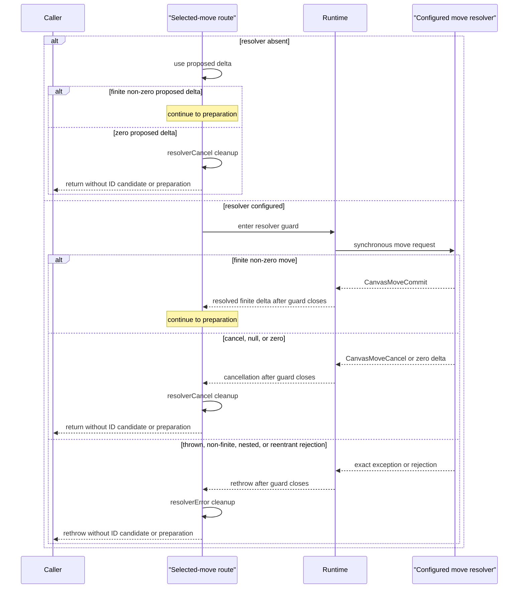
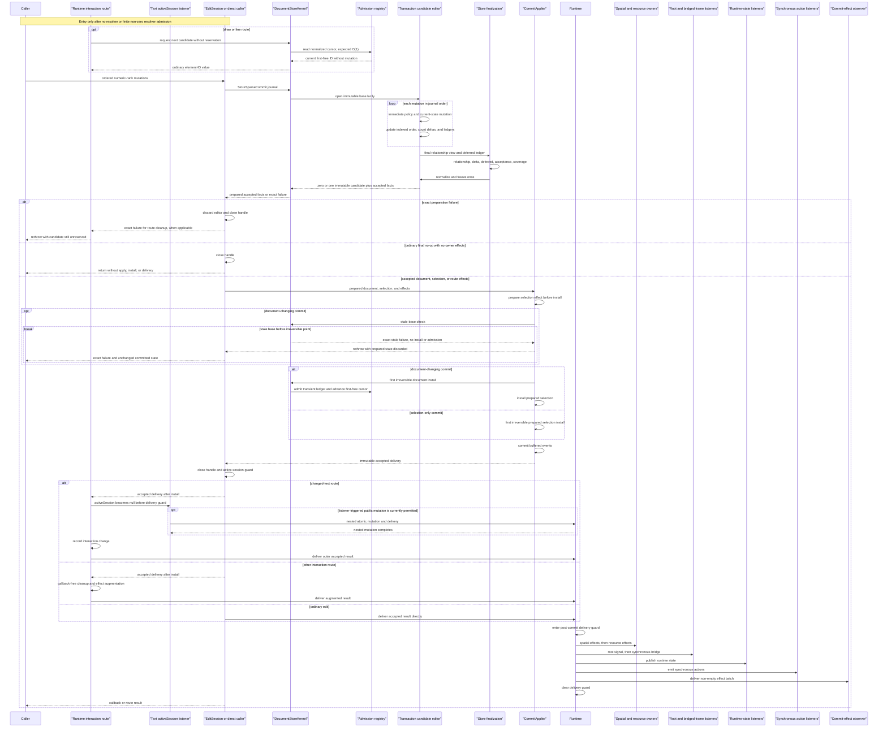
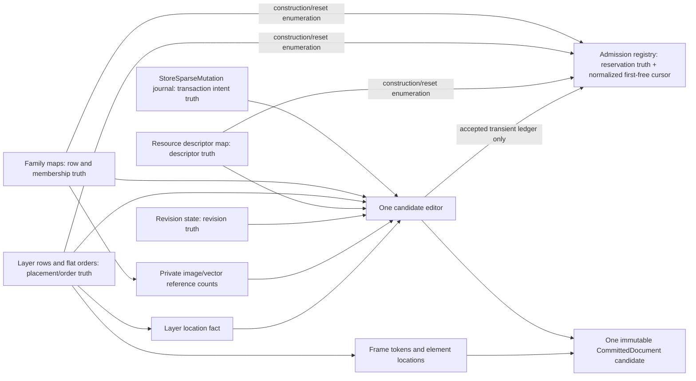

# Design: Sparse Commit Transaction Candidate

## Source Inputs

- Prior Design: None. There is no active design or Change Contract intersecting these owners.
- Research: `docs/history/research/2026-08-10-element-resource-lookup-facts.md`, read in full and independently checked against the repository at the commit above.
- PLAN: None. No active Change Contract exists for this scope.
- Other: The explicit user decision requires the end-to-end `O(S + K log M + R)` target; one isolated transaction-local store candidate editor; one reusable deterministic implicit AVL/order-statistics sequence implementation with separate mutable instances in store preparation, sparse EditSession, and DraftDocument; owner-owned direct membership/location and split image/vector reference counts; one final structural flatten/publication; and preservation of the named order, validation, diagnostic, admission, rollback, direct-store, promotion, public, codec, projection, and immutable-commit semantics. It explicitly rejects exact-`+K` anchor/gap/generation/adjacency machinery and forbids reopening the accepted logarithmic rank cost. The follow-up user decision selects strict rollback-safe draw/line ID generation: a failed preparation must not consume the route-generated ID, while successful generated-ID order remains unchanged. The selected internal form keeps the admission registry as the sole owner, maintains its cursor at the first free generated ID, reads that cursor without mutation for draw/line, and reserves only through the accepted commit's existing admission ledger; private method names and decomposition remain open. Private identifiers, file/class/helper decomposition inside the locked owners, AVL node/rotation layout, instrumentation layout, randomized seeds, and numeric GC/latency budgets remain open. Additional inputs are `docs/contracts/edit_kernel.md`, `docs/contracts/operation_matrix.md`, `docs/contracts/validation_limits.md`, `docs/contracts/public_api_v1.md`, `docs/contracts/codec_boundary.md`, `docs/verification/guardrail_design_patterns.md`, `docs/architecture/02_package_boundaries.md`, `docs/architecture/03_data_model.md`, `docs/architecture/architecture_graph.yaml`, ADRs 0002 through 0005, the interaction commit routes in `lib/src/runtime/runtime_root.dart`, current store/edit production code, and the existing sparse-store, sparse-edit, net-no-op, field-update, typed-effects, store-finalization, projection-hot-path, staged-load/diagnostic, rollback, runtime-delivery-order, and materialized-promotion fixtures.

## Target Contract Classification

Profile: `BEHAVIOR_CHANGE`

Obligations: `SEAM_MIGRATION`, `SEQUENCED_MIGRATION_AND_RETIREMENT`, `NEGATIVE_PROOF_AND_FIXTURE_QUARANTINE`, `TEMPORAL_SURFACE_CLOSURE`, `ALL_OR_NOTHING_FAILURE_BOUNDARY`, `SOURCE_OF_TRUTH_SINGULARITY`

ADR Impact: create

The implementation contract must create ADR-0017 if that remains the next available ADR number. The ADR records the durable transaction-candidate, indexed-order, derived-fact, and rollback-safe route-generated-ID architecture; it complements rather than supersedes ADR-0003's store-owned accepted-finalization decision.

## Repository Evidence

- `lib/src/store/document_store_kernel.dart:404` / sparse preparation: `prepareSparseCommit` applies the journal in order but replaces `nextDocument` after individual structural mutations and contiguous update groups -> immutable publication and owner copying can recur with `K`.
- `lib/src/store/document_store_kernel.dart:416` / update batching: only adjacent update mutations share a batch -> mixed or non-contiguous traces defeat batching.
- `lib/src/store/document_store_kernel.dart:480` / finalization gates: relationship handling, provided-delta validation, deferred validations, base-final acceptance, coverage, normalization, and touched facts already have observable ordering -> the new editor must preserve that order, not merely the final data.
- `lib/src/store/document_store_kernel.dart:701` / update semantics: a missing-ID update exits before source/revision checks, while effective updates enqueue deferred validation -> both the early-ignore rule and every effective update's later failure remain observable.
- `lib/src/store/document_store_kernel.dart:736` / mutation helpers: add, remove, resource, and clear helpers construct new committed owners -> a store-only lookup improvement cannot remove write amplification.
- `lib/src/store/document_store_kernel.dart:957` / structural acceptance: base-final order comparison performs per-layer lookup and full-order work -> finalization itself can multiply scans unless the candidate exposes its final order and locations directly.
- `lib/src/store/document_store_kernel.dart:1116` / resource touched facts: each changed descriptor asks whether the base or candidate references it -> current `R`-by-family scans are not bounded by `O(S + K log M + R)`.
- `lib/src/store/family_tables.dart:69` / element row ownership: seven immutable family maps own element identity and row data; `contains` reconstructs `admittedElementIds`, and `referencesResource` scans image and vector rows -> membership and reference facts belong at this owner.
- `lib/src/store/family_tables.dart:277` / direct lookup seam: `_commonById` already performs allocation-free lookup across the seven maps -> no permanent duplicate element-ID index is necessary.
- `lib/src/store/family_tables.dart:287` / immutable mutations: add, remove, and replace materialize map state repeatedly -> transaction-local copy-on-write buffers must replace per-step family publication.
- `lib/src/store/layer_table.dart:26` / layer ownership: the ordered layer rows own layer identity and each content order; `contains`, row lookup, clear, add, and remove currently recreate sets or copy/scan lists -> a layer location fact and indexed sequences are required at the owner.
- `lib/src/store/element_registry.dart:49` / committed order facts: flat content/frame order, dense frame tokens, element locations, and admitted sets are derived from family/layer owners -> these facts may be rebuilt once for final structural publication but must not become a second mutable truth.
- `lib/src/store/element_registry.dart:270` / append overlays: recursive `_AppendedReadOnlyMap` and `_AppendedReadOnlySet` chains retain prior immutable candidates and can make final traversal quadratic -> the sparse candidate path must retire these overlays.
- `lib/src/store/resource_table.dart:52` / descriptor ownership: the descriptor map is the resource source of truth and every upsert/remove copies it -> the editor must open it at most once, independent of reference-count summaries.
- `lib/src/store/committed_document.dart:84` / committed boundary: the immutable document composes elements, resources, background, palette, camera, and revision state -> exactly one final candidate remains the install boundary.
- `lib/src/store/sparse_store_commit.dart:10` / production boundary: `StoreSparseCommit` is an immutable, ordered mutation journal with raw numeric indices -> its DTOs and public-independent role are already sufficient and remain unchanged.
- `lib/src/edit/edit_session.dart:338` / sparse session truth: replay closures and `StoreSparseMutation` DTOs mirror the same transaction intent -> promotion and store application can drift unless one journal becomes authoritative.
- `lib/src/edit/edit_session.dart:588` / committed remove then re-add: callback-local removal can infer the wrong order owner when no local placement override exists -> the current overlay can retain a stale content entry and must be initialized from authoritative location facts.
- `lib/src/edit/edit_session.dart:1025` / sparse resource decisions: reference checks scan local overrides and can fall back to accepted elements -> exact base counts plus a session delta are required for ordered `removeUnusedResource` decisions.
- `lib/src/edit/draft_document.dart:32` / materialized editing: the draft builds mutable lists but still uses list insertion, nested row lookup, and element/resource scans -> store-only indexed order and counts would not close the full edit lifecycle.
- `lib/src/runtime/runtime_root.dart:2558` / facts adapter: the runtime already supplies private store facts to the sparse edit session -> exact committed resource counts and element location can cross this existing seam without a new public API or a reverse dependency.
- `lib/src/runtime/runtime_root.dart:1478` / delivery mutation guard: every public runtime mutation checks the active edit and post-commit delivery windows and rejects delivery-time mutation with `StateError` -> the complete synchronous delivery window remains guarded after EditKernel closes its session.
- `lib/src/runtime/runtime_root.dart:1872` / post-install delivery: RuntimeRoot enters one guard, applies spatial effects, applies resource effects, publishes surface-frame then runtime state, emits synchronous actions, invokes the internal observer, and clears the guard -> this exact order is a compatibility lock, not a candidate-editor implementation detail.
- `lib/src/runtime/runtime_root.dart:201` / action callback surface: the public action stream is a synchronous broadcast controller -> action listeners are part of the guarded post-install callback window.
- `lib/src/api/canvas_runtime_surface_bridge.dart:33` / surface callback surface: the surface bridge synchronously forwards root frame-signal notifications through another ValueNotifier -> both frame listener layers precede runtime-state listeners and remain under the delivery guard.
- `test/spatial/fixtures/runtime_delivery_order_fixture.dart:29` / executable delivery evidence: current fixtures observe spatial state before state/observer callbacks and reject mutation in both -> future evidence must extend this semantic trace across every synchronous callback surface.
- `lib/src/runtime/runtime_root.dart:1049` / changed-text post-install phase: after accepted EditKernel install and before common delivery, the route consumes request facts, clears text suppression without separate publication, and records interaction change -> later callbacks must observe these route-owned transitions.
- `lib/src/runtime/runtime_root.dart:2130` / selected-move post-install phase: the route installs through EditKernel, performs success cleanup without publication, then enters common delivery; resolver cancel and edit failure use distinct cleanup branches -> store acceleration cannot collapse this temporal distinction.
- `lib/src/runtime/runtime_root.dart:2219` / interaction cleanup and effect augmentation: marquee, draw, line, and eraser routes install, perform publish-false cleanup, merge cleanup effects, and only then call common delivery -> the design needs an explicit synchronous pre-delivery route phase.
- `docs/contracts/operation_matrix.md:59` / route-effect authority: marquee/move and draw/line/eraser rows own selection, preview, cleanup, repaint, revision, and action consequences -> these facts remain visible before later delivery callbacks.
- `docs/contracts/operation_matrix.md:88` / text request authority: stale, no-op, and changed text branches have distinct request-consumption and publication effects -> post-install changed-text consumption cannot be generalized into eager preparation or a final no-op.
- `lib/src/edit/commit_applier.dart:95` / accepted install branches: CommitApplier prepares selection first, installs a document only when the revision delta changes, and always then installs the prepared selection -> document-changing and selection-only commits have different first irreversible points.
- `test/edit/fixtures/selection_effect_commit_fixture.dart:54` / selection-only witness: a replacement selection with no document delta observes `prepare-selection` then `selection` and no document install -> the temporal model must make store installation optional.
- `lib/src/runtime/runtime_root.dart:2269` / draw and line generation: draw and line routes call `generateElementId` before fallible edit preparation -> a rejected preparation can already have changed generator reservation state.
- `lib/src/store/document_store_kernel.dart:2440` / generator reservation ownership: `nextValue` advances `_next` and inserts the candidate into `_reserved` before returning -> route generation is an observable admission-state mutation, not a pure candidate calculation.
- `lib/src/store/document_store_kernel.dart:46-58,277-310,384-395,2429-2454` / generator cursor lifecycle: construction, replace, load, and import rebuild each admission owner with `_next = 0`; `nextValue` alone skips admitted/reserved collisions, while `admitAll` does not advance the cursor -> a read-only peek that repeats those collision checks without normalizing the owner would rescan a supported-size admitted prefix on every failed or accepted route.
- `test/runtime/fixtures/draw_commit_delivery_fixture.dart:184` / failed draw witness: the repository exercises a generated-ID draw route whose sparse preparation rejects invalid stroke data -> current compatibility includes a failure after reservation but before accepted document install.
- `lib/src/runtime/runtime_root.dart:2114` / selected-move resolver surface: a configured public resolver runs under `runResolverCallback` before EditKernel preparation; error, cancel/zero, invalid delta, and accepted branches precede sparse mutation -> temporal closure must include the resolver guard and branches.
- `lib/src/runtime/runtime_root.dart:1462` / resolver guard: nested resolver execution and public runtime mutation during the resolver are rejected through `ResolverCallbackRejection`, with the mutation attempt recorded before rejection -> no EditSession or ID candidate may be opened first.
- `lib/src/runtime/runtime_root.dart:1059` / changed-text listener gap: after accepted install and EditKernel closure but before the common delivery guard, clearing the accepted text request dismisses the active text session -> the active-session listener is an explicit synchronous post-install surface.
- `lib/src/runtime/runtime_root.dart:3157` / active-session notification: dismissal assigns `activeSession.value = null` synchronously, while `clearAcceptedRequest` bypasses the public mutation guard -> listener-triggered runtime mutation is currently permitted in this exact gap and must remain ordered.
- `docs/contracts/public_api_v1.md:2650` / text-listener public surface: `CanvasTextEditingPort.activeSession` is a public `ValueListenable` -> its callback order, reentrancy, and failure projection are compatibility behavior rather than a private implementation detail.
- `docs/contracts/edit_kernel.md:90` / sparse edit route: ordinary edits record a callback-local sparse journal, avoid public projection, and replay prior sparse mutations on materialization -> the new single DTO journal must preserve sparse and promotion behavior without projection.
- `docs/contracts/edit_kernel.md:101` / semantic authority: preparation validates final accepted tables before the irreversible swap and a base-equal candidate publishes nothing -> the editor changes representation, not acceptance or no-op policy.
- `docs/contracts/edit_kernel.md:123` / public observation order: EditKernel closes the handle before RuntimeRoot publishes state and invokes synchronous observers -> candidate preparation must remain inside this existing guarded sequence.
- `docs/contracts/public_api_v1.md:1451` / compatibility authority: edit callbacks are synchronous/non-nested, mutations are atomic, notifications follow install, errors are exact, either relationship order is admitted, and remove-unused sees all references -> eager relationship validation or changed callback order is forbidden.
- `docs/contracts/validation_limits.md:31` / scale boundary: valid documents admit 4,096 layers, 200,000 elements, and 4,096 resources -> the observed amplification is reachable within supported inputs.
- `docs/contracts/codec_boundary.md:70` / diagnostic and order authority: canonical sinks validate duplicates and final descriptor relationships with exact missing/kind codes and paths -> the optimized owners must retain those diagnostics and final-state responsibility.
- `docs/verification/guardrail_design_patterns.md:12` / proof policy: runtime behavior and allocation/performance properties require executable owner-level or budget-probe evidence -> source-shape scanners cannot prove the selected complexity or lifetime claims.
- `docs/architecture/architecture_graph.yaml:178` / store owner: the graph declares DocumentStoreKernel as the committed descriptor/final-relationship/projection-input owner -> the candidate editor stays private to store ownership.
- `docs/architecture/architecture_graph.yaml:205` / edit owner: the graph declares EditKernel as the edit owner -> the reusable sequence may be consumed by edit only along the existing edit-to-store direction.
- `architecture/decisions/ADR-0002-separate-committed-runtime-and-projection-state.md:32` / compact committed state: compact committed tables are authoritative and public documents are lazy projections -> the design preserves flat authoritative committed data and does not materialize projections.
- `architecture/decisions/ADR-0003-store-finalized-edit-transactions.md:35` / accepted finalization: EditKernel owns session guards while the store owns final facts and base-final acceptance -> the transaction editor is subordinate to the store and cannot move policy into callbacks.

## Design Form Candidates

### Candidate A. Transaction-local candidate editor with owner-local indexed sequences and facts

Open each touched owner once, replay the existing journal sequentially in one isolated editor, use deterministic implicit AVL/order-statistics sequences for rank-sensitive order changes, maintain exact transaction-local reference deltas, normalize before freeze, and publish one immutable candidate. This is the selected form. It satisfies `O(S + K log M + R)` while keeping raw numeric indices and current compatibility policy.

### Candidate B. Contiguous or statically safe mutation batching

Extend the current grouping of adjacent updates to other apparently compatible runs. This reduces some copies but does not survive interleaved add/update/remove/resource operations, compensating edits, or clear barriers. Non-contiguous operations still reopen and republish document-sized owners. Rejected because it cannot remove the amplification class.

### Candidate C. One mutable candidate backed by ordinary `List` values

Open owners once and replay into mutable maps and lists. This fixes immutable publication amplification, but front and middle insertion/removal still shift `O(M)` entries per operation in the sparse session, draft, and store. Rejected because supported 200,000-element traces remain `K`-by-`M`.

### Candidate D. Persistent immutable collections

Adopt persistent maps/sequences for incremental candidates. This introduces a dependency and a repository-wide representation migration, still requires rank-aware order operations and final flat materialization, and does not simplify the EditSession/DraftDocument parity problem. Rejected as broader than the selected owner-local lifecycle.

### Candidate E. Exact-`+K` store replay through gap, anchor, linked-order, and generation protocols

Use an EditSession AVL to translate numeric ranks into predecessor/successor gaps, serialize those gaps into new DTOs, and make the store maintain a linked editor with adjacency and generation validation. This adds several cross-layer sources of ordering truth and recovery policy only to remove a logarithm from the store phase; numeric-rank processing in the complete edit path remains `K log M`. Rejected as `DISPROPORTIONATE_SOLUTION`. Gap/anchor DTOs, linked-order replay, generation tokens, adjacency protocols, dual rank/anchor truth, and fractional ranks are forbidden by this design.

### Candidate F. Narrow direct lookup and resource-count fixes

Make `contains` direct and add resource counts while leaving immutable per-step candidates and list orders unchanged. This removes two scans but leaves the dominant family/layer copies, publications, shifts, and recursive overlay traversal. Rejected because it treats symptoms without closing the transaction owner.

### Solution Proportionality result

Candidate A is the smallest form that independently closes every observed multiplier. The editor is forced by per-step immutable publication; the indexed sequence is forced by rank mutations across all three edit owners; family/layer lookup facts are forced by repeated identity/location scans; split reference summaries are forced by ordered resource decisions and `R`-by-row classification. Removing any one of these obligations leaves a confirmed failure family. Candidates B and F are narrower but incomplete, C preserves an asymptotic defect, D is a broader representation migration, and E creates material protocols without changing the accepted end-to-end bound.

For rollback-safe route-generated IDs, a normalized cursor in the existing admission owner plus a non-mutating cursor read and accepted-ledger reservation is strictly simpler than snapshot/restore of the mutable admission registry or a reservation-ticket protocol. It creates no second reservation state, rollback log, token, or public surface. Owner construction/reset establishes the first-free cursor once, ordinary explicit generation and accepted admission advance it monotonically, and the synchronous non-nested route only reads it before preparing one add. Failed preparation leaves the admission owner untouched; accepted install admits the ID through the existing ledger and advances the same cursor. Snapshot/restore adds mutation and rollback coordination, and a ticket protocol adds a new lifecycle without improving the required observable result.

## Selected Form

### Complexity contract and terms

Sparse transaction preparation and the corresponding sparse/materialized edit operations target `O(S + K log M + R)` under the repository's expected `O(1)` hash-map lookup model:

- `S` is the total size of owner tables and order sequences actually opened or necessarily materialized once for the transaction, including one required final structural publication.
- `K` is mutation count.
- `M` is the maximum live length of an affected indexed order sequence.
- `R` is changed resource-descriptor count.
- `U` is the number of distinct referenced resource IDs represented by the applicable count owner.

No owner table, order sequence, or immutable candidate may be scanned, copied, built, or published once per mutation. A single `O(N)` pass needed to validate or publish a structurally changed final candidate is allowed; `K` such passes are not. Admission-owner construction/reset may scan its generated-ID prefix once as part of `S`; thereafter a read-only candidate query is expected `O(1)`, and cursor advancement is amortized because each occupied generated ID is crossed at most once between resets. Accepted sparse admissions are bounded by their mutation ledger, so this owner work does not add a `K`-by-document term. Rank-sensitive operations intentionally remain worst-case `O(log M)`. Exact GC and latency thresholds are verification parameters, not open architecture decisions.

### Transaction-local store candidate editor

`DocumentStoreKernel.prepareSparseCommit` creates one private editor from the committed base and feeds it every `StoreSparseMutation` strictly in journal order. The editor is the only mutable transaction candidate. It never mutates the committed base, returns a writable collection, or publishes an intermediate `CommittedDocument`.

The editor lazily opens copy-on-write buffers. Each of the seven family maps, the layer row table, layer-order sequence, background order, each affected content order, the descriptor table, and each changed reference summary is opened or copied at most once per transaction. Untouched owners remain references to immutable base owners. Subordinate buffers are implementation details inside the single editor lifetime; they do not become new cross-layer protocols or durable sources of truth.

The editor maintains current intermediate state for duplicate detection, source matching, placement, resource reference decisions, clear barriers, and later mutations. Immediate mutation policy remains unchanged:

- duplicate add fails at the add step even if a later remove would make the final set valid;
- a missing-ID update is ignored before source/revision validation;
- an effective update records its deferred validation even when a later update or remove replaces its final row;
- `removeUnusedResource` observes the current intermediate reference count synchronously;
- `clear`, `clear(true)`, resource operations, and later additions remain ordered barriers/actions;
- remove then re-add uses the current authoritative placement and can change final order;
- relationship validity is not checked eagerly because element/resource may be added in either order.

Two compact ordered ledgers retain facts not derivable from a final diff:

1. transient admitted element/layer/resource IDs, deduplicated in first-admission order while preserving all current generator-reservation rules; and
2. deferred effective element-update validation facts, appended in journal order.

Accepted/no-op status and the existing touched taxonomy are never inferred from those ledgers. They remain comparisons between the committed base and the normalized final candidate. Consequently add-then-remove may be a final no-op, while the same transient admission combined with another accepted change still reserves the transient ID. Compensating edits do not leak intermediate row revisions, resource revisions, or touched families.

### Reusable indexed-order sequence

One internal deterministic implicit AVL/order-statistics sequence implementation is shared as code, never as a mutable instance. Store candidate editors, sparse EditSessions, and DraftDocuments create separate owner-local instances. The implementation lives on the existing store-side low-level dependency path so edit may import it without a store-to-edit edge. This locks the user-selected algorithm and semantic reuse boundary, not a class count, filename, helper decomposition, node layout, or rotation strategy.

Construction from a flat sequence is one `O(M)` balanced build rather than repeated inserts. The implementation maintains only the internal order-statistics and ID lookup facts needed to meet these required operations and bounds:

- `length`;
- expected-`O(1)` membership and location-by-ID lookup, with rank derivation in `O(log M)`;
- insertion by numeric rank in worst-case `O(log M)`;
- removal by ID in worst-case `O(log M)`;
- `clear`, `first`, `last`, ordered iteration, and one final flatten.

Identical input and operations produce identical order, while internal balancing choices remain implementation-local. The sequence preserves current numeric-index semantics exactly: `null` appends, a negative index clamps to zero, an oversized index clamps to current length, and repeated same-index operations are interpreted sequentially against the state produced by the preceding operation. The existing journal and `StoreSparseCommit` DTOs keep raw numeric indices. Committed order remains the existing exact flat order.

Layer order, background order, and every content-layer order use separate instances. The final frame order, dense integer frame-order token map, and element location facts remain derived committed facts. When structural publication is required, the editor traverses final sequences once, compares them with the base as part of that traversal, and builds the exact flat content/frame order, dense tokens, and locations. It does not flatten a sequence and then perform a second equivalent publication scan. A non-structural commit shares the base order facts.

### Membership, location, and reference ownership

`FamilyTables` remains the only owner of element membership. Its `contains` performs allocation-free direct lookup across the seven maps through the existing `_commonById` seam. No permanent global element-ID index is added. The retained `ElementRegistry.admittedElementIds` and `admittedLayerIds` sets, order-import admitted-element set, and their append overlays are retired. Full store construction/load/reset seeds the generator admission registries by enumerating authoritative family IDs and LayerTable row IDs once and establishes each registry's first-free cursor in that same owner lifecycle; sparse accepted install admits the compact ordered transaction ledger and maintains the cursor invariant. Those construction-time iterables are consumed immediately and are not retained mirrors.

`LayerTable` owns an immutable `layerId -> row/index` location fact derived from its ordered rows. Construction/import builds it once; the editor updates its transaction-local form with layer operations and freeze publishes it once if layers changed. `contains`, row lookup, touched-layer derivation, callback fact probes, and clear use this fact. It is not an independent ordering truth: rows/order own layer order, and build/freeze verification requires exact bidirectional parity.

`FamilyTables` owns two private committed reference summaries:

- image `resourceId -> count`; and
- vector `resourceId -> count`.

The logical query sums the two counts. Counts include references to missing descriptors, because element-first/resource-second batches are valid until final relationship validation. The summaries are derived caches, not descriptor ownership and not a global element index. An unchanged summary is shared. A changed per-family summary is materialized at most once during freeze, and its `U_family` is bounded by the size of that referring family. A global `O(U)` count-map clone after each mutation, or more than one materialization of a changed referring-family summary in a transaction, violates this design.

The store editor reads immutable base summaries and keeps transaction-local image/vector count deltas, including clear/reset state. Every successful before-to-after transition updates the corresponding count: add, remove, resource-ID change, clear, remove/re-add, and any replacement/import construction path. Descriptor upsert/removal does not alter counts. Synchronous `removeUnusedResource` asks the current logical count and therefore distinguishes removal before versus after the referring element change without scanning rows.

### Rollback-safe generated route IDs

The admission registry remains the sole owner of generated-ID reservation and owns this invariant: its cursor always denotes the first free generated ID relative to the registry's admitted and reserved sets. Construction, full replacement, prepared load, import installation, and any other reset establish the invariant once by advancing from the initial generated value to the first free candidate. The scan is reset/construction work, not deferred to each query.

A private read-only candidate operation returns the current normalized cursor value in expected `O(1)` and neither advances the cursor nor changes admitted/reserved state. Draw and line routes use it immediately before their one-element EditKernel preparation. Ordinary explicit `generateElementId` reserves the current value immediately, then advances through any now-contiguous occupied generated IDs to restore the invariant before returning. Accepted transient admission through the existing ordered ledger uses the same owner transition: after adding admitted IDs, it advances when the current or a subsequent contiguous candidate is occupied. Because admitted/reserved state is monotonic between resets and the cursor never retreats, each occupied generated ID is skipped at most once in that owner lifetime.

The candidate is not retained speculative state, a token, ticket, lease, rollback log, or second reservation source. It is passed as the ordinary element ID in the existing add mutation. If preparation fails or produces no accepted install, nothing admits the candidate and the cursor does not move, so the same ID remains next without repeating an admitted-prefix scan. If the commit is accepted, atomic installation admits the ordered transient ledger and advances the cursor immediately, so the next read returns exactly the same successor as current successful draw/line behavior. Ordinary explicit generation retains immediate uniqueness across accepted admissions and direct explicit-generation interleavings.

This seam is valid only because draw/line generation, element construction, and preparation are synchronous and non-nested with no application callback, resolver, listener, stream, microtask, or event-loop yield between candidate read and preparation. The Change Contract may not generalize it into an exposed reservation protocol. A future route needing multiple speculative generated IDs requires a new architecture decision rather than retaining a candidate beyond this boundary.

### EditSession and DraftDocument lifecycle

Sparse EditSession retains one authoritative ordered journal: the existing `StoreSparseMutation` DTO sequence. The parallel replay-closure journal is retired. Promotion replays the same DTOs through an internal DraftDocument mutation-application seam, so callback, direct-store, and promoted paths consume the same ordering facts. `lib/src/store/sparse_store_commit.dart` remains behaviorally and structurally unchanged.

The session opens owner-local indexed sequences lazily from authoritative committed order/location facts and maintains current placement after every successful mutation. Removing a committed element first resolves its committed location, opens that exact background/content sequence, and removes the ID; re-adding inserts only the new occurrence. This closes the committed remove-then-re-add stale/duplicate overlay risk rather than preserving it as compatibility behavior.

The existing private sparse-facts adapter supplies exact committed image/vector logical reference counts and authoritative element location in addition to current row/order/resource facts. The session maintains an exact delta over those base counts for all successful transitions and clear barriers. This is a narrow extension of the existing runtime-to-edit facts seam, not a public API and not callback-only state used by the store. Provisional session touched/revision state may continue to serve callback behavior, but the store alone computes accepted final facts.

DraftDocument builds its mutable backing once when materialized: family ID maps, element placement, layer ID map, layer order sequence, background/content sequences, insertion-ordered descriptor map, and exact split resource counts. Normal editing uses direct lookup and indexed order rather than nested scans or list shifts. Replacement/import builds a complete fresh backing and swaps it only after successful construction/validation. Materialization emits the existing public flat document order once. No mutable DraftDocument collection is shared with committed owners or the store editor.

### Finalization, normalization, and publication

After journal replay, store preparation executes these gates in their current observable order:

1. final-candidate relationship handling;
2. provided-delta shape validation;
3. all deferred update validations in journal order;
4. accepted base-versus-final computation;
5. required non-empty and coverage checks;
6. normalization inside the editor;
7. at most one immutable `CommittedDocument` candidate publication; and
8. final accepted touched-fact computation under the existing taxonomy.

Selective relationship candidates retain current insertion order. When current compatibility requires full relationship validation, including the existing resource-kind-change/frame-order rule, one final frame-order scan is allowed so error and diagnostic precedence remain exact. Repeated `R`-by-`N` classification scans are forbidden. Final validation preserves exception class, `CanvasDataErrorCode`, message, path, missing-versus-wrong-kind distinction, frame-order precedence, and failure ordering.

Normalization operates on the final editor state before publication. It preserves base rows, tables, resources, and revisions for final-equal values; assigns accepted revisions only to final changed owners; and shares unchanged immutable structures. Changed resource normalization visits changed descriptors rather than all resources. Structural finalization consumes the final indexed orders once. No candidate is published for a final no-op. An accepted commit publishes exactly one candidate.

`PreparedSparseStoreCommit` remains the fallible preparation result and atomic install boundary. All replay, relationship checks, delta/deferred validation, coverage, normalization, freeze, alias checks, and accepted-fact computation finish before document replacement. Install retains the existing stale-base protection, then atomically replaces the document and admits ordered transient IDs. Any failure during preparation or stale pre-install admission, before the applicable irreversible point, leaves document identity and data, revisions, generator admissions, selection, queued delivery/effects, and lazy projection state unchanged. Failures after that point follow the existing non-rollback delivery behavior locked below.

Direct `StoreSparseCommit` remains a production boundary. The candidate editor relies only on the committed base and mutation DTOs, never on callback-only overlays. Public API, schema/codec format, serialization order, projections, error surface, flat authoritative rows/orders, and the immutability of committed state do not change. The private committed aggregate changes only by carrying the layer-location and split reference-count derived facts enumerated in this design.

### Migration and retirement sequence

The Change Contract must express the implementation as a dependency-ordered migration; coexistence is temporary and may not become a selectable mode:

1. add the internal indexed sequence with a simple sequential-list oracle and owner-level complexity instrumentation;
2. give `FamilyTables` direct membership plus split reference summaries and give `LayerTable` its location fact, build all derived facts at construction/import boundaries, switch admission seed/reset to owner enumeration, and establish the first-free cursor invariant across construction/reset, explicit generation, and `admitAll` before removing retained element/layer admission sets;
3. introduce the isolated store candidate editor and route `prepareSparseCommit` through it while preserving finalization order and direct-store behavior;
4. migrate sparse EditSession to owner-local sequences, authoritative committed locations, exact count deltas, and the single DTO journal;
5. migrate DraftDocument to the same sequence implementation and exact mutable owner facts, then switch promotion to replay the DTO journal;
6. switch draw/line to the expected-`O(1)` read of the normalized next-ID cursor and prove failed reuse, supported-prefix work bounds, successful sequence parity, and explicit-generation interleavings before removing their eager `generateElementId` call;
7. expand differential, parity, failure, scale, delivery-order, and projection verification before removing old paths;
8. retire per-step immutable sparse mutation helpers from the preparation path, retained element/layer admission sets and order-import mirrors, the replay-closure journal, list-based sparse/draft order mutation paths, repeated reference scans, recursive append overlays, eager draw/line reservation, and private-shape fixtures that prescribe those mechanisms;
9. update source-of-truth docs, create the ADR, and prove architecture/import closure.

There is no permanent flag, fallback mode, dual journal, list/AVL dual order, old/new candidate path, or dual count authority. During a unit's transition, compatibility tests compare old observable results to the new path; once parity is established for that unit, the old mechanism is removed in the same accepted plan.

## Boundary Locks For Change Contract

Owner: `DocumentStoreKernel` owns sparse accepted-finalization and atomic installation; its private transaction editor owns only the mutable preparation lifetime. `FamilyTables`, `LayerTable`, and `ResourceTable` retain their domain data ownership. EditSession and DraftDocument own only their transaction/materialized working state.

In Scope: store candidate preparation; reusable internal indexed order; family membership and split resource-reference facts; layer lookup/location facts; removal of sparse append overlays; sparse EditSession order/count/journal migration; DraftDocument order/count/lookup migration; private runtime facts-adapter wiring; the admission registry's normalized first-free cursor lifecycle and private non-mutating next-element-ID candidate seam for draw/line; final normalization/publication; relevant semantic and work-budget verification; ADR and source-of-truth updates.

Out of Scope: public API or codec/schema change; new mutation DTOs; new order semantics; persistent collections; order anchors/gaps/generations/adjacency/fractional ranks; retained speculative generated-ID candidates, ticket/lease protocols, or rollback logs; changing immediate reservation for ordinary explicit ID generation; projection materialization; broad committed-document replacement; async editing; collaboration/multi-writer policy; literal `O(S + K + R)`; tuning exact latency or GC constants.

Source of Truth: seven family maps own element membership/rows; ordered layer rows and background/content sequences own placement and order; descriptor map owns resources; revision state owns revisions; admission registries own generator reservation history and the normalized first-free cursor. The draw/line next candidate is the current cursor exposed as a non-retained, non-mutating query and becomes reserved only through accepted sparse admission. Full admission reset enumerates family/layer/resource owners once and establishes the cursor invariant; explicit generation and `admitAll` preserve it as reservation history grows; sparse install consumes only the ordered transient-admission ledger. No committed element/layer admission-set mirror or speculative-candidate truth remains. Layer locations, frame tokens/locations, and split reference counts are exact derived facts with one owner-defined lifecycle. The `StoreSparseMutation` list is the sole sparse transaction-intent journal.

Compatibility: preserve public signatures, accepted/no-op semantics, touched taxonomy, revisions, transient admissions, remove-unused results, final relationship semantics, exact error type/code/message/path/precedence, order and clear behavior, promotion parity, serialization, projections, flat authoritative committed rows/orders, and immutable committed publication. Private committed owners may add only the layer-location and split reference-count derived facts with the lifecycles and parity invariants locked here. The one authorized behavior correction is that failed draw/line preparation no longer consumes its speculative generated ID; successful generated-ID order and explicit generation behavior remain unchanged.

Order Constraints: process journal entries strictly in order; interpret numeric indices sequentially with current clamping; record deferred validations and transient admissions in observable order; preserve clear as a barrier; preserve finalization gate order; perform relationship diagnostics in current selective/frame-order precedence; run the move resolver before ID/editor preparation; read the normalized draw/line cursor without reservation before prepare; advance it only through ordinary explicit reservation or accepted ledger admission; prepare selection before either accepted install branch; and preserve the changed-text active-session notification before common delivery.

Temporal Surface Closure: the invariant is that pre-prepare callbacks, the synchronous edit callback, ordered mutation journal, preparation, atomic apply, handle closure, route-owned post-install/pre-delivery work, and guarded common delivery expose exactly the locked order. Synchronous surfaces are the selected-move resolver; public `CanvasEditPort.edit`; command/interaction routes; the callback-local `CanvasEdit` handle; the public text-edit `activeSession` ValueListenable; resource-session release callbacks; root and bridged surface-frame ValueNotifier listeners; runtime-state ValueNotifier listeners; synchronous broadcast action listeners; and the internal commit-effect observer. RuntimeRoot owns resolver and delivery guards; EditKernel owns the active-session guard. Within journal replay, immediate duplicate/source/no-op/kind decisions use current intermediate state, missing-ID updates short-circuit before source validation, every effective update keeps its deferred validation, relationship validity waits for final state, `removeUnusedResource` reads current counts, and clear/reset affects only later mutations.

Selected move resolves before opening EditKernel. A configured resolver runs synchronously under `runResolverCallback`; nested resolver execution and public runtime mutation are rejected with the current `ResolverCallbackRejection` type/message, and mutation rejection retains its diagnostic. A thrown resolver or non-finite returned delta performs `resolverError` cleanup and rethrows the current exception. Cancel, `null`, or zero delta performs `resolverCancel` cleanup and returns without ID candidate, EditSession, preparation, install, or delivery. Only a finite non-zero delta enters preparation.

Draw and line read the admission owner's normalized next-element-ID cursor in expected `O(1)` immediately before their one-element EditKernel preparation. No callback, resolver, listener, stream, microtask, or event-loop yield occurs between candidate read and preparation. A failed or no-op preparation leaves cursor and reservation state unchanged; accepted store install admits the candidate through the ordered transient ledger and restores the first-free invariant before returning. The route never retains or publishes a candidate.

For an ordinary public edit, the accepted result proceeds directly from EditKernel closure to common delivery. For an interaction commit, RuntimeRoot performs a synchronous post-install/pre-delivery phase. Selected move performs publish-false interaction/preview/selection cleanup; marquee, draw, line, and eraser perform publish-false cleanup and merge cleanup effects. These routes invoke no callback or asynchronous boundary in the gap. Changed text is the intentional exception: after accepted install and EditKernel closure, it consumes the request and `clearAcceptedRequest(publishState: false)` synchronously publishes `activeSession = null` before the delivery guard. At that callback, the EditKernel session guard is already clear and the delivery guard has not started, so listener-triggered public runtime mutation is permitted subject to other existing guards; a nested accepted mutation may complete its own install/delivery before the outer text route resumes. Notifier failures retain framework reporting/continuation behavior. After listeners return, the outer route records any text-interaction revision and enters common delivery. Deferring this notification or extending the delivery guard across it is forbidden compatibility drift.

The complete order is optional selected-move resolver -> optional non-mutating draw/line ID candidate -> edit callback -> prepare accepted document/selection/effects -> prepare selection effect -> either document install followed by prepared selection install, or prepared selection install alone for selection-only commit -> buffered event commit -> close/stale handle and clear EditKernel guard -> optional route cleanup/effect augmentation, including changed-text `activeSession` notification and its permitted nested runtime mutation -> enter RuntimeRoot delivery guard -> spatial effects -> resource effects/release callbacks -> root then bridged surface-frame notification when required -> runtime-state notification -> synchronous actions -> non-empty commit-effect observer -> clear delivery guard -> outer callback/route return. Store installation is absent for selection-only commits. Public mutation from every callback inside the common delivery guard is rejected with the existing post-commit `StateError`. Resource, notifier, action-stream, and observer failures retain current drop/report/route/contain behavior and cannot roll back accepted state. Ordinary no-op and resolver/text/interaction rejection or cancel branches retain their current cleanup, request, return, action, and publication results.

All-Or-Nothing Failure Boundary: CommitApplier has two accepted branches after document/selection/effect preparation, plan compilation, stale-base admission, normalization, freeze, and every fallible validation. For a document-changing commit, document installation is the first irreversible point and prepared selection installation follows. For a selection-only commit, prepared selection installation is the first irreversible point and store installation is skipped. A no-op has no irreversible point. All fallible selection preparation precedes both branches. Before the applicable point, no committed document/revision, admission reservation, selection, delivery/effect queue, public state, repaint, spatial/resource cache, preview, or projection state changes. The draw/line ID candidate is read-only; candidate buffers are unaliased and discarded; the original exception and guard signals are preserved.

After the applicable point, only the remaining prepared installation, current route-owned transitions, permitted changed-text listener interleaving, and guarded delivery may occur in the exact temporal order above. Non-text route gaps cannot gain a callback, resolver, yield, validation, or fallible work. Each listener-triggered nested text mutation is a separate atomic edit after the outer install; its result is visible before outer delivery and cannot retroactively roll back the outer commit. Common-delivery callback failures likewise cannot roll back either accepted commit or reopen an EditSession.

The direct oracle snapshots document identity/data, every revision, admission next result, selection, request/suppression/interaction/preview facts, spatial/resource/projection state, event/effect/repaint buffers, and public publications at stable seams. For failures during preparation and stale pre-install admission, it proves that state unchanged before the applicable irreversible point. Failed draw/line followed by generation returns the same candidate; accepted draw/line followed by generation returns the same successor as the pre-change baseline. Selection-only traces prove no store install. Resolver traces prove guard/result/cleanup branches. Changed-text traces prove `activeSession` notification position, permitted nested mutation, nested-before-outer delivery, notifier failure routing, and final guard release. Other post-install delivery traces prove accepted state is retained despite current callback failure handling, owner visibility, guarded `StateError`, error containment, and callback-result preservation. Evidence is runtime state/identity observation and semantic event traces, never private helper or source-shape inspection.

Negative Proof And Fixture Quarantine: behavioral, differential, alias, rollback, and instrumented work counters are authoritative. Existing fixtures that inspect private helper names/bodies or mandate contiguous batching/append overlays/list shape are quarantined and migrated or retired; they may not block the owning architectural change. No new source-shape scanner may stand in for runtime work or semantic proof.

Bounded Recognition Scope: Not applicable. The design introduces no analyzer, matcher, recognizer, scanner, registry, lint, or policy-classification boundary.

## Decision Trace

| Decision ID | Decision | Evidence | Future contract handoff target |
| ----------- | -------- | -------- | ------------------------------ |
| D1 | Preserve the explicit user decision: end-to-end `O(S + K log M + R)`, one final structural pass, and no reopening of logarithmic rank work; private identifiers, decomposition, instrumentation layout, and numeric budgets remain open. | User decision recorded self-contained in Source Inputs; supported limits reach 200,000 elements. | Contract objective, acceptance budgets, and non-goals. |
| D2 | Replay one journal into one isolated transaction-local store editor and publish no intermediate committed candidate. | Current preparation republishes after individual mutations and contiguous groups. | `document_store_kernel.dart` candidate lifecycle unit. |
| D3 | Preserve the user-selected deterministic implicit AVL/order-statistics algorithm as one reusable semantic implementation with separate mutable instances; private type/file/helper count and node/rotation decomposition remain open. | Explicit user organization/data-structure decision; ordinary lists retain rank shifts and exact-`+K` gap protocols are disproportionate. | Internal sequence capability boundary and list-oracle evidence. |
| D4 | Preserve raw numeric indices and exact sequential clamping semantics. | Current public/edit DTO contract is numeric and order-sensitive. | Sequence adapter and mutation parity fixtures. |
| D5 | Keep element membership in family maps and layer identity/location in LayerTable; remove retained element/layer admission-set mirrors, seed admission by one-time owner enumeration, and establish the registry cursor at the first free generated ID on construction/reset. | `_commonById` exists; current ElementRegistry sets duplicate membership and currently feed store reset; current admission reconstruction starts at zero and defers collision skipping. | Family/layer/admission migration and reset-work oracle. |
| D6 | Use private split image/vector reference summaries plus transaction/session/draft deltas. | Only those families refer to descriptors; repeated scans break the target and final-state references may point to missing descriptors. | Family summary lifecycle and count-transition verification. |
| D7 | Make `StoreSparseMutation` the sole EditSession journal and use it for promotion replay. | Closure and DTO journals currently mirror one intent and can drift. | EditSession/DraftDocument seam migration. |
| D8 | Initialize and update callback-local order from authoritative element location. | Committed content remove-then-re-add can leave a stale callback overlay. | Sparse facts adapter and parity regression. |
| D9 | Preserve the exact finalization gate and diagnostic order, with one compatible final frame scan when required. | Current exceptions and frame-order precedence are contractual observables. | Store finalization unit and exact diagnostic matrices. |
| D10 | Normalize inside the editor, share final-equal owners, flatten structural order once, and publish at most one candidate. | Accepted facts are base-final and compensating edits must not leak revisions/touches. | Freeze/publication and net-no-op unit. |
| D11 | Prepare selection before either accepted branch; use document install as the first irreversible point for document-changing commits and prepared selection install for selection-only commits; keep candidate and admission state unchanged on preparation or stale pre-install failure, while preserving accepted state after post-install failures. | `commit_applier.dart:95-110` proves the two install branches; current delivery occurs after install; the follow-up user decision requires strict rollback-safe draw/line generation. | Branch-aware failure boundary, selection-only oracle, admission oracle, post-install failure oracle, and alias falsifiers. |
| D12 | Retire append overlays, dual journals, repeated scans, list mutation paths, and private-shape fixture authority in sequence. | Leaving any old path preserves amplification or source divergence. | Explicit migration/retirement units. |
| D13 | Add differential, cross-path, 200,000-element, owner/cursor-counter, rollback, diagnostic, and projection oracles. | Static shape and timing cannot falsify semantic parity, repeated generated-prefix scans, or other `K`-multiplied work. | Verification units and permanent-artifact admissions. |
| D14 | Preserve public API, schema, serialization, projections, flat authoritative committed rows/orders, committed immutability, and `StoreSparseCommit`; add only the named private derived facts. | The defect is internal lifecycle amplification, while direct lookup/count evidence requires private committed caches. | Compatibility, cache-parity, and public-smoke evidence. |
| D15 | Update data-model/edit-kernel truth and add an ADR without changing graph ownership or creating a new verification registry surface. | The architecture changes durable internal ownership/lifecycles but not package dependency direction; nearest-owner regression evidence is sufficient. | Documentation/ADR/architecture closure unit. |
| D16 | Preserve the exact resolver -> optional ID candidate -> callback/preparation -> document-plus-selection or selection-only install -> close -> route transition -> common guarded-delivery sequence. | `edit_kernel.dart:133-167`, `runtime_root.dart:1049-1067,2114-2424`, `operation_matrix.md:59-61,80-90`, and `runtime_root.dart:1872-1895` define the branches and delivery order. | Complete temporal lock, route-transition oracles, every-surface guard/reentrancy oracle, and atomicity evidence. |
| D17 | Keep one admission owner whose cursor is always the first free generated ID; establish it once on reset, expose an expected-`O(1)` read-only draw/line candidate, and advance it monotonically through explicit reservation or accepted-ledger admission. Preserve failed reuse, successful successor order, and immediate explicit uniqueness without speculative retained state. | Follow-up user decision selects strict rollback; current eager mutation and lazy collision skipping are proven at `document_store_kernel.dart:2429-2454`, while construction/replace/load/import reset `_next` to zero. | Admission-owner lifecycle, draw/line route cutover, behavior oracle, supported-prefix cursor-work counters, and reset/interleaving coverage. |
| D18 | Keep selected-move resolver before EditKernel under the existing resolver guard, with exact accepted/cancel/zero/error/invalid-delta branches. | `runtime_root.dart:1462-1487,2114-2170` owns resolver guard and branch behavior. | Temporal lock, resolver branch matrix, exact rejection/cleanup oracle. |
| D19 | Preserve changed-text `activeSession = null` as a synchronous post-install/pre-delivery callback where runtime mutation is currently permitted and completes before outer delivery. | `runtime_root.dart:1059-1067,3157-3168,3211-3218` and `public_api_v1.md:2650-2652` expose the listener and guard gap. | Temporal lock, nested-mutation order/failure oracle, handoff forbidden drift. |

## Outcome-Proof Fit

| Claim | Concrete failure mode | Acceptance oracle | Proxy risk | Evidence constraints |
| ----- | --------------------- | ----------------- | ---------- | -------------------- |
| Mixed sparse traces preserve exact behavior. | Candidate reordering changes clear, remove-unused, duplicate, or deferred-update outcomes. | Seeded differential randomized traces against a simple sequential List/map oracle compare final document/order, acceptance, admissions, touches, revisions, and exact failures. | Golden final documents alone miss intermediate decisions and precedence. | Record seeds and shrink failing traces; compare exception type, code, message, path, and gate position. |
| Direct, callback, and promoted paths converge. | EditSession overlays or promotion replay diverge from direct `StoreSparseCommit`. | Replay identical traces through direct store commits, callback sessions, and promoted DraftDocument paths. | Testing only callback commit misses direct production callers. | Include committed content remove/re-add, both element/resource orders, clears, and compensation. |
| No `K`-multiplied owner work remains. | A touched table, sequence, or summary is recopied/rebuilt/frozen per mutation. | Test-only owner work/allocation counters assert at most one open/copy/build/freeze per touched owner/sequence, zero unrelated summary publications, one changed per-family summary publication, and bounded row visits. | Wall-clock timing is noisy and can pass despite the wrong algorithm. | Counters are dormant outside tests and observe semantic owner events, not private helper names. |
| Rank mutation scales at supported size. | Front/middle list shifts remain in session, draft, or store. | 200,000-element probes cover repeated front/middle/end inserts, alternating add/remove, and remove/re-add in all applicable paths; sequence-node visits remain logarithmically bounded. | End inserts alone conceal shifts. | Exact latency/GC thresholds are environment parameters; structural work counters are required evidence. |
| Resource classification is `R`-bounded after opened state. | Each changed descriptor rescans image/vector rows or clones a global summary. | Many-resource probes assert direct count reads, no row scan per resource, unchanged-summary sharing, and one freeze per changed referring family. | A small resource fixture cannot expose `R*N`. | Include references to missing descriptors and resource-ID transitions. |
| Many layers and finalization do not multiply scans. | Per-layer linear lookup yields `L^2` or accepted finalization rewalks overlay chains. | 4,096-layer and 200,000-element probes with sparse touched layers assert direct row/location visits and one structural flatten/publication. | Total duration does not identify which owner amplified. | Counters distinguish layer lookup, sequence iteration, flatten, and freeze. |
| Store preparation is atomic, selection-only install is correctly branched, and buffers are isolated. | A pre-point exception leaks a candidate/admission; selection-only commits incorrectly install a document; the wrong irreversible event is used; or a post-install failure incorrectly rolls back accepted state. | Pre-point rollback snapshots at every fallible preparation/stale gate plus adversarial aliases; document-changing traces observe document then selection install, selection-only traces observe prepared selection install without a store install, and post-install failure traces retain accepted state. | Equality-only rollback can miss identity, an unnecessary store swap, consumed IDs, queued delivery changes, or an invalid rollback after installation. | Compare document identity/data, revisions, next generated IDs, selection, delivery/effects, projection state, and semantic install/failure events on both sides of the applicable irreversible point. |
| Draw/line ID generation is rollback-safe without changing success. | Failed preparation consumes the candidate, accepted preparation reuses it, or explicit generation changes. | A pre-change witness first demonstrates that rejected draw/line consumes the candidate; after the change, the same route followed by generation returns that candidate, accepted draw/line returns the prior baseline successor, and ordinary explicit generation retains immediate uniqueness. | Document equality and action silence do not reveal consumed or duplicated IDs. | Observe returned IDs through stable runtime/store generation seams and full route outcomes; retain the corrected failure as durable regression evidence; no private-field scanner or reservation ticket. |
| Generated-ID lookup cannot recreate mutation amplification. | A read-only candidate query rescans a 200,000-ID admitted prefix after every failure or accepted admission, or `admitAll` leaves the cursor stale. | Owner counters establish the prefix once on reset, prove repeated failed peeks perform no collision scan or advance, and prove sequential accepted draw/line, explicit generation, direct admission, replace, load, and reset cross each occupied generated ID at most once between resets. | Correct returned IDs and wall-clock timing can both pass while hidden collision work is `K*N` or quadratic. | Count candidate reads, cursor collision probes, cursor advances, and reset establishment at the admission-owner seam; do not inspect helper source shape or rely on timing alone. |
| Diagnostics remain exact. | Faster lookup changes first failing element or error fields. | Existing and expanded staged-load/store diagnostic matrices compare exception class, code, message, path, and frame/order precedence byte-for-byte. | Code-only assertion misses message/path and precedence. | Include selective and required full-frame validation cases. |
| Projection remains off the hot path. | Editor or parity code requests `CanvasDocument` projection. | Existing no-projection fixture plus projection-build counter remains zero through prepare/install and direct/callback/promoted probes. | Source import assertions do not prove runtime non-materialization. | Observe the existing projection seam at runtime. |
| Resolver, route, and public observation order is unchanged except authorized ID rollback. | Resolver guard/branches drift; non-text route work calls out; changed-text listener reentrancy is rejected/deferred; owner effects arrive late; or guarded delivery permits mutation. | Trace resolver accept/cancel/zero/error/invalid/reentrant branches and every interaction route; assert branch cleanup, install/close, permitted changed-text nested mutation before outer delivery, non-text callback absence, spatial/resource/frame/state/action/observer order, guarded `StateError`, error routing, and guard release. | Final state or state/observer-only fixtures miss resolver policy, text listener interleaving, request/preview timing, action order, and transient guard windows. | Use semantic events at stable resolver, EditKernel, RuntimeRoot route, text ValueListenable, interaction/request, surface, resource, stream, and observer seams; do not inspect private flags or helper order. |

## Hard Gate Check

| Gate | Result | Evidence |
| ---- | ------ | -------- |
| Owner-Level Fix | pass | The fix is located in store preparation, family/layer ownership, and the edit/draft order owners where the repeated work originates; call sites only adopt owner facts. |
| Ownership | pass | Durable rows, order, resources, revisions, and admissions retain existing owners; the admission registry also owns its normalized cursor, and the editor owns only one transaction lifetime. |
| Source-Of-Truth Singularity | pass | Derived locations/tokens/counts and the admission cursor have explicit owners and rebuild/update invariants; the dual EditSession journal, recursive admitted overlays, and speculative candidate state are absent or retired. |
| Source-Truth Minimality | pass | No global element index, public ordering token, or duplicate descriptor truth is added; only facts required to eliminate confirmed repeated work are retained. |
| Boundary-Owned Policy | pass | Duplicate, update, relationship, remove-unused, normalization, acceptance, and install policy remain at store/edit owner boundaries rather than in the AVL utility. |
| Dependency Direction | pass | Edit consumes a store-internal low-level sequence and existing private facts port; store does not import edit/runtime/surface and no architecture-graph edge changes. |
| Outcome-Proof Fit | pass | Each semantic, atomicity, diagnostic, and complexity claim has a falsifying runtime oracle; timing and source shape are not sole evidence. |
| Verification | pass | The strategy covers randomized parity, direct boundary, scale, owner and admission-cursor counters, rollback, generated-ID outcomes, both install branches, resolver/text callback order, aliasing, diagnostics, and projection. |
| Future Pressure | pass | Rank, family growth, scale, and direct callers are absorbed without introducing a new order protocol or global mirror. |
| Negative Proof And Fixture Quarantine | pass | Private-shape fixtures are explicitly non-authoritative and must migrate to behavioral/counter evidence before old mechanisms are removed. |
| State/Data Ownership | pass | Committed immutable owners, transaction editor buffers, session overlays, and materialized draft state have distinct lifetimes and consume/freeze rules. |
| Sequenced Migration And Retirement | pass | The design orders introduction, parity, cutover, and retirement and forbids indefinite dual paths. |
| Temporal Surface Closure | pass | Resolver guard/branches, rollback-safe ID candidate, edit guards, both install branches, changed-text permitted reentrancy, non-text route gaps, common delivery callbacks, and exact observation order are locked with direct semantic oracles. |
| All-Or-Nothing Failure Boundary | pass | Both irreversible branches, all fallible-before work, read-only generated candidates, strict rollback before the applicable point, accepted-state retention after it, permitted later route/listener work, failure projection, and direct evidence constraints are closed. |

## Known Future Pressures

| Pressure | Evidence | Selected-form response | Accepted cost or risk |
| -------- | -------- | ---------------------- | --------------------- |
| Larger rank-heavy edits | Numeric insert/remove is part of the public edit model. | Implicit AVL retains worst-case logarithmic rank operations without changing DTOs. | `K log M` is intentionally accepted; exact `+K` is not a future-contract gap. |
| Additional element families | Seven maps are currently authoritative. | Extend direct family lookup and add a per-family reference summary only if the new family actually refers to resources. | Lookup remains explicit across owners; no universal element index. |
| More descriptor-referring families | Image/vector are the only current referrers. | Keep summaries split by referring family so each cache is bounded by its owner. | Logical queries sum a small family set; a global mutable summary remains forbidden. |
| Direct sparse-store callers without callbacks | `StoreSparseCommit` is a production boundary. | Editor consumes only base document plus DTO journal. | Callback may do duplicate work in its own owner but cannot become store authority. |
| Future routes needing several speculative generated IDs | Current draw/line routes need exactly one ID and are synchronous. | Keep the selected seam single-candidate and non-retained; require a new architecture decision for multi-ID speculation. | No general ticket/lease protocol is added now. |
| Future collaborative or anchored ordering | No current contract exposes anchors/gaps/generations. | Revisit only if a new product requirement changes the public ordering model. | Current numeric rank semantics remain the sole truth. |
| Performance variability across runtimes | GC/latency constants depend on environment. | Prove structural work bounds with counters; keep benchmark thresholds configurable. | No universal latency promise is encoded in architecture. |
| Import and replacement scale | Materialization/import already validates bounded documents. | Build all derived facts in the same owner construction pass and atomically swap a complete backing. | One `O(N)` build is accepted. |

## Diagram Requirements

| Type | Design question | Reason |
| ---- | --------------- | ------ |
| sequence | Where do resolver admission, immediate/deferred/final decisions, freeze, install branches, route callbacks, and delivery occur? | Rejected resolver branches must stop before preparation, while accepted edit order crosses the journal, store editor, validation, normalization, atomic install, and synchronous callbacks. |
| component | Which values are authoritative versus derived across committed, transaction, and materialized owners? | The design adds derived facts but must not create a second durable source of truth. |

## Provisional Diagrams

### Selected-move resolver preflight

### Sparse preparation and install sequence

### Authority and derived facts

## Source-Of-Truth Impact

- Update `docs/architecture/03_data_model.md` to describe the transaction-local candidate lifetime, one-time structural publication, indexed-order ownership, derived layer-location/reference-count invariants, and the admission owner's normalized first-free cursor with non-mutating candidate reads and accepted-ledger advancement.
- Update `docs/contracts/edit_kernel.md` to make the single mutation journal, exact reference-count transitions, finalization gate order, promotion parity, `O(S + K log M + R)` work boundary, selected-move resolver phase, both install branches, changed-text active-session interleaving, other route-owned post-install work, and full guarded spatial/resource/surface-frame/state/action/observer sequence authoritative.
- Update `docs/contracts/operation_matrix.md` to record the authorized failed draw/line ID-reuse correction and preserve all other route cleanup, revision, repaint, action, request, and no-op effects.
- Preserve `docs/contracts/public_api_v1.md`, `docs/contracts/codec_boundary.md`, and `docs/contracts/validation_limits.md` behavior. Amend wording only if needed to clarify unchanged sequencing; no API, schema, diagnostic, or limit change is authorized.
- Create the next ADR, expected `architecture/decisions/ADR-0017-...md`, and update the ADR catalog/next-number source. The ADR records the durable editor/indexed-sequence/derived-fact choice and the rejected exact-`+K` protocol.
- Keep `docs/architecture/architecture_graph.yaml` ownership and dependency edges unchanged. The implementation still runs architecture graph checks because production seams move inside store/edit; any required new node or edge is a contract blocker rather than an incidental implementation choice.
- Add durable owner-level work-budget regression evidence at the nearest store/edit verification owners, using the counters required by this design. A new semantic guardrail, registry entry, or release-executor surface is not an architecture requirement; the future contract may add one only if a separately admitted stable enforcement boundary requires it.
- Migrate or retire the private-source-shape portions of `test/guardrails/edit_accepted_finalization_guardrail_test.dart` that prescribe helper names/bodies. Preserve their stable semantic intent through behavior and owner counters.
- Do not create a second planning index, performance report, migration ledger, or other non-authoritative artifact.

## Verification Strategy

1. Build a deliberately simple sequential List/map reference oracle that implements the current mutation, validation, clear, remove-unused, admission, revision, and touched semantics. Run deterministic randomized traces against the new implementation, shrink failures, and compare complete observables rather than only final equality.
2. Apply every parity trace through direct `StoreSparseCommit`, callback sparse EditSession, and a sparse session promoted to DraftDocument. Include committed content remove-then-re-add and subsequent clear/promotion so stale or duplicate callback order is directly falsifiable.
3. Preserve and expand exact counterexamples: element/resource in both orders; remove-unused before/after remove or resource-ID update; remove/re-add order change; add/remove no-op plus transient admission with another accepted mutation; add-clear versus clear-add; `clear(true)` interleavings; overwritten/removed effective updates; missing-ID update; immediate duplicate; compensating rows/resources; frame-order diagnostic precedence.
4. Run 200,000-element probes for repeated front, middle, and end insertion; alternating add/remove; non-contiguous update families; many changed resources; many layers; early/late clear; and compensating batches. Exercise sparse callback, materialized draft, and direct store where applicable.
5. Add dormant test-only work counters at owner seams. Count family/resource/layer opens and copies, indexed-sequence builds/node visits/flattens, row visits, summary materializations, candidate publications, projection builds, and admission candidate reads/cursor collision probes/cursor advances/reset establishment. Assert at most one open/copy/build/freeze for every touched table/sequence per transaction, no publication for unrelated summaries, no more than one materialization per changed referring family, no `K`-multiplied row visits, expected-`O(1)` normalized cursor reads, and no repeated crossing of an occupied generated ID between resets.
6. Falsify resource semantics with missing descriptors, both referring families, same-ID cross-family transitions, resource-ID changes, clear/reset, remove/re-add, descriptor-only edits, and many changed descriptors. Compare summary queries to a direct row count at owner construction/freeze boundaries.
7. Falsify aliasing by retaining all caller-provided mutable collections allowed by test construction, mutating them after preparation, and attempting to mutate exposed views. Confirm the committed base and prepared candidate cannot be changed. Confirm editor buffers become unreachable after success/failure.
8. Before implementation, add a focused witness proving current rejected draw/line consumes its generated candidate. After the change, the same witness must prove the candidate is still next. Trigger failure at every observable store preparation gate and stale install; compare document identity/data, revisions, transaction admissions, next generated IDs, selection, delivery/effects, and projection counters before the applicable irreversible point. Accepted draw/line must produce the same successor as the pre-change baseline, ordinary explicit generation remains immediately unique, and separate post-install callback/resource/action/observer failure traces must prove accepted state is not rolled back.
9. Preserve exact exception type, `CanvasDataErrorCode`, message, path, and failure/frame-order precedence with existing diagnostic fixtures plus multi-failure traces. The simple oracle must encode the documented order, not derive expected errors from the implementation.
10. Keep the current projection-hot-path fixture and assert zero projection materializations during sparse prepare/install, callback parity, direct commits, and promotion setup where the contract requires compact facts.
11. Cover the repository-mandated verification scopes for changed Dart owners, focused behavior, scoped metrics, architecture/import closure, documentation consistency, and any affected registered release proof in the future Change Contract. The repository verification policy owns concrete commands. Metrics remain design signals and may not drive incoherent splitting.
12. Admit permanent test/guardrail artifacts separately for distinct stable failure families. Each admission must name the owner, failing witness, invariant, and durable value; no fixture may parse prose, treat another test as authority, or lock private helper shape.
13. Extend stable delivery-order evidence across selection-only marquee, draw, line, eraser, selected move, and changed/stale/no-op text. Assert both irreversible branches; callback-free/non-async cleanup for non-text routes; changed-text `activeSession` notification after install/close and before delivery guard; permitted listener-triggered nested mutation completing before outer delivery; route facts visible to later callbacks; common-delivery mutation rejection; current notifier/resource/stream/observer failure handling; accepted state; guard release; and callback result.
14. Exercise selected-move resolver absence, finite acceptance, cancel, zero, thrown error, invalid non-finite delta, nested resolver, and public-mutation attempts. Assert the current request/return mapping, `resolverCancel`/`resolverError` cleanup, exact rejection/exception signals, diagnostic, no ID/editor preparation on non-accepted branches, and accepted preparation only after the resolver guard closes.
15. Build an admission owner from the supported-scale contiguous prefix `e0` through `e199999` and instrument reset establishment separately from candidate reads. Repeat failed draw/line peeks, then run sequential successful draw/line, ordinary explicit generation interleavings, direct admissions at/currently ahead of the cursor, and construction/replace/load/import resets. Assert every peek is expected `O(1)` with zero collision probes or advances, failed/no-op peeks leave the same cursor, accepted/explicit reservations advance to the exact baseline successor, reset pays its prefix scan once, and each occupied generated ID is crossed at most once between resets. Returned-ID correctness and timing alone are insufficient.

## Change Contract Handoff

Required profile: `BEHAVIOR_CHANGE`. Behavior-preserving internal migration scopes may use `REFACTOR` verification classification, but the rollback-safe generated-ID scope and the overall Change Contract remain `BEHAVIOR_CHANGE`.

Required obligations: `SEAM_MIGRATION`, `SEQUENCED_MIGRATION_AND_RETIREMENT`, `NEGATIVE_PROOF_AND_FIXTURE_QUARANTINE`, `TEMPORAL_SURFACE_CLOSURE`, `ALL_OR_NOTHING_FAILURE_BOUNDARY`, `SOURCE_OF_TRUTH_SINGULARITY`

Required contract count: exactly four Change Contracts.

Source inputs to preserve: this design and its research source; current code in `document_store_kernel.dart`, `family_tables.dart`, `layer_table.dart`, `element_registry.dart`, `resource_table.dart`, `committed_document.dart`, `sparse_store_commit.dart`, `edit_session.dart`, `draft_document.dart`, the private runtime facts adapter, and RuntimeRoot interaction commit routes; `edit_kernel.md`, `operation_matrix.md`, the other named contracts, ADRs, architecture sources, and existing relevant fixtures.

Boundary locks to preserve: store-owned accepted finalization; one isolated editor; one shared implementation but separate sequence instances; owner-local derived facts; raw numeric indices; exact gate/order/error behavior; direct commit independence; one publication; immutable alias boundary; the admission registry as sole owner with a normalized first-free cursor, expected-`O(1)` read-only draw/line candidates, accepted-ledger cursor advancement, rollback-safe failed reuse, and amortized one-time collision crossing; no public/schema/projection change; ordered migration and retirement; selected-move resolver before preparation; selection preparation before both document-changing and selection-only irreversible points; optional store install; rollback only before the applicable irreversible point and accepted-state retention after it; callback-free/non-async non-text route cleanup; changed-text active-session notification with currently permitted nested mutation before outer delivery; and the complete common delivery guard with spatial -> resource -> root/bridged frame -> state -> synchronous action -> observer order, rejection, failure handling, and release.

Decision IDs to preserve: D1 through D19.

Required acceptance oracles and evidence constraints: preserve all Outcome-Proof Fit rows and Verification Strategy items 1 through 15, including the pre-change failed-ID consumption witness, corrected failure reuse, successful-ID parity, the supported-scale admission-prefix oracle, candidate/collision/advance/reset counters, seeded differential traces, three-path parity, supported-scale order probes, semantic owner counters, rollback/alias falsifiers, both irreversible branches, pre-point rollback, post-point accepted-state retention, resolver branches, changed-text permitted interleaving, exact diagnostics, projection counters, every route-owned transition, and every guarded synchronous delivery surface. Timing alone and source-shape scanning are insufficient.

Forbidden contract drift: reintroducing eager draw/line reservation; implementing the read-only candidate by rescanning admitted/reserved IDs; leaving `admitAll` with a stale cursor; retaining speculative candidates; or adding a generated-ID ticket/lease/rollback protocol; treating post-install delivery failures as rollback points; deferring or guarding the changed-text active-session notification; omitting/moving the selected-move resolver; reopening the accepted logarithmic rank trade-off; adding gap/anchor/generation/adjacency/fractional-rank order protocols; changing `StoreSparseCommit`; adding a permanent element-ID index or global per-mutation count clone; retaining dual journals/order paths; moving store policy into callbacks; eager relationship validation; changing exception or finalization precedence; broad committed-document/public/schema rewrite; treating DCM shape as the objective.

Contract Blocker triggers: repository evidence contradicting a locked public behavior or owner; inability to preserve exact diagnostic/gate order; inability to keep the generated-ID candidate read-only until accepted admission while maintaining expected-`O(1)` peek and one-time collision crossing in the existing admission owner; need for speculative retained state, a ticket/lease, or a rollback log; a new callback/yield/fallible step in a non-text route gap; inability to preserve the current changed-text listener interleaving or selected-move resolver branches; need for a new public or codec/schema contract; need for a new architecture dependency edge or owner; inability to prove one-open/one-freeze and no `K`-multiplied visits with runtime evidence; a required permanent dual source of truth; or more than one changed per-family summary materialization per transaction.

## Open Decisions

None
