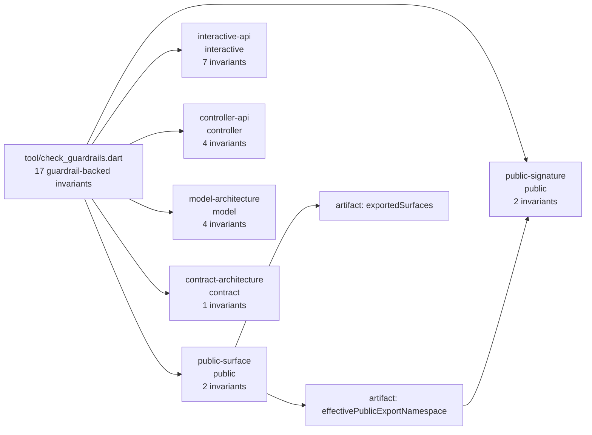

# Proof Inventory Trace

```mermaid
flowchart LR
  N0["tool/check_guardrails.dart\n17 guardrail-backed invariants"]
  N1["public-surface\npublic\n2 invariants"]
  N0 --> N1
  N2["public-signature\npublic\n2 invariants"]
  N0 --> N2
  N3["interactive-api\ninteractive\n7 invariants"]
  N0 --> N3
  N4["controller-api\ncontroller\n4 invariants"]
  N0 --> N4
  N5["model-architecture\nmodel\n4 invariants"]
  N0 --> N5
  N6["contract-architecture\ncontract\n1 invariants"]
  N0 --> N6
  N7["artifact: effectivePublicExportNamespace"]
  N1 --> N7
  N7 --> N2
  N8["artifact: exportedSurfaces"]
  N1 --> N8
```

Inventory summary:
- Guardrail rules: 6
- Runner artifacts: 2
- Invariants: 101
- Guardrail-backed invariants: 17
