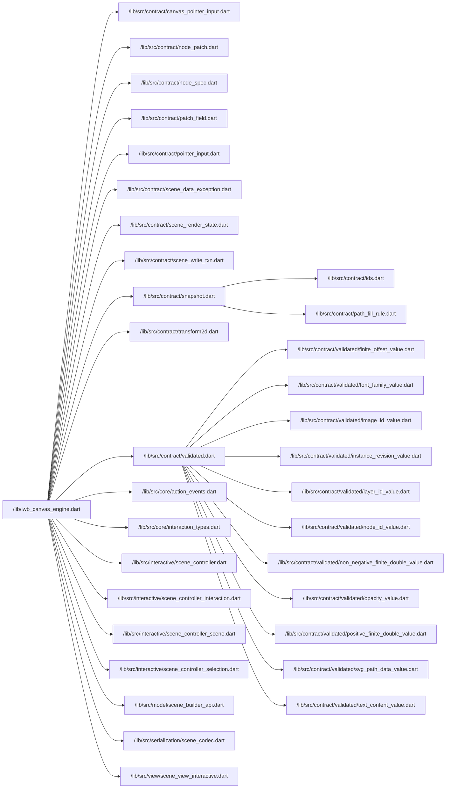

# Export Namespace Trace

Entrypoint summary:
- Entrypoint: `/lib/iwb_canvas_engine.dart`
- Direct export targets: 20
- Effective exported symbols: 77
- Transitively exported owner files: 13
- Transitively exported symbols: 16
