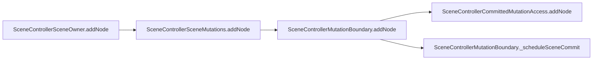

```mermaid
flowchart LR
  N0["SceneControllerSceneOwner.addNode"]
  N1["SceneControllerSceneMutations.addNode"]
  N0 --> N1
  N2["SceneControllerMutationBoundary.addNode"]
  N1 --> N2
  N3["SceneControllerCommittedMutationAccess.addNode"]
  N2 --> N3
  N4["SceneControllerMutationBoundary._scheduleSceneCommit"]
  N2 --> N4

```
