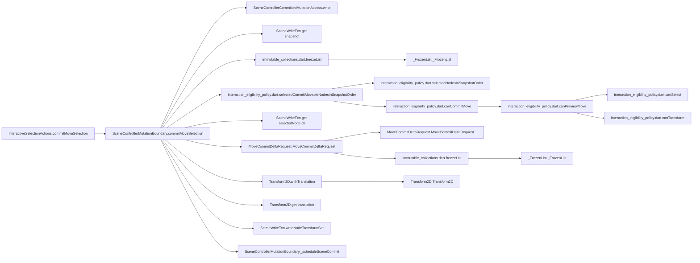

```mermaid
flowchart LR
  N0["InteractiveSelectionActions.commitMoveSelection"]
  N1["SceneControllerMutationBoundary.commitMoveSelection"]
  N0 --> N1
  N2["SceneControllerCommittedMutationAccess.write"]
  N1 --> N2
  N3["SceneWriteTxn.get snapshot"]
  N1 --> N3
  N4["immutable_collections.dart.freezeList"]
  N1 --> N4
  N5["_FrozenList._FrozenList"]
  N4 --> N5
  N6["interaction_eligibility_policy.dart.selectedCommitMovableNodesInSnapshotOrder"]
  N1 --> N6
  N7["interaction_eligibility_policy.dart.selectedNodesInSnapshotOrder"]
  N6 --> N7
  N8["interaction_eligibility_policy.dart.canCommitMove"]
  N6 --> N8
  N9["interaction_eligibility_policy.dart.canPreviewMove"]
  N8 --> N9
  N10["interaction_eligibility_policy.dart.canSelect"]
  N9 --> N10
  N11["interaction_eligibility_policy.dart.canTransform"]
  N9 --> N11
  N12["SceneWriteTxn.get selectedNodeIds"]
  N1 --> N12
  N13["MoveCommitDeltaRequest.MoveCommitDeltaRequest"]
  N1 --> N13
  N14["MoveCommitDeltaRequest.MoveCommitDeltaRequest._"]
  N13 --> N14
  N15["immutable_collections.dart.freezeList"]
  N13 --> N15
  N16["_FrozenList._FrozenList"]
  N15 --> N16
  N17["Transform2D.withTranslation"]
  N1 --> N17
  N18["Transform2D.Transform2D"]
  N17 --> N18
  N19["Transform2D.get translation"]
  N1 --> N19
  N20["SceneWriteTxn.writeNodeTransformSet"]
  N1 --> N20
  N21["SceneControllerMutationBoundary._scheduleSceneCommit"]
  N1 --> N21

```
