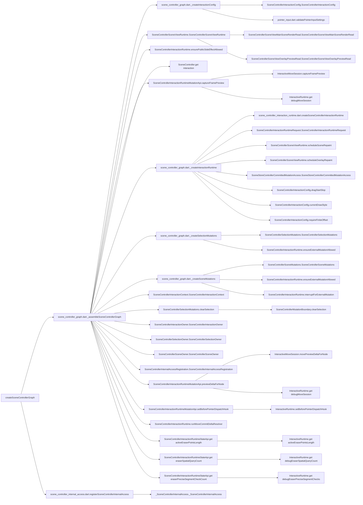

```mermaid
flowchart LR
  N0["createSceneControllerGraph"]
  N1["scene_controller_graph.dart._assembleSceneControllerGraph"]
  N0 --> N1
  N2["scene_controller_graph.dart._createInteractionConfig"]
  N1 --> N2
  N3["SceneControllerInteractionConfig.SceneControllerInteractionConfig"]
  N2 --> N3
  N4["pointer_input.dart.validatePointerInputSettings"]
  N2 --> N4
  N5["SceneControllerSceneViewRuntime.SceneControllerSceneViewRuntime"]
  N1 --> N5
  N6["SceneControllerSceneViewMainSceneRenderRead.SceneControllerSceneViewMainSceneRenderRead"]
  N5 --> N6
  N7["SceneControllerSceneViewOverlayPreviewRead.SceneControllerSceneViewOverlayPreviewRead"]
  N5 --> N7
  N8["SceneControllerInteractionRuntime.ensurePublicSideEffectAllowed"]
  N1 --> N8
  N9["SceneController.get interaction"]
  N1 --> N9
  N10["SceneControllerInteractionRuntimeMutationApi.captureFramePreview"]
  N1 --> N10
  N11["InteractiveMoveSession.captureFramePreview"]
  N10 --> N11
  N12["InteractiveRuntime.get debugMoveSession"]
  N10 --> N12
  N13["scene_controller_graph.dart._createInteractionRuntime"]
  N1 --> N13
  N14["scene_controller_interaction_runtime.dart.createSceneControllerInteractionRuntime"]
  N13 --> N14
  N15["SceneControllerInteractionRuntimeRequest.SceneControllerInteractionRuntimeRequest"]
  N13 --> N15
  N16["SceneControllerSceneViewRuntime.scheduleSceneRepaint"]
  N13 --> N16
  N17["SceneControllerSceneViewRuntime.scheduleOverlayRepaint"]
  N13 --> N17
  N18["SceneStoreControllerCommittedMutationAccess.SceneStoreControllerCommittedMutationAccess"]
  N13 --> N18
  N19["SceneControllerInteractionConfig.dragStartSlop"]
  N13 --> N19
  N20["SceneControllerInteractionConfig.currentDrawStyle"]
  N13 --> N20
  N21["SceneControllerInteractionConfig.requireFiniteOffset"]
  N13 --> N21
  N22["scene_controller_graph.dart._createSelectionMutations"]
  N1 --> N22
  N23["SceneControllerSelectionMutations.SceneControllerSelectionMutations"]
  N22 --> N23
  N24["SceneControllerInteractionRuntime.ensureExternalMutationAllowed"]
  N22 --> N24
  N25["scene_controller_graph.dart._createSceneMutations"]
  N1 --> N25
  N26["SceneControllerSceneMutations.SceneControllerSceneMutations"]
  N25 --> N26
  N27["SceneControllerInteractionRuntime.ensureExternalMutationAllowed"]
  N25 --> N27
  N28["SceneControllerInteractionRuntime.interruptForExternalMutation"]
  N25 --> N28
  N29["SceneControllerInteractionContext.SceneControllerInteractionContext"]
  N1 --> N29
  N30["SceneControllerSelectionMutations.clearSelection"]
  N1 --> N30
  N31["SceneControllerMutationBoundary.clearSelection"]
  N30 --> N31
  N32["SceneControllerInteractionOwner.SceneControllerInteractionOwner"]
  N1 --> N32
  N33["SceneControllerSelectionOwner.SceneControllerSelectionOwner"]
  N1 --> N33
  N34["SceneControllerSceneOwner.SceneControllerSceneOwner"]
  N1 --> N34
  N35["SceneControllerInternalAccessRegistration.SceneControllerInternalAccessRegistration"]
  N1 --> N35
  N36["SceneControllerInteractionRuntimeMutationApi.previewDeltaForNode"]
  N1 --> N36
  N37["InteractiveMoveSession.movePreviewDeltaForNode"]
  N36 --> N37
  N38["InteractiveRuntime.get debugMoveSession"]
  N36 --> N38
  N39["SceneControllerInteractionRuntimeMutationApi.setBeforePointerDispatchHook"]
  N1 --> N39
  N40["InteractiveRuntime.setBeforePointerDispatchHook"]
  N39 --> N40
  N41["SceneControllerInteractionRuntime.runMoveCommitDeltaResolver"]
  N1 --> N41
  N42["SceneControllerInteractionRuntimeStateApi.get activeEraserPointsLength"]
  N1 --> N42
  N43["InteractiveRuntime.get activeEraserPointsLength"]
  N42 --> N43
  N44["SceneControllerInteractionRuntimeStateApi.get eraserSpatialQueryCount"]
  N1 --> N44
  N45["InteractiveRuntime.get debugEraserSpatialQueryCount"]
  N44 --> N45
  N46["SceneControllerInteractionRuntimeStateApi.get eraserPreciseSegmentCheckCount"]
  N1 --> N46
  N47["InteractiveRuntime.get debugEraserPreciseSegmentChecks"]
  N46 --> N47
  N48["scene_controller_internal_access.dart.registerSceneControllerInternalAccess"]
  N0 --> N48
  N49["_SceneControllerInternalAccess._SceneControllerInternalAccess"]
  N48 --> N49

```
