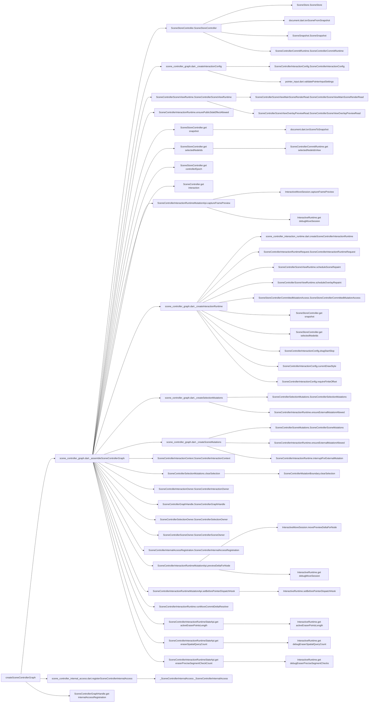

```mermaid
flowchart LR
  N0["createSceneControllerGraph"]
  N1["scene_controller_graph.dart._assembleSceneControllerGraph"]
  N0 --> N1
  N2["SceneStoreController.SceneStoreController"]
  N1 --> N2
  N3["SceneStore.SceneStore"]
  N2 --> N3
  N4["document.dart.txnSceneFromSnapshot"]
  N2 --> N4
  N5["SceneSnapshot.SceneSnapshot"]
  N2 --> N5
  N6["SceneControllerCommitRuntime.SceneControllerCommitRuntime"]
  N2 --> N6
  N7["scene_controller_graph.dart._createInteractionConfig"]
  N1 --> N7
  N8["SceneControllerInteractionConfig.SceneControllerInteractionConfig"]
  N7 --> N8
  N9["pointer_input.dart.validatePointerInputSettings"]
  N7 --> N9
  N10["SceneControllerSceneViewRuntime.SceneControllerSceneViewRuntime"]
  N1 --> N10
  N11["SceneControllerSceneViewMainSceneRenderRead.SceneControllerSceneViewMainSceneRenderRead"]
  N10 --> N11
  N12["SceneControllerSceneViewOverlayPreviewRead.SceneControllerSceneViewOverlayPreviewRead"]
  N10 --> N12
  N13["SceneControllerInteractionRuntime.ensurePublicSideEffectAllowed"]
  N1 --> N13
  N14["SceneStoreController.get snapshot"]
  N1 --> N14
  N15["document.dart.txnSceneToSnapshot"]
  N14 --> N15
  N16["SceneStoreController.get selectedNodeIds"]
  N1 --> N16
  N17["SceneControllerCommitRuntime.get selectedNodeIdsView"]
  N16 --> N17
  N18["SceneStoreController.get controllerEpoch"]
  N1 --> N18
  N19["SceneController.get interaction"]
  N1 --> N19
  N20["SceneControllerInteractionRuntimeMutationApi.captureFramePreview"]
  N1 --> N20
  N21["InteractiveMoveSession.captureFramePreview"]
  N20 --> N21
  N22["InteractiveRuntime.get debugMoveSession"]
  N20 --> N22
  N23["scene_controller_graph.dart._createInteractionRuntime"]
  N1 --> N23
  N24["scene_controller_interaction_runtime.dart.createSceneControllerInteractionRuntime"]
  N23 --> N24
  N25["SceneControllerInteractionRuntimeRequest.SceneControllerInteractionRuntimeRequest"]
  N23 --> N25
  N26["SceneControllerSceneViewRuntime.scheduleSceneRepaint"]
  N23 --> N26
  N27["SceneControllerSceneViewRuntime.scheduleOverlayRepaint"]
  N23 --> N27
  N28["SceneStoreControllerCommittedMutationAccess.SceneStoreControllerCommittedMutationAccess"]
  N23 --> N28
  N29["SceneStoreController.get snapshot"]
  N23 --> N29
  N30["SceneStoreController.get selectedNodeIds"]
  N23 --> N30
  N31["SceneControllerInteractionConfig.dragStartSlop"]
  N23 --> N31
  N32["SceneControllerInteractionConfig.currentDrawStyle"]
  N23 --> N32
  N33["SceneControllerInteractionConfig.requireFiniteOffset"]
  N23 --> N33
  N34["scene_controller_graph.dart._createSelectionMutations"]
  N1 --> N34
  N35["SceneControllerSelectionMutations.SceneControllerSelectionMutations"]
  N34 --> N35
  N36["SceneControllerInteractionRuntime.ensureExternalMutationAllowed"]
  N34 --> N36
  N37["scene_controller_graph.dart._createSceneMutations"]
  N1 --> N37
  N38["SceneControllerSceneMutations.SceneControllerSceneMutations"]
  N37 --> N38
  N39["SceneControllerInteractionRuntime.ensureExternalMutationAllowed"]
  N37 --> N39
  N40["SceneControllerInteractionRuntime.interruptForExternalMutation"]
  N37 --> N40
  N41["SceneControllerInteractionContext.SceneControllerInteractionContext"]
  N1 --> N41
  N42["SceneControllerSelectionMutations.clearSelection"]
  N1 --> N42
  N43["SceneControllerMutationBoundary.clearSelection"]
  N42 --> N43
  N44["SceneControllerInteractionOwner.SceneControllerInteractionOwner"]
  N1 --> N44
  N45["SceneControllerGraphHandle.SceneControllerGraphHandle"]
  N1 --> N45
  N46["SceneControllerSelectionOwner.SceneControllerSelectionOwner"]
  N1 --> N46
  N47["SceneControllerSceneOwner.SceneControllerSceneOwner"]
  N1 --> N47
  N48["SceneControllerInternalAccessRegistration.SceneControllerInternalAccessRegistration"]
  N1 --> N48
  N49["SceneControllerInteractionRuntimeMutationApi.previewDeltaForNode"]
  N1 --> N49
  N50["InteractiveMoveSession.movePreviewDeltaForNode"]
  N49 --> N50
  N51["InteractiveRuntime.get debugMoveSession"]
  N49 --> N51
  N52["SceneControllerInteractionRuntimeMutationApi.setBeforePointerDispatchHook"]
  N1 --> N52
  N53["InteractiveRuntime.setBeforePointerDispatchHook"]
  N52 --> N53
  N54["SceneControllerInteractionRuntime.runMoveCommitDeltaResolver"]
  N1 --> N54
  N55["SceneControllerInteractionRuntimeStateApi.get activeEraserPointsLength"]
  N1 --> N55
  N56["InteractiveRuntime.get activeEraserPointsLength"]
  N55 --> N56
  N57["SceneControllerInteractionRuntimeStateApi.get eraserSpatialQueryCount"]
  N1 --> N57
  N58["InteractiveRuntime.get debugEraserSpatialQueryCount"]
  N57 --> N58
  N59["SceneControllerInteractionRuntimeStateApi.get eraserPreciseSegmentCheckCount"]
  N1 --> N59
  N60["InteractiveRuntime.get debugEraserPreciseSegmentChecks"]
  N59 --> N60
  N61["scene_controller_internal_access.dart.registerSceneControllerInternalAccess"]
  N0 --> N61
  N62["_SceneControllerInternalAccess._SceneControllerInternalAccess"]
  N61 --> N62
  N63["SceneControllerGraphHandle.get internalAccessRegistration"]
  N0 --> N63

```
