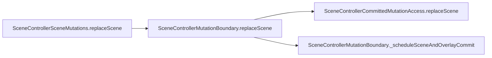

```mermaid
flowchart LR
  N0["SceneControllerSceneMutations.replaceScene"]
  N1["SceneControllerMutationBoundary.replaceScene"]
  N0 --> N1
  N2["SceneControllerCommittedMutationAccess.replaceScene"]
  N1 --> N2
  N3["SceneControllerMutationBoundary._scheduleSceneAndOverlayCommit"]
  N1 --> N3

```
