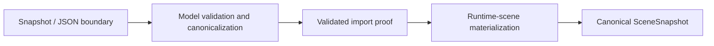
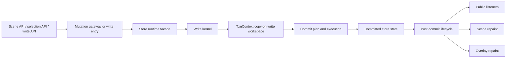
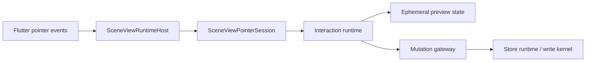
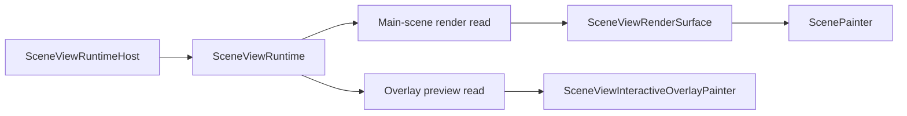

# Target Execution Flows

## Purpose

These flows describe the target control and data movement across the accepted
target architecture from ADR 0001.

They are intentionally short:

- they show boundary ownership, not every method hop
- they describe the target form, not the whole current implementation
- they are reused by family maps so those documents can stay focused on local
  cut lines

## Import And Build Flow

Boundary notes:

- Validation remains model-owned.
- Runtime materialization stays behind validated proof seams.
- The target runtime-center refactor does not move import ownership out of
  `model/**`.

## Write And Commit Flow

Boundary notes:

- The mutation gateway remains the only interaction-owned owner that performs
  committed writes.
- The write kernel remains the only owner of commit planning and execution.
- Public invalidation and repaint signaling happen after commit finalization.

## Interactive Input Flow

Boundary notes:

- Pointer hosting stays in `view/**`.
- Pointer-session lifetime and gesture state stay in the interaction family.
- Preview state remains ephemeral until it crosses the mutation gateway.

## Render Flow

Boundary notes:

- Main-scene rendering reads one atomic frame contract only.
- Overlay rendering reads live preview state only.
- Both reads may stay inside one controller-owned render-state family, but they
  must not remain one permanently mixed read interface.
