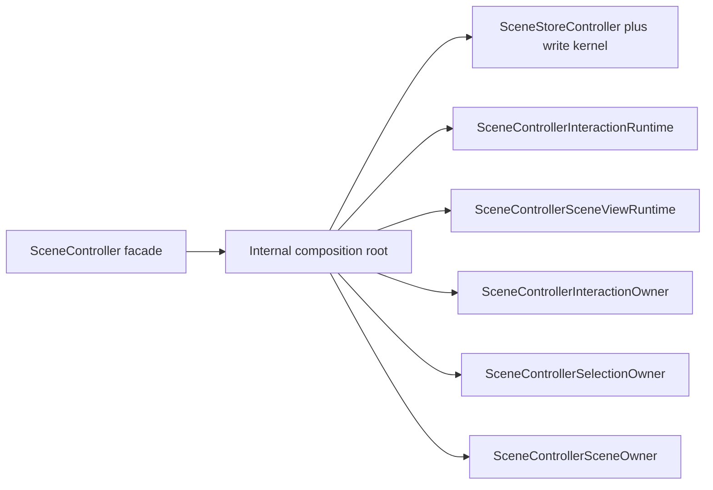
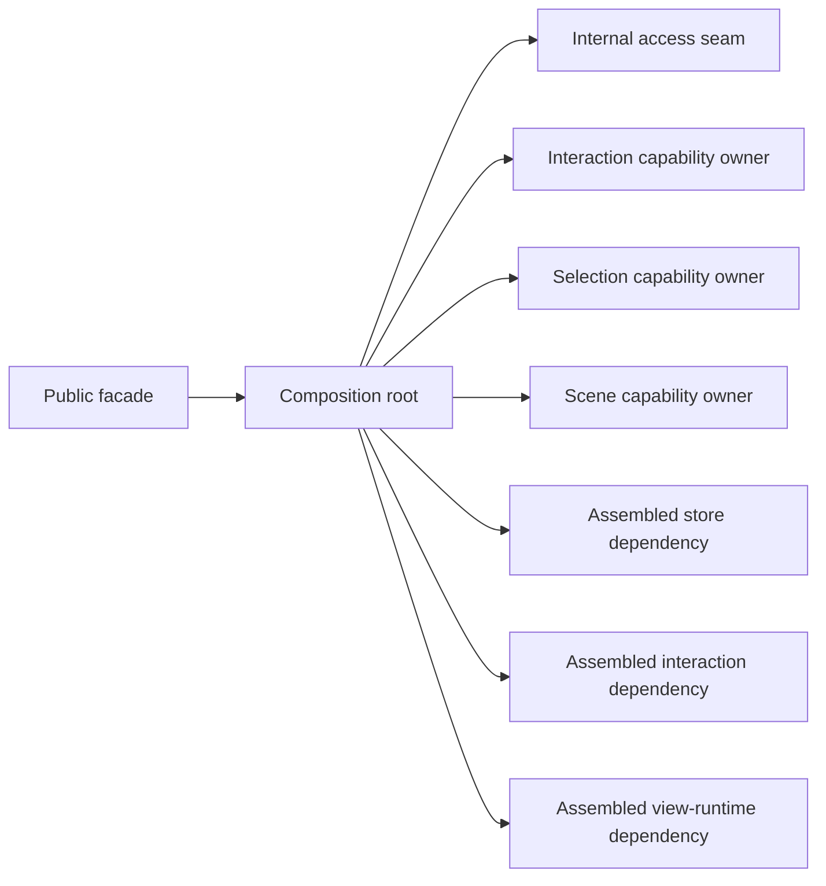

# Composition Root And Facade

## Scope

This family fixes one target question:

Who assembles the runtime center, and which public owner is allowed to expose
that assembled graph to callers?

The target answer is:

- one explicit internal composition root assembles the runtime center
- one thin public facade exposes the supported public owners
- the facade must not remain a peer assembly owner

## Target Shape

Target ownership:

- `SceneController` owns public construction, public capability exposure, and
  disposal.
- The composition root owns assembly only.
- `SceneStoreController`, `SceneControllerInteractionRuntime`, and
  `SceneControllerSceneViewRuntime` remain assembled dependencies, not peer
  public roots.

## Current Mismatch

The checked-in code already points in the right direction, but the assembly
story is still fragmented:

- `scene_controller.dart` constructs the store and triggers graph assembly.
- `scene_controller_graph.dart` contains the effective assembly root, a tuple
  carrier, helper bridge functions, and disposal helpers in one file.
- Public preview and event forwarding still travel through facade-visible
  helpers rather than through one clearly named internal root owner.

Mechanical evidence from the current DCM run:

- `scene_controller_graph.dart` has one incoming file dependency and seventeen
  outgoing file dependencies.
- `_assembleSceneControllerGraph(...)` is 68 source lines.
- `SceneController` has 25 methods and still reads as broader than a pure
  facade, even though most preview state already forwards rather than owns.

## DCM-Guided Local Cut Map

| File | DCM pressure | Interpretation | Target local role | Priority |
|---|---|---|---|---|
| `lib/src/interactive/internal/scene_controller_graph.dart` | In the narrowed composition family graph: `in=1`, `out=11`; `_assembleSceneControllerGraph(...)` is 68 SLOC | The primary assembly hot spot remains concentrated here | Explicit composition root and assembly owner | Primary |
| `lib/src/interactive/scene_controller.dart` | In the narrowed composition family graph: `in=3`, `out=4`; 25 methods | The public root is still broader than a pure facade, but graph pressure is smaller than the assembly root | Thin public facade | Primary |
| `lib/src/interactive/internal/scene_controller_internal_access.dart` | In the narrowed composition family graph: `in=1`, `out=4` | Bounded local seam for test/debug registration | Internal access seam under the composition root | Secondary |
| `lib/src/interactive/scene_controller_interaction.dart` | In the narrowed composition family graph: `in=6`, `out=4`; 42 methods on `SceneControllerInteractionOwner` | Broad public capability surface, but it is a capability owner assembled by the root, not an assembly owner itself | Capability owner | Keep local |
| `lib/src/interactive/scene_controller_selection.dart` | In the narrowed composition family graph: `in=2`, `out=2` | Bounded capability owner | Capability owner | Keep local |
| `lib/src/interactive/scene_controller_scene.dart` | In the narrowed composition family graph: `in=2`, `out=1`; 13 methods on `SceneControllerSceneOwner` | Bounded capability owner over scene wrappers | Capability owner | Keep local |

## Target Local Split

DCM supports the following second-level shape inside the composition family:

- one public facade
- one composition root
- one internal access seam
- three assembled public capability owners:
  - interaction
  - selection
  - scene

DCM does not support treating the capability owners as separate assembly roots.
The assembly pressure remains centered on `scene_controller_graph.dart`.

## Locked Local Owner Inventory

The composition family is now covered at local-owner level. The locked local
inventory is:

| Target local owner | Files | Why this bucket is locked |
|---|---|---|
| Public facade | `lib/src/interactive/scene_controller.dart` | DCM consistently shows a single public root with broad public forwarding surface, but not the broadest assembly pressure. |
| Composition root | `lib/src/interactive/internal/scene_controller_graph.dart` | DCM consistently shows the assembly hot spot here, both by graph breadth and by the long `_assembleSceneControllerGraph(...)` function. |
| Internal access seam | `lib/src/interactive/internal/scene_controller_internal_access.dart` | DCM shows a bounded seam used only around the assembled graph and facade. |
| Interaction capability owner | `lib/src/interactive/scene_controller_interaction.dart` | DCM shows a broad public capability owner, but still one assembled owner rather than a second root. |
| Selection capability owner | `lib/src/interactive/scene_controller_selection.dart` | DCM shows a bounded capability owner with narrow graph position. |
| Scene capability owner | `lib/src/interactive/scene_controller_scene.dart` | DCM shows a bounded capability owner over scene-mutation wrappers. |
| Assembled runtime dependencies | `lib/src/controller/scene_store_controller.dart`, `lib/src/interactive/internal/scene_controller_interaction_runtime.dart`, `lib/src/interactive/internal/scene_controller_scene_view_runtime.dart` | These are assembled by the composition root but owned by other family maps. The composition family must wire them, not absorb them. |

## Locked Local Target Graph

What remains unlocked after this section is only the exact internal method
placement inside the facade and composition root. The local owner inventory
itself is now fixed.

## File Map

| File | Current responsibility | Target responsibility | Action |
|---|---|---|---|
| `lib/src/interactive/scene_controller.dart` | Public root plus store construction and runtime graph bootstrapping | Thin public facade over an assembled internal root | `slim` |
| `lib/src/interactive/internal/scene_controller_graph.dart` | Assembly helper, graph carrier, helper bridge bag, and disposal helper bag | Explicit internal composition root with narrow root-only helpers | `split` |
| `lib/src/interactive/scene_controller_interaction.dart` | Public interaction capability surface | Public capability owner assembled by the root | `keep` |
| `lib/src/interactive/scene_controller_selection.dart` | Public selection capability surface | Public capability owner assembled by the root | `keep` |
| `lib/src/interactive/scene_controller_scene.dart` | Public scene mutation capability surface | Public capability owner assembled by the root | `keep` |
| `lib/src/interactive/internal/scene_controller_internal_access.dart` | Internal test/debug registration into the assembled graph | Narrow root-owned internal access registration seam | `slim` |
| `lib/src/controller/scene_store_controller.dart` | Committed store boundary that is also constructed by the public facade | Store runtime dependency assembled under the root, not a peer root | `keep` |

## Must-Stay Invariants

- `SceneController` remains the supported public interactive root.
- Public API signatures must not expose new internal runtime owners.
- One assembled `SceneViewRuntime` boundary remains the only view-facing bridge
  into interactive internals.
- The composition root stays an assembly owner, not a new logic bucket.
- Disposal of the assembled runtime center remains coordinated and explicit.

## What Is Intentionally Not Locked Yet

This family document does not lock:

- the final class name of the explicit composition root
- whether helper bridge functions disappear entirely or stay as small internal
  forwarding shims
- whether the graph tuple remains a tuple or becomes a named internal holder
- the exact internal method split between the facade and root

Those are implementation details. The ownership split above is the stable part.
