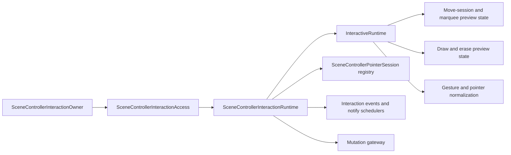
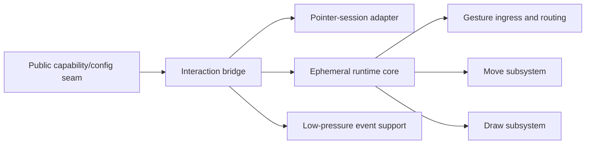

# Interaction Runtime

## Scope

This family fixes one target question:

Where does ephemeral interaction state live, and which owner is responsible for
bridging that state to public capability surfaces, pointer sessions, and the
mutation gateway?

The target answer is:

- one interaction family owns gesture state, preview state, pointer-session
  lifetime, and interaction-side scheduling
- one bridge owner exposes that family to the rest of the runtime center
- no owner in this family owns committed scene state or document conversion

## Target Shape

Target ownership:

- `SceneControllerInteractionOwner` remains the public capability surface.
- `SceneControllerInteractionRuntime` remains the interaction-family bridge:
  public-side-effect safety, session lifetime, event routing, and scheduling.
- `InteractiveRuntime` remains the ephemeral state core for move, draw, and
  gesture orchestration.
- The mutation gateway remains outside the interaction core and stays the only
  committed-write bridge.

## Current Mismatch

The checked-in family already has the right outer outline, but the bridge and
core still carry broad local surfaces:

- `SceneControllerInteractionRuntime` owns public safety checks, notify
  schedulers, event dispatcher access, pointer-session registry, mutation
  gateway wiring, and a broad preview/state forwarding surface.
- `InteractiveRuntime` owns move-session wiring, draw coordinator wiring,
  gesture routing, pointer normalization, double-tap routing, and a large
  preview/read surface in one core owner.
- The family is coherent, but the bridge/core split is not yet as narrow and
  symmetric as the target form.

Mechanical evidence from the current DCM run:

- `scene_controller_interaction_runtime.dart` has five incoming file
  dependencies and sixteen outgoing file dependencies.
- `interactive_runtime.dart` has one incoming file dependency and twelve
  outgoing file dependencies.
- `InteractiveRuntime` has:
  - 37 methods
  - response set 53
  - weighted methods per class 56
- `SceneControllerInteractionRuntime` still exposes two large extension
  surfaces with about twenty methods each.

## DCM-Guided Local Cut Map

| File | DCM pressure | Interpretation | Target local role | Priority |
|---|---|---|---|---|
| `lib/src/interactive/internal/scene_controller_interaction_runtime.dart` | `in=5`, `out=16`; two extension surfaces with about 20 methods each | The bridge owner is carrying too much public/session/event/mutation surface at once | Bridge owner for public safety, scheduling, session registry, and gateway wiring | Primary |
| `lib/src/interactive/internal/interactive_runtime.dart` | `in=1`, `out=12`; 37 methods; response set 53; weighted methods 56 | The ephemeral core is the main local orchestration hot spot | Ephemeral runtime core for move/draw/gesture state | Primary |
| `lib/src/interactive/internal/interactive_move_session.dart` | `in=2`, `out=9`; 22 methods; response set 43; weighted methods 42 | The move subsystem is already a meaningful local cut and still carries high local complexity | Local move subsystem anchor under the interaction core | Secondary |
| `lib/src/interactive/internal/interactive_draw_coordinator.dart` | `in=2`, `out=10`; 22 methods; coupling 13 | The draw subsystem is already a meaningful local cut and still carries broad local coordination | Local draw subsystem anchor under the interaction core | Secondary |
| `lib/src/interactive/internal/scene_controller_pointer_session.dart` | `in=2`, `out=6`; 18 methods; weighted methods 44 | The session owner has local complexity, but its graph position still reads as a bounded adapter rather than a family-level cut | Pointer-session adapter between the view host and the interaction bridge | Secondary |
| `lib/src/interactive/internal/interactive_event_dispatcher.dart` | `in=2`, `out=2`; no threshold hits | Low-pressure support owner | Event and notify support | Keep local |
| `lib/src/interactive/internal/interactive_runtime_callbacks.dart` | `in=3`, `out=5`; no threshold hits | Low-pressure support owner | Runtime callback bundle and seam contract | Keep local |

## Target Local Split

DCM supports the following second-level shape inside the interaction family:

- one bridge owner:
  - public-side-effect safety
  - notify scheduling
  - pointer-session registry
  - gateway wiring
- one ephemeral runtime core:
  - pointer normalization
  - gesture routing
  - local move and draw subsystem orchestration
- one move subsystem anchor under the runtime core
- one draw subsystem anchor under the runtime core
- one concrete pointer-session adapter
- small support owners for events and callback seams

The important constraint is that these are still local cuts inside one
interaction family. DCM does not justify creating a second peer runtime family
here.

## Locked Local Owner Inventory

The interaction family is now covered at local-owner level. The locked local
inventory is:

| Target local owner | Files | Why this bucket is locked |
|---|---|---|
| Public capability surface | `lib/src/interactive/scene_controller_interaction.dart`, `lib/src/interactive/internal/scene_controller_interaction_access.dart`, `lib/src/interactive/internal/scene_controller_interaction_config.dart` | These files are the stable public/config seam into the family, not ephemeral runtime owners. |
| Interaction bridge | `lib/src/interactive/internal/scene_controller_interaction_runtime.dart` | DCM still shows the main bridge hot spot here. In the narrowed interaction-family graph it keeps the broadest local wiring surface into the gateway, store, sessions, and runtime core. |
| Pointer-session adapter | `lib/src/interactive/internal/scene_controller_pointer_session.dart`, `lib/src/interactive/internal/pointer_session_token.dart` | DCM shows bounded graph position: the session file is used only by the runtime boundary and interaction bridge. |
| Ephemeral runtime core | `lib/src/interactive/internal/interactive_runtime.dart`, `lib/src/interactive/internal/interactive_runtime_callbacks.dart` | DCM still shows the core orchestration hot spot here. In the narrowed interaction-family graph it remains the main downstream orchestrator, and metrics still show 37 methods with response set 53. |
| Gesture ingress and routing | `lib/src/interactive/internal/interactive_gesture_router.dart`, `lib/src/interactive/internal/interactive_gesture_machine.dart`, `lib/src/interactive/internal/interactive_pointer_normalizer.dart`, `lib/src/interactive/internal/interactive_double_tap_router.dart` | DCM and file roles show one ingress/routing cluster under the runtime core, not a separate family. |
| Move subsystem | `lib/src/interactive/internal/interactive_move_session.dart`, `lib/src/interactive/internal/interactive_move_commit_coordinator.dart`, `lib/src/interactive/internal/interactive_move_callbacks.dart`, `lib/src/interactive/internal/interactive_move_gesture_state.dart`, `lib/src/interactive/internal/interactive_move_hit_test_engine.dart`, `lib/src/interactive/internal/interactive_move_preview_state.dart`, `lib/src/interactive/internal/interactive_move_selection_coordinator.dart` | DCM shows `interactive_move_session.dart` as the move anchor hot spot. In the narrowed interaction-family graph it remains the anchor around which the move-support owners cluster. |
| Draw subsystem | `lib/src/interactive/internal/interactive_draw_coordinator.dart`, `lib/src/interactive/internal/interactive_draw_coordinator_callbacks.dart`, `lib/src/interactive/internal/interactive_draw_eraser_engine.dart`, `lib/src/interactive/internal/interactive_draw_eraser_exact_hit.dart`, `lib/src/interactive/internal/interactive_draw_eraser_line_hit.dart`, `lib/src/interactive/internal/interactive_draw_eraser_projection.dart`, `lib/src/interactive/internal/interactive_draw_eraser_stroke_hit.dart`, `lib/src/interactive/internal/interactive_draw_eraser_targets.dart`, `lib/src/interactive/internal/interactive_draw_gesture_session.dart`, `lib/src/interactive/internal/interactive_draw_line_engine.dart`, `lib/src/interactive/internal/interactive_draw_path_buffer.dart`, `lib/src/interactive/internal/interactive_draw_stroke_engine.dart`, `lib/src/interactive/internal/interactive_draw_style.dart`, `lib/src/interactive/internal/interactive_draw_terminal_router.dart` | DCM shows `interactive_draw_coordinator.dart` as the draw anchor hot spot. In the narrowed interaction-family graph it remains the anchor around which the draw-support owners cluster. |
| Low-pressure support | `lib/src/interactive/internal/interactive_event_dispatcher.dart`, `lib/src/interactive/internal/interactive_geometry.dart`, `lib/src/interactive/internal/interactive_selection_utils.dart` | DCM does not show these as new hot spots. They stay support owners under the same family. |

## Locked Local Target Graph

What remains unlocked after this section is only internal method placement
inside these buckets. The local owner inventory itself is now fixed.

## File Map

| File | Current responsibility | Target responsibility | Action |
|---|---|---|---|
| `lib/src/interactive/scene_controller_interaction.dart` | Public interaction capability surface plus configuration and preview forwarding | Keep as the supported public interaction owner over the interaction family | `keep` |
| `lib/src/interactive/internal/scene_controller_interaction_access.dart` | Public-owner access context into config, snapshot, and runtime | Keep as the narrow public-to-runtime access seam | `keep` |
| `lib/src/interactive/internal/scene_controller_interaction_runtime.dart` | Interaction-family bridge plus broad state/mutation/session/event surface | Keep as the bridge owner, but narrow to bridge-only duties | `slim` |
| `lib/src/interactive/internal/interactive_runtime.dart` | Ephemeral interaction core for move/draw/gesture orchestration | Keep as the ephemeral core, but narrow to runtime-state ownership | `slim` |
| `lib/src/interactive/internal/interactive_move_session.dart` | Local move subsystem | Keep as the move-subsystem anchor under the interaction core and compress locally if needed | `slim` |
| `lib/src/interactive/internal/interactive_draw_coordinator.dart` | Local draw subsystem | Keep as the draw-subsystem anchor under the interaction core and compress locally if needed | `slim` |
| `lib/src/interactive/internal/scene_controller_pointer_session.dart` | Concrete session-side bridge from the view host into the interaction family | Keep as the pointer-session owner inside the interaction family | `keep` |
| `lib/src/interactive/internal/interactive_event_dispatcher.dart` | Event stream and notify scheduling support | Keep as low-pressure support infrastructure | `keep` |
| `lib/src/interactive/internal/interactive_runtime_callbacks.dart` | Callback seam bundle into the interaction core | Keep as a seam contract, not a behavior owner | `keep` |

## Must-Stay Invariants

- Interaction-owned state remains ephemeral until it crosses the mutation
  gateway.
- Pointer-session lifetime remains owned by the interaction family, not by the
  view shell.
- Interaction code remains model-free.
- Public side effects stay guarded during active resolver execution, active
  gesture ownership, and disposal.
- The interaction family must not become a second committed-scene owner.

## What Is Intentionally Not Locked Yet

This family document does not lock:

- the exact internal method placement inside the interaction bridge
- the exact internal method placement inside the move and draw subsystem anchors
- whether later DCM runs justify extra helper extraction inside one already
  locked bucket

The stable part is the top-level ownership split: public capability surface,
interaction bridge, ephemeral runtime core, and one separate mutation gateway.
