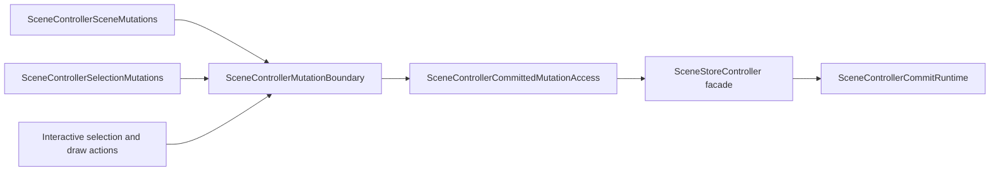
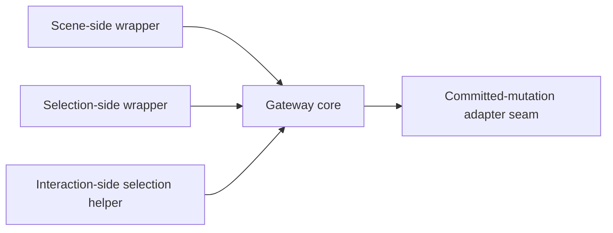

# Mutation Gateway

## Scope

This family fixes one target question:

Which owner is allowed to translate interaction or controller-side mutation
intent into committed writes?

The target answer is:

- one mutation gateway remains the only interaction-owned committed-write owner
- that gateway translates intent into committed mutations, action events, and
  repaint scheduling
- the gateway does not own gesture lifetime, view hosting, or general read
  behavior unrelated to mutation routing

## Target Shape

Target ownership:

- `SceneControllerMutationBoundary` remains the single mutation gateway.
- `SceneControllerCommittedMutationAccess` remains the adapter from the gateway
  into the committed store/write path.
- Public scene/selection mutation wrappers remain thin callers of the gateway,
  not competing write owners.

## Current Mismatch

The checked-in gateway is already in the right place, but it is broader than
its target role:

- it handles scene, selection, transform, draw, erase, replace-scene, and
  move-commit behavior in one file
- it owns action emission and repaint scheduling across several mutation
  families
- it still carries local validation and move-commit request construction
  details that make the gateway read as a large mixed owner instead of one
  narrow committed-write bridge

Mechanical evidence from the current DCM run:

- `scene_controller_mutation_boundary.dart` has four incoming file
  dependencies and twelve outgoing file dependencies.
- `SceneControllerMutationBoundary` has:
  - 30 methods
  - response set 66
  - weighted methods per class 58
- `commitMoveSelection(...)` alone is 42 source lines.

The important architectural fact is not just that the file is large. It is
that many committed mutation families are still concentrated in one owner.

## DCM-Guided Local Cut Map

| File | DCM pressure | Interpretation | Target local role | Priority |
|---|---|---|---|---|
| `lib/src/interactive/internal/scene_controller_mutation_boundary.dart` | `in=4`, `out=12`; 30 methods; response set 66; weighted methods 58; `commitMoveSelection(...)` 42 SLOC | The gateway owner is the primary local hot spot inside this family | Single committed-write gateway with narrower internal mutation-family organization | Primary |
| `lib/src/controller/scene_controller_committed_mutation_access.dart` | `in=3`, `out=7`; interface 25 methods; implementation 27 methods; coupling 14; response set 51 | The adapter seam is broad enough to deserve explicit local attention, but it still reads as one adapter family | Committed-mutation adapter from the gateway into the store family | Secondary |
| `lib/src/interactive/internal/scene_controller_scene_mutations.dart` | `in=2`, `out=5`; 13 methods | The scene wrapper has some surface breadth, but its graph position still reads as a thin public-side wrapper over the gateway | Thin scene-mutation wrapper | Keep local |
| `lib/src/interactive/internal/scene_controller_selection_mutations.dart` | `in=2`, `out=2`; no threshold hits | Low-pressure wrapper | Thin selection-mutation wrapper | Keep local |
| `lib/src/interactive/internal/interactive_selection_actions.dart` | `in=1`, `out=2`; no threshold hits | Low-pressure interaction-side adapter | Interaction-local selection action helper over the gateway | Keep local |

## Target Local Split

DCM supports the following second-level shape inside the gateway family:

- one gateway core:
  - committed mutation routing
  - action projection
  - repaint/public invalidation scheduling
- one committed-mutation adapter seam into the store family
- one thin scene-mutation wrapper
- one thin selection-mutation wrapper
- one thin interaction-side selection helper

DCM does not support turning the wrappers into separate write owners. The
pressure remains centered on the gateway core and, secondarily, on the
committed-mutation adapter seam.

## Locked Local Owner Inventory

The mutation family is now covered at local-owner level. The locked local
inventory is:

| Target local owner | Files | Why this bucket is locked |
|---|---|---|
| Gateway core | `lib/src/interactive/internal/scene_controller_mutation_boundary.dart` | DCM shows the primary hot spot here: `in=4`, `out=2` inside the narrowed family graph, 30 methods, response set 66, weighted methods 58. |
| Committed-mutation adapter seam | `lib/src/controller/scene_controller_committed_mutation_access.dart` | DCM shows one broad adapter seam into the store family: `in=3`, `out=2`, 27 methods on the implementation, response set 51. |
| Scene-side wrapper | `lib/src/interactive/internal/scene_controller_scene_mutations.dart` | DCM shows one thin upstream wrapper. In the narrowed mutation-family graph it remains only a single-hop caller of the gateway core. |
| Selection-side wrapper | `lib/src/interactive/internal/scene_controller_selection_mutations.dart` | DCM shows one thin upstream wrapper. In the narrowed mutation-family graph it remains only a single-hop caller of the gateway core. |
| Interaction-side selection helper | `lib/src/interactive/internal/interactive_selection_actions.dart` | DCM shows one thin downstream helper: `in=1`, `out=2`. |

## Locked Local Target Graph

What remains unlocked after this section is only the internal method layout of
the gateway core and adapter seam. The local owner inventory itself is now
fixed.

## File Map

| File | Current responsibility | Target responsibility | Action |
|---|---|---|---|
| `lib/src/interactive/internal/scene_controller_mutation_boundary.dart` | Central committed-write gateway plus several local mutation families | Keep as the single gateway, but narrow and reorganize around gateway-only duties | `slim` |
| `lib/src/controller/scene_controller_committed_mutation_access.dart` | Adapter from the gateway into committed store commands and writes | Keep as the committed-mutation access seam, but narrow or reorganize locally if pressure stays high | `slim` |
| `lib/src/interactive/internal/scene_controller_scene_mutations.dart` | Public scene-mutation wrapper over the gateway | Keep as a thin guard/wrapper surface | `keep` |
| `lib/src/interactive/internal/scene_controller_selection_mutations.dart` | Public selection-mutation wrapper over the gateway | Keep as a thin guard/wrapper surface | `keep` |
| `lib/src/interactive/internal/interactive_selection_actions.dart` | Interaction-local helper that delegates selection actions into the gateway | Keep as a thin interaction-side helper, not a second mutation owner | `keep` |

## Must-Stay Invariants

- The mutation gateway remains the only interaction-owned owner that performs
  committed writes.
- Gesture and preview lifetime remain outside the gateway.
- The gateway may read committed state only as needed to route and validate a
  mutation.
- Repaint and public invalidation scheduling remain aligned with committed
  mutation results.
- No public scene/selection mutation wrapper may bypass the gateway to mutate
  committed state directly.

## What Is Intentionally Not Locked Yet

This family document does not lock:

- whether the gateway core is internally regrouped by mutation family
- whether move-commit request construction stays inside the gateway core or
  moves to a nearby core-local helper
- the exact internal method split inside the committed-mutation adapter seam

The stable part is the architectural rule: one gateway, one committed-mutation
access seam, and no competing interactive write owner.
