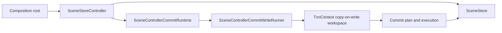
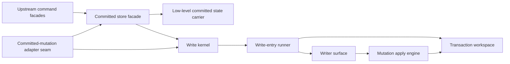

# Store And Commit Path

## Scope

This family fixes one target question:

Which owners are allowed to hold committed scene state, expose committed reads,
and execute transactional writes?

The target answer is:

- one store family owns committed scene state and committed read access
- one write kernel owns transactional write execution and commit planning
- interaction and view owners consume this family, but do not become committed
  scene owners themselves

## Target Shape

Target ownership:

- `SceneStore` remains the low-level committed state carrier.
- `SceneStoreController` remains the committed store facade for snapshot reads,
  committed queries, and write entrypoints.
- `SceneControllerCommitRuntime` remains the write kernel and commit executor.
- `TxnContext` remains the copy-on-write workspace.

## Current Mismatch

The checked-in store path is structurally close to the target, but the store
facade is still broader than ideal:

- `SceneStoreController` owns snapshot caching, command owners, committed write
  entrypoints, spatial-query helpers, replace-scene helpers, and revision
  reads.
- `SceneControllerCommitRuntime` reads as a more coherent kernel: it owns write
  execution, commit planning, post-commit lifecycle, signals, and spatial-index
  cache coordination.
- This means the likely long-term compression target is the store facade, not a
  redesign of the kernel/store split itself.

Mechanical evidence from the current DCM run:

- `scene_store_controller.dart` has six incoming file dependencies and fifteen
  outgoing file dependencies.
- `SceneStoreController` has 16 methods and coupling to 14 other classes.
- `scene_controller_commit_runtime.dart` has three incoming file dependencies
  and fifteen outgoing file dependencies.
- `SceneControllerCommitRuntime` has 15 methods and coupling to 17 other
  classes, but the current code still reads as one coherent write kernel.

## DCM-Guided Local Cut Map

| File | DCM pressure | Interpretation | Target local role | Priority |
|---|---|---|---|---|
| `lib/src/controller/scene_store_controller.dart` | `in=6`, `out=15`; 16 methods; coupling 14 | The store facade is the primary local breadth hot spot in this family | Committed store facade over reads, queries, and write entrypoints | Primary |
| `lib/src/controller/scene_controller_commit_runtime.dart` | `in=3`, `out=15`; 15 methods; coupling 17 | The kernel is mechanically hot, but its current responsibility still reads as one coherent write kernel | Write kernel and commit executor | Secondary |
| `lib/src/controller/txn_context.dart` | `in=13`, `out=10`; 23 methods | The workspace is central and broad, but DCM alone does not justify treating it as a separate architecture family | Copy-on-write transaction workspace | Secondary |
| `lib/src/controller/scene_controller_commit_write_runner.dart` | `in=1`, `out=6`; no threshold hits | Low-pressure write-entry owner | Transaction runner and callback boundary | Keep local |
| `lib/src/controller/store.dart` | `in=6`, `out=6`; no threshold hits | Stable low-level carrier | Low-level committed state owner | Keep local |

## Target Local Split

DCM supports the following second-level shape inside the store family:

- one low-level committed state carrier
- one committed store facade
- one write kernel
- one transaction runner
- one copy-on-write workspace

The important DCM-guided interpretation is priority:

- the default local slimming target is the store facade
- the write kernel is mechanically hot, but not yet a justified architecture
  split target on its own
- the workspace remains a first-class core owner, not a signal to invent a new
  peer family

## Locked Local Owner Inventory

The store family is now covered at local-owner level. The locked local
inventory is:

| Target local owner | Files | Why this bucket is locked |
|---|---|---|
| Low-level committed state carrier | `lib/src/controller/store.dart` | DCM consistently shows stable central carrier behavior. In the narrowed store-family graph it stays a pure carrier with no downstream family-owned logic. |
| Committed store facade | `lib/src/controller/scene_store_controller.dart`, `lib/src/controller/change_set.dart`, `lib/src/controller/committed_store_state.dart`, `lib/src/controller/scene_snapshot_materializer.dart`, `lib/src/controller/scene_invariants.dart` | DCM consistently shows `scene_store_controller.dart` as the primary facade hot spot. In the narrowed store-family graph it remains the broadest local façade over reads, queries, and write entrypoints. |
| Upstream command facades | `lib/src/controller/commands/draw_commands.dart`, `lib/src/controller/commands/move_commands.dart`, `lib/src/controller/commands/scene_commands.dart` | DCM shows these as upstream callers of `SceneWriter` and `SceneStoreController`, not separate store owners. |
| Write kernel | `lib/src/controller/scene_controller_commit_runtime.dart`, `lib/src/controller/scene_controller_post_commit_lifecycle.dart`, `lib/src/controller/scene_controller_commit_debug.dart`, `lib/src/controller/internal/repaint_flag.dart`, `lib/src/controller/internal/signals_buffer.dart`, `lib/src/controller/internal/signal_event.dart`, `lib/src/controller/internal/spatial_index_cache.dart` | DCM consistently shows `scene_controller_commit_runtime.dart` as the kernel anchor. The surrounding files stay clustered around commit lifecycle and kernel-owned state. |
| Write-entry runner | `lib/src/controller/scene_controller_commit_write_runner.dart` | DCM shows one bounded runner under the kernel, not a second kernel peer. |
| Transaction workspace | `lib/src/controller/txn_context.dart`, `lib/src/controller/txn_workspace.dart`, `lib/src/controller/txn_derived_state.dart` | DCM consistently shows `txn_context.dart` as the workspace anchor, with `txn_workspace.dart` and `txn_derived_state.dart` remaining workspace-internal slices. |
| Writer surface | `lib/src/controller/scene_writer.dart`, `lib/src/controller/scene_writer_runtime.dart`, `lib/src/controller/scene_writer_nodes.dart`, `lib/src/controller/scene_writer_scene.dart`, `lib/src/controller/scene_writer_selection.dart`, `lib/src/controller/scene_writer_signals.dart`, `lib/src/controller/scene_writer_types.dart`, `lib/src/controller/scene_writer_support.dart`, `lib/src/controller/scene_writer_command_results.dart` | DCM consistently shows `scene_writer.dart` as one local write-surface anchor, and the rest remain a clearly named write-surface cluster under that anchor. |
| Mutation apply engine | `lib/src/controller/mutation_executor.dart`, `lib/src/controller/mutation_commit_preparer.dart`, `lib/src/controller/mutation_execution_types.dart`, `lib/src/controller/mutation_input_guards.dart`, `lib/src/controller/mutation_op.dart`, `lib/src/controller/node_mutation_applier.dart`, `lib/src/controller/scene_mutation_applier.dart`, `lib/src/controller/selection_state_mutation_applier.dart`, `lib/src/controller/selection_transform_mutation_applier.dart`, `lib/src/controller/selection_post_apply_finalizer.dart` | DCM shows one mutation/apply cluster centered on `mutation_executor.dart` and `mutation_op.dart`, not a separate family. |
| Interaction-side adapter into the store family | `lib/src/controller/scene_controller_committed_mutation_access.dart` | DCM shows one explicit adapter seam from the mutation family into the store family. |

## Locked Local Target Graph

What remains unlocked after this section is only internal method placement and
helper extraction inside these buckets. The local owner inventory itself is now
fixed.

## File Map

| File | Current responsibility | Target responsibility | Action |
|---|---|---|---|
| `lib/src/controller/store.dart` | Committed store carrier and revision/id state holder | Keep as the low-level committed state owner | `keep` |
| `lib/src/controller/scene_store_controller.dart` | Committed store facade, read facade, query facade, and write-entry facade | Keep as the committed store facade, but narrow its local breadth over time | `slim` |
| `lib/src/controller/scene_controller_commit_runtime.dart` | Write kernel, commit planning/execution owner, signal and repaint lifecycle coordination | Keep as the write kernel | `keep` |
| `lib/src/controller/scene_controller_commit_write_runner.dart` | Transaction runner and callback boundary owner | Keep as the write-entry runner | `keep` |
| `lib/src/controller/txn_context.dart` | Copy-on-write transactional workspace | Keep as the transaction workspace and compress locally only if later evidence justifies it | `keep` |
| `lib/src/controller/scene_writer.dart` | Write-surface anchor over specialized writer modules | Keep as the write-surface anchor, not a separate kernel or store family | `keep` |
| `lib/src/controller/scene_controller_committed_mutation_access.dart` | Adapter from interaction-side gateway into store and kernel | Keep as an adapter into the store family, not a competing store owner | `keep` |

## Must-Stay Invariants

- The committed store and write kernel remain the only owners of committed
  scene state.
- Committed reads remain snapshot-backed.
- Writes remain synchronous, non-nested, and atomic.
- Mutable runtime scene state must not escape the write subsystem.
- Interaction and view families may consume committed reads, but must not own
  committed scene mutation state.

## What Is Intentionally Not Locked Yet

This family document does not lock:

- the final local slimming of `SceneStoreController`
- whether some committed-read helpers leave the store facade for narrower
  nearby helpers
- the exact internal method split inside `SceneWriter`, the mutation apply
  engine, or the transaction workspace
- any later optimization below the now-locked local owner inventory

The stable part is the top-level ownership split: one store family, one write
kernel, one copy-on-write workspace, and no second committed-scene owner.
