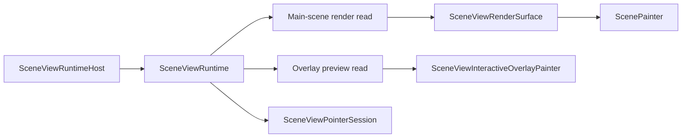
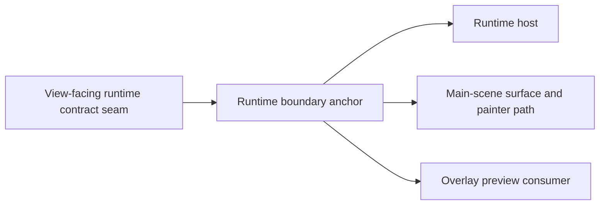

# View Runtime And Render Seam

## Scope

This family fixes one target question:

How should the view shell cross into the runtime center without mixing
main-scene frame reads and live overlay preview reads behind one permanently
ambiguous interface?

The target answer is:

- one assembled `SceneViewRuntime` boundary remains the only view-facing bridge
- the render side becomes a controller-owned render-state family with two
  distinct read roles:
  - main-scene render read
  - overlay preview read

## Target Shape

Target ownership:

- `SceneViewRuntime` stays assembled by the controller side and consumed by the
  view shell.
- The main-scene read owns atomic frame capture and paint-plan preparation.
- The overlay read owns marquee and draw preview access plus overlay repaint
  signaling.

## Current Mismatch

The checked-in seam is intentionally centralized, but still mixed:

- `SceneViewRenderState` combines atomic frame capture, paint-plan preparation,
  overlay repaint listenable, marquee selection, and draw preview getters.
- `SceneControllerSceneViewRenderState` implements both read roles in one
  owner.
- `SceneViewRuntimeHost` forwards one `renderState` instance to both
  `SceneViewRenderSurface` and `SceneViewInteractiveOverlayPainter`.
- `SceneController` still reaches preview reads through the same mixed
  controller-owned render-state family.

Mechanical evidence from the current DCM run:

- `scene_controller_scene_view_runtime.dart` has one incoming file dependency
  and nine outgoing file dependencies.
- `SceneControllerSceneViewRenderState` has 25 methods and coupling to 15 other
  classes.
- The cut remains localized:
  - `scene_view_runtime_host.dart` has one incoming and six outgoing file
    dependencies
  - `scene_view_render_surface.dart` has one incoming and five outgoing file
    dependencies

The localized cut is the key fact: the split belongs inside the runtime
boundary, not in the view shell.

## DCM-Guided Local Cut Map

| File | DCM pressure | Interpretation | Target local role | Priority |
|---|---|---|---|---|
| `lib/src/interactive/internal/scene_controller_scene_view_runtime.dart` | In the narrowed view/runtime graph: `in=1`, `out=4`; `SceneControllerSceneViewRenderState` has 25 methods and coupling 15 | The mixed render seam remains the primary hot spot in this family | Runtime boundary plus split render-state family anchor | Primary |
| `lib/src/view/scene_view_runtime_host.dart` | In the narrowed view/runtime graph: `in=1`, `out=4`; host state coupling 17 | The host is graph-bounded but operationally central | Runtime host | Secondary |
| `lib/src/view/scene_view_render_surface.dart` | In the narrowed view/runtime graph: `in=1`, `out=4`; render-surface state coupling 15 | The surface is a bounded main-scene consumer, not the seam owner | Main-scene render surface | Secondary |
| `lib/src/view/scene_view_interactive_overlay_painter.dart` | In the narrowed view/runtime graph: `in=1`, `out=0` | Pure overlay consumer | Overlay preview consumer | Keep local |
| `lib/src/render/scene_painter.dart` | In the narrowed view/runtime graph: `in=1`, `out=10`; imports 14 | Main-scene paint anchor under the render side | Main-scene painter anchor | Keep local |
| `lib/src/render/scene_painter_frame.dart` | In the narrowed view/runtime graph: `in=2`, `out=3`; `ScenePainterFrameOwner` coupling 16 | Hot render-side support owner, but still downstream of the main-scene read side | Frame-preparation support owner | Keep local |
| `lib/src/interactive/internal/scene_controller_paint_candidate_stage.dart` | In the narrowed view/runtime graph: `in=1`, `out=1` | Bounded committed-paint admission helper | Committed paint-plan support owner | Keep local |

## Target Local Split

DCM supports the following second-level shape inside the view/runtime family:

- one runtime boundary anchor
- one runtime host
- one main-scene render surface
- one overlay preview consumer
- one main-scene painter anchor
- small render-side support owners under the main-scene read path

DCM does not support moving seam ownership into the view shell. The hot spot
remains the controller-owned runtime boundary and mixed render-state family.

## Locked Local Owner Inventory

The view/runtime family is now covered at local-owner level. The locked local
inventory is:

| Target local owner | Files | Why this bucket is locked |
|---|---|---|
| View-facing runtime contract seam | `lib/src/contract/scene_view_runtime.dart`, `lib/src/contract/scene_view_render_state.dart` | These files define the runtime-facing seam that the target split must evolve without becoming public API. |
| Runtime boundary anchor | `lib/src/interactive/internal/scene_controller_scene_view_runtime.dart`, `lib/src/interactive/internal/scene_controller_paint_candidate_stage.dart` | DCM consistently shows the seam hot spot here, while the paint-candidate stage stays a bounded support owner under the same anchor. |
| Runtime host | `lib/src/view/scene_view_runtime_host.dart`, `lib/src/view/scene_view_interactive.dart`, `lib/src/view/scene_view_interactive_pointer_host.dart`, `lib/src/view/scene_view_pointer_router.dart` | DCM shows the host as bounded but central. The widget adapter and pointer-host files belong to the same host side of the seam. |
| Main-scene surface and painter path | `lib/src/view/scene_view_render_surface.dart`, `lib/src/render/scene_painter.dart`, `lib/src/render/scene_painter_frame.dart`, `lib/src/render/scene_painter_background.dart`, `lib/src/render/scene_painter_node_renderer.dart`, `lib/src/render/scene_painter_selection.dart`, `lib/src/render/scene_painter_shell.dart`, `lib/src/render/scene_painter_contract.dart`, `lib/src/render/render_geometry_cache.dart`, `lib/src/render/render_geometry_builder.dart`, `lib/src/render/render_geometry_entry.dart`, `lib/src/render/scene_render_caches.dart`, `lib/src/render/cache/scene_path_metrics_cache.dart`, `lib/src/render/cache/scene_static_layer_cache.dart`, `lib/src/render/cache/scene_stroke_path_cache.dart`, `lib/src/render/cache/scene_text_layout_cache.dart`, `lib/src/render/canvas_scope.dart`, `lib/src/render/scene_grid_renderer.dart`, `lib/src/view/scene_view_defaults.dart` | DCM shows `scene_view_render_surface.dart` as the bounded surface and `scene_painter.dart` as the painter anchor. The rest remain one downstream render-support cluster. |
| Overlay preview consumer | `lib/src/view/scene_view_interactive_overlay_painter.dart` | DCM shows a pure leaf consumer with no downstream dependencies in the narrowed family graph. |

## Locked Local Target Graph

What remains unlocked after this section is only the exact successor contract
shape for the split main-scene and overlay reads. The local owner inventory
itself is now fixed.

## File Map

| File | Current responsibility | Target responsibility | Action |
|---|---|---|---|
| `lib/src/contract/scene_view_runtime.dart` | One view-facing runtime bridge that exposes one `renderState` and pointer-session creation | Keep one view-facing runtime bridge while allowing a richer internal render-state family behind it | `keep` |
| `lib/src/contract/scene_view_render_state.dart` | Mixed contract for frame reads and overlay preview reads | Render-state family with distinct main-scene and overlay read contracts or facets | `split` |
| `lib/src/interactive/internal/scene_controller_scene_view_runtime.dart` | Runtime boundary implementation, mixed render-state implementation, and pointer-session factory | Keep one runtime boundary implementation, but split the render-state implementation internally by read role | `split` |
| `lib/src/view/scene_view_runtime_host.dart` | Widget-side runtime installation and runtime swap owner | Keep as the runtime host and consume only the assembled runtime boundary | `keep` |
| `lib/src/view/scene_view_render_surface.dart` | Main-scene render surface consuming the mixed render state | Consume only the main-scene render read | `slim` |
| `lib/src/view/scene_view_interactive_overlay_painter.dart` | Overlay painter consuming the mixed render state | Consume only the overlay preview read | `slim` |
| `lib/src/interactive/scene_controller.dart` | Public preview getters routed through the mixed render-state family | Expose preview reads through the overlay-side facet only | `slim` |

## Must-Stay Invariants

- `SceneViewRuntime` remains the only view-facing runtime boundary.
- `SceneViewRenderSurface` stays a read-only main-scene consumer.
- Overlay repaint ownership stays separate from the main scene repaint path.
- Main-scene rendering continues to paint from one atomic frame read.
- The render-seam split must not require a public package API break because
  `SceneViewRuntime` and `SceneViewRenderState` are not exported from the
  public barrel.

## What Is Intentionally Not Locked Yet

This family document does not lock:

- whether the successor read surfaces are two interfaces, two facets on one
  holder, or one family of small contract types
- whether `SceneViewRuntime` exposes those reads as separate getters or through
  one family wrapper
- the final names of the successor read contracts
- the exact internal method split between the runtime boundary anchor and its
  downstream render-support owners

Those names can change. The stable rule is that the main-scene and overlay
read responsibilities must stop sharing one forever-mixed read contract.
