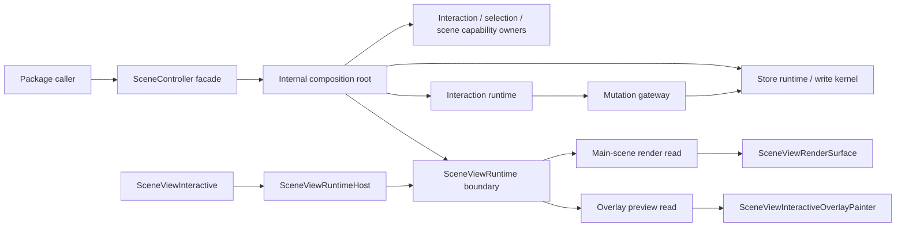

# Target Architecture Overview

- Status: Incremental
- Last reviewed against checked-in code: 2026-04-22

## Role

This document is the top-level working map for the accepted target form.

- ADR 0001 defines the accepted top-level target.
- This overview groups that target into owner families.
- The family docs hold the code-facing decomposition.
- `PLAN.md` holds execution order and slice sequencing.

This overview is intentionally target-first:

- `Target shape` sections describe the intended end-state.
- `Current mismatch` sections summarize only the gap that still matters.
- Slice order does not belong here.

## Coverage Model

| Level | Purpose | Current coverage |
|---|---|---|
| Owner map | Show the target runtime center and stable boundaries | Filled |
| Execution flows | Show target data/control movement across boundaries | Filled |
| Family maps | Show target ownership and file-level cut lines inside one family | Filled for all top-level owner families |
| Local owner inventory | Show the full current file inventory grouped into target local owners and subsystem anchors | Filled for all primary runtime-center families |
| File cards | Mark `keep`, `slim`, `split`, `move`, or `retire` for concrete files | Filled for all primary runtime-center families at owner/subsystem granularity |

## Action Vocabulary

| Action | Meaning |
|---|---|
| `keep` | The file already owns the right stable responsibility. |
| `slim` | The file stays, but its responsibility must become narrower. |
| `split` | One mixed owner must become two or more clearer owners. |
| `move` | The responsibility belongs in a different owner or family. |
| `retire` | The file or seam should disappear after the target cut lands. |
| `defer` | The family target is known, but the file-level cut is not yet fixed. |

## Target Owner Map

## Target Coverage By Family

Top-level target coverage is complete when every primary runtime-center family
has an explicit owner-level target shape. Local owner coverage is complete when
every primary runtime-center family also has an explicit local owner inventory.

| Family | Target status | Current focus | Primary files | Detailed map |
|---|---|---|---|---|
| Composition root and facade | Locked at file-family level | Make one explicit assembly owner and keep a thin public facade | `scene_controller.dart`, `scene_controller_graph.dart` | [composition_root_and_facade.md](families/composition_root_and_facade.md) |
| View runtime and render seam | Locked at file-family level | Split mixed render reads while keeping one assembled `SceneViewRuntime` boundary | `scene_view_runtime.dart`, `scene_view_render_state.dart`, `scene_controller_scene_view_runtime.dart` | [view_runtime_and_render_seam.md](families/view_runtime_and_render_seam.md) |
| Interaction runtime | Locked at owner and local-owner level | Keep one interaction family and narrow the bridge/core split without changing family ownership | `scene_controller_interaction_runtime.dart`, `interactive_runtime.dart` | [interaction_runtime.md](families/interaction_runtime.md) |
| Mutation gateway | Locked at owner and local-owner level | Keep one committed-write gateway and narrow it around committed mutation routing | `scene_controller_mutation_boundary.dart` | [mutation_gateway.md](families/mutation_gateway.md) |
| Store and commit path | Locked at owner and local-owner level | Preserve store vs write-kernel distinction and narrow the store facade over time | `scene_store_controller.dart`, `scene_controller_commit_runtime.dart` | [store_and_commit_path.md](families/store_and_commit_path.md) |

## DCM Use

This overview does not re-argue the ADR.

Its job is to aggregate the DCM-guided target map:

- family docs should cite current DCM evidence for their local cut lines
- DCM output is used as mechanical evidence for coupling, fan-in, and fan-out
- the raw DCM graph is not the canonical map; this document owns the curated
  family-level target view

## Update Policy

When extending this directory:

- update ADR 0001 only if the accepted top-level target changes
- add a new family document only after the target owner boundary is stable
- prefer one family document over many per-file notes
- keep current-state detail out of this directory unless it explains the target
  gap
- move stable current-state rules back to `ARCHITECTURE.md`, not here
- keep slice ordering out of this overview and in `PLAN.md`
- treat method placement and helper extraction as implementation detail unless
  DCM shows a new owner-level or subsystem-level hot spot
