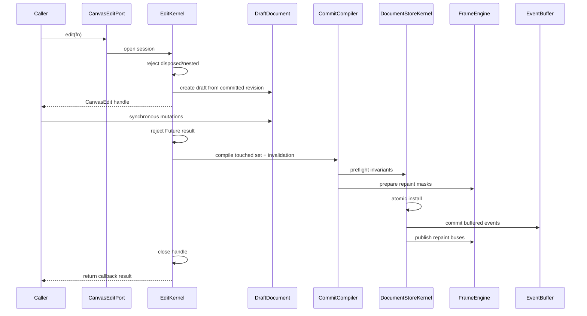
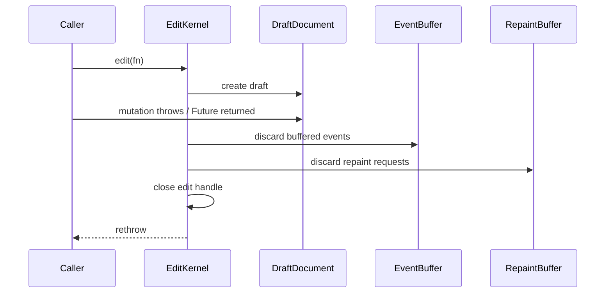
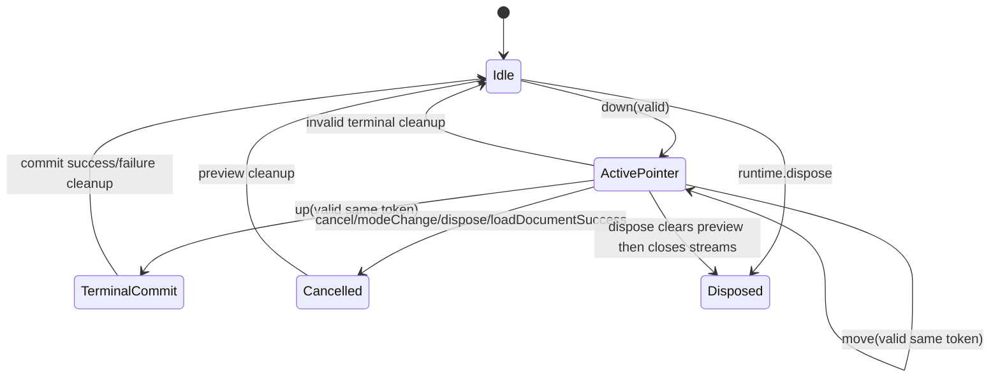
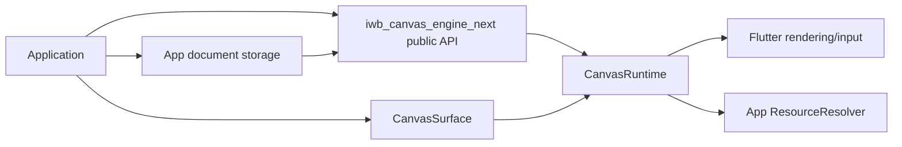
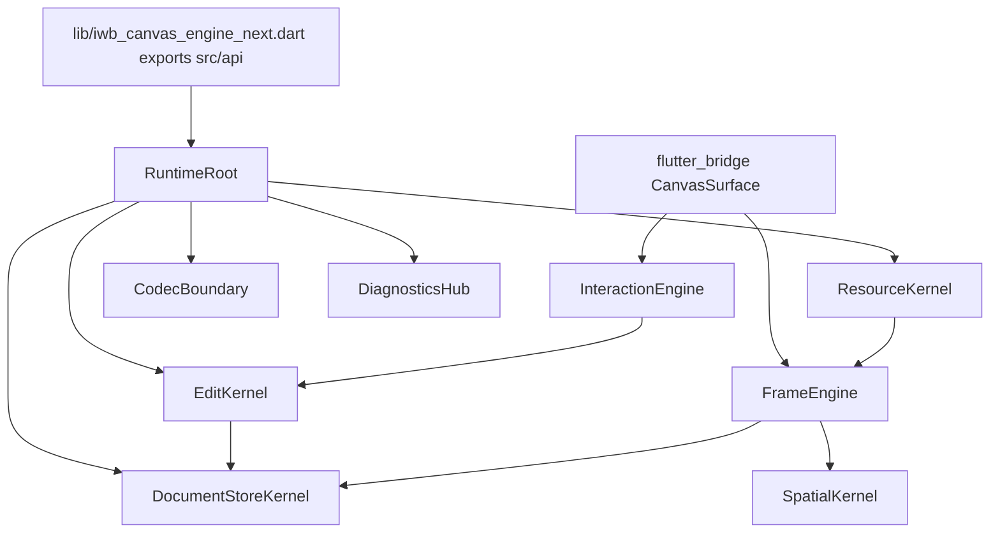

# `iwb_canvas_engine_next`: полный implementation plan без legacy-фасада внутри нового движка

## 0. Статус и обязательное архитектурное решение

Документ является целевой спецификацией реализации для переписывания библиотеки с нуля.
Он заменяет прежнюю модель, где новый runtime должен был сохранять старую форму публичного API.

Фиксированное решение:

```text
iwb_canvas_engine_next
  -> отдельный новый package;
  -> новый публичный API v1;
  -> один новый runtime;
  -> новый core/store/edit/frame/interaction/resource/codec;
  -> functional-compatible со старым движком;
  -> не API-compatible со старым движком;
  -> без legacy facade внутри нового движка;
  -> без старого runtime внутри поставляемого артефакта.
```

Старый движок используется только как **functional oracle**:

```text
old iwb_canvas_engine
  -> показывает, какие сценарии, edge cases, события, проверки и performance probes нельзя потерять;
  -> не задаёт форму нового публичного API;
  -> не импортируется новым package;
  -> не используется как fallback;
  -> не оборачивается новым runtime.
```

Запрещено в новом package:

```text
- реализовывать legacy facade старого API;
- экспортировать SceneController;
- экспортировать SceneSnapshot;
- экспортировать NodeSpec;
- экспортировать NodePatch;
- экспортировать PatchField;
- экспортировать SceneWriteTxn;
- экспортировать старые schema v7 public entrypoints как API нового package;
- размещать AppCanvasPort внутри нового package;
- размещать OldEngineAdapter внутри нового package;
- размещать NewEngineAdapter внутри нового package;
- использовать старый runtime в production path;
- доказывать полноту нового API прохождением старого public API ledger.
```

Приложение может иметь собственный слой миграции, но он находится **вне** `iwb_canvas_engine_next`:

```text
app/
  canvas_port/
    AppCanvasPort
    OldEngineAdapter -> old iwb_canvas_engine
    NewEngineAdapter -> iwb_canvas_engine_next
    adapter_contract_tests
```

Этот слой не является deliverable движка. Движок обязан предоставить чистый новый API и собственные contract tests. Приложение само решает, как адаптировать его к `AppCanvasPort`.

---

## 1. Что проверено по старому архиву

Статическая сверка выполнена по распакованному архиву текущего кода. Тесты не запускались, потому что в среде нет `dart`/`flutter` toolchain. Старый код использован только как источник возможностей и поведения.

Основные oracle-файлы:

```text
lib/iwb_canvas_engine.dart
lib/src/contract/snapshot.dart
lib/src/contract/node_spec.dart
lib/src/contract/node_patch.dart
lib/src/contract/scene_contract_limits.dart
lib/src/contract/pointer_input.dart
lib/src/contract/canvas_pointer_input.dart
lib/src/contract/scene_data_exception.dart
lib/src/core/action_events.dart
lib/src/core/scene_limits.dart
lib/src/core/tool_defaults.dart
lib/src/core/node_geometry.dart
lib/src/core/hit_test.dart
lib/src/core/scene_spatial_index.dart
lib/src/core/paint_candidate_admission.dart
lib/src/interactive/scene_controller.dart
lib/src/interactive/scene_controller_scene.dart
lib/src/interactive/scene_controller_interaction.dart
lib/src/interactive/scene_controller_selection.dart
lib/src/interactive/internal/scene_controller_interaction_config.dart
lib/src/interactive/internal/interactive_event_dispatcher.dart
lib/src/interactive/internal/interactive_move_commit_coordinator.dart
lib/src/interactive/internal/interactive_move_selection_coordinator.dart
lib/src/interactive/internal/interactive_draw_action_emitter.dart
lib/src/interactive/internal/scene_controller_mutation_boundary.dart
lib/src/controller/scene_controller_commit_write_runner.dart
lib/src/controller/scene_controller_commit_runtime.dart
lib/src/controller/scene_controller_committed_mutation_access.dart
lib/src/model/scene_builder_decode_*.dart
lib/src/serialization/scene_codec.dart
lib/src/view/scene_view_interactive.dart
lib/src/view/scene_view_interactive_overlay_painter.dart
lib/src/contract/scene_view_render_state.dart
example/lib/ui/canvas_example/view_models/canvas_example_view_model.dart
tool/goldens/public_api_symbols.txt
```

Поведенческие свойства старого кода, которые должны быть сохранены функционально:

```text
- синхронная невложенная запись;
- запрет async write callback;
- stale write handle после завершения транзакции;
- rollback без сигналов и repaint;
- staged document replacement: validate/materialize -> interrupt gesture -> atomic install;
- неуспешная загрузка/replace не прерывает активный жест;
- main paint захватывает frame один раз;
- overlay repaint отделён от main repaint;
- selected move preview repaint-ит main scene, а не overlay;
- marquee/draw/line/eraser preview repaint-ит overlay;
- pending line state хранит start/timestamp/color/thickness;
- text editing инициируется событием, а UI редактирования принадлежит приложению;
- pointer policy имеет tapSlop/doubleTapSlop/doubleTapMaxDelayMs/deferSingleTap/dragStartSlop;
- draw style имеет отдельные thickness для pencil/marker/line/eraser и marker opacity;
- external visual resource repaint был представлен через notifySceneChanged();
- scene limits включают id lengths, text/path/stroke/json/layer/node limits;
- geometry имеет hit slop 4.0, отдельные hit bounds и paint bounds;
- spatial index имеет cell size 256, max cells per node 1024, max query cells 50000, large-node/outlier registry и fallback;
- old action stream закрывается при dispose;
- timestamps монотонно нормализуются runtime-ом;
- старый imageId должен быть мигрируем в resourceId/appKey;
- palette и grid.color существуют в старом документе и не должны потеряться без ADR.
```

---

## 2. Несущая модель новой библиотеки

Новая библиотека предоставляет графический runtime для холста. Она не хранит предметную модель приложения.

```text
Application domain state
  -> живёт в приложении;
  -> может ссылаться на canvas element ids;
  -> не хранится внутри engine core.

Canvas engine state
  -> документ холста;
  -> элементы;
  -> ресурсы;
  -> выделение;
  -> камера;
  -> режимы и preview;
  -> render/cache/spatial/runtime state.
```

Внутри движка роли разделены так:

| Зона | Хранит | Не должна делать |
|---|---|---|
| Public API | стабильные DTO, операции, события, ошибки | раскрывать таблицы, handles, caches, runtime internals |
| DocumentStoreKernel | committed document state, revisions, selection, resources | читать gesture state или Flutter widget |
| EditKernel | synchronous edit sessions, draft, touched sets, commit/rollback | выполнять paint или pointer routing |
| InteractionEngine | pointer sessions, tools, preview state, terminal commit requests | менять committed document в обход EditKernel |
| FrameEngine | captured main/overlay frames, paint plans, repaint buses | экспортировать public document |
| ResourceKernel | resource descriptors, resolver cache, invalidation | владеть app domain assets |
| SpatialKernel | coarse candidate lookup, outlier policy | быть source of truth для сцены |
| CodecBoundary | schema v1 encode/decode, validation, diagnostics | зависеть от Flutter widget или gestures |
| DiagnosticsHub | internal diagnostic records, public error projection | добавлять public stream без API-решения |

Composition root:

```text
RuntimeRoot
  ├─ DocumentStoreKernel
  ├─ EditKernel
  ├─ InteractionEngine
  ├─ FrameEngine
  ├─ SpatialKernel
  ├─ ResourceKernel
  ├─ CodecBoundary
  └─ DiagnosticsHub
```

---

## 3. Package layout

Новый package создаётся отдельно:

```text
packages/iwb_canvas_engine_next/
  lib/
    iwb_canvas_engine_next.dart
    src/
      api/
        canvas_runtime.dart
        canvas_surface.dart
        canvas_document.dart
        canvas_element.dart
        canvas_element_update.dart
        canvas_resource.dart
        canvas_ids.dart
        canvas_geometry.dart
        canvas_tools.dart
        canvas_pointer.dart
        canvas_preview.dart
        canvas_events.dart
        canvas_errors.dart
        canvas_diagnostics.dart
      runtime/
        runtime_root.dart
        runtime_config.dart
      store/
        document_store_kernel.dart
        committed_document.dart
        element_registry.dart
        family_tables.dart
        selection_store.dart
        revision_state.dart
        document_projection_cache.dart
      edit/
        edit_kernel.dart
        edit_session.dart
        draft_document.dart
        touched_set.dart
        commit_plan.dart
        commit_compiler.dart
        commit_applier.dart
        staged_document_load.dart
      interaction/
        interaction_engine.dart
        pointer_session.dart
        move_machine.dart
        select_machine.dart
        draw_machine.dart
        line_machine.dart
        eraser_machine.dart
        text_tap_router.dart
      frame/
        frame_engine.dart
        captured_main_frame.dart
        captured_overlay_frame.dart
        paint_plan.dart
        render_element_record.dart
        repaint_bus.dart
      spatial/
        spatial_kernel.dart
        tile_index.dart
        outlier_index.dart
        spatial_membership.dart
      geometry/
        geometry_policy.dart
        hit_test_policy.dart
        bounds_policy.dart
        path_geometry.dart
      resources/
        resource_kernel.dart
        resource_cache.dart
        resource_resolver_adapter.dart
      codec/
        schema_v1_encoder.dart
        schema_v1_decoder.dart
        schema_v1_validation.dart
        schema_v1_paths.dart
      diagnostics/
        diagnostics_hub.dart
        diagnostics_sanitizer.dart
      flutter_bridge/
        canvas_surface_widget.dart
        pointer_adapter.dart
        main_painter.dart
        overlay_painter.dart
        image_bridge.dart
        svg_bridge.dart
  test/
    api_contract/
    functional_ledger/
    schema_v1/
    edit_kernel/
    interaction/
    frame/
    spatial/
    resources/
    diagnostics/
    benchmarks/
  tool/
    guardrails/
    bench/
    diagrams/
```

`lib/iwb_canvas_engine_next.dart` exports only `src/api/**`.

Forbidden imports:

```text
lib/src/api/**               -> may not import src/store, src/edit, src/frame concrete internals
lib/src/store/**             -> may not import src/interaction, src/frame, src/flutter_bridge
lib/src/edit/**              -> may not import src/flutter_bridge
lib/src/interaction/**       -> may not mutate store directly
lib/src/frame/**             -> may not import public document projection as paint input
lib/src/resources/**         -> may not import interaction state
lib/src/codec/**             -> may not import Flutter widgets or interaction state
lib/src/flutter_bridge/**    -> may not import old iwb_canvas_engine
all lib/**                   -> may not import old package or old runtime paths
```

---

## 4. Public API v1: полный surface

Dart declarations below are normative. Implementation must compile against these names and semantics.

### 4.1 Public exports

`lib/iwb_canvas_engine_next.dart` exports exactly these API families:

```text
CanvasRuntime
CanvasRuntimeConfig
CanvasSurface
CanvasDocument
CanvasDocumentSummary
CanvasLayer
CanvasPalette
CanvasBackground
CanvasGrid
CanvasCamera
CanvasElement
CanvasImageElement
CanvasSvgElement
CanvasPathElement
CanvasTextElement
CanvasStrokeElement
CanvasLineElement
CanvasRectElement
CanvasElementUpdate
CanvasImageElementUpdate
CanvasSvgElementUpdate
CanvasPathElementUpdate
CanvasTextElementUpdate
CanvasStrokeElementUpdate
CanvasLineElementUpdate
CanvasRectElementUpdate
CanvasEdit
CanvasEditPort
CanvasSelectionPort
CanvasToolPort
CanvasCameraPort
CanvasResourcePort
CanvasResource
CanvasImageResource
CanvasSvgResource
CanvasResourceSource
CanvasResourceResolver
CanvasResolvedImage
CanvasResolvedSvg
CanvasElementId
CanvasLayerId
CanvasResourceId
CanvasActionId
CanvasOptional
CanvasOptionalAbsent
CanvasOptionalValue
CanvasOptionalNull
CanvasClearResult
CanvasDrawTool
CanvasInteractionMode
CanvasDrawStyle
CanvasPointerPolicy
CanvasPointerSample
CanvasPointerLifecyclePhase
CanvasPreviewState
CanvasPreviewKind
CanvasActionCommitted
CanvasActionType
CanvasActionPayload
CanvasTransformActionPayload
CanvasSelectionActionPayload
CanvasDeleteActionPayload
CanvasClearActionPayload
CanvasDrawStrokeActionPayload
CanvasDrawLineActionPayload
CanvasEraseActionPayload
CanvasTextEditRequested
CanvasMoveCommitResolver
CanvasMoveCommitRequest
CanvasMoveResolution
CanvasMoveCommit
CanvasMoveCancel
CanvasSelectionStyle
CanvasGridStyle
CanvasDiagnosticPolicy
CanvasDataException
CanvasDataErrorCode
CanvasTransform
encodeCanvasDocument
encodeCanvasDocumentToJson
decodeCanvasDocument
decodeCanvasDocumentFromJson
canvasSchemaVersionWrite
canvasSchemaVersionsRead
```

The old public symbols listed in `tool/goldens/public_api_symbols.txt` from the old package are not exported by this new package. Natural concepts may exist under new names, but old public shapes are banned.

### 4.2 Identifier types

No public `extension type` is used for ids. Id constructors validate immediately.

```dart
final class CanvasElementId {
  CanvasElementId._(this.value);
  factory CanvasElementId(String value) {
    CanvasIdValidators.requireElementId(value, name: 'elementId');
    return CanvasElementId._(value);
  }
  final String value;
}

final class CanvasLayerId {
  CanvasLayerId._(this.value);
  factory CanvasLayerId(String value) {
    CanvasIdValidators.requireLayerId(value, name: 'layerId');
    return CanvasLayerId._(value);
  }
  final String value;
}

final class CanvasResourceId {
  CanvasResourceId._(this.value);
  factory CanvasResourceId(String value) {
    CanvasIdValidators.requireResourceId(value, name: 'resourceId');
    return CanvasResourceId._(value);
  }
  final String value;
}

final class CanvasActionId {
  CanvasActionId._(this.value);
  factory CanvasActionId(String value) {
    CanvasIdValidators.requireActionId(value, name: 'actionId');
    return CanvasActionId._(value);
  }
  final String value;
}
```

Validation:

```text
CanvasElementId  -> non-empty trimmed string, length <= 256, no control characters.
CanvasLayerId    -> non-empty trimmed string, length <= 256, no control characters.
CanvasResourceId -> non-empty trimmed string, length <= 1024, no control characters.
CanvasActionId   -> non-empty trimmed string, length <= 256, no control characters.
```

Generated ids:

```dart
CanvasElementId CanvasRuntime.generateElementId();   // e0, e1, ...
CanvasLayerId CanvasRuntime.generateLayerId();       // l0, l1, ...
CanvasResourceId CanvasRuntime.generateResourceId(); // r0, r1, ...
```

Generated ids are unique within the current runtime. `loadDocument` resets id generators so that new generated ids do not collide with loaded ids.

### 4.3 Optional patch field

The new API does not use old `PatchField`. It uses a new optional value type.

```dart
sealed class CanvasOptional<T> {
  const CanvasOptional();
  const factory CanvasOptional.absent() = CanvasOptionalAbsent<T>;
  const factory CanvasOptional.value(T value) = CanvasOptionalValue<T>;
  const factory CanvasOptional.nullValue() = CanvasOptionalNull<T>;
}

final class CanvasOptionalAbsent<T> extends CanvasOptional<T> {
  const CanvasOptionalAbsent();
}

final class CanvasOptionalValue<T> extends CanvasOptional<T> {
  const CanvasOptionalValue(this.value);
  final T value;
}

final class CanvasOptionalNull<T> extends CanvasOptional<T> {
  const CanvasOptionalNull();
}
```

Rules:

```text
absent     -> do not touch field;
value(x)   -> set field to x;
nullValue  -> set nullable field to null;
nullValue on non-nullable field -> ArgumentError at update construction.
```

### 4.4 Runtime and public ports

```dart
final class CanvasRuntime {
  CanvasRuntime({
    CanvasDocument? initialDocument,
    CanvasRuntimeConfig config = const CanvasRuntimeConfig(),
  });

  CanvasDocument readDocument();
  CanvasDocumentSummary get summary;

  CanvasEditPort get edits;
  CanvasSelectionPort get selection;
  CanvasToolPort get tools;
  CanvasCameraPort get camera;
  CanvasResourcePort get resources;

  CanvasPreviewState get preview;

  Stream<CanvasActionCommitted> get actions;
  Stream<CanvasTextEditRequested> get textEditRequests;

  ValueListenable<int> get documentRevisionListenable;
  ValueListenable<int> get previewRevisionListenable;

  CanvasElementId generateElementId();
  CanvasLayerId generateLayerId();
  CanvasResourceId generateResourceId();

  void dispose();
}
```

`CanvasRuntime` is not a Flutter widget. It may be used in tests without mounting UI.

Dispose contract:

```text
- dispose is idempotent;
- after dispose, mutating public operations throw StateError('CanvasRuntime is disposed.');
- readDocument after dispose is allowed and returns last committed immutable document;
- actions stream closes;
- textEditRequests stream closes;
- resource caches owned by engine are disposed;
- borrowed ui.Image objects returned by app resolver are not disposed by engine.
```

### 4.5 Runtime config

```dart
final class CanvasRuntimeConfig {
  const CanvasRuntimeConfig({
    this.pointerPolicy = const CanvasPointerPolicy(),
    this.initialMode = CanvasInteractionMode.move,
    this.initialDrawStyle = const CanvasDrawStyle(),
    this.clearSelectionOnDrawModeEnter = false,
    this.moveCommitResolver,
    this.defaultTextFontFamily,
    this.diagnosticPolicy = const CanvasDiagnosticPolicy.disabled(),
  });

  final CanvasPointerPolicy pointerPolicy;
  final CanvasInteractionMode initialMode;
  final CanvasDrawStyle initialDrawStyle;
  final bool clearSelectionOnDrawModeEnter;
  final CanvasMoveCommitResolver? moveCommitResolver;
  final String? defaultTextFontFamily;
  final CanvasDiagnosticPolicy diagnosticPolicy;
}
```

`defaultTextFontFamily` validation: `null` or non-empty string length <= 256.

### 4.6 Flutter surface

```dart
final class CanvasSurface extends StatefulWidget {
  const CanvasSurface({
    required this.runtime,
    this.resourceResolver,
    this.selectionStyle = const CanvasSelectionStyle(),
    this.gridStyle = const CanvasGridStyle(),
    this.interactive = true,
    super.key,
  });

  final CanvasRuntime runtime;
  final CanvasResourceResolver? resourceResolver;
  final CanvasSelectionStyle selectionStyle;
  final CanvasGridStyle gridStyle;
  final bool interactive;
}
```

Surface contract:

```text
- interactive=false disables pointer routing but still paints document;
- CanvasSurface never mutates committed document directly;
- CanvasSurface routes pointer samples into InteractionEngine;
- resourceResolver may be async;
- resource resolver completion schedules repaint only when request token is current;
- CanvasSurface does not own app-provided ui.Image instances.
```

### 4.7 Visual styles

```dart
final class CanvasSelectionStyle {
  const CanvasSelectionStyle({
    this.color = const Color(0xFF1565C0),
    this.strokeWidth = 1.0,
    this.marqueeFillOpacity = 0.15,
    this.haloWidth = 4.0,
  });

  final Color color;
  final double strokeWidth;
  final double marqueeFillOpacity;
  final double haloWidth;
}

final class CanvasGridStyle {
  const CanvasGridStyle({this.strokeWidth = 1.0});
  final double strokeWidth;
}
```

Validation: all numeric fields finite and non-negative; opacity in `[0, 1]`.

### 4.8 Document DTOs

All public DTOs are immutable. Any constructor receiving `List` or `Map` must defensively copy. Public getters return unmodifiable views.

```dart
final class CanvasDocument {
  CanvasDocument({
    CanvasCamera camera = const CanvasCamera(),
    CanvasBackground background = const CanvasBackground(),
    CanvasPalette palette = const CanvasPalette.defaults(),
    Iterable<CanvasResource> resources = const [],
    Iterable<CanvasElement> backgroundElements = const [],
    Iterable<CanvasLayer> layers = const [],
    Map<String, Object?> metadata = const {},
  });

  final CanvasCamera camera;
  final CanvasBackground background;
  final CanvasPalette palette;

  List<CanvasResource> get resources;
  List<CanvasElement> get backgroundElements;
  List<CanvasLayer> get layers;
  Map<String, Object?> get metadata;
}

final class CanvasDocumentSummary {
  const CanvasDocumentSummary({
    required this.revision,
    required this.epoch,
    required this.elementCount,
    required this.layerCount,
    required this.resourceCount,
    required this.selectedCount,
  });

  final int revision;
  final int epoch;
  final int elementCount;
  final int layerCount;
  final int resourceCount;
  final int selectedCount;
}

final class CanvasLayer {
  CanvasLayer({
    required CanvasLayerId id,
    Iterable<CanvasElement> elements = const [],
    Map<String, Object?> metadata = const {},
  });

  final CanvasLayerId id;
  List<CanvasElement> get elements;
  Map<String, Object?> get metadata;
}

final class CanvasCamera {
  const CanvasCamera({this.offset = Offset.zero});
  final Offset offset;
}

final class CanvasBackground {
  const CanvasBackground({
    this.color = const Color(0xFFFFFFFF),
    this.grid = const CanvasGrid(),
  });

  final Color color;
  final CanvasGrid grid;
}

final class CanvasGrid {
  const CanvasGrid({
    this.enabled = false,
    this.cellSize = 10.0,
    this.color = const Color(0x1F000000),
  });

  final bool enabled;
  final double cellSize;
  final Color color;
}

final class CanvasPalette {
  const CanvasPalette({
    required Iterable<Color> penColors,
    required Iterable<Color> backgroundColors,
    required Iterable<double> gridSizes,
  });

  const CanvasPalette.defaults();

  List<Color> get penColors;
  List<Color> get backgroundColors;
  List<double> get gridSizes;
}
```

Decision: camera zoom is not part of v1. The old engine has camera offset only. Zoom requires coordinate system, pointer mapping, grid, overlay and benchmark work; it is deferred to schema v2.

### 4.9 Element DTOs

Common fields for every element:

```dart
sealed class CanvasElement {
  CanvasElement({
    required CanvasElementId id,
    int revision = 0,
    CanvasTransform transform = CanvasTransform.identity,
    double opacity = 1.0,
    double hitPadding = 0.0,
    bool isVisible = true,
    bool isSelectable = true,
    bool isLocked = false,
    bool isDeletable = true,
    bool isTransformable = true,
    Map<String, Object?> metadata = const {},
  });

  CanvasElementId get id;
  int get revision;
  CanvasTransform get transform;
  double get opacity;
  double get hitPadding;
  bool get isVisible;
  bool get isSelectable;
  bool get isLocked;
  bool get isDeletable;
  bool get isTransformable;
  Map<String, Object?> get metadata;
}
```

Element families:

```dart
final class CanvasImageElement extends CanvasElement {
  CanvasImageElement({
    required super.id,
    required this.resourceId,
    required this.size,
    this.naturalSize,
    super.revision,
    super.transform,
    super.opacity,
    super.hitPadding,
    super.isVisible,
    super.isSelectable,
    super.isLocked,
    super.isDeletable,
    super.isTransformable,
    super.metadata,
  });

  final CanvasResourceId resourceId;
  final Size size;
  final Size? naturalSize;
}

final class CanvasSvgElement extends CanvasElement {
  CanvasSvgElement({
    required super.id,
    required this.resourceId,
    required this.viewportSize,
    super.revision,
    super.transform,
    super.opacity,
    super.hitPadding,
    super.isVisible,
    super.isSelectable,
    super.isLocked,
    super.isDeletable,
    super.isTransformable,
    super.metadata,
  });

  final CanvasResourceId resourceId;
  final Size viewportSize;
}

final class CanvasPathElement extends CanvasElement {
  CanvasPathElement({
    required super.id,
    required this.svgPathData,
    this.fillColor,
    this.strokeColor,
    this.strokeWidth = 0.0,
    this.fillRule = CanvasPathFillRule.nonZero,
    super.revision,
    super.transform,
    super.opacity,
    super.hitPadding,
    super.isVisible,
    super.isSelectable,
    super.isLocked,
    super.isDeletable,
    super.isTransformable,
    super.metadata,
  });

  final String svgPathData;
  final Color? fillColor;
  final Color? strokeColor;
  final double strokeWidth;
  final CanvasPathFillRule fillRule;
}

final class CanvasTextElement extends CanvasElement {
  CanvasTextElement({
    required super.id,
    required this.text,
    this.fontSize = 24.0,
    required this.color,
    this.align = TextAlign.left,
    required this.textDirection,
    this.isBold = false,
    this.isItalic = false,
    this.isUnderline = false,
    this.fontFamily,
    this.maxWidth,
    this.lineHeight,
    super.revision,
    super.transform,
    super.opacity,
    super.hitPadding,
    super.isVisible,
    super.isSelectable,
    super.isLocked,
    super.isDeletable,
    super.isTransformable,
    super.metadata,
  });

  final String text;
  final double fontSize;
  final Color color;
  final TextAlign align;
  final TextDirection textDirection;
  final bool isBold;
  final bool isItalic;
  final bool isUnderline;
  final String? fontFamily;
  final double? maxWidth;
  final double? lineHeight;
}

final class CanvasStrokeElement extends CanvasElement {
  CanvasStrokeElement({
    required super.id,
    required Iterable<Offset> points,
    required this.thickness,
    required this.color,
    super.revision,
    super.transform,
    super.opacity,
    super.hitPadding,
    super.isVisible,
    super.isSelectable,
    super.isLocked,
    super.isDeletable,
    super.isTransformable,
    super.metadata,
  });

  List<Offset> get points;
  final double thickness;
  final Color color;
}

final class CanvasLineElement extends CanvasElement {
  CanvasLineElement({
    required super.id,
    required this.start,
    required this.end,
    required this.thickness,
    required this.color,
    super.revision,
    super.transform,
    super.opacity,
    super.hitPadding,
    super.isVisible,
    super.isSelectable,
    super.isLocked,
    super.isDeletable,
    super.isTransformable,
    super.metadata,
  });

  final Offset start;
  final Offset end;
  final double thickness;
  final Color color;
}

final class CanvasRectElement extends CanvasElement {
  CanvasRectElement({
    required super.id,
    required this.size,
    this.fillColor,
    this.strokeColor,
    this.strokeWidth = 0.0,
    super.revision,
    super.transform,
    super.opacity,
    super.hitPadding,
    super.isVisible,
    super.isSelectable,
    super.isLocked,
    super.isDeletable,
    super.isTransformable,
    super.metadata,
  });

  final Size size;
  final Color? fillColor;
  final Color? strokeColor;
  final double strokeWidth;
}
```

`CanvasPathFillRule` values:

```text
nonZero
evenOdd
```

### 4.10 Element updates

Partial updates use `CanvasOptional`, not old `NodePatch`.

```dart
sealed class CanvasElementUpdate {
  CanvasElementUpdate({
    required this.id,
    this.transform = const CanvasOptional.absent(),
    this.opacity = const CanvasOptional.absent(),
    this.hitPadding = const CanvasOptional.absent(),
    this.isVisible = const CanvasOptional.absent(),
    this.isSelectable = const CanvasOptional.absent(),
    this.isLocked = const CanvasOptional.absent(),
    this.isDeletable = const CanvasOptional.absent(),
    this.isTransformable = const CanvasOptional.absent(),
    this.metadata = const CanvasOptional.absent(),
  });

  final CanvasElementId id;
  final CanvasOptional<CanvasTransform> transform;
  final CanvasOptional<double> opacity;
  final CanvasOptional<double> hitPadding;
  final CanvasOptional<bool> isVisible;
  final CanvasOptional<bool> isSelectable;
  final CanvasOptional<bool> isLocked;
  final CanvasOptional<bool> isDeletable;
  final CanvasOptional<bool> isTransformable;
  final CanvasOptional<Map<String, Object?>> metadata;
}
```

Family updates:

```text
CanvasImageElementUpdate:
  resourceId: CanvasOptional<CanvasResourceId>
  size: CanvasOptional<Size>
  naturalSize: CanvasOptional<Size?>

CanvasSvgElementUpdate:
  resourceId: CanvasOptional<CanvasResourceId>
  viewportSize: CanvasOptional<Size>

CanvasPathElementUpdate:
  svgPathData: CanvasOptional<String>
  fillColor: CanvasOptional<Color?>
  strokeColor: CanvasOptional<Color?>
  strokeWidth: CanvasOptional<double>
  fillRule: CanvasOptional<CanvasPathFillRule>

CanvasTextElementUpdate:
  text: CanvasOptional<String>
  fontSize: CanvasOptional<double>
  color: CanvasOptional<Color>
  align: CanvasOptional<TextAlign>
  textDirection: CanvasOptional<TextDirection>
  isBold: CanvasOptional<bool>
  isItalic: CanvasOptional<bool>
  isUnderline: CanvasOptional<bool>
  fontFamily: CanvasOptional<String?>
  maxWidth: CanvasOptional<double?>
  lineHeight: CanvasOptional<double?>

CanvasStrokeElementUpdate:
  points: CanvasOptional<List<Offset>>
  thickness: CanvasOptional<double>
  color: CanvasOptional<Color>

CanvasLineElementUpdate:
  start: CanvasOptional<Offset>
  end: CanvasOptional<Offset>
  thickness: CanvasOptional<double>
  color: CanvasOptional<Color>

CanvasRectElementUpdate:
  size: CanvasOptional<Size>
  fillColor: CanvasOptional<Color?>
  strokeColor: CanvasOptional<Color?>
  strokeWidth: CanvasOptional<double>
```

Update semantics:

```text
- update kind must match existing element kind;
- mismatched update kind throws ArgumentError before draft mutation;
- no-op update returns false and emits no action;
- changed update increments element revision;
- changed update invalidates only typed touched sets;
- nullable family fields accept CanvasOptional.nullValue();
- non-nullable fields reject CanvasOptional.nullValue() at construction.
```

### 4.11 Edit API

```dart
abstract interface class CanvasEditPort {
  T edit<T>(T Function(CanvasEdit edit) fn);
  void loadDocument(CanvasDocument document);
}

abstract interface class CanvasEdit {
  CanvasDocument readDraftDocument();
  CanvasDocumentSummary get draftSummary;

  bool ensureLayer(CanvasLayerId id, {int? index});
  CanvasElementId addElement(CanvasElement element, {CanvasLayerId? layerId, int? index});
  CanvasElementId addBackgroundElement(CanvasElement element, {int? index});
  bool updateElement(CanvasElementUpdate update);
  bool removeElement(CanvasElementId id);

  bool upsertResource(CanvasResource resource);
  bool removeUnusedResource(CanvasResourceId id);

  void setBackgroundColor(Color color);
  void setGrid(CanvasGrid grid);
  void setPalette(CanvasPalette palette);
  void setCameraOffset(Offset offset);

  CanvasClearResult clearContent({bool removeUnusedResources = false});
  void replaceDraftDocument(CanvasDocument document);
}
```

Edit contract:

```text
- edit callback is synchronous;
- nested edit is rejected;
- callback returning Future is rejected;
- all draft mutations are atomic;
- exception in callback rolls back document, resources, selection changes, signals and repaint;
- public notifications occur only after atomic install;
- CanvasEdit handle becomes stale after callback;
- stale handle operations throw StateError;
- readDraftDocument may materialize a public document and is not allowed in hot pointer/paint paths;
- addElement with id collision throws CanvasDataException duplicateId;
- addElement with missing resource reference throws CanvasDataException missingReference;
- removeUnusedResource fails with false if resource is referenced by any background/content element, including invisible or locked elements.
```

`CanvasClearResult`:

```dart
final class CanvasClearResult {
  CanvasClearResult({
    required Iterable<CanvasElementId> removedElementIds,
    required Iterable<CanvasResourceId> removedResourceIds,
    required this.didClearContent,
  });

  List<CanvasElementId> get removedElementIds;
  List<CanvasResourceId> get removedResourceIds;
  final bool didClearContent;
}
```

### 4.12 Selection API

```dart
abstract interface class CanvasSelectionPort {
  Set<CanvasElementId> get selectedElementIds;

  void setSelection(Iterable<CanvasElementId> ids);
  void toggleSelection(CanvasElementId id);
  void clearSelection();
  void selectAll({bool onlySelectable = true});

  void moveSelection(Offset delta, {int? timestampMs});
  void rotateSelectionClockwise({int? timestampMs});
  void rotateSelectionCounterClockwise({int? timestampMs});
  void flipSelectionVertical({int? timestampMs});
  void flipSelectionHorizontal({int? timestampMs});
  void deleteSelection({int? timestampMs});
}
```

Selection rules:

```text
- selection stores element ids only;
- selecting non-existing ids normalizes them out;
- onlySelectable=true selects visible && isSelectable elements;
- move/rotate/flip operate only on selected elements with isTransformable=true && isLocked=false;
- deleteSelection deletes only selected elements with isDeletable=true;
- selection actions preserve document order in emitted elementIds.
```

### 4.13 Tools and pointer API

```dart
enum CanvasInteractionMode { move, draw }
enum CanvasDrawTool { pencil, marker, line, eraser }
enum CanvasPointerLifecyclePhase { down, move, up, cancel }

final class CanvasPointerPolicy {
  const CanvasPointerPolicy({
    this.tapSlop = 8.0,
    this.doubleTapSlop = 24.0,
    this.doubleTapMaxDelayMs = 300,
    this.deferSingleTap = true,
    this.dragStartSlop,
  });

  final double tapSlop;
  final double doubleTapSlop;
  final int doubleTapMaxDelayMs;
  final bool deferSingleTap;
  final double? dragStartSlop;
}

final class CanvasPointerSample {
  const CanvasPointerSample({
    required this.pointerId,
    required this.position,
    this.timestampMs,
    required this.phase,
    required this.kind,
  });

  final int pointerId;
  final Offset position;
  final int? timestampMs;
  final CanvasPointerLifecyclePhase phase;
  final PointerDeviceKind kind;
}

final class CanvasDrawStyle {
  const CanvasDrawStyle({
    this.tool = CanvasDrawTool.pencil,
    this.color = const Color(0xFF000000),
    this.pencilThickness = 3.0,
    this.markerThickness = 12.0,
    this.markerOpacity = 0.4,
    this.lineThickness = 3.0,
    this.eraserThickness = 20.0,
  });

  final CanvasDrawTool tool;
  final Color color;
  final double pencilThickness;
  final double markerThickness;
  final double markerOpacity;
  final double lineThickness;
  final double eraserThickness;
}

abstract interface class CanvasToolPort {
  CanvasInteractionMode get mode;
  CanvasDrawStyle get drawStyle;
  CanvasPointerPolicy get pointerPolicy;

  void setMode(CanvasInteractionMode mode);
  void setDrawStyle(CanvasDrawStyle style);
  void setDrawTool(CanvasDrawTool tool);
  void setDrawColor(Color color);
  void setPointerPolicy(CanvasPointerPolicy policy);

  void handlePointer(CanvasPointerSample sample);
  void handleDoubleTap({required Offset position, int? timestampMs});
}
```

Validation:

```text
pointer slops -> finite >= 0;
doubleTapMaxDelayMs -> >= 0;
dragStartSlop -> null or finite >= 0;
pencil/marker/line/eraser thickness -> finite > 0;
markerOpacity -> finite in [0, 1];
pointer position -> finite for down/move; invalid terminal samples are routed to cleanup logic.
```

### 4.14 Camera API

```dart
abstract interface class CanvasCameraPort {
  CanvasCamera get camera;
  Offset get offset;

  void setOffset(Offset offset);
  void panBy(Offset delta);
}
```

Camera v1 has no zoom. Offset validation: finite x/y within `[-1e7, 1e7]`.

### 4.15 Resource API

```dart
abstract interface class CanvasResourcePort {
  List<CanvasResource> get resources;
  CanvasResource? resourceById(CanvasResourceId id);

  void markResourceDirty(CanvasResourceId id);
  void markAllResourcesDirty();
}
```

Resource mutation is intentionally **not** on `CanvasResourcePort`. It is inside `CanvasEdit` to guarantee atomic resource + element operations.

Resource descriptors:

```dart
sealed class CanvasResource {
  CanvasResource({
    required this.id,
    required this.source,
    required this.contentHash,
    required this.byteLength,
    Map<String, Object?> metadata = const {},
  });

  final CanvasResourceId id;
  final CanvasResourceSource source;
  final String? contentHash;
  final int? byteLength;
  Map<String, Object?> get metadata;
}

final class CanvasImageResource extends CanvasResource {
  CanvasImageResource({
    required super.id,
    required super.source,
    this.mimeType,
    super.contentHash,
    super.byteLength,
    super.metadata,
  });

  final String? mimeType;
}

final class CanvasSvgResource extends CanvasResource {
  CanvasSvgResource({
    required super.id,
    required super.source,
    this.mimeType = 'image/svg+xml',
    super.contentHash,
    super.byteLength,
    super.metadata,
  });

  final String mimeType;
}

sealed class CanvasResourceSource {
  const CanvasResourceSource();
  const factory CanvasResourceSource.appKey(String key) = CanvasAppKeyResourceSource;
  const factory CanvasResourceSource.uri(Uri uri) = CanvasUriResourceSource;
  const factory CanvasResourceSource.embeddedBase64(String base64) = CanvasEmbeddedBase64ResourceSource;
}
```

Resolver:

```dart
abstract interface class CanvasResourceResolver {
  FutureOr<CanvasResolvedImage?> resolveImage(CanvasImageResource resource);
  FutureOr<CanvasResolvedSvg?> resolveSvg(CanvasSvgResource resource);
}

final class CanvasResolvedImage {
  const CanvasResolvedImage.borrowed(this.image);
  const CanvasResolvedImage.owned(this.image);

  final ui.Image image;
  bool get ownedByEngine;
}

final class CanvasResolvedSvg {
  const CanvasResolvedSvg({required this.picture, required this.viewportSize, required this.ownedByEngine});
  final Picture picture;
  final Size viewportSize;
  final bool ownedByEngine;
}
```

Ownership:

```text
borrowed image/picture -> engine never disposes it;
owned image/picture -> engine disposes on cache eviction, resource removal, loadDocument, runtime dispose;
resolver must return stable visual result for same resource revision unless app calls markResourceDirty;
async resolver completions are token-checked; stale completions are ignored and owned stale results are disposed immediately.
```

### 4.16 Preview state

The new API exposes read-only preview state because the old example reads pending line and stroke preview state.

```dart
enum CanvasPreviewKind {
  none,
  marquee,
  selectedMove,
  pencilStroke,
  markerStroke,
  pendingLineStart,
  linePreview,
  eraser,
}

final class CanvasPreviewState {
  CanvasPreviewState({
    required this.kind,
    this.activePointerId,
    this.sessionId,
    this.selectedMoveDelta = Offset.zero,
    this.marqueeRect,
    Iterable<Offset> strokePoints = const [],
    this.strokeColor,
    this.strokeThickness,
    this.strokeOpacity,
    this.lineStart,
    this.lineEnd,
    this.lineTimestampMs,
    this.lineColor,
    this.lineThickness,
    Iterable<Offset> eraserCorridor = const [],
    this.eraserThickness,
  });

  final CanvasPreviewKind kind;
  final int? activePointerId;
  final int? sessionId;
  final Offset selectedMoveDelta;
  final Rect? marqueeRect;
  List<Offset> get strokePoints;
  final Color? strokeColor;
  final double? strokeThickness;
  final double? strokeOpacity;
  final Offset? lineStart;
  final Offset? lineEnd;
  final int? lineTimestampMs;
  final Color? lineColor;
  final double? lineThickness;
  List<Offset> get eraserCorridor;
  final double? eraserThickness;
}
```

Rules:

```text
- preview state is immutable;
- every pointer preview update creates a small new snapshot or reuses previous unchanged snapshot;
- no CanvasDocument materialization in preview getters;
- pending line start is epoch-bound;
- loadDocument success clears preview;
- loadDocument failure preserves preview;
- selected move preview is main-scene preview, not overlay-only preview.
```

### 4.17 Action and text events

```dart
enum CanvasActionType {
  moveSelection,
  selectMarquee,
  transformSelection,
  deleteElements,
  clearContent,
  drawPencil,
  drawMarker,
  drawLine,
  erase,
}

final class CanvasActionCommitted {
  CanvasActionCommitted({
    required this.actionId,
    required this.type,
    required Iterable<CanvasElementId> elementIds,
    required this.timestampMs,
    required this.payload,
  });

  final CanvasActionId actionId;
  final CanvasActionType type;
  List<CanvasElementId> get elementIds;
  final int timestampMs;
  final CanvasActionPayload payload;
}

sealed class CanvasActionPayload { const CanvasActionPayload(); }
```

Payload subclasses:

```text
CanvasTransformActionPayload:
  delta: CanvasTransform
  pivotWorld: Offset?
  operation: move | rotateClockwise | rotateCounterClockwise | flipVertical | flipHorizontal

CanvasSelectionActionPayload:
  previousSelection: List<CanvasElementId>
  nextSelection: List<CanvasElementId>
  marqueeRectWorld: Rect?

CanvasDeleteActionPayload:
  removedElementIds: List<CanvasElementId>

CanvasClearActionPayload:
  removedElementIds: List<CanvasElementId>
  removedResourceIds: List<CanvasResourceId>

CanvasDrawStrokeActionPayload:
  tool: pencil | marker
  color: Color
  thickness: double
  opacity: double
  pointCount: int

CanvasDrawLineActionPayload:
  color: Color
  thickness: double
  opacity: double
  startWorld: Offset
  endWorld: Offset

CanvasEraseActionPayload:
  eraserThickness: double
  erasedElementIds: List<CanvasElementId>
  corridorPointCount: int
```

Event emission matrix:

| Operation | Emits action? | Type | Payload |
|---|---:|---|---|
| programmatic addElement | no | — | — |
| programmatic updateElement | no | — | — |
| programmatic removeElement | yes | `deleteElements` | `CanvasDeleteActionPayload` |
| clearContent with removed elements | yes | `clearContent` | `CanvasClearActionPayload` |
| selection.setSelection from API | no | — | — |
| marquee selection commit | yes if changed | `selectMarquee` | `CanvasSelectionActionPayload` |
| selected move commit | yes if moved | `moveSelection` | `CanvasTransformActionPayload` |
| rotate/flip selection | yes if affected | `transformSelection` | `CanvasTransformActionPayload` |
| deleteSelection | yes if removed | `deleteElements` | `CanvasDeleteActionPayload` |
| pencil stroke commit | yes | `drawPencil` | `CanvasDrawStrokeActionPayload` |
| marker stroke commit | yes | `drawMarker` | `CanvasDrawStrokeActionPayload` |
| line commit | yes | `drawLine` | `CanvasDrawLineActionPayload` |
| eraser commit | yes if removed | `erase` | `CanvasEraseActionPayload` |
| loadDocument | no | — | — |
| set camera/background/grid/palette | no | — | — |
| markResourceDirty | no | — | — |

Text edit event:

```dart
final class CanvasTextEditRequested {
  CanvasTextEditRequested({
    required this.elementId,
    required this.timestampMs,
    required this.viewPosition,
    required this.worldPosition,
    required this.boundsWorld,
    required this.textSnapshot,
  });

  final CanvasElementId elementId;
  final int timestampMs;
  final Offset viewPosition;
  final Offset worldPosition;
  final Rect boundsWorld;
  final CanvasTextElement textSnapshot;
}
```

Text editing model:

```text
- engine detects double-tap on text;
- engine emits CanvasTextEditRequested;
- application displays Flutter text editor overlay;
- application may hide text element by updateElement(isVisible=false);
- application commits changed text through updateElement(CanvasTextElementUpdate);
- engine does not store active text-input session;
- IME/focus/accessibility/text selection are application responsibilities;
- loadDocument/dispose/tool change while editing is application responsibility.
```

### 4.18 Move commit resolver

The resolver is synchronous in v1. Async resolver is not supported in v1.

```dart
typedef CanvasMoveCommitResolver = CanvasMoveResolution Function(CanvasMoveCommitRequest request);

final class CanvasMoveCommitRequest {
  CanvasMoveCommitRequest({
    required this.documentSummary,
    required Iterable<CanvasElementRead> movedElements,
    required this.proposedDelta,
    required this.selectionBoundsWorld,
    required this.timestampMs,
  });

  final CanvasDocumentSummary documentSummary;
  List<CanvasElementRead> get movedElements;
  final Offset proposedDelta;
  final Rect selectionBoundsWorld;
  final int timestampMs;
}

final class CanvasElementRead {
  const CanvasElementRead({
    required this.id,
    required this.kind,
    required this.revision,
    required this.boundsWorld,
    required this.transform,
    required this.isLocked,
    required this.isTransformable,
  });

  final CanvasElementId id;
  final CanvasElementKind kind;
  final int revision;
  final Rect boundsWorld;
  final CanvasTransform transform;
  final bool isLocked;
  final bool isTransformable;
}

sealed class CanvasMoveResolution { const CanvasMoveResolution(); }

final class CanvasMoveCommit extends CanvasMoveResolution {
  const CanvasMoveCommit({required this.delta});
  final Offset delta;
}

final class CanvasMoveCancel extends CanvasMoveResolution {
  const CanvasMoveCancel({this.reason});
  final String? reason;
}
```

Resolver rules:

```text
- called once at selected move terminal pointer-up;
- not called during preview;
- not called if movement is zero;
- not called if selected movable set is empty;
- not called when gesture is cancelled by loadDocument/modeChange/dispose;
- reentrant public mutation from inside resolver throws StateError;
- returned delta must be finite;
- CanvasMoveCancel discards move commit and emits no action;
- resolver exception clears preview and rethrows through pointer handling boundary as runtime-safe error.
```

### 4.19 Errors and diagnostics

```dart
enum CanvasDataErrorCode {
  invalidJson,
  unsupportedSchemaVersion,
  missingField,
  invalidFieldType,
  forbiddenField,
  fieldMustNotBeEmpty,
  fieldMaxLength,
  fieldMustBeFinite,
  fieldMustBePositive,
  fieldMustBeNonNegative,
  fieldMustBeInRange,
  fieldMustBeInvertible,
  duplicateElementId,
  duplicateLayerId,
  duplicateResourceId,
  missingResourceReference,
  maxItems,
  maxNodes,
  maxRawJsonLength,
  invalidMetadata,
}

final class CanvasDataException implements Exception {
  const CanvasDataException({
    required this.code,
    required this.message,
    this.path,
    this.details = const {},
    this.source,
  });

  final CanvasDataErrorCode code;
  final String message;
  final String? path;
  final Map<String, Object?> details;
  final Object? source;
}

sealed class CanvasDiagnosticPolicy {
  const CanvasDiagnosticPolicy();
  const factory CanvasDiagnosticPolicy.disabled() = CanvasDiagnosticDisabled;
  const factory CanvasDiagnosticPolicy.summary() = CanvasDiagnosticSummary;
  const factory CanvasDiagnosticPolicy.verbose({int maxPreviewLength, int maxListEntries}) = CanvasDiagnosticVerbose;
}
```

No public diagnostics stream is exported in v1. Diagnostics are projected only through `CanvasDataException` and test-only/internal sinks.

---

## 5. Schema v1 full field contract

### 5.1 Top-level JSON

`canvasSchemaVersionWrite == 1` and `canvasSchemaVersionsRead == {1}`.

Canonical JSON shape:

```json
{
  "schemaVersion": 1,
  "camera": { "offset": { "x": 0.0, "y": 0.0 } },
  "background": {
    "color": "#FFFFFFFF",
    "grid": { "enabled": false, "cellSize": 10.0, "color": "#1F000000" }
  },
  "palette": {
    "penColors": ["#FF000000", "#FFE53935", "#FF1E88E5", "#FF43A047", "#FFFB8C00", "#FF8E24AA"],
    "backgroundColors": ["#FFFFFFFF", "#FFFFF9C4", "#FFBBDEFB", "#FFC8E6C9"],
    "gridSizes": [10.0, 20.0, 40.0, 80.0]
  },
  "resources": [],
  "backgroundLayer": { "elements": [] },
  "layers": [],
  "metadata": {}
}
```

Unknown fields are rejected everywhere except inside `metadata`. This is mandatory.

### 5.2 Primitive encodings

| Type | JSON | Validation |
|---|---|---|
| Color | `"#AARRGGBB"` uppercase canonical encode | exactly 9 chars, `#` + 8 hex digits |
| Offset | `{ "x": number, "y": number }` | finite, each in `[-1e7, 1e7]` |
| Size | `{ "w": number, "h": number }` | finite, `>0`, `<=1e7` |
| Rect | `{ "l": number, "t": number, "r": number, "b": number }` | finite, normalized on encode |
| CanvasTransform | `{ "a": number, "b": number, "c": number, "d": number, "tx": number, "ty": number }` | finite, scale singular values in `[1e-4, 1e4]` when invertibility needed |
| enum | lower camel string | unknown value rejected |
| metadata | JSON object | JSON-only values, limits below |

### 5.3 Resource JSON

Image resource:

```json
{
  "id": "sample-cat",
  "kind": "image",
  "source": { "kind": "appKey", "key": "sample-cat" },
  "mimeType": "image/png",
  "contentHash": null,
  "byteLength": null,
  "metadata": {}
}
```

SVG resource:

```json
{
  "id": "icon-star",
  "kind": "svg",
  "source": { "kind": "uri", "uri": "asset://icons/star.svg" },
  "mimeType": "image/svg+xml",
  "contentHash": "sha256:...",
  "byteLength": 1234,
  "metadata": {}
}
```

Embedded resource:

```json
{
  "id": "embedded-1",
  "kind": "image",
  "source": { "kind": "embeddedBase64", "base64": "..." },
  "mimeType": "image/png",
  "contentHash": "sha256:...",
  "byteLength": 4567,
  "metadata": {}
}
```

Rules:

```text
source.kind=appKey          -> requires key; forbids uri/base64;
source.kind=uri             -> requires uri; forbids key/base64;
source.kind=embeddedBase64  -> requires base64; forbids key/uri;
contentHash                 -> null or non-empty string <= 256;
byteLength                  -> null or int >= 0 and <= 32MB;
mimeType                    -> null or non-empty string <= 128;
embeddedBase64 decoded size -> <= 32MB;
resource id uniqueness      -> global across document.
```

### 5.4 Element common JSON

Every element contains:

```json
{
  "id": "e1",
  "kind": "text",
  "revision": 0,
  "transform": { "a": 1, "b": 0, "c": 0, "d": 1, "tx": 0, "ty": 0 },
  "opacity": 1.0,
  "hitPadding": 0.0,
  "isVisible": true,
  "isSelectable": true,
  "isLocked": false,
  "isDeletable": true,
  "isTransformable": true,
  "metadata": {}
}
```

Defaults are applied by constructors and canonical encoder always writes all common fields.

### 5.5 Element family JSON

Image element:

```json
{
  "kind": "image",
  "resourceId": "sample-cat",
  "size": { "w": 120.0, "h": 180.0 },
  "naturalSize": { "w": 600.0, "h": 900.0 }
}
```

`naturalSize` may be omitted or null.

SVG element:

```json
{
  "kind": "svg",
  "resourceId": "icon-star",
  "viewportSize": { "w": 64.0, "h": 64.0 }
}
```

Path element:

```json
{
  "kind": "path",
  "svgPathData": "M 0 0 L 10 0 L 10 10 Z",
  "fillColor": "#FF000000",
  "strokeColor": null,
  "strokeWidth": 0.0,
  "fillRule": "nonZero"
}
```

Text element:

```json
{
  "kind": "text",
  "text": "New Note",
  "fontSize": 24.0,
  "color": "#FF000000",
  "align": "left",
  "textDirection": "ltr",
  "isBold": false,
  "isItalic": false,
  "isUnderline": false,
  "fontFamily": null,
  "maxWidth": null,
  "lineHeight": null
}
```

Stroke element:

```json
{
  "kind": "stroke",
  "points": [{ "x": 0.0, "y": 0.0 }, { "x": 10.0, "y": 10.0 }],
  "thickness": 3.0,
  "color": "#FF000000"
}
```

Line element:

```json
{
  "kind": "line",
  "start": { "x": -5.0, "y": 0.0 },
  "end": { "x": 5.0, "y": 0.0 },
  "thickness": 3.0,
  "color": "#FF000000"
}
```

Rect element:

```json
{
  "kind": "rect",
  "size": { "w": 140.0, "h": 90.0 },
  "fillColor": "#330000FF",
  "strokeColor": "#FF0000FF",
  "strokeWidth": 2.0
}
```

### 5.6 Layer JSON

```json
{
  "id": "layer-auto-0",
  "elements": [],
  "metadata": {}
}
```

Layer flags are not part of v1. Element-level flags handle visibility/lock/delete/transform/selectability.

### 5.7 Metadata policy

Metadata is the only extension area.

```text
allowed values     -> null, bool, finite num, string, List, Map<String, Object?>;
forbidden values   -> DateTime, Offset, Color, Uri object, enum object, closures, runtime objects;
max depth          -> 8;
max object keys    -> 1024 per object;
max key length     -> 256;
max string length  -> 65536;
max total encoded metadata bytes per document -> 1MB;
unknown metadata keys -> preserved roundtrip;
metadata may not override schema fields.
```

---

## 6. Validation limits

These limits are mandatory for v1. They intentionally preserve old safety limits where an old equivalent exists.

| Limit | Value |
|---|---:|
| max raw JSON length | `32 * 1024 * 1024` chars |
| max content layers | `4096` |
| max total elements | `200000` |
| max resources | `4096` |
| max element id length | `256` |
| max layer id length | `256` |
| max resource id/appKey length | `1024` |
| max action id length | `256` |
| max text length | `100000` |
| max SVG path data length | `200000` |
| max stroke points per element | `20000` |
| interactive stroke soft limit | `22000` |
| interactive stroke trim-to | `18000` |
| interactive eraser points soft limit | `8000` |
| interactive eraser points trim-to | `4000` |
| max palette items | `1024` per palette list |
| max font family length | `256` |
| coordinate min/max | `[-1e7, 1e7]` |
| max positive size | `1e7` |
| min enabled grid cell size | `1.0` |
| max thickness | `1e5` |
| max hitPadding | `1e5` |
| opacity range | `[0, 1]` |
| marker opacity range | `[0, 1]` |
| transform scale singular value min/max | `[1e-4, 1e4]` |
| path hit samples per metric | `2048` |
| spatial cell size | `256` |
| max spatial cells per element | `1024` |
| max spatial query cells | `50000` |
| metadata max depth | `8` |
| metadata max total encoded bytes | `1MB` |

Validation is applied at:

```text
- public DTO construction;
- edit/update construction;
- edit preflight;
- schema decode;
- loadDocument materialization;
- resource upsert;
- interaction config mutation;
- pointer sample routing.
```

---

## 7. Resource lifecycle contract

### 7.1 Resource state

`DocumentStoreKernel` owns resource descriptors as part of committed document. `ResourceKernel` owns runtime caches and resolver tokens.

```text
Committed document:
  resource descriptors only.

Runtime cache:
  resolved images/pictures;
  resolver generation tokens;
  dirty resource ids;
  cache ownership info.
```

### 7.2 Atomic operations

Resource mutation is inside `CanvasEdit`:

```dart
runtime.edits.edit((edit) {
  edit.upsertResource(CanvasImageResource(...));
  edit.addElement(CanvasImageElement(resourceId: ...));
});
```

If any operation throws, both resource and element changes roll back.

### 7.3 Removal

`removeUnusedResource(id)`:

```text
- returns false if resource does not exist;
- returns false if any element references it;
- references include background elements, hidden elements, locked elements and non-deletable elements;
- removes resource and invalidates resource cache if unused;
- emits no action event;
- increments document/resource revision if removed.
```

### 7.4 External visual resource repaint

Old `notifySceneChanged()` is replaced by:

```dart
runtime.resources.markResourceDirty(resourceId);
runtime.resources.markAllResourcesDirty();
```

Semantics:

```text
- does not change document revision;
- increments resourceVisualRevision;
- invalidates resolved cache entries for target resource(s);
- schedules main repaint;
- does not emit action event;
- does not clear selection;
- does not clear preview;
- if called after dispose, throws StateError.
```

### 7.5 Async resolver lifecycle

```text
- every resolve request gets resourceId + resourceRevision + resolverToken;
- if resource revision changes before completion, result is stale;
- if resolverToken changes before completion, result is stale;
- stale borrowed result is ignored;
- stale owned result is disposed immediately;
- resolver exception records sanitized diagnostic and paints missing-resource placeholder;
- resolver exception does not mutate document;
- one resource may have at most one in-flight resolve per revision per surface.
```

### 7.6 Missing resource placeholder

If an image/svg element references a missing or unresolved resource, FrameEngine paints a bounded placeholder rectangle:

```text
image/svg size or viewportSize;
no full-document repaint loop;
no repeated resolver retry in same frame;
diagnostic emitted only if verbose diagnostics enabled or schema missing reference occurs at load time.
```

---

## 8. Functional ledger: old capability -> new API -> required test

| Capability | Old oracle | New API v1 | Required test id |
|---|---|---|---|
| create runtime/controller | `SceneController` | `CanvasRuntime` | `functional.create_runtime` |
| show canvas as widget | `SceneView`/`SceneViewInteractive` | `CanvasSurface` | `functional.surface_paints_empty` |
| load document | `scene.replaceScene` | `runtime.edits.loadDocument` | `functional.load_document_success` |
| failed load preserves gesture | staged replace code | `loadDocument` staged contract | `functional.load_document_failure_preserves_preview` |
| get document | `snapshot` | `runtime.readDocument()` | `functional.read_document` |
| add image node | `ImageNodeSpec` | `CanvasImageResource` + `CanvasImageElement` | `functional.add_image_element` |
| add SVG path node | `PathNodeSpec` | `CanvasPathElement` | `functional.add_path_element` |
| add SVG resource node | not old exact; new required | `CanvasSvgResource` + `CanvasSvgElement` | `functional.add_svg_resource_element` |
| add text node | `TextNodeSpec` | `CanvasTextElement` | `functional.add_text_element` |
| add stroke node | `StrokeNodeSpec` | `CanvasStrokeElement` | `functional.add_stroke_element` |
| add line node | `LineNodeSpec` | `CanvasLineElement` | `functional.add_line_element` |
| add rect node | `RectNodeSpec` | `CanvasRectElement` | `functional.add_rect_element` |
| select elements | selection owner | `CanvasSelectionPort` | `functional.selection_set_toggle_clear` |
| marquee select | move selection coordinator | interaction move mode | `functional.marquee_select` |
| move selection | move coordinator | interaction + `CanvasMoveCommitResolver` | `functional.move_selection` |
| rotate selection | selection owner | `rotateSelectionClockwise/CounterClockwise` | `functional.rotate_selection` |
| flip selection | selection owner | `flipSelectionVertical/Horizontal` | `functional.flip_selection` |
| delete selection | selection owner | `deleteSelection` | `functional.delete_selection` |
| clear canvas | scene owner | `clearContent` | `functional.clear_content` |
| move mode | `CanvasMode.move` | `CanvasInteractionMode.move` | `functional.mode_move` |
| draw mode | `CanvasMode.draw` | `CanvasInteractionMode.draw` | `functional.mode_draw` |
| pencil | `DrawTool.pen` | `CanvasDrawTool.pencil` | `functional.draw_pencil` |
| marker/highlighter | `DrawTool.highlighter` | `CanvasDrawTool.marker` | `functional.draw_marker` |
| line tool | `DrawTool.line` | `CanvasDrawTool.line` | `functional.draw_line` |
| eraser | `DrawTool.eraser` | `CanvasDrawTool.eraser` | `functional.eraser` |
| draw style color | interaction config | `CanvasDrawStyle.color` | `functional.draw_color` |
| pencil thickness | interaction config | `CanvasDrawStyle.pencilThickness` | `functional.pencil_thickness` |
| marker thickness | interaction config | `CanvasDrawStyle.markerThickness` | `functional.marker_thickness` |
| marker opacity | interaction config | `CanvasDrawStyle.markerOpacity` | `functional.marker_opacity` |
| line thickness | interaction config | `CanvasDrawStyle.lineThickness` | `functional.line_thickness` |
| eraser thickness | interaction config | `CanvasDrawStyle.eraserThickness` | `functional.eraser_thickness` |
| pointer settings | `PointerInputSettings` | `CanvasPointerPolicy` | `functional.pointer_policy` |
| pending line state | interaction getters | `CanvasPreviewState` | `functional.pending_line_preview` |
| text edit request | `EditTextRequested` | `CanvasTextEditRequested` | `functional.text_edit_request` |
| action committed event | `ActionCommitted` | `CanvasActionCommitted` typed payloads | `functional.action_events` |
| camera offset | `CameraSnapshot.offset` | `CanvasCameraPort.offset` | `functional.camera_offset` |
| background color | scene owner | `setBackgroundColor` | `functional.background_color` |
| grid enabled/size/color | `GridSnapshot` | `CanvasGrid` | `functional.grid` |
| palette | `ScenePaletteSnapshot` | `CanvasPalette` | `functional.palette_roundtrip` |
| external image repaint | `notifySceneChanged` | `markResourceDirty` | `functional.resource_dirty_repaint` |
| save/restore | schema v7 codec | schema v1 codec | `functional.schema_v1_roundtrip` |
| old saved docs migration | old schema v7 | migration tool outside core | `migration.schema_v7_to_v1` |

All rows must be green before release. A row cannot be removed without ADR.

---

## 9. Accepted differences from old engine

| Difference | Decision | ADR required? |
|---|---|---:|
| Old public API not preserved | Accepted target decision | no |
| `SceneController` absent | Accepted target decision | no |
| `SceneSnapshot` absent | Accepted target decision | no |
| `NodeSpec`/`NodePatch` absent | Accepted target decision | no |
| old `CanvasPointerInput` name absent | New type is `CanvasPointerSample` | no |
| schema v7 not production decode target | Migration tool handles v7 outside core | yes: `ADR-001-schema-v7-migration` |
| camera zoom not in v1 | Deferred to schema v2 | yes: `ADR-002-no-camera-zoom-v1` |
| palette preserved | Included in `CanvasDocument` | no |
| grid color preserved | Included in `CanvasGrid` | no |
| old imageId replaced | `CanvasResourceId` + `CanvasResourceSource.appKey` | yes: `ADR-003-resource-identity` |
| full SVG resource added | New capability in v1 | yes: `ADR-004-svg-resource-scope` |
| action payload no longer Map | typed payload classes | yes: `ADR-005-typed-action-payloads` |
| move resolver async not supported | synchronous resolver only | yes: `ADR-006-sync-move-resolver-v1` |
| app migration adapters outside engine | explicit boundary | no |
| unknown schema fields rejected | strict schema v1 | yes: `ADR-007-strict-schema-v1` |

ADR template:

```text
ADR id
Decision
Old behavior
New behavior
Why accepted
Data loss risk
Migration path
Tests
Benchmarks if relevant
Rollback plan
```

---

## 10. Runtime data model

### 10.1 Committed document

`DocumentStoreKernel` does not store public `CanvasDocument` as live mutable state. It stores compact committed tables.

```text
CommittedDocument
  meta: DocumentMetaRecord
  resources: ResourceTable
  backgroundLayer: ElementOrderList
  layerTable: LayerTable
  elementRegistry: ElementRegistry
  familyTables: FamilyTables
  selection: SelectionStore
  admission: AdmissionState
  revisions: RevisionState
  projectionCache: DocumentProjectionCache
```

`DocumentMetaRecord`:

```text
cameraOffset
backgroundColor
gridEnabled
gridCellSize
gridColor
palettePenColors
paletteBackgroundColors
paletteGridSizes
metadata
```

`ElementRegistry`:

```text
CanvasElementId -> ElementHandle
ElementHandle:
  id
  generation
  family
  locationKind: background | content
  layerId?
  orderToken
  rowIndex
  elementRevision
  structuralRevision
  boundsRevision
```

`FamilyTables`:

```text
ImageRows
SvgRows
PathRows
TextRows
StrokeRows
LineRows
RectRows
```

Each row table stores only family-specific fields plus common packed fields needed by render/hit/update. Public DTOs are projections.

### 10.2 Revisions

```text
documentRevision        -> any committed document state change
controllerEpoch         -> loadDocument success or full document replacement
structuralRevision      -> element/layer/resource membership/order/family changes
resourceRevision        -> resource descriptor changes
resourceVisualRevision  -> markResourceDirty / resolver visual invalidation
selectionRevision       -> selected ids changed
boundsRevision          -> geometry/transform/hit/paint bounds changed
visualRevision          -> visual fields/camera/background/grid/style changed
projectionRevision      -> public CanvasDocument projection invalidated
overlayRevision         -> preview state changed
```

No-op edit does not change revisions. Effects-only action without state change is not used in v1.

### 10.3 Public document projection

`DocumentProjectionCache` policy:

```text
- lazy;
- one retained CanvasDocument per projectionRevision;
- never built in pointer move;
- never built in hit-test;
- never built in main paint;
- never built in overlay paint;
- built only by readDocument, encodeCanvasDocument, tests/tools, or explicit edit.readDraftDocument.
```

Projection DTOs must deep-copy all public collections and metadata.

---

## 11. EditKernel implementation contract

### 11.1 Write sequence



### 11.2 Rollback sequence



Rollback obligations:

```text
- committed document identity unchanged;
- all revisions unchanged;
- projection cache unchanged;
- spatial index unchanged;
- resource cache unchanged;
- selection unchanged;
- preview unchanged unless the public operation itself was a successful external mutation;
- no actions emitted;
- no text edit event emitted;
- no public notify;
- no scene repaint;
- no overlay repaint.
```

### 11.3 Touched set

```text
TouchedSet
  addedElementIds
  removedElementIds
  updatedElementIds
  transformedElementIds
  geometryChangedElementIds
  visualChangedElementIds
  resourceDescriptorChangedIds
  resourceVisualChangedIds
  layerOrderChanged
  backgroundLayerChanged
  selectionChanged
  cameraChanged
  backgroundChanged
  gridChanged
  paletteChanged
  documentReplaced
```

CommitCompiler must produce exact invalidation. Generic global invalidation is forbidden except `documentReplaced`.

---

## 12. `loadDocument` staged contract

`CanvasEditPort.loadDocument(document)` is the new public external document replacement operation.

Success ordering:

```text
1. validate public CanvasDocument;
2. materialize PreparedDocumentLoad;
3. if validation/materialization succeeds, interrupt active interaction;
4. clear preview;
5. atomic install committed document;
6. clear selection;
7. increment controllerEpoch and all document-level revisions;
8. clear pointer normalization and pending tap history;
9. invalidate projection/spatial/frame/resource caches;
10. schedule main repaint and overlay repaint;
11. notify listeners after install.
```

Failure ordering:

```text
1. validate/materialize fails;
2. active gesture is not interrupted;
3. preview remains unchanged;
4. pending line remains unchanged;
5. pointer normalization remains unchanged;
6. committed document remains unchanged;
7. selection remains unchanged;
8. no repaint;
9. no action event;
10. exception is rethrown as CanvasDataException or StateError.
```

`CanvasEdit.replaceDraftDocument(document)` is different:

```text
- only valid inside edit callback;
- no external gesture interruption;
- rollback-safe;
- participates in same atomic edit session;
- external loadDocument tests do not prove replaceDraftDocument behavior.
```

---

## 13. Operation matrix

| Operation | State touched | Revisions | Spatial | Projection | Repaint | Events |
|---|---|---|---|---|---|---|
| addElement content | layer membership, registry, family row | document, structural, bounds, visual, projection | add id | evict | main | none |
| addBackgroundElement | background layer, registry, family row | document, structural, bounds, visual, projection | add paint only | evict | main | none |
| update visual only | family visual row | document, visual, projection | no | evict | main | none |
| update geometry/transform | family geometry/common transform | document, bounds, visual, projection | touched update | evict | main | none |
| removeElement | registry, layer membership, selection maybe | document, structural, bounds, visual, projection, selection if selected | remove id | evict | main | delete event if public remove |
| ensureLayer no-op | none | none | none | none | none | none |
| ensureLayer changed | layer table/order | document, structural, projection | no | evict | main | none |
| setSelection | selection | selection | none | no | main | none |
| marquee commit | selection | selection | none | no | main | selectMarquee if changed |
| selected move preview | preview only | overlayRevision or movePreviewRevision | none | no | main only | none |
| selected move commit | transforms | document, bounds, visual, projection | touched update | evict | main + preview cleanup | moveSelection |
| rotate/flip selection | transforms | document, bounds, visual, projection | touched update | evict | main | transformSelection |
| deleteSelection | elements/layers/selection | document, structural, bounds, visual, projection, selection | remove ids | evict | main | deleteElements |
| clearContent | elements, selection, maybe resources | document, structural, bounds, visual, projection, selection, resource if requested | rebuild empty | evict | main | clearContent |
| setCameraOffset | meta | document, visual | no | evict | main + overlay | none |
| setBackgroundColor | meta | document, visual, projection | no | evict | main | none |
| setGrid | meta | document, visual, projection | no | evict | main | none |
| setPalette | meta | document, projection | no | evict | none unless UI observes doc | none |
| upsertResource new/changed | resource table | document, resource, projection | no | evict | main if used | none |
| markResourceDirty | cache only | resourceVisualRevision | no | no | main | none |
| loadDocument success | whole document | all document-level + epoch | rebuild | evict | main + overlay | none |
| loadDocument failure | none | none | none | none | none | none |
| pencil/marker preview | preview only | overlayRevision | none | no | overlay | none |
| pencil/marker commit | add stroke | document, structural, bounds, visual, projection | add id | evict | main + overlay cleanup | drawPencil/drawMarker |
| line first tap | preview pending | overlayRevision | none | no | overlay | none |
| line preview | preview line | overlayRevision | none | no | overlay | none |
| line commit | add line | document, structural, bounds, visual, projection | add id | evict | main + overlay cleanup | drawLine |
| eraser preview | preview corridor | overlayRevision | none | no | overlay | none |
| eraser commit | removed elements | document, structural, bounds, visual, projection, selection maybe | remove ids | evict | main + overlay cleanup | erase if removed |
| no-op edit | none | none | none | none | none | none |

---

## 14. InteractionEngine

### 14.1 Pointer session lifecycle



Rules:

```text
- one active routed pointer per runtime;
- raw pointer routing belongs to Flutter bridge;
- InteractionEngine receives normalized CanvasPointerSample;
- stale pointer token samples are ignored except terminal cleanup;
- terminal exception clears preview and schedules correct repaint;
- InteractionEngine commits only through EditKernel.
```

### 14.2 Preview repaint target

| Preview kind | Repaint target |
|---|---|
| marquee | overlay only |
| pencil stroke | overlay only |
| marker stroke | overlay only |
| pending line start | overlay only |
| line preview | overlay only |
| eraser corridor | overlay only |
| selected move preview | main scene only |

This is mandatory. The old selected move preview uses main-scene repaint through selected supplement staging; new behavior must preserve that functional result.

### 14.3 Text double-tap

Double-tap on a visible selectable text element emits `CanvasTextEditRequested`. It does not mutate document and does not select/deselect by itself.

---

## 15. FrameEngine and render contract

### 15.1 Captured frames

Main frame:

```text
CapturedMainFrame
  documentRevision
  structuralRevision
  boundsRevision
  visualRevision
  selectionRevision
  resourceVisualRevision
  cameraOffset
  viewportRect
  selectionIds
  selectedMoveDelta
```

Overlay frame:

```text
CapturedOverlayFrame
  overlayRevision
  cameraOffset
  previewState
  selectionStyle
```

Rules:

```text
- main paint captures main frame once;
- overlay paint captures overlay frame once;
- painters do not live-read runtime;
- painters do not materialize CanvasDocument;
- stale spatial candidate is rejected by structuralRevision/generation check;
- image resolver is only side-effect boundary in paint, and it cannot mutate runtime;
- resolver completion schedules repaint through ResourceKernel.
```

### 15.2 RenderElementRecord

Painters receive compact immutable render records, not public `CanvasElement`.

```text
RenderElementRecord
  id
  family
  generation
  orderToken
  transform
  opacity
  paintBoundsWorld
  hitBoundsWorld
  resourceId?
  row-specific immutable view
  selectionFlags
  previewDelta
```

Family row views:

```text
ImageRenderRow: resourceId, size, naturalSize
SvgRenderRow: resourceId, viewportSize
PathRenderRow: pathDataKey, fillColor, strokeColor, strokeWidth, fillRule
TextRenderRow: text, fontSize, color, align, direction, bold, italic, underline, fontFamily, maxWidth, lineHeight
StrokeRenderRow: pointsKey, thickness, color
LineRenderRow: start, end, thickness, color
RectRenderRow: size, fillColor, strokeColor, strokeWidth
```

### 15.3 Selected supplement staging

Algorithm:

```text
1. Build ordinary paint candidates from spatial index for viewport.
2. Resolve candidate handles by generation and structuralRevision.
3. Determine selected transformable ids.
4. For selected move preview, query visibilityRect shifted by -previewDelta.
5. Resolve selected handles.
6. Create shifted RenderElementRecord with previewDelta.
7. Merge ordinary and supplement records by orderToken.
8. Do not global sort all scene elements.
9. Do not materialize CanvasDocument.
```

---

## 16. Geometry policy v1

Constants:

```text
kCanvasGeometryHitSlop = 4.0
kCanvasMaxPathHitSamplesPerMetric = 2048
kCanvasSpatialCellSize = 256
kCanvasMaxCellsPerElement = 1024
kCanvasMaxQueryCells = 50000
```

Hit eligibility:

```text
point finite && element.isVisible && element.isSelectable && transform finite
```

Point hit:

```text
- content layers only;
- reverse layer order;
- reverse element order within layer;
- first exact hit wins;
- background elements are not pointer-selectable in v1.
```

Box/image/text/rect hit:

```text
- coarse bounds = transformed local bounds inflated by hitPadding + 4.0;
- exact hit uses inverse transform and local bounds inflated by scene padding mapped into local space;
- if transform non-invertible, fall back to coarse candidate bounds.
```

Line hit:

```text
- transform start/end to world;
- radius = transformed(thickness / 2) + hitPadding + 4.0;
- hit if squared distance point-to-segment <= radius^2;
- degenerate segment becomes point hit.
```

Stroke hit:

```text
- empty stroke never hits;
- one-point stroke is circular hit;
- multi-point stroke checks every transformed segment;
- radius = transformed(thickness / 2) + hitPadding + 4.0;
- points are capped/resampled to max stroke limit at commit.
```

Path hit:

```text
- path data parsed into centered local path;
- fillRule applied as nonZero/evenOdd;
- if fillColor != null, localPath.contains(localPoint) hits;
- fill contour padding uses path metrics forceClosed=true;
- if strokeColor != null && strokeWidth > 0, stroke path metrics are checked;
- metric sampling step = max(0.5, radius * 0.5) but capped by 2048 samples per metric;
- invalid/unparseable path has zero bounds and never hits.
```

Paint admission:

```text
- paint bounds are separate from hit bounds;
- invisible elements are not painted;
- background elements are included in paint scope;
- content elements are included in paint scope;
- candidate admitted if queryRect overlaps paintBoundsWorld;
- edge-touch parity tests must cover old behavior.
```

Marquee selection:

```text
- selection rectangle normalized;
- candidate if hitBoundsWorld overlaps marquee rect;
- exact family inclusion test runs after coarse overlap;
- only visible && selectable elements can be selected;
- locked elements can be selected but cannot be moved/transformed.
```

Eraser:

```text
- eraser corridor is a polyline in world coordinates;
- coarse query uses corridor envelope inflated by eraserThickness/2 + hitPadding + 4.0;
- exact deletion uses segment-to-family geometry checks;
- deletes only isDeletable=true elements;
- background elements are not erased in v1.
```

---

## 17. SpatialKernel

Spatial structure:

```text
SpatialKernel
  hitIndex: TileIndex
  paintIndex: TileIndex
  hitOutliers: OutlierIndex
  paintOutliers: OutlierIndex
  entriesById
  structuralRevision
```

Tile policy:

```text
cellSize = 256;
if covered tile count > 1024 -> outlier only;
if query tile count > 50000 -> fallback candidate union, diagnostic counter incremented;
normal element is not duplicated into all tiles when marked outlier;
queries union tile candidates + outliers;
ordinary edit updates only touched ids;
document replacement rebuilds full index.
```

Staged update algorithm:

```text
1. compile SpatialDelta from TouchedSet;
2. prepare removals using old memberships;
3. prepare additions using new bounds;
4. validate ids/generations/revisions;
5. apply removals;
6. apply additions;
7. update entriesById;
8. if any step fails, discard prepared delta and mark index invalid;
9. invalid index uses bounded fallback and schedules rebuild outside hot pointer path.
```

Full clone of spatial index for ordinary edit is forbidden. Page-level copy is allowed only for touched pages.

---

## 18. Cache policy ledger

| Cache | Owner | Key | Invalidated by | Hot path allowed? |
|---|---|---|---|---|
| DocumentProjectionCache | Store | projectionRevision | document/projection change | no in pointer/paint/hit |
| TextLayoutCache | Frame | text/style/font/width/direction/lineHeight | text/style update | yes bounded |
| PathGeometryCache | Geometry/Frame | pathData/fillRule/strokeWidth | path update | yes bounded |
| StrokePathCache | Frame | pointsKey/thickness/transform scale | stroke update | yes bounded |
| ImageResolveCache | Resource | resourceId/resourceRevision/token | resource dirty/descriptor change | yes async-tokened |
| SvgResolveCache | Resource | resourceId/resourceRevision/token | resource dirty/descriptor change | yes async-tokened |
| StaticBackgroundCache | Frame | background/grid/camera bucket/dpr | camera/background/grid | yes bounded |
| PaintPlanCache | Frame | structural/bounds/visual/viewport/selection | typed invalidation | yes bounded |
| SelectedOrderCache | Frame | selectionRevision/structuralRevision | selection/structure | yes bounded |
| SpatialIndex | Spatial | structural/bounds revisions | touched geometry/structure | yes query only |
| OverlayStateSnapshot | Interaction | overlayRevision | pointer/tool/load/mode/dispose | yes tiny |
| DiagnosticFormattingCache | Diagnostics | diagnostic id | verbose diagnostics only | no hot success path |

Cache miss in hot path must be bounded by candidate count, not total scene size.

---

## 19. CodecBoundary

### 19.1 Entry points

```dart
const int canvasSchemaVersionWrite = 1;
const Set<int> canvasSchemaVersionsRead = {1};

Map<String, Object?> encodeCanvasDocument(CanvasDocument document);
String encodeCanvasDocumentToJson(CanvasDocument document);
CanvasDocument decodeCanvasDocument(Map<String, Object?> json);
CanvasDocument decodeCanvasDocumentFromJson(String json);
```

### 19.2 Decode algorithm

```text
1. raw JSON length check for string path;
2. JSON parse;
3. root object check;
4. schemaVersion check;
5. unknown field rejection;
6. primitive validation;
7. resources validation;
8. elements validation;
9. duplicate id checks;
10. missing resource reference checks;
11. layer/node count checks;
12. metadata validation;
13. materialize CanvasDocument immutable DTO;
14. no runtime/store side effects.
```

### 19.3 Encode algorithm

```text
1. validate public DTO;
2. canonicalize default fields;
3. sort nothing: preserve layer/resource/element order;
4. uppercase color hex;
5. include all common element fields;
6. omit optional nullable family fields only if null where schema says nullable may be omitted;
7. preserve metadata with JSON-only values;
8. return JSON-compatible Map.
```

---

## 20. DiagnosticsHub

`DiagnosticsHub` is internal.

Disabled policy:

```text
- no DiagnosticRecord allocation on successful pointer move;
- no DiagnosticRecord allocation on successful paint;
- no string interpolation of details before enabled check;
- branch-only overhead;
- public CanvasDataException may allocate details on error path.
```

Diagnostic record:

```text
DiagnosticRecord
  code
  severity
  source: codec | edit | interaction | frame | spatial | resource | diagnostics
  path?
  details sanitized map
  revision?
  sessionId?
  correlationId?
```

Sanitizer permits only JSON-like primitives and bounded previews. It forbids runtime objects, handles, paths, canvases, images, closures and full scene dumps.

---

## 21. Diagram deliverables

All diagrams below are required files under `tool/diagrams/` and must be regenerated when architecture changes.

### 21.1 C4 diagrams

`c4_context.mmd`:



`c4_container.mmd`:



`c4_component_runtime.mmd` must show all runtime owners and their allowed dependencies.

`c4_code_edit_kernel.mmd` must show `EditSession`, `DraftDocument`, `TouchedSet`, `CommitPlan`, `CommitApplier`.

### 21.2 Data flow diagrams

Required DFD files:

```text
dfd_public_edit.mmd
dfd_load_document_success_failure.mmd
dfd_pointer_preview_commit.mmd
dfd_main_paint_frame.mmd
dfd_overlay_frame.mmd
dfd_resource_resolution.mmd
dfd_schema_v1_decode_encode.mmd
dfd_cache_invalidation.mmd
dfd_diagnostics_error_projection.mmd
dfd_migration_tool.mmd
```

### 21.3 Sequence diagrams

Required sequence diagrams:

```text
seq_edit_success.mmd
seq_edit_rollback.mmd
seq_load_document_success.mmd
seq_load_document_failure.mmd
seq_selected_move_preview_commit.mmd
seq_selected_move_cancel.mmd
seq_marquee_select.mmd
seq_pencil_marker_commit.mmd
seq_line_two_tap_commit.mmd
seq_eraser_commit.mmd
seq_text_edit_request.mmd
seq_main_paint.mmd
seq_overlay_paint.mmd
seq_resource_async_resolution.mmd
seq_dispose_during_gesture.mmd
```

### 21.4 State diagrams

Required state diagrams:

```text
state_runtime_lifecycle.mmd
state_edit_session.mmd
state_pointer_session.mmd
state_select_marquee.mmd
state_selected_move.mmd
state_pencil_marker_draw.mmd
state_two_tap_line.mmd
state_eraser.mmd
state_pending_text_edit_request.mmd
state_resource_resolution.mmd
```

---

## 22. Guardrails and machine checks

Mandatory guardrails:

| Guardrail id | Rule |
|---|---|
| `new_api.functional_ledger_complete` | every functional ledger row has API + tests |
| `new_api.integration_surface_complete` | API has enough public surface for app-level `NewEngineAdapter`, but adapter is not in package |
| `new_api.no_old_public_types` | old public golden symbols not exported by new package |
| `new_api.public_types_complete` | all public signatures reference defined public types |
| `new_api.dto_immutability` | DTO collections defensively copied and unmodifiable |
| `new_api.id_validation_no_extension_type_escape` | ids cannot be publicly constructed without validation |
| `new_core.no_legacy_imports` | no import of old package/runtime |
| `new_core.no_scene_controller_shape_dependency` | no `SceneController` concept in core |
| `new_core.no_node_spec_patch_shape_dependency` | no old NodeSpec/NodePatch/PatchField in core |
| `new_core.single_runtime_root` | exactly one production RuntimeRoot |
| `edit.sync_non_nested` | nested/async edit rejected |
| `edit.rollback_no_effects` | rollback discards events/repaint/resources/spatial |
| `edit.stale_handle_rejected` | stale edit handle throws |
| `load.prepares_before_interrupt` | failed load does not interrupt gesture |
| `load.success_interrupts_before_install` | success interrupt happens before atomic install |
| `preview.selected_move_main_repaint` | selected move preview increments main repaint, not overlay |
| `preview.overlay_split` | marquee/draw/line/eraser preview increments overlay only |
| `frame.no_document_projection_in_paint` | paint never materializes CanvasDocument |
| `frame.no_live_runtime_read_in_painter` | painters use captured frame only |
| `spatial.touched_only_update` | ordinary edit does not rebuild full index |
| `resources.mutation_inside_edit_only` | resource descriptor mutation only via CanvasEdit |
| `resources.dirty_no_document_revision` | markResourceDirty does not increment documentRevision |
| `codec.schema_v1_exact` | only schema v1 read/write |
| `codec.unknown_fields_rejected` | unknown non-metadata fields rejected |
| `diagnostics.disabled_no_alloc_hot_path` | no record allocation on successful hot path |
| `diagrams.all_required_present` | required Mermaid files exist |

---

## 23. Tests

### 23.1 API contract tests

```text
test/api_contract/public_exports_test.dart
test/api_contract/no_old_public_symbols_test.dart
test/api_contract/public_types_defined_test.dart
test/api_contract/dto_immutability_test.dart
test/api_contract/id_validation_test.dart
test/api_contract/optional_patch_test.dart
```

### 23.2 Functional ledger tests

One test file per ledger row:

```text
test/functional_ledger/create_runtime_test.dart
test/functional_ledger/surface_paint_test.dart
test/functional_ledger/load_document_test.dart
...
```

Every ledger row must have a test id in code comments and guardrail metadata.

### 23.3 Schema tests

```text
test/schema_v1/roundtrip_all_elements_test.dart
test/schema_v1/resources_test.dart
test/schema_v1/limits_test.dart
test/schema_v1/unknown_fields_test.dart
test/schema_v1/duplicate_ids_test.dart
test/schema_v1/missing_resource_reference_test.dart
test/schema_v1/metadata_limits_test.dart
test/schema_v1/error_payload_test.dart
```

### 23.4 Runtime tests

```text
test/edit_kernel/sync_non_nested_test.dart
test/edit_kernel/rollback_test.dart
test/edit_kernel/stale_handle_test.dart
test/edit_kernel/resource_atomicity_test.dart
test/edit_kernel/load_document_staged_test.dart

test/interaction/pointer_policy_test.dart
test/interaction/selected_move_test.dart
test/interaction/marquee_test.dart
test/interaction/draw_pencil_marker_test.dart
test/interaction/two_tap_line_test.dart
test/interaction/eraser_test.dart
test/interaction/text_edit_request_test.dart

test/frame/main_frame_capture_test.dart
test/frame/overlay_frame_capture_test.dart
test/frame/selected_supplement_test.dart
test/frame/no_document_projection_hot_path_test.dart

test/spatial/tile_outlier_test.dart
test/spatial/touched_update_test.dart
test/spatial/hit_test_policy_test.dart

test/resources/resource_dirty_test.dart
test/resources/async_resolver_token_test.dart
test/resources/image_disposal_test.dart

test/diagnostics/disabled_hot_path_test.dart
test/diagnostics/sanitizer_test.dart
```

---

## 24. Benchmarks

Benchmark policy:

```text
equivalent old feature path -> no unapproved regression;
new-only feature path -> own baseline;
hot input path -> avg + P95 + max gates;
paint path -> bounded by candidate count, not total scene size;
memory path -> RSS + allocation budget;
all accepted regressions require ADR.
```

Required benchmark cases:

| Case | Nodes | Metrics |
|---|---:|---|
| `edit.add_element` | 1k/10k/50k/100k | avg/P95/max us, alloc bytes |
| `edit.update_visual` | 1k/10k/50k/100k | avg/P95/max us, touched count |
| `edit.update_transform` | 1k/10k/50k/100k | spatial touched pages, alloc bytes |
| `edit.move_selection` | 1k/10k/50k | selected count, avg/P95/max |
| `input.selected_move_preview` | 1k/10k/50k | scene repaint count, avg/max |
| `input.marquee_preview` | 1k/10k/50k | overlay repaint count, avg/max |
| `input.draw_preview` | 1k/10k | point count, avg/max |
| `input.eraser_preview` | 1k/10k/50k | candidate count, exact checks |
| `frame.main_capture` | 1k/10k/50k/100k | avg/P95/max, alloc bytes |
| `frame.overlay_capture` | active previews | avg/P95/max, alloc bytes |
| `frame.paint_candidates` | 1k/10k/50k/100k | candidate count, saveLayer count |
| `spatial.query_point` | 1k/10k/50k/100k | tile count, fallback count |
| `spatial.touched_update` | 1k/10k/50k | rebuilt ids/pages |
| `projection.read_document` | 1k/10k/50k/100k | first read/cache hit |
| `resources.resolve_async` | 1k resources | stale completions, repaint count |
| `diagnostics.disabled_pointer` | hot pointer | allocations = 0 records |
| `codec.decode_v1` | all fixtures | avg/P95/max, error payload |

---

## 25. Migration tool outside production core

Production core reads/writes only schema v1.

A separate tool package is required:

```text
packages/canvas_migration_tools/
  lib/
    old_schema_v7_to_next_v1.dart
    migration_report.dart
    data_loss_report.dart
  test/
    old_fixtures_v7/
    migration_roundtrip_test.dart
    data_loss_report_test.dart
```

Mapping:

| Old | New |
|---|---|
| `SceneSnapshot.camera.offset` | `CanvasDocument.camera.offset` |
| `BackgroundSnapshot.color` | `CanvasBackground.color` |
| `GridSnapshot.enabled/cellSize/color` | `CanvasGrid.enabled/cellSize/color` |
| `ScenePaletteSnapshot` | `CanvasPalette` |
| `ContentLayerSnapshot.id` | `CanvasLayer.id` |
| `BackgroundLayerSnapshot.nodes` | `CanvasDocument.backgroundElements` |
| `ImageNodeSnapshot.imageId` | `CanvasImageResource(id=imageId, source=appKey(imageId))` + `CanvasImageElement.resourceId` |
| `TextNodeSnapshot` | `CanvasTextElement` |
| `StrokeNodeSnapshot` | `CanvasStrokeElement` |
| `LineNodeSnapshot` | `CanvasLineElement` |
| `RectNodeSnapshot` | `CanvasRectElement` |
| `PathNodeSnapshot.svgPathData` | `CanvasPathElement.svgPathData` |
| `instanceRevision` | `CanvasElement.revision` |
| common flags | common flags |
| `Transform2D` | `CanvasTransform` |

Migration report must list:

```text
input schema version;
output schema version;
element count;
resource count;
created resources from imageId;
unsupported fields;
losses;
warnings;
errors.
```

No silent data loss is allowed. Any intentional loss must appear in `DataLossReport`.

---

## 26. Implementation phases and tasks

### P0 — package skeleton and hard boundaries

Deliverables:

```text
- create packages/iwb_canvas_engine_next;
- create public barrel exporting only src/api/**;
- add old-public-symbol ban guardrail;
- add no-old-import guardrail;
- add RuntimeRoot skeleton;
- add diagram file placeholders;
- add CI target for new package;
- add failing public_types_defined_test.
```

Exit criteria:

```text
new package builds empty public API skeleton;
old package not imported;
old public symbols not exported;
all required public type names have files.
```

### P1 — old capability inventory and oracle lock

Deliverables:

```text
- old_to_next_functional_matrix.md;
- old oracle file list;
- example scenario inventory;
- action/event inventory;
- pointer/preview inventory;
- geometry/spatial inventory;
- codec/limits inventory;
- benchmark baseline inventory.
```

Exit criteria:

```text
functional ledger rows are complete;
each row has oracle file(s), new API target and test id;
no implementation proceeds without green inventory guardrail.
```

### P2 — public API v1 freeze

Deliverables:

```text
- all src/api DTOs implemented;
- id validation implemented;
- CanvasOptional implemented;
- public API docs generated;
- DTO immutability tests;
- public signatures no undefined types.
```

Exit criteria:

```text
public API compiles;
all public constructor validations pass/fail as specified;
no old public symbols exported;
no public type references internal runtime classes.
```

### P3 — schema v1 DTO validation and codec skeleton

Deliverables:

```text
- schema_v1_full_contract tests;
- encode/decode skeleton;
- validation limits;
- metadata validator;
- color/offset/size/transform codecs;
- resource/element JSON codecs.
```

Exit criteria:

```text
all schema roundtrip tests green;
unknown field rejection green;
limits tests green;
error payload tests green.
```

### P4 — resources

Deliverables:

```text
- ResourceTable;
- ResourceKernel;
- resource mutation inside CanvasEdit only;
- markResourceDirty/markAllResourcesDirty;
- async resolver token logic;
- owned/borrowed disposal tests.
```

Exit criteria:

```text
resource descriptor mutation is rollback-safe;
resource dirty schedules main repaint without document revision;
async stale results ignored;
owned stale results disposed.
```

### P5 — store kernel and projection cache

Deliverables:

```text
- CommittedDocument;
- ElementRegistry;
- FamilyTables;
- LayerTable;
- SelectionStore;
- RevisionState;
- DocumentProjectionCache.
```

Exit criteria:

```text
readDocument projection matches DTO state;
projection lazy counters pass;
no projection in hot path tests pass.
```

### P6 — edit kernel

Deliverables:

```text
- EditSession;
- DraftDocument;
- TouchedSet;
- CommitCompiler;
- CommitPlan;
- CommitApplier;
- rollback and stale handle enforcement;
- staged loadDocument;
- replaceDraftDocument.
```

Exit criteria:

```text
sync/non-nested/async/stale tests green;
rollback tests green;
loadDocument staged tests green;
operation matrix tests green.
```

### P7 — spatial and geometry

Deliverables:

```text
- GeometryPolicy v1;
- HitTestPolicy v1;
- TileIndex;
- OutlierIndex;
- touched spatial update;
- exact family hit tests;
- paint admission.
```

Exit criteria:

```text
hit tests green;
spatial constants green;
outlier behavior green;
touched-only spatial update green.
```

### P8 — frame engine and render caches

Deliverables:

```text
- CapturedMainFrame;
- CapturedOverlayFrame;
- RenderElementRecord;
- PaintPlan;
- selected supplement staging;
- main/overlay repaint buses;
- text/path/stroke/background/resource caches.
```

Exit criteria:

```text
main capture once;
overlay capture once;
selected move preview main repaint;
overlay previews overlay repaint;
no live runtime read in painters;
no CanvasDocument projection in paint.
```

### P9 — interaction engine

Deliverables:

```text
- pointer session lifecycle;
- move/select/marquee machine;
- pencil/marker draw machine;
- two-tap line machine;
- eraser machine;
- text double-tap router;
- terminal cleanup;
- synchronous move resolver guard.
```

Exit criteria:

```text
all interaction state tests green;
pending line preview exposed;
text edit event emitted;
resolver cannot reenter mutation;
loadDocument failure preserves gesture;
loadDocument success clears gesture.
```

### P10 — Flutter surface

Deliverables:

```text
- CanvasSurface widget;
- pointer adapter;
- main painter;
- overlay painter;
- resource resolver bridge;
- selection/grid style application.
```

Exit criteria:

```text
surface paints empty and populated docs;
interactive=false disables pointer routing;
resource resolver repaint works;
widget tests green.
```

### P11 — migration tool package

Deliverables:

```text
- packages/canvas_migration_tools;
- old schema v7 fixtures;
- v7 to v1 mapping;
- MigrationReport;
- DataLossReport.
```

Exit criteria:

```text
old fixture migration tests green;
imageId maps to resources;
palette/grid color/revision preserved;
no silent data loss.
```

### P12 — benchmarks, diagrams, release readiness

Deliverables:

```text
- all required diagrams complete;
- benchmark baselines;
- benchmark diff tool;
- all guardrails blocking;
- release checklist.
```

Exit criteria:

```text
functional ledger complete;
schema tests green;
interaction/frame/spatial/resource tests green;
benchmarks pass or ADR-approved;
no old imports;
no legacy facade;
no app adapters in package.
```

---

## 27. Final release gates

Release is blocked unless all statements are true:

```text
1. new_api.functional_ledger_complete is green.
2. new_api.public_types_complete is green.
3. new_api.no_old_public_types is green.
4. new_core.no_legacy_imports is green.
5. new_core.single_runtime_root is green.
6. schema v1 encode/decode contract is green.
7. validation limits are green.
8. resource lifecycle tests are green.
9. edit rollback/stale/nested/async tests are green.
10. loadDocument staged success/failure tests are green.
11. geometry/spatial parity tests are green.
12. selected move preview main repaint test is green.
13. overlay preview repaint split tests are green.
14. text edit request integration tests are green.
15. action typed payload tests are green.
16. DTO immutability tests are green.
17. no CanvasDocument projection in paint/pointer/hit tests are green.
18. diagnostics disabled hot-path allocation tests are green.
19. all required diagrams exist and match owners.
20. migration tool handles old schema v7 fixtures without silent loss.
21. benchmark gates pass or accepted ADRs exist.
22. AppCanvasPort, OldEngineAdapter and NewEngineAdapter are not present in the engine package.
```

---

## 28. Immediate changes compared with the previous draft

This corrected plan explicitly removes from engine deliverables:

```text
- AppCanvasPort;
- OldEngineAdapter;
- NewEngineAdapter;
- legacy facade;
- Legacy API Ledger;
- old public symbol compatibility;
- camera zoom in v1;
- async move resolver in v1.
```

It adds required implementation details that were missing:

```text
- full public API v1 with all referenced public types;
- complete DTO immutability policy;
- validated id classes instead of extension type ids;
- full schema v1 field contract;
- validation limits from old engine;
- resource lifecycle and transactionality;
- external resource repaint replacement for notifySceneChanged;
- preview state public contract;
- typed action payload schema;
- text editing integration model;
- accepted differences and ADR list;
- geometry/hit-test policy;
- reordered phases with oracle/capability inventory at the beginning;
- no app adapters inside the engine package.
```
