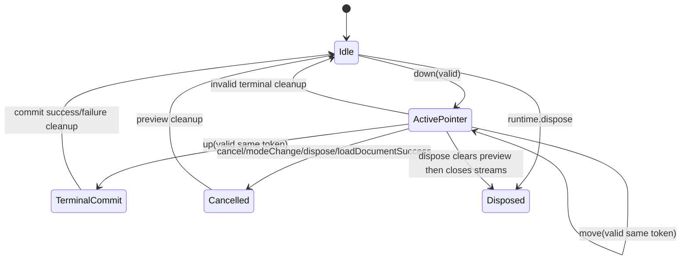

<!-- CONTEXT:BEGIN -->
Registry id: `section_14_interaction_engine`
Registry source: `docs/_registry/sections.yaml`
Document path: `docs/contracts/interaction_engine.md`
Owns:
- 14. InteractionEngine
Must read before editing:
- `section_04_public_api_v1` -> `docs/contracts/public_api_v1.md`
- `section_11_edit_kernel` -> `docs/contracts/edit_kernel.md`
- `section_12_load_document` -> `docs/contracts/load_document.md`
- `section_15_frame_render_contract` -> `docs/contracts/frame_rendering.md`
- `section_16_geometry_policy` -> `docs/contracts/geometry.md`
Feeds phases:
- `P9`
- `P10`
Related donors:
- `interaction_pointer_host`
- `interaction_pointer_session`
- `interaction_pointer_normalizer`
- `interaction_event_dispatcher`
- `interaction_double_tap_router`
- `interaction_gesture_runtime`
- `interaction_move_session`
- `interaction_draw_coordinator`
- `interaction_mutation_boundary`
Related diagrams:
- `dfd_pointer_preview_commit`
- `seq_selected_move_preview_commit`
- `seq_selected_move_cancel`
- `seq_marquee_select`
- `seq_pencil_marker_commit`
- `seq_line_two_tap_commit`
- `seq_eraser_commit`
- `seq_text_edit_request`
- `seq_dispose_during_gesture`
- `state_pointer_session`
- `state_select_marquee`
- `state_selected_move`
- `state_pencil_marker_draw`
- `state_two_tap_line`
- `state_eraser`
- `state_pending_text_edit_request`
Required tests:
- `test.events.typed_action_payloads`
- `test.events.commands_emit_user_actions`
- `test.surface.interactive_false_pointer_routing`
- `test.surface.interactive_false_active_session_cancel`
- `test.surface.pointer_adapter_finite_normalization`
- `test.interaction.state_machines`
- `test.interaction.move_resolver_reentrancy`
- `test.interaction.move_resolver_not_called_on_cancel_cleanup`
- `test.interaction.no_stale_terminal_commit`
- `test.surface.widget_paint`
Guardrails:
- `preview.selected_move_main_repaint`
- `load.prepares_before_interrupt`
- `load.success_interrupts_before_install`
- `interaction.no_concrete_store_imports`
- `interaction.no_resolver_on_cancel_paths`
- `interaction.no_stale_terminal_commit`
- `surface.pointer_samples_normalized_before_runtime`
Do not assume:
- no legacy callback graph as structure
- no reentrant mutation from resolver
<!-- CONTEXT:END -->

## 14. InteractionEngine

### 14.1 Pointer session lifecycle



Rules:

```text
- one active routed pointer per runtime;
- pointerId is a routing token only;
- concurrent pointer sessions are not supported in v1;
- raw pointer routing belongs to Flutter bridge;
- InteractionEngine receives normalized CanvasPointerSample;
- stale pointer token samples are ignored except terminal cleanup;
- terminal exception clears preview and schedules correct repaint;
- committed facts for gesture decisions are read through narrow read-only
  interaction query ports;
- interaction query results are immutable, intent-specific facts and never
  expose store tables or mutation methods;
- InteractionEngine commits only through EditKernel.
```

### 14.2 Preview repaint target

| Preview kind | Repaint target |
|---|---|
| marquee | overlay only |
| pencil stroke | overlay only |
| marker stroke | overlay only |
| pending line start | overlay only |
| line preview | overlay only |
| eraser corridor | overlay only |
| selected move preview | main scene only |

This is mandatory. The legacy selected move preview uses main-scene repaint
through selected supplement staging; next behavior must preserve that functional
result.

### 14.3 Text double-tap

Double-tap on a visible selectable text element emits `CanvasTextEditRequested`. It does not mutate document and does not select/deselect by itself.

---
