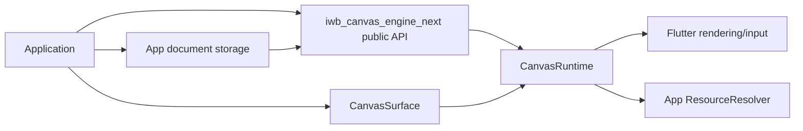
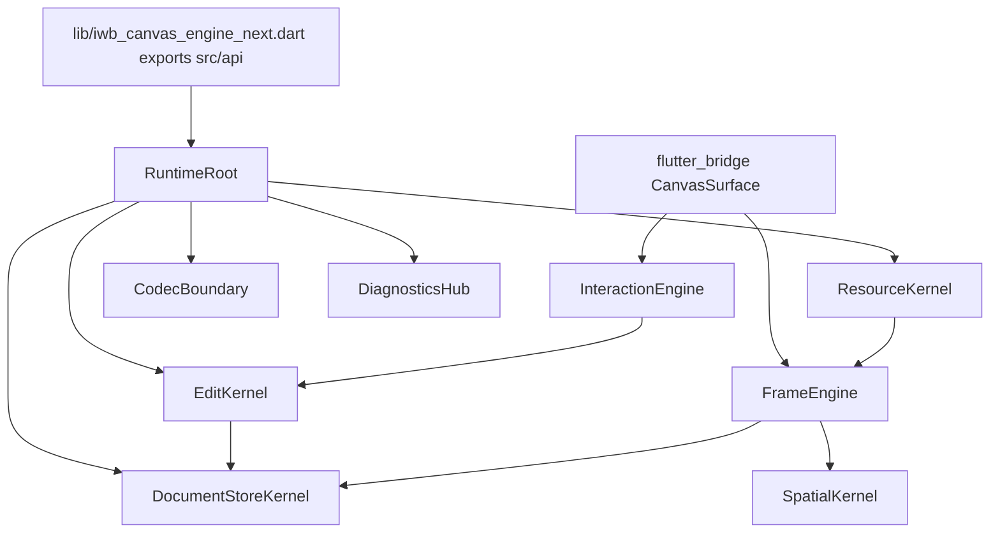

<!-- CONTEXT:BEGIN -->
Registry id: `section_21_diagrams`
Registry source: `docs/split/_registry/sections.yaml`
Document path: `docs/split/architecture/diagrams.md`
Owns:
- 21. Diagram deliverables
Must read before editing:
- `section_02_architecture_model` -> `docs/split/architecture/01_runtime_ownership.md`
- `section_11_edit_kernel` -> `docs/split/contracts/edit_kernel.md`
- `section_14_interaction_engine` -> `docs/split/contracts/interaction_engine.md`
- `section_15_frame_render_contract` -> `docs/split/contracts/frame_rendering.md`
- `section_25_migration_tool` -> `docs/split/contracts/migration_tool.md`
Depends on:
- `section_02_architecture_model` -> `docs/split/architecture/01_runtime_ownership.md`
- `section_11_edit_kernel` -> `docs/split/contracts/edit_kernel.md`
- `section_14_interaction_engine` -> `docs/split/contracts/interaction_engine.md`
- `section_15_frame_render_contract` -> `docs/split/contracts/frame_rendering.md`
- `section_25_migration_tool` -> `docs/split/contracts/migration_tool.md`
Feeds phases:
- `P0`
- `P12`
Related donors:
- `none`
Related diagrams:
- `docs/split/diagrams/README.md#c4_context` -> `docs/split/diagrams/generated/c4_context.mmd`
- `docs/split/diagrams/README.md#c4_container` -> `docs/split/diagrams/generated/c4_container.mmd`
- `docs/split/diagrams/README.md#c4_component_runtime` -> `docs/split/diagrams/generated/c4_component_runtime.mmd`
- `docs/split/diagrams/README.md#c4_code_edit_kernel` -> `docs/split/diagrams/generated/c4_code_edit_kernel.mmd`
- `docs/split/diagrams/README.md#dfd_public_edit` -> `docs/split/diagrams/generated/dfd_public_edit.mmd`
- `docs/split/diagrams/README.md#dfd_load_document_success_failure` -> `docs/split/diagrams/generated/dfd_load_document_success_failure.mmd`
- `docs/split/diagrams/README.md#dfd_pointer_preview_commit` -> `docs/split/diagrams/generated/dfd_pointer_preview_commit.mmd`
- `docs/split/diagrams/README.md#dfd_main_paint_frame` -> `docs/split/diagrams/generated/dfd_main_paint_frame.mmd`
- `docs/split/diagrams/README.md#dfd_overlay_frame` -> `docs/split/diagrams/generated/dfd_overlay_frame.mmd`
- `docs/split/diagrams/README.md#dfd_resource_resolution` -> `docs/split/diagrams/generated/dfd_resource_resolution.mmd`
- `docs/split/diagrams/README.md#dfd_schema_v1_decode_encode` -> `docs/split/diagrams/generated/dfd_schema_v1_decode_encode.mmd`
- `docs/split/diagrams/README.md#dfd_cache_invalidation` -> `docs/split/diagrams/generated/dfd_cache_invalidation.mmd`
- `docs/split/diagrams/README.md#dfd_diagnostics_error_projection` -> `docs/split/diagrams/generated/dfd_diagnostics_error_projection.mmd`
- `docs/split/diagrams/README.md#dfd_migration_tool` -> `docs/split/diagrams/generated/dfd_migration_tool.mmd`
- `docs/split/diagrams/README.md#seq_edit_success` -> `docs/split/diagrams/generated/seq_edit_success.mmd`
- `docs/split/diagrams/README.md#seq_edit_rollback` -> `docs/split/diagrams/generated/seq_edit_rollback.mmd`
- `docs/split/diagrams/README.md#seq_load_document_success` -> `docs/split/diagrams/generated/seq_load_document_success.mmd`
- `docs/split/diagrams/README.md#seq_load_document_failure` -> `docs/split/diagrams/generated/seq_load_document_failure.mmd`
- `docs/split/diagrams/README.md#seq_selected_move_preview_commit` -> `docs/split/diagrams/generated/seq_selected_move_preview_commit.mmd`
- `docs/split/diagrams/README.md#seq_selected_move_cancel` -> `docs/split/diagrams/generated/seq_selected_move_cancel.mmd`
- `docs/split/diagrams/README.md#seq_marquee_select` -> `docs/split/diagrams/generated/seq_marquee_select.mmd`
- `docs/split/diagrams/README.md#seq_pencil_marker_commit` -> `docs/split/diagrams/generated/seq_pencil_marker_commit.mmd`
- `docs/split/diagrams/README.md#seq_line_two_tap_commit` -> `docs/split/diagrams/generated/seq_line_two_tap_commit.mmd`
- `docs/split/diagrams/README.md#seq_eraser_commit` -> `docs/split/diagrams/generated/seq_eraser_commit.mmd`
- `docs/split/diagrams/README.md#seq_text_edit_request` -> `docs/split/diagrams/generated/seq_text_edit_request.mmd`
- `docs/split/diagrams/README.md#seq_main_paint` -> `docs/split/diagrams/generated/seq_main_paint.mmd`
- `docs/split/diagrams/README.md#seq_overlay_paint` -> `docs/split/diagrams/generated/seq_overlay_paint.mmd`
- `docs/split/diagrams/README.md#seq_resource_resolution` -> `docs/split/diagrams/generated/seq_resource_resolution.mmd`
- `docs/split/diagrams/README.md#seq_dispose_during_gesture` -> `docs/split/diagrams/generated/seq_dispose_during_gesture.mmd`
- `docs/split/diagrams/README.md#state_runtime_lifecycle` -> `docs/split/diagrams/generated/state_runtime_lifecycle.mmd`
- `docs/split/diagrams/README.md#state_edit_session` -> `docs/split/diagrams/generated/state_edit_session.mmd`
- `docs/split/diagrams/README.md#state_pointer_session` -> `docs/split/diagrams/generated/state_pointer_session.mmd`
- `docs/split/diagrams/README.md#state_select_marquee` -> `docs/split/diagrams/generated/state_select_marquee.mmd`
- `docs/split/diagrams/README.md#state_selected_move` -> `docs/split/diagrams/generated/state_selected_move.mmd`
- `docs/split/diagrams/README.md#state_pencil_marker_draw` -> `docs/split/diagrams/generated/state_pencil_marker_draw.mmd`
- `docs/split/diagrams/README.md#state_two_tap_line` -> `docs/split/diagrams/generated/state_two_tap_line.mmd`
- `docs/split/diagrams/README.md#state_eraser` -> `docs/split/diagrams/generated/state_eraser.mmd`
- `docs/split/diagrams/README.md#state_pending_text_edit_request` -> `docs/split/diagrams/generated/state_pending_text_edit_request.mmd`
- `docs/split/diagrams/README.md#state_resource_resolution` -> `docs/split/diagrams/generated/state_resource_resolution.mmd`
Required tests:
- `test.diagrams.required_present`
Guardrails:
- `diagrams.all_required_present`
Do not assume:
- no architecture change without diagram catalog update
<!-- CONTEXT:END -->

<!-- ORIGINAL-SECTION:BEGIN -->
## 21. Diagram deliverables

All diagrams below are required files under `docs/split/diagrams/generated/` and must be regenerated when architecture changes.

### 21.1 C4 diagrams

`c4_context.mmd`:



`c4_container.mmd`:



`c4_component_runtime.mmd` must show all runtime owners and their allowed dependencies.

`c4_code_edit_kernel.mmd` must show `EditSession`, `DraftDocument`, `TouchedSet`, `CommitPlan`, `CommitApplier`.

### 21.2 Data flow diagrams

Required DFD files:

```text
dfd_public_edit.mmd
dfd_load_document_success_failure.mmd
dfd_pointer_preview_commit.mmd
dfd_main_paint_frame.mmd
dfd_overlay_frame.mmd
dfd_resource_resolution.mmd
dfd_schema_v1_decode_encode.mmd
dfd_cache_invalidation.mmd
dfd_diagnostics_error_projection.mmd
dfd_migration_tool.mmd
```

### 21.3 Sequence diagrams

Required sequence diagrams:

```text
seq_edit_success.mmd
seq_edit_rollback.mmd
seq_load_document_success.mmd
seq_load_document_failure.mmd
seq_selected_move_preview_commit.mmd
seq_selected_move_cancel.mmd
seq_marquee_select.mmd
seq_pencil_marker_commit.mmd
seq_line_two_tap_commit.mmd
seq_eraser_commit.mmd
seq_text_edit_request.mmd
seq_main_paint.mmd
seq_overlay_paint.mmd
seq_resource_resolution.mmd
seq_dispose_during_gesture.mmd
```

### 21.4 State diagrams

Required state diagrams:

```text
state_runtime_lifecycle.mmd
state_edit_session.mmd
state_pointer_session.mmd
state_select_marquee.mmd
state_selected_move.mmd
state_pencil_marker_draw.mmd
state_two_tap_line.mmd
state_eraser.mmd
state_pending_text_edit_request.mmd
state_resource_resolution.mmd
```

---

<!-- ORIGINAL-SECTION:END -->
