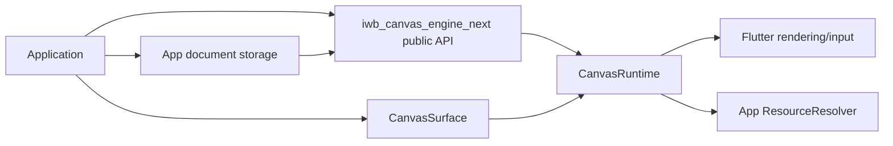
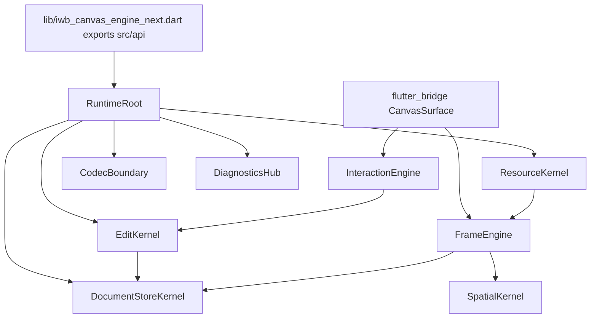

<!-- CONTEXT:BEGIN -->
Registry id: `section_21_diagrams`
Registry source: `docs/split/_registry/sections.yaml`
Document path: `docs/split/architecture/diagrams.md`
Owns:
- 21. Diagram deliverables
Must read before editing:
- `section_02_architecture_model` -> `docs/split/architecture/01_runtime_ownership.md`
- `section_11_edit_kernel` -> `docs/split/contracts/edit_kernel.md`
- `section_14_interaction_engine` -> `docs/split/contracts/interaction_engine.md`
- `section_15_frame_render_contract` -> `docs/split/contracts/frame_rendering.md`
- `section_25_migration_tool` -> `docs/split/contracts/migration_tool.md`
Feeds phases:
- `P0`
- `P12`
Related donors:
- `none`
Related diagrams:
- `c4_context`
- `c4_container`
- `c4_component_runtime`
- `c4_code_edit_kernel`
- `dfd_public_edit`
- `dfd_load_document_success_failure`
- `dfd_pointer_preview_commit`
- `dfd_main_paint_frame`
- `dfd_overlay_frame`
- `dfd_resource_resolution`
- `dfd_schema_v1_decode_encode`
- `dfd_cache_invalidation`
- `dfd_diagnostics_error_projection`
- `dfd_migration_tool`
- `seq_edit_success`
- `seq_edit_rollback`
- `seq_load_document_success`
- `seq_load_document_failure`
- `seq_selected_move_preview_commit`
- `seq_selected_move_cancel`
- `seq_marquee_select`
- `seq_pencil_marker_commit`
- `seq_line_two_tap_commit`
- `seq_eraser_commit`
- `seq_text_edit_request`
- `seq_main_paint`
- `seq_overlay_paint`
- `seq_resource_resolution`
- `seq_dispose_during_gesture`
- `state_runtime_lifecycle`
- `state_edit_session`
- `state_pointer_session`
- `state_select_marquee`
- `state_selected_move`
- `state_pencil_marker_draw`
- `state_two_tap_line`
- `state_eraser`
- `state_pending_text_edit_request`
- `state_resource_resolution`
Required tests:
- `test.diagrams.required_present`
Guardrails:
- `diagrams.all_required_present`
Do not assume:
- no architecture change without diagram catalog update
<!-- CONTEXT:END -->

## 21. Diagram deliverables

All diagrams below are required files under `docs/split/diagrams/generated/` and must be regenerated when architecture changes.

### 21.1 C4 diagrams

`c4_context.mmd`:



`c4_container.mmd`:



`c4_component_runtime.mmd` must show all runtime owners and their allowed dependencies.

`c4_code_edit_kernel.mmd` must show `EditSession`, `DraftDocument`, `TouchedSet`, `CommitPlan`, `CommitApplier`.

### 21.2 Data flow diagrams

Required DFD files:

```text
dfd_public_edit.mmd
dfd_load_document_success_failure.mmd
dfd_pointer_preview_commit.mmd
dfd_main_paint_frame.mmd
dfd_overlay_frame.mmd
dfd_resource_resolution.mmd
dfd_schema_v1_decode_encode.mmd
dfd_cache_invalidation.mmd
dfd_diagnostics_error_projection.mmd
dfd_migration_tool.mmd
```

### 21.3 Sequence diagrams

Required sequence diagrams:

```text
seq_edit_success.mmd
seq_edit_rollback.mmd
seq_load_document_success.mmd
seq_load_document_failure.mmd
seq_selected_move_preview_commit.mmd
seq_selected_move_cancel.mmd
seq_marquee_select.mmd
seq_pencil_marker_commit.mmd
seq_line_two_tap_commit.mmd
seq_eraser_commit.mmd
seq_text_edit_request.mmd
seq_main_paint.mmd
seq_overlay_paint.mmd
seq_resource_resolution.mmd
seq_dispose_during_gesture.mmd
```

### 21.4 State diagrams

Required state diagrams:

```text
state_runtime_lifecycle.mmd
state_edit_session.mmd
state_pointer_session.mmd
state_select_marquee.mmd
state_selected_move.mmd
state_pencil_marker_draw.mmd
state_two_tap_line.mmd
state_eraser.mmd
state_pending_text_edit_request.mmd
state_resource_resolution.mmd
```

---

