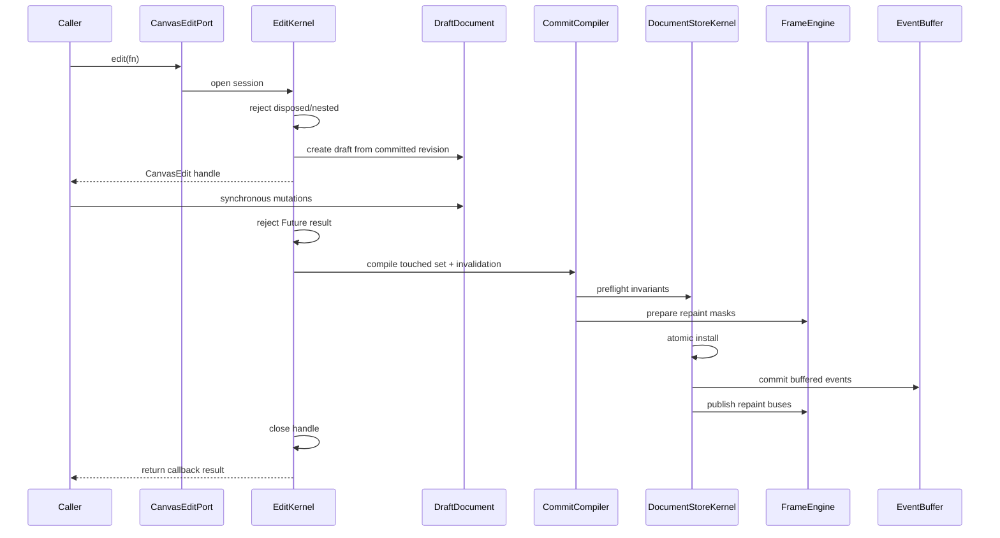
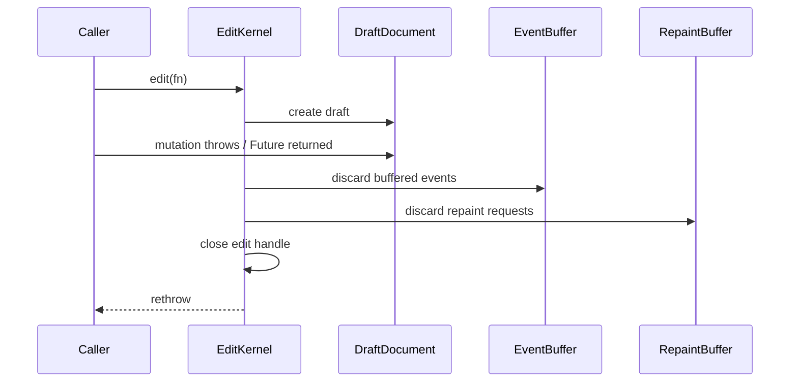

<!-- CONTEXT:BEGIN -->
Registry id: `section_11_edit_kernel`
Source: `docs/split/_registry/sections.yaml / section 11`
Canonical source: `docs/split/_registry/sections.yaml`
Owns:
- 11. EditKernel implementation contract
Must read before editing:
- `section_04_public_api_v1`
- `section_10_runtime_data_model`
- `section_12_load_document`
- `section_13_operation_matrix`
Depends on:
- `section_04_public_api_v1`
- `section_10_runtime_data_model`
- `section_12_load_document`
- `section_13_operation_matrix`
Feeds phases:
- `P6`
Related donors:
- `interaction_mutation_boundary`
- `staged_load_runtime_materialization`
- `validated_import_draft`
- `dto_document_helpers`
Related diagrams:
- docs/split/diagrams/README.md#c4_code_edit_kernel -> docs/split/diagrams/generated/c4_code_edit_kernel.mmd
- docs/split/diagrams/README.md#dfd_public_edit -> docs/split/diagrams/generated/dfd_public_edit.mmd
- docs/split/diagrams/README.md#seq_edit_success -> docs/split/diagrams/generated/seq_edit_success.mmd
- docs/split/diagrams/README.md#seq_edit_rollback -> docs/split/diagrams/generated/seq_edit_rollback.mmd
- docs/split/diagrams/README.md#state_edit_session -> docs/split/diagrams/generated/state_edit_session.mmd
Required tests:
- `test.events.low_level_mutations_do_not_emit_actions`
- `test.edit_kernel.sync_non_nested_async_stale`
- `test.edit_kernel.rollback`
Guardrails:
- `edit.sync_non_nested`
- `edit.rollback_no_effects`
- `edit.stale_handle_rejected`
- `events.low_level_edit_no_user_actions`
Do not infer:
- no old SceneWriteTxn
- no old controller shell
- no async nested edit
<!-- CONTEXT:END -->

<!-- ORIGINAL-SECTION:BEGIN -->
## 11. EditKernel implementation contract

### 11.1 Write sequence



### 11.2 Rollback sequence



Rollback obligations:

```text
- committed document identity unchanged;
- all revisions unchanged;
- projection cache unchanged;
- spatial index unchanged;
- resource cache unchanged;
- selection unchanged;
- preview unchanged unless the public operation itself was a successful external mutation;
- no actions emitted;
- no text edit event emitted;
- no public notify;
- no scene repaint;
- no overlay repaint.
```

### 11.3 Touched set

```text
TouchedSet
  addedElementIds
  removedElementIds
  updatedElementIds
  transformedElementIds
  geometryChangedElementIds
  visualChangedElementIds
  resourceDescriptorChangedIds
  resourceVisualChangedIds
  layerOrderChanged
  backgroundLayerChanged
  selectionChanged
  cameraChanged
  backgroundChanged
  gridChanged
  paletteChanged
  documentReplaced
```

CommitCompiler must produce exact invalidation. Generic global invalidation is forbidden except `documentReplaced`.

---

<!-- ORIGINAL-SECTION:END -->
