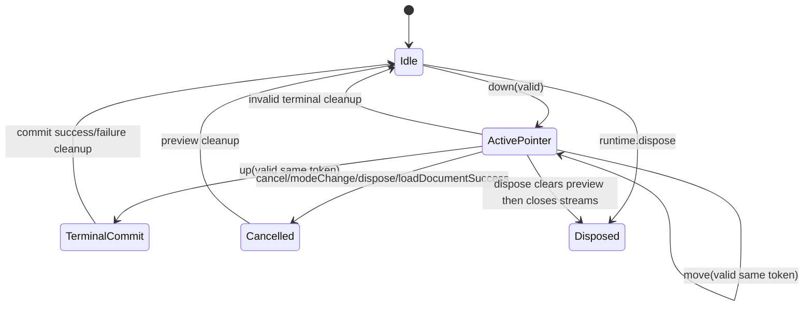

<!-- CONTEXT:BEGIN -->
Registry id: `section_14_interaction_engine`
Source: `iwb_canvas_engine_next_full_implementation_plan_v2.md / section 14`
Canonical original: `docs/iwb_canvas_engine_next_full_implementation_plan_v2.md`
Owns:
- 14. InteractionEngine
Must read before editing:
- `section_04_public_api_v1`
- `section_11_edit_kernel`
- `section_12_load_document`
- `section_15_frame_render_contract`
- `section_16_geometry_policy`
Depends on:
- `section_04_public_api_v1`
- `section_11_edit_kernel`
- `section_12_load_document`
- `section_15_frame_render_contract`
- `section_16_geometry_policy`
Feeds phases:
- `P9`
- `P10`
Related donors:
- `interaction_pointer_host`
- `interaction_pointer_session`
- `interaction_pointer_normalizer`
- `interaction_event_dispatcher`
- `interaction_double_tap_router`
- `interaction_gesture_runtime`
- `interaction_move_session`
- `interaction_draw_coordinator`
- `interaction_mutation_boundary`
Related diagrams:
- docs/split/diagrams/README.md#dfd_pointer_preview_commit -> tool/diagrams/dfd_pointer_preview_commit.mmd
- docs/split/diagrams/README.md#seq_selected_move_preview_commit -> tool/diagrams/seq_selected_move_preview_commit.mmd
- docs/split/diagrams/README.md#seq_selected_move_cancel -> tool/diagrams/seq_selected_move_cancel.mmd
- docs/split/diagrams/README.md#seq_marquee_select -> tool/diagrams/seq_marquee_select.mmd
- docs/split/diagrams/README.md#seq_pencil_marker_commit -> tool/diagrams/seq_pencil_marker_commit.mmd
- docs/split/diagrams/README.md#seq_line_two_tap_commit -> tool/diagrams/seq_line_two_tap_commit.mmd
- docs/split/diagrams/README.md#seq_eraser_commit -> tool/diagrams/seq_eraser_commit.mmd
- docs/split/diagrams/README.md#seq_text_edit_request -> tool/diagrams/seq_text_edit_request.mmd
- docs/split/diagrams/README.md#seq_dispose_during_gesture -> tool/diagrams/seq_dispose_during_gesture.mmd
- docs/split/diagrams/README.md#state_pointer_session -> tool/diagrams/state_pointer_session.mmd
- docs/split/diagrams/README.md#state_select_marquee -> tool/diagrams/state_select_marquee.mmd
- docs/split/diagrams/README.md#state_selected_move -> tool/diagrams/state_selected_move.mmd
- docs/split/diagrams/README.md#state_pencil_marker_draw -> tool/diagrams/state_pencil_marker_draw.mmd
- docs/split/diagrams/README.md#state_two_tap_line -> tool/diagrams/state_two_tap_line.mmd
- docs/split/diagrams/README.md#state_eraser -> tool/diagrams/state_eraser.mmd
- docs/split/diagrams/README.md#state_pending_text_edit_request -> tool/diagrams/state_pending_text_edit_request.mmd
Required tests:
- `test.events.typed_action_payloads`
- `test.events.commands_emit_user_actions`
- `test.surface.interactive_false_pointer_routing`
- `test.surface.interactive_false_active_session_cancel`
- `test.interaction.state_machines`
- `test.interaction.move_resolver_reentrancy`
- `test.surface.widget_paint`
Guardrails:
- `preview.selected_move_main_repaint`
- `load.prepares_before_interrupt`
- `load.success_interrupts_before_install`
Do not infer:
- no old callback graph as structure
- no reentrant mutation from resolver
<!-- CONTEXT:END -->

<!-- ORIGINAL-SECTION:BEGIN -->
## 14. InteractionEngine

### 14.1 Pointer session lifecycle



Rules:

```text
- one active routed pointer per runtime;
- pointerId is a routing token only;
- concurrent pointer sessions are not supported in v1;
- raw pointer routing belongs to Flutter bridge;
- InteractionEngine receives normalized CanvasPointerSample;
- stale pointer token samples are ignored except terminal cleanup;
- terminal exception clears preview and schedules correct repaint;
- InteractionEngine commits only through EditKernel.
```

### 14.2 Preview repaint target

| Preview kind | Repaint target |
|---|---|
| marquee | overlay only |
| pencil stroke | overlay only |
| marker stroke | overlay only |
| pending line start | overlay only |
| line preview | overlay only |
| eraser corridor | overlay only |
| selected move preview | main scene only |

This is mandatory. The old selected move preview uses main-scene repaint through selected supplement staging; new behavior must preserve that functional result.

### 14.3 Text double-tap

Double-tap on a visible selectable text element emits `CanvasTextEditRequested`. It does not mutate document and does not select/deselect by itself.

---

<!-- ORIGINAL-SECTION:END -->
