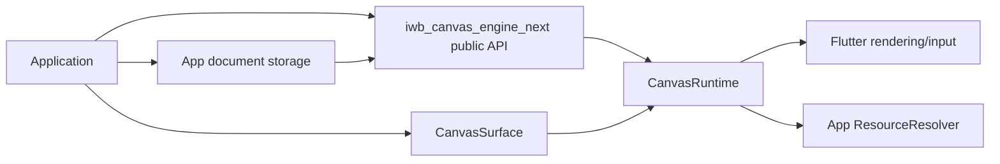
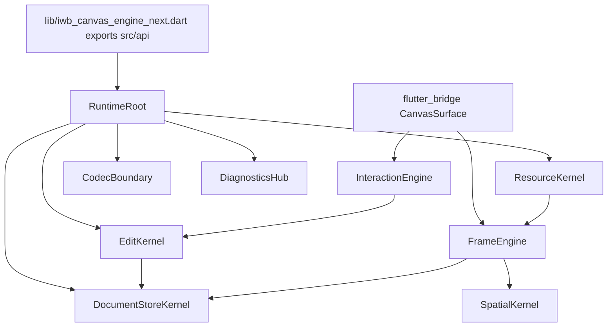

<!-- CONTEXT:BEGIN -->
Registry id: `section_21_diagrams`
Source: `iwb_canvas_engine_next_full_implementation_plan_v2.md / section 21`
Canonical original: `docs/iwb_canvas_engine_next_full_implementation_plan_v2.md`
Owns:
- 21. Diagram deliverables
Must read before editing:
- `section_02_architecture_model`
- `section_11_edit_kernel`
- `section_14_interaction_engine`
- `section_15_frame_render_contract`
- `section_25_migration_tool`
Depends on:
- `section_02_architecture_model`
- `section_11_edit_kernel`
- `section_14_interaction_engine`
- `section_15_frame_render_contract`
- `section_25_migration_tool`
Feeds phases:
- `P0`
- `P12`
Related donors:
- `none`
Related diagrams:
- docs/split/diagrams/README.md#c4_context -> tool/diagrams/c4_context.mmd
- docs/split/diagrams/README.md#c4_container -> tool/diagrams/c4_container.mmd
- docs/split/diagrams/README.md#c4_component_runtime -> tool/diagrams/c4_component_runtime.mmd
- docs/split/diagrams/README.md#c4_code_edit_kernel -> tool/diagrams/c4_code_edit_kernel.mmd
- docs/split/diagrams/README.md#dfd_public_edit -> tool/diagrams/dfd_public_edit.mmd
- docs/split/diagrams/README.md#dfd_load_document_success_failure -> tool/diagrams/dfd_load_document_success_failure.mmd
- docs/split/diagrams/README.md#dfd_pointer_preview_commit -> tool/diagrams/dfd_pointer_preview_commit.mmd
- docs/split/diagrams/README.md#dfd_main_paint_frame -> tool/diagrams/dfd_main_paint_frame.mmd
- docs/split/diagrams/README.md#dfd_overlay_frame -> tool/diagrams/dfd_overlay_frame.mmd
- docs/split/diagrams/README.md#dfd_resource_resolution -> tool/diagrams/dfd_resource_resolution.mmd
- docs/split/diagrams/README.md#dfd_schema_v1_decode_encode -> tool/diagrams/dfd_schema_v1_decode_encode.mmd
- docs/split/diagrams/README.md#dfd_cache_invalidation -> tool/diagrams/dfd_cache_invalidation.mmd
- docs/split/diagrams/README.md#dfd_diagnostics_error_projection -> tool/diagrams/dfd_diagnostics_error_projection.mmd
- docs/split/diagrams/README.md#dfd_migration_tool -> tool/diagrams/dfd_migration_tool.mmd
- docs/split/diagrams/README.md#seq_edit_success -> tool/diagrams/seq_edit_success.mmd
- docs/split/diagrams/README.md#seq_edit_rollback -> tool/diagrams/seq_edit_rollback.mmd
- docs/split/diagrams/README.md#seq_load_document_success -> tool/diagrams/seq_load_document_success.mmd
- docs/split/diagrams/README.md#seq_load_document_failure -> tool/diagrams/seq_load_document_failure.mmd
- docs/split/diagrams/README.md#seq_selected_move_preview_commit -> tool/diagrams/seq_selected_move_preview_commit.mmd
- docs/split/diagrams/README.md#seq_selected_move_cancel -> tool/diagrams/seq_selected_move_cancel.mmd
- docs/split/diagrams/README.md#seq_marquee_select -> tool/diagrams/seq_marquee_select.mmd
- docs/split/diagrams/README.md#seq_pencil_marker_commit -> tool/diagrams/seq_pencil_marker_commit.mmd
- docs/split/diagrams/README.md#seq_line_two_tap_commit -> tool/diagrams/seq_line_two_tap_commit.mmd
- docs/split/diagrams/README.md#seq_eraser_commit -> tool/diagrams/seq_eraser_commit.mmd
- docs/split/diagrams/README.md#seq_text_edit_request -> tool/diagrams/seq_text_edit_request.mmd
- docs/split/diagrams/README.md#seq_main_paint -> tool/diagrams/seq_main_paint.mmd
- docs/split/diagrams/README.md#seq_overlay_paint -> tool/diagrams/seq_overlay_paint.mmd
- docs/split/diagrams/README.md#seq_resource_resolution -> tool/diagrams/seq_resource_resolution.mmd
- docs/split/diagrams/README.md#seq_dispose_during_gesture -> tool/diagrams/seq_dispose_during_gesture.mmd
- docs/split/diagrams/README.md#state_runtime_lifecycle -> tool/diagrams/state_runtime_lifecycle.mmd
- docs/split/diagrams/README.md#state_edit_session -> tool/diagrams/state_edit_session.mmd
- docs/split/diagrams/README.md#state_pointer_session -> tool/diagrams/state_pointer_session.mmd
- docs/split/diagrams/README.md#state_select_marquee -> tool/diagrams/state_select_marquee.mmd
- docs/split/diagrams/README.md#state_selected_move -> tool/diagrams/state_selected_move.mmd
- docs/split/diagrams/README.md#state_pencil_marker_draw -> tool/diagrams/state_pencil_marker_draw.mmd
- docs/split/diagrams/README.md#state_two_tap_line -> tool/diagrams/state_two_tap_line.mmd
- docs/split/diagrams/README.md#state_eraser -> tool/diagrams/state_eraser.mmd
- docs/split/diagrams/README.md#state_pending_text_edit_request -> tool/diagrams/state_pending_text_edit_request.mmd
- docs/split/diagrams/README.md#state_resource_resolution -> tool/diagrams/state_resource_resolution.mmd
Required tests:
- `test.diagrams.required_present`
Guardrails:
- `diagrams.all_required_present`
Do not infer:
- no architecture change without diagram catalog update
<!-- CONTEXT:END -->

<!-- ORIGINAL-SECTION:BEGIN -->
## 21. Diagram deliverables

All diagrams below are required files under `tool/diagrams/` and must be regenerated when architecture changes.

### 21.1 C4 diagrams

`c4_context.mmd`:



`c4_container.mmd`:



`c4_component_runtime.mmd` must show all runtime owners and their allowed dependencies.

`c4_code_edit_kernel.mmd` must show `EditSession`, `DraftDocument`, `TouchedSet`, `CommitPlan`, `CommitApplier`.

### 21.2 Data flow diagrams

Required DFD files:

```text
dfd_public_edit.mmd
dfd_load_document_success_failure.mmd
dfd_pointer_preview_commit.mmd
dfd_main_paint_frame.mmd
dfd_overlay_frame.mmd
dfd_resource_resolution.mmd
dfd_schema_v1_decode_encode.mmd
dfd_cache_invalidation.mmd
dfd_diagnostics_error_projection.mmd
dfd_migration_tool.mmd
```

### 21.3 Sequence diagrams

Required sequence diagrams:

```text
seq_edit_success.mmd
seq_edit_rollback.mmd
seq_load_document_success.mmd
seq_load_document_failure.mmd
seq_selected_move_preview_commit.mmd
seq_selected_move_cancel.mmd
seq_marquee_select.mmd
seq_pencil_marker_commit.mmd
seq_line_two_tap_commit.mmd
seq_eraser_commit.mmd
seq_text_edit_request.mmd
seq_main_paint.mmd
seq_overlay_paint.mmd
seq_resource_resolution.mmd
seq_dispose_during_gesture.mmd
```

### 21.4 State diagrams

Required state diagrams:

```text
state_runtime_lifecycle.mmd
state_edit_session.mmd
state_pointer_session.mmd
state_select_marquee.mmd
state_selected_move.mmd
state_pencil_marker_draw.mmd
state_two_tap_line.mmd
state_eraser.mmd
state_pending_text_edit_request.mmd
state_resource_resolution.mmd
```

---

<!-- ORIGINAL-SECTION:END -->
